## T2: A brick between planes - Solution

(a)

The brick is squeezed between the plates and constrained between the plates, so the normal force on the top and bottom surfaces of the brick must be equal.
Since the brick is moving relative to each plate, the kinetic friction vector on each surface must also be equal in magnitude, but in a direction given by the relative velocity of each plate with respect to the brick. Note that this statement is true whether the plates are moving at the same speed, or different speeds.
A simple vector diagram can illustrate the velocity vectors, the frictional force vectors, and the net force vector.
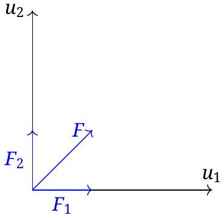

Then $\vec { a } = \vec { F } / m$, and after a time $\Delta t$ the new relative velocity vectors will be given by
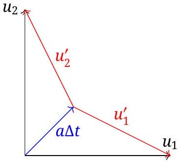

By symmetry, this continues so that the acceleration of the brick is always at 45 degrees, until eventually,

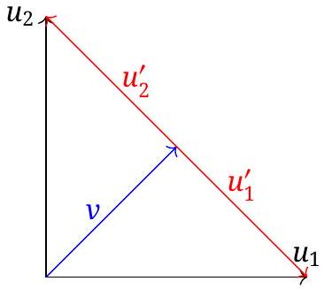
Figure 1: Vector diagram for solution of part (a)

As such, $v = u _ { 1 } / \sqrt { 2 }$.

| (a) | Pts |
| :--- | :--- |
| Use symmetry to find $u _ { 1 } ^ { \prime } = u _ { 2 } ^ { \prime }$. Must be stated! | 1.0 |
| $\vec { u } _ { 1 } ^ { \prime } = - \vec { u } _ { 2 } ^ { \prime }$ at steady state. Must be stated! | 1.0 |
| Vector diagram or algebraic equivalent Fig 1 | 1.0 |
| Correctly find $v$ | 1.0 |
| Total on (a) | 4.0 |

The two "must be stated" points above need some sort of clear justification, but does not need to be written out in sentences. Just using it in the vector diagram is not sufficient to earn the points.

Special case for students who solve part (b) first
A student who solves part (b) correctly, at least as far as required to solve part (a), and then uses it to write the answer for part (a) correctly will get full marks for part (a). A single trivial mistake in the application of a fully correct part (b) to part (a) will result in half marks for part (a). Trivial mistakes are a clearly identifiable sign error in an an algebra expression, or dropped coefficient between lines. Mistakes that make the answer dimensionally incorrect or physically improbable are not trivial, and would result in 0 marks for part (a).
A student who does not have full marks for part (b), but who used the results of part (b) that has incorrect physics to answer part (a), will get no marks for part (a), even if the answer to part (a) is correct.
(b)

Though the initial vector diagram for velocities looks different, the force components are still equal in magnitude, directed along the relative velocity vectors.
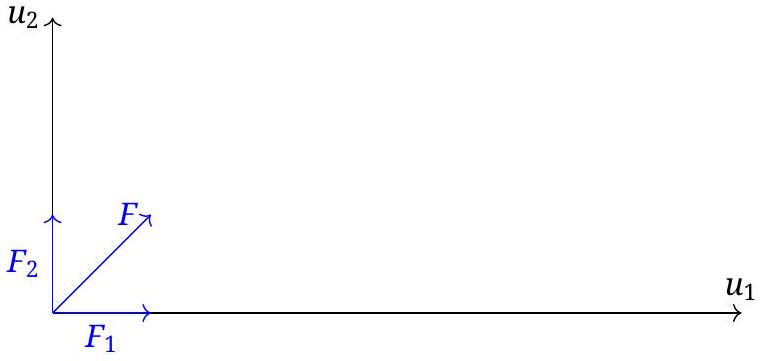

Then $\vec { a } = \vec { F } / m$, and after a time $\Delta t$ the new relative velocity vectors will be given by
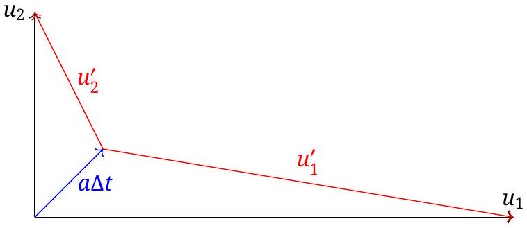

The process is repeated, where the direction of the net force is the angle bisector of the relative velocity vectors $\vec { u } _ { 1 } ^ { \prime }$ and $\vec { u } _ { 2 } ^ { \prime }$
As the quantity a $\Delta t$ is a small quantity compared to the magnitude of the velocity vectors, we can conclude that an equal amount is removed from each of the velocity vectors, so that magnitude comparison

$$
\begin{equation*}
u _ { 1 } - u _ { 2 } = u _ { 1 } ^ { \prime } - u _ { 2 } ^ { \prime } \tag{29}
\end{equation*}
$$

is a conserved quantity.
For the next step, the net force vector is still the angle bisector for $u _ { 1 }$ and $u _ { 2 }$. The above arguments will hold true for the conserved quantity, and then the final velocity can be found by

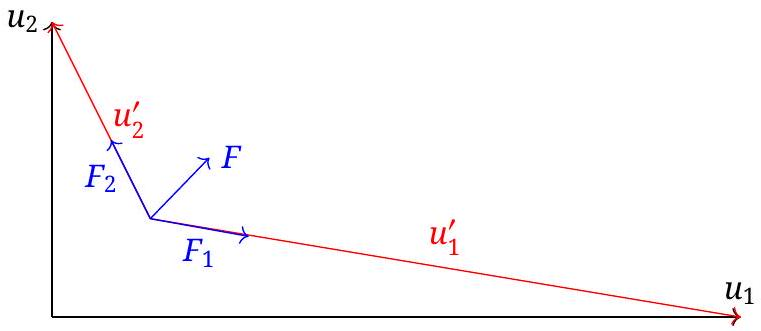
Figure 2: The correct construction to find direction of net force

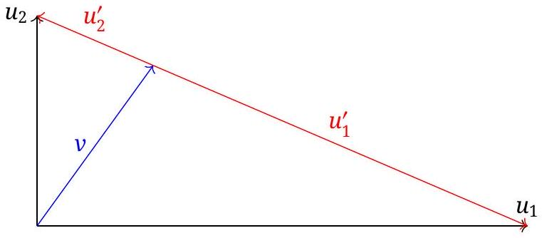
Figure 3: Vector diagram for solution of part (b)

Then

$$
\begin{equation*}
\left( u _ { 1 } ^ { \prime } + u _ { 2 } ^ { \prime } \right) ^ { 2 } = u _ { 1 } ^ { 2 } + u _ { 2 } ^ { 2 } = D ^ { 2 } \tag{30}
\end{equation*}
$$

and

$$
\begin{equation*}
u _ { 1 } ^ { \prime } - u _ { 2 } ^ { \prime } = u _ { 1 } - u _ { 2 } = \delta \tag{31}
\end{equation*}
$$

can be solved for $u _ { 1 } ^ { \prime }$ and $u _ { 2 } ^ { \prime }$, with

$$
u _ { 2 } ^ { \prime } = \frac { 1 } { 2 } ( D - \delta )
$$

and

$$
u _ { 1 } ^ { \prime } = \frac { 1 } { 2 } ( D + \delta )
$$

This gives the components of $v$ as

$$
\begin{equation*}
v _ { x } = \frac { u _ { 2 } ^ { \prime } } { D } u _ { 1 } = \frac { u _ { 1 } } { 2 } \left( 1 - \frac { \delta } { D } \right) \tag{32}
\end{equation*}
$$

and

$$
\begin{equation*}
v _ { y } = \frac { u _ { 1 } ^ { \prime } } { D } u _ { 2 } = \frac { u _ { 2 } } { 2 } \left( 1 + \frac { \delta } { D } \right) \tag{33}
\end{equation*}
$$

and the magnitude is

$$
\begin{equation*}
v = \frac { 1 } { 2 } \sqrt { D ^ { 2 } + \delta ^ { 2 } - 2 \frac { \delta } { D } \left( u _ { 1 } ^ { 2 } - u _ { 2 } ^ { 2 } \right) } \tag{34}
\end{equation*}
$$

Writing this in terms of $u _ { 1 }$ and $u _ { 2 }$ is left as an exercise for the reader.

$$
\begin{aligned}
v = \sqrt { \frac { 1 } { 2 } \left( u _ { 1 } ^ { 2 } + u _ { 2 } ^ { 2 } \right.} & \left. - u _ { 1 } u _ { 2 } - \frac { \left( u _ { 1 } - u _ { 2 } \right) ^ { 2 } \left( u _ { 1 } + u _ { 2 } \right) } { \sqrt { u _ { 1 } ^ { 2 } + u _ { 2 } ^ { 2 } } } \right) \\
& = \frac { 1 } { \sqrt { 2 } } \sqrt { u _ { 1 } u _ { 2 } - \left( u _ { 1 } - u _ { 2 } \right) ^ { 2 } \left( \frac { u _ { 1 } + u _ { 2 } } { \sqrt { u _ { 1 } ^ { 2 } + u _ { 2 } ^ { 2 } } } - 1 \right) }
\end{aligned}
$$

| (b) Scheme G1 | Pts |
| :--- | :--- |
| Show/explain that $\vec { a }$ is always angle bisector | 1.0 |
| Show that $\delta$ (Eq 29) is a constant of the motion | 1.0 |
| $\vec { u } _ { 1 } ^ { \prime }$ and $\vec { u } _ { 2 } ^ { \prime }$ are in opposite directions at steady state | 1.0 |
| Vector diagram for relative velocities Fig 3 | 1.0 |
| Apply $D$ (Eq 30) or equivalent | 0.2 |
| Apply $\delta$ (Eq 31) or equivalent | 0.2 |
| Correctly find $v _ { x }$ or $v _ { y }$ | 0.4 |
| Correctly find other one | 0.2 |
| Correctly find $v$ | 1.0 |
| Total on (b) | 6.0 |

A student who correctly finds $v$ without explicitly writing $v _ { x }$ and $v _ { y }$ will be assumed to have found $v _ { x }$ and $v _ { y }$ by applying $D$ and $\delta$ and should get those points.

An incorrect value for $v _ { x }$ or $v _ { y }$ or $v$ that is dimensionally correct and wrong only because of a math error will get half marks, but the math error must be clear.

Writing $v$ in an equivalent form of Eq. 34 but not in the final form in terms of $u _ { 1 }$ and $u _ { 2 }$ only receives only 0.6/1.0 points for last part.

## Possible Error Scenarios

Students who attempt graphical approach who have an error below should follow the grading scheme below.

1. Assuming that the direction of the frictional force is given by the vector sum of the relative velocities.
An example of the improper vector construction is shown in the following figure.
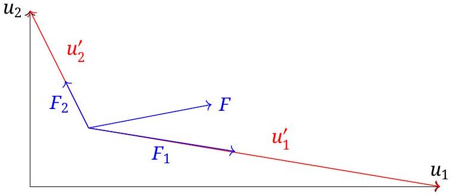
The immediate consequence is that Eq. 29 is no longer true. With quick inspection, the student should conclude that the final state must have $\vec { u } _ { 1 } = - \vec { u } _ { 2 }$, and then the graphical velocity picture would be, at steady state,
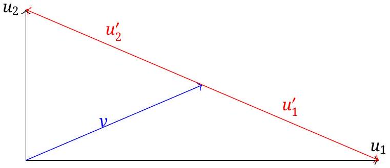

| (b) Scheme E1 | Pts |
| :--- | :--- |
| Vector diagram showing (incorrect!) force direction, or equivalent statement | 0.5 |
| A clear statement that the (incorrect) force direction depends on the vector sum of the relative velocities (see note below!) | 0.5 |
| Explicitly stating (incorrect!) $\vec { u } _ { 1 } ^ { \prime } = - \vec { u } _ { 2 } ^ { \prime }$ at steady state. | 0.5 |
| Vector diagram for steady state, or equivalent statement | 0.8 |
| Stating $v = \frac { 1 } { 2 } \sqrt { u _ { 1 } ^ { 2 } + u _ { 2 } ^ { 2 } }$ | 0.7 |
| Total on (b) | 3.0 |

There is no other partial credit possible for this approach.

Note: the student must demonstrate knowledge that the force is proportional to the relative velocity; if they only look at the force at the start of the problem, and never address what happens as the problem evolves, they don't get this 0.5 points.

2. Assuming that the direction of the final velocity is orthogonal to the vector difference of the velocities of the plates.
This scheme only applies when a student explicitly states that $v$ is perpendicular. Do not use this grading scheme if it is simply a vaguely drawn vector diagram.
It is true that the acceleration vector approaches the steady state orthogonal to the hypotenuse of the triangle, but not the final velocity. As such, the following vector diagram is wrong:
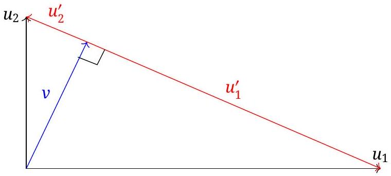
It is possible that the student started with some correct physics according to the original approach, and then makes the above assumption to finish the problem; it is also possible that they started with the perpendicular assumption.
If the only mistake is a bad final vector diagram with a perpendicular marking, but then did the algebra based on $D$ and $\delta$ then use the following:

| (b) Scheme E2A | Pts |
| :--- | :--- |
| Show/explain that $\vec { a }$ is always angle bisector | 1.0 |
| Show that $\delta$ (Eq 29) is a constant of the motion | 1.0 |
| $\vec { u } _ { 1 } ^ { \prime }$ and $\vec { u } _ { 2 } ^ { \prime }$ are in opposite directions at steady state | 1.0 |
| Vector diagram above (incorrect!) for relative velocities at steady state, or any statement that final $v$ is orthogonal. | 0.5 |
| Apply $D$ (Eq 30) or equivalent | 0.2 |
| Apply $\delta$ (Eq 31) or equivalent | 0.2 |
| Correctly find $v _ { x }$ | 0.3 |
| Correctly find $v _ { y }$ | 0.3 |
| Correctly find $v$ | 1.0 |
| Total on (b) | 5.5 |

A student who correctly finds $v$ without explicitly writing $v _ { x }$ and $v _ { y }$ will be assumed to have found $v _ { x }$ and $v _ { y }$ by applying $D$ and $\delta$ and should get those points.

An incorrect value for $v _ { x }$ or $v _ { y }$ or $v$ that is dimensionally correct and wrong only because of a math error will get half marks, but the math error must be clear.

Writing $v$ in an equivalent form of Eq. 34 but not in the final form in terms of $u _ { 1 }$ and $u _ { 2 }$ only receives only 0.6/1.0 points for last part.

If the mistake is that they used the perpendicular vector diagram to solve the problem, then their answers would be different, so use the following:

| (b) Scheme E2B | Pts |
| :--- | :--- |
| Show/explain that $\vec { a }$ is always angle bisector | 1.0 |
| Show that $\delta$ (Eq 29) is a constant of the motion | 1.0 |
| $\vec { u } _ { 1 } ^ { \prime }$ and $\vec { u } _ { 2 } ^ { \prime }$ are in opposite directions at steady state | 1.0 |
| Vector diagram above (incorrect!) for relative velocities at steady state, or any statement that final $v$ is orthogonal. | 0.5 |
| Find (incorrect!) $v = u _ { 1 } u _ { 2 } / \sqrt { u _ { 1 } ^ { 2 } + u _ { 2 } ^ { 2 } }$ | 1.0 |
| Total on (b) | 4.5 |

A dimensionally correct formula for $v$ that differs from above because of a single math error in a clear derivation based on the figure will get 0.5 out of 1.0 for the $v$.

3. Assuming that the final velocity is the average of the vector velocities of the plates.
Note that this approach yields the same result as a previous approach, but it is not worth as many points, as the fundamental physics starts from a higher level incorrect assumption. Here, the student is just assuming that the final speed is an average, in the previous approach the student

had an error in the direction of the forces. If they use forces, a previous grading scheme applies.
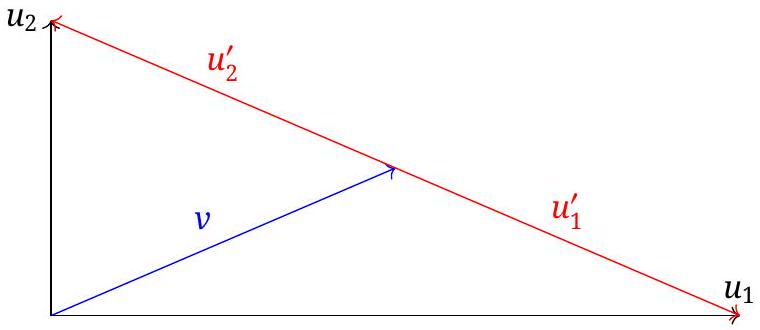

| (b) Scheme E3 | Pts |
| :--- | :--- |
| Explicity stating $\vec { u } _ { 1 } ^ { \prime }$ and $\vec { u } _ { 2 } ^ { \prime }$ are in opposite directions at steady state. | 1.0 |
| Vector diagram above | 0.5 |
| Stating $v = \frac { 1 } { 2 } \sqrt { u _ { 1 } ^ { 2 } + u _ { 2 } ^ { 2 } }$ | 0.5 |
| Total on (b) | 2.0 |

There is no other partial credit possible for this approach.

4. Assuming that the final velocity is the vector sum of the velocities of the plates.
Though very tempting, it violates so many requirements for a steady state solution that this is not worth very many points at all.
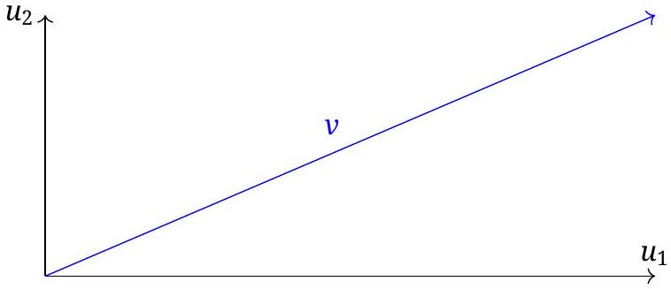

| (b) Scheme E4 | Pts |
| :--- | :--- |
| Vector diagram above | 0.5 |
| Total on (b) | 0.5 |

There are no points for finding an expression for $v$, as the method is just wrong.

## Alternative Approaches

Non-Cartesian Differential Equations Effectively a graphical approach without graphics, one can focus on the relative velocity vectors as coordinate axis. Then the important equations of motion are

$$
\begin{equation*}
\frac { d u _ { 1 r } } { d t } = - \frac { F } { m } \text { and } \frac { d u _ { 2 r } } { d t } = - \frac { F } { m } \tag{35}
\end{equation*}
$$

where the force magnitude $F$ is a function of the relative directions of the coordinate axes $\vec { u } _ { 1 r }$ and $\vec { u } _ { 2 r }$.

The student can quickly realize that the difference of these two expressions is zero, so that $\delta$ is a constant of the motion.

At steady state, $F = 0$, and this happens when $\vec { u } _ { 1 r }$ and $\vec { u } _ { 2 r }$ point in opposite directions.

| (b) Scheme A1 | Pts |
| :--- | :--- |
| A set of differential equations Eq35 | 1.0 |
| Show that $\delta$ (Eq 29) is a constant of the motion | 1.0 |
| $\vec { u } _ { 1 } ^ { \prime }$ and $\vec { u } _ { 2 } ^ { \prime }$ are in opposite directions at steady state | 1.0 |
| Equivalent math statement or diagram for steady state relative velocities Fig 3 | 1.0 |
| Apply $D$ (Eq 30) or equivalent | 0.2 |
| Apply $\delta$ (Eq 31) or equivalent | 0.2 |
| Correctly find $v _ { x }$ or $v _ { y }$ | 0.4 |
| Correctly find other one | 0.2 |
| Correctly find $v$ | 1.0 |
| Total on (b) | 6.0 |

A student who correctly finds $v$ without explicitly writing $v _ { x }$ and $v _ { y }$ will be assumed to have found $v _ { x }$ and $v _ { y }$ by applying $D$ and $\delta$ and should get those points.

An incorrect value for $v _ { x }$ or $v _ { y }$ or $v$ that is dimensionally correct and wrong only because of a math error will get half marks, but the math error must be clear.

Writing $v$ in an equivalent form of Eq. 34 but not in the final form in terms of $u _ { 1 }$ and $u _ { 2 }$ only receives only 0.6/1.0 points for last part.

Follow on errors are not allowed for first parts, as the math expressions are almost trivial. They are also not allowed for the algebraic part at the end; see possible mistakes above for possible scenarios where points could be awarded by writing an equivalent algebraic expression for the graphical approach.

Cartesian Differential Equations Attempting to set up equations of motions in a Cartesian system requires finding the direction of relative velocity of each surface. Assuming that $u _ { 1 }$ is in the $x$ direction and $u _ { 2 }$ is in the $y$ direction, and if the velocity components of the block are $v _ { x }$ and $v _ { y }$, the relative velocities of the planes are

$$
u _ { 1 r x } = u _ { 1 } - v _ { x } \text { and } u _ { 1 r y } = - v _ { y }
$$

and

$$
u _ { 2 r x } = - v _ { x } \text { and } u _ { 2 r y } = u _ { 2 } - v _ { y }
$$

The forces of friction from each plane are equal in magnitude and directed along the relative velocity vectors, so a steady state solution is when these two relative vectors are in opposite directions.

The force vectors then have components

$$
F _ { 1 x } = F \frac { u _ { 1 r x } } { u _ { 1 r } } \text { and } F _ { 1 y } = F \frac { u _ { 1 r y } } { u _ { 1 r } }
$$

and

$$
F _ { 2 x } = F \frac { u _ { 2 r x } } { u _ { 2 r } } \text { and } F _ { 2 y } = F \frac { u _ { 2 r y } } { u _ { 2 r } }
$$

This gives the following equation of motion for the block:

$$
\frac { d v _ { x } } { d t } = a _ { x } = \frac { F } { m } \left( \frac { u _ { 1 r x } } { u _ { 1 r } } + \frac { u _ { 2 r x } } { u _ { 2 r } } \right)
$$

and

$$
\frac { d v _ { y } } { d t } = a _ { y } = \frac { F } { m } \left( \frac { u _ { 1 r y } } { u _ { 1 r } } + \frac { u _ { 2 r y } } { u _ { 2 r } } \right)
$$

A student might have noticed that this is a nasty set of coupled differential equations.

Both of these have vanishing accelerations according to the same condition:

$$
u _ { 1 r x } ^ { 2 } u _ { 2 r y } ^ { 2 } = u _ { 2 r x } ^ { 2 } u _ { 1 r y } ^ { 2 }
$$

which is merely the statement that at steady state the two relative velocity vectors are in opposite directions. As this is still only one equation, it is not possible to find the steady state $v _ { x }$ and $v _ { y }$ from this alone. A simpler expression can be found, however,

$$
\begin{equation*}
u _ { 1 } u _ { 2 } = u _ { 1 } v _ { y } + u _ { 2 } v _ { x } . \tag{36}
\end{equation*}
$$

This, however, is merely the statement of the graphical vector diagram

Still, it is not possible to know where the vector $\vec { v }$ touches the line described by $\vec { u } _ { 1 } - \vec { u } _ { 2 }$.
This isn't the end, however. Consider

$$
u _ { 1 r } ^ { 2 } = u _ { 1 r x } ^ { 2 } + u _ { 1 r y } ^ { 2 }
$$

Taking the time derivative, one gets

$$
u _ { 1 r } \dot { u } _ { 1 r } = u _ { 1 r x } \dot { u } _ { 1 r x } + u _ { 1 r y } \dot { u } _ { 1 r y }
$$

Combine with the above, and

$$
u _ { 1 r } \dot { u } _ { 1 r } = - \frac { F } { m } \left( \frac { u _ { 1 r x } ^ { 2 } } { u _ { 1 r } } + \frac { u _ { 1 r x } u _ { 2 r x } } { u _ { 2 r } } + \frac { u _ { 1 r y } ^ { 2 } } { u _ { 1 r } } + \frac { u _ { 1 r y } u _ { 2 r y } } { u _ { 2 r } } \right)
$$

which means

$$
\dot { u } _ { 1 r } = - 1 - \frac { u _ { 1 r x } u _ { 2 r x } } { u _ { 1 r } u _ { 2 r } } - \frac { u _ { 1 r y } u _ { 2 r y } } { u _ { 1 r } u _ { 2 r } }
$$

Out of symmetry, an identical expression will be found for $\dot { u } _ { 2 r }$, which means that

$$
\begin{equation*}
\delta = u _ { 1 r } - u _ { 2 r } \tag{37}
\end{equation*}
$$

is a constant of the motion.
At this point, a student can apply the results of Eq 36 with this constant difference formula and solve for $v _ { x }$ and $v _ { y }$ as done in the first solution.
In the scheme below, finding the expression assumes found correctly and completely, and a student would get 0.2 points for (most) expressions. There are no partial points if the equation is wrong.
However, for the first four categories only (marked with an *, follow on errors are not penalized for work based on a previous mistake, assuming that it does not trivialize the result.

| (b) Scheme A2 | Pts |
| :--- | :--- |
| Expressions for relative velocity components (4 @ 0.2 each, *) | 0.8 |
| Expressions for force components (4 (@ 0.2 each, *) | 0.8 |
| Expressions for acceleration components (2 @ 0.2 each, *) | 0.4 |
| State a condition for steady state | 0.5 |
| Find equation for steady state or equivalent to Eq 36 (must not have relative velocity, or is incomplete, *) | 0.5 |
| Show that $\delta$ (Eq 37) is a constant of the motion (must be correct, regardless of follow on error) | 1.0 |
| Apply $D$ (Eq 30) or equivalent | 0.2 |
| Apply $\delta$ (Eq 31) or equivalent | 0.2 |
| Correctly find $v _ { x }$ or $v _ { y }$ | 0.4 |
| Correctly find other one | 0.2 |
| Correctly find $v$ | 1.0 |
| Total on (b) | 6.0 |

A student who correctly finds $v$ without explicitly writing $v _ { x }$ and $v _ { y }$ will be assumed to have found $v _ { x }$ and $v _ { y }$ by applying $D$ and $\delta$ and should get those points.
An incorrect value for $v _ { x }$ or $v _ { y }$ or $v$ that is dimensionally correct and wrong only because of a math error will get half marks, but the math error must be clear.
Writing $v$ in an equivalent form of Eq. 34 but not in the final form in terms of $u _ { 1 }$ and $u _ { 2 }$ only receives only 0.6/1.0 points for last part.
