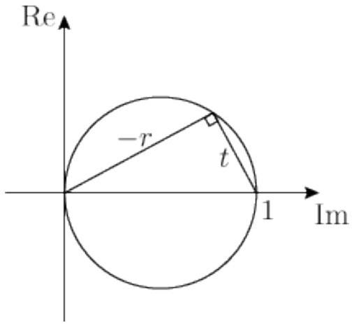
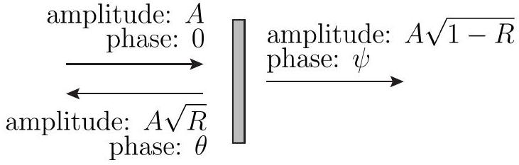
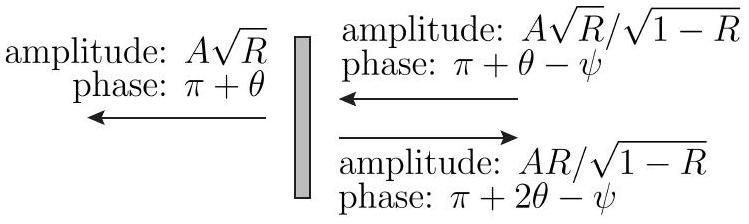
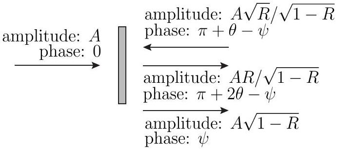

## T1: Sliding puck - Solution

When the puck moves along the wall, two forces (in addition to gravity and the normal force of the horizontal ground, which cancel each other out) act on it: the normal force of the wall (which changes the direction of motion of the puck) and the friction between the puck and the wall (which changes the speed of the puck and also causes the puck to start rotating).

So as the puck moves along the circular wall, the speed of the puck decreases and the angular velocity of the puck's rotation around its vertical axis increases. The motion of the puck is rolling with sliding along the wall. At a certain point in time $t _ { 1 }$, the contact point of the puck may have zero velocity and kinetic friction becomes static. From this point onwards, the puck will be rolling without sliding along the wall.

From the zero velocity of the contact point, we find the relationship $\omega = v / r$.

Let's focus on rolling with sliding first. The normal force $\vec { N }$ of the wall on the puck is also perpendicular to the velocity of the puck at any instantaneous position of the puck. Force $\vec { N }$ changes the direction of the velocity $\vec { v }$. From Newton's law in normal direction, we find $N = m v ^ { 2 } / R$, where $m$ is the mass of the puck. Thus, the magnitude of the frictional force is $F _ { f } = \mu N = \mu m v ^ { 2 } / R$.
Solution 1: The equation for the translational motion of the puck is

$$
m \frac { d v } { d t } = - \mu m \frac { v ^ { 2 } } { R }
$$

and in the integral form including the initial conditions

$$
\int _ { v _ { 0 } } ^ { v } \frac { d v } { v ^ { 2 } } = - \frac { \mu } { R } \int _ { 0 } ^ { t } d t
$$

where the time $t = 0$ is the time at which the puck meets the semicircular wall and has the initial velocity $v _ { 0 }$. Solving the integrals gives

$$
\begin{equation*}
- \frac { 1 } { v } + \frac { 1 } { v _ { 0 } } = - \frac { \mu } { R } t \tag{1}
\end{equation*}
$$

which leads to

$$
\begin{equation*}
v ( t ) = \frac { v _ { 0 } } { 1 + t / \tau } \tag{2}
\end{equation*}
$$

where $\tau = R / v _ { 0 } \mu$. The graph drawn with the solid red line shows the time dependence of $v$.

The rotation of the puck around its axis of symmetry is caused by the torque of the frictional force acting on the puck at the point of contact between the puck and the wall, $M _ { f } = r F _ { f } = r \mu m v ^ { 2 } / R$, where the radius of the puck $r$ is the arm. The equation for the rotational motion of the puck, which results from Newton's second law $I d \omega / d t = M _ { f }$, can be written as

$$
r \frac { d \omega } { d t } = \frac { \mu m r ^ { 2 } } { R I } v ^ { 2 } = \frac { 2 \mu } { R } \cdot \frac { v _ { 0 } ^ { 2 } } { ( 1 + t / \tau ) ^ { 2 } }
$$

where $I = m r ^ { 2 } / 2$ is the moment of inertia of the puck for rotations around its axis of symmetry and $\omega$ is the angular velocity of this rotation. The product $r \omega$ gives the relative speed of the point of contact between the puck and the wall with respect to the puck's center of mass. The integral form of this equation, including the initial conditions, is

$$
r \int _ { 0 } ^ { \omega } d \omega = \frac { 2 v _ { 0 } } { \tau } \int _ { 0 } ^ { t } \frac { d t } { ( 1 + t / \tau ) ^ { 2 } }
$$

and the solution is

$$
\begin{equation*}
r \omega = v _ { 0 } \frac { 2 t / \tau } { 1 + t / \tau } . \tag{3}
\end{equation*}
$$

The graph of $r \omega ( t )$ is drawn by the blue line.
The two solutions (2) and (3) are only valid up to the time $t _ { 1 }$ at which the functions $v ( t )$ and $r \omega ( t )$ intersect, $v \left( t _ { 1 } \right) = r \omega \left( t _ { 1 } \right)$. At this moment, the points on the puck that touch the wall no longer move in relation to the wall and the puck no longer slides along the wall. There is no more friction. From this moment on, the motion of the puck is a frictionless translation and rotation with $v = v \left( t _ { 1 } \right) = v _ { 1 }$ and $\omega = v _ { 1 } / r$. For $t _ { 1 }$ we get $t _ { 1 } = \tau / 2$. At $t _ { 1 }$, the translational speed is $v _ { 1 } = 2 v _ { 0 } / 3$.

There are two possible scenarios for the motion of the puck along the semicircular wall: it rolls with sliding along the entire wall or it starts rolling somewhere along this path without sliding. To see what happens, and also to get the exit velocity of the puck $v _ { e }$, we need to calculate how the path of the puck increases with time, which is defined by equation (2), $d l / d t = v ( t )$. We integrate in time from $t = 0$ to $t$ and in distance from 0 to $l$ and get

$$
\begin{equation*}
t = \tau \left( \exp \left( \frac { l } { v _ { 0 } \tau } \right) - 1 \right) . \tag{4}
\end{equation*}
$$

If we use $l _ { e } = \pi R$, equation (4) gives the time $t _ { e } = t \left( l _ { e } \right) =$ $\tau ( \exp \pi \mu - 1 )$.

If $t _ { e } > t _ { 1 } = \tau / 2$ i.e. $\pi \mu > \ln \frac { 3 } { 2 }$, then the puck starts to roll somewhere on its semicircular path along the wall without sliding and its speed when leaving the wall is $v _ { e } = v _ { 1 } = 2 v _ { 0 } / 3$.

If $t _ { e } \leq t _ { 1 } = \tau / 2$ i.e. $\pi \mu \leq \ln \frac { 3 } { 2 }$, then the puck still rolls with sliding when it leaves the wall, since its translational speed $v _ { e }$ is still greater than $2 v _ { 0 } / 3$. The exit speed is obtained from (4) by inserting $t = t _ { e }$,

$$
\begin{equation*}
v _ { e } = v \left( t = t _ { e } \right) = v _ { 0 } \exp ( - \pi \mu ) . \tag{5}
\end{equation*}
$$

The graph $v _ { e } ( \mu )$ is shown in the figure.

Solution 2: The equation for the translational motion of the puck is

$$
m \frac { d v } { d t } = - \mu m \frac { v ^ { 2 } } { R }
$$

which can be rewritten with $d l = v d t = R d \varphi$ as

$$
\frac { d v } { v } = - \frac { \mu } { R } d l = - \mu d \varphi .
$$

We recognize the dependence of $v$ on $\varphi$;

$$
\begin{equation*}
v = v _ { 0 } \exp ( - \mu \varphi ) , \tag{6}
\end{equation*}
$$

where $\varphi = 0$ at the beginning of the semicircular wall and $\varphi = \pi$ at its end. It describes the dependence of $v$ on $\varphi$ under the condition that the puck rolls and slides at the same time.

Due to the torque of the frictional force the puck also starts to roll along the wall and its instantaneous angular velocity is $\omega$. Let us introduce the speed $v ^ { \prime } = r \omega$ : when $v ^ { \prime }$ reaches the instantaneous speed $v$, it no longer changes (see Solution \#1 for explanation). The equation for the rotational motion of the puck is (see Solution \#1 for explanation)

$$
r \frac { d \omega } { d t } = \frac { d v ^ { \prime } } { d t } = \frac { \mu m r ^ { 2 } } { R I } v ^ { 2 } .
$$

Having already written the function $v ( \varphi )$ (6), we also want to write $\nu ^ { \prime }$ as a function of $\varphi$. We start with the relation

$$
\frac { d v ^ { \prime } } { d t } = \frac { d v ^ { \prime } } { d \varphi } \frac { d \varphi } { d t }
$$

and with the use of $d \varphi / d t = v / R$ we get

$$
d v ^ { \prime } = 2 \mu v _ { 0 } \exp ( - \mu \varphi ) d \varphi
$$

and solving a simple integral

$$
\int _ { 0 } ^ { v ^ { \prime } } d v ^ { \prime } = 2 \mu v _ { 0 } \int _ { 0 } ^ { \varphi } \exp ( - \mu \varphi ) d \varphi
$$

we get

$$
\begin{equation*}
v ^ { \prime } ( \varphi ) = r \omega ( \varphi ) = 2 v _ { 0 } ( 1 - \exp ( - \mu \varphi ) ) . \tag{7}
\end{equation*}
$$

If we equate $v$ and $v ^ { \prime }$, we get a critical angle $\varphi _ { c }$ at which rolling with sliding changes to rolling without sliding,

$$
\mu \varphi _ { c } = \ln \frac { 3 } { 2 } .
$$

At the critical angle, the final velocity is $v _ { f } =$ $v _ { 0 } \exp \left( - \mu \varphi _ { c } \right) = 2 v _ { 0 } / 3$.

If $\varphi _ { c } > \pi$ i.e. $\mu \pi < \ln \frac { 3 } { 2 }$, the puck still slides at the exit with the exit speed $v _ { e } = v _ { 0 } \exp ( - \mu \pi )$ and if $\varphi _ { c } \leq \pi$ i.e. $\mu \pi \geq \ln \frac { 3 } { 2 }$, the puck rolls at the exit without sliding with the final speed $v _ { e } = v _ { f } = v \left( \varphi _ { c } \right) = 2 v _ { 0 } / 3$.

From the way the problem is solved in the second solution, it can be seen that the exit speed of the puck does not depend on a particular shape of the wall; the speed and the angular velocity depend only on $\varphi$ (and the friction coefficient $\mu$ ). For example, the wall could be elliptical instead of a semicircle (or have a different shape).

## suggestions for marking scheme

| Part T1.a): Scores | Pts. |
| :--- | :--- |
| realizing that puck is sliding initially | 0.3 |
| realizing that puck may roll without sliding | 0.3 |
| stating that sliding ends when roll condition $v = r \omega$ is met | 0.3 |
| equating the normal force with $m v ^ { 2 } / R$ | 0.3 |
| using $F _ { f } = \mu N$ for the friction force | 0.3 |
| equation of motion (eom) for translation (-0.2 for wrong sign) | 0.4 |
| giving integral expression for translational eom with correct initial conditions | 0.5 |
| giving expression for $v$ as function of time or angle as in eq. (2) or (6) | 1.0 |
| equation of motion (eom) for rotation | 0.4 |
| using $I = m r ^ { 2 } / 2$ as moment of inertia | 0.3 |
| giving integral expression for rotational eom with correct initial conditions | 0.5 |
| giving expression for $r \omega$ as function of time or angle as in eq. (3) or (7) | 1.0 |
| getting time $\frac { R } { 2 v _ { 0 } \mu }$ or angle $\ln \left( \frac { 3 } { 2 } \right) / \mu$ for transition to rolling without sliding | 0.5 |
| obtaining critical coefficient of friction $\mu _ { c } = \ln ( 3 / 2 ) / \pi$ | 0.5 |
| finding final velocity $\frac { 2 } { 3 } v _ { 0 }$ for rolling without sliding | 0.4 |
| finding velocity $v _ { e }$ if puck slides the whole time | 1.0 |
| Total on T1.a) | 8.0 |

| Part T1.b): Scores | Pts. |
| :--- | :--- |
| graph has suitably labelled axis | 0.2 |
| initial speed $v _ { 0 }$ indicated in graph | 0.2 |
| graph shows $v _ { e }$ decreasing with $\mu$ initially | 0.3 |
| initial exponential decrease of $v _ { e }$ with $\mu$ indicated in graph | 0.3 |
| critical point exists and is indicated in graph | 0.4 |
| constant speed after the critical point | 0.4 |
| obviously not smooth function at critical point | 0.2 |
| Total on T1.b) | 2.0 |

General rules for marking in T1:

- The grain size for marking is 0.1 Pts.
- Partial marks can be awarded for most aspects.
- For each mistake in calculation (algebraic or numeric) 0.2 Pts. are deducted.
- If a mistake leads to a dimensionally incorrect expression no marks are given for the result.
- Propagating errors are not punished again unless they are dimensionally wrong or entail oversimplified/wrong physics (e.g. neglecting friction effects).

## T2: Spaceships - Solution

## Analytical Solutions

Let us denote the reference frames of Alice, Bob and gift by $A , B , G$, respectively. We shall use the notation $\gamma _ { v } = \frac { 1 } { \sqrt { 1 - v ^ { 2 } / c ^ { 2 } } }$.

Part a) (i)
Solution 1: Let $l _ { x }$ be the distance between two gifts in frame $x$. Since $G$ is the rest frame of the gifts, we have $l _ { A } = l _ { G } / \gamma _ { v } , l _ { B } = l _ { G } / \gamma _ { v _ { B } }$, where $v _ { B }$ is the relative velocity of frames B and G. According to the formula for relativistic addition of velocities, the relative velocity $v _ { B }$ is given by

$$
\begin{equation*}
v _ { B } = \frac { u + v } { 1 + u v / c ^ { 2 } } = \frac { 35 } { 37 } c , \tag{8}
\end{equation*}
$$

where we used the values $u = \frac { 3 } { 5 } c , v = \frac { 4 } { 5 } c$. Together with $l _ { A } = v \Delta t _ { 0 }$ this gives

$$
l _ { B } = v \Delta t _ { 0 } \frac { \gamma _ { v } } { \gamma _ { v _ { B } } } = \frac { 16 } { 37 } \Delta t _ { 0 } c .
$$

Solution 2: Let us consider the two events that gift 1 is sent and the consecutive gift 2 is sent. According to Lorentz-transformation, if an event has coordinates $t , x$ in a certain reference frame, the same event has coordinates $t ^ { \prime } = \left( t - u x / c ^ { 2 } \right) \gamma _ { u } , x ^ { \prime } = ( x - u t ) \gamma _ { u }$, where $u$ is the relative velocity of the reference frames. In A, these events have coordinates $\left( t _ { 1 , A } , x _ { 1 , A } \right) = ( 0,0 )$ and $\left( t _ { 2 , A } , x _ { 2 , A } \right) = \left( \Delta t _ { 0 } , 0 \right)$. The relative velocity of A and B is $- u$. Therefore, in B these events have coordinates $\left( t _ { 1 , B } , x _ { 1 , B } \right) = ( 0,0 )$ and $\left( t _ { 2 , B } , x _ { 2 , B } \right) = \left( \tau \gamma _ { u } , u \Delta t _ { 0 } \gamma _ { u } \right)$.

We thus need to determine the position of gift 1 at time $t _ { 2 , B }$ in frame $B$. If $v _ { B }$ is the relative velocity of the gift and $B$ given by (8), the position of gift 1 is given by $x _ { 1 , B } \left( t _ { 2 , B } \right) = v _ { B } t _ { 2 , B }$. Hence, in frame B the distance between the two gifts is

$$
l _ { B } = x _ { 1 , B } \left( t _ { 2 , B } \right) - x _ { 2 , B } \left( t _ { 2 , B } \right) = \left( v _ { B } - u \right) \Delta t _ { 0 } \gamma _ { u } = \frac { 16 } { 37 } \Delta t _ { 0 } c .
$$

Solution 3: The time interval $\Delta t _ { 0 } = \Delta t _ { 0 , A }$ is the proper time of events in Alice's frame (Alice sending gifts, which happen at the same location in Alice's frame), which is moving with $u$ in Bob's frame. Time interval between these events in Bob's frame is $\Delta t _ { 0 , B } = \gamma _ { u } \Delta t _ { 0 , A }$. The speed of the gift Alice sent in Alice's frame is $v _ { A } = v = \frac { 4 } { 5 } c$ and in Bob's frame the speed of the gift is $v _ { B }$ as found in (8). In Bob's frame in the time interval $\Delta t _ { 0 , B }$ two gifts are sent. During this time the Alice's ship has moved for $u \Delta t _ { 0 , B }$, the previously sent gift for $v _ { B } \Delta t _ { 0 , B }$ and the distance between both gifts in Bob's frame is

$$
l _ { B } = \left( v _ { B } - u \right) \Delta t _ { 0 , B } = \frac { 16 } { 37 } c \Delta t _ { 0 } .
$$

Solution 4: If a student solves Part (ii) first, then the distance between two of the gifts from Bob in Alice's reference frame is the product of the time between arrival, $\Delta t _ { 1 }$, and the speed of Bob's gift in Alice's frame, which is found from the relativistic velocity addition in Eq. 8. Then

$$
l _ { B } = v _ { B } \Delta t _ { 1 } = \left( \frac { 35 } { 37 } \right) c \left( \frac { 16 } { 35 } \right) \Delta t _ { 0 } = \frac { 16 } { 37 } c \Delta t _ { 0 }
$$

## Part a) (ii)

Solution 1 Assuming that the Part (i) is solved first The time interval is given by

$$
\Delta t _ { 1 } = \frac { l _ { B } } { v _ { B } } = \frac { 16 } { 35 } \Delta t _ { 0 }
$$

| Problem 2.(a): Using Solution 1 | pts |
| :--- | :--- |
| Formula for relativistic addition of velocities each mistake -0.3 | 0.5 |
| Speed $v _ { B }$ of Alice's gift in $B ( 35 / 37 = 0.945 )$ must have correct formula | 0.5 |
| Find $l _ { A }$ | 0.5 |
| $\gamma$ formula each mistake -0.2 | 0.3 |
| $l _ { 1 } = l _ { 2 } / \gamma$ only true in rest frame | 0.7 |
| Boost $l _ { A }$ to $G$ frame each mistake -0.1 | 0.3 |
| Boost from $G$ frame to $l _ { B }$ each mistake -0.1 | 0.2 |
| Collect expressions for $l _ { B }$ | 0.5 |
| correct numerical result ( $16 / 37 = 0.432$ ) must have correct formula | 0.5 |
| $\Delta t _ { 1 } = l _ { B } / v _ { B }$ | 0.5 |
| correct numerical result $( 16 / 35 \approx 0.457 )$ must have correct formula | 0.5 |
| Total for 2.(a) | 5.0 |

| Problem 2.(a): Using Solution 2 or 3 | pts |
| :--- | :--- |
| Formula for relativistic addition of velocities each mistake -0.3 | 0.5 |
| Speed $v _ { B }$ of Alice's gift in $B ( 35 / 37 = 0.945 )$ must have correct formula | 0.5 |
| $\gamma$ formula each mistake -0.2 | 0.3 |
| because two subsequent gifts are sent from the same place in Alice's frame | 0.7 |
| $\Delta t _ { 0 , B } = \gamma _ { u } \Delta t _ { 0 }$ each mistake -0.1 | 0.3 |
| In Bob's frame, second gift at position $u \Delta t _ { 0 , B }$ while first gift at $v _ { B } \Delta t _ { 0 , B }$ each mistake -0.2 | 0.7 |
| Collect expressions for $l _ { B }$ | 0.5 |
| correct numerical result ( $16 / 37 = 0.432$ ) must have correct formula | 0.5 |
| $\Delta t _ { 1 } = l _ { B } / v _ { B }$ | 0.5 |
| correct numerical result $( 16 / 35 \approx 0.457 )$ must have correct formula | 0.5 |
| Total for 2.(a) | 5.0 |

Important Notes for marking Problem 2

- Correct final answers without justification can receive full marks; incorrect final answers without justification will receive no marks, even if the answer is "close" or if it can be guessed what the error was.
- The statement "must have correct formula" means that the any immediately preceeding symbolic formula to the numerical number must be correct to receive any points for a numerical answer.
- Correct numerical result is dependent only on the immediate formula from which it is computed.
- A dimensionally incorrect formula gets zero marks.
- Student can define $c = 1$ explicitly without penalty, but inconsistencies are treated as errors.
- Follow on errors normally only have penalty at point of error
- Numerical results that are follow on errors are not penalized twice
- must have recognized light time correction need at least once to get points for ratio formula AND result
- Transcription errors are errors
- If Part a) is solved without the explicit use of special relativity, then the maximum possible for part a) is 0.5 pts.
- If Part b) is solved without the explicit use of special relativity, then no points are awarded.
- For final answer on Part b), must have correct formula; non integer numbers that round to 18 get only +0.2 pts.
- Any other mistakes or errors not explicity covered in the marking schemes should be treated a fully wrong for the category; so if a category is listed as 0.6, and the student work is incorrect, and no other disclaimer applies, then the score would be 0.
- If a student could only reasonably have correctly completed some task by correctly doing the previous tasks, then the previous tasks should be fullyawarded, even if not explicitly written. However, if the tasks are written, and have errors, the student will get the appropriate deductions.
- If it can be argued that a student could only reasonably have completed some task by correctly doing the previous tasks, but the answer to the shown task is incorrect, then the previous tasks should receive zero marks if not explicitly shown.

Part (b)
Solution 1: Suppose that at $t _ { 0 , A } = 0$ Alice sees Bob's spaceship at distance $d _ { B }$. The time that the light travelled from Bob to Alice is $t _ { l } = d _ { b } / c$. (In Alice's frame, the actual distance from Alice to Bob's spaceship is $L = d _ { b } - u d _ { b } / c$.)

Let us first compute the number of visible outgoing gifts. Alice sees all gifts she sent until she sees them reach the spaceship. Consider the gift which Alice just sees arriving at Bob, which is the oldest visible gift. If this gift flew past Bob's ship, it would be located at distance $d _ { b } + v t _ { l }$. Therefore the number of gifts between the oldest visible gift and Alice is

$$
N _ { o u t } = \frac { d _ { b } + v t _ { l } } { l _ { A } } = \frac { d _ { b } ( 1 + v / c ) } { v \Delta t _ { 0 } } .
$$

Alternatively, one can observe that $d _ { b } / l _ { A }$ gifts were between the considered gift and Alice at time $- t _ { l }$. During time $t _ { l }$ Alice sent out an additional number $t _ { l } / \Delta t _ { 0 }$ gifts, giving $N _ { \text {out } } = \frac { d _ { B } } { v \Delta t _ { 0 } } + \frac { d _ { B } } { c \Delta t _ { 0 } }$.

We now compute the number of visible incoming gifts. Alice sees the newest visible gift just leave Bob's ship. In Alice's frame, the actual distance of her to the newest visible gift is $d _ { B } - v _ { B } t _ { l } = d \left( 1 - v _ { B } / c \right)$. The distance between incoming gifts is $l _ { B }$, which was computed in part a). Hence, the number of visible incoming gifts is

$$
N _ { i n } = \frac { d _ { B } \left( 1 - v _ { B } / c \right) } { l _ { B } } = \frac { d _ { B } \left( 1 - v _ { B } / c \right) } { \Delta t _ { 0 } c } \frac { 37 } { 16 }
$$

In total, we have

$$
\frac { N _ { \text {out } } } { N _ { \text {in } } } = \frac { ( 1 + v / c ) c } { \left( 1 - v _ { B } / c \right) v } \frac { 16 } { 37 } = 18
$$

Solution 2 Since both Alice and Bob send the gifts in exactly the same way and their relative speed to each other is also the same (which is always the case), there is symmetry between them. Bob sees exactly the same number of gifts he will receive as Alice, and the same is true for the gifts sent. So we can continue in Bob's frame (where Bob is stationary).

First, let us look at the gifts Bob receives (and we stay in his frame the whole time). Between Bob and Alice at any moment, there are a finite number of gifts that have already been sent by Alice and not yet received by Bob. However, Bob does not see them all because the light of the most distant gift has not yet reached him. The furthest gift \#A that Bob can see was sent to him at time $t = 0$ (in Bob's frame) and Bob sees it for the first time at time $t _ { 1 }$, when it has already

traveled the distance $v _ { B } t _ { 1 }$ and the light of this gift, emitted at time $t = 0$ (when it was sent) has traveled the distance $c t _ { 1 }$ and has just reached him (at time $t _ { 1 }$ Bob sees the gift \#A sent from Alice's position at time $t = 0$ ). The distance between two consecutive gifts moving towards Bob is $v _ { B } \Delta t _ { 1 }$ (see part (ii), solution 1). The number of gifts that Bob sees at any point in time and that move towards Bob is

$$
\begin{equation*}
N _ { A \rightarrow B } = \frac { \left( c - v _ { B } \right) t _ { 1 } } { v _ { B } \Delta t _ { 1 } } . \tag{9}
\end{equation*}
$$

Let us now turn to the gifts that Bob sends to Alice.

Bob sees all his gifts that have not yet reached Alice at the time of observation, and some more that have been with Alice for some time and are probably eaten - only the information about the receipt of the gifts has not yet reached Bob. Let the moment $t = 0$ be the moment at which the gift \#B sent by Bob reaches Alice. At this moment, the light from Alice begins to travel back to Bob with the information about the receipt of the gift and reaches Bob at time $t _ { 1 }$ - then Bob realizes that the gift \#B has been received. Between $t = 0$ and $t _ { 1 }$, Bob regularly sends more gifts in the usual way; therefore, there are more gifts that Bob can see on the way to Alice than there actually are (remember: we are always talking about how things are in Bob's frame; when and where they happen). It's practically the same as the received gift \#B moves further beyond Alice and travels an additional distance $v t _ { 1 }$ before Bob realizes it's being received by Alice. The number of gifts that Bob sees at any point in time and that move away from Bob is

$$
\begin{equation*}
N _ { B \rightarrow A } = \frac { ( c + v ) t _ { 1 } } { v \Delta t _ { 0 } } . \tag{10}
\end{equation*}
$$

The gift $\# A$ is sent by Alice to Bob at time $t = 0$ and at the same moment Alice receives the gift $\# B$ from Bob (same time and place), and Bob observes travelling gifts at time $t _ { 1 }$.

The ratio of the number of gifts moving away from him and towards him is

$$
\begin{equation*}
\frac { N _ { B \rightarrow A } } { N _ { A \rightarrow B } } = \frac { ( c + v ) t _ { 1 } } { v \Delta t _ { 0 } } \frac { v _ { B } \Delta t _ { 1 } } { \left( c - v _ { B } \right) t _ { 1 } } = \frac { ( c + v ) v _ { B } \Delta t _ { 1 } } { v \Delta t _ { 0 } ( c - v ) } = 18 , \tag{11}
\end{equation*}
$$

where the previously obtained relationships $\Delta t _ { 1 } =$ $\frac { 16 } { 35 } \Delta t _ { 0 }$ and $v _ { B } = \frac { 35 } { 37 } c$ were used together with the given $v = \frac { 4 } { 5 } c$.

| Problem 2.(b) | pts |
| :--- | :--- |
| Identify a distance to Bob $d _ { B }$ | 0.3 |
| Light time to Bob $t _ { l }$ | 0.5 |
| Recognize need to correct for light time | 0.5 |
| $d _ { A G } = d _ { B } + t _ { l } v$ each mistake -0.3 | 0.9 |
| $N _ { a \rightarrow b } = d _ { A G } / L _ { A }$ | 0.2 |
| Recognize need to correct for light time | 0.5 |
| $d _ { B G } = d _ { B } - t _ { l } v _ { B }$ each mistake -0.3 | 0.9 |
| $N _ { b \rightarrow a } = d _ { B G } / L _ { B }$ | 0.2 |
| symbolic ratio each mistake -0.2 | 0.5 |
| correct numerical result (18) must have correct formula | 0.5 |
| Total for 2.(b) | 5.0 |

## Graphical Solutions

Throughout the graphical solution, it is assumed that $c = 1$ and $\Delta t _ { 0 } = 1$. In order to return to a consistent solution, make sure to include these factors appropriately in the final answer.

## Part a)i

The question is asking for the separation between two events that happen at the same time in Bob's reference frame. The graph is in Alice's reference frame, also shown in the graph are the world line of Bob, with a slope of -5/3, and the $x$-axis of Bob, with a slope of $- 3 / 5$. The red circle on Alice's world line is the launch of a gift from Alice, the black circle at the origin is another launch of a gift from Alice.

We are interested in the intersection of the first launched gift, which has a slope of 5/4, where it crosses the $x$ axis of Bob. In Alice's reference frame, that point is

$$
( x , t ) = \left( \frac { 20 } { 37 } , \frac { - 12 } { 37 } \right)
$$

Applying the Lorentz transform into Bob's reference frame,

$$
\Delta t _ { 1 } = \frac { 5 } { 4 } \left| \frac { 20 } { 37 } - \left( \frac { - 3 } { 5 } \right) \left( \frac { - 12 } { 37 } \right) \right| = \frac { 16 } { 37 }
$$

Alternatively, it is possible to focus on the Lorentz invariant expression,

$$
\left( t _ { \mathrm { a } } \right) ^ { 2 } - \left( x _ { \mathrm { a } } \right) ^ { 2 } = \left( t _ { \mathrm { b } } \right) ^ { 2 } - \left( x _ { \mathrm { b } } \right) ^ { 2 }
$$

where $t _ { b } = 0$, and arrive at the same result.
Part a)ii
It is expected that most students will get an answer that depends on the result of Part a)i, and the technique is outlined in the analytical section.

It is also possible to solve Part a)ii without solving Part a)i. Consider world-lines for Alice and Bob that intersect at the origin, and assume that both send a gift to the other at this intersection.

The question is asking for the time interval between two events that happen in the same place in Bob's reference frame.

The world-line of Bob has a slope of -5/3; the worldline of the gift from Alice has a slope of 5/4. Assuming $\Delta t _ { 0 } = 1$, then the gift from Alice arrives with Bob in Alice's coordinate system as

$$
( x , t ) = \left( \frac { 12 } { 35 } , \frac { - 20 } { 35 } \right)
$$

Applying the Lorentz transform into Bob's reference frame,

$$
\Delta t _ { 1 } = \frac { 5 } { 4 } \left| \frac { - 20 } { 35 } - \left( \frac { - 3 } { 5 } \right) \left( \frac { 12 } { 35 } \right) \right| = \frac { 16 } { 35 }
$$

Alternatively, it is possible to focus on the Lorentz invariant expression,

$$
\left( t _ { \mathrm { a } } \right) ^ { 2 } - \left( x _ { \mathrm { a } } \right) ^ { 2 } = \left( t _ { \mathrm { b } } \right) ^ { 2 } - \left( x _ { \mathrm { b } } \right) ^ { 2 }
$$

where $x _ { b } = 0$, and arrive at the same result.

Because of the symmetry, the time interval between arrivals of Bob's gift in Alice's frame is the same as the time interval between arrivals of Alice's gift in Bob's frame. The transfer of the gifts in shown in the figure. It is not necessary to sketch this green line.

| Problem 2.(a)i | pts |
| :--- | :--- |
| Clearly indicated graph or related equations | 0.2 |
| Bob's $x$ axis correct slope (-3/5) | 0.2 |
| Gift from Alice correct slope (5/4) | 0.2 |
| Gift released $\Delta t _ { 0 }$ before Origin | 0.2 |
| Recognize intersection of gift and $x _ { B }$ | 0.3 |
| Find intersection in Alice Frame | 0.5 |
| 1. $\gamma$ formula | 0.3 |
| 1. each mistake -0.2 |  |
| 1. Use Lorentz Transformation | 0.1 |
| 1. Apply Lorentz Transformation | 0.5 |
| 1. each mistake -0.2 |  |
| 2. Use Lorentz invariance | 0.4 |
| 2. recognize $\Delta x _ { b } = 0$ | 0.2 |
| 2. Apply Lorentz invariance | 0.3 |
| 2. each mistake -0.2 |  |
| correct numerical result (16/37) | 0.5 |

Important Notes!

1. Scores can be received for method 1 or method 2, but not both; if both are attempted, award the higher total, but never more than 0.9 pts.

If Part a)ii is solved analytically

| Problem 2.(a)ii | pts |
| :--- | :--- |
| Formula for $v _ { \text {addition } }$ each mistake -0.3 | 0.5 |
| Speed $v _ { r }$ of Alice's gift in $B ( 35 / 37 )$ must have correct formula | 0.5 |
| $\Delta t _ { 1 } = L _ { b } / v _ { r }$ | 0.5 |
| correct numerical result (16/35) must have correct formula | 0.5 |

If Part a)ii solved graphically, then

| Problem 2.(a)ii | pts |
| :--- | :--- |
| Clearly indicated graph or related equations | *0.2 |
| Bob's $t$ axis correct slope (-5/3) | 0.2 |
| Gift from Alice correct slope (5/4) | *0.2 |
| Gift released $\Delta t _ { 0 }$ before Origin | *0.2 |
| Recognize intersection of gift and $t _ { B }$ | 0.3 |
| Find intersection in Alice Frame | 0.5 |
| 1. $\gamma$ formula | *0.3 |
| 1. each mistake -0.2 |  |
| 1. Use Lorentz Transformation | *0.1 |
| 1. Apply Lorentz Tranformation | 0.5 |
| 1. each mistake -0.2 |  |
| 2. Use Lorentz invariance | *0.4 |
| 2. recognize $\Delta x _ { b } = 0$ | 0.2 |
| 2. Apply Lorentz invariance | 0.3 |
| 2. each mistake -0.2 |  |
| correct numerical result (16/35) | 0.5 |

Important Notes!

1. A student who does both a)i and a)ii graphically can only get points for the starred (*) categories

for the work in a)i, and not also for the work in a)ii.

2. The maximum possible score is 5 pts! If a student does graphical approaches for both, and makes mistakes, the final score for Part a) must be less than 5 by an amount equal to the mistakes made.

Part b)
Consider the movement of gifts in Alice's reference frame. Green gifts are headed toward Alice, red gifts are headed away from Alice. If Alice makes an instantaneous observation, Alice will see the gifts at locations along the intersection with the diagonal light line. This is quite different from the questions of the separation of the green gifts or the red gifts in Alice's rest frame, which is measured by the separation at the same time, for example, the intersections with the $x$ axis.

The figure to solve can be simplified considerably; to fit it into a useful form the proper slopes are no longer used and the picture is not to scale.

The intersection of the red line and the black lightline is

$$
\left( \frac { 4 } { 9 } , - \frac { 4 } { 9 } \right)
$$

The intersection of the green line and the black light line is

$$
( - 8,8 )
$$

The ratio is 18.

| Problem 2.(b) | pts |
| :--- | :--- |
| Clearly indicated graph or related equations | 0.4 |
| Alice's gifts correct slope (5/4) | 0.2 |
| Formula for $v _ { \text {addition } }$ each mistake -0.3 | *0.5 |
| Speed $v _ { r }$ of Bob's gift in $A ( 35 / 37 )$ must have correct formula | *0.5 |
| Bob's gifts correct slope (-37/35) | 0.2 |
| Light-like line drawn | 0.2 |
| Alice gift released $\Delta t _ { 0 }$ before Origin | 0.2 |
| Bob gift arrive $\Delta t _ { 1 }$ before Origin | 0.2 |
| Intersection of Bob gift and light like line | 0.3 |
| Find intersection in Alice Frame | 0.5 |
| Intersection of Alice gift and light like line | 0.3 |
| Find intersection in Alice Frame | 0.5 |
| symbolic ratio each mistake -0.2 | 0.5 |
| correct numerical result (18) must have correct formula | 0.5 |

Important Notes for marking Problem 2 b)

1. For the two starred (*) quantities above: If this is the first use of the relativistic velocity addition formula, then mark as shown. If the relativistic velocity addition was was used to answer Part a), then these points are only awarded for a student who has reasonably demonstrated how they need to use the relative velocity to solve Part b). An appropriate figure can be sufficient. In this case, they do not need to write the equations twice.

Solution using ict-diagrams
In the ict-diagram shown in the figure, the red coordinate system represents the Bob's frame of reference, the blue represents the Alice's frame, and the black represents the gifts' frame. We know that $\tan \alpha = \frac { v } { \mathrm { i } c } = - \frac { 3 } { 5 } i$ and $\tan \beta = \frac { u } { \mathrm { i } c } = - \frac { 4 } { 5 } i$. Therefore,

$$
\tan \gamma = \tan ( \alpha + \beta ) = \frac { \tan \alpha + \tan \beta } { 1 - \tan \alpha \tan \beta } = - \frac { 140 } { 148 } i .
$$

We can express sinus and cosine in terms of tangent to obtain $\cos \alpha = \frac { 5 } { 4 } , \sin \alpha = - \frac { 3 } { 4 } i , \cos \beta = \frac { 5 } { 3 } , \sin \beta = - \frac { 4 } { 3 } i$, $\cos \gamma = \frac { 37 } { 12 } , \sin \gamma = - \frac { 35 } { 12 } i$. Events $A$ and $B$ represent the launching of two consecutive gifts, so the segment $A B$ is of length ic $\tau$.

Part a)1 The distance between two gifts launched by Alice in the Bob's frame of reference is labeled $L$ in the figure. From the sine theorem for the triangle $A B C$ we obtain $L = \mathrm { i } c \tau \sin \beta / \cos \gamma = \tau c \frac { 4 } { 3 } \frac { 12 } { 37 } = \frac { 16 } { 37 } c \tau$.

Part a)2 From the sine theorem for the triangle $A B D$ we obtain $\tau ^ { \prime } = \tau \sin \beta / \sin \gamma = \tau \frac { 4 } { 3 } \frac { 12 } { 35 } = \frac { 16 } { 35 } c \tau$.

Part b) We use the same reference frames and a diagram using the same color-coding. Additionally, the diagram shows the gifts sent by Bob in green, and the light ray arriving currently to Alice's eye in purple. The gifts seen by Alice are marked as coloured circles: the ones sent by herself are grey, and the ones sent by Bob are green. Since the gits are launched by Bob and Alice at the same frequency, the ratio of the number of grey gifts to the number of green gifts seen currently is equal to $A P / R Q$.

From the figure we can easily express $A P = A M + N P$; using the sine for the triangle $A M N$ theorem we obtain $A M = l \cos \gamma / \sin \beta = \frac { 37 } { 16 } \mathrm { i } l$; here, $l$ denotes the distance to Alice now in Bob's frame of reference. Since light travels with speed $c$, we know that $Q N = \mathrm { i } L$; the sine theorem for the triangle $M P S$ yields $M P =$ $M S \sin \gamma / \sin \beta = Q N \sin \gamma / \sin \beta = \mathrm { i } \frac { 35 } { 16 } l$ so that $A P = \mathrm { i } \frac { 72 } { 16 } l =$ $\mathrm { i } \frac { 9 } { 2 } l$. One can easily see that $R Q = R N - Q N = l / \tan \beta - \mathrm { i } l =$ $\mathrm { i } \frac { 1 } { 4 } l$. Bringing all together, the ratio of the number of gifts is $A P / R Q = \frac { 9 } { 2 } \frac { 4 } { 1 } = 18$.

## T3: Fabry-Pérot interferometer - Solution

Throughout these solutions, we use a Cartesian coordinate system aligned so that the $x$ axis points along the normal to the mirrors. Let one mirror be positioned at $x = 0$ and the other at $x = L$, and suppose the beam approaches the interferometer from the negative- $x$ direction. Let regions I, II and III be defined by $x < 0,0 < x < L$ and $x < L$ respectively. Note that the mirrors are assumed thin for convenience here, but this does not change the answers.

## Solution 1

Part a Where the laser beam meets the first mirror of the interferometer, some light is reflected back towards the laser and the rest is transmitted into the space between the mirrors (region II). This transmitted light bounces back and forth between the mirrors. With every reflection, some light is transmitted and leaves the interferometer. To find the complex amplitude of the wave returning to the laser, we need to sum the complex amplitudes of the wave that reflects immediately (without ever entering the interferometer), as well as those of the waves that bounced back and forth once, twice, thrice, etc.

Each region therefore contains a superposition of infinitely many waves. Crucially, a superposition of any number of sinusoidal waves with the same frequency, wavelength and propagation direction can be represented by a single sinusoidal wave with the same frequency, wavelength and propagation direction. Therefore, the electric field due to the waves in regions I, II and III must take the following form.

$$
\begin{array} { l l }
\text { Region I: } & E ( x , t ) = A \mathrm { e } ^ { \mathrm { i } ( k x - \omega t ) } , \\
\text { Region II: } & E ( x , t ) = B \mathrm { e } ^ { \mathrm { i } ( k x - \omega t ) } + C \mathrm { e } ^ { \mathrm { i } ( - k x - \omega t ) } , \\
\text { Region III: } & E ( x , t ) = D \mathrm { e } ^ { \mathrm { i } ( k x - \omega t ) } .
\end{array}
$$

In region I, we have a travelling wave moving in the positive $x$ direction with wavenumber $k$, angular frequency $\omega$ and amplitude $A$. The condition that there is no back-reflected beam means there is no oppositely-propagating wave in region I. In region II, the electric field is a sum of two waves propagating in either direction, which we give complex amplitudes $B$ and $C$. Finally, in region III, there is only a wave propagating in the positive- $x$ direction, which we give complex amplitude $D$.

Let us introduce an amplitude reflection coefficient $r$ and transmission coefficient $t$ for the mirrors. These coefficients, which may be complex, are characteristic of the mirrors. The ratio between the complex amplitude of the reflected wave and the incident wave is $r$, while the ratio between the complex amplitude of the transmitted wave and the incident wave is $t$. We are interested in $\phi$, which is the relative phase between the complex numbers $r$ and $t$.

Let us work out how the waves on either side of the first mirror (in regions I and II) are related. In region II, the forward-propagating wave is a result of the transmitted part of the incident wave in region I, and the reflected part of the backwards-propagating wave in region II. Therefore,

$$
\begin{equation*}
B = t A + r C . \tag{12}
\end{equation*}
$$

Similarly, for the backwards-propagating wave in region I to vanish, the sum of the reflected part of the incident wave and the transmitted part of the backwards-propagating wave in region II must be zero:

$$
\begin{equation*}
0 = r A + t C . \tag{13}
\end{equation*}
$$

Furthermore, applying similar reasoning at the second mirror, using the complex amplitudes evaluated at $x = L$, leads to

$$
\begin{align*}
D \mathrm { e } ^ { \mathrm { i } k L } & = t B \mathrm { e } ^ { \mathrm { i } k L } ,  \tag{14}\\
C \mathrm { e } ^ { - \mathrm { i } k L } & = r B \mathrm { e } ^ { \mathrm { i } k L } . \tag{15}
\end{align*}
$$

If $r$ and $t$ are given, along with the amplitude of the initial wave $A$, equations (12)-(15) contain four unknowns: $B , C , D$ and $k$. We find

$$
\begin{equation*}
\mathrm { e } ^ { - 2 \mathrm { i } k L } = r ^ { 2 } - t ^ { 2 } . \tag{16}
\end{equation*}
$$

This relation tell us the argument of the complex number $r ^ { 2 } - t ^ { 2 }$; it must be $- 2 k L$. It also provides a constraint on the magnitude of this complex number; we must have

$$
\begin{equation*}
\left| r ^ { 2 } - t ^ { 2 } \right| = 1 . \tag{17}
\end{equation*}
$$

This is a condition that $r$ and $t$ must satisfy in order for the setup in the question, with no back-reflected light from the interferometer, to be realizable.

With lossless mirrors, there is one additional constraint that $r$ and $t$ must satisfy. When a wave passes through one of these mirrors, the incident power must equal the sum of the reflected and transmitted powers. Since every wave in the problem has the same speed, the power carried by them is proportional the their amplitude squared, which means it is proportional to the modulus squared of the complex amplitude. Therefore, conservation of energy requires

$$
\begin{equation*}
| r | ^ { 2 } + | t | ^ { 2 } = 1 . \tag{18}
\end{equation*}
$$

Together, (17) and (18) imply that $r$ and $t$ cannot both be real; there must be some phase shift between the transmitted and reflected light.

Part b Using conditions (17) and (18), we can show that the magnitude of $\phi$ is 90°. Here are two ways we could do this.

First, we could square both conditions and subtract:

$$
\begin{aligned}
\left| r ^ { 2 } - t ^ { 2 } \right| ^ { 2 } & = | r | ^ { 4 } + | t | ^ { 4 } - r ^ { 2 } t ^ { * 2 } - r ^ { * 2 } t ^ { 2 } = 1 \\
\left( | r | ^ { 2 } + | t | ^ { 2 } \right) ^ { 2 } & = | r | ^ { 4 } + | t | ^ { 4 } - r | r | ^ { 2 } | t | ^ { 2 } = 1 \\
\Longrightarrow 2 | r | ^ { 2 } | t | ^ { 2 } & = r ^ { 2 } t ^ { * 2 } + r ^ { * 2 } t ^ { 2 }
\end{aligned}
$$

Here, an asterisk denotes complex conjugation. This is equivalent to $\left( r t ^ { * } + r ^ { * } t \right) ^ { 2 } = 1$ or

$$
\frac { r } { t } + \frac { r ^ { * } } { t ^ { * } } = 0 .
$$

This says that $r / t$ is purely imaginary, so $r$ and $t$ must have arguments that differ by ±90°.

Alternatively, we could let $a = r ^ { 2 }$ and $b = t ^ { 2 }$, so that (17) and (18) read

$$
\begin{aligned}
| a - b | & = 1 \\
| a | + | b | & = 1 .
\end{aligned}
$$

Using $O$ to denote the origin and A and B , respectively, to denote the points $a$ and $b$ in the complex plane, consider the triangle OAB. The first condition above implies that the length of side AB is 1. The second implies that the sum of the lengths OA and OB is also 1. Thus, the points O, A and B must actually be collinear, with O in between A and B. So, $b$ and $a$ have arguments that differ by $180 ^ { \circ }$. Since $a$ and $b$ have twice the arguments of $r$ and $t$ (respectively), this means $r$ and $t$ must have arguments that differ by ±90°.

Part c When the laser is rapidly switched off, after the amount of time it takes light to travel from the laser to the first mirror, the incident wave will be removed.

Since $| t | \ll | r |$, the amplitudes $| B |$ and $| C |$ are very large. Furthermore, the difference between them is small. Physically, the interferometer contains a large amount of electromagnetic energy in two waves of roughly equal intensity, propagating in either direction. This means, when this stored energy is released from the interferometer, the release will be very nearly symmetrical. Approximately the same amount of energy will be released in either direction. So, the energy contained in the pulse that propagates towards the laser is must be about half of the stored initial energy.

To find the stored energy, suppose the power contained in each wave (forwards- and backwardspropagating) in region II is $P ^ { \prime }$. The power transmitting through the mirrors to leave the interferometer is $( 1 - R ) P ^ { \prime }$. Since this transmitted wave must perfectly cancel out the wave that reflects from the first mirror, which has power $R p \approx P$, we must have $P ^ { \prime } \approx P / ( 1 - R )$. This means the initial energy stored inside the interferometer is

$$
U \approx \frac { 2 } { 1 - R } \frac { L P } { c }
$$

since the energy of the two waves travelling in either direction simply adds. Therefore, the energy in the pulse that returns to the laser is

$$
E \approx \frac { 1 } { 1 - R } \frac { L P } { c } .
$$

Part d There are at least two ways of doing this part; see Solution 2 below for a second approach.

The stored energy is initially given by (19). The Poynting flux out of the interferometer at the moment when the incoming beam has just switched off all the way to the surface of the first mirror is roughly

$$
\begin{equation*}
\frac { \mathrm { d } U } { \mathrm {~d} t } = - 2 P = - \frac { ( 1 - R ) c } { L } U , \tag{19}
\end{equation*}
$$

since the amplitudes of the waves propagating away from the interferometer in regions I and III are both roughly $| A |$. We can assume that the stored energy decays exponentially: if the field inside the device reduces by a certain factor, then the amplitude of the waves just outside will have reduced by the same factor. So, the ratio between the stored energy inside and the outwards Poynting flux is roughly constant. Finding the time constant $T$ so that $U \propto \mathrm { e } ^ { - t / T }$ satisfies (19) leads to

$$
T \approx \frac { 1 } { 1 - R } \frac { L } { c }
$$

Since this is an estimate, and since the exact numerical prefactor depends on whether we chose to use the time constant for the decay in amplitude or energy, students can have any order-unity prefactor. Since the combination $L / c$ can be deduced by dimensional analysis, the marks should be awarded for getting the correct dependence on $R$ on.

## Solution 2

Part a It is possible to solve this problem by summing up an infinite series of complex amplitudes corresponding to the light waves that are reflected once, twice, thrice, etc. from the mirror.

Let us focus on the backwards-propagating wave in region I, which must vanish. In steady state, before the laser is switched off, let the amplitude of the incident beam at $x = 0$ be $A$. Then, introducing amplitude reflection coefficients $r$ and $t$ as in Solution \#1, the amplitude of the backwards-propagating beam is

$$
r A \left[ 1 + t ^ { 2 } \left( \mathrm { e } ^ { 2 \mathrm { i } k L } + r ^ { 2 } \mathrm { e } ^ { 4 \mathrm { i } k L } + r ^ { 4 } \mathrm { e } ^ { 6 \mathrm { i } k L } + \ldots \right) \right] .
$$

The first term represents the light that is reflected immediately off the first mirror (factor $r$, without every entering region II. The remaining terms represent light that transmits through the first mirror (one factor $t$ ), propagates from $x = 0$ to $x = L$ and back some number $N$ of times (factor $\mathrm { e } ^ { 2 N i k L }$ due to the propagation and $r ^ { 2 N - 1 }$ for the correct number of reflections) and transmits through the first mirror again (second factor of $t$. Summing the geometric series, the backwards-propagating amplitude is

$$
r A \left( 1 + \frac { t ^ { 2 } \mathrm { e } ^ { 2 \mathrm { i } k L } } { 1 - r ^ { 2 } \mathrm { e } ^ { 2 \mathrm { i } k L } } \right) = 0 .
$$

Rearranging leads to the same condition (16) as in Solution \#1. The rest of the solution, to conclude that $r$ and $t$ meet at a right angle and that $t$ must have a nonzero phase, can proceed as in Solution \#1.

Part b As in Solution \#1.
Part c After the incident beam has switched off all the way to the interferometer, the beam the is reflected immediately off the first mirror switches off. The other beams, corresponding to light that bounces some number $N$ of times between the mirrors, switches off slightly later. So, the backwardsreflected beam at first becomes

$$
r A \left[ t ^ { 2 } \left( \mathrm { e } ^ { 2 \mathrm { i } k L } + r ^ { 2 } \mathrm { e } ^ { 4 \mathrm { i } k L } + r ^ { 4 } \mathrm { e } ^ { 6 \mathrm { i } k L } + \ldots \right) \right] = - r A .
$$

At $x = 0$, this is the amplitude of the backwardsreflected beam for time $\Delta t = 2 L / c$.

Then, the wave that reflects once before leaving also switches off, after time $\Delta t$. The amplitude becomes

$$
r A \left[ t ^ { 2 } \left( r ^ { 2 } \mathrm { e } ^ { 4 \mathrm { i } k L } + r ^ { 4 } \mathrm { e } ^ { 6 \mathrm { i } k L } + \ldots \right) \right] = r A \frac { t ^ { 2 } r ^ { 2 } \mathrm { e } ^ { 4 \mathrm { i } k L } } { 1 - r ^ { 2 } \mathrm { e } ^ { 2 \mathrm { i } k L } } = r A r ^ { 2 } \mathrm { e } ^ { 2 \mathrm { i } k L }
$$

for the next $\Delta t$. Then, the wave that is reflected three times before leaving switches off, after time $2 \Delta t$. The amplitude becomes

$$
r A \left[ t ^ { 2 } \left( r ^ { 4 } \mathrm { e } ^ { 6 \mathrm { i } k L } + \ldots \right) \right] = r A \frac { t ^ { 2 } r ^ { 4 } \mathrm { e } ^ { 6 \mathrm { i } k L } } { 1 - r ^ { 2 } \mathrm { e } ^ { 2 \mathrm { i } k L } } = r A r ^ { 4 } \mathrm { e } ^ { 4 \mathrm { i } k L } ,
$$

and so on. After time $n \Delta t$, the amplitude is $- r A r ^ { 2 n } \mathrm { e } ^ { 2 n i k L }$. The modulus decreases by a factor of $R$ every $\Delta t$. This can be argued without a geometric series; each wave has reflected two more times that the previous one, so should have an amplitude that is a factor of $R$ smaller.

The energy in the backwards-propagating pulse is the sum of the energies during the first, second, third, etc $\Delta t$ interval. This is

$$
P \Delta t \left( | r | ^ { 2 } + | r | ^ { 6 } + | r | ^ { 8 } + \ldots \right) = \frac { | r | ^ { 2 } } { 1 - | r | ^ { 4 } } \frac { 2 L P } { c } \approx \frac { 1 } { 1 - R } \frac { L P } { c } .
$$

Part d Since the amplitude decays like

$$
R ^ { n } = \mathrm { e } ^ { - n \log 1 / R } = \mathrm { e } ^ { - \log ( 1 / R ) t / \Delta t } ,
$$

the energy decays like $\mathrm { e } ^ { - 2 \log ( 1 / R ) t / \Delta t }$. The time constant of this roughly-exponential decay in energy is

$$
T = \frac { \Delta t } { 2 \log ( 1 / R ) } \approx \frac { 1 } { 1 - R } \frac { L } { c }
$$

for $1 - R \ll 1$.

## Solution 3

Part a Students might assume that the perpendicular electric field is continuous across each of the mirrors. While this is not the intended solution, since the question tells us nothing about the internal workings of the mirror, they should get credit for this. If the electric field is continuous, then $1 + r = t$. Combined with $| r | ^ { 2 } + | t | ^ { 2 } = 1$, if $r$ and $t$ are real, these equations can only be satisfied if $( r , t ) = ( 0,1 )$ or $( r , t ) = ( - 1,0 )$. Since there is reflected and transmitted light in this problem, $r$ and $t$ must be complex numbers with a nonzero imaginary part.

Part b Using Pythagorus's theorem, the angle between $r$ and $t$ must be ±90° (see figure).

Part c As in Solutions \#2 and \#3.
Part d As in Solutions \#2 and \#3.

## Solution 4

Here is an alternative approach to parts a and b that does not require complex numbers or a geometric series.

Parts a and b Consider the first mirror in isolation and suppose a light wave is incident upon it from the left with amplitude $A$, as shown in the diagram below. The reflected wave will have amplitude $A \sqrt { R }$ and may undergo a phase shift; we use $\theta$ to denote its phase angle relative to the incident wave. Similarly, the transmitted wave has amplitude $A \sqrt { 1 - R }$ and phase angle $\psi$ relative to the incident wave.

Now imagine a different scenario, in which there is a wave incident on the mirror from the right, as shown in Fig BLAH. This incident wave will have amplitude $A \sqrt { R } / \sqrt { 1 - R }$ and a phase angle $\pi + \theta - \psi$. There will be a reflected wave with amplitude $A R / \sqrt { 1 - R }$ (we multiply the amplitude by $\sqrt { R }$ upon reflection) and phase angle $\pi + 2 \theta - \psi$ (we add $\theta$ to the phase upon reflection). There will be a transmitted wave with amplitude $A \sqrt { R }$ (we multiply the amplitude by $\sqrt { 1 - R }$ upon reflection) and phase angle $\pi + \theta$ (we add $\psi$ to the phase upon reflection).

Now we consider the superposition of these two scenarios. On the left side, the waves travelling to the left cancel out, since they have the same amplitude but have phases differing by $\pi$. This destructive interference leaves a wave travelling to the right with amplitude $A$. This is exactly what is happening at the first mirror of the interferometer. On the right

side, there is a leftwards-propagating wave and two rightwards-propagating waves, as shown below.

Now we use the fact that the mirror is lossless, so the light energy in the incoming waves in the figure above must equal the light energy in the outgoing waves. Since energy is proportional to the square of the electric field, the incoming energy flux is proportional to

$$
I _ { \text {in } } = A ^ { 2 } + A ^ { 2 } \left( \frac { R } { 1 - R } \right) .
$$

The outgoing energy flux is a little trickier to work out, since there are two superimposed waves travelling out with different phases. It is

$$
I _ { \text {out } } = A ^ { 2 } ( 1 - R ) + A ^ { 2 } \left( \frac { R ^ { 2 } } { 1 - R } \right) - 2 A ^ { 2 } R \cos ( \pi + 2 ( \theta - \psi ) ) .
$$

$I _ { \text {in } } = I _ { \text {out } }$ can be rearranged to give $\cos ( \pi + 2 ( \theta - \psi ) ) = 0$, so $2 ( \theta - \psi )$ is a multiple of $\pi$ and $\theta - \psi$ is $\pm \pi / 2$. The reflected and transmitted waves must be out of phase by 90°.

## Grading

Part a

| Part T3.a): Using sinusoidal waves | Pts. |
| :--- | :--- |
| understanding that some light is initially reflected without entering the interferometer | 0.3 |
| understanding that light bounces back and forth between the mirrors | 0.3 |
| using one or two travelling waves in each region | 0.4 |
| writing equations relating amplitudes via $r$ and $t$ | 0.5 |
| solving to obtain (16) | 0.6 |
| using $\| r \| ^ { 2 } + \| t \| ^ { 2 } = 1$ or $R + T = 1$ | 0.5 |
| stating that this is a consequence of conservation of energy | 0.2 |
| indicating that the solutions $r$ and $t$ should be complex | 0.2 |
| Total on T3.a) | 3.0 |

| Part T3.a): Summing geometric series | Pts. |
| :--- | :--- |
| understanding that some light is initially reflected without entering the interferometer | 0.3 |
| understanding that light bounces back and forth between the mirrors | 0.3 |
| idea of superposition of complex amplitudes | 0.2 |
| correctly including the effect on the amplitudes of reflection, transmission and propagation | 0.5 |
| summing up complex amplitudes as a geometric series | 0.4 |
| obtaining (16) | 0.4 |
| using $\| r \| ^ { 2 } + \| t \| ^ { 2 } = 1$ or $R + T = 1$ | 0.5 |
| stating that this is a consequence of conservation of energy | 0.2 |
| understanding that the solutions $r$ and $t$ should be complex | 0.2 |
| Total on T3.a) | 3.0 |
| Part T3.a): Assuming $1 + r = t$ | Pts. |
| understanding that some light is initially reflected without entering the interferometer | 0.3 |
| understanding that light bounces back and forth between the mirrors | 0.3 |
| using $1 + r = t$ | 0.7 |
| justification using continuity of electric field or thin-mirror arguments | 0.8 |
| using $\| r \| ^ { 2 } + \| t \| ^ { 2 } = 1$ or $R + T = 1$ | 0.5 |
| stating that this is a consequence of conservation of energy | 0.2 |
| understanding that the solutions $r$ and $t$ should be complex | 0.2 |
| Total on T3.a) | 3.0 |

Part b

| Part T3.b: Algebraic method | Pts. |
| :--- | :--- |
| writing 90° | 0.5 |
| taking modulus of (16) to get a condition involving $r$ and $t$ only | 0.7 |
| Solving with $r , t , r ^ { * }$ and $t ^ { * }$ to find that $r$ is an imaginary number times $t$ | 0.8 |
| Total on T3.b | 2.0 |

| Part T3.b: Geometric method | Pts. |
| :--- | :--- |
| writing 90° | 0.5 |
| taking modulus of (16) to get a condition involving $r$ and $t$ only | 0.7 |
| using a geometric argument to show that $r$ and $t$ must make a right angle | 0.8 |
| Total on T3.b | 2.0 |

Notes on T3.a) and T3.b): different conventions for $r$ and $t$ (eg using $- r$ instead of $r$, different phase factors) are allowed.

Part c

| Part T3.c: Destructive interference | Pts. |
| :--- | :--- |
| \|B\| and \|C\| are the same if $\| t \| \ll \| r \|$ | 0.5 |
| Applying symmetry to show $2 E = U$ | 1.0 |
| Finding relation between $\mathrm { P } ^ { \prime }$ and P | 1.5 |
| Correct value for U | 0.5 |
| Correct value for E | 0.5 |
| Total on T3.c | 4.0 |

| Part T3.c: Geometric series | Pts. |
| :--- | :--- |
| Showing, perhaps just by reasoning, that the power propagating out through the first mirror decreases by a factor $R ^ { 2 }$ every $\Delta t$ | 1.5 |
| Multiplying by $\Delta t$ to convert power or intensity to energy | 0.5 |
| Summing a geometric series to find the total energy E | 1.5 |
| Correct value for E | 0.5 |
| Total on T3.c | 4.0 |

## Part d

| Part T3.d: Removing waves | Pts. |
| :--- | :--- |
| Stated that energy reduces by factor $R ^ { 2 }$ each time a wave is removed | 0.2 |
| Using the fact that this reduction occurs at intervals $\Delta t$ | 0.4 |
| Some valid mathematical argument from here that obtains the correct $T$ when $1 - R \ll 1$ | 0.4 |
| Total on T3.d | 1.0 |

| Part T3.d: Exponential decay m | Pts. |
| :--- | :--- |
| Stated the decay is roughly exponential | 0.2 |
| State the outwards energy flux | 0.4 |
| Use this to determine decay constant | 0.4 |
| Total on T3.d | 1.0 |

Notes on T3.d): no marks for dimensional analysis to obtain the combination $L / c$. The numerical prefactor is irrelevant provided it is order unity (e.g. $\ln 2$ for half-life). Any equivalent form, assuming $1 - R \ll 1$, is acceptable.
