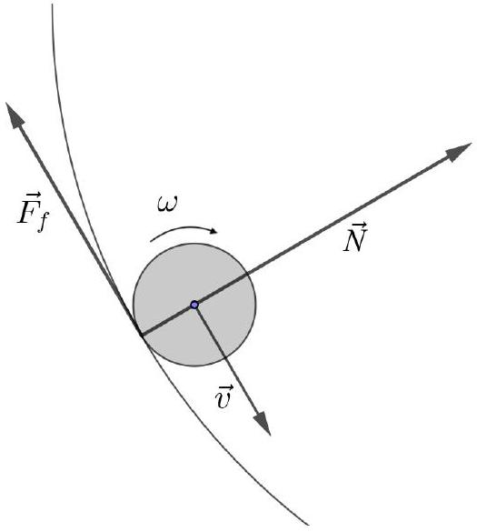
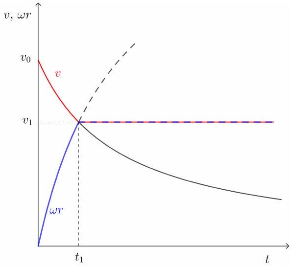
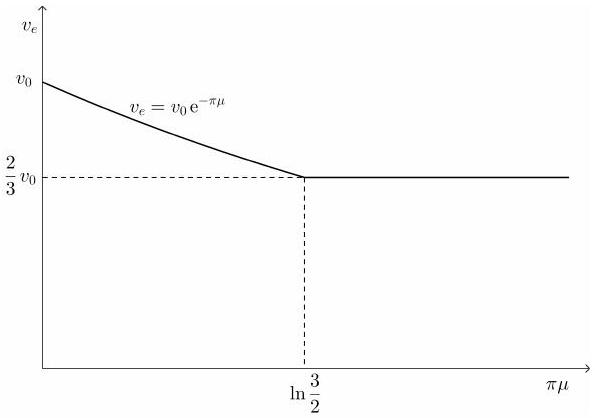

## T1: Sliding puck - Solution

When the puck moves along the wall, two forces (in addition to gravity and the normal force of the horizontal ground, which cancel each other out) act on it: the normal force of the wall (which changes the direction of motion of the puck) and the friction between the puck and the wall (which changes the speed of the puck and also causes the puck to start rotating).

So as the puck moves along the circular wall, the speed of the puck decreases and the angular velocity of the puck's rotation around its vertical axis increases. The motion of the puck is rolling with sliding along the wall. At a certain point in time $t _ { 1 }$, the contact point of the puck may have zero velocity and kinetic friction becomes static. From this point onwards, the puck will be rolling without sliding along the wall.

From the zero velocity of the contact point, we find the relationship $\omega = v / r$.

Let's focus on rolling with sliding first. The normal force $\vec { N }$ of the wall on the puck is also perpendicular to the velocity of the puck at any instantaneous position of the puck. Force $\vec { N }$ changes the direction of the velocity $\vec { v }$. From Newton's law in normal direction, we find $N = m v ^ { 2 } / R$, where $m$ is the mass of the puck. Thus, the magnitude of the frictional force is $F _ { f } = \mu N = \mu m v ^ { 2 } / R$.
Solution 1: The equation for the translational motion of the puck is

$$
m \frac { d v } { d t } = - \mu m \frac { v ^ { 2 } } { R }
$$

and in the integral form including the initial conditions

$$
\int _ { v _ { 0 } } ^ { v } \frac { d v } { v ^ { 2 } } = - \frac { \mu } { R } \int _ { 0 } ^ { t } d t
$$

where the time $t = 0$ is the time at which the puck meets the semicircular wall and has the initial velocity $v _ { 0 }$. Solving the integrals gives

$$
\begin{equation*}
- \frac { 1 } { v } + \frac { 1 } { v _ { 0 } } = - \frac { \mu } { R } t \tag{1}
\end{equation*}
$$

which leads to

$$
\begin{equation*}
v ( t ) = \frac { v _ { 0 } } { 1 + t / \tau } \tag{2}
\end{equation*}
$$

where $\tau = R / v _ { 0 } \mu$. The graph drawn with the solid red line shows the time dependence of $v$.

The rotation of the puck around its axis of symmetry is caused by the torque of the frictional force acting on the puck at the point of contact between the puck and the wall, $M _ { f } = r F _ { f } = r \mu m v ^ { 2 } / R$, where the radius of the puck $r$ is the arm. The equation for the rotational motion of the puck, which results from Newton's second law $I d \omega / d t = M _ { f }$, can be written as

$$
r \frac { d \omega } { d t } = \frac { \mu m r ^ { 2 } } { R I } v ^ { 2 } = \frac { 2 \mu } { R } \cdot \frac { v _ { 0 } ^ { 2 } } { ( 1 + t / \tau ) ^ { 2 } }
$$

where $I = m r ^ { 2 } / 2$ is the moment of inertia of the puck for rotations around its axis of symmetry and $\omega$ is the angular velocity of this rotation. The product $r \omega$ gives the relative speed of the point of contact between the puck and the wall with respect to the puck's center of mass. The integral form of this equation, including the initial conditions, is

$$
r \int _ { 0 } ^ { \omega } d \omega = \frac { 2 v _ { 0 } } { \tau } \int _ { 0 } ^ { t } \frac { d t } { ( 1 + t / \tau ) ^ { 2 } }
$$

and the solution is

$$
\begin{equation*}
r \omega = v _ { 0 } \frac { 2 t / \tau } { 1 + t / \tau } . \tag{3}
\end{equation*}
$$

The graph of $r \omega ( t )$ is drawn by the blue line.
The two solutions (2) and (3) are only valid up to the time $t _ { 1 }$ at which the functions $v ( t )$ and $r \omega ( t )$ intersect, $v \left( t _ { 1 } \right) = r \omega \left( t _ { 1 } \right)$. At this moment, the points on the puck that touch the wall no longer move in relation to the wall and the puck no longer slides along the wall. There is no more friction. From this moment on, the motion of the puck is a frictionless translation and rotation with $v = v \left( t _ { 1 } \right) = v _ { 1 }$ and $\omega = v _ { 1 } / r$. For $t _ { 1 }$ we get $t _ { 1 } = \tau / 2$. At $t _ { 1 }$, the translational speed is $v _ { 1 } = 2 v _ { 0 } / 3$.

There are two possible scenarios for the motion of the puck along the semicircular wall: it rolls with sliding along the entire wall or it starts rolling somewhere along this path without sliding. To see what happens, and also to get the exit velocity of the puck $v _ { e }$, we need to calculate how the path of the puck increases with time, which is defined by equation (2), $d l / d t = v ( t )$. We integrate in time from $t = 0$ to $t$ and in distance from 0 to $l$ and get

$$
\begin{equation*}
t = \tau \left( \exp \left( \frac { l } { v _ { 0 } \tau } \right) - 1 \right) . \tag{4}
\end{equation*}
$$

If we use $l _ { e } = \pi R$, equation (4) gives the time $t _ { e } = t \left( l _ { e } \right) =$ $\tau ( \exp \pi \mu - 1 )$.

If $t _ { e } > t _ { 1 } = \tau / 2$ i.e. $\pi \mu > \ln \frac { 3 } { 2 }$, then the puck starts to roll somewhere on its semicircular path along the wall without sliding and its speed when leaving the wall is $v _ { e } = v _ { 1 } = 2 v _ { 0 } / 3$.

If $t _ { e } \leq t _ { 1 } = \tau / 2$ i.e. $\pi \mu \leq \ln \frac { 3 } { 2 }$, then the puck still rolls with sliding when it leaves the wall, since its translational speed $v _ { e }$ is still greater than $2 v _ { 0 } / 3$. The exit speed is obtained from (4) by inserting $t = t _ { e }$,

$$
\begin{equation*}
v _ { e } = v \left( t = t _ { e } \right) = v _ { 0 } \exp ( - \pi \mu ) . \tag{5}
\end{equation*}
$$

The graph $v _ { e } ( \mu )$ is shown in the figure.

Solution 2: The equation for the translational motion of the puck is

$$
m \frac { d v } { d t } = - \mu m \frac { v ^ { 2 } } { R }
$$

which can be rewritten with $d l = v d t = R d \varphi$ as

$$
\frac { d v } { v } = - \frac { \mu } { R } d l = - \mu d \varphi .
$$

We recognize the dependence of $v$ on $\varphi$;

$$
\begin{equation*}
v = v _ { 0 } \exp ( - \mu \varphi ) , \tag{6}
\end{equation*}
$$

where $\varphi = 0$ at the beginning of the semicircular wall and $\varphi = \pi$ at its end. It describes the dependence of $v$ on $\varphi$ under the condition that the puck rolls and slides at the same time.

Due to the torque of the frictional force the puck also starts to roll along the wall and its instantaneous angular velocity is $\omega$. Let us introduce the speed $v ^ { \prime } = r \omega$ : when $v ^ { \prime }$ reaches the instantaneous speed $v$, it no longer changes (see Solution \#1 for explanation). The equation for the rotational motion of the puck is (see Solution \#1 for explanation)

$$
r \frac { d \omega } { d t } = \frac { d v ^ { \prime } } { d t } = \frac { \mu m r ^ { 2 } } { R I } v ^ { 2 } .
$$

Having already written the function $v ( \varphi )$ (6), we also want to write $\nu ^ { \prime }$ as a function of $\varphi$. We start with the relation

$$
\frac { d v ^ { \prime } } { d t } = \frac { d v ^ { \prime } } { d \varphi } \frac { d \varphi } { d t }
$$

and with the use of $d \varphi / d t = v / R$ we get

$$
d v ^ { \prime } = 2 \mu v _ { 0 } \exp ( - \mu \varphi ) d \varphi
$$

and solving a simple integral

$$
\int _ { 0 } ^ { v ^ { \prime } } d v ^ { \prime } = 2 \mu v _ { 0 } \int _ { 0 } ^ { \varphi } \exp ( - \mu \varphi ) d \varphi
$$

we get

$$
\begin{equation*}
v ^ { \prime } ( \varphi ) = r \omega ( \varphi ) = 2 v _ { 0 } ( 1 - \exp ( - \mu \varphi ) ) . \tag{7}
\end{equation*}
$$

If we equate $v$ and $v ^ { \prime }$, we get a critical angle $\varphi _ { c }$ at which rolling with sliding changes to rolling without sliding,

$$
\mu \varphi _ { c } = \ln \frac { 3 } { 2 } .
$$

At the critical angle, the final velocity is $v _ { f } =$ $v _ { 0 } \exp \left( - \mu \varphi _ { c } \right) = 2 v _ { 0 } / 3$.

If $\varphi _ { c } > \pi$ i.e. $\mu \pi < \ln \frac { 3 } { 2 }$, the puck still slides at the exit with the exit speed $v _ { e } = v _ { 0 } \exp ( - \mu \pi )$ and if $\varphi _ { c } \leq \pi$ i.e. $\mu \pi \geq \ln \frac { 3 } { 2 }$, the puck rolls at the exit without sliding with the final speed $v _ { e } = v _ { f } = v \left( \varphi _ { c } \right) = 2 v _ { 0 } / 3$.

From the way the problem is solved in the second solution, it can be seen that the exit speed of the puck does not depend on a particular shape of the wall; the speed and the angular velocity depend only on $\varphi$ (and the friction coefficient $\mu$ ). For example, the wall could be elliptical instead of a semicircle (or have a different shape).

## suggestions for marking scheme

| Part T1.a): Scores | Pts. |
| :--- | :--- |
| realizing that puck is sliding initially | 0.3 |
| realizing that puck may roll without sliding | 0.3 |
| stating that sliding ends when roll condition $v = r \omega$ is met | 0.3 |
| equating the normal force with $m v ^ { 2 } / R$ | 0.3 |
| using $F _ { f } = \mu N$ for the friction force | 0.3 |
| equation of motion (eom) for translation (-0.2 for wrong sign) | 0.4 |
| giving integral expression for translational eom with correct initial conditions | 0.5 |
| giving expression for $v$ as function of time or angle as in eq. (2) or (6) | 1.0 |
| equation of motion (eom) for rotation | 0.4 |
| using $I = m r ^ { 2 } / 2$ as moment of inertia | 0.3 |
| giving integral expression for rotational eom with correct initial conditions | 0.5 |
| giving expression for $r \omega$ as function of time or angle as in eq. (3) or (7) | 1.0 |
| getting time $\frac { R } { 2 v _ { 0 } \mu }$ or angle $\ln \left( \frac { 3 } { 2 } \right) / \mu$ for transition to rolling without sliding | 0.5 |
| obtaining critical coefficient of friction $\mu _ { c } = \ln ( 3 / 2 ) / \pi$ | 0.5 |
| finding final velocity $\frac { 2 } { 3 } v _ { 0 }$ for rolling without sliding | 0.4 |
| finding velocity $v _ { e }$ if puck slides the whole time | 1.0 |
| Total on T1.a) | 8.0 |

| Part T1.b): Scores | Pts. |
| :--- | :--- |
| graph has suitably labelled axis | 0.2 |
| initial speed $v _ { 0 }$ indicated in graph | 0.2 |
| graph shows $v _ { e }$ decreasing with $\mu$ initially | 0.3 |
| initial exponential decrease of $v _ { e }$ with $\mu$ indicated in graph | 0.3 |
| critical point exists and is indicated in graph | 0.4 |
| constant speed after the critical point | 0.4 |
| obviously not smooth function at critical point | 0.2 |
| Total on T1.b) | 2.0 |

General rules for marking in T1:

- The grain size for marking is 0.1 Pts.
- Partial marks can be awarded for most aspects.
- For each mistake in calculation (algebraic or numeric) 0.2 Pts. are deducted.
- If a mistake leads to a dimensionally incorrect expression no marks are given for the result.
- Propagating errors are not punished again unless they are dimensionally wrong or entail oversimplified/wrong physics (e.g. neglecting friction effects).
