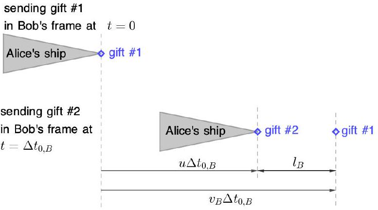
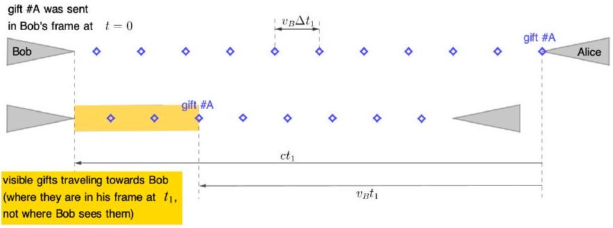
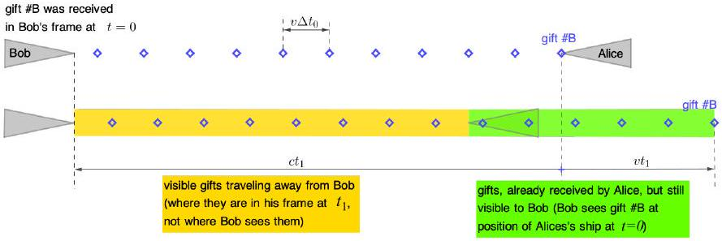
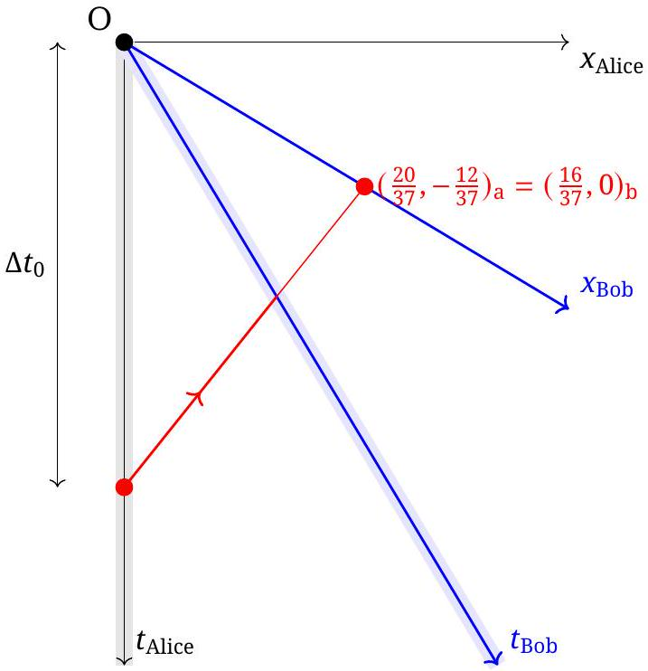
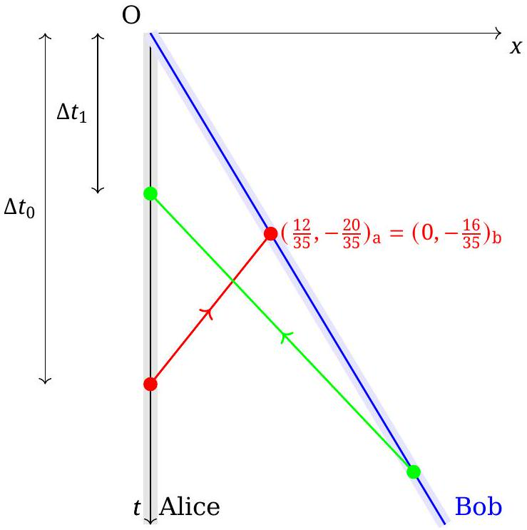
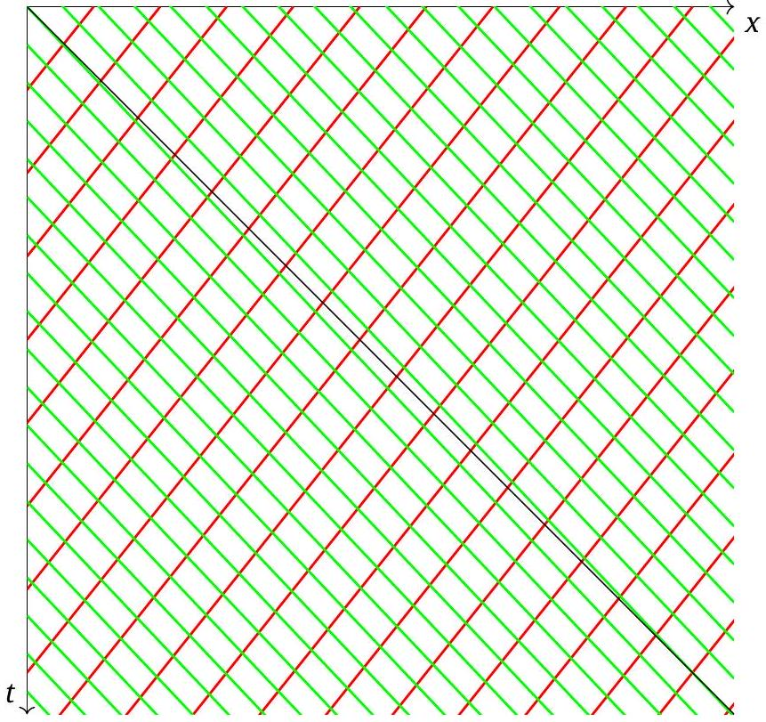
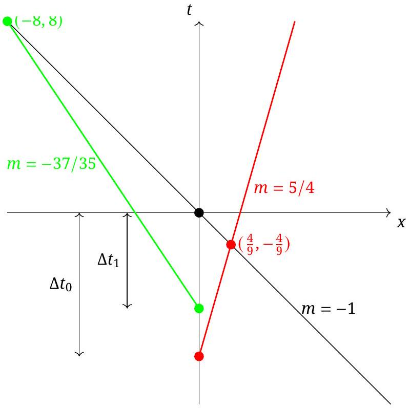
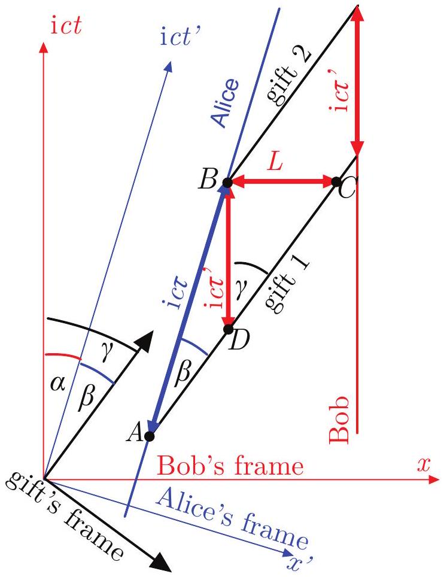
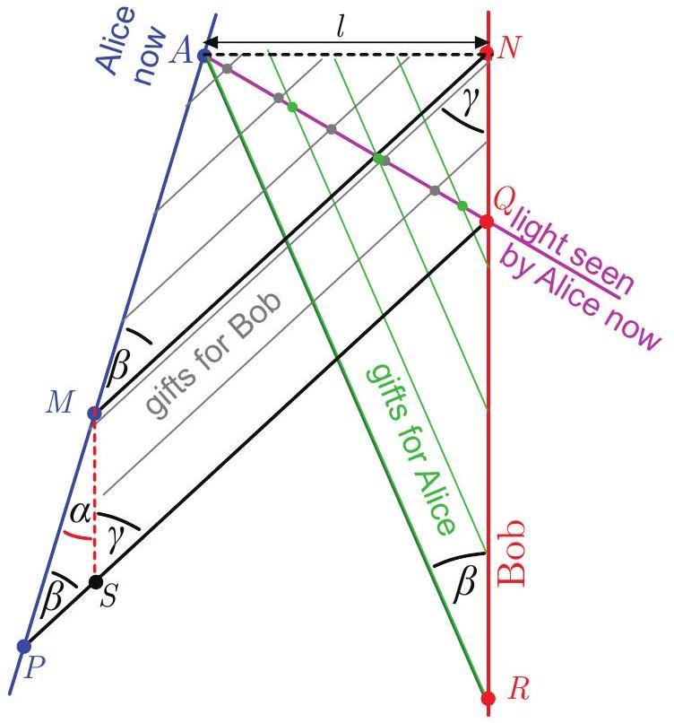

## T2: Spaceships - Solution

## Analytical Solutions

Let us denote the reference frames of Alice, Bob and gift by $A , B , G$, respectively. We shall use the notation $\gamma _ { v } = \frac { 1 } { \sqrt { 1 - v ^ { 2 } / c ^ { 2 } } }$.

Part a) (i)
Solution 1: Let $l _ { x }$ be the distance between two gifts in frame $x$. Since $G$ is the rest frame of the gifts, we have $l _ { A } = l _ { G } / \gamma _ { v } , l _ { B } = l _ { G } / \gamma _ { v _ { B } }$, where $v _ { B }$ is the relative velocity of frames B and G. According to the formula for relativistic addition of velocities, the relative velocity $v _ { B }$ is given by

$$
\begin{equation*}
v _ { B } = \frac { u + v } { 1 + u v / c ^ { 2 } } = \frac { 35 } { 37 } c , \tag{8}
\end{equation*}
$$

where we used the values $u = \frac { 3 } { 5 } c , v = \frac { 4 } { 5 } c$. Together with $l _ { A } = v \Delta t _ { 0 }$ this gives

$$
l _ { B } = v \Delta t _ { 0 } \frac { \gamma _ { v } } { \gamma _ { v _ { B } } } = \frac { 16 } { 37 } \Delta t _ { 0 } c .
$$

Solution 2: Let us consider the two events that gift 1 is sent and the consecutive gift 2 is sent. According to Lorentz-transformation, if an event has coordinates $t , x$ in a certain reference frame, the same event has coordinates $t ^ { \prime } = \left( t - u x / c ^ { 2 } \right) \gamma _ { u } , x ^ { \prime } = ( x - u t ) \gamma _ { u }$, where $u$ is the relative velocity of the reference frames. In A, these events have coordinates $\left( t _ { 1 , A } , x _ { 1 , A } \right) = ( 0,0 )$ and $\left( t _ { 2 , A } , x _ { 2 , A } \right) = \left( \Delta t _ { 0 } , 0 \right)$. The relative velocity of A and B is $- u$. Therefore, in B these events have coordinates $\left( t _ { 1 , B } , x _ { 1 , B } \right) = ( 0,0 )$ and $\left( t _ { 2 , B } , x _ { 2 , B } \right) = \left( \tau \gamma _ { u } , u \Delta t _ { 0 } \gamma _ { u } \right)$.

We thus need to determine the position of gift 1 at time $t _ { 2 , B }$ in frame $B$. If $v _ { B }$ is the relative velocity of the gift and $B$ given by (8), the position of gift 1 is given by $x _ { 1 , B } \left( t _ { 2 , B } \right) = v _ { B } t _ { 2 , B }$. Hence, in frame B the distance between the two gifts is

$$
l _ { B } = x _ { 1 , B } \left( t _ { 2 , B } \right) - x _ { 2 , B } \left( t _ { 2 , B } \right) = \left( v _ { B } - u \right) \Delta t _ { 0 } \gamma _ { u } = \frac { 16 } { 37 } \Delta t _ { 0 } c .
$$

Solution 3: The time interval $\Delta t _ { 0 } = \Delta t _ { 0 , A }$ is the proper time of events in Alice's frame (Alice sending gifts, which happen at the same location in Alice's frame), which is moving with $u$ in Bob's frame. Time interval between these events in Bob's frame is $\Delta t _ { 0 , B } = \gamma _ { u } \Delta t _ { 0 , A }$. The speed of the gift Alice sent in Alice's frame is $v _ { A } = v = \frac { 4 } { 5 } c$ and in Bob's frame the speed of the gift is $v _ { B }$ as found in (8). In Bob's frame in the time interval $\Delta t _ { 0 , B }$ two gifts are sent. During this time the Alice's ship has moved for $u \Delta t _ { 0 , B }$, the previously sent gift for $v _ { B } \Delta t _ { 0 , B }$ and the distance between both gifts in Bob's frame is

$$
l _ { B } = \left( v _ { B } - u \right) \Delta t _ { 0 , B } = \frac { 16 } { 37 } c \Delta t _ { 0 } .
$$

Solution 4: If a student solves Part (ii) first, then the distance between two of the gifts from Bob in Alice's reference frame is the product of the time between arrival, $\Delta t _ { 1 }$, and the speed of Bob's gift in Alice's frame, which is found from the relativistic velocity addition in Eq. 8. Then

$$
l _ { B } = v _ { B } \Delta t _ { 1 } = \left( \frac { 35 } { 37 } \right) c \left( \frac { 16 } { 35 } \right) \Delta t _ { 0 } = \frac { 16 } { 37 } c \Delta t _ { 0 }
$$

## Part a) (ii)

Solution 1 Assuming that the Part (i) is solved first The time interval is given by

$$
\Delta t _ { 1 } = \frac { l _ { B } } { v _ { B } } = \frac { 16 } { 35 } \Delta t _ { 0 }
$$

| Problem 2.(a): Using Solution 1 | pts |
| :--- | :--- |
| Formula for relativistic addition of velocities each mistake -0.3 | 0.5 |
| Speed $v _ { B }$ of Alice's gift in $B ( 35 / 37 = 0.945 )$ must have correct formula | 0.5 |
| Find $l _ { A }$ | 0.5 |
| $\gamma$ formula each mistake -0.2 | 0.3 |
| $l _ { 1 } = l _ { 2 } / \gamma$ only true in rest frame | 0.7 |
| Boost $l _ { A }$ to $G$ frame each mistake -0.1 | 0.3 |
| Boost from $G$ frame to $l _ { B }$ each mistake -0.1 | 0.2 |
| Collect expressions for $l _ { B }$ | 0.5 |
| correct numerical result ( $16 / 37 = 0.432$ ) must have correct formula | 0.5 |
| $\Delta t _ { 1 } = l _ { B } / v _ { B }$ | 0.5 |
| correct numerical result $( 16 / 35 \approx 0.457 )$ must have correct formula | 0.5 |
| Total for 2.(a) | 5.0 |

| Problem 2.(a): Using Solution 2 or 3 | pts |
| :--- | :--- |
| Formula for relativistic addition of velocities each mistake -0.3 | 0.5 |
| Speed $v _ { B }$ of Alice's gift in $B ( 35 / 37 = 0.945 )$ must have correct formula | 0.5 |
| $\gamma$ formula each mistake -0.2 | 0.3 |
| because two subsequent gifts are sent from the same place in Alice's frame | 0.7 |
| $\Delta t _ { 0 , B } = \gamma _ { u } \Delta t _ { 0 }$ each mistake -0.1 | 0.3 |
| In Bob's frame, second gift at position $u \Delta t _ { 0 , B }$ while first gift at $v _ { B } \Delta t _ { 0 , B }$ each mistake -0.2 | 0.7 |
| Collect expressions for $l _ { B }$ | 0.5 |
| correct numerical result ( $16 / 37 = 0.432$ ) must have correct formula | 0.5 |
| $\Delta t _ { 1 } = l _ { B } / v _ { B }$ | 0.5 |
| correct numerical result $( 16 / 35 \approx 0.457 )$ must have correct formula | 0.5 |
| Total for 2.(a) | 5.0 |

Important Notes for marking Problem 2

- Correct final answers without justification can receive full marks; incorrect final answers without justification will receive no marks, even if the answer is "close" or if it can be guessed what the error was.
- The statement "must have correct formula" means that the any immediately preceeding symbolic formula to the numerical number must be correct to receive any points for a numerical answer.
- Correct numerical result is dependent only on the immediate formula from which it is computed.
- A dimensionally incorrect formula gets zero marks.
- Student can define $c = 1$ explicitly without penalty, but inconsistencies are treated as errors.
- Follow on errors normally only have penalty at point of error
- Numerical results that are follow on errors are not penalized twice
- must have recognized light time correction need at least once to get points for ratio formula AND result
- Transcription errors are errors
- If Part a) is solved without the explicit use of special relativity, then the maximum possible for part a) is 0.5 pts.
- If Part b) is solved without the explicit use of special relativity, then no points are awarded.
- For final answer on Part b), must have correct formula; non integer numbers that round to 18 get only +0.2 pts.
- Any other mistakes or errors not explicity covered in the marking schemes should be treated a fully wrong for the category; so if a category is listed as 0.6, and the student work is incorrect, and no other disclaimer applies, then the score would be 0.
- If a student could only reasonably have correctly completed some task by correctly doing the previous tasks, then the previous tasks should be fullyawarded, even if not explicitly written. However, if the tasks are written, and have errors, the student will get the appropriate deductions.
- If it can be argued that a student could only reasonably have completed some task by correctly doing the previous tasks, but the answer to the shown task is incorrect, then the previous tasks should receive zero marks if not explicitly shown.

Part (b)
Solution 1: Suppose that at $t _ { 0 , A } = 0$ Alice sees Bob's spaceship at distance $d _ { B }$. The time that the light travelled from Bob to Alice is $t _ { l } = d _ { b } / c$. (In Alice's frame, the actual distance from Alice to Bob's spaceship is $L = d _ { b } - u d _ { b } / c$.)

Let us first compute the number of visible outgoing gifts. Alice sees all gifts she sent until she sees them reach the spaceship. Consider the gift which Alice just sees arriving at Bob, which is the oldest visible gift. If this gift flew past Bob's ship, it would be located at distance $d _ { b } + v t _ { l }$. Therefore the number of gifts between the oldest visible gift and Alice is

$$
N _ { o u t } = \frac { d _ { b } + v t _ { l } } { l _ { A } } = \frac { d _ { b } ( 1 + v / c ) } { v \Delta t _ { 0 } } .
$$

Alternatively, one can observe that $d _ { b } / l _ { A }$ gifts were between the considered gift and Alice at time $- t _ { l }$. During time $t _ { l }$ Alice sent out an additional number $t _ { l } / \Delta t _ { 0 }$ gifts, giving $N _ { \text {out } } = \frac { d _ { B } } { v \Delta t _ { 0 } } + \frac { d _ { B } } { c \Delta t _ { 0 } }$.

We now compute the number of visible incoming gifts. Alice sees the newest visible gift just leave Bob's ship. In Alice's frame, the actual distance of her to the newest visible gift is $d _ { B } - v _ { B } t _ { l } = d \left( 1 - v _ { B } / c \right)$. The distance between incoming gifts is $l _ { B }$, which was computed in part a). Hence, the number of visible incoming gifts is

$$
N _ { i n } = \frac { d _ { B } \left( 1 - v _ { B } / c \right) } { l _ { B } } = \frac { d _ { B } \left( 1 - v _ { B } / c \right) } { \Delta t _ { 0 } c } \frac { 37 } { 16 }
$$

In total, we have

$$
\frac { N _ { \text {out } } } { N _ { \text {in } } } = \frac { ( 1 + v / c ) c } { \left( 1 - v _ { B } / c \right) v } \frac { 16 } { 37 } = 18
$$

Solution 2 Since both Alice and Bob send the gifts in exactly the same way and their relative speed to each other is also the same (which is always the case), there is symmetry between them. Bob sees exactly the same number of gifts he will receive as Alice, and the same is true for the gifts sent. So we can continue in Bob's frame (where Bob is stationary).

First, let us look at the gifts Bob receives (and we stay in his frame the whole time). Between Bob and Alice at any moment, there are a finite number of gifts that have already been sent by Alice and not yet received by Bob. However, Bob does not see them all because the light of the most distant gift has not yet reached him. The furthest gift \#A that Bob can see was sent to him at time $t = 0$ (in Bob's frame) and Bob sees it for the first time at time $t _ { 1 }$, when it has already

traveled the distance $v _ { B } t _ { 1 }$ and the light of this gift, emitted at time $t = 0$ (when it was sent) has traveled the distance $c t _ { 1 }$ and has just reached him (at time $t _ { 1 }$ Bob sees the gift \#A sent from Alice's position at time $t = 0$ ). The distance between two consecutive gifts moving towards Bob is $v _ { B } \Delta t _ { 1 }$ (see part (ii), solution 1). The number of gifts that Bob sees at any point in time and that move towards Bob is

$$
\begin{equation*}
N _ { A \rightarrow B } = \frac { \left( c - v _ { B } \right) t _ { 1 } } { v _ { B } \Delta t _ { 1 } } . \tag{9}
\end{equation*}
$$

Let us now turn to the gifts that Bob sends to Alice.

Bob sees all his gifts that have not yet reached Alice at the time of observation, and some more that have been with Alice for some time and are probably eaten - only the information about the receipt of the gifts has not yet reached Bob. Let the moment $t = 0$ be the moment at which the gift \#B sent by Bob reaches Alice. At this moment, the light from Alice begins to travel back to Bob with the information about the receipt of the gift and reaches Bob at time $t _ { 1 }$ - then Bob realizes that the gift \#B has been received. Between $t = 0$ and $t _ { 1 }$, Bob regularly sends more gifts in the usual way; therefore, there are more gifts that Bob can see on the way to Alice than there actually are (remember: we are always talking about how things are in Bob's frame; when and where they happen). It's practically the same as the received gift \#B moves further beyond Alice and travels an additional distance $v t _ { 1 }$ before Bob realizes it's being received by Alice. The number of gifts that Bob sees at any point in time and that move away from Bob is

$$
\begin{equation*}
N _ { B \rightarrow A } = \frac { ( c + v ) t _ { 1 } } { v \Delta t _ { 0 } } . \tag{10}
\end{equation*}
$$

The gift $\# A$ is sent by Alice to Bob at time $t = 0$ and at the same moment Alice receives the gift $\# B$ from Bob (same time and place), and Bob observes travelling gifts at time $t _ { 1 }$.

The ratio of the number of gifts moving away from him and towards him is

$$
\begin{equation*}
\frac { N _ { B \rightarrow A } } { N _ { A \rightarrow B } } = \frac { ( c + v ) t _ { 1 } } { v \Delta t _ { 0 } } \frac { v _ { B } \Delta t _ { 1 } } { \left( c - v _ { B } \right) t _ { 1 } } = \frac { ( c + v ) v _ { B } \Delta t _ { 1 } } { v \Delta t _ { 0 } ( c - v ) } = 18 , \tag{11}
\end{equation*}
$$

where the previously obtained relationships $\Delta t _ { 1 } =$ $\frac { 16 } { 35 } \Delta t _ { 0 }$ and $v _ { B } = \frac { 35 } { 37 } c$ were used together with the given $v = \frac { 4 } { 5 } c$.

| Problem 2.(b) | pts |
| :--- | :--- |
| Identify a distance to Bob $d _ { B }$ | 0.3 |
| Light time to Bob $t _ { l }$ | 0.5 |
| Recognize need to correct for light time | 0.5 |
| $d _ { A G } = d _ { B } + t _ { l } v$ each mistake -0.3 | 0.9 |
| $N _ { a \rightarrow b } = d _ { A G } / L _ { A }$ | 0.2 |
| Recognize need to correct for light time | 0.5 |
| $d _ { B G } = d _ { B } - t _ { l } v _ { B }$ each mistake -0.3 | 0.9 |
| $N _ { b \rightarrow a } = d _ { B G } / L _ { B }$ | 0.2 |
| symbolic ratio each mistake -0.2 | 0.5 |
| correct numerical result (18) must have correct formula | 0.5 |
| Total for 2.(b) | 5.0 |

## Graphical Solutions

Throughout the graphical solution, it is assumed that $c = 1$ and $\Delta t _ { 0 } = 1$. In order to return to a consistent solution, make sure to include these factors appropriately in the final answer.

## Part a)i

The question is asking for the separation between two events that happen at the same time in Bob's reference frame. The graph is in Alice's reference frame, also shown in the graph are the world line of Bob, with a slope of -5/3, and the $x$-axis of Bob, with a slope of $- 3 / 5$. The red circle on Alice's world line is the launch of a gift from Alice, the black circle at the origin is another launch of a gift from Alice.

We are interested in the intersection of the first launched gift, which has a slope of 5/4, where it crosses the $x$ axis of Bob. In Alice's reference frame, that point is

$$
( x , t ) = \left( \frac { 20 } { 37 } , \frac { - 12 } { 37 } \right)
$$

Applying the Lorentz transform into Bob's reference frame,

$$
\Delta t _ { 1 } = \frac { 5 } { 4 } \left| \frac { 20 } { 37 } - \left( \frac { - 3 } { 5 } \right) \left( \frac { - 12 } { 37 } \right) \right| = \frac { 16 } { 37 }
$$

Alternatively, it is possible to focus on the Lorentz invariant expression,

$$
\left( t _ { \mathrm { a } } \right) ^ { 2 } - \left( x _ { \mathrm { a } } \right) ^ { 2 } = \left( t _ { \mathrm { b } } \right) ^ { 2 } - \left( x _ { \mathrm { b } } \right) ^ { 2 }
$$

where $t _ { b } = 0$, and arrive at the same result.
Part a)ii
It is expected that most students will get an answer that depends on the result of Part a)i, and the technique is outlined in the analytical section.

It is also possible to solve Part a)ii without solving Part a)i. Consider world-lines for Alice and Bob that intersect at the origin, and assume that both send a gift to the other at this intersection.

The question is asking for the time interval between two events that happen in the same place in Bob's reference frame.

The world-line of Bob has a slope of -5/3; the worldline of the gift from Alice has a slope of 5/4. Assuming $\Delta t _ { 0 } = 1$, then the gift from Alice arrives with Bob in Alice's coordinate system as

$$
( x , t ) = \left( \frac { 12 } { 35 } , \frac { - 20 } { 35 } \right)
$$

Applying the Lorentz transform into Bob's reference frame,

$$
\Delta t _ { 1 } = \frac { 5 } { 4 } \left| \frac { - 20 } { 35 } - \left( \frac { - 3 } { 5 } \right) \left( \frac { 12 } { 35 } \right) \right| = \frac { 16 } { 35 }
$$

Alternatively, it is possible to focus on the Lorentz invariant expression,

$$
\left( t _ { \mathrm { a } } \right) ^ { 2 } - \left( x _ { \mathrm { a } } \right) ^ { 2 } = \left( t _ { \mathrm { b } } \right) ^ { 2 } - \left( x _ { \mathrm { b } } \right) ^ { 2 }
$$

where $x _ { b } = 0$, and arrive at the same result.

Because of the symmetry, the time interval between arrivals of Bob's gift in Alice's frame is the same as the time interval between arrivals of Alice's gift in Bob's frame. The transfer of the gifts in shown in the figure. It is not necessary to sketch this green line.

| Problem 2.(a)i | pts |
| :--- | :--- |
| Clearly indicated graph or related equations | 0.2 |
| Bob's $x$ axis correct slope (-3/5) | 0.2 |
| Gift from Alice correct slope (5/4) | 0.2 |
| Gift released $\Delta t _ { 0 }$ before Origin | 0.2 |
| Recognize intersection of gift and $x _ { B }$ | 0.3 |
| Find intersection in Alice Frame | 0.5 |
| 1. $\gamma$ formula | 0.3 |
| 1. each mistake -0.2 |  |
| 1. Use Lorentz Transformation | 0.1 |
| 1. Apply Lorentz Transformation | 0.5 |
| 1. each mistake -0.2 |  |
| 2. Use Lorentz invariance | 0.4 |
| 2. recognize $\Delta x _ { b } = 0$ | 0.2 |
| 2. Apply Lorentz invariance | 0.3 |
| 2. each mistake -0.2 |  |
| correct numerical result (16/37) | 0.5 |

Important Notes!

1. Scores can be received for method 1 or method 2, but not both; if both are attempted, award the higher total, but never more than 0.9 pts.

If Part a)ii is solved analytically

| Problem 2.(a)ii | pts |
| :--- | :--- |
| Formula for $v _ { \text {addition } }$ each mistake -0.3 | 0.5 |
| Speed $v _ { r }$ of Alice's gift in $B ( 35 / 37 )$ must have correct formula | 0.5 |
| $\Delta t _ { 1 } = L _ { b } / v _ { r }$ | 0.5 |
| correct numerical result (16/35) must have correct formula | 0.5 |

If Part a)ii solved graphically, then

| Problem 2.(a)ii | pts |
| :--- | :--- |
| Clearly indicated graph or related equations | *0.2 |
| Bob's $t$ axis correct slope (-5/3) | 0.2 |
| Gift from Alice correct slope (5/4) | *0.2 |
| Gift released $\Delta t _ { 0 }$ before Origin | *0.2 |
| Recognize intersection of gift and $t _ { B }$ | 0.3 |
| Find intersection in Alice Frame | 0.5 |
| 1. $\gamma$ formula | *0.3 |
| 1. each mistake -0.2 |  |
| 1. Use Lorentz Transformation | *0.1 |
| 1. Apply Lorentz Tranformation | 0.5 |
| 1. each mistake -0.2 |  |
| 2. Use Lorentz invariance | *0.4 |
| 2. recognize $\Delta x _ { b } = 0$ | 0.2 |
| 2. Apply Lorentz invariance | 0.3 |
| 2. each mistake -0.2 |  |
| correct numerical result (16/35) | 0.5 |

Important Notes!

1. A student who does both a)i and a)ii graphically can only get points for the starred (*) categories

for the work in a)i, and not also for the work in a)ii.

2. The maximum possible score is 5 pts! If a student does graphical approaches for both, and makes mistakes, the final score for Part a) must be less than 5 by an amount equal to the mistakes made.

Part b)
Consider the movement of gifts in Alice's reference frame. Green gifts are headed toward Alice, red gifts are headed away from Alice. If Alice makes an instantaneous observation, Alice will see the gifts at locations along the intersection with the diagonal light line. This is quite different from the questions of the separation of the green gifts or the red gifts in Alice's rest frame, which is measured by the separation at the same time, for example, the intersections with the $x$ axis.

The figure to solve can be simplified considerably; to fit it into a useful form the proper slopes are no longer used and the picture is not to scale.

The intersection of the red line and the black lightline is

$$
\left( \frac { 4 } { 9 } , - \frac { 4 } { 9 } \right)
$$

The intersection of the green line and the black light line is

$$
( - 8,8 )
$$

The ratio is 18.

| Problem 2.(b) | pts |
| :--- | :--- |
| Clearly indicated graph or related equations | 0.4 |
| Alice's gifts correct slope (5/4) | 0.2 |
| Formula for $v _ { \text {addition } }$ each mistake -0.3 | *0.5 |
| Speed $v _ { r }$ of Bob's gift in $A ( 35 / 37 )$ must have correct formula | *0.5 |
| Bob's gifts correct slope (-37/35) | 0.2 |
| Light-like line drawn | 0.2 |
| Alice gift released $\Delta t _ { 0 }$ before Origin | 0.2 |
| Bob gift arrive $\Delta t _ { 1 }$ before Origin | 0.2 |
| Intersection of Bob gift and light like line | 0.3 |
| Find intersection in Alice Frame | 0.5 |
| Intersection of Alice gift and light like line | 0.3 |
| Find intersection in Alice Frame | 0.5 |
| symbolic ratio each mistake -0.2 | 0.5 |
| correct numerical result (18) must have correct formula | 0.5 |

Important Notes for marking Problem 2 b)

1. For the two starred (*) quantities above: If this is the first use of the relativistic velocity addition formula, then mark as shown. If the relativistic velocity addition was was used to answer Part a), then these points are only awarded for a student who has reasonably demonstrated how they need to use the relative velocity to solve Part b). An appropriate figure can be sufficient. In this case, they do not need to write the equations twice.

Solution using ict-diagrams
In the ict-diagram shown in the figure, the red coordinate system represents the Bob's frame of reference, the blue represents the Alice's frame, and the black represents the gifts' frame. We know that $\tan \alpha = \frac { v } { \mathrm { i } c } = - \frac { 3 } { 5 } i$ and $\tan \beta = \frac { u } { \mathrm { i } c } = - \frac { 4 } { 5 } i$. Therefore,

$$
\tan \gamma = \tan ( \alpha + \beta ) = \frac { \tan \alpha + \tan \beta } { 1 - \tan \alpha \tan \beta } = - \frac { 140 } { 148 } i .
$$

We can express sinus and cosine in terms of tangent to obtain $\cos \alpha = \frac { 5 } { 4 } , \sin \alpha = - \frac { 3 } { 4 } i , \cos \beta = \frac { 5 } { 3 } , \sin \beta = - \frac { 4 } { 3 } i$, $\cos \gamma = \frac { 37 } { 12 } , \sin \gamma = - \frac { 35 } { 12 } i$. Events $A$ and $B$ represent the launching of two consecutive gifts, so the segment $A B$ is of length ic $\tau$.

Part a)1 The distance between two gifts launched by Alice in the Bob's frame of reference is labeled $L$ in the figure. From the sine theorem for the triangle $A B C$ we obtain $L = \mathrm { i } c \tau \sin \beta / \cos \gamma = \tau c \frac { 4 } { 3 } \frac { 12 } { 37 } = \frac { 16 } { 37 } c \tau$.

Part a)2 From the sine theorem for the triangle $A B D$ we obtain $\tau ^ { \prime } = \tau \sin \beta / \sin \gamma = \tau \frac { 4 } { 3 } \frac { 12 } { 35 } = \frac { 16 } { 35 } c \tau$.

Part b) We use the same reference frames and a diagram using the same color-coding. Additionally, the diagram shows the gifts sent by Bob in green, and the light ray arriving currently to Alice's eye in purple. The gifts seen by Alice are marked as coloured circles: the ones sent by herself are grey, and the ones sent by Bob are green. Since the gits are launched by Bob and Alice at the same frequency, the ratio of the number of grey gifts to the number of green gifts seen currently is equal to $A P / R Q$.

From the figure we can easily express $A P = A M + N P$; using the sine for the triangle $A M N$ theorem we obtain $A M = l \cos \gamma / \sin \beta = \frac { 37 } { 16 } \mathrm { i } l$; here, $l$ denotes the distance to Alice now in Bob's frame of reference. Since light travels with speed $c$, we know that $Q N = \mathrm { i } L$; the sine theorem for the triangle $M P S$ yields $M P =$ $M S \sin \gamma / \sin \beta = Q N \sin \gamma / \sin \beta = \mathrm { i } \frac { 35 } { 16 } l$ so that $A P = \mathrm { i } \frac { 72 } { 16 } l =$ $\mathrm { i } \frac { 9 } { 2 } l$. One can easily see that $R Q = R N - Q N = l / \tan \beta - \mathrm { i } l =$ $\mathrm { i } \frac { 1 } { 4 } l$. Bringing all together, the ratio of the number of gifts is $A P / R Q = \frac { 9 } { 2 } \frac { 4 } { 1 } = 18$.
