## E1 - Deep Learning (10 pts)

Modern ANNs (artificial neural networks) are made of billions of neurons. Each neuron transforms its input(s) $x _ { 1 } , x _ { 2 } , \ldots , x _ { n }$ to an output $y$. First,

$$
z = w _ { 1 } x _ { 1 } + w _ { 2 } x _ { 2 } + \cdots + w _ { n } x _ { n } + b
$$

is calculated, with real numbered weights $w _ { i }$ and real numbered bias $b$. Then an activation function is applied to $z$ to produce the final output $y \left( x _ { 1 } , x _ { 2 } , \ldots \right)$. In the present problem you will investigate a physical model of a neuron with the electric voltages $x _ { 1 }$ and $x _ { 2 }$ as inputs, with the activation function being $A \sigma ( z )$, graphed below, where $\sigma ( z ) = 1 / ( 1 + \exp ( - z ) )$ is called sigmoid function.
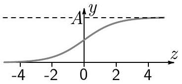

## Equipment

Important! Do not switch off any power outlets.

(i) A box containing a voltage source, an electronic circuit that models the neuron, and two potentiometers (the A-potentiometer and the Bpotentiometer). The electric terminals on the box are denoted as follows:
    1 Two electrically connected GND terminals: the electrical ground serving as a common negative terminal for $+ \mathrm { V } , x _ { 1 } , x _ { 2 }$, and $y$.
    $2 + \mathrm { V }$ : the positive terminal of the voltage source.
    3 X1 and X2: the positive terminals of the neuron input voltages $x _ { 1 }$ and $x _ { 2 }$, respectively. The neuron output behaves unpredictably if either of these terminals has no input voltage.
    4 Y: the positive output terminal. It behaves like a real voltage source, consisting of an ideal voltage source of voltage $y$ and a series output resistor $R _ { \text {out } }$, and operates as shown below.

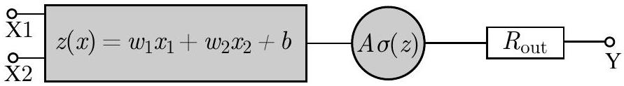

5 A1, A2, A3: terminals of the A-potentiometer. 6 B1, B2, B3: terminals of the B-potentiometer. 7 T: a terminal not to be used in this task.
(ii) Digital multimeter with two probe wires.
(iii) Wires with banana connectors. Two or more wires could be connected to the same terminal in the box by using the holes in the banana connectors. Using the banana connectors with the multimeter may form an unstable connection. Use the alligator clamp if needed.
(iv) Graph paper. You can ask for more if needed.

Task 1 (0.5 pts)
Terminals A1, A2, and A3 are connected to the Apotentiometer $R _ { P }$ and an additional load resistor $R _ { L }$.

Which of the schemes below corresponds to the circuit in the box? Determine the resistances $R _ { L }$ and $R _ { P }$; document the measurements made.
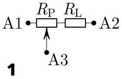
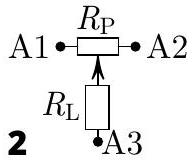
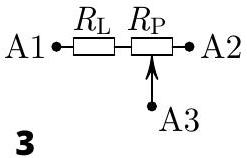

Note The B-potentiometer is connected to terminals B1, B2, B3 in exactly the same way with the same resistances $R _ { L }$ and $R _ { P }$, within manufacturing tolerances.

Task 2 - (0.5 pts)
Sketch how the terminals have to be connected so that the neuron input voltages can be varied with the widest possible range.

Task 3 - (1.5 pts)
Devise (and document) a strategy allowing you to find the combination of input voltages $x _ { 1 }$ and $x _ { 2 }$ that maximizes the output voltage $y$ with the least possible number of measurements, irrespectively of with which set of input voltages you start the search. Determine this maximal voltage $y _ { \text {max } }$ that will be henceforth used as an approximation for the amplitude $A$, and document your measurements.

Task 4 - (3.5 pts)
Determine the weights $w _ { 1 } , w _ { 2 }$ and the bias $b$. Describe your measurements and document your data in a table. Estimate $w _ { 1 } , w _ { 2 }$, and $b$ by using a graphical approach.
Training involves optimizing the network weights to achieve desired functionality. This allows ANNs to approximate arbitrary functions. For each of the following tasks you have to approximate a different function of a single input voltage using the given equipment. Make sure that the input and output that you define are clearly marked in your circuits.

Task 5 - (1.5 pts)
Connect the terminal X1 directly to +V. Design a circuit to approximate the function $y _ { 5 } ( x ) =$ $A \sigma \left( w _ { 2 } x / 2 + b _ { 5 } \right)$, where $x$ is the voltage applied to your newly defined input terminal. Determine $b _ { 5 }$ theoretically. Implement the circuit, take measurements and verify that your setup works as expected. Validate the value of $b _ { 5 }$ from your data.

Task 6 - (2.5 pts)

a Determine the internal series output resistance $R _ { \text {out } }$ of the Y terminal. (0.5 pts)
b Design and implement a circuit to approximate the function $y _ { 6 } ( x ) = A _ { 6 } \cdot \sigma \left( w _ { 2 } x + b \right) + B _ { 6 }$, where $B _ { 6 } = 1.48 \mathrm {~V}$. Determine $A _ { 6 }$ theoretically. Implement the circuit and verify experimentally that your setup works as expected. Confirm the values of $A _ { 6 }$ and $B _ { 6 }$ from your data. (2.0 pts)

## E1- Solution

The term "neuron" has been chosen in analogy to the cells of the nervous system, which transmit electrochemical signals across the nerves (variable $y$ ) depending on the integral stimulus $( z )$ on their input extremities (variables $x _ { i }$ ). The theory behind the artificial neurons and artificial neural networks has been developed in a close analogy to basic physical concepts. In recognition of this fact, the Nobel Prize in physics in 2024 was awarded to John J. Hopfield and Geoffrey E. Hinton "for foundational discoveries and inventions that enable machine learning with artificial neural networks". The artificial neurons could also be real physical systems, which transform mechanical, electrical, or optical signals.

## Task 1

The multimeter is connected in an ohmmeter mode to the three possible pairs of output terminals of Apotentiometer. By turning the knob of the potentiometer we measure the maximum and minimum resistance for each pair:

| Terminals: | $R _ { \text {min } } ( \Omega )$ | $R _ { \text {max } } ( \Omega )$ |
| :--- | :--- | :--- |
| A1-A2 | 1000 | 1000 |
| A1-A3 | 222 | 1222 |
| A2-A3 | 222 | 1222 |

If the load resistor was connected to either A1 or A2, then the $R _ { \text {min } }$ for A1-A3 and A2-A3 pairs would close to zero, in contrast to measurements. Therefore the load resistor is connected between A3 and the potentiometer slider. In this case, for either of A1-A3 and A2-A3 pairs we have: $R _ { \text {min } } = R _ { L }$ and $R _ { \text {max } } = R _ { P } + R _ { L }$ and

$$
R _ { L } = 222 \Omega \quad R _ { P } = 1000 \Omega
$$

|  | Task 1 | Pts |
| :--- | :--- | :--- |
| A | States or shows in a drawing that the resistance between the three pairs of terminals has been measured. | 0.2 |
|  | Results for the resistances: |  |
| B | $R _ { P } \approx 1000 \Omega \pm 120 \Omega$ | 0.1 |
| C | $R _ { L } \approx 220 \Omega \pm 6 \Omega$ | 0.1 |
| D | Concludes that the resistor is connected to terminal 3. | 0.1 |
|  | Total on Task 1 | 0.5 |

## Task 2

The necessary connections are shown in Fig. 1.

|  | Task 2 | Pts |
| :--- | :--- | :--- |
| A | Potentiometers are connected to X1 and X2 | 0.2 |
|  | Correct connections to ground and supply -0.1 per wrong connection -0.2 fixed penalty for the specific case that X1 / X2 are connected to A1/A2 and V+ and GND on the remaining terminals of the potentiometer. This setup gives only limited variation of the input voltage (0V - 2.67V) -0.5 if only 2 terminals the potentiometers are connected. | 0.3 |
|  | Total on Task 2 | 0.5 |

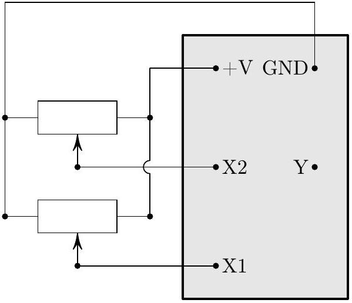
Figure 1: Correct Setup Task 2

## Task 3

By turning the potentiometers' knobs one can establish that the input voltages change independently between 0 V and $\approx 3.25 \mathrm {~V}$ (Note that due to the protection circuit inside the box, this voltage decreases slightly with connected circuitry). Therefore, any combination of input voltages could be mapped to a point inside the shaded square area in the $x _ { 1 } - x _ { 2 }$ plane, as shown in Fig 2. Points corresponding to a

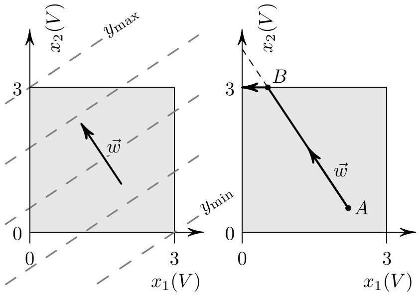
Figure 2: Task 3

| $x _ { 1 } ( V )$ | $x _ { 2 } ( V )$ | $y ( V )$ |
| :--- | :--- | :--- |
| 0.00 | 0.00 | 2.30 |
| 3.15 | 0.00 | 1.15 |
| 3.15 | 3.15 | 2.56 |
| 0.00 | 3.15 | 2.73 |

Table 1: Output voltage at the vertices

constant output voltage y satisfy the equation:

$$
w _ { 1 } x _ { 1 } + w _ { 2 } x _ { 2 } + b = \text { const } ,
$$

which defines a family of parallel straight lines, perpendicular to the vector $\vec { w } = \left( w _ { 1 } , w _ { 2 } \right)$ (see the dashed lines in Fig. 2). It is clear that for any set of weights, the maximum voltage $y _ { \text {max } }$ and the minimum voltage $y _ { \text {min } }$ are always met at the vertices of the rectangle. Therefore, only three corners need to be measured in order to determine the maximum voltage $y _ { \text {max } }$. First, two corners are measured, which are next to each other. Therefore, the maximum along the connecting edge can be found. Using the corner with the higher voltage, the other edge from that corner is followed to a third corner. Consequently, the highest voltage can be determined, as the fourth corner needs to be lower than the third measured corner. Table 1 summarizes the measurements of the output voltage at the four vertices. The maximum of the output voltage is:

$$
y _ { \max } = 2.73 \mathrm {~V}
$$

corresponding to the input voltages:

$$
x _ { 1 } = 0.00 \mathrm {~V} ; \quad x _ { 2 } = 3.15 \mathrm {~V} .
$$

|  | Task 3 | Pts |
| :--- | :--- | :--- |
| A | Strategy that three measurements are sufficient to obtain $y _ { \text {max } }$ | 0.7 |
|  | Penalty for four measurements No points for more than four measurements Note that turning the knob for $x _ { i }$ and watching the change of $y$ does count as at least 2 measurements per $x _ { i }$. For solutions where the knob is turned a little for $x _ { 1 }$, then the other for $x _ { 2 }$, the conclusion about the signs of the $w _ { i }$ is made and only then the input gets adjusted to reach $y _ { \text {max } }$, this counts as at least 5 measurements, which is awarded no points here. | -0.3 |
| B C | Lower bound of measurements < 0.02V | 0.1 |
|  | Upper bound of measurements > 3V | 0.2 |
|  | Note that to obtain these 0.1 + 0.2 points, the student must write its input values for $x _ { 1 }$ and $x _ { 2 }$ down explicitly, or, at least write that they are directly connected to GND or +V if that is the case. |  |
| D | Per measurement 0.1 up to 0.3 | 0.3 |
| E | Value for $y _ { \text {max } } = 2.73 \mathrm {~V} \pm 0.04 \mathrm {~V}$ | 0.2 |
|  | Penalty for more than three significant digits | -0.2 |
|  | Penalty for only one significant digit | -0.2 |
|  | Total on Task 3 | 1.5 |

## Task 4

The three parameters could be determined in two series of measurements of the output voltage by setting each of the input voltages constant and changing the other input voltage. The dependence of the output voltage on $x _ { 1 }$ and $x _ { 2 }$ can be linearized by transforming $y$ to the auxiliary variable:

$$
\begin{equation*}
z = \ln \frac { y } { A - y } \approx \ln \frac { y } { y _ { \max } - y } \tag{1}
\end{equation*}
$$

since:

$$
\begin{equation*}
z = w _ { 1 } x _ { 1 } + w _ { 2 } x _ { 2 } + b \tag{2}
\end{equation*}
$$

Measurements close to the maximum output voltage should be avoided because of the large systematic error in calculated values of $z$ when approximating in equation (1) the unknown A with ymax. Therefore, the suitable set of measurements is along the path $( 0,0 ) - ( 3,0 ) - ( 3,3 ) \mathrm { V }$ in the $x _ { 1 } , x _ { 2 }$-plane. Tables 2 and 3 summarize the results of measurements along the lines $( 0,0 ) - ( 3,0 ) \mathrm { V }$ and $( 3,0 ) - ( 3,3 ) \mathrm { V }$ respectively. The values of the variable $z$ calculated by means of (1) are shown in the last column of the tables. Figure 3 shows the data in Table 2 in variables $z$ and $x _ { 1 }$ with the corresponding linear fit. The weight $w _ { 1 }$ corresponds to the slope of the fitting line:

$$
\begin{equation*}
w _ { 1 } = \frac { \Delta z } { \Delta x _ { 1 } } = - 0.62 \mathrm {~V} ^ { - 1 } \tag{3}
\end{equation*}
$$

Since $x _ { 2 } = 0.00 \mathrm {~V}$, the bias $b$ could be estimated by crossing point of the fitting line with the $z$-axis:

$$
\begin{equation*}
b = 1.67 \tag{4}
\end{equation*}
$$

| $x _ { 1 } ( V )$ | $y ( V )$ | $z$ |
| :--- | :--- | :--- |
| 0.00 | 2.31 | 1.68 |
| 0.26 | 2.24 | 1.50 |
| 0.59 | 2.15 | 1.29 |
| 0.83 | 2.08 | 1.15 |
| 1.09 | 2.00 | 0.99 |
| 1.32 | 1.92 | 0.85 |
| 1.72 | 1.76 | 0.59 |
| 1.98 | 1.65 | 0.41 |
| 2.20 | 1.57 | 0.29 |
| 2.53 | 1.44 | 0.10 |
| 2.88 | 1.29 | -0.12 |
| 3.02 | 1.23 | -0.21 |

Table 2: Measurements for $x _ { 2 } = 0.00 \mathrm {~V}$

| $x _ { 2 } ( V )$ | $y ( V )$ | $z$ |
| :--- | :--- | :--- |
| 0.00 | 1.23 | -0.21 |
| 0.22 | 1.38 | 0.01 |
| 0.51 | 1.56 | 0.28 |
| 0.81 | 1.74 | 0.55 |
| 1.06 | 1.88 | 0.78 |
| 1.37 | 2.04 | 1.07 |
| 1.75 | 2.21 | 1.43 |
| 1.99 | 2.30 | 1.65 |
| 2.22 | 2.38 | 1.89 |
| 2.53 | 2.47 | 2.21 |
| 2.74 | 2.52 | 2.44 |
| 3.02 | 2.57 | 2.72 |

Table 3: Measurements for $x _ { 1 } = 3.02 \mathrm {~V}$

The data for $z$ and $x _ { 2 }$ in Table 3, and the corresponding linear fit are shown in Figure 4. The slope of the fitting line gives the weight $w _ { 2 }$ :

$$
\begin{equation*}
w _ { 2 } = \frac { \Delta z } { \Delta x _ { 2 } } = 0.96 \mathrm {~V} ^ { - 1 } \tag{5}
\end{equation*}
$$

According to equation (2) the crossing point, -0, 22, of the fitting line with $z$ axis at $x _ { 1 } = 3.02 \mathrm {~V}$ satisfies the equation

$$
\begin{equation*}
- 0.22 = w _ { 1 } x _ { 1 } + b = - 1.87 + b \tag{6}
\end{equation*}
$$

Therefore, we obtain a second estimate for the bias $b = 1.65$. As a most likely estimate of $b$, the mean of the $b$-values obtained from the two graphs should be taken:

$$
\begin{equation*}
b = 1.66 \pm 0.01 \tag{7}
\end{equation*}
$$

|  | Task 4 | Pts |
| :--- | :--- | :--- |
| A | Linearizes the $y - x$ dependence by means of formulae (1) and (2) or equivalent | 0.4 |
| No points are awarded for the following parts B-Q if there is no documentation of a circuit that is able to provide varying voltages to the X1 and/or X2 terminals at all. |  |  |
| B | Avoiding $( 0,3 )$ corner (even without explicit reasoning) but award points only if two usable data-sets have been recorded | 0.3 |
|  | Raw measurement values of $y$ for varying $x _ { 1 }$ |  |
| C | Roughly linear distribution of $x _ { 1 }$ Number of Points $\leq 3$ | 0.1 |
|  | Number of Points $\leq 3$ | 0 |
| D | 4-5 | 0.1 |
|  | 6-7 | 0.2 |
|  | $\geq 8$ | 0.3 |
| E | Raw measurement values of $y$ for vary- |  |
|  | Roughly linear distribution of $x _ { 2 }$ | 0.1 |
|  | Number of Points $\leq 3$ | 0 |
|  | 4-5 | 0.1 |
|  | 6-7 | 0.2 |
|  | $\geq 8$ | 0.3 |
| G | Conversion of $y$ into $z$ | 0.2 |
| I   J | Plot for $z$ versus $x _ { 1 }$ Size \& Axes |  |
|  | Values in plot | 0.2 |
|  | Linear regression line (only if data is actually linear, which is not the case when plotting $y$ vs $x _ { 1 }$ ) | 0.2 |
| K   L   M | Plot for $z$ versus $x _ { 2 }$ |  |
|  | Size \& Axes | 0.2 |
|  | Values in plot | 0.2 |
|  | Linear regression line (only if data is actually linear, which is not the case when plotting $y$ vs $x _ { 2 }$ ) | 0.2 |
| N | Value for $w _ { 1 }$ between $- 0.6 \mathrm {~V} ^ { - 1 }$ and $- 0.65 \mathrm {~V} ^ { - 1 }$ | 0.2 |
| O | Value for $w _ { 2 }$ between $0.93 \mathrm {~V} ^ { - 1 }$ and $1.01 \mathrm {~V} ^ { - 1 }$ | 0.2 |
| P | Value for $b$ between 1.64 and 1.70 | 0.2 |
|  | Note that these boundaries are strict and outside no points are awarded here, even if they are close. |  |
| Q | Overall penalty for significant digits other than 2-3 (rare occasion only -0.2) | -0.4 |
|  | Total on Task 4 | 3.5 |

Task 5

Since X 1 is connected to + V , the input voltage $x$ must somehow be supplied through X2. Conveniently, the neuron that we have to build in this task requires a weight of $w _ { 2 } / 2$, which we can effectively achieve by reducing the input voltage on X2 by a factor of two. For this, one of the potentiometers can be used to halve the input voltage. To find the correct position, the resistance between terminals 1-2 and 2-3 is measured while adjusting the knob. Due to the non-linear

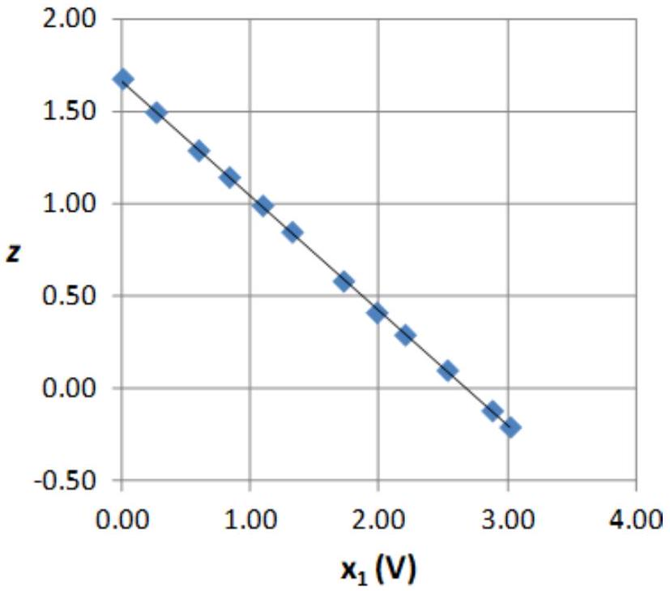
Figure 3: Graph of $x _ { 1 } ( V )$ vs $z$ for Task 4

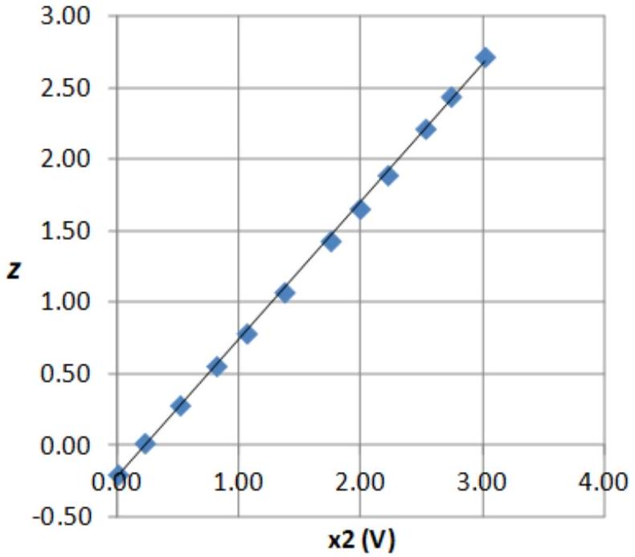
Figure 4: Graph of $x _ { 2 } ( V )$ vs $z$ for Task 4

behavior of the potentiometer, the final position is not the physical middle position. Alternatively, if a voltage is applied to the potentiometer, this can be tuned with the voltmeter function. The circuit for the modified neuron is visible in Fig. 5.

For this circuit, the input voltage $x$ is converted to $x _ { 2 }$ via the following relation:

$$
x _ { 2 } = \frac { 1 } { 2 } x
$$

Therefore, the intermediate function $z$ becomes

$$
z = w _ { 1 } U _ { + V } + \frac { w _ { 2 } } { 2 } x + b .
$$

This means that our new bias $b _ { 5 }$ is the constant part, so

$$
b _ { 5 } = w _ { 1 } U _ { + V } + b \approx - 0.35 .
$$

Note that it is also possible and fully correct to connect the other end of the potentiometer to +V instead of the ground, which leads to the same effective weight but a different $b _ { 5 }$ of approximately 1.2.

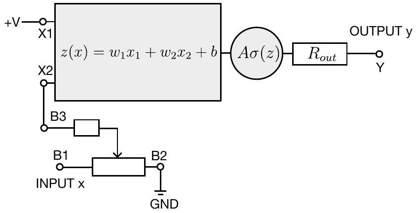
Figure 5

| $x ( V )$ | $y ( V )$ | $z$ |
| :--- | :--- | :--- |
| 0.00 | 1.13 | -0.36 |
| 0.20 | 1.19 | -0.27 |
| 0.40 | 1.25 | -0.18 |
| 0.60 | 1.32 | -0.08 |
| 0.80 | 1.39 | 0.02 |
| 1.00 | 1.46 | 0.12 |
| 1.20 | 1.51 | 0.20 |
| 1.40 | 1.58 | 0.30 |
| 1.60 | 1.63 | 0.38 |
| 1.80 | 1.69 | 0.47 |
| 2.00 | 1.77 | 0.59 |
| 2.20 | 1.82 | 0.67 |
| 2.40 | 1.87 | 0.75 |
| 2.56 | 1.93 | 0.86 |

Table 4

However, in this solution we only consider the case shown in Fig. 5.
When the circuit is assembled, we can use the Apotentiometer (connected to +V and GND) to supply a variable voltage to the input of the new neuron. This way, we can take a few measurements to confirm that our circuit behaves as desired, which leads to the data in Tab. 4.

By linearization via the inverse activation function

$$
z = - \left( \ln \frac { A } { y } - 1 \right)
$$

we can plot $z$ vs $x$ and determine the effective weight from the slope and the bias $b _ { 5 }$ from the intercept, see Fig. 6.

Experimentally, we obtain $b _ { 5 } \approx - 0.36$, which is close to the theoretical value and an effective weight of $0.47 \mathrm {~V} ^ { - 1 } \approx w _ { 2 } / 2$. Since the linear fit is also in good agreement with the data points, we have shown that our circuit fulfils the expectations.

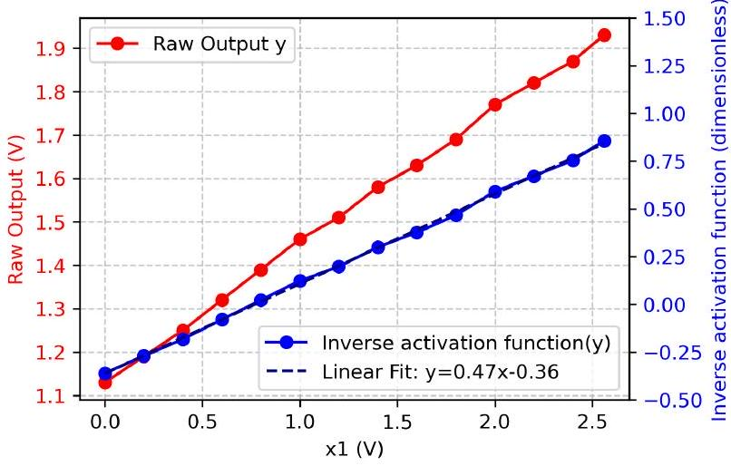
Figure 6

|  | Task 5 | Pts |
| :--- | :--- | :--- |
| A | Idea and drawing of circuit | 0.3 |
| B | Theoretical derivation and calculation of $b _ { 5 }$ partial credit for just the formula $b _ { 5 } = w _ { 1 } U _ { + V } + b$ | 0.2   0.1 |
| No points are awarded for the following parts |  |  |
|  | Raw measurement values of $y$ for vary- |  |
| C | Usage of whole span for $x$ | 0.1 |
| D | Number of Points $\leq 2$ | 0 |
|  | 3-4 | 0.1 |
|  | $\geq 5$ | 0.2 |
|  | Plot for $z$ versus $x$ |  |
| E | Size \& Axes | 0.2 |
| F | Converted values in plot | 0.2 |
| G | Linear regression line | 0.2 |
| H | Comparison of $b _ { 5 }$ | 0.1 |
| I | Overall penalty for significant digits other than 2-3 | -0.2 |
|  | Total on Task 5 | 1.5 |

Task 6

a
To determine the internal series output resistance $R _ { \text {out } }$, we have (at least) two options. We can either set the output of the neuron to a known value and connect the $Y$ terminal via an ampere-meter directly to ground - essentially shorting it - and dividing the neuron output voltage by the measured short-circuit current.
Alternatively, we can set the neuron to a known opencircuit voltage $U _ { \text {open } }$ by connecting + V to X 2 , connect Y to ground via the potentiometer resistance $R _ { \mathrm { P } }$ and measure the voltage drop $U _ { \mathrm { P } }$ over it. This is the safer version, in case we do not know how small $R _ { \text {out } }$ is and we prevent dangerous currents. We measure:

$$
U _ { \text {open } } \approx 2.71 \mathrm {~V} , \quad U _ { \mathrm { P } } \approx 2.11 \mathrm {~V}
$$

This results in:

$$
R _ { \text {out } } = \left( \frac { U _ { \text {open } } } { U _ { \mathrm { P } } } - 1 \right) R _ { \mathrm { P } } \approx 284 \Omega
$$

b
We want our circuit to approximate the function

$$
y _ { 6 } ( x ) = A _ { 6 } \cdot \sigma \left( w _ { 2 } x + b \right) + B _ { 6 }
$$

with $B _ { 6 } = 1.48 \mathrm {~V}$. First, it is obvious that $w _ { 1 }$ does not influence $y _ { 6 }$, and therefore terminal X1 needs to be connected to ground. To increase the voltage of terminal Y, we need to add a voltage divider in the form of a potentiometer between terminal Y and the supply voltage, as shown in Fig. 7.

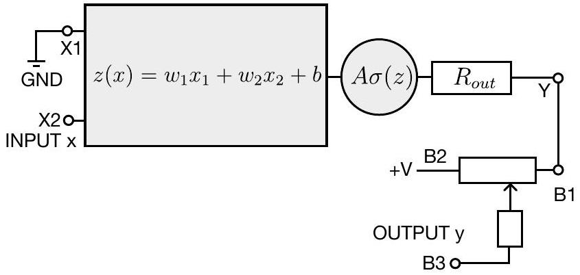
Figure 7

The output voltage can be expressed by

$$
y = ( 1 - \eta ) A \sigma \left( w _ { 2 } x + b \right) + \eta U _ { + V } ,
$$

where $\eta$ is the voltage division ratio of the $R _ { P }$ and $R _ { \text {out } }$ combined:

$$
\eta = \frac { R _ { \text {out } } + R _ { a } } { R _ { \text {out } } + R _ { P } }
$$

with $R _ { a }$ being the fraction of $R _ { P }$ that lies in between B1 and B3. With this, we can use the given value of $B _ { 6 }$ to get $\eta$ :

$$
\eta = \frac { B _ { 6 } } { U _ { + V } } \approx 0.458 \Rightarrow \frac { R _ { a } } { R _ { P } } = \frac { 1 } { R _ { P } } \left( \frac { R _ { \text {out } } + R _ { P } } { 2 } - R _ { \text {out } } \right) \approx 0.389
$$

And thus we gain a theoretical value for $A _ { 6 }$ :

$$
\begin{equation*}
A _ { 6 } = A ( 1 - \eta ) = A \left( 1 - \frac { B _ { 6 } } { U _ { + V } } \right) \approx 1.5 \mathrm {~V} . \tag{8}
\end{equation*}
$$

To experimentally verify that our neuron behaves as expected, once again, the remaining potentiometer can be used to apply different input voltages $x$ and the output $y$ is recorded. The multimeter can be used to set the internal B-potentiometer to the right ratio - do not forget to measure in the ohmmeter mode only if there are no currents running through the potentiometer. To linearize the data, we rescale the $x$ values by applying the sigmoid function $\sigma ( z ( x ) )$ to it. The resulting numerical values can be seen in Tab. 5.

If one plots $\sigma \left( w _ { 2 } x + b \right)$ against $x$, one expects a linear function with slope $A _ { 6 }$ and intercept $B _ { 6 }$. The raw data is shown in Fig. 8 and the linear fit in Fig. 9.

| $x ( V )$ | $y ( V )$ | $A \sigma \left( w _ { 2 } x + b \right) ( V )$ |
| :--- | :--- | :--- |
| 0.00 | 2.73 | 1.38 |
| 0.15 | 2.76 | 1.48 |
| 0.30 | 2.78 | 1.58 |
| 0.45 | 2.80 | 1.68 |
| 0.60 | 2.83 | 1.78 |
| 0.75 | 2.85 | 1.87 |
| 0.90 | 2.86 | 1.96 |
| 1.20 | 2.89 | 2.11 |
| 1.50 | 2.91 | 2.25 |
| 1.80 | 2.92 | 2.36 |
| 2.10 | 2.94 | 2.45 |
| 2.40 | 2.95 | 2.52 |
| 2.70 | 2.96 | 2.58 |
| 3.00 | 2.96 | 2.62 |
| 3.23 | 2.97 | 2.65 |

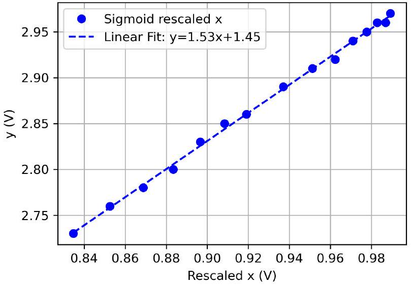
Figure 9

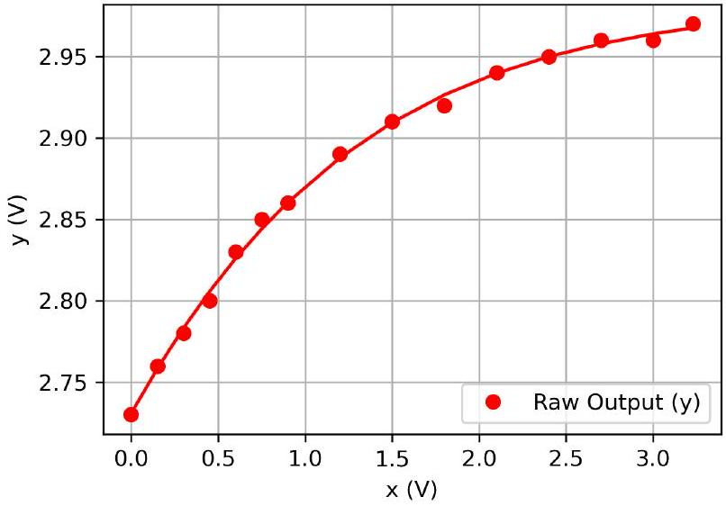
Figure 8

From the fit, we read $A _ { 6 } \approx 1.53$ and $B _ { 6 } \approx 1.45$, which is in agreement with our theoretical values up to 2 significant digits. The fact that the linear fit function agrees well with the data points further confirms that the neuron behaves as intended.

|  | Task 6 | Pts |
| :--- | :--- | :--- |
| A | Idea for output resistance | 0.2 |
| B | Measurements | 0.2 |
| C | $R _ { \text {out } } = 284 \Omega \pm 15 \Omega$ | 0.1 |
| D | Idea and drawing of circuit | 0.5 |
| No points are awarded for the following parts E-L if the circuit used is the same as used in task 4 or task 5 or the only change is that X1 is connected to GND or if there is no documentation of a circuit that is able to provide varying voltages here or in previous tasks. |  |  |
| E | Derivation of $A _ { 6 }$ (8) | 0.4 |
|  | Penalty for neglecting $R _ { \text {out } }$ | -0.2 |
| F G | Raw measurement values of $y _ { 6 }$ for varying $x$ |  |
|  | Usage of whole span for $x$ | 0.1 |
|  | Number of Points <= 2 | 0 |
|  | 3-4 | 0.1 |
|  | >= 5 | 0.2 |
| H   H   I   J | Plot for $y _ { 6 }$ versus $\sigma ( z ( x ) )$ |  |
|  | Size \& Axes | 0.2 |
|  | Converted values in plot | 0.2 |
|  | Linear regression line | 0.2 |
| K | Alignment of measured and theoretical values | 0.2 |
| L | Overall penalty for significant digits other than 2-3 | -0.2 |
|  | Total on Task 6 | 2.5 |

## E2 - Hidden pattern (10 pts)

You are given a flat semi-transparent foil with a micro-pattern printed on its surface that is invisible to the naked eye. The pattern consists of a large number of identical sinusoids with amplitude $A$, running horizontally with spatial period $\Lambda$, and vertically shifted by distance $d$ relative to each other, as schematically shown in Fig. 10. Under a microscope, one can see that the printed pattern is composed of strictly horizontal line segments, each vertically displaced from its neighbours by a constant pitch $s$, as shown in Fig. 11.

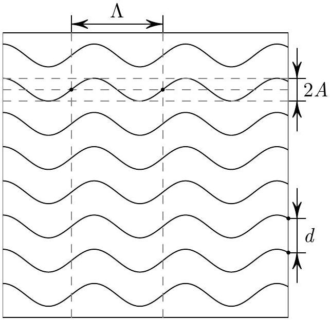
Figure 10: Pattern (not to scale)

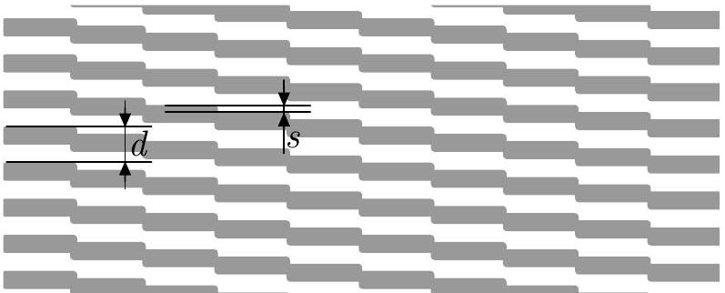
Figure 11: Pattern as seen under microscope.

## Equipment (see also Fig. 12)

A Semi-transparent foil with a micro-pattern printed on its surface.
B Laser diode with wavelength $\lambda = ( 654 \pm 5 ) \mathrm { nm }$. The laser diode can be focused to the desired distance by rotating the end cap with a lens inside.
Warning: Do not completely unscrew the end cap! Inside, there is an oriented lens and a spring. No replacement laser will be given if damaged or disassembled.
C Two 90-degree L-shaped steel planks serving as stands for the foil and the laser diode. The foil can be fixed to one of the planks using the provided small clips. The laser diode can be mounted to the other plank with a larger coloured clip or with the provided rubber band.
D A sheet of paper with a printed goniometer - a polar coordinate frame with 1-mm radial steps and

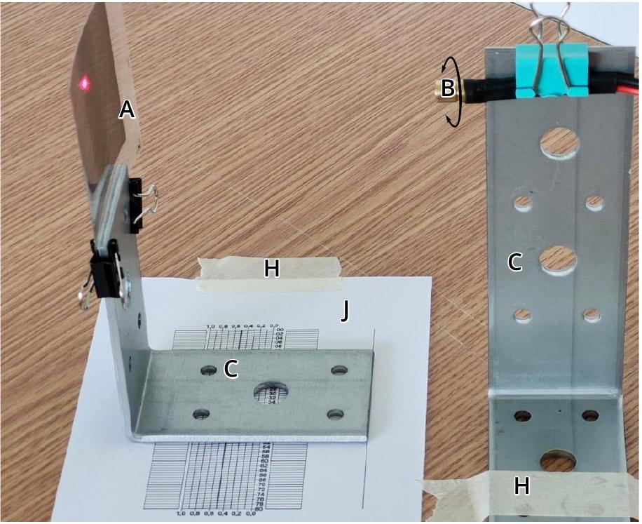
Figure 12: Components A, B, C, H, and J arranged for the experiment.

angular divisions in degrees.

E A screen: the large surface of the box containing the experimental materials. Empty the box and place it on the desk with its large surface vertical.

F Ruler.

G Measuring tape.
H Adhesive tape attached to the ruler. Use pieces of the tape to fix the printed goniometer to the screen or to secure components to the table. You can ask for more tape if needed.
I Millimeter graph paper.
J An 80mm paper measuring scale with diagonal reference lines that allow you to measure fractions of the main scale divisions, accurate to ±0.1 mm.

Hint: In all of your measurements you are free to draw or put marks on the screen.
Important: Assume that the surface of the experimental desk is flat, and the screen is strictly perpendicular to the desk.

## Tasks (10.0 pts)

Determine as precisely as possible:

a The sinusoid period $\Lambda$. (2 pts)
b The vertical offset $d$ of the neighbouring sinusoids (2 pts)
c The sinusoid amplitude $A$ (3 pts)
d The step height $s$ (3 pts)

In all of the tasks you are expected to:

1. sketch a setup and/or rationalize a method for measuring the corresponding quantities;
2. report your measurements and calculations in a tabular form;
3. estimate the desired quantities and their uncertainties graphically, whenever reasonable.

## E2－Solution

Task a．
The light transmitted through the film forms a pri－ mary and secondary diffraction pattern as displayed in Fig． 13.

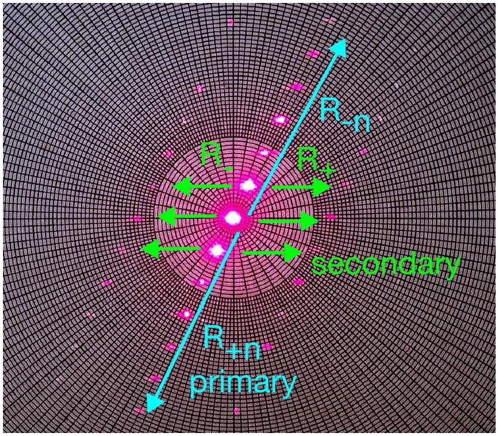
Figure 13：Photo of the diffraction pattern with the primary and secondary pattern marked．

The secondary diffraction pattern is only required for task d．For the primary diffraction pattern，a num－ ber of bright interference maxima lying on the same line is visible．This fact implies that locally，within the cross section of the laser spot，the printed lines on the film surface form a diffraction grating con－ sisting of a large number of practically linear par－ allel fringes．Therefore，the diffraction maxima are situated on a straight line，perpendicular to the tan－ gent to the illuminated sinusoids，like illustrated in Fig． 14.
By scanning the laser in a horizontal direction，the diffraction pattern will tilt according to the line slope in the illuminated spot．The pattern will be verti－ cal when the laser incidents on crests or valleys of the illuminated sinusoids．Therefore，the distance between two consecutive vertical positions of the diffraction pattern is $l = \Lambda / 2$ ，hence $\Lambda = 2 l$ ．
The experimental setup is designed as follows：As a first step，we fix the foil with two clips to the L－ shaped stand and align it carefully vertically．The goniometer is glued to the screen with the 0°－division pointing vertically．Next we fix the laser to another L－shaped stand and align it so that the beam hits the centre of the goniometer．We place the screen（go－ niometer）as far as possible from the foil to achieve larger displacements of the maxima and hence，a bet－ ter precision，also see Fig．15．The stand with the foil is being displaced in small steps across the laser beam，and the angle of inclination $\theta$ of the diffraction pattern is being measured as function of the distance $x$ between the laser spot and the edge of the film．
Further we put the ruler on the diagonal scale so

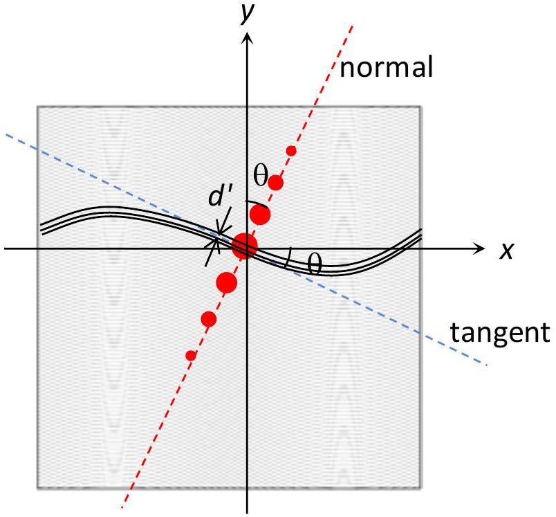
Figure 14：Qualitative sketch of interference pat－ tern．

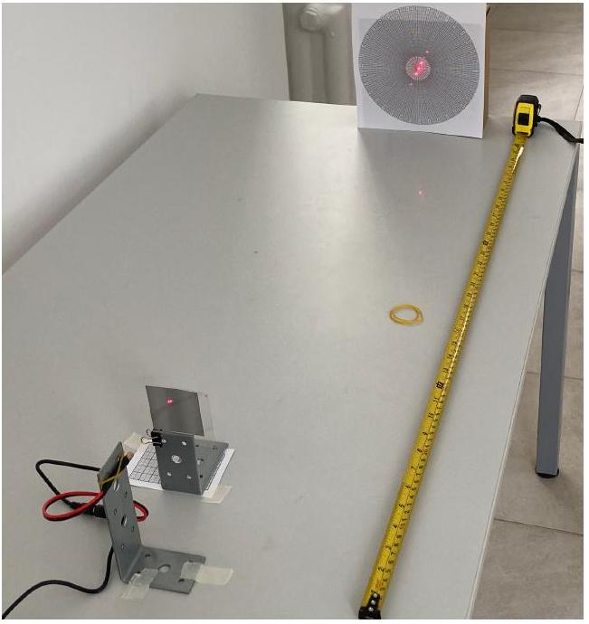
Figure 15：Setup with optimized usage of the table space for improved precision．

that one of its edges is aligned with the alignment line on the scale；we＇ll be sliding the L－shaped stand with the foil along the edge of the ruler．That way we can focus on observing how the diffraction max－ ima shift while we slide the stand，without a need for sharing our attention between the diffraction max－ ima and alignment of the stand．A sample data set is recorded in the first two columns of Table 7，while the corresponding graph of $\theta$ vs．$x$ is shown in Fig． 16.

In what follows we＇ll be outlining two possible ap－ proaches for achieving precise experimental results of the quantities asked in this problem：approach A：graphical；approach B：carefully scanning the diffraction pattern around critical configurations．

Approach A．Points $x _ { 1 }$ and $x _ { 2 }$ in Fig． 16 corre－ sponding to $\theta = 0 ^ { \circ }$ ，i．e．consecutive crest and valley of the sinusoid，can be obtained by linear fits of the

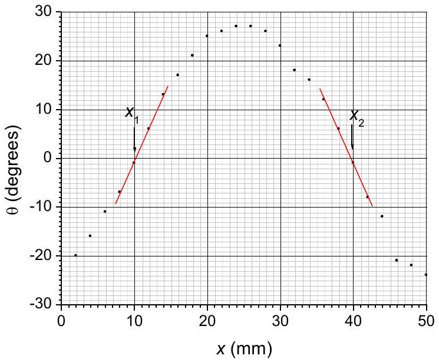
Figure 16: Graph of $\theta$ vs. $x$.

four points nearest to the zero-crossing points:

$$
x _ { 1 } = ( 10.0 \pm 0.5 ) \mathrm { mm } \quad x _ { 2 } = ( 40.5 \pm 0.5 ) \mathrm { mm } .
$$

Therefore, $l = x _ { 2 } - x _ { 1 } = 30.5 \mathrm {~mm}$ with uncertainty $\delta l =$ $\sqrt { \delta x _ { 1 } ^ { 2 } + \delta x _ { 2 } ^ { 2 } } = 0.7 \mathrm {~mm}$, and

$$
\Lambda = ( 61.0 \pm 1.4 ) \mathrm { mm }
$$

Approach B. Alternatively, we move the stand with the foil so that the diffraction maxima align along a vertical line and take the reading $x _ { 1 }$ from the diagonal scale. Next we slide the stand along the rule to find the other position where the diffraction maxima align along a vertical line and take the corresponding reading $x _ { 2 }$. We can see that achieving a vertical alignment is not easy and incurs an uncertainty, so we need to repeat the measurements. The measurement data are shown in the table below.

| No | $x _ { 1 } / \mathrm { mm }$ | $x _ { 2 } / \mathrm { mm }$ |
| :--- | :--- | :--- |
| 1 | 77.8 | 47.3 |
| 2 | 78.0 | 47.4 |
| 3 | 77.7 | 47.5 |
| 4 | 77.6 | 47.3 |
| 5 | 77.7 | 47.4 |
| avg | 77.76 | 47.38 |

According to this we calculate

$$
\Lambda = 2 \left( x _ { 2 } - x _ { 1 } \right) = 60.8 \mathrm {~mm}
$$

and $\Delta \Lambda = 0.16 \mathrm {~mm}$

|  | Task E2.a | Pts |
| :--- | :--- | :--- |
| A | Idea for linking the changing tilt of the primary diffraction pattern to phase of sinusoid.   Partial credit if full $\Lambda$ is measured between consecutive vertical positions of the diffraction pattern | 0.3   0.1 |
| B | Sketch of the correct setup (shifting the laser laterally to scan foil position and screen behind)   partial credit if $\Lambda / 2$ is measured between two "maximal" inclinations | 0.2   0.1 |
| C | Using the diagonal scale for measuring $x$ (data recorded with the precision of 0.1 mm) | 0.2 |
| D | If Approach A is chosen:   Usage of at least half the sinusoid period (30.5 mm) for variation of $x$ | 0.2   Number of recorded points:   $\geq 6$ but < 10 points recorded |
| E! | If Approach B is chosen:   Number of measurements $n$ for both $x _ { 1 }$ and $x _ { 2 } : 0.1 ( n - 2 )$, in total up to |  |
| D! | Quality of data: standard deviation between individual measurements of $\mid x _ { 1 } - x _ { 2 }$ \| 0.2 mm   $\left\| x _ { 1 } - x _ { 2 } \right\| \leq 0.3 \mathrm {~mm}$ | 0.3 |
| F | Distance between the foil and the screen at least 60 cm |  |
| G | Partial points for value of $\Lambda$ between 58 mm and 64 mm   Partial points for value of $\Lambda$ between 59.5 mm and 62.5 mm   between 60 mm and 62 mm | 0.2 |
| H | Suitable error estimation   If the error estimation is based on a reasonable approach, but the numerical estimates of the direct measurement uncertainties are clearly under- or overestimated   If the error estimation method itself is flawed or not provided | 0.2   0.1   0 |
|  | Total on Task E2.a | 2.0 |

Task b.
Approach A. It can be easily deduced from Fig. 14 that the period of the diffraction grating, perpendicularly to the printed lines, is

$$
d ^ { \prime } = d \cos \theta .
$$

The angle to the $n$-th order diffraction maximum is:

$$
\varphi = \sin ^ { - 1 } \left( \frac { n \lambda } { d \cos \theta } \right) .
$$

The distance between the 0-th and the $n$-th maxima on the screen is

$$
\begin{equation*}
R _ { n } = L \tan \varphi \approx \frac { n \lambda L } { d \cos \theta } \tag{9}
\end{equation*}
$$

where $L = 74.6 \mathrm {~cm}$ is the distance between the film and the screen, and $\sin \varphi \approx \tan \varphi$ since involved angles are much smaller than 1 rad. Therefore, if we choose a specific order maximum and measure the distance $R$ at different points on the screen, i.e. for different angles $\theta$, the distance $d$ can be calculated as a sample average:

$$
d = n \lambda L \left\langle \frac { 1 } { R \cos \theta } \right\rangle
$$

While the uncertainty -as a sample standard deviation of $d$. Since the 0-th order could be slightly offset from the goniometer center, we measure the corresponding distances between the two symmetric, $n$-th and $- n$-th, maxima: $D _ { n } = R _ { n } + R _ { - n }$ and calculate

$$
d = 2 \lambda L \left\langle \frac { 1 } { D _ { n } \cos \theta } \right\rangle
$$

The last four columns of Table 7 summarize the measured distances and calculated value of $d$ for the 5-th maximum. By averaging the $d$ values, we obtain:

$$
d = ( 60.1 \pm 0.5 ) \mu \mathrm { m }
$$

However, we need to keep in mind the uncertainty of the laser wave length. Adding the relative errors of the measurement data and laser wavelength according to the Pythagorean rule (applicable for uncorrelated error sources), we obtain

$$
d = ( 60.1 \pm 0.7 ) \mu \mathrm { m } .
$$

We note that if we use the data at $\theta = 0 ^ { \circ }$, the diffraction maxima yield directly the line distance $d$ according to

$$
\begin{equation*}
d = 2 \lambda / \sin \alpha _ { n } = 2 \lambda \sqrt { L ^ { 2 } + D _ { n } ^ { 2 } / 4 } / D _ { n } . \tag{10}
\end{equation*}
$$

Approach B. Alternatively to using many data points for different $\theta$, we can choose the positions $x = x _ { 1 }$ or $x = x _ { 2 }$ found in the previous task since they are the lateraly points offering the highest precision. Analogously to approach A, we determine the distance between the symmetric diffraction maxima of highest observable order, $n = 6$, to achieve the highest possible precision. The best way to determine the distance $D _ { n }$ is by marking dots onto the screen at the positions of the maxima, and measure the distance between the dots by ruler (to keep the goniometer clean, one can attach another sheet of paper to the stand). Since a single measurement will be very precise if done carefully, repeated measurements are not required for this task. The result of the measurement is $D _ { 6 } = 105.5 \mathrm {~mm}$ with $L = 810 \mathrm {~mm}$, resulting in $d = 59.7 \mu \mathrm {~m}$. Estimated error is $\pm 0.7 \mu \mathrm {~m}$.

|  | Task E2.b | Pts |
| :--- | :--- | :--- |
| A | Understanding that the primary diffraction pattern is created by the distance of the sinusoids to each other | 0.2 |
| B | Using $\geq 5 , \geq 7 , \geq 10 \left( \theta , D _ { n } \right)$ data points to receive 0.1, 0.2, 0.4 pts. (approach $A )$ or chossing to record data at $x = x _ { 1 }$ or $x = x _ { 2 }$ (approach $B$ ) if vertical interference pattern is used without an explanation (approach $B$ ) | 0.4 |
| C | Expression equivalent to Eq. 10 simplified Eq. 10 (without Pythagorean correction) | 0.3 0.2 |
| D | Usage of at least a total span of $6 + 6 = 12$ diffraction orders for measurement of $\phi$ Total span from 9 to 11 diffraction orders for measurement of $\phi$ Total span from 6 to 8 diffraction orders for measurement of $\phi$ If measurement data is not consistent with real experiment | 0.3 0.2 0.1 0 |
| E | Distance to the screen at least $L \geq 70 \mathrm {~cm}$ Partial credit for $L$ between 40 cm and 70 cm $L$ between 20 cm and 40 cm | 0.3 0.2 0.1 |
| F | Partial points for value of $d$ between $58 \mu \mathrm {~m}$ and $62 \mu \mathrm {~m}$ between $58.5 \mu \mathrm {~m}$ and $61.5 \mu \mathrm {~m}$ Full points for value of $d$ between $59 \mu \mathrm {~m}$ and $61 \mu \mathrm {~m}$ | 0.1 0.2 0.3 |
| G | Suitable error estimation If the error estimation is based on a reasonable approach, but the numerical estimates of the direct measurement uncertainties are clearly under- or overestimated If the error estimation method itself is flawed or not provided | 0.2 0.1 0 |
|  | Total on Task E2.b | 2.0 |

Task c.

Approach A: The point where a sinusoid crosses the $x$-axis corresponds to a maximum angle of inclination of the diffraction pattern $\theta = ( 27 \pm 1 ) ^ { \circ }$ and can be obtained as:

$$
x _ { 0 } = \frac { x _ { 1 } + x _ { 2 } } { 2 } = ( 25.3 \pm 0.7 ) \mathrm { mm } .
$$

The sinusoid equation can be written as

$$
y = A \sin \left( k \left( x - x _ { 0 } \right) \right)
$$

where:

$$
k = \frac { 2 \pi } { \Lambda } = ( 0.103 \pm 0.002 ) \mathrm { mm } ^ { - 1 }
$$

is the sinusoid wavevector. Since $\tan \theta = \mathrm { d } y / \mathrm { d } x$, we obtain:

$$
\tan \theta = k A \cos \left( k \left( x - x _ { 0 } \right) \right) .
$$

Therefore, the auxiliary variables $z = \cos \left( k \left( x - x _ { 0 } \right) \right)$ and $t = \tan \theta$ are related by a linear dependence

$$
\begin{equation*}
t = k A z \equiv m z \tag{11}
\end{equation*}
$$

and the amplitude of the sinusoid can be calculated by determining the slope coefficient $m$ ：

$$
A = \frac { m } { k } .
$$

Calculated values of $t$ and $z$ are shown in the third and fourth column of Table 7，and the corresponding graph is shown in Fig． 17.

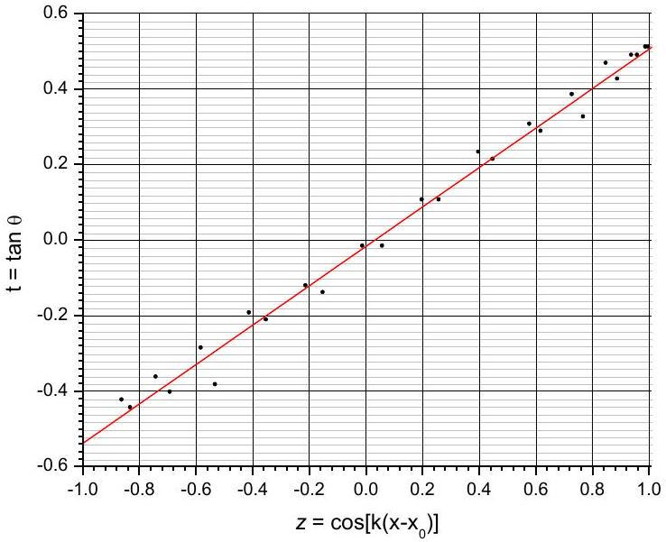
Figure 17：Graph of $\tan \theta$ vs． $\cos \left( k \left( x - x _ { 0 } \right) \right)$ ．

The slope coefficient is

$$
m = ( 0.52 \pm 0.01 ) .
$$

Therefore：

$$
A = ( 5.0 \pm 0.2 ) \mathrm { mm } .
$$

Approach B．The amplitude of the sinusoids on the foil can be determined if we know the maximal slope the printed lines $\max _ { x } \frac { \mathrm {~d} y } { \mathrm {~d} x } = A k$ as we already know the wave vector $k = 2 \pi / \Lambda$ ．We notice that the diffrac－ tion maxima lay on a line perpendicular to the lines on the foil at the point where the laser beam passes it，hence we can find the maximal slope of the lines as the maximal angle $\theta$ that the array of diffraction maxima form with the vertical axis，

$$
\begin{equation*}
\max _ { x } \frac { \mathrm {~d} y } { \mathrm {~d} x } = \max \tan \theta = \tan \theta _ { \max } \tag{12}
\end{equation*}
$$

This is done easily by using the same setup as in part A，by sliding the stand of the foil along the edge of the ruler and observing how the maxima move on the screen．As a result we obtain $\theta _ { \text {max } } = ( 27.5 \pm 0.3 ) ^ { \circ }$ ，cor－ responding to

$$
A = \Lambda \tan \theta _ { \max } / 2 \pi = ( 5.05 \pm 0.06 ) \mathrm { mm } .
$$

|  | Task E2．c | Pts |
| :--- | :--- | :--- |
| A | Recognition that the slope of the si－ nusoid is perpendicular to the primary diffraction pattern | 0.3 |
| B | Idea to use that the first derivative of the sinusoid is $\tan \theta$ | 0.3 |
| C | Correct linearization equivalent to Eq． 11 （approach A）or deriving Eq．（12） （approach B） | 0.5 |
| D   E | If approach A has been chosen |  |
|  | Computing the auxiliary（linearized） value－pairs（ $z$ and $t$ ）for |  |
|  | $\leq 5$ points | 0.0 |
|  | 6－9 points | 0.2 |
|  | $\geq 10$ points | 0.4 |
|  | Plot for $t$ versus $z$ |  |
|  | Suitable graphical evaluation to find $A$ （approach A） | 0.2 |
| E！ | If approach B has been chosen | 0.2 |
|  |  |  |
|  | Obtaining $\theta _ { \text {max } }$ |  |
|  | Partial points within $\theta _ { \text {max } } = ( 27.5 \pm 1.0 ) ^ { \circ }$ | 0.2 |
|  | Full points within $\theta _ { \text {max } } = ( 27.5 \pm 0.5 ) ^ { \circ }$ | 0.4 |
| F | Distance to the screen at least $L \geq 70 \mathrm {~cm}$ | 0.3 |
|  | Partial credit for $L$ between 40 cm and 70 cm | 0.2 |
|  | $L$ between 20 cm and 40 cm | 0.1 |
| G | Partial points for value of $A$ between | 0.2 |
|  | Partial points for value of $A$ between 4.7 mm and 5.3 mm | 0.5 |
|  | Full points for value of $A$ between 4.8 mm and 5.2 mm | 0.8 |
| H | Suitable error estimation | 0.2 |
|  | If the error estimation is based on a reasonable approach，but the numer－ ical estimates of the direct measure－ ment uncertainties are clearly under－or overestimated | 0 |
|  |  |  |
|  | Total on Task E2．c | 3.0 |

## Task d．

The vertical slabs that come from the printing tech－ nique lead to the secondary diffraction pattern as can be seen from the photo in Fig．13．In this task， there also exist two different approaches that differ in the way the diffraction vectors are modelled but lead to the same and valid result．

Approach A：In the model of Huygen＇s elementary waves，the elementary wave sources along each of the vertical edges，as shown in thick red dotted lines in Fig．18，will create wavefronts that propagate to－ wards the screen and create interference pattern．
These edges have a regular distance $g$ of each other that depends on $\theta$ ，specifically：

$$
g = \frac { s } { \tan \theta } .
$$

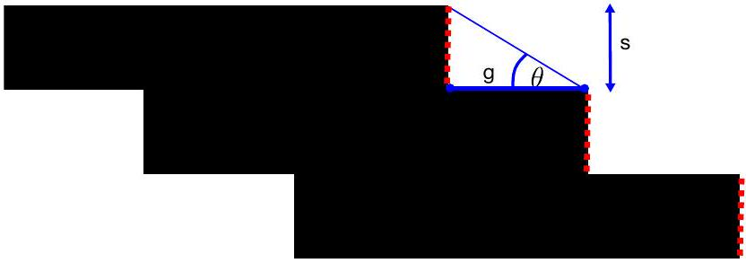
Figure 18: Sketch for explanation of the relevant quantities for secondary diffraction pattern

| $\theta$ | $\tan ( \theta )$ | $R _ { + 1 } + R _ { - 1 }$ (cm) | S $( \mu m )$ |
| :--- | :--- | :--- | :--- |
| 27.8 | 0.527 | 4.75 | $1.08 \mathrm { E } - 05$ |
| 25.7 | 0.481 | 4.65 | $1.01 \mathrm { E } - 05$ |
| 24.5 | 0.456 | 4.50 | 9.88E-06 |
| 24.7 | 0.460 | 4.60 | 9.76E-06 |
| 21.8 | 0.400 | 3.90 | $1.00 \mathrm { E } - 05$ |
| 18.1 | 0.327 | 3.00 | $1.06 \mathrm { E } - 05$ |

Table 6: Measurements of the secondary diffraction order distances for different angles $\theta$

From the diffraction angle $\omega$ of the maxima of the secondary diffraction pattern, $g$ can be expressed via:

$$
\frac { \lambda } { g } = \sin \omega \approx \omega .
$$

Experimentally, we can obtain $\omega$ via

$$
\omega \approx \tan \omega = \frac { R _ { + } + R _ { - } } { 2 L } ,
$$

where $R _ { + } + R _ { - }$is the distance between the two diffraction orders visible (left and right from the centre) in the secondary pattern. We can combine this knowledge to obtain $g$ :

$$
g = \frac { 2 L \lambda } { R _ { + } + R _ { - } }
$$

Thus, we get $s$ via the trigonometric relation

$$
\begin{equation*}
s = g \tan \theta = \frac { 2 L \lambda \tan \theta } { R _ { + } + R _ { - } } \tag{13}
\end{equation*}
$$

It is important to notice that the secondary pattern can only be observed distinctly for large $\theta$ since only in these regions, the slope of the sinusoid barely changes, which in turn means that $\theta$ and the resulting diffraction angle $\omega$ is rather constant. In Tab. 6, the recorded measurement points for the same $L = 74.6 \mathrm {~cm}$ is shown.

A graphical evaluation has no benefit over computing the average of the point-wise results here, so we use the average of $s$ as the result and its standard deviation as the error estimate. Thus, we get:

$$
s \approx ( 10.2 \pm 0.4 ) \mu \mathrm { m }
$$

triangle shown in Fig. 18, which is $h = s / \sin \theta$. Subsequently, the diffraction angle is

$$
\omega \approx \sin \omega = \frac { \lambda } { h } = \frac { \tilde { R _ { + } } + \tilde { R _ { - } } } { 2 L } ,
$$

Where $\tilde { R _ { + } }$and $\tilde { R _ { - } }$are the positions of the secondary diffraction pattern orthogonal to the primary pattern. Thus, the formula for s becomes

$$
\begin{equation*}
s = \frac { 2 L \lambda \sin \theta } { \tilde { R _ { + } } + \tilde { R _ { - } } } , \tag{14}
\end{equation*}
$$

which leads to the same outcome as in approach A since $\tilde { R _ { + } } = \cos \theta R _ { + }$and $\tilde { R _ { - } } = \cos \theta R _ { - }$.

|  | Task E2.d | Pts |
| :--- | :--- | :--- |
| A | Linking the horizontal line segments of the discrete printer resolution to the secondary diffraction pattern | 0.3 |
| B | Understanding that the diffraction angle $\omega$ depends on $\theta$ | 0.3 |
| C | Deriving the final formula to compute $s$ as in Eq. 13, or, alternatively Eq. 14 | 0.4 |
| D | Sketching or describing a suitable setup and procedure to measure the relevant quantities to determine $s$ | 0.3 |
| E | Using both the plus and minus diffraction order for improved measurement precision | 0.2 |
| F | Method of measuring $R _ { + }$and $R _ { - }$: Marking the secondary diffraction maxima with pen on screen and linear regression - evidence either via screen paper that shows this method or concise description of this | 0.3 |
|  |  |  |
| G | Distance to the screen at least $L \geq 70 \mathrm {~cm}$ | 0.3 |
|  | Partial credit for $L$ between 40 cm and 70 cm | 0.2 |
|  | $L$ between 20 cm and 40 cm | 0.1 |
| H | Choosing $\theta > 27 ^ { \circ }$ | 0.2 |
|  | partial credit for $\theta > 25 ^ { \circ }$ | 0.1 |
| I | Partial points for value of $s$ between | 0.1 |
|  | Partial points for value of $s$ between $9 \mu \mathrm {~m}$ and $11 \mu \mathrm {~m}$ | 0.3 |
|  | Full points for value of $s$ between $9.4 \mu \mathrm {~m}$ and $10.6 \mu \mathrm {~m}$ | 0.5 |
| J | Suitable error estimation | 0.2 |
|  | If the error estimation is based on a reasonable approach, but the numerical estimates of the direct measurement uncertainties are clearly under- or overestimated | 0.1 |
|  | If the error estimation method itself is flawed or not provided | 0 |
|  | Total on Task E2.d | 3.0 |

Table 7: Measurement data for experiment "hidden pattern"
| $x$ (mm) | $\theta \left( ^ { \circ } \right)$ | $z$ | $t$ | $R _ { 5 } ( \mathrm {~cm} )$ | $R _ { - 5 } ( \mathrm {~cm} )$ | $D _ { 5 } ( \mathrm {~cm} )$ | $d$ (cm) |
| :--- | :--- | :--- | :--- | :--- | :--- | :--- | :--- |
| 0 | -23 | -0.86 | -0.42447 | 4.4 | 4.4 | 8.8 | 0.00602 |
| 2 | -20 | -0.74 | -0.36397 | 4.4 | 4.3 | 8.7 | 0.00597 |
| 4 | -16 | -0.58 | -0.28675 | 4.2 | 4.2 | 8.4 | 0.00604 |
| 6 | -11 | -0.41 | -0.19438 | 4.1 | 4.1 | 8.2 | 0.00606 |
| 8 | -7 | -0.21 | -0.12278 | 4.1 | 4.1 | 8.2 | 0.00599 |
| 10 | -1 | -0.01 | -0.01746 | 4.1 | 4.1 | 8.2 | 0.00595 |
| 12 | 6 | 0.20 | 0.105104 | 4.1 | 4.1 | 8.2 | 0.00598 |
| 14 | 13 | 0.40 | 0.230868 | 4.2 | 4.2 | 8.4 | 0.00596 |
| 16 | 17 | 0.58 | 0.305731 | 4.3 | 4.3 | 8.6 | 0.00593 |
| 18 | 21 | 0.73 | 0.383864 | 4.3 | 4.3 | 8.6 | 0.00608 |
| 20 | 25 | 0.85 | 0.466308 | 4.4 | 4.4 | 8.8 | 0.00612 |
| 22 | 26 | 0.94 | 0.487733 | 4.5 | 4.6 | 9.1 | 0.00597 |
| 24 | 27 | 0.99 | 0.509525 | 4.6 | 4.5 | 9.1 | 0.00602 |
| 26 | 27 | 1.00 | 0.509525 | 4.6 | 4.5 | 9.1 | 0.00602 |
| 28 | 26 | 0.96 | 0.487733 | 4.5 | 4.6 | 9.1 | 0.00597 |
| 30 | 23 | 0.89 | 0.424475 | 4.4 | 4.4 | 8.8 | 0.00602 |
| 32 | 18 | 0.77 | 0.32492 | 4.2 | 4.2 | 8.4 | 0.00611 |
| 34 | 16 | 0.62 | 0.286745 | 4.2 | 4.3 | 8.5 | 0.00597 |
| 36 | 12 | 0.45 | 0.212557 | 4.1 | 4.1 | 8.2 | 0.00608 |
| 38 | 6 | 0.26 | 0.105104 | 4.1 | 4.1 | 8.2 | 0.00598 |
| 40 | -1 | 0.06 | -0.01746 | 4.1 | 4.1 | 8.2 | 0.00595 |
| 42 | -8 | -0.15 | -0.14054 | 4.1 | 4.1 | 8.2 | 0.00601 |
| 44 | -12 | -0.35 | -0.21256 | 4.2 | 4.1 | 8.3 | 0.00601 |
| 46 | -21 | -0.53 | -0.38386 | 4.4 | 4.4 | 8.8 | 0.00594 |
| 48 | -22 | -0.69 | -0.40403 | 4.4 | 4.4 | 8.8 | 0.00598 |
| 50 | -24 | -0.83 | -0.44523 | 4.4 | 4.4 | 8.8 | 0.00607 |
