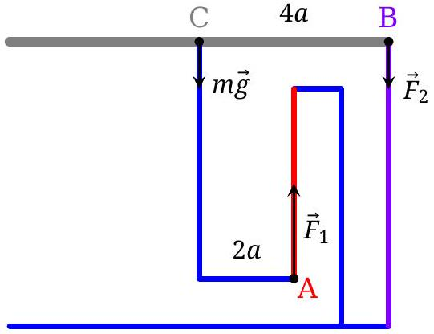
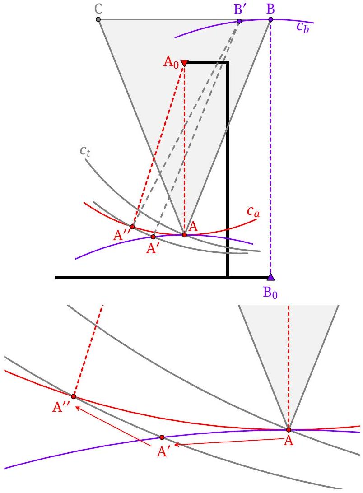
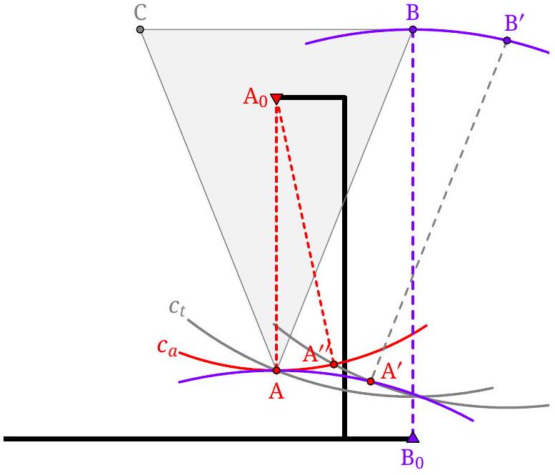
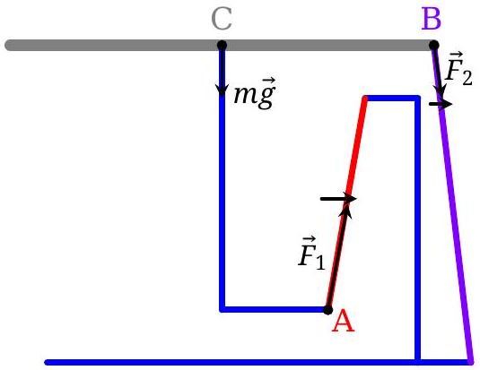
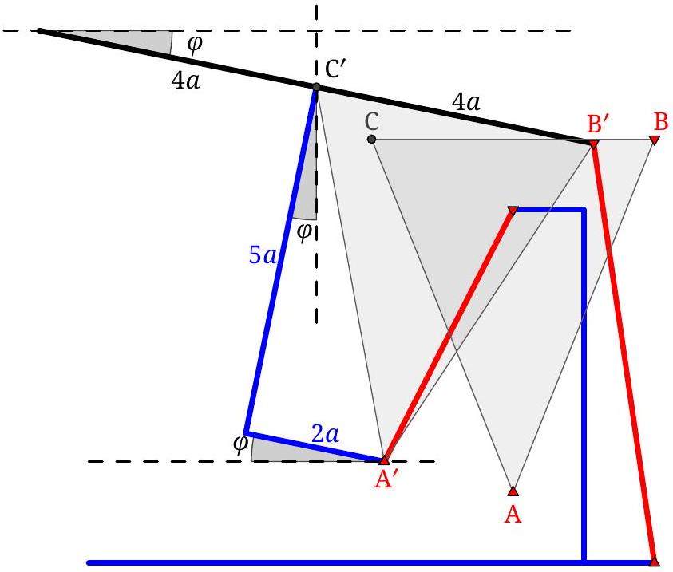
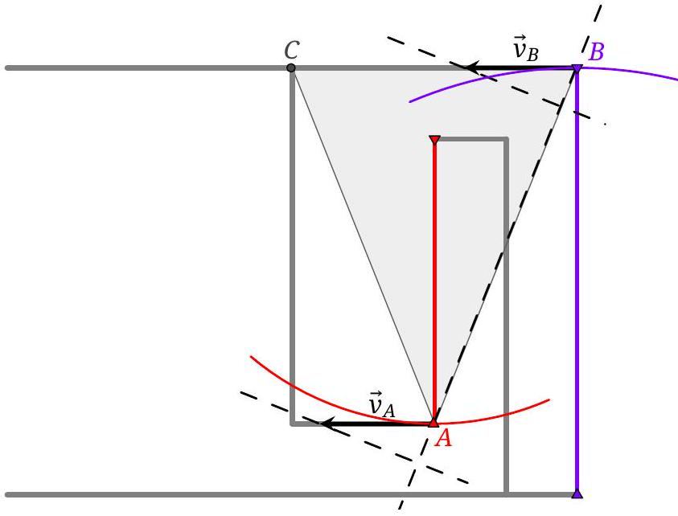
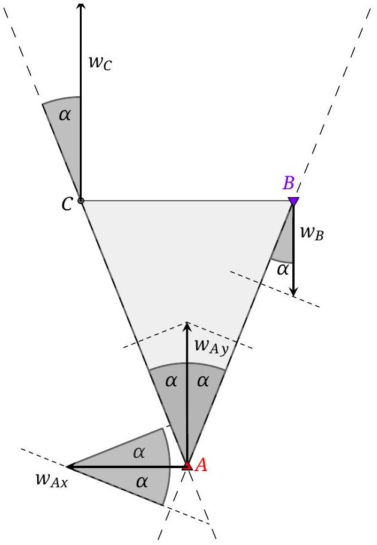
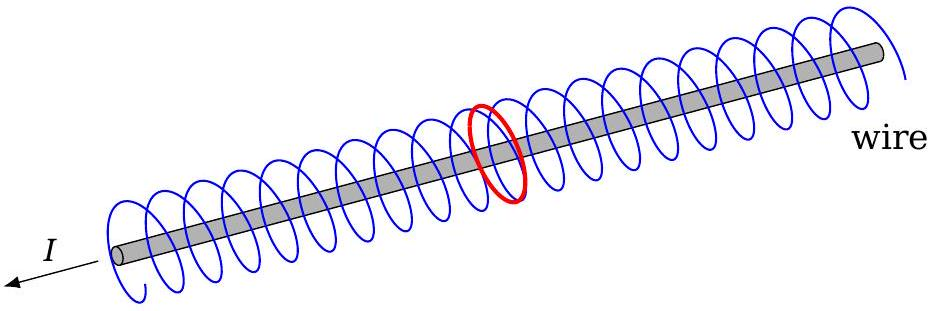
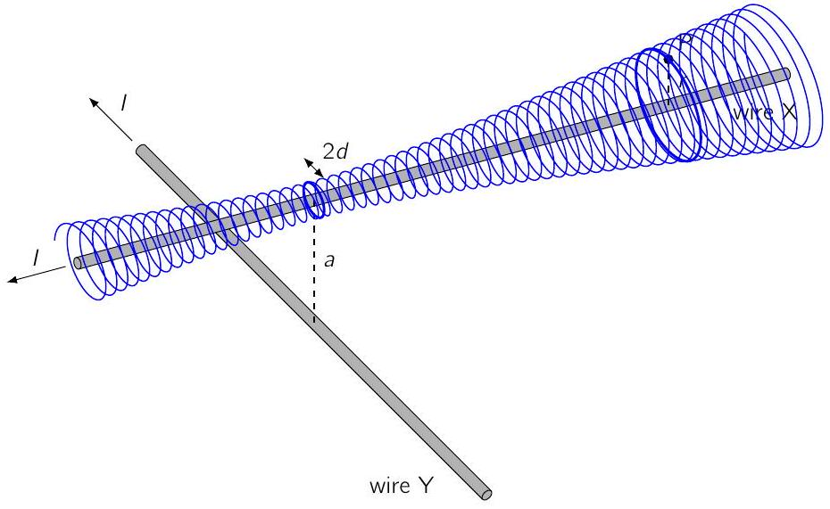
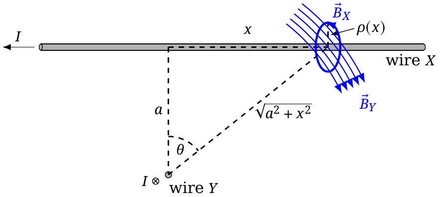

## T1: Sunny (10 pts)

Figure 1: Top view of a light ray hitting the chair leg. The incoming light ray strikes the cylinder at the blue dot, and the reflected ray strikes the floor at the red dot.

Part a) Since points A and B are very close, $I _ { 0 }$ is the illuminance surplus due to direct sunlight.

Consider a small (infinitesimal) horizontal rectangle $[ x , x + \delta x ] \times [ y , y + \delta y ]$ placed in the light beam. As depicted in Fig 1, we let $l$ be the horizontal distance between the point where a ray hits the cylinder and where it hits the floor and $\alpha$ the horizontal angle between the ray and the surface normal. The spot on the floor made by the light makes an angle of $2 \alpha$ from the incident ray, and forms a small patch of size $( l 2 \delta \alpha ) ( \delta l )$ on the floor.

Considering the side view sketched in Figure 2, we see that $\delta l \propto \delta y$ for both the ray that hits the ground directly, or a ray that is reflected before hitting the ground.

We thus have

$$
\begin{equation*}
I _ { 0 } \delta x = 2 I l \delta \alpha \tag{1}
\end{equation*}
$$

Let $\beta = \pi - \alpha$ as sketched in Fig 1. Then

$$
\begin{equation*}
\delta x = a ( \sin ( \beta + \delta \beta ) - \sin \beta ) \approx a \cos \beta \delta \beta \tag{2}
\end{equation*}
$$

Therefore,

$$
\begin{equation*}
I = - \frac { I _ { 0 } a } { 2 l } \cos ( \beta ) \tag{3}
\end{equation*}
$$

(Note that $\cos \beta < 0$.) This expression is accurate to order $( a / l ) ^ { 2 }$, but is not in terms of the variables re-

Figure 2: Side view, with the reflected light ray rotated to lie in the same plane as the incident ray.

quested. A more accurate expression would be

$$
I = - \frac { I _ { 0 } a } { \sqrt { 4 l ^ { 2 } + a ^ { 2 } \sin ^ { 2 } ( \beta ) } } \cos ( \beta ) ,
$$

but it is not necessary to find this expression.
To obtain $I$ as a function of $r$ and $\theta$, we need to express $\beta$ and $l$ in terms of $r$ and $\theta$.

If $a \ll r , l$ and $r$ almost coincide. To leading order thus $l \approx r$ and $\theta \approx \pi - 2 \alpha = 2 \beta - \pi$. Substituting $l$ and $\beta$ in (3) results in

$$
\begin{equation*}
I \approx \frac { I _ { 0 } a } { 2 r } \sin ( \theta / 2 ) \tag{4}
\end{equation*}
$$

Part b) The rings appear because the fingers block the light. For the middle ring, the finger is approximately horizontal.

For $l _ { 0 }$ be the horizontal distance $l$ for $\alpha = \pi / 2$. Consider the sketch in Fig. 2. Note that

$$
\begin{equation*}
l = l _ { 0 } + a \cos \alpha = l _ { 0 } + a | \cos ( \beta ) | \tag{5}
\end{equation*}
$$

The minimum value $R _ { \text {min } }$ is attained at $\alpha = \beta = \pi / 2$, where $\theta \approx 0$ and $R _ { \text {min } } \approx l _ { 0 }$ within an error of order $( a / r ) ^ { 2 }$. Hence,

$$
l \approx R _ { \min } + a \cos \alpha = R _ { \min } + a | \cos ( \beta ) |
$$

The Cosine theorem applied to the triangle between the center of the chair leg, the point where the ray reflects form the leg and the point where it hits the floor, gives the relation

$$
\begin{equation*}
r ^ { 2 } = a ^ { 2 } + l ^ { 2 } - 2 a l \cos ( \beta ) \tag{6}
\end{equation*}
$$

## Theoretical Problems - Solutions

Using (6) and expanding, we obtain

$$
r ^ { 2 } = R _ { \min } ^ { 2 } + 4 a R _ { \min } \cos \alpha + 3 a ^ { 2 } \cos ^ { 2 } \alpha
$$

Using $\cos \alpha \approx \sin ( \theta / 2 )$, and dropping terms of order $( a / r ) ^ { 2 }$, we arrive at

$$
\begin{equation*}
R - R _ { \min } \approx 2 a \sin ( \theta / 2 ) \tag{7}
\end{equation*}
$$

The factor of 2 is significant!

## Marking scheme T1

| Problem T1 a) |  | Pts |
| :--- | :--- | :--- |
| A | Correct angles, $2 \alpha + \theta > \pi$ | 0.5 |
|  | Only state $2 \alpha + \theta = \pi$ without justification | 0.2 |
| B | Reflection law (stated in any way) | 0.5 |
| C | $x = a \sin \alpha$ | 0.5 |
| D | Eq. 1 | 1.0 |
|  | Missing factor of 2 |  |
|  | $r$ instead of $l$ |  |
| E | Eq. 3 for $I$ | 0.5 |
| F | Justify $l \approx r$ | 0.5 |
|  | Assume $l \approx r$ without justification | 0.2 |
| G | Eq. 4 for $I$ | 1.5 |
| Total on T1 a) |  | 5.0 |

| Problem T1 b) | Pts |
| :--- | :--- |
| H Cosine Law expression | 1.0 |
| I Eq. 5 for $l$ qualitative understanding why $R ( \theta )$ varies with $\theta$ | 1.0 0.5 |
| J Justifying $l _ { 0 } \approx R _ { \text {min } }$ to leading order Only stating $l _ { 0 } \approx R _ { \text {min } }$ | 1 0.5 |
| K Final Eq. 7 | 2.0 |
| Writing $R - R _ { \text {min } } = a \sin ( \theta / 2 )$ | 1.0 |
| Only has $R _ { \text {max } } - R _ { \text {min } } = 2 a$ | 0.5 |
| Only has $R _ { \text {max } } - R _ { \text {min } } = a$ | 0.0 |
| Total on T1 b) | 5.0 |

General rules for marking in T1:

- The grain size for marking is 0.1 Pts.
- Yellow shaded categories receive a single mark
- Partial marks can be awarded for most aspects.
- For each mistake in calculation (algebraic or numeric) 0.3 Pts. are deducted.
- If a mistake leads to a dimensionally incorrect expression no marks are given for the result.
- Propagating errors are not punished again unless they are dimensionally wrong or entail oversimplified/wrong physics (e.g. neglecting friction effects).
- Getting a correct answer for a later part that could only be arrived at by doing a previous part correctly will result in the minimum score(s) for previous part(s) that would support the end result.
- Justifying F can be done graphically, algebraically, with words, but needs more than just writing $r \approx l$.
- Arriving at a correct G without supporting work would score 4.1 for A-G as (0.2, 0.5, 0.5, 0.7, 0.5, 0.2, 1.5).
- Arriving at an incorrect G without supporting work would score 0 for A-G.
- Arriving at a correct K without supporting work would score 4.5 for L-O as (1.0, 1.0, 0.5, 2.0)
- Arriving at an incorrect K without supporting work would score 0 for H-J, and then the points for K.

## T2: Floating table (10 pts)

Solution with forces First, let us consider the forces and torques and show that in the configuration shown in the figure, the table is indeed in equilibrium. By the word "table", we understand the rigid body formed by the plate and the frame attached to it. In the following considerations and descriptions of the table position we often use positions of points A, B and C, which belong to the rigid table: distances between them do not change. Since in the problem statement, the motion is limited to the side view only, the pair of short chains will always have the same position when viewed from the side. So we will consider them as a single chain (chain 1) with the tension doubled. The same is true for the pair of long chains (chain 2).

Figure 3: Scheme of forces for the initial state.

There are 3 forces acting on a table (see Fig. 3): plate weight $m \vec { g }$ (at the center of mass of the table C), and 2 tension forces from the chains: $\vec { F } _ { 1 }$ (at point A, chain 1) and $\vec { F } _ { 2 }$ (at point B, chain 2). Since all the forces only have vertical components different from 0, their horizontal components are balanced and for their vertical components, the balance equation is:

$$
\begin{equation*}
- m g + F _ { 1 } - F _ { 2 } = 0 . \tag{8}
\end{equation*}
$$

Finally, consider the torque balance around the point $B$ :

$$
\begin{equation*}
m g \cdot 4 a - F _ { 1 } \cdot 2 a = 0 . \tag{9}
\end{equation*}
$$

Solving the system of equations (8-9), we get $F _ { 1 } =$ $2 m g$ and $F _ { 2 } = m g$. Since both $F _ { 1 } , F _ { 2 } > 0$, we conclude that the chains are indeed tensioned and the system is in equilibrium.
Now let's analyze how the table rotates, when it is displaced. Since the chains are tensioned and inextensible, the point $B$ can only travel along the circle $c _ { b }$. Similarly, the distance between the point $\mathrm { A } _ { 0 }$ and any point inside the circle $c _ { a }$ is smaller than the length of the short chain (4a); the distance between the point $\mathrm { A } _ { 0 }$ and any point outside of the circle $c _ { a }$ is larger than $4 a$.

Since the table is rigid, if we fix the point B and rotate the table around it, point A would travel along the circle $c _ { t }$. From the way how $c _ { t }$ intersects with $c _ { a }$, we can conclude that if the table is rotated clockwise, the distance $\mathrm { A } _ { 0 } \mathrm {~A}$ decreases. And if it is rotated counter-clockwise, $\mathrm { A } _ { 0 } \mathrm {~A}$ increases.

Let's imagine we translate (move without rotation) the table to the left, so the point $B$ travels to the point $B ^ { \prime }$. Point $A$ would move to the point $A ^ { \prime }$, as shown in Fig. 4. Since $A ^ { \prime }$ is outside of the circle $c _ { a } , \mathrm {~A} _ { 0 } \mathrm {~A} ^ { \prime } > \mathrm { A } _ { 0 } \mathrm {~A}$ and the table has to rotate clockwise (around B') to compensate for this change and return the point A' back to the circle $c _ { a }$ (point A') to satisfy the constant chain length constraint.

Figure 4: Translation to the left and clockwise rotation of the table

If we translate the table in the opposite direction, following similar arguments, we find that the table rotates clockwise in this case too, see Fig. 5.

Figure 5: Translation to the right and clockwise rotation of the table

Since the table rotates in the same direction for both positive and negative horizontal displacements, the Taylor expansion of the angle of rotation $\varphi ( x )$ does not contain a linear term in $x : \varphi ( x ) \sim x ^ { 2 }$. This means that for small horizontal displacements, we can neglect the table rotation.

Let's look at what happens when the table is displaced infinitesimally from its initial position in the horizontal direction (it will also move in the vertical direction, but the displacement in the vertical direction is an order of magnitude smaller and we will neglect it). The vertical components of the forces in the chains do not change significantly, but as you can see in the Fig. 6, the horizontal components of the forces in both chains appear in the direction opposite to the displacement. This means that the equilibrium is stable.

Figure 6: Horizontal displacement of the table

Since we have already drawn a figure showing the displaced position of the table, let us write the equation of motion for the table plate for small horizontal displacements $x$, where $\theta _ { 1 }$ and $\theta _ { 2 }$ are small angles between the chains 1 and 2 respectively and the vertical. Since the table displacement is small, tension forces $F _ { 1 }$ and $F _ { 2 }$ cannot change significantly (the force change is of the same order as the displacement). Thus, we can use the previously found values:

$$
\begin{aligned}
m \ddot { x } = - F _ { 1 } \sin \theta _ { 1 } - F _ { 2 } \sin \theta _ { 2 } & = - F _ { 1 } \theta _ { 1 } - F _ { 2 } \theta _ { 2 } = \\
& = - 2 m g \frac { x } { 4 a } - m g \frac { x } { 6 a } = - m g \frac { 2 x } { 3 a } ,
\end{aligned}
$$

where we have also considered the lengths of the chains $4 a$ (chain 1) and $6 a$ (chain 2), neglected the rotation of the plate and used small angle approximations. Rearranging this equation, we get:

$$
\ddot { x } + \frac { 2 g } { 3 a } x = 0 ,
$$

which describes horizontal oscillations of the table plate with $\omega = \sqrt { 2 g / ( 3 a ) } = 8.09 \mathrm {~s} ^ { - 1 }$, frequency $v = 1.29 \mathrm {~Hz}$ and period

$$
T = 777 \mathrm {~ms} .
$$

Solution with energies Let's denote the small displacement of the centre of mass from equilibrium position C to C' as $( x , y )$, where $x , y \ll a$, and the small tilt of the table as $\varphi$, as shown in Fig. 7.

Figure 7: Infinitesimal displacement of the table

Given the small angle approximation $\varphi \ll 1 ( \sin \varphi \approx$ $\varphi$ and $\cos \varphi \approx 1$ ), the displacement of points from equilibrium positions A and B to A' and B' are:

$$
\begin{aligned}
\Delta A _ { x } & = x - 5 a \sin \varphi - 2 a ( 1 - \cos \varphi ) \approx x - 5 a \varphi \\
\Delta A _ { y } & = y - 2 a \sin \varphi + 5 a ( 1 - \cos \varphi ) \approx y - 2 a \varphi \\
\Delta B _ { x } & = x - 4 a ( 1 - \cos \varphi ) \approx x \\
\Delta B _ { y } & = y - 4 a \sin \varphi \approx y - 4 a \varphi
\end{aligned}
$$

Now we can write a condition that the squared length of the small chain remains the same:

$$
\begin{aligned}
& ( x - 5 a \varphi ) ^ { 2 } + ( 4 a - y + 2 a \varphi ) ^ { 2 } = ( 4 a ) ^ { 2 } \\
& x ^ { 2 } - 10 a x \varphi + 25 a ^ { 2 } \varphi ^ { 2 } - 8 a ( y - 2 a \varphi ) + ( y - 2 a \varphi ) ^ { 2 } = 0 ,
\end{aligned}
$$

Let's notice that the largest term in $x$ is $x ^ { 2 }$ and in $y$ and $a \varphi$, it's $8 a ( y + 2 a \varphi )$. Thus, we can omit all other terms, since they are of the higher order (and therefore smaller):

$$
\begin{equation*}
x ^ { 2 } - 8 a ( y - 2 a \varphi ) = 0 , \quad \frac { x ^ { 2 } } { 8 a } - y + 2 a \varphi = 0 \tag{10}
\end{equation*}
$$

Doing the same for the long chain we get:

$$
\begin{aligned}
& x ^ { 2 } + ( 6 a + y - 4 a \varphi ) ^ { 2 } = ( 6 a ) ^ { 2 } \\
& x ^ { 2 } + 12 a ( y - 4 a \varphi ) + ( y - 4 a \varphi ) ^ { 2 } = 0
\end{aligned}
$$

Omitting higher order terms we get:

$$
\begin{equation*}
x ^ { 2 } + 12 a ( y - 4 a \varphi ) = 0 , \quad \frac { x ^ { 2 } } { 12 a } + y - 4 a \varphi = 0 \tag{11}
\end{equation*}
$$

Solving (10) and (11) as linear equations on $y$ and $\varphi$, we get:

$$
y = \frac { x ^ { 2 } } { 3 a } , \quad \varphi = \frac { 5 x ^ { 2 } } { 48 a ^ { 2 } } .
$$

Since the potential energy of the table

$$
\begin{equation*}
U = m g y = \frac { 2 } { 3 a } m g \frac { x ^ { 2 } } { 2 } , \tag{12}
\end{equation*}
$$

doesn't have a term linear in $x$, we conclude that the system is in equilibrium. And since the coefficient for $x ^ { 2 }$ is positive, the equilibrium is stable.

The kinetic energy of the table is:

$$
\begin{equation*}
E = m \frac { \dot { x } ^ { 2 } + \dot { y } ^ { 2 } } { 2 } + I \frac { \dot { \varphi } ^ { 2 } } { 2 } \approx m \frac { \dot { x } ^ { 2 } } { 2 } , \tag{13}
\end{equation*}
$$

where $I$ is a moment of inertia with respect to rotation around the axis through the centre of mass C. Since both $y$ and $\varphi$ depend on $x ^ { 2 }$, their squared derivatives will be proportional to $x ^ { 2 } \dot { x } ^ { 2 }$ and can be neglected when compared to $\dot { x } ^ { 2 }$ term.

Finally, we can find the period of oscillations from the ratio of coefficients of (13) and (12):

$$
T = 2 \pi \sqrt { m / \frac { 2 m g } { 3 a } } = 2 \pi \sqrt { \frac { 3 a } { 2 g } } = 0.777 \mathrm {~s} .
$$

Solution with the curvature We begin with the observation that at the initial horizontal position, points A and B in Fig. 3 move horizontally. Therefore, the instantaneous centre of table's rotation is at infinity (found as the intersection of lines perpendicular to the velocity vectors, which are parallel in this case), or in other words there is no rotation. Another way to see it is to consider the projections of the velocities $v _ { A }$ and $v _ { B }$ to the line $A B$ which should be the same in a rigid body. Thus $v _ { A } = v _ { B } = v$ and all the points of the table move with the same velocity, i.e. there is no immediate rotation.

Figure 8: Immediate velocities given the constraints

Consequently, no rotational kinetic energy is involved, and the motion of the table can be treated as the motion of a point mass located at the centre of mass, point c. Since at the given configuration, the $v _ { C }$ can only be horizontal, we conclude that initially table is at equilibrium. All that remains is to find the radius of curvature $R$ of its trajectory and calculate $T = 2 \pi \sqrt { R / g }$.

To find the radius of curvature, we note that for an arbitrary point $P$ on the table, the curvature $\vec { c } = \hat { n } / R$

Figure 9: Immediate accelerations

of its trajectory is a linear function of its coordinates, where $\hat { n }$ denotes a unit vector pointing towards the centre of curvature. Indeed, using a non-inertial reference frame where the rigid body remains at rest with origin at $O$, the acceleration of point $P$ is the superposition of: the acceleration of $O$, the centripetal acceleration $- \overrightarrow { O P } \omega ^ { 2 }$, and the tangential acceleration $\vec { \varepsilon } \times \overrightarrow { O P }$. All of these are linear functions of the coordinates of point $P$, where $\vec { \varepsilon }$ denotes the angular acceleration and $\omega$ the angular speed. Hence, in the lab frame, the acceleration of point $P$ is a linear function of coordinates, as must be its centripetal acceleration $v ^ { 2 } \vec { c }$. Since the angular speed of the table is zero, all points move with the same speed, so $\vec { c }$ must be a linear function of coordinates.

The remaining calculation is straightforward: due to the translational motion of the body, curvatures depend only on the horizontal coordinate $x$. The curvature of $B$ at $x = 4 a$ is $c _ { B } = - 1 / ( 6 a )$, with the minus sign indicating that the vector points downwards. The curvature of $A$ at $x = 2 a$ is $c _ { A } = 1 / ( 4 a )$. Hence, the curvature of $C$ is $1 / ( 4 a ) + ( 1 / ( 4 a ) + 1 / ( 6 a ) ) = 2 / ( 3 a )$, giving $R = 1.5 \mathrm { dm }$ and resulting in $T = 777 \mathrm {~ms}$. Positive curvature means that the position is a stable equilibrium.

Another way to see it, is to consider normal acceleration $w _ { C }$ of point $C$. For 2 points of a rigid body $C$ and $B$, the projections of their accelerations $w _ { C } , w _ { B }$ to the segment $B C$ differ by the value $\omega ^ { 2 } | B C |$. However, in our case since there is no rotation, the projections of acceleration are equal (like velocities). This means that the accelaration $w _ { B }$ is also normal and equal to $w _ { B } = v ^ { 2 } / ( 6 a )$. Point $A$ has both normal and tangential acceleration. Comparing projections of points $A , B$,

and $A , C$, we get:

$$
\begin{aligned}
- w _ { B } \cos \alpha & = w _ { A y } \cos \alpha - w _ { A y } \sin \alpha \\
w _ { C } \cos \alpha & = w _ { A y } \cos \alpha + w _ { A y } \sin \alpha
\end{aligned}
$$

Thus, we find that

$$
w _ { C } = w _ { B } + 2 w _ { A y } = \frac { v ^ { 2 } } { 6 a } + 2 \frac { v ^ { 2 } } { 4 a } = \frac { v ^ { 2 } } { 3 a / 2 } ,
$$

so radius of curvature is $R = 3 a / 2$.
You can visualize the motion of the table using a GeoGebra tool, following the web link or the qr code https://www.geogebra.org/m/wbqwp3tf

Marking scheme T2

| A | Table is in equilibrium Partial points: - (1pt) Sketch of forces or eqn for forces  | 2.0 |
| :--- | :--- | :--- |
| B | The equilibrium is stable Partial points: - (1pt) Sketch with returning forces, but there is no proof that $\omega _ { 0 } = 0$ - (1pt) There is a statement that the stability comes from $y = k x ^ { 2 }$ if $k > 0$, but $k$ is not found correctly (and thus could potentially be negative)  | 2.0 |
| C | Table can rotate: whether it is clear from the sketch or from the equations, i.e. $\varphi$ is introduced | 1.0 |
| D | Table does not have immediate rotation whether it is proved separately or follows naturally from the results of calculations: - geometry considered $\Rightarrow \varphi \sim x ^ { 2 }$ - eqn for contraints $\Rightarrow \varphi \sim x ^ { 2 }$ - immediate velocities ⇒ no rotation  | 1.0 |
| E | The plan how to find the period of oscillation: - 2nd Newton's law $\ddot { x } \sim - x$ - idea to find kinetic and potential energies - using the curvature of the trajectory  | 1.0 |
| F | Finding all the elements for the plan above: - small horizontal forces - energies to the correct approximations - accelerations/curvatures    Partial points: - (1pt) if not all elements are found or they are found with mistakes - (1pt) if there is no proof $\omega _ { 0 } = 0$ (or no consideration about the rotation at all), but other than that, everything is correct - (0pts) if some elements are there, but the plan was different (e.g. the student was looking for energies, but has the expression for forces)  | 2.0 |
| G | Formula and number for $T$ Partial points: - (0.5pts) only formula or a number - (0.5pts) simple mistake (like inverse formula under the root)  | 1.0 |
| Total |  | 10.0 |

- Only a single partial point is applied (whatever is larger)
- If there is a single simple arithemetic error/typo in calculations in item F, which leads to a wrong formula value in item G, then F and G receive 1 pt each (no propagation of error). This doesn't apply to more profound errors in physics/geometry

## T3: Crossed Wires (10 pts)

Part a) In the absence of an externally imposed magnetic field, an infinite, straight, thin wire creates a magnetic field whose field lines are closed circular loops. These loops lie in the plane perpendicular to the wire and are centered on the wire (red circle in the figure).
Now, consider the effect of introducing the externally imposed magnetic field. At any point, the total magnetic field is the vector sum of the magnetic field of the wire and the externally imposed magnetic field. The total magnetic field now has a component parallel to the wire. This means the magnetic field lines do not remain in a plane perpendicular to the wire. They do not form closed loops any more. Instead, they will spiral around the wire, tracing out a helix (blue curve in the figure).

Part b) It is a standard result that the magnetic field around an infinite, straight, thin wire carrying a current $I$ has magnitude $\mu _ { 0 } I / 2 \pi \rho$, where $\rho$ is the perpendicular distance to the wire. This magnetic field strength increases as $r$ decreases. Before considering the wire configuration of part b, it will be useful to discuss what happens in part a if the helical field line is very close to the wire. By 'close', we mean values of $\rho$ small enough that the magnetic field of the wire is much greater than the externally applied magnetic field. Then, the field lines cannot deviate much from the circular loops they would trace out if the externally applied field were not present. This means the helix would be wound very tightly.
Now we move on to discuss the wire configuration of part b. Let the magnetic field due to wire $X$ be $\vec { B } _ { X }$ and the magnetic field due to wire $Y$ be $\vec { B } _ { Y }$. At any point in space, the magnetic field is the vector sum of $\vec { B } _ { X }$ and $\vec { B } _ { Y }$. At points that are close to wire $X$ (distances $\rho \ll a$ ), we have $\left| \vec { B } _ { X } \right| \gg \left| \vec { B } _ { Y } \right|$. Therefore, as in part a, the field lines near wire $X$ will not deviate very much from circular loops centered on wire $X$. However, $\vec { B } _ { Y }$ has a component along wire $X$, so the field lines do not perfectly close on themselves. Instead, they will trace out a tightly wound spiral around wire $X$, as shown in the figure for the previous part. Unlike there, the spiral is not necessarily a perfect helix: as the field lines spiral to larger or smaller $x$, the radius $\rho ( x )$ of the spiral might change. To find the distance of closest approach of a field line to wire $X$, we must find the minimal value of $\rho ( x )$ as $x$ varies.
The spiraling field line shown in the figure below seems to trace out a surface, $S$, surrounding wire $X$. A more precise definition of $S$ is as follows. Let $C$ be the circle of radius $r$, centered on wire $X$, in the plane $x = 3 a$. Through every point on $C$, we can draw a magnetic field line. The set of field lines passing through points of $C$ traces out a surface; this is the surface we define as $S$. Each field line in this set spirals around wire $X$ as described above, so $S$ looks like a 'funnel' whose cross section, at any fixed $x$, is nearly circular. The cross section is nearly circular as long as the condition $\rho \ll \sqrt { a ^ { 2 } + x ^ { 2 } }$ is satisfied, because this means the magnetic field is perturbed only slightly by wire $Y$ and the field lines do not deviate much from the circular loops that they would trace if wire $Y$ were not present. Near point P, $\rho \ll \sqrt { a ^ { 2 } + x ^ { 2 } }$ is satisfied because $r \ll a$. We will verify a posteriori that the magnetic field line never reaches values of $\rho$ that violate the condition $\rho \ll \sqrt { a ^ { 2 } + x ^ { 2 } }$.

The key idea is that the magnetic flux through the middle of the 'funnel' $S$ is conserved. No magnetic flux exits through the sides of the funnel becauseby construction-the magnetic field is tangent to $S$ at every point. For this reason, the region bounded by $S$ is called a 'flux tube'. The flux through the flux tube is entirely due to $\vec { B } _ { Y }$, which is approximately uniform over the circular cross section at each $x$.

The component of $\vec { B } _ { Y }$ directed along the wire is $B _ { \| } = \left| \vec { B } _ { Y } \right| \cos ( \theta ) = \left( \mu _ { 0 } I / 2 \pi \right) \left( a / \left( a ^ { 2 } + x ^ { 2 } \right) \right)$ (see figure above). Therefore, the conserved flux is $\frac { 1 } { 2 } \mu _ { 0 } I a \rho ^ { 2 } / \left( a ^ { 2 } + x ^ { 2 } \right)$. The equation of $S$ is then $\rho ^ { 2 } / \left( a ^ { 2 } + x ^ { 2 } \right) =$ const. $= r ^ { 2 } / 10 a ^ { 2 }$, using the fact that $S$ passes through P. We can now see that $\rho$ never grows so large that $\rho \ll \sqrt { a ^ { 2 } + x ^ { 2 } }$ fails, so our equation for $S$ remains valid for all $x$. Then, the minimal value of $\rho ( x )$ is $\rho ( 0 ) = d = r / \sqrt { 10 }$.

Part c) Let the point of closest approach be Q. We need to calculate the length of the spiraling field line between points P and Q. Due to the tight winding of

the field lines, this length is much larger than $r$ or $a$. Therefore, the precise position of point Q around the loop closest to $x = 0$ (for example, whether it is on the side closer to wire $Y$ or on the side further from wire $Y$ ) is unimportant. To leading order, $L$ equals the length along the field line from P to the point on the field line with $x = 0$.

Consider two points on the field line whose $x$ coordinates differ by a small amount $\mathrm { d } x$. The length $\mathrm { d } L$ of the short segment of field line joining these points is given by $\mathrm { d } x \approx \left( B _ { \| } / B _ { \perp } \right) \mathrm { d } L$. Here, we have decomposed the magnetic field vector into a component $B _ { \| }$along wire $X$ and a component $B _ { \perp }$ perpendicular to wire $X$. In the previous part, we found $B _ { \| } = \left( \mu _ { 0 } I / 2 \pi \right) \left( a / \left( a ^ { 2 } + x ^ { 2 } \right) \right)$. The field of wire $X$ gives the dominant contribution to $B _ { \perp }$, so $B _ { \perp } = \mu _ { 0 } I / 2 \pi \rho$. These expressions are approximate and ignore corrections of order $r / a$. Since $r / a \approx 1 / 100$, ignoring these corrections is acceptable for the required accuracy of 20\%. The total length is obtained by integration:

$$
L = \int _ { Q } ^ { P } \mathrm {~d} L = \int _ { 0 } ^ { 3 a } \frac { a ^ { 2 } + x ^ { 2 } } { a \rho } \mathrm {~d} x
$$

Now, we use the equation for $\rho ( x )$ derived in part b: $\rho ( x ) ^ { 2 } / \left( a ^ { 2 } + x ^ { 2 } \right) = r ^ { 2 } / \left( 10 a ^ { 2 } \right)$. The result is

$$
L = \int _ { 0 } ^ { 3 a } \frac { \sqrt { 10 } } { r } \sqrt { a ^ { 2 } + x ^ { 2 } } \mathrm {~d} x = \frac { \sqrt { 10 } a ^ { 2 } } { r } \int _ { 0 } ^ { 3 } \sqrt { 1 + u ^ { 2 } } \mathrm {~d} u .
$$

This expression must be numerically evaluated to within 20\% relative error. To obtain a numerical value for the integral, we could use the trapezium rule or we could draw the curve $y = \sqrt { 1 + x ^ { 2 } }$ between $x = 0$ and $x = 3$ on graph paper and count the number of squares beneath the curve. In fact, a crude estimate using a single trapezium is sufficient for the required accuracy: $\int _ { 0 } ^ { 3 } \sqrt { 1 + u ^ { 2 } } \mathrm {~d} u \approx \int _ { 0 } ^ { 3 } [ 1 +$ $( \sqrt { 10 } - 1 ) ( u / 3 ) ] \mathrm { d } u = 3 + ( 3 / 2 ) ( \sqrt { 10 } - 1 ) \approx 6.24$, resulting in a length of $L \approx 19.7 a ^ { 2 } / r \approx 197 \mathrm {~m}$. The exact result is $L \approx 17.9 a ^ { 2 } / r \approx 179 \mathrm {~m}$.

Although not necessary for full credit, it is possible to evaluate the integral exactly. Substituting $u = \sinh ( \beta )$ with $\mathrm { d } u = \cosh ( \beta ) \mathrm { d } \beta$ and using $\cosh ^ { 2 } ( \beta ) - \sinh ^ { 2 } ( \beta ) = 1$ gives

$$
\int _ { 0 } ^ { 3 } \sqrt { 1 + u ^ { 2 } } \mathrm {~d} u = \int _ { 0 } ^ { \sinh ^ { - 1 } ( 3 ) } \cosh ^ { 2 } ( \beta ) \mathrm { d } \beta
$$

Now, we use $\cosh ^ { 2 } ( \beta ) = \left( e ^ { 2 \beta } + 2 + e ^ { - 2 \beta } \right) / 4 = ( \cosh ( 2 \beta ) + 1 ) / 2$ to obtain

$$
\begin{aligned}
\int _ { 0 } ^ { 3 } \sqrt { 1 + u ^ { 2 } } \mathrm {~d} u & = \frac { 1 } { 2 } \int _ { 0 } ^ { \sinh ^ { - 1 } ( 3 ) } [ \cosh ( 2 \beta ) + 1 ] \mathrm { d } \beta \\
& = \frac { 1 } { 4 } [ \sinh ( 2 \beta ) + 2 \beta ] _ { 0 } ^ { \sinh ^ { - 1 } ( 3 ) }
\end{aligned}
$$

Finally, we use $\sinh ( 2 \beta ) = \left( e ^ { 2 \beta } - e ^ { - 2 \beta } \right) / 2 =$ $2 \sinh ( \beta ) \cosh ( \beta )$ and $\cosh \left( \sinh ^ { - 1 } ( 3 ) \right)$ =

$$
\begin{aligned}
& \sqrt { 1 + \sinh \left( \sinh ^ { - 1 } ( 3 ) \right) ^ { 2 } } = \sqrt { 10 } \text { to find } \\
& \qquad \begin{aligned}
\int _ { 0 } ^ { 3 } \sqrt { 1 + u ^ { 2 } } \mathrm {~d} u & = \frac { 1 } { 2 } \left[ 3 \sqrt { 10 } + \sinh ^ { - 1 } ( 3 ) \right] \\
& = \frac { 1 } { 2 } [ 3 \sqrt { 10 } + \ln ( 3 + \sqrt { 10 } ) ] \\
& \approx 5.65 .
\end{aligned}
\end{aligned}
$$

This gives $L \approx 17.9 a ^ { 2 } / r \approx 179 \mathrm {~m}$, as stated above.

## Marking scheme T3

| Problem T3 a) | Pts. |
| :--- | :--- |
| A draw clear sketch (straight wire, smooth field line, ...) | 0.2 |
| field line ... |  |
| B ...is not closed | 0.2 |
| C ...is periodic in $x$ | 0.2 |
| D ...is helical (only 0.1 if chirality is wrong) | 0.2 |
| E ...is centered on wire | 0.2 |
| Total on T3 a) | 1.0 |

| Problem T3 b) | Pts. |
| :--- | :--- |
| A state or derive formula for magnetic field of infinite, straight wire (only 0.2 if direction is not clear) | 0.4 |
| sketch or explain shape of field line B field line is locally nearly circular | 0.2 |
| C field line resembles helix tightly wound around wire | 0.2 |
| D radius of helix is changing | 0.3 |
| E idea to consider funnel surface $S$ | 0.5 |
| F realize and justify that $B _ { Y }$-flux is conserved along funnel | 1.0 |
| G argue or show that radius of flux tube is smallest at $x = 0$ | 0.5 |
| H approximate $B _ { Y }$ as uniform in flux tube cross-sections | 0.4 |
| I determine flux at $x = 3 a$ (0.3 for projection, 0.2 for area) | 0.5 |
| J determine flux at $x = 0$ using $\rho$ | 0.3 |
| K calculate final result for $d$ | 0.5 |
| L check of validity of approximations in considered region | 0.2 |
| Total on T3 b) | 5.0 |

| Problem T3 c) |  | Pts. |
| :--- | :--- | :--- |
|  | A realize that $L$ is much larger than $a$ and $r$ (also if implicit) | 0.2 |
| B | equate $\mathrm { d } x$ with $\mathrm { d } L$ using $B$-field components or an angle | 0.4 |
| C | realize that $B _ { \perp }$ is dominated by wire $X$ (might be mentioned in part b) already) | 0.3 |
| D | derive integral expression for $L$ | 0.4 |
| E | provide expression for $\rho$ in terms of $a , r$ and $x$ (also if in part b)) | 0.5 |
| F | carry out reasonable numerical approximation or rigorous calculation of integral | 1.2 |
| G | result with $140 \mathrm {~m} \leq L \leq 215 \mathrm {~m}$ (-0.2 if \# significant figures is 1 or > 3) | 1.0 |
| Total on T3 c) |  | 4.0 |

General rules for marking in T3:

- The grain size for marking is 0.1 Pts.
- Partial marks can be awarded for most aspects.
- For each mistake in calculation (algebraic or numeric) 0.2 Pts. are deducted.
- If a mistake leads to a dimensionally incorrect expression no marks are given for the result.
- Propagating errors are not punished again unless they are dimensionally wrong or entail oversimplified/wrong physics (e.g. neglecting friction effects).
- In cases, where in part b) the distance of closest approach is determined by using an approximation that only considers the $B$-field close to P (or any similar simplification), the following maximum marks can be obtained: A to C - 0.2 each, E - 0.3 for the idea to determine $d$ from a local consideration, H - 0.4, K - 0.3 for a simplified calculation of $d$. Total: max. 1.6 Pts.
