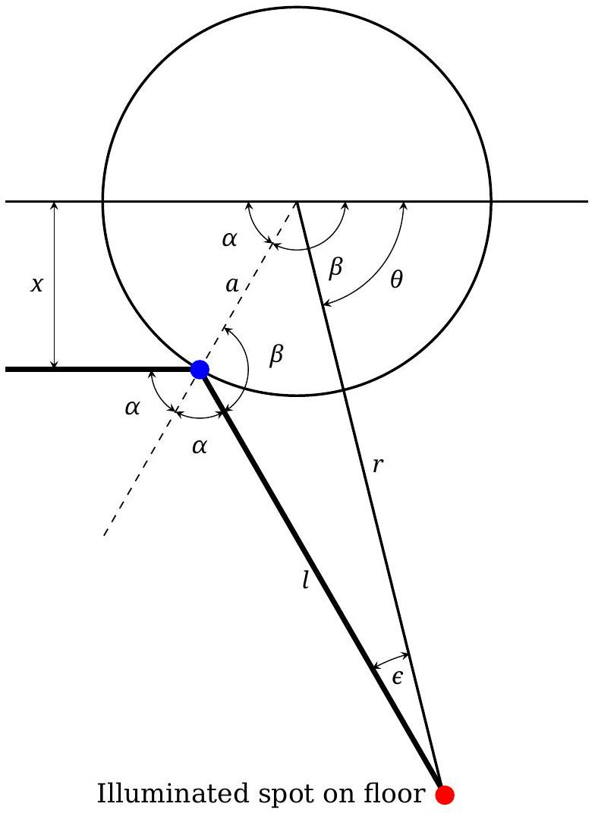
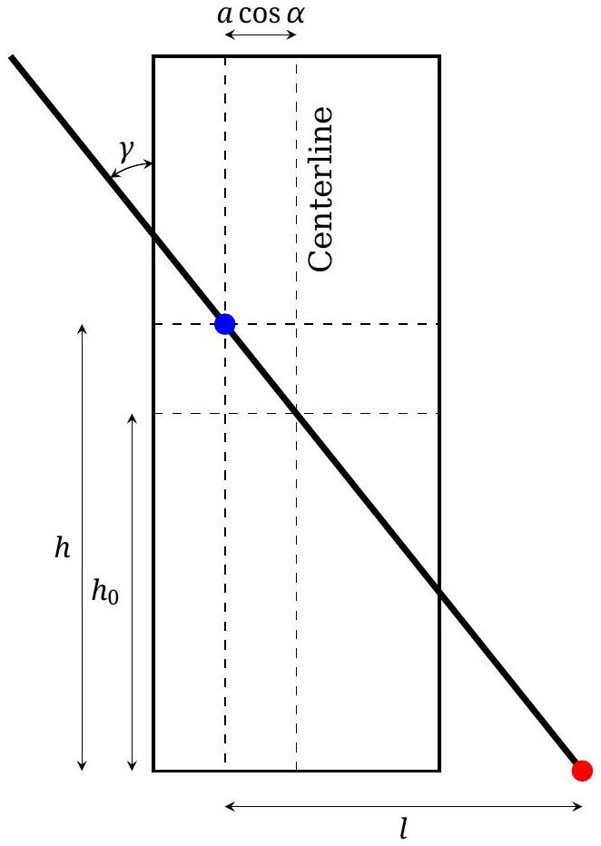

## T1: Sunny (10 pts)

Figure 1: Top view of a light ray hitting the chair leg. The incoming light ray strikes the cylinder at the blue dot, and the reflected ray strikes the floor at the red dot.

Part a) Since points A and B are very close, $I _ { 0 }$ is the illuminance surplus due to direct sunlight.

Consider a small (infinitesimal) horizontal rectangle $[ x , x + \delta x ] \times [ y , y + \delta y ]$ placed in the light beam. As depicted in Fig 1, we let $l$ be the horizontal distance between the point where a ray hits the cylinder and where it hits the floor and $\alpha$ the horizontal angle between the ray and the surface normal. The spot on the floor made by the light makes an angle of $2 \alpha$ from the incident ray, and forms a small patch of size $( l 2 \delta \alpha ) ( \delta l )$ on the floor.

Considering the side view sketched in Figure 2, we see that $\delta l \propto \delta y$ for both the ray that hits the ground directly, or a ray that is reflected before hitting the ground.

We thus have

$$
\begin{equation*}
I _ { 0 } \delta x = 2 I l \delta \alpha \tag{1}
\end{equation*}
$$

Let $\beta = \pi - \alpha$ as sketched in Fig 1. Then

$$
\begin{equation*}
\delta x = a ( \sin ( \beta + \delta \beta ) - \sin \beta ) \approx a \cos \beta \delta \beta \tag{2}
\end{equation*}
$$

Therefore,

$$
\begin{equation*}
I = - \frac { I _ { 0 } a } { 2 l } \cos ( \beta ) \tag{3}
\end{equation*}
$$

(Note that $\cos \beta < 0$.) This expression is accurate to order $( a / l ) ^ { 2 }$, but is not in terms of the variables re-

Figure 2: Side view, with the reflected light ray rotated to lie in the same plane as the incident ray.

quested. A more accurate expression would be

$$
I = - \frac { I _ { 0 } a } { \sqrt { 4 l ^ { 2 } + a ^ { 2 } \sin ^ { 2 } ( \beta ) } } \cos ( \beta ) ,
$$

but it is not necessary to find this expression.
To obtain $I$ as a function of $r$ and $\theta$, we need to express $\beta$ and $l$ in terms of $r$ and $\theta$.

If $a \ll r , l$ and $r$ almost coincide. To leading order thus $l \approx r$ and $\theta \approx \pi - 2 \alpha = 2 \beta - \pi$. Substituting $l$ and $\beta$ in (3) results in

$$
\begin{equation*}
I \approx \frac { I _ { 0 } a } { 2 r } \sin ( \theta / 2 ) \tag{4}
\end{equation*}
$$

Part b) The rings appear because the fingers block the light. For the middle ring, the finger is approximately horizontal.

For $l _ { 0 }$ be the horizontal distance $l$ for $\alpha = \pi / 2$. Consider the sketch in Fig. 2. Note that

$$
\begin{equation*}
l = l _ { 0 } + a \cos \alpha = l _ { 0 } + a | \cos ( \beta ) | \tag{5}
\end{equation*}
$$

The minimum value $R _ { \text {min } }$ is attained at $\alpha = \beta = \pi / 2$, where $\theta \approx 0$ and $R _ { \text {min } } \approx l _ { 0 }$ within an error of order $( a / r ) ^ { 2 }$. Hence,

$$
l \approx R _ { \min } + a \cos \alpha = R _ { \min } + a | \cos ( \beta ) |
$$

The Cosine theorem applied to the triangle between the center of the chair leg, the point where the ray reflects form the leg and the point where it hits the floor, gives the relation

$$
\begin{equation*}
r ^ { 2 } = a ^ { 2 } + l ^ { 2 } - 2 a l \cos ( \beta ) \tag{6}
\end{equation*}
$$

## Theoretical Problems - Solutions

Using (6) and expanding, we obtain

$$
r ^ { 2 } = R _ { \min } ^ { 2 } + 4 a R _ { \min } \cos \alpha + 3 a ^ { 2 } \cos ^ { 2 } \alpha
$$

Using $\cos \alpha \approx \sin ( \theta / 2 )$, and dropping terms of order $( a / r ) ^ { 2 }$, we arrive at

$$
\begin{equation*}
R - R _ { \min } \approx 2 a \sin ( \theta / 2 ) \tag{7}
\end{equation*}
$$

The factor of 2 is significant!
