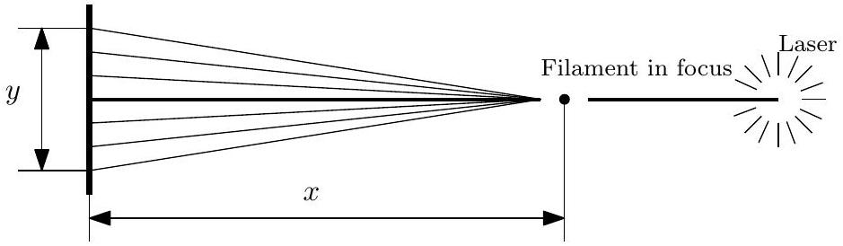
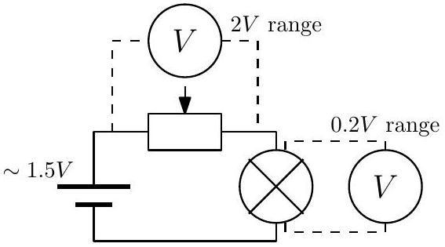
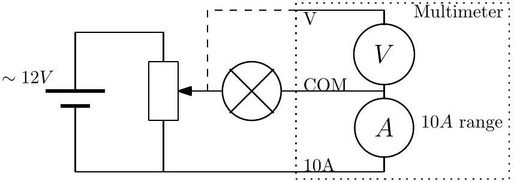
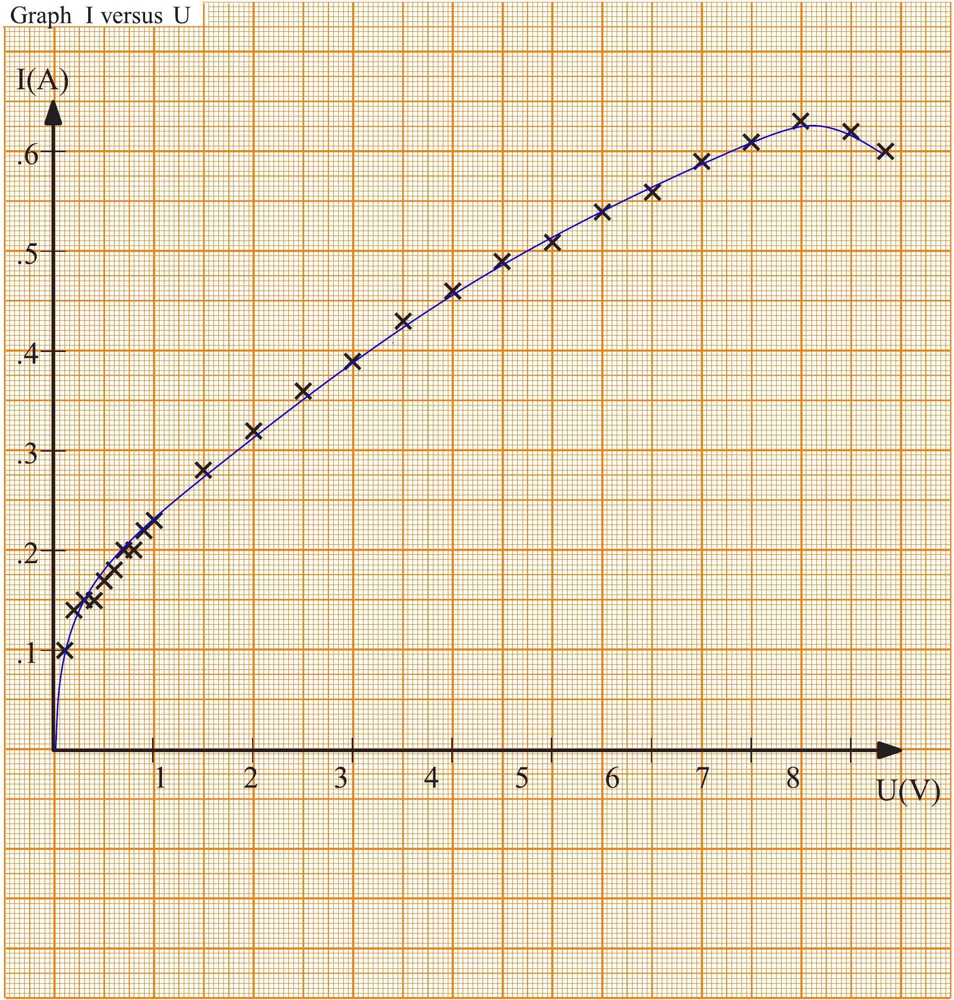
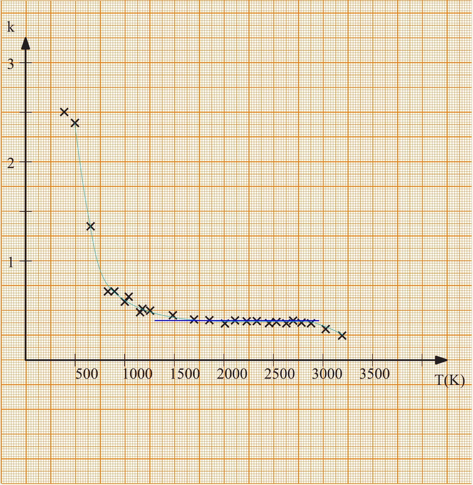

## Problem E2. Tungsten Filament (13 points) Part A. Filament diameter (1.5 points)

The sketch the measurement setup:
Screen as far as possible

(0.2 pts)

We focus the laser to the filament, holding the screen close to the filament during the adjustments helps focusing. For the measurements we place the screen perpendicular to the beam and reasonably far back $( x \geq 50 \mathrm {~cm} )$ to get the maxima spaced out.
(0.2 pts)

Partial credit if $30 \mathrm {~cm} \leq x < 50 \mathrm {~cm}$.
(0.1 pts)

We measure the distance between two maxima or two minima. To get more accurate measurement we choose maxima that are far apart $( n \geq 5 )$.
(0.2 pts)

Partial credit if $3 \leq n < 5$.
(0.1 pts)

Formula for calculating diameter $d = \frac { n \lambda x } { y }$.
(0.2 pts)

Most of the uncertainty in this case is due to the fact the diffraction pattern is fuzzy. To estimate the uncertainty we should perform repeated measurements (three or more).

| $n$ | $x$ | $y$ | $d = \frac { n \lambda x } { y }$ |
| :--- | :--- | :--- | :--- |
| 10 | 909 mm | 131 mm | $45.1 \mu \mathrm {~m}$ |
| 7 | 905 mm | 89 mm | $46.3 \mu \mathrm {~m}$ |
| 7 | 907 mm | 87 mm | $47.4 \mu \mathrm {~m}$ |

(0.3 pts)
(Each line in table up to 3rd earns 0.1 pts.)
Filament diameter $d$ and its uncertainty:

$$
d = 46.3 \mu \mathrm {~m}
$$

For $| d - 46.3 \mu \mathrm {~m} | \leq 2 \mu \mathrm {~m}$,
partial credit if $2 \mu \mathrm {~m} < | d - 46.3 \mu \mathrm {~m} | \leq 5 \mu \mathrm {~m}$,
Uncertainty is dominated by the uncertainty of $y , \Delta d \approx d \frac { \Delta x } { x } \approx$
$1.2 \mu \mathrm {~m}$. Reasonably estimated $\Delta y$,
correct calculation of $\Delta d$

Part B. Filament's resistance (2 points)

The problem is that with this multimeter we cannot accurately measure the resistance of the filament directly when the knob is turned to the resistance measurement position, the resistance is too small for that. There are two issues: first, the multimeter is not accurate enough $\pm 0.5 \% + 0.5 \Omega$; second, the internal resistance can be in the same order of magnitude. If the filament's resistance is directly measured, no more than 0.5 points overall: 0.3 pts for the answer if it is within $0.8 \pm 0.4 \Omega$, and 0.2 pts for the uncertainty if it is stated as either $0.5 \Omega$ or $0.6 \Omega$.
Thus, we need to pass a current through the bulb and measure the voltage.
(0.1 pts)

The current needs to be small, otherwise we shall heat the filament.
(0.2 pts)

To get the smallest possible current we use a single 1.5 V battery
(0.1 pts)
(0.1 pts)

We can measure accurately the voltage on the bulb, but the problem is the current, because the ammeter is not ideal. If we use it in the "mA"-range, we cannot take account its internal resistance, if we use it in 10A-range, the current measurement error will be large. So, we need to use the multimeter as a voltmeter.
(0.1 pts)

Thus, we use the circuit as shown below.
(0.1 pts)

The resistance of the rheostat can be measured directly, or using current/voltage measurements, $R _ { r } = 25.3 \Omega$
(0.1 pts)
(0.1 pts)

Here and in what follows only reasonable results are accepted.
Measurement results: $U _ { r } = 1.483 \mathrm {~V}$
(0.1 pts)
$U _ { b } = 45.0 \mathrm { mV }$
(0.1 pts)
$\Delta U _ { r } = 0.012 \mathrm {~V}$, and $\Delta U _ { b } = 0.5 \mathrm { mV }$
(0.1 pts)

Formula for filament resistance $R = U _ { b } R _ { r } / U _ { r }$
(0.1 pts)

Formula for filament resistance uncertainty

$$
\Delta R = R \sqrt { \left( \frac { \Delta U _ { r } } { U _ { r } } \right) ^ { 2 } + \left( \frac { \Delta U _ { b } } { U _ { b } } \right) ^ { 2 } + \left( \frac { \Delta R _ { r } } { R _ { r } } \right) ^ { 2 } }
$$

(0.1 pts)

Formula for filament length $l = \frac { R d ^ { 2 } \pi } { 4 \rho _ { 25 } }$
(0.1 pts)

Formula for filament length uncertainty

$$
\Delta l = l \sqrt { \left( \frac { \Delta R } { R } \right) ^ { 2 } + 2 \left( \frac { \Delta d } { d } \right) ^ { 2 } }
$$

Filament resistance $R$ and its uncertainty:
(0.1 pts)
$\pm 0.03 \Omega$
(0.1 pts)

Filament length $l$ and its uncertainty:

$$
l = 23 \mathrm {~mm}
$$

±2 mm
(0.1 pts)

## Part C. Current-voltage curve (2.5 points)

Now we connect the bulb to the battery via rheostat as a potentiometer, i.e. according to the diagram below. Only that way will we be able to cover the whole range of voltages from 0 V to 12 V.
(0.2 pts)

If we connect the rheostat in series, we'll miss low voltage values (unless we switch the power supply to a battery).

Usable correctly drawn circuit (even if the rheostat is connected in series) deserves credit.
(0.2 pts)

If we leave ammeter connected during voltage measurements, the COM terminal must be connected to the bulb, because voltage drop on the ammeter is not negligible. Credit is given for any circuit which does not neglect the internal resistance of the ammeter.
(0.3 pts)

| $U$ | $I$ | $U$ | $I$ | $U$ | $I$ |
| :--- | :--- | :--- | :--- | :--- | :--- |
| 100 mV | 100 mA | 1000 mV | 230 mA | 5500 mV | 540 mA |
| 200 mV | 140 mA | 1500 mV | 280 mA | 6000 mV | 560 mA |
| 300 mV | 150 mA | 2000 mV | 320 mA | 6500 mV | 590 mA |
| 400 mV | 150 mA | 2500 mV | 360 mA | 7000 mV | 610 mA |
| 500 mV | 170 mA | 3000 mV | 390 mA | 7500 mV | 630 mA |
| 600 mV | 180 mA | 3500 mV | 430 mA | 8000 mV | 620 mA |
| 700 mV | 200 mA | 4000 mV | 460 mA | 8300 mV | 600 mA |
| 800 mV | 200 mA | 4500 mV | 490 mA |  |  |
| 900 mV | 220 mA | 5000 mV | 510 mA |  |  |

At least 4 correct measurements below 1 V.
Partial credit if 3 measurements
Partial credit if 2 measurements
(0.2 pts)
(0.1 pts)
(0.05 pts)
(Final score for this task is rounded up to a single decimal digit.)
At least 4 correct measurements for $1 \mathrm {~V} \leq U < 3 \mathrm {~V}$
Partial credit if 3 measurements
Partial credit if 2 measurements
(0.2 pts)
(0.1 pts)
(0.05 pts)

At least 4 correct measurements for $3 \mathrm {~V} \leq U \leq 5 \mathrm {~V}$
Partial credit if 3 measurements
Partial credit if 2 measurements
(0.2 pts)
(0.1 pts)
(0.05 pts)

At least 4 correct measurements above 5 V
Partial credit if 3 measurements
(0.2 pts)
(0.1 pts)

Partial credit if 2 measurements
(0.05 pts)

Formula for filament temperature expressed in terms of the current $I _ { \text {last } }$ and voltage $U _ { \text {last } }$ at which the tungsten filament broke:

$$
T = T \left( \frac { U _ { \text {last } } } { I _ { \text {last } } R } \right)
$$

(0.2 pts)
Correctly calculated temperature $T = 3190 \mathrm {~K}$
(0.1 pts)
Credit is given if the result remains between 3000 K to 3700 K .
Graph is given at Pg. 7. Grading of the graph: axes marked with scales and units, and labelled correctly.
(0.1 pts)
Scale is chosen appropriately (graph covers at least one third of the graphical paper area).
(0.1 pts)
Data correctly carried over to the graph.
(0.3 pts)

Partial credit: one clear mistake: 0.2 points, two clear mistakes: 0.1 points; if some points from the table are not copied, as long as there are 4 data points in each of the four ranges given above, no penalty. If this condition is not satisfied, subtract 0.1 points for each point which was not copied until no marks remains for the graph.
Curve connecting the points is drawn.
(0.1 pts)
The drawn curve goes through origin.
(0.1 pts)

## Part D. Emissivity (3.5 points)

To verify the prediction we should build a plot of $k$ versus $T$ which should be constant. We could alternatively plot $P$ versus $T ^ { 4 }$ which would be linear or we could also plot $P$ versus $T$ in logarithmic scale and measure the slope, these are the correct options (but second and third options make the follow-up questions somewhat harder to answer).
(0.5 pts)

We can calculate temperature from $T = T \left( \frac { U } { I R } \right)$
(0.2 pts)
We can calculate emissivity from $k = \frac { U I } { \pi d l \sigma T ^ { 4 } }$
(0.3 pts)

Calculated data (you don't have to fill the entire table):

| $T$ | $k$ | $T$ | $k$ | $T$ | $k$ |
| :--- | :--- | :--- | :--- | :--- | :--- |
| 380 K | 2.52 | 1245 K | 0.50 | 2531 K | 0.38 |
| 496 K | 2.43 | 1488 K | 0.45 | 2633 K | 0.37 |
| 648 K | 1.34 | 1695 K | 0.41 | 2691 K | 0.39 |
| 823 K | 0.69 | 1852 K | 0.40 | 2777 K | 0.38 |
| 893 K | 0.70 | 2016 K | 0.37 | 2855 K | 0.37 |
| 993 K | 0.59 | 2112 K | 0.40 | 3033 K | 0.31 |
| 1035 K | 0.64 | 2230 K | 0.39 | 3191 K | 0.25 |
| 1160 K | 0.47 | 2330 K | 0.39 |  |  |
| 1182 K | 0.53 | 2455 K | 0.37 |  |  |

(0.2 pts)

Partial credit if 2 data points
(0.05 pts)
(0.05 pts)
(0.05 pts)
(Final score for this task is rounded up to a single decimal digit.)
At least 4 correctly calculated data points between 1000 K and 2000 K
Partial credit if 3 data points
Partial credit if 2 data points
(0.2 pts)
(0.1 pts)
(0.05 pts)

At least 4 correct data points above 2000 K
Partial credit if 3 data points
Partial credit if 2 data points

Graph is given at Pg. 8. Grading of the graph: axes marked with scales and units, and labelled correctly.
Scale is chosen appropriately (graph covers at least one third of the graphical paper area).
Data correctly carried over to the graph.
Partial credit: one clear mistake: 0.2 points, two clear mistakes: 0.1 points; if some points from the table are not copied, as long as there are 4 data points in each of the four ranges given above, no penalty. If this condition is not satisfied, subtract 0.1 points for each point which was not copied until no marks remains for the graph.
Curve connecting the points is drawn.
Range of constant $k$ is shown.
At small temperatures, $k$ is larger.

We can see that the emissivity in more or less constant in the middle of the graph $1350 \mathrm {~K} < T < 3000 \mathrm {~K}$ The lower limit of this range is 1350 ± 250 K
Partial credit for results within the extended
$1350 \pm 350 \mathrm {~K}$.
The upper limit is either the breaking temperature, or a value larger than 2900 K.
The emissivity $k$ in that range $k = 0.4$ Answers in the range 0.3 to 0.5 give full credit.
Partial credit for results from 0.25 to 0.55
and from 0.2 to 0.65.
From the plot we can see that prediction fails when $T <$ 1350 K (the value stated above). Based on the graph on Pg. 8, one can say that it fails also at very high temperatures when $T > 3000 \mathrm {~K}$, but this is not always so and depends on how fast the measurements are taken. In this case the measurements were taken quite slowly and the resistance of the filament grew at the very end because tungsten deposited itself to the inside of the glass.

We can see that in the low temperatures it appears as if that $k > 1$. That is because in these lower temperatures our assumption that heat is transferred mainly by radiation fails and we can't neglect heat transfer by convection and conduction.

That means most of the time is spent so that the filament is hot and has high resistance. Because the voltage drop on the capacitor was small we can estimate discharge time from

$$
t \sim \frac { C \Delta U } { I _ { \text {last } } } \sim \frac { C \Delta U R _ { \text {last } } } { U _ { 2 } } \sim \frac { C \Delta U U _ { \text {last } } } { U _ { 2 } I _ { \text {last } } } \approx 30 \mathrm {~ms}
$$

(0.3 pts)

Any reasonable estimation slightly departing from what is given above gives full credit. Power radiated away during that time is estimated as $Q _ { r } \sim t U _ { \text {last } } I _ { \text {last } }$.
(0.3 pts)
which numerically gives $Q _ { r } \approx 0.15 \mathrm {~J}$
(0.1 pts) which is 30\% of final result.

Graph k versus T

