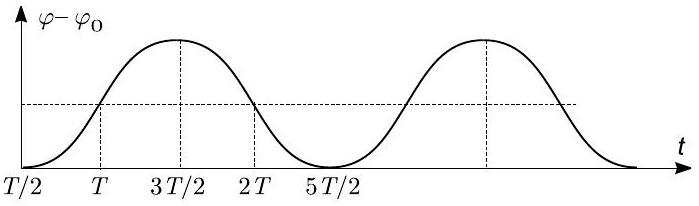

## Problem T1. Stabilizing unstable states (11 points)

Part A. Stabilization via feedback (3.5 points)
i. (1.5 pts) The moment of inertia of the rod is $I = \frac { m l ^ { 2 } } { 3 }$. The torque is $m g \frac { \varphi l } { 2 }$. (0.4 pts) so that the Newton's 2nd law is written as

$$
\begin{align*}
I \ddot { \varphi } & = m g \frac { \varphi l } { 2 } \\
\ddot { \varphi } & = \frac { 3 } { 2 } \frac { g } { l } \varphi . \tag{1}
\end{align*}
$$

(0.4 pts)

If we take $\varphi = A e ^ { \frac { t } { \tau } } + B e ^ { - \frac { t } { \tau } }$, then

$$
\begin{equation*}
\ddot { \varphi } = \frac { A } { \tau ^ { 2 } } e ^ { \frac { t } { \tau } } + \frac { B } { \tau ^ { 2 } } e ^ { - \frac { t } { \tau } } = \frac { \varphi } { \tau ^ { 2 } } . \tag{0.3pts}
\end{equation*}
$$

Substituting this into the equation of motion (1) we get

$$
\begin{align*}
\frac { \varphi } { \tau ^ { 2 } } & = \frac { 3 } { 2 } \frac { g } { l } \varphi  \tag{0.2pts}\\
\tau & = \sqrt { \frac { 2 } { 3 } \frac { l } { g } } . \tag{0.2pts}
\end{align*}
$$

(0.4 pts)

This means that $\varphi = A e ^ { \frac { t } { \tau } } + B e ^ { - \frac { t } { \tau } }$ is the solution for the equation of motion.
ii. (0.5 pts) The boy has to react before the rod falls over the angle $\frac { \pi } { 2 }$. Boy notices that the rod is falling, and tries to react. If the rod falls faster than his reaction time, he cannot keep it in balance. In the expression $\varphi = A e ^ { \frac { t } { \tau } } + B e ^ { - \frac { t } { \tau } }$, the dominating term is the first one (the second one decays in time), so we can put $\varphi = A e ^ { \frac { t } { \tau } }$, where $A$ is the angle at $t = 0$. Hence, the falling time $t = \tau \ln ( \pi / 2 A )$ depends on the initial angle $A$, but logarithmic dependence is very slow - the logarithm remains always of the order of unity. So we can estimate the falling time just as the characteristic time of the rod. This means that

$$
\begin{equation*}
\tau _ { r } \approx \sqrt { \frac { 2 } { 3 } \frac { l _ { r } } { g } } \tag{0.3pts}
\end{equation*}
$$

$$
\begin{equation*}
l _ { r } = \tau _ { r } ^ { 2 } \frac { 3 g } { 2 } = 0.59 \mathrm {~m} \tag{3}
\end{equation*}
$$

iii. (0.5 pts) The bird won't be able to rebalance itself when it has fallen over $\frac { \pi } { 2 }$. Similarly to the previous question, we can say that the bird's reaction time must be equal to the characteristic time $\tau _ { b }$.

Then we get

$$
\tau _ { b } \approx \sqrt { \frac { 2 } { 3 } \frac { l _ { b } } { g } } = 0.065 \mathrm {~s}
$$

(0.2 pts)
iv. (1 pt) The cyclist is able to balance himself by turning the handlebar so that the line connecting the wheels will move to the desire direction. For that line to move, the bike must move forward to a distance which is of the order of inter-wheel separation. So we can require $v _ { m } \tau \approx d$, where $\tau$ is bike's characteristic falling time.
(0.5 pts)

Note that with this equation we neglect the cyclists' reaction time (which makes balancing more difficult) but on the other hand the line connecting the wheels moves slightly already at a twice smaller forward-displacement of the bike (which makes balancing easier). Anyway, we are only making an estimate, so a mistake by a factor of 2 is perfectly OK.

Then we get

$$
d = v _ { m } \tau = v _ { m } \sqrt { \frac { 2 } { 3 } \frac { L } { g } }
$$

$$
v _ { m } = d \sqrt { \frac { 3 } { 2 } \frac { g } { L } } = 2.7 \mathrm {~m} / \mathrm { s }
$$

(0.3 pts)

Part B. Tightrope walker (3.5 points)
i. (1 pt) From the conservation of angular momentum

$$
m ( 1.4 H ) ^ { 2 } \frac { d \alpha _ { 1 } } { d t } + m H ^ { 2 } \frac { d \alpha _ { 2 } } { d t } = \text { Const. }
$$

(0.3 pts)

Partial credit 0.2 pts if the conservation is mentioned without writing equation. This process is instantaneous, i.e. $\frac { d \alpha _ { 1 } } { d t }$ and $\frac { d \alpha _ { 1 } } { d t }$ are very large, much large than that constant at the righthand-side (which is defined by the initial falling speed), hence we can put Const $= 0$.
(0.2 pts)

This simplifies into

$$
\begin{equation*}
1.96 \Delta \alpha _ { 1 } = - \Delta \alpha _ { 2 } \tag{2}
\end{equation*}
$$

(0.1 pts)

We also have

$$
\begin{equation*}
\beta = \alpha _ { 1 } - \alpha _ { 2 } = \left( \alpha _ { 0 } + \Delta \alpha _ { 1 } \right) - \left( \alpha _ { 0 } + \Delta \alpha _ { 2 } \right) = \Delta \alpha _ { 1 } - \Delta \alpha _ { 2 } \tag{0.2pts}
\end{equation*}
$$

(0.2 pts)

Solving the equations (1) and (2) we get

$$
\begin{align*}
& \alpha _ { 1 } = \alpha _ { 0 } + \frac { \beta } { 2.96 }  \tag{0.3pts}\\
& \alpha _ { 2 } = \alpha _ { 0 } - \frac { 1.96 } { 2.96 } \beta \tag{0.1pts}
\end{align*}
$$

(0.1 pts)
ii. (0.5 pts) In order to be able to straighten himself, the walker's centre of mass has to move leftwards, by a negative

angle. (0.1 pts)

By changing the upper body's angle by $\Delta \alpha _ { 1 }$, the lower body's angle will change by $\Delta \alpha _ { 2 } = - 1.96 \Delta \alpha _ { 1 }$. The centre of mass will then move by

$$
1.4 H \Delta \alpha _ { 1 } + H \Delta \alpha _ { 2 } = 1.4 H \Delta \alpha _ { 1 } - 1.96 H \Delta \alpha _ { 1 } = - 0.56 H \Delta \alpha _ { 1 }
$$

(0.3 pts)

Because the centre of mass will have to move by a negative angle, $\Delta \alpha _ { 1 }$ needs to be positive, which means that the walker has to bow clockwise. (0.1 pts)
iii. (1 pt) We can write the equation of motion

$$
2.96 \ddot { \alpha _ { 1 } } H = 2.4 g \alpha _ { 1 }
$$

Similarly to the question i. in part A, the solution for this differential equation is $\alpha _ { 1 } ( t ) = A \mathrm { e } ^ { \frac { t } { \tau } } + B \mathrm { e } ^ { - \frac { t } { \tau } }$, where $\tau = \sqrt { \frac { 2.96 } { 2.4 } \frac { H } { g } }$. (0.2 pts)
Because the time it takes to get to the vertical position is infinite, the component $A \mathrm { e } ^ { \frac { t } { \tau } }$ needs to be 0, meaning that $\alpha _ { 1 } ( t ) = B \mathrm { e } ^ { - \frac { t } { \tau } }$. (0.3 pts)
By taking time derivative, we obtain

$$
\dot { \alpha } _ { 1 } = - \frac { 1 } { \tau } B \mathrm { e } ^ { - \frac { t } { \tau } } .
$$

(0.3 pts)
For the instance when the boy straightened himself, $t = 0$, the equations take form $\alpha _ { 1 } = B$ and $\dot { \alpha } _ { 1 } = - \frac { B } { \tau }$. So, $\dot { \alpha } _ { 1 } = - \frac { \alpha _ { 1 } } { \tau }$, which can be rewritten as

$$
\frac { \dot { \alpha } _ { 1 } } { \alpha _ { 1 } } = - \frac { 1 } { \tau } = - \sqrt { \frac { 2.4 } { 2.96 } \frac { g } { H } }
$$

(0.2 pts)
iv. (1 pt) After the walker has straightened himself, the angle which he is at is still $\alpha _ { 0 }$, because during stage where he is bowing, the torque is much larger than when he is straightened, meaning that the change in angular speed is much larger than the change in the angle. (0.1 pts)
As found in the previous subquestion, the speed before and after the bowing are $\frac { \alpha _ { 0 } } { \tau }$ and $- \frac { \alpha _ { 0 } } { \tau }$ respectively. Then the change in the angular momentum is

$$
\Delta L = - 5.92 m H ^ { 2 } \frac { \alpha _ { 0 } } { \tau }
$$

(0.3 pts)

Because during the falling stage the change in angle is minuscule, we can express the change in angular momentum as $\Delta L = M T _ { b }$, where $M$ is the torque during bowing stage.
(0.2 pts)

During the bowing stage, the angles of the body segments are

$$
\alpha _ { 1 } = \alpha _ { 0 } + \frac { \beta _ { 0 } } { 2.96 } \approx \frac { \beta _ { 0 } } { 2.96 }
$$

$$
\alpha _ { 2 } = \alpha _ { 0 } - \frac { 1.96 } { 2.96 } \beta _ { 0 } \approx \frac { 1.96 } { 2.96 } \beta _ { 0 }
$$

The torque can be expressed as

$$
\begin{gathered}
M = 1.4 m g H \alpha _ { 1 } + m g H \alpha _ { 2 } = \\
\frac { 1.4 } { 2.96 } \beta _ { 0 } m g H - \frac { 1.96 } { 2.96 } \beta _ { 0 } m g H = - \frac { 0.56 } { 2.96 } \beta _ { 0 } m g H
\end{gathered}
$$

(0.3 pts)

Writing out $\Delta L = M T _ { b }$ we get

$$
\begin{gathered}
- 5.92 m H ^ { 2 } \frac { \alpha _ { 0 } } { \tau } = - \frac { 0.56 } { 2.96 } \beta _ { 0 } m g H T _ { b } \\
T _ { b } = 31.29 \frac { \alpha _ { 0 } } { \beta _ { 0 } } \frac { H } { \tau g } = 31.29 \frac { \alpha _ { 0 } } { \beta _ { 0 } } \frac { H } { g } \sqrt { \frac { 2.4 } { 2.96 } \frac { g } { H } } = 28.18 \frac { \alpha _ { 0 } } { \beta _ { 0 } } \sqrt { \frac { H } { g } }
\end{gathered}
$$

(0.1 pts)

## Part C. Kapitza's pendulum (4 points)

Throughout the entire problem, we use the system of reference of the suspension point.
i. (1.5 pts) During these periods of time when the suspension point accelerates upwards (and force of inertia is downwards), the equation of motion of the pendulum can be written as

$$
\frac { d ^ { 2 } \varphi } { d t ^ { 2 } } = \frac { a _ { 0 } } { l } \varphi ,
$$

where $a _ { 0 } = 2 v _ { 0 } / T$ is the frame's acceleration. (0.4 pts)
Incomplete attempts at writing Newton second law will be partially credited (0.2 pts).
The relative change of $\varphi$ is assumed to be small, so we can approximate $\varphi \approx \varphi _ { 0 }$ to obtain

$$
\frac { d ^ { 2 } \varphi } { d t ^ { 2 } } = \frac { 2 v _ { 0 } } { T l } \varphi _ { 0 } .
$$

(0.2 pts)

During the rest of the time, the same equation can be used if $a _ { 0 }$ is changed to $- a _ { 0 }$. (0.2 pts)
Therefore, the graph consists of parabolic segments, as depicted in the Figure. (0.4 pts)
The amplitude is found as

$$
\Delta \varphi = \frac { 1 } { 4 } \frac { v _ { 0 } T } { l } \varphi _ { 0 } .
$$

(0.3 pts)

ii. (1.5 pts)

The average torque $\langle M \rangle = \langle m l a ( t ) \varphi ( t ) \rangle$. (0.3 pts)
Let us note that $\langle a ( t ) \langle \varphi \rangle \rangle = \langle a ( t ) \rangle \langle \varphi \rangle = 0$. (0.3 pts)
Therefore we can rewrite the average torque as

$$
\langle M \rangle = \langle m l a ( t ) [ \varphi ( t ) - \langle \varphi \rangle ] \rangle = - m l \frac { 2 v _ { 0 } } { T } \langle | \varphi ( t ) - \langle \varphi \rangle | \rangle
$$

(0.3 pts; if wrong sign 0.2 pts) It is easy to see that the average of $| \varphi - \langle \varphi \rangle |$ over the entire period equals to the average over the time interval $0 < t < \tau$. Straightforward integration yields

$$
\langle | \varphi - \langle \varphi \rangle | \rangle = \frac { 2 } { T } \int _ { 0 } ^ { T / 2 } \Delta \varphi \left( 1 - \frac { 4 t ^ { 2 } } { T ^ { 2 } } \right) d t = \frac { 2 } { 3 } \Delta \varphi = \frac { 1 } { 6 } \frac { v _ { 0 } T } { l } \varphi _ { 0 }
$$

(0.4 pts) Upon substituting this result into the previous expression we obtain

$$
\langle M \rangle = - \frac { 1 } { 3 } m v _ { 0 } ^ { 2 } \varphi _ { 0 } .
$$

iii. (1 pt) Gravity field does not affect the expression for the average torque of the force of inertia. So, we can use the result of the previous question. However, it gives rise to an additional contribution to the average torque, equal to $g \operatorname { lm } \varphi _ { 0 }$. (0.4 pts) Therefore, the equation of motion can be written as

$$
l ^ { 2 } \frac { d ^ { 2 } \varphi _ { 0 } } { d t ^ { 2 } } = \left( g l - \frac { 1 } { 3 } v _ { 0 } ^ { 2 } T ^ { 2 } \right) \varphi _ { 0 } .
$$

(0.4 pts) The stability is ensured if the factor at the right-hand-side is negative, i.e. if $3 g l < v _ { 0 } ^ { 2 }$.
(0.2 pts)
