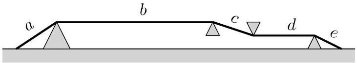
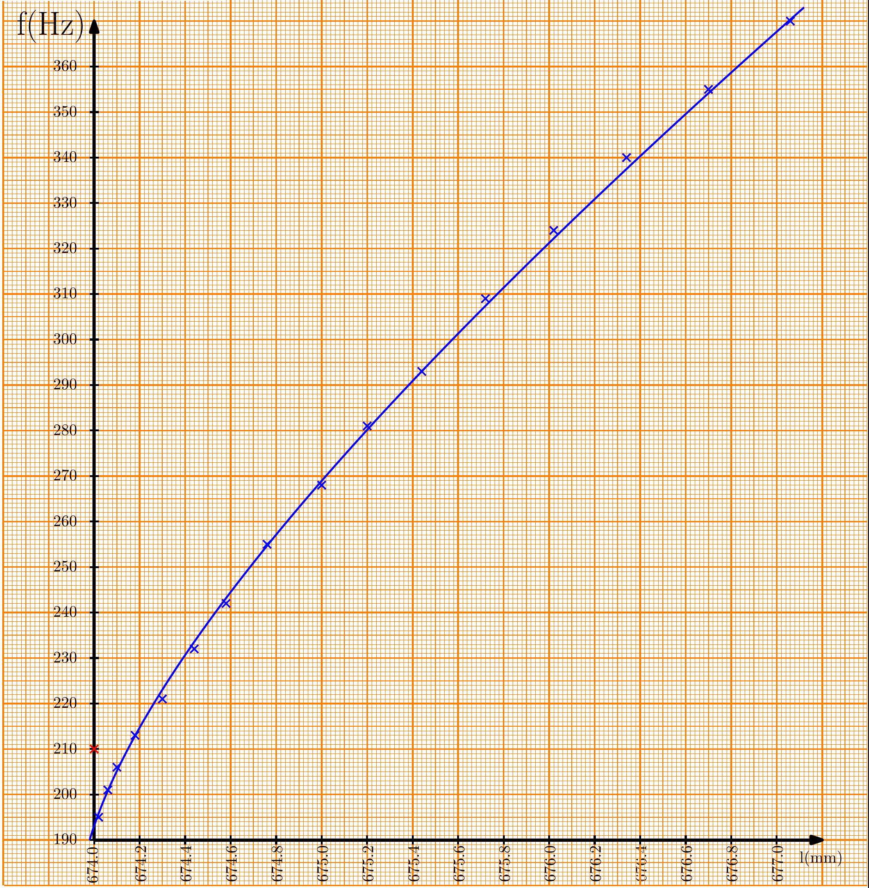
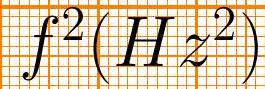
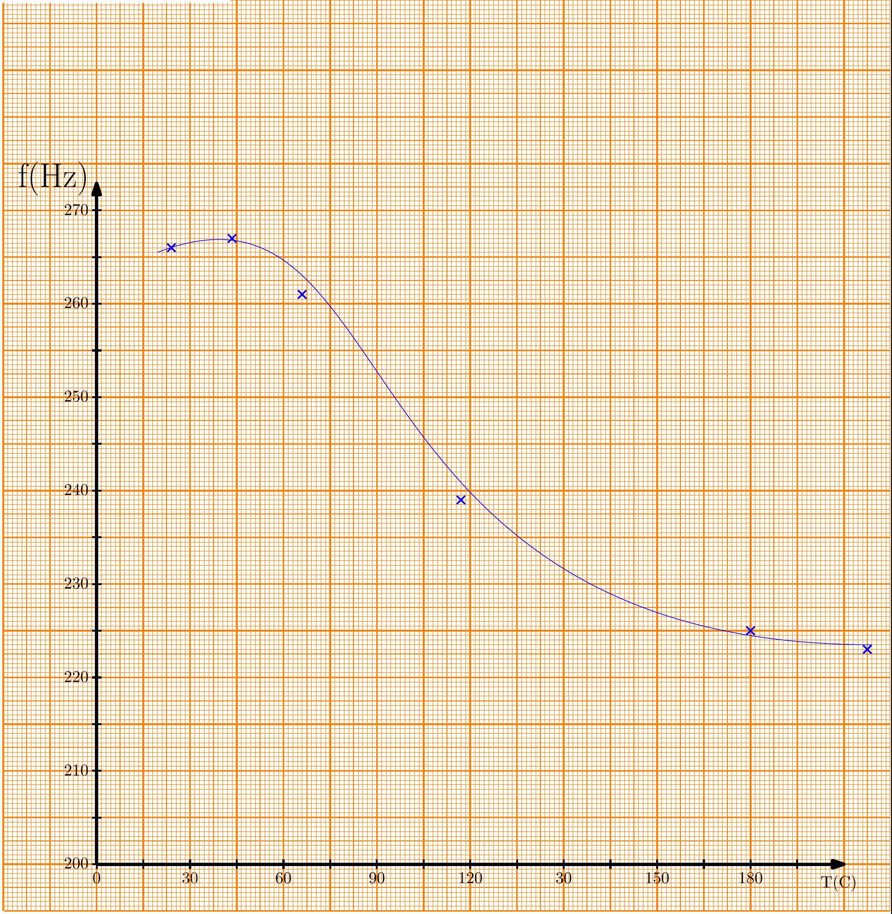
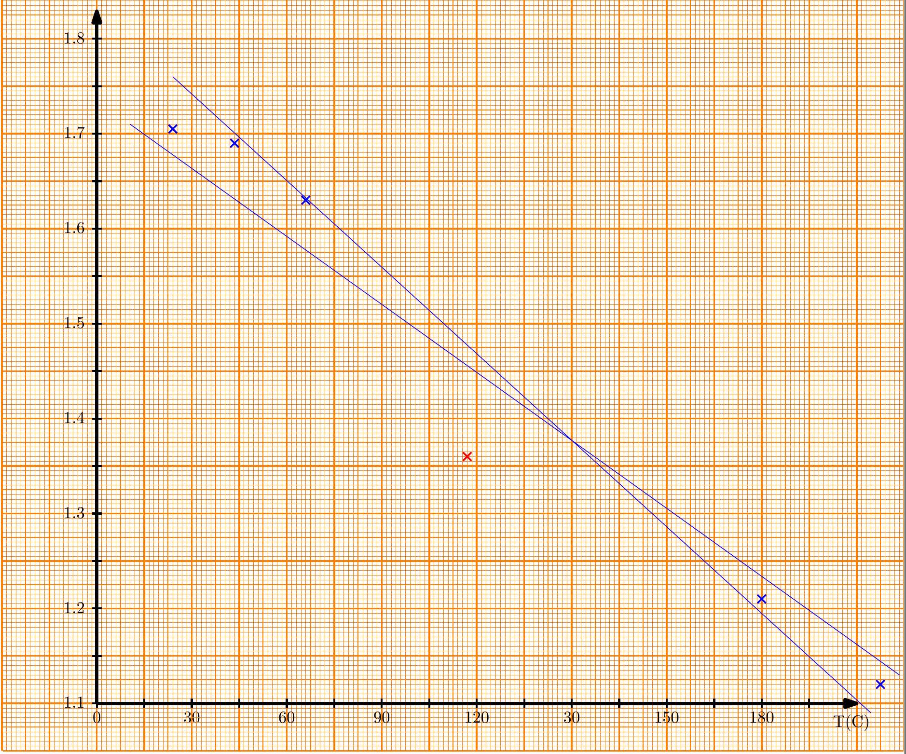

Problem E1. Electric guitar (20 points)
Part A. String dimensions (2 points)

For length $l _ { 1 }$, directly measured quantities and calculations:

$$
\begin{aligned}
& a = 31 \mathrm {~mm} \\
& b = 504 \mathrm {~mm} \\
& c = 21 \mathrm {~mm} \\
& d = 83 \mathrm {~mm} \\
& e = 35 \mathrm {~mm}
\end{aligned}
$$

Length $l _ { 1 }$ and its uncertainty:

$$
\begin{equation*}
l _ { 1 } = a + b + c + d + e = 674 \mathrm {~mm} \tag{array}
\end{equation*}
$$

The error of $a , b , c , d$ and $e$ can be roughly estimated to be 2 mm , because the roundness of the supports hinders any more precise measurement. These errors are random and not correlated, thus the uncertainty

$$
\begin{equation*}
\Delta l _ { 1 } = \sqrt { 5 \times ( 2 \mathrm {~mm} ) ^ { 2 } } \approx 4 \mathrm {~mm} . \tag{0.5p}
\end{equation*}
$$

For string diameter $d$, directly measured quantities and calculations: in the figure the diameter $d _ { \text {fig } } = 19.5 \pm 1.0 \mathrm {~mm}$ (the error is combined from the accuracy of the measuring tape and the roughness of the string's surface).

String diameter $d$ and its uncertainty:

$$
\begin{equation*}
d = d _ { \mathrm { fig } } / 100 = 0.195 \pm 0.010 \mathrm {~mm} . \tag{\([ \mathbf { 0 . 5 } \mathbf { ~ p }\) for the value and \(\mathbf { 0 . 5 } \mathbf { ~ p }\) for the uncertainty]}
\end{equation*}
$$

Part B. Resistivity (3 points)
Draw measurement circuit(s):
The string should be heated as little as possible, thus we should use as big a resistor as possible to limit the current. The most precise measurement can be done by connecting a $1 \mathrm { k } \Omega$ resistor and an ammeter between A and B and a voltmeter between the saddles (with the leads as close to the saddles as possible).

For string resistivity $\rho$, directly measured quantities, calculations and multimeter settings: multimeters' ranges: AX-100 at 20 mA, AX-MS811 at DCV.

$$
\begin{aligned}
I & = 4.94 \mathrm {~mA} \\
U & = 15.8 \mathrm { mV } \\
\Delta I & = 1.5 \% I + 3 \times 0.01 \mathrm {~mA} \approx 0.10 \mathrm {~mA} \\
\Delta U & = 0.7 \% U + 3 \times 0.1 \mathrm { mV } \approx 0.4 \mathrm { mV } \\
l & = 504 \pm 2 \mathrm {~mm} \quad \text { (from the previous part) }
\end{aligned}
$$

String resistivity $\rho$ and its uncertainty:

$$
\begin{aligned}
R & = \frac { U } { I } \\
A & = \frac { \pi d ^ { 2 } } { 4 } \\
\rho & = \frac { R A } { l } = \frac { \pi U d ^ { 2 } } { 4 l I } \approx 1.89 \times 10 ^ { - 4 } \Omega \cdot \mathrm {~mm} = 1.89 \times 10 ^ { - 7 } \Omega \cdot \mathrm {~m} \\
\Delta \rho & = \rho \sqrt { \left( \frac { \Delta U } { U } \right) ^ { 2 } + \left( \frac { 2 \Delta d } { d } \right) ^ { 2 } + \left( \frac { \Delta l } { l } \right) ^ { 2 } + \left( \frac { \Delta I } { I } \right) ^ { 2 } } \approx 0.17 \times 10 ^ { - 7 } \Omega \cdot \mathrm {~m}
\end{aligned}
$$

[0.5 p for using the least current possible (largest resistor), 1 p for connecting the voltmeter as close to the saddles as possible (a correct 4-point measurement), 0.5 p for measuring the values, 0.5 p for $\rho$ calculations and 0.5 p for a reasonable uncertainty calculation]
[Max 1.5 p if measured with an ohmmeter (much less precise)]

Part C. String oscillations (3 points)
Draw measurement circuit(s):
The circuit consists in a Hz-meter connected between S+ and S-.

Measurements and calculated data (you don't have to fill the entire table):
For calculating the lengths, we measure the tensioner's dimensions $a _ { 1 } = 43 \mathrm {~mm}$ and $a _ { 2 } = 39 \mathrm {~mm}$, and calculate the useful coefficient $\frac { a _ { 1 } + a _ { 2 } } { 2 a _ { 1 } a _ { 2 } } \approx 0.0244 \mathrm {~mm} ^ { - 1 }$. We take the length $l _ { 1 } = 674 \mathrm {~mm}$ from part A.

| $n$ turns of the screw | $f ( \mathrm {~Hz} )$ | $\Delta h = n \times 0.7 ( \mathrm {~mm} )$ | $\Delta l \approx 0.0244 ( \Delta h ) ^ { 2 } ( \mathrm {~mm} )$ | $l = l _ { 1 } + \Delta l ( \mathrm {~mm} )$ | $f ^ { 2 } \left( \mathrm {~Hz} ^ { 2 } \right)$ for part D |
| :--- | :--- | :--- | :--- | :--- | :--- |
| 0 | 210.8 (error) | 0 | 0 | 674.0000 | 44400 |
| 1 | 197.5 | 0.7 | 0.0120 | 674.0120 | 39000 |
| 2 | 201.1 | 1.4 | 0.0478 | 674.0478 | 40400 |
| 3 | 205.7 | 2.1 | 0.108 | 674.108 | 42300 |
| 4 | 212.8 | 2.8 | 0.191 | 674.191 | 45300 |
| 5 | 221.6 | 3.5 | 0.299 | 674.299 | 49100 |
| 6 | 231.7 | 4.2 | 0.430 | 674.430 | 53700 |
| 7 | 242.4 | 4.9 | 0.586 | 674.586 | 58800 |
| 8 | 254.6 | 5.6 | 0.765 | 674.765 | 64800 |
| 9 | 268.5 | 6.3 | 0.968 | 674.968 | 72100 |
| 10 | 280.8 | 7.0 | 1.20 | 675.20 | 78800 |
| 11 | 293.0 | 7.7 | 1.45 | 675.45 | 85800 |
| 12 | 309.4 | 8.4 | 1.72 | 675.72 | 95700 |
| 13 | 324.4 | 9.1 | 2.02 | 676.02 | 105000 |
| 14 | 340.5 | 9.8 | 2.34 | 676.34 | 116000 |
| 15 | 355.0 | 10.5 | 2.69 | 676.69 | 126000 |
| 16 | 369.7 | 11.2 | 3.06 | 677.06 | 137000 |

PROBLEM E1

Graph: $f$ versus $l$

[1 p for the quality of frequency measurements, 1 p for at least 7 measurements with the minimum and maximum frequency differing at least 1.5 times, $\mathbf { 0 . 5 } \mathbf { ~ p }$ for calculating the lengths, $\mathbf { 0 . 5 } \mathbf { ~ p }$ for plotting]

Part D. Young modulus of the string (4.5 points)
Suitable axes for finding Young modulus from graph expressed by known quantities:
In the fundamental mode of oscillations there is exactly one half of a wavelength on the string (the ends are fixed and the middle has the maximum amplitude). We can relate the wavelength to the wave's speed by $v = \lambda f = 2 b f$, where $b$ is the distance between the saddles (as in part A). Thus, $F = \Lambda v ^ { 2 } = 4 \Lambda b ^ { 2 } f ^ { 2 }$. On the other hand, $F = \frac { E A } { l _ { 0 } } \left( l - l _ { 0 } \right)$. Therefore

$$
f ^ { 2 } = \frac { E A } { 4 \Lambda b ^ { 2 } l _ { 0 } } \left( l - l _ { 0 } \right)
$$

and there ought to be a linear relationship between $l$ and $f ^ { 2 }$. The zero ( $x$-intercept) of the straight line would give us the unstretched length $l _ { 0 }$, and the slope would then give $E$.
However, as the changes in the length are quite small, it is perfectly acceptable to replace the $l _ { 0 }$ in the denominator by one of the measured lengths and thus avoid calculating the $x$-intercept at all.

$$
\begin{aligned}
& x = l \\
& y = f ^ { 2 }
\end{aligned}
$$

[1.5 p for these or equivalent choices for the axes]

Calculated data for the graph (you don't have to fill the entire table):
It is most convenient just to add a column of $f ^ { 2 }$ to the table in part C.
[Calculation: 0.5 p]

|  |  |  |  |  |  |
| :--- | :--- | :--- | :--- | :--- | :--- |
|  |  |  |  |  |  |
|  |  |  |  |  |  |
|  |  |  |  |  |  |
|  |  |  |  |  |  |
|  |  |  |  |  |  |
|  |  |  |  |  |  |
|  |  |  |  |  |  |
|  |  |  |  |  |  |
|  |  |  |  |  |  |
|  |  |  |  |  |  |
|  |  |  |  |  |  |
|  |  |  |  |  |  |
|  |  |  |  |  |  |
|  |  |  |  |  |  |
|  |  |  |  |  |  |
|  |  |  |  |  |  |
|  |  |  |  |  |  |
|  |  |  |  |  |  |
|  |  |  |  |  |  |
|  |  |  |  |  |  |
|  |  |  |  |  |  |

[Plotting: 0.5 p]
Calculations: From the graph, the slope is $40000 \ldots 43750 \mathrm {~Hz} ^ { 2 } / \mathrm { mm }$ and the $x$-intercept $l _ { 0 } \approx 672.75 \mathrm {~mm}$. From there, $E = 4 \Lambda b ^ { 2 } l _ { 0 } \times$ slope $/ A$.
Young modulus $E$ and its uncertainty:

$$
\begin{gathered}
E = 4 \Lambda b ^ { 2 } l _ { 0 } \times \text { slope } / A = 237 \mathrm { GPa } \\
\Delta E = E \left( \frac { \Delta \text { slope } } { \text { slope } } + 2 \frac { \Delta b } { b } + \frac { \Delta l _ { 0 } } { l _ { 0 } } + \frac { \Delta A } { A } \right) = 48 \mathrm { GPa } \quad [ \mathbf { 1 } \mathbf { p } ]
\end{gathered}
$$

[If only slope error is taken into account, $\mathbf { 0 . 5 } \mathbf { ~ p }$ for the uncertainty]

Part E. Heated string (3 points)
Draw measurement circuit(s):
We tensioned the string by 10 turns of the screw to ensure the frequencies stay high enough. Then we connect a resistor $\left( R _ { 1 } \right)$ and an ammeter (in the 10 A range) between A and B and alternate with the smaller multimeter between measuring the frequency on S+ and S- and measuring the voltage between the two saddles. By choosing different resistors or omitting it entirely we obtain different heating powers.

Measurements and calculated data (you don't have to fill the entire table):
Let $T _ { 0 }$ denote the room temperature and let $R _ { 0 }$ be the resistance of the string at room temperature. Then we can calculate the temperature of the string as follows.

$$
T = T _ { 0 } + \frac { R - R _ { 0 } } { \beta R _ { 0 } } .
$$

From the data of part B (or just repeating the measurement here), $R _ { 0 } = 3.20 \Omega$. Here we have the room temperature $T _ { 0 } = 23.0 ^ { \circ } \mathrm { C }$.

| $R _ { 1 } ( \Omega )$ | $I$ (A) | $U ( \mathrm {~V} )$ | $f ( \mathrm {~Hz} )$ | $R = U / I ( \Omega )$ | $T \left( { } ^ { \circ } \mathrm { C } \right)$ |
| :--- | :--- | :--- | :--- | :--- | :--- |
| 0 | 0.92 | 4.09 | 217 | 4.45 | 218 |
| 0.1 | 0.91 | 4.05 | 221 | 4.45 | 218 |
| 1 | 0.82 | 3.45 | 225 | 4.21 | 180 |
| 3 | 0.66 | 2.51 | 239 | 3.80 | 117 |
| 10 | 0.36 | 1.25 | 261 | 3.47 | 65.5 |
| 30 | 0.15 | 0.50 | 266 | 3.33 | 43.8 |
| 100 | 0.05 | 0.16 | 267 | 3.20 | 23.0 |
|  |  |  |  |  |  |
|  |  |  |  |  |  |
|  |  |  |  |  |  |
|  |  |  |  |  |  |
|  |  |  |  |  |  |
|  |  |  |  |  |  |
|  |  |  |  |  |  |
|  |  |  |  |  |  |
|  |  |  |  |  |  |
|  |  |  |  |  |  |

[1.5 p for good measurements (covering all the available temperature range), 1 p for calculating the temperatures, 0.5 p for the plot]

Part F. Thermal expansion of the string (4.5 points)

Suitable axes for finding coefficient of linear heat expansion $\alpha$ from graph expressed by known quantities:
The coefficient of linear heat expansion describes the changes in the untensioned length of the string. $l _ { 00 } \left[ 1 + \alpha \left( T - T _ { 0 } \right) \right] =$ $l _ { 0 } = l - \left( l - l _ { 0 } \right)$ where $l _ { 00 }$ is the untensioned length of the string at room temperature. From an expression from part D we can express $\left( l - l _ { 0 } \right)$ :

$$
f ^ { 2 } = \frac { E A } { 4 \Lambda b ^ { 2 } l _ { 0 } } \left( l - l _ { 0 } \right) \rightsquigarrow \left( l - l _ { 0 } \right) = \frac { 4 \Lambda b ^ { 2 } l f ^ { 2 } } { E A } .
$$

Here approximation $\frac { l - l _ { 0 } } { l _ { 0 } } \approx \frac { l - l _ { 0 } } { l }$ made things easier, correct solution without is also possible.
Note that since we are we are only intrested the slope we can ignore any constant added to $x$ and $y$.
We can get the $\alpha$ from the slope of the plot when

$$
\begin{aligned}
& x = T \\
& y = l - l _ { 0 } = \frac { 4 \Lambda b ^ { 2 } l f ^ { 2 } } { E A }
\end{aligned}
$$

Without the approximation we would get. $y = l _ { 0 } = \frac { E A l } { 4 \Lambda b ^ { 2 } f ^ { 2 } + E A }$
Calculated data for the graph (you don't have to fill the entire table):

| $T \left( { } ^ { \circ } \mathrm { C } \right)$ | $f ( \mathrm {~Hz} )$ | $l - l _ { 0 } ( \mathrm {~mm} )$ |  |  |  |
| :--- | :--- | :--- | :--- | :--- | :--- |
| 218 | 217 | 1.127 |  |  |  |
| 218 | 221 | 1.168 |  |  |  |
| 180 | 225 | 1.211 |  |  |  |
| 117 | 239 | 1.366 |  |  |  |
| 65.5 | 261 | 1.630 |  |  |  |
| 43.8 | 266 | 1.692 |  |  |  |
| 23.0 | 267 | 1.706 |  |  |  |
|  |  |  |  |  |  |
|  |  |  |  |  |  |
|  |  |  |  |  |  |
|  |  |  |  |  |  |
|  |  |  |  |  |  |
|  |  |  |  |  |  |
|  |  |  |  |  |  |
|  |  |  |  |  |  |
|  |  |  |  |  |  |
|  |  |  |  |  |  |
|  |  |  |  |  |  |
|  |  |  |  |  |  |
|  |  |  |  |  |  |
|  |  |  |  |  |  |

coefficient of linear heat expansion $\alpha$ and its uncertainty:
From the plot

$$
\begin{aligned}
& \alpha = ( 0.0032 \mathrm {~mm} / \mathrm { K } ) / l _ { 0 } = 4.8 \times 10 ^ { - 6 } \\
& \Delta \alpha = 0.0009 \mathrm {~mm} / \mathrm { K } / l _ { 0 } = 1.3 \times 10 ^ { - 6 }
\end{aligned}
$$

The uncertanty is taken from the min-max of the slope. [2 p for a good choice of axes, 0.5 p for plotting, 1 p for calculating the value of $\alpha , \mathbf { 1 } \mathbf { p }$ for the uncertainty] Notice that the main source of errors in this part is caused by the fact that string oscillations cool the string, and the magnitude of this effect depends on the amplitude of oscillations. Because of that, one should take reading with the smallest possible amplitude (for which frequency reading can still be taken). Alternatively, resistance and frequency readings could be taken simultaneously, at the same moment of time, but this is difficult to do if no data loggers are used and only one person is making the experiment.
