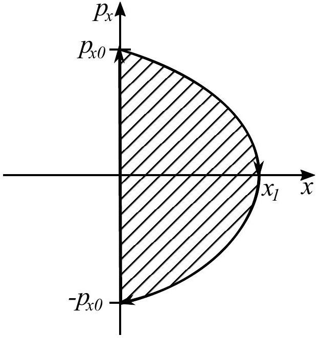

## Problem T1. Main sequence stars (11 points) Part A. Lifetime of Sun (3 points)

i. (0.7 pts) Since the Sun behaves as a perfectly black body it's total radiation power can be expressed from the StefanBoltzmann law as

$$
P = 4 \pi R _ { \odot } ^ { 2 } \sigma T _ { \odot } ^ { 4 } = 4.5 \times 10 ^ { 26 } \mathrm {~W} .
$$

(Formula 0.5, nuber 0.1, units 0.1 pts.)
ii. (0.5 pts) From the energy conservation law

$$
4 m _ { p } c ^ { 2 } = m _ { H e } c ^ { 2 } + 2 m _ { e } c ^ { 2 } + W _ { 0 }
$$

(0.2 pts). Then

$$
W _ { 0 } = 4 m _ { p } c ^ { 2 } - m _ { H e } c ^ { 2 } - 2 m _ { e } c ^ { 2 } = 24 \mathrm { MeV } .
$$

(Formula 0.1, nuber 0.1, units 0.1 pts.)
iii. (0.5 pts) The fusion of four protons creates two positrons which in turn annihilate with two electrons meaning that an additional energy of $W _ { 1 } = 4 m _ { e } c ^ { 2 } = 2.0 \mathrm { MeV }$ is released. Then the total energy released is $W _ { 2 } = W _ { 0 } + W _ { 1 } = 26 \mathrm { MeV }$. (Noticing that 4 particles annihilate per one He atom 0.2, formula 0.1, number 0.1, units 0.1 pts.)
iv. (1.3 pts) Over the course of Sun's lifetime the central part of the Sun will undergo fusion and release energy. The total number of reactions that will take place is

$$
N = \frac { M _ { \odot } } { 8 } \frac { 1 } { 4 m _ { p } }
$$

(0.3 pts). And thus, the total energy released is

$$
E = N W _ { 2 } = \frac { 1 } { 8 } M _ { \odot } \frac { W _ { 2 } } { 4 m _ { p } } = 1.56 \times 10 ^ { 44 } \mathrm {~J}
$$

(0.3 pts). The total lifetime of the Sun can be approximated as

$$
\tau = \frac { E } { P } = 1.1 \times 10 ^ { 10 } \mathrm { y } .
$$

(Formula 0.4, nuber 0.1, units 0.1 pts.)
The current age of the sun $\tau _ { \odot } = 5 \times 10 ^ { 9 } \mathrm { y }$ is approximately two times smaller than the calculated theoretical age (0.1 pts).
Part B. Mass-luminosity relationship of stars (4.5 points)
i. (0.4 pts) Since all of the star's mass is below the point $Q$, the gravitational acceleration is the same as that of a point mass with a mass of $M$ (0.2 pts). Then

$$
a _ { Q } = \frac { G M } { \left( \frac { R _ { 0 } } { 2 } \right) ^ { 2 } } = \frac { 4 G M } { R _ { 0 } ^ { 2 } }
$$

(0.2 pts).
ii. (0.4 pts) By applying Gauss's law for gravity for a sphere surrounding the stellar core

$$
4 \pi \left( \frac { R _ { 0 } } { 2 } \right) ^ { 2 } a _ { P } = 4 \pi G \frac { M } { 8 }
$$

(0.2 pts);

$$
a _ { P } = \frac { G M } { 2 R _ { 0 } ^ { 2 } }
$$

(0.2 pts).
iii. (0.4 pts) Since the gravitational acceleration decreases linearly along the thickness of the spherical layer, the average acceleration experienced by the spherical layer is $a _ { \text {avg } } =$ $\frac { a _ { P } + a _ { Q } } { 2 } = \frac { 9 G M } { 4 R _ { 0 } ^ { 2 } }$ (0.1 pts). Furthermore, a piece of the small spherical layer with an area $A$ has a mass of

$$
m = \frac { A } { 4 \pi \left( \frac { R _ { 0 } } { 2 } \right) ^ { 2 } } \frac { 7 M } { 8 } = \frac { 7 } { 8 \pi } \frac { M A } { R _ { 0 } ^ { 2 } }
$$

(0.1 pts). From the Newton's second law

$$
F = m a _ { \mathrm { avg } } = \frac { 63 } { 32 \pi } \frac { G M ^ { 2 } A } { R _ { 0 } ^ { 4 } }
$$

(0.2 pts).
iv. (0.4 pts) The previously calculated force acting on the small piece of the narrow spherical layer can also be expressed as

$$
F = A p _ { c } = \frac { 63 } { 32 \pi } \frac { G M ^ { 2 } A } { R _ { 0 } ^ { 4 } }
$$

(0.3 pts). Then

$$
p _ { c } = \frac { 63 } { 32 \pi } \frac { G M ^ { 2 } } { R _ { 0 } ^ { 4 } }
$$

(0.1 pts).
v. (1 pt) From the ideal gas law

$$
p _ { c } \frac { 4 \pi \left( \frac { R _ { 0 } } { 2 } \right) ^ { 3 } } { 3 } = n R _ { g } T _ { c }
$$

where $n$ is the number of moles of protons and electrons inside the stellar core (0.6 pts; 0.4 if electrons are forgetten). Since the mass of an electron is negligible compared to the mass of a proton, $n = \frac { 2 M } { 8 m _ { p } N _ { a } } = \frac { M } { 4 m _ { p } N _ { a } }$ (0.3 pts). Then

$$
p _ { c } \frac { \pi R _ { 0 } ^ { 3 } } { 6 } = \frac { M R _ { g } T _ { c } } { 4 m _ { p } N _ { a } } = \frac { M k _ { B } T _ { c } } { 4 m _ { p } }
$$

and

$$
p _ { c } = \frac { 3 } { 2 \pi } \frac { M k _ { B } T _ { c } } { R _ { 0 } ^ { 3 } m _ { p } }
$$

(0.1 pts).
vi. (0.4 pts) Combing both expressions for $p _ { c }$, one gets

$$
\frac { 63 } { 32 \pi } \frac { G M ^ { 2 } } { R _ { 0 } ^ { 4 } } = \frac { 3 } { 2 \pi } \frac { M k _ { B } T _ { c } } { R _ { 0 } ^ { 3 } m _ { p } }
$$

(0.2 pts).

$$
R _ { 0 } = \frac { 21 } { 16 } \frac { G M m _ { p } } { k _ { B } T _ { c } }
$$

(0.2 pts).

vii. (1.5 pts) Writing out the energy balance for a spherical shell with a radius of $x$ and thickness $\mathrm { d } x$ concentric to the star

$$
- 4 \pi x ^ { 2 } \frac { \mathrm {~d} T } { \mathrm {~d} x } \kappa = P
$$

(0.4 pts) and rearranging the terms, one gets

$$
- 4 \pi \kappa \mathrm {~d} T = P \frac { \mathrm {~d} x } { x ^ { 2 } }
$$

(0.2 pts). Integrating from $x = \frac { R _ { 0 } } { 2 }$ to $x = R _ { 0 }$ yields

$$
\begin{aligned}
- 4 \pi \kappa \int _ { T _ { c } } ^ { T \left( R _ { 0 } \right) } \mathrm { d } T & = P \int _ { \frac { R _ { 0 } } { 2 } } ^ { R _ { 0 } } \frac { \mathrm {~d} x } { x ^ { 2 } } \\
- 4 \pi \kappa \left( T \left( R _ { 0 } \right) - T _ { c } \right) & = - P \left( \frac { 1 } { R _ { 0 } } - \frac { 2 } { R _ { 0 } } \right) \\
4 \pi \kappa T _ { c } & = \frac { P } { R _ { 0 } }
\end{aligned}
$$

(0.2 pts). Then

$$
P = 4 \pi \kappa T _ { c } R _ { 0 }
$$

(0.3 pts). When similar expression is obtained without integration (leading to a wrong factor), only 0.2 for integration is lost.

Substituting $\kappa = \frac { f \left( T _ { c } \right) } { \rho _ { c } } , \rho _ { c } = \frac { 3 M } { 4 \pi R _ { 0 } ^ { 3 } }$ and $R _ { 0 } = \frac { 21 } { 16 } \frac { G M m _ { p } } { k _ { B } T _ { c } }$, we ultimately end up with

$$
P = \left( \frac { 21 } { 8 } \frac { G m _ { p } } { k _ { B } } \right) ^ { 4 } \frac { \pi ^ { 2 } T _ { c } ^ { 3 } f \left( T _ { c } \right) } { 3 } M ^ { 3 }
$$

(0.3 pts). Thus $\gamma = 3$ (0.1 pts).

Part C. Proton-proton fusion chain (3.5 points)
i. (1.5 pts) First, we must convert the units to base units: $[ c ] = \mathrm { m } / \mathrm { s }$,
$[ G ] = \mathrm { m } ^ { 3 } \cdot \mathrm {~kg} ^ { - 1 } \mathrm {~s} ^ { - 2 }$,
$\left[ k _ { B } \right] = \mathrm { m } ^ { 2 } \cdot \mathrm {~kg} \cdot \mathrm {~s} ^ { - 2 } \cdot \mathrm {~K} ^ { - 1 } ( 0.1 \mathrm { pts } )$,
$\left[ N _ { A } \right] = \mathrm { mol } ^ { - 1 }$,
$[ \hbar ] = \mathrm { m } ^ { 2 } \cdot \mathrm {~kg} / \mathrm { s } ( 0.1 \mathrm { pts } )$,
$[ e ] = \mathrm { C }$,
$\left[ k _ { e } \right] = \mathrm { kg } \cdot \mathrm { m } ^ { 3 } \cdot \mathrm { C } ^ { - 2 } \mathrm {~s} ^ { - 2 } ( 0.1 \mathrm { pts } )$.
Let $\alpha = [ c ] ^ { \beta } [ G ] ^ { \gamma } \left[ k _ { B } \right] ^ { \delta } \left[ N _ { A } \right] ^ { \varepsilon } [ \hbar ] ^ { \mu } [ e ] ^ { \phi } \left[ k _ { e } \right] ^ { \omega }$. Then we can create an equation for each unit:
$\mathrm { m } : \beta + 3 \gamma + 2 \delta + 2 \mu + 3 \omega = 0$
$\mathrm { s } : - \beta - 2 \gamma - 2 \delta - \mu - 2 \omega = 0$
$\mathrm { kg } : - \gamma + \delta + \mu + \omega = 0$
$\mathrm { K } : - \delta = 0$
mol: $- \varepsilon = 0$
C: $\phi - 2 \omega = 0$.
(0.1 pts for each equation.) After solving the system of equations and setting $\omega = 1$, we get $\beta = - 1 , \gamma = 0 , \delta = 0 , \varepsilon = 0$, $\mu = - 1 , \phi = 2$, and $\omega = 1$ (apart from $\delta$ and $\varepsilon$, 0.1 pts for each value). Thus

$$
\alpha = \frac { k _ { e } e ^ { 2 } } { c \hbar } = 7.3 \times 10 ^ { - 3 } .
$$

(0.1 pts for the numerical value.)
ii. (1 pt) Let the distance to the centre of mass for both protons be $x$. Then the force acting on one of the protons is $F ( x ) = \frac { k _ { e } e ^ { 2 } } { 4 x ^ { 2 } }$ and thus the potential energy is

$$
\Pi = \int _ { \infty } ^ { x } F ( x ) \mathrm { d } x = \frac { k _ { e } e ^ { 2 } } { 4 } \int _ { \infty } ^ { x } \frac { \mathrm {~d} x } { x ^ { 2 } } = \frac { k _ { e } e ^ { 2 } } { 4 x } .
$$

(0.3 pts out which 0.1 goes for correctly treating the distance to the centre of mass and distance between the protons.) By applying the energy conservation law at $x = \frac { r _ { p } } { 2 }$ and $x = \infty$, we get

$$
\frac { k _ { e } e ^ { 2 } } { 2 r _ { p } } = \frac { m _ { p } v ^ { 2 } } { 2 }
$$

(0.2 pts). Furthermore

$$
\frac { m _ { p } v ^ { 2 } } { 2 } = \frac { 3 k _ { B } T ^ { \prime } } { 2 }
$$

(0.3 pts). $T ^ { \prime }$ can be expressed as

$$
T ^ { \prime } = \frac { k _ { e } e ^ { 2 } } { 3 k _ { B } r _ { p } } = 6.5 \times 10 ^ { 9 } \mathrm {~K}
$$

(0.1 pts for formula). This is around $\frac { T ^ { \prime } } { T _ { c } } = 3600$ times larger than the actual temperature of the stellar core (0.1 pts).
iii. (1 pt) The total energy of a proton moving at speed $v$ is $W = \frac { m _ { p } v ^ { 2 } } { 2 }$ and the potential energy, as expressed in the last subtask, is $\Pi ( r ) = \frac { k _ { e } e ^ { 2 } } { 2 r } = \frac { \alpha c \hbar } { 2 r }$. The moment at which the proton "dives into the tunnel" happens when $W = \Pi ( r ) = \Pi \left( r _ { \star } \right) = \frac { \alpha c \hbar } { 2 r _ { \star } }$ (0.3 pts). Thus $r _ { \star } = \frac { \alpha c \hbar } { m _ { p } v ^ { 2 } }$ (0.1 pts). Then the probability of the tunnelling taking place is

$$
p \approx \exp \left[ - 2 \hbar ^ { - 1 } \int _ { 0 } ^ { r _ { \star } } \sqrt { m _ { p } \alpha c \hbar \left( \frac { 1 } { r } - \frac { 1 } { r _ { \star } } \right) \mathrm { d } r } \right] =
$$

(0.3 pts)

$$
= \exp \left( - 2 \hbar ^ { - 1 } \sqrt { m _ { p } \alpha c \hbar } \frac { \pi \sqrt { r _ { \star } } } { 2 } \right) = \exp \left( - \frac { \pi \alpha c } { v } \right)
$$

(0.3 pts).

## Problem T2. Water tube (8 points)

i. (0.5 pts) There is a water column of height $H$ between points $P$ and $Q$ creating an additional pressure of $p _ { P } - p _ { Q } =$ $\rho g H = 3000 \mathrm {~Pa}$. (Formula 0.3 pts, value 0.1 pts, units 0.1 pts.)
ii. (1.5 pts) The external forces acting on the system are sketched on the figure to the right. $F _ { 2 } = A p _ { 0 } = 100 \mathrm {~N}$ (formula 0.1 pts, value with units 0.1 pts) and $F _ { 1 } = 1.1 A p _ { 0 } = 110 \mathrm {~N}$ (formula 0.1 pts, value with units 0.1 pts) is the atmospheric pressure acting on the pistons. $F _ { 3 } = ( M + m ) g = 4.1 \mathrm {~N}$ (formula 0.1 pts, value with units 0.1 pts) is the gravitational force acting on the water-piston system, where $M = ( H + 0.1 h ) A \rho =$ 0.31 kg (formula 0.1 pts, value with units 0.1 pts) is the mass of the water column. $N$ is the total normal force exerted by the metal cylinder. There is no horizontal component for the normal force since it cancels out due to symmetry. $N$ can be expressed from the Newton's 2nd law applied on the vertical axis

$$
N + F _ { 2 } + F _ { 3 } - F _ { 1 } = 0
$$

$$
N + A p _ { 0 } + ( M + m ) g - 1.1 A p _ { 0 } = 0
$$

$N = 0.1 A p _ { 0 } - ( M + m ) g = 0.1 A p _ { 0 } - ( ( H + 0.1 h ) A \rho + m ) g = 5.9 \mathrm {~N}$.
(Formula 0.2 pts, value with units 0.1 pts.) Each correctly shown force in the sketch: 0.1 pts (0.4 pts overall).
iii. (1.2 pts) Notice that $N = 0.1 A p _ { 1 }$ (0.6 pts), where

$$
p _ { 1 } = 10 N / A = 59 \mathrm { kPa }
$$

(formula 0.2 pts) is the pressure at the joint of the two tubes. Therefore,

$$
p _ { Q } = p _ { 1 } - \rho g ( H - h ) = 57 \mathrm { kPa } .
$$

(Formula 0.1 pts, value with units 0.1 pts.) and

$$
p _ { P } = p _ { 1 } + \rho g h = 60 \mathrm { kPa } .
$$

(Formula 0.1 pts, value with units 0.1 pts.)
Alternatively, applying the Newton's law on the vertical axis for the piston, one gets

$$
A p _ { 0 } - A p _ { Q } + m g + 1.1 A p _ { P } - 1.1 A p _ { 0 } = 0
$$

(0.3 pts),

$$
- 0.1 A p _ { 0 } + m g - A p _ { Q } + 1.1 A \left( p _ { Q } + \rho g H \right) = 0
$$

(0.3 pts),

$$
p _ { Q } = p _ { 0 } - 11 \rho g H - 10 \frac { m g } { A } = 57 \mathrm { kPa }
$$

(formula 0.2 pts, value with units 0.1 pts).

$$
p _ { P } = p _ { Q } + \rho g H = p _ { 0 } - 10 \rho g H - 10 \frac { m g } { A } = 60 \mathrm { kPa }
$$

(formula 0.2 pts, value with units 0.1 pts).
iv. (0.8 pts) Newton's 2nd law on the vertical axis for the top piston can be written out as

$$
\frac { m g } { 2 } + A p 0 - A p _ { Q } + T = 0
$$

(0.4 pts).

$$
\begin{gathered}
T = A \left( p _ { Q } - p _ { 0 } \right) - \frac { m } { 2 } g = - A \left( 11 \rho g H + 10 \frac { m g } { A } \right) - \frac { m g } { 2 } = \\
= - 11 \rho g H A - \frac { 21 } { 2 } m g = - 43.5 \mathrm {~N}
\end{gathered}
$$

The negative sign of the tension force means that the steel bar is being compressed, not stretched. (Formula 0.2 pts, value with units 0.1 pts, sign or direction of $T 0.1$ pts.)
v. (1 pt) During the impact, the metallic tube comes to rest but the two pistons keep moving downwards because the pistons and the tube aren't strongly connected (0.3 pts). As a result, the volume between the two pistons increases (since the area of the bottom piston is larger than the top piston) and vacuum is created (0.3 pts). This causes the atmospheric pressure to try to reverse the change and push the pistons upwards (0.2 pts). Because no energy is lost in the water-piston system (for simplicity we assume the friction between the tube and water / pistons to be negligible), after the pistons have returned to their initial position, their speed will be of equal magnitude and of opposite sign, pointing upwards, which in turn makes the tube jump (0.2 pts).
vi. (3 pts) Neglecting the pressure of water vapors and of the water column of 20 cm, the pressure between the pistons is zero, hence the net force acting on the system "water + pistons" is

$$
F = - 0.1 A p _ { 0 } + ( m + M ) g = 5.9 \mathrm {~N}
$$

(1.3 pt). Because the force is constant throughout the whole process, the change of momentum for the water-piston system can be expressed as

$$
( M + m ) ( - v ) - ( M + m ) v = F \tau \Rightarrow
$$

(1.3 pt)

$$
\begin{aligned}
& 2 v = \left( \frac { 0.1 A p _ { 0 } } { M + m } - g \right) \tau \Rightarrow \\
& \tau = 20 \frac { ( M + m ) v } { A p _ { 0 } - 10 ( m + M ) g }
\end{aligned}
$$

where $v = \sqrt { 2 g L }$ is the speed of the tube when it reaches the ground. Thus

$$
\tau = 20 \frac { M + m } { A p _ { 0 } - 10 ( m + M ) g } \sqrt { 2 g L } = 0.31 \mathrm {~s} .
$$

(Formula 0.2 pts, value 0.1 pts, units $T 0.1$ pts.)

Problem T3. Accelerating shock wave (11 points)
i. (1 pt) In the reference frame of the shock wave, the electron's initial velocity is $\vec { v } _ { 1 } = \left( v _ { x } - w , v _ { y } , v _ { z } \right)$ (0.3 pts). After deflecting against the shock wave, the horizontal component of the velocity gets flipped (0.2 pts). Thus, the electron's velocity in the moving frame of reference, after deflecting against the shock wave, is $\vec { v } _ { 2 } = \left( w - v _ { x } , v _ { y } , v _ { z } \right) ( 0.1 \mathrm { pts } )$. Moving back into the laboratory frame of reference, the final velocity is $\vec { v } ^ { \prime } = \left( 2 w - v _ { x } , v _ { y } , v _ { z } \right)$ (0.2 pts for $x$ component, 0.1 both for $x$ and $y$ components). ii. (1 pt) After being hit by the shock wave, the electron starts moving with speed $v = 2 w$. Due to the magnetic field, it moves along a circular trajectory, and at the initial moment of time, the trajectory is perpendicular to the front. Additionally, the electron periodically undergoes collisions against the shock wave, and the $x$-coordinates of the collision points grow in time. This is enough to draw an approximate sketch of the electron's trajectory.

Grading: trajectory is made from circular segments (0.3 pts) which are connected at the reflection points so that instantaneous change of direction is clearly seen (0.2 pts). 0.2 pts if the trajectory starts parallel to the $x$-axis, 0.1 pts if the direction of motion is shown by arrow or described in another way; 0.2 pts if the reflection points advance in the same direction as the shock wave.
iii. (0.5 pts) The Lorentz force acting on the electron acts as a centripetal force

$$
e v B _ { 0 } = \frac { m v ^ { 2 } } { R }
$$

(0.4 pts). Thus $R = \frac { m v } { e B _ { 0 } } = \frac { 2 m w } { e B _ { 0 } }$ (0.1 pts).
iv. (1 pt) Before the first collision, the electron's $x$-coordinate is $x _ { 1 } ( t ) = R \sin \left( 2 \pi \frac { t } { T } \right) ( 0.2 \mathrm { pts } )$ and the shock wave's $x$-coordinate is $x _ { 2 } ( t ) = w t$ (0.1 pts). The second impact happens when $x _ { 1 } ( t ) = x _ { 2 } ( t )$ (0.2 pts). Thus

$$
\begin{aligned}
\frac { 2 m w } { e B _ { 0 } } \sin \left( \frac { B _ { 0 } e } { m } t _ { 2 } \right) & = w t _ { 2 } \\
\sin \left( \frac { B _ { 0 } e } { m } t _ { 2 } \right) & = \frac { 1 } { 2 } \frac { B _ { 0 } e } { m } t _ { 2 }
\end{aligned}
$$

(0.1 pts). Substituting $u = \frac { B _ { 0 } e } { m } t _ { 2 }$, one gets

$$
\sin ( u ) = \frac { u } { 2 }
$$

(0.2 pts). This equation can be solved numerically to get $u = 1.895$ (0.1 pts). Thus $t _ { 2 } = 1.895 \frac { m } { B _ { 0 } e }$ (0.1 pts).
v. (0.5 pts) Every time a collision happens, the electron and the front are at the same place, with the same value of the $x$-coordinate. This means that the electron's and shock wave's average velocities in the direction of the $x$-axis are the same. In other words, $v _ { x } = w ( 0.5 \mathrm { pts } )$.
vi. (1.5 pts) It is easier to find the value of $k$ by taking a derivative from both sides of the equation as it gets rid of the constant. Then $\dot { v } _ { y } + k v _ { x } = 0 ( 0.2 \mathrm { pts } )$. The only forces acting on the electron are the Lorentz force and the repulsion forces between the electron and the shock wave (0.3 pts). Since the shock wave affects the electron only in the horizontal direction (0.2 pts), the acceleration's vertical component comes purely through the Lorentz's force (0.2 pts). This means that $m \ddot { y } = - e v _ { x } B _ { 0 }$ holds throughout the electron's motion (0.2 pts). In other words, $\dot { v } _ { y } = - \frac { B _ { 0 } e } { m } v _ { x }$. Plugging this to the conservation law, we get $- \frac { B _ { 0 } e } { m } v _ { x } + k v _ { x } = 0$ (0.3 pts). Thus $k = \frac { B _ { 0 } e } { m }$ (0.1 pts).
vii. (1 pt) By taking a derivative from the conservation law $v _ { y } + \frac { B _ { 0 } e } { m } x =$ const, we get $a _ { y } + \frac { B _ { 0 } e } { m } v _ { x } = 0 ( 0.5 \mathrm { pts } )$. Over the long run, the average $x$-directional moving speed of the electron is the same as that of the shock wave's. Thus $a _ { y } + \frac { B _ { 0 } e } { m } w = 0$ (0.4 pts) and $a _ { y } = - \frac { B _ { 0 } e } { m } w$ (0.1 pts).
viii. (1 pt) Over the course of one period, there is a constant acceleration $a _ { x }$ acting on the electron in the $x$-direction, both in the lab frame, and in the shock wave's frame; the behaviour is the same what would be if there were a free fall acceleration $g = a$. If we let $x$ be the relative distance between the electron and the shock wave, and the initial $x$-directional momentum at $x = 0$ be $p _ { x 0 }$, then the quantity $E = \frac { p _ { x 0 } ^ { 2 } } { 2 m } = \frac { p _ { x } ^ { 2 } } { 2 m } + m a _ { x } x$ is conserved over the course of one period (energy conservation law) (0.2 pts). Thus $p _ { x } = \sqrt { p _ { x 0 } ^ { 2 } - 2 m ^ { 2 } a _ { x } x }$ (0.1 pts). On the phase diagram, this corresponds to a parabola who's axis of symmetry is at $p _ { x } = 0$ (0.2 pts). Furthermore, at $x = 0$, the momentum of the electron gets flipped due to the collision against the shock wave, meaning that there is a straight line from $\left( 0 , - p _ { x 0 } \right)$ to $\left( 0 , p _ { x 0 } \right)$ (0.3 pts). This gives enough information to draw the phase diagram (correctly drawn figure 0.1 pts, arrow shown 0.1 pts).

ix. (1.5 pts) The area under the phase diagram can be found by integrating $p _ { x } ( x ) \mathrm { d } x$ from $x _ { 0 } = 0$ to $x _ { 1 } = \frac { p _ { x 0 } ^ { 2 } } { 2 m ^ { 2 } a _ { x } }$ and multiplying the result by two (since the phase diagram is symmetrical about $p _ { x } = 0$ ). Thus

$$
\begin{gathered}
S = 2 \int _ { 0 } ^ { x _ { 1 } } \sqrt { p _ { x 0 } ^ { 2 } - 2 m ^ { 2 } a _ { x } x } \mathrm {~d} x = 2 p _ { x 0 } \int _ { 0 } ^ { x _ { 1 } } \sqrt { 1 - \frac { x } { x _ { 1 } } } \mathrm {~d} x = \\
= \frac { 4 } { 3 } p _ { x 0 } x _ { 1 } = \frac { 2 } { 3 } \frac { p _ { x 0 } ^ { 3 } } { m ^ { 2 } a _ { x } } = \frac { 2 } { 3 } \frac { m v _ { 0 } ^ { 3 } } { a _ { x } }
\end{gathered}
$$

(0.3 pts). Due to the conservation of this quantity (we use its initial value taken from the problem text),

$$
\begin{aligned}
\frac { 2 } { 3 } \frac { m v _ { 0 } ^ { 3 } } { a _ { x } } & = \frac { 1.36 ( m w ) ^ { 2 } } { B _ { 0 } e } \\
a _ { x } & = \frac { 1 } { 2.04 } \frac { v _ { 0 } ^ { 3 } B _ { 0 } e } { m w ^ { 2 } }
\end{aligned}
$$

(0.3 pts), where $v _ { 0 }$ is the electron's speed at $x = 0$. The electron will fall behind the shock wave when $\frac { m v _ { 0 } ^ { 2 } } { 2 } > e V _ { 0 }$ or $v _ { 0 } > \sqrt { \frac { 2 e V _ { 0 } } { m } } = w \sqrt { \varepsilon }$ (0.2 pts). The horizontal acceleration comes from Lorentz force $a _ { x } = \frac { B _ { 0 } e v _ { y } } { m }$ (0.3 pts). Thus

$$
\begin{aligned}
\frac { 1 } { 2.04 } \frac { B _ { 0 } e } { m w ^ { 2 } } w ^ { 3 } \varepsilon ^ { \frac { 3 } { 2 } } & = \frac { B _ { 0 } e v _ { y } } { m } \\
\frac { 1 } { 2.04 ^ { 2 } } w \varepsilon ^ { \frac { 3 } { 2 } } & = v _ { y }
\end{aligned}
$$

(0.2 pts).

Since $v _ { y } \gg v _ { x } , W _ { f } \approx \frac { m v _ { y } ^ { 2 } } { 2 }$

$$
W _ { f } = \frac { \varepsilon ^ { 3 } } { 2.04 } \frac { m w ^ { 2 } } { 2 } = \frac { \varepsilon ^ { 2 } } { 2.04 ^ { 2 } } e V _ { 0 }
$$

(0.2 pts).
x. (2 pts) In the reference frame of the shock wave, initially, the electron's $x$-directional and $y$-directional momenta are $p _ { x }$ and $p _ { y }$ respectively. In the limiting case, the electron's final $x$-directional momentum is 0 . Since the shock wave acts only in the $x$ direction, $p _ { y }$ will stay same throughout the motion. The Lorentz invariant of the 4-momentum, initially and after the electron has come to rest, can be written out as

$$
E ^ { 2 } = p _ { x } ^ { 2 } c ^ { 2 } + p _ { y } ^ { 2 } c ^ { 2 } + m _ { 0 } ^ { 2 } c ^ { 4 }
$$

(0.6 pts) ,

$$
\left( E - e V _ { 0 } \right) ^ { 2 } = p _ { y } ^ { 2 } c ^ { 2 } + m _ { 0 } ^ { 2 } c ^ { 4 }
$$

(0.6 pts). Subtracting one equation from the other, we get $2 E e V _ { 0 } - e ^ { 2 } V _ { 0 } ^ { 2 } = p _ { x } ^ { 2 } c ^ { 2 } = m _ { \text {rel } } ^ { 2 } c ^ { 2 } w ^ { 2 } = E ^ { 2 } \frac { w ^ { 2 } } { c ^ { 2 } }$. Thus

$$
E ^ { 2 } \frac { w ^ { 2 } } { c ^ { 2 } } - 2 E e V _ { 0 } + e ^ { 2 } V _ { 0 } ^ { 2 } = 0
$$

(0.2 pts) ,

$$
E = \frac { e V _ { 0 } c ^ { 2 } } { w ^ { 2 } } \left( 1 \pm \sqrt { 1 - \frac { w ^ { 2 } } { c ^ { 2 } } } \right) ;
$$

(0.2 pts) with minus sign we would obtain $p _ { y } ^ { 2 } c ^ { 2 } = \left( E - e V _ { 0 } \right) ^ { 2 } -$ $m _ { 0 } ^ { 2 } c ^ { 4 } < \left( E - e V _ { 0 } \right) ^ { 2 } - e ^ { 2 } V _ { 0 } ^ { 2 } c ^ { 4 } / w ^ { 4 } < 0$ which is not acceptable. Thus, we need to take the plus sign (0.2 pts):

$$
E = \frac { e V _ { 0 } c ^ { 2 } } { w ^ { 2 } } \left( 1 + \sqrt { 1 - \frac { w ^ { 2 } } { c ^ { 2 } } } \right) ;
$$

for $w \ll c$ we can approximate $E = \frac { 2 e V _ { 0 } c ^ { 2 } } { w ^ { 2 } }$ (0.1 pts). So, the electron will fall behind the shock wave if its relativistic energy $E \geq \frac { 2 e V _ { 0 } c ^ { 2 } } { w ^ { 2 } }$ (0.1 pts).
