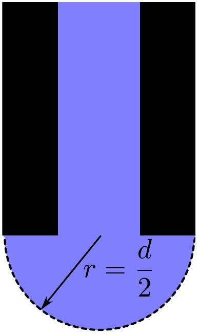
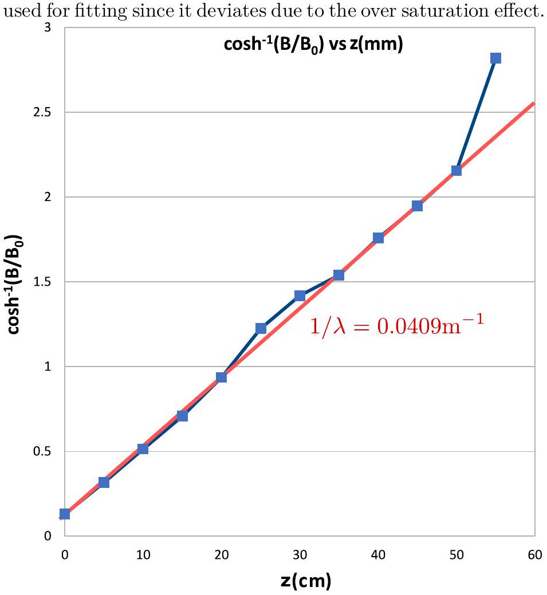
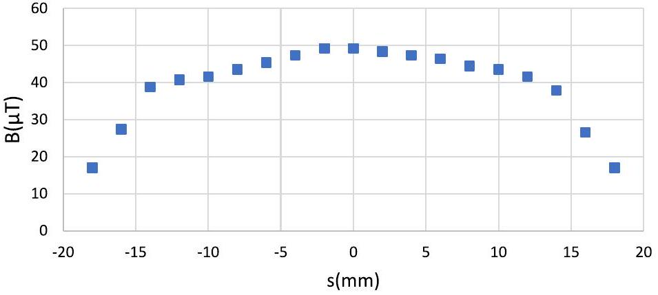
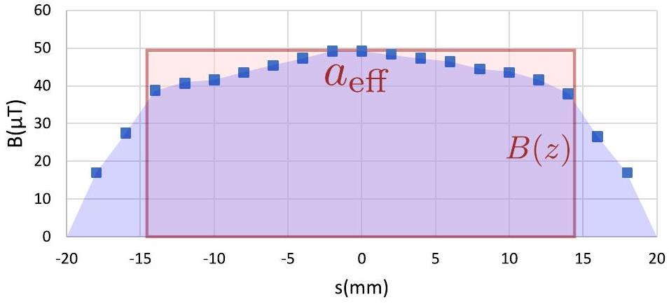
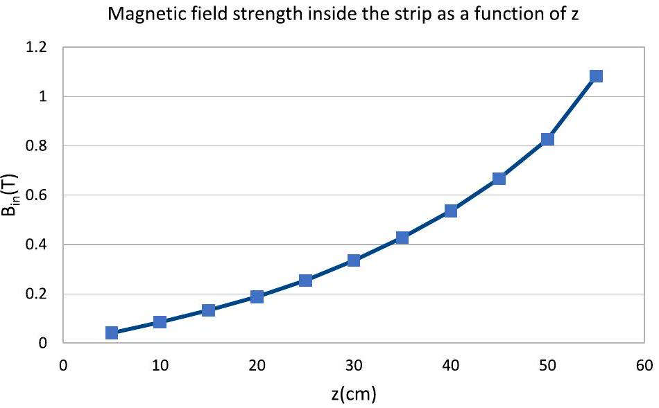

# The $\mathbf { 3 } ^ { \text {rd } }$ Gulf Physics Olympiad - Experimental Competition Solutions

## Muscat, Oman - October $8 { } ^ { \text {th } } 2019$

## Error analysis

In what follows, any time errors of the mean of tabulated data are calculated, standard deviation is used. Assuming there are $N$ data points of the form $x _ { i } , i \in \{ 1 , \ldots , N \}$, the mean is

$$
x _ { \mathrm { avg } } = \frac { 1 } { N } \sum _ { i = 1 } ^ { N } x _ { i } ,
$$

and the standard deviation of the mean

$$
\Delta x _ { \mathrm { avg } } = \sqrt { \frac { \sum _ { i = 1 } ^ { N } \left( x _ { i } - x _ { \mathrm { avg } } \right) ^ { 2 } } { N ( N - 1 ) } } .
$$

For error propagation through equations, Pythagoran rule for adding errors in quadrature is used (alternatively, one could use min-max but for lower accuracy). In general, when you have a variable $y$ be a function of variables $x _ { i } , i \in \{ 1 , \ldots N \}$ with errors $\Delta x _ { i }$, then the error of $y$ is given by

$$
\Delta y = \sqrt { \sum _ { i = 1 } ^ { N } \left( \frac { \partial y } { \partial x _ { i } } \right) ^ { 2 } \Delta x _ { i } ^ { 2 } } .
$$

Any time the methods used in finding the errors is not specified, $50 \%$ of the marks for error analysis are to be deducted.

## Problem E1. Magnetic properties of matter (20 points)

Part A. Diameter of the syringe needle (3 points)
In order to maximize the accuracy, the path length of the diffracted laser needs to be maximized since that increases the separation of the maxima on the screen.
(0.2 pts) A two-fold increase in the path length can be achieved by using a mirror to reflect the laser from one end of the table to the other and then back again.
(0.3 pts)

For both needles, the distance from needle to the mirror and from the mirror to the screen were both $L _ { 0 } = 119 \mathrm {~cm} \pm 0.5 \mathrm {~cm}$. The optical path length is then $L = 2 L _ { 0 } = 238 \mathrm {~cm} \pm 0.5 \mathrm {~cm}$.
(0.3 pts) On the screen, the optical path difference between two neighbouring maxima is $\lambda$, which corresponds to a distance of $l _ { 1 } = \frac { \lambda } { d } L$ on the screen, where $d$ is the diameter of the syringe needle. In order to increase the accuracy, the measurements should cover as many maxima, $N$ as possible. Then the separation is $l _ { N } = N L \frac { \lambda } { d }$ and $d = \frac { N L \lambda } { l _ { n } }$.
(0.4 pts)

For the white needle, following measurements were made:

| $i$ | $N$ | $l _ { N } ( \mathrm {~mm} )$ | $l _ { N } / N ( \mathrm {~mm} )$ | $d ( \mathrm {~mm} )$ |
| :--- | :--- | :--- | :--- | :--- |
| 1 | 22 | 89 | 4.05 | 0.313 |
| 2 | 18 | 74 | 4.11 | 0.308 |
| 3 | 20 | 79 | 3.95 | 0.321 |

1 measurement (0.4/0.6 pts)
2 measurements (0.5/0.6 pts)
3 or more measurements (0.6/0.6 pts)
The average diameter is found to be $d = 0.31 \mathrm {~mm}$ (0.1 pts) with an error of $\Delta d = 0.004 \mathrm {~mm}$.
(0.2 pts)

For the green needle, following measurements were made:

| $i$ | $N$ | $l _ { N } ( \mathrm {~mm} )$ | $l _ { N } / N ( \mathrm {~mm} )$ | $d ( \mathrm {~mm} )$ |
| :--- | :--- | :--- | :--- | :--- |
| 1 | 18 | 98 | 5.44 | 0.233 |
| 2 | 15 | 76 | 5.07 | 0.250 |
| 3 | 16 | 85 | 5.31 | 0.238 |

1 measurement (0.4/0.6 pts)
2 measurements (0.5/0.6 pts)
3 or more measurements (0.6/0.6 pts)
The average diameter is found to be $d = 0.24 \mathrm {~mm}$ (0.1 pts) with an error of $\Delta d = 0.005 \mathrm {~mm}$.
(0.2 pts)

The pressure balance reads

$$
2 \sigma / r = \rho g h ,
$$

where $\rho g h$ is the pressure from the water column of height $h$ with respect to the needle. If we measure $h$, we can thus express the surface tension as

$$
\begin{equation*}
\sigma = \frac { \rho g h r } { 2 } = \frac { \rho g h d } { 4 } . \tag{1}
\end{equation*}
$$

(0.6 pts)

The following repeated measurements were made for the white needle:

| $i$ | $h ( \mathrm {~mm} )$ |
| :--- | :--- |
| 1 | 84 |
| 2 | 80 |
| 3 | 83 |
| 4 | 82 |
| 5 | 83 |

1 measurement (0.2/0.6 pts)
2-4 measurements (0.4/0.6 pts)
5 or more measurements (0.6/0.6 pts)
The average height is found to be $h _ { \text {avg } } = 82.4 \mathrm {~mm}$ with an error of $\Delta h _ { \mathrm { avg } } = 0.7 \mathrm {~mm}$, and using (1), we get $\sigma = 63.4 \mathrm { mN } / \mathrm { m }$ with an error of $\Delta \sigma = \sigma \sqrt { \left( \Delta h _ { \mathrm { avg } } / h _ { \mathrm { avg } } \right) ^ { 2 } + ( \Delta d / d ) ^ { 2 } } = 1 \mathrm { mN } / \mathrm { m }$.

The measurements for the green needle were:
The measurements for the green needle were:

| $i$ | $h ( \mathrm {~mm} )$ |
| :--- | :--- |
| 1 | 114 |
| 2 | 113 |
| 3 | 116 |
| 4 | 112 |
| 5 | 113 |

1 measurement (0.2/0.6 pts)
1 measurement (0.2/0.6 pts) 2-4 measurements (0.4/0.6 pts) 2-4 measurements (0.4/0.6 pts) 5 or more measurements (0.6/0.6 pts) 5 or more measurements (0.6/0.6 pts)

Since the magnet is pushing the graphite at a 45° angle, the force balance is $a _ { m } / \sqrt { 2 } = a _ { g }$. This let us express $\chi _ { g }$ in terms of the measured quantities $\alpha$ and $\frac { \partial w } { \partial z }$ :

$$
\begin{equation*}
\chi _ { g } = \chi _ { w } - \left| \frac { \sqrt { 2 } g \alpha } { \frac { \partial w } { \partial z } } \right| . \tag{2}
\end{equation*}
$$

(0.6 pts)

The average height is $h _ { \mathrm { avg } } = 113.6 \mathrm {~mm}$ with an error $\Delta h _ { \max } =$ 0.7 mm . That gives $\sigma = 67.0 \mathrm { mN } / \mathrm { m }$, and an error of $\Delta \sigma =$ 1.5 mN/m.

$$
\begin{aligned}
& \text { values ( } \mathbf { 0 . 3 ~ p t s } \text { ) } \\
& \text { errors ( } \mathbf { 0 . 4 ~ p t s } \text { ) }
\end{aligned}
$$

The final expression for the surface tension is found by averaging the results of the white and green needle. This yields

$$
\begin{align*}
& \sigma = \left( \sigma _ { \text {white } } + \sigma _ { \text {green } } \right) / 2 = 65.2 \mathrm { mN } / \mathrm { m }  \tag{0.1pts}\\
& \Delta \sigma = \sqrt { \Delta \sigma _ { \text {white } } ^ { 2 } / 2 + \Delta \sigma _ { \text {green } } ^ { 2 } / 2 } = 1.3 \mathrm { mN } / \mathrm { m } \tag{0.1pts}
\end{align*}
$$

## Part C. Susceptibility of graphite (4 points)

| $i$ | $l ( \mathrm {~mm} )$ |
| :--- | :--- |
| 1 | 12 |
| 2 | 10 |
| 3 | 11 |
| 4 | 10 |
| 5 | 11 |

1-2 measurement (0.3/0.5 pts) 3-4 measurements (0.4/0.5 pts) 5 or more measurements (0.5/0.5 pts)

Taking only 1 measurement of the diameter of the magnet is enough since the measurement results are all virtually
this gives an average of $l = 10.8 \mathrm {~mm}$ with an error of $\Delta l =$ the same. The error of the result comes from the accuracy of $0.4 \mathrm {~mm} + 0.5 \mathrm {~mm} = 0.9 \mathrm {~mm}$, where we have added the meas- a ruler, taken to be 0.3 mm. The diameter of the magnet is urement error from the ruler and the standard deviation from measured to be $d = 10.0 \mathrm {~mm}$. the tabulated data (we usually omit the ruler's accuracy in the case of repeat measurements, but that's usually because the

$$
\begin{aligned}
& \text { value ( } \mathbf { 0 . 3 ~ p t s } \text { ) } \\
& \text { error ( } \mathbf { 0 . 2 ~ p t s } \text { ) }
\end{aligned}
$$

ruler's accuracy is much smaller than standard deviation).

The corresponding surface slope can be read from the graph,
In both configurations, the graphite will experience three but first we need to convert $l$ to units of $\lambda = \sqrt { \sigma / ( \rho g ) } =$ forces: gravity, normal force and magnetic force, all of them 2.58 mm , with $\Delta \lambda = 0.03 \mathrm {~mm}$. Thus, $l = ( l / 2.58 \mathrm {~mm} ) \lambda = 4.2 \lambda$ being in balance, with the magnetic force being at an angle with $\Delta l = 0.4 \lambda$. From figure 7, we measure 45° with respect to the horizon. Purely under the force of gravity, the graphite would start accelerating with accelera-

$$
\begin{aligned}
\alpha & = 2.4 \times 10 ^ { - 3 } \mathrm { rad } . \\
\Delta \alpha & = 1.8 \times 10 ^ { - 3 } \mathrm { rad }
\end{aligned}
$$

tion $a _ { g } \approx g \alpha$ (where we have used small angle approximations) along the water surface (normal force does not contribute to
where the error was measured from the figure by looking at this as it's perpendicular to the surface). Since the angles are $\alpha ( \lambda \pm \Delta \lambda )$. The error is big but this is to be expected due to small, this translates to horizontal acceleration of the same the exponential nature of the graphs. magnitude. This is counteracted by the acceleration from the

To get a reading of the magnetic pressure gradient, we first magnet, given by the formula calculate the distance of the graphite from the surface of the
explaining the force balance (0.5 pts)
magnet. We see that the distance is that of the height of an equilateral triangle with side length $d = 10 \mathrm {~mm} \pm 0.3 \mathrm {~mm}$.

The distance is then simply $l _ { 1 } = \sqrt { 3 } / 2 d = 8.7 \mathrm {~mm} \pm 0.3 \mathrm {~mm}$. From figure 8, we read the magnetic pressure gradient to be $\frac { \partial w } { \partial z } = 6.1 \times 10 ^ { 5 } \mathrm {~J} / \mathrm { m } ^ { 4 } \pm 0.9 \times 10 ^ { 5 } \mathrm {~J} / \mathrm { m } ^ { 4 }$.

Finally, using equation (2), we find

$$
\chi _ { g } = 6.4 \times 10 ^ { - 8 } \mathrm {~m} ^ { 3 } / \mathrm { kg } \pm 4 \times 10 ^ { - 8 } \mathrm {~m} ^ { 3 } / \mathrm { kg } .
$$

reading the data from the graphs properly (0.2 pts) final value for $\chi _ { g }$ (0.1 pts) error propagation (0.3 pts)

We go through the same calculations in the 2nd configuration to get a different estimate for $\chi _ { g }$. The measurements for 2nd configuration are tabulated below

| $i$ | $l ( \mathrm {~mm} )$ |
| :--- | :--- |
| 1 | 7 |
| 2 | 8 |
| 3 | 8 |
| 4 | 6 |
| 5 | 7 |

1-2 measurement (0.3/0.5 pts) 3-4 measurements (0.4/0.5 pts) 5 or more measurements (0.5/0.5 pts)

We find $l = 7.2 \mathrm {~mm} , \Delta l = 0.4 \mathrm {~mm} + 0.5 \mathrm {~mm} = 0.9 \mathrm {~mm}$. This corresponds to $l = 2.8 \lambda \pm 0.4 \lambda$ From figure 7, we read $\alpha = 1.7 \times 10 ^ { - 2 } \mathrm { rad } \pm 0.9 \times 10 ^ { - 2 } \mathrm { rad }$.

In this case, a right-angled isosceles is formed. It's easy to see that the graphite is distance $d / 2 = 5 \mathrm {~mm} \pm 0.15 \mathrm {~mm}$ from the surface of the magnet. This gives the magnetic pressure gradient to be $\frac { \partial w } { \partial z } = 4.6 \times 10 ^ { 6 } \mathrm {~J} / \mathrm { m } ^ { 4 } \pm 0.4 \times 10 ^ { 6 } \mathrm {~J} / \mathrm { m } ^ { 4 }$. This gives the susceptibility to be $\chi _ { g } = 6.0 \times 10 ^ { - 8 } \mathrm {~kg} / \mathrm { m } ^ { 3 } \pm 3 \mathrm {~kg} / \mathrm { m } ^ { 3 }$.
reading the data from the graphs properly (0.2 pts) final value for $\chi _ { g }$ (0.1 pts) error propagation (0.3 pts)

Finally, we average the two results to get

$$
\chi _ { g } = 6.2 \times 10 ^ { - 8 } \mathrm {~kg} / \mathrm { m } ^ { 3 } \pm 4 \times 10 ^ { - 8 } \mathrm {~kg} / \mathrm { m } ^ { 3 } .
$$

final answer (0.1 pts) error (0.1 pts)

## Part D. Relative permeability of ferromagnetic strip (9 points)

i. (1 pt) The voltage on the output leads of the battery holder can be measured to be $\mathcal { E } = 3.17 \mathrm {~V}$, no uncertainty is needed. (0.5 pts)

After correctly setting up the experimental equipment, the zero off-set is measured to be $V _ { 0 } = 2 \mathrm { mV }$.
(0.5 pts)
ii. (4 pts) Rearranging the expression for the magnetic field strength between the strips, $B = B _ { 0 } \cosh ( z / \lambda )$, we get

$$
\begin{equation*}
\cosh ^ { - 1 } \left( B / B _ { 0 } \right) = z / \lambda . \tag{0.5pts}
\end{equation*}
$$

We can measure $z$ and $V$, and $V$ can be converted into magnetic field strength $B$ by noting that the maximal field strength $B _ { \text {max } } = 3 \mathrm {~V} \cdot \frac { 10 \mu \mathrm {~T} } { 1 \mathrm { mV } } = 30 \mathrm { mT }$ is measured at $V = \mathcal { E }$, and thus, we must have

$$
\begin{equation*}
B = B _ { \max } \frac { V } { \mathcal { E } } = 30 \mathrm { mT } \cdot \frac { V } { \mathcal { E } } . \tag{3}
\end{equation*}
$$

(0.3 pts)

This relies on the fact that the magnetic field strength scales linearly with voltage. To linearize the measured data, we need to know $B _ { 0 }$. This can be found by noting that $\cosh ( 0 ) = 1$ and so $B _ { 0 } = B ( z = 0 )$. This we can read from the measured data to be $B _ { 0 } = 0.227 \mathrm {~T}$.
(0.2 pts)

Now note that we can plot $\cosh ^ { - 1 } \left( B / B _ { 0 } \right)$ against $z$ to get a linear graph with slope $1 / \lambda$. The tabulated data is given below.

| $z ( \mathrm {~cm} )$ | $V ( \mathrm { mV } )$ | $B ( \mathrm { mT } )$ | $\cosh ^ { - 1 } \left( B / B _ { 0 } \right)$ |
| :--- | :--- | :--- | :--- |
| 0 | 24 | 0.227 | 0.130 |
| 5 | 25 | 0.237 | 0.316 |
| 10 | 27 | 0.256 | 0.513 |
| 15 | 30 | 0.284 | 0.707 |
| 20 | 35 | 0.331 | 0.936 |
| 25 | 44 | 0.416 | 1.225 |
| 30 | 52 | 0.492 | 1.418 |
| 35 | 58 | 0.549 | 1.539 |
| 40 | 71 | 0.672 | 1.757 |
| 45 | 85 | 0.804 | 1.946 |
| 50 | 104 | 0.984 | 2.154 |
| 55 | 200 | 1.893 | 2.818 |

less than 3 measurements (0.0/0.4 pts) 3-11 measurements (0.2/0.4 pts) correct number of measurements (0.4/0.4 pts)
calculations (0.4 pts)
It is important to note that on the graph, the line doesn't need to pass through origin due to systematic errors affecting all the points equally. For example, the measured $z = 0$ doesn't coincide with the actual origin due to the physical dimensions of the magnet. Furthermore, the final point in the graph is not

plotting (1.0 pts)

From the graph, we read the slope to be $1 / \lambda = 0.0409 \mathrm {~m} ^ { - 1 }$.
(0.2 pts) The uncertainty can be estimated by looking at the spread of lines that can be reasonably expected to pass through the points. This yields $\Delta ( 1 / \lambda ) = 0.00072 \mathrm {~m} ^ { - 1 }$. (0.2 pts)

Now, $\mu = \frac { 2 \lambda ^ { 2 } } { \delta h }$. We measure $h$, the width of the gap, with a ruler to be $h = 7.7 \mathrm {~mm} \pm 0.3 \mathrm {~mm}$. The error is found by noting that the error of a ruler is half, or slightly less depending on how good your eye is, of the distance between two neighbouring ticks, 0.1 mm. Finally, we calculate $\mu = 57000$ (0.4 pts) with an error of

$$
\begin{equation*}
\Delta \mu = \mu \sqrt { \left( 2 \frac { \Delta ( 1 / \lambda ) } { ( 1 / \lambda ) } \right) ^ { 2 } + \left( \frac { \Delta h } { h } \right) ^ { 2 } } = 3000 . \tag{0.4pts}
\end{equation*}
$$

iii. (2 pts) The tabulated measurement data is given below. The voltages are translated to teslas using equation (3).

| $x ( \mathrm {~mm} )$ | $s ( \mathrm {~mm} )$ | $V ( \mathrm { mV } )$ | $B$ (mT) |
| :--- | :--- | :--- | :--- |
| 0 | -18 | 18 | 0.170 |
| 2 | -16 | 29 | 0.274 |
| 4 | -14 | 41 | 0.388 |
| 6 | -12 | 43 | 0.407 |
| 8 | -10 | 44 | 0.416 |
| 10 | -8 | 46 | 0.435 |
| 12 | -6 | 48 | 0.454 |
| 14 | -4 | 50 | 0.473 |
| 16 | -2 | 52 | 0.492 |
| 18 | 0 | 52 | 0.492 |
| 20 | 2 | 51 | 0.483 |
| 22 | 4 | 50 | 0.473 |
| 24 | 6 | 49 | 0.464 |
| 26 | 8 | 47 | 0.445 |
| 28 | 10 | 46 | 0.435 |
| 30 | 12 | 44 | 0.416 |
| 32 | 14 | 40 | 0.379 |
| 34 | 16 | 28 | 0.265 |
| 36 | 18 | 18 | 0.170 |

less than 3 measurements (0.1/0.6 pts)
3-5 measurements (0.3/0.6 pts)
6-7 measurements (0.4/0.6 pts) correct number of measurements (0.6/0.6 pts)
calculations (0.4 pts) $x$ is measured with respect to the first data point, $s$ is with respect to the symmetry axis (found to be at $x = 18 \mathrm {~mm}$ ). The graph for $B$ vs $s$ is given below.

Magnetic field strength as a function of the distance from the symmetry axis

plotting (0.6 pts)

As can be seen, the magnetic field strength is uniform and with small deviations up to ~ 10 \% over the width of the strip. Outside the strip, the field strength starts dropping rapidly.
(0.4 pts)

iv. (2 pts) The main idea relies on the fact that magnetic field lines are conserved, or in other words the magnetic flux through a closed surface is 0. This is equivalent to Gauss' law. In the context of this problem, it implies that the flux entering the gap must come from the decrease of the flux flowing along the ferromagnetic strip. The flux flowing outside the strip will be negligible because of the high value of $\mu$.

Let the total flux along the strip be $\Phi _ { \text {in } } , z$-axis be along the strip, and $x$-axis be horizontal, perpendicular to $z$. Also denote the flux through the $x - z$ plane intersecting the gap from $z = 0$ to $z$ as $\Phi _ { z }$. The Gauss' law can then be formulated as

$$
\begin{equation*}
\Phi _ { \mathrm { in } } ( z ) - \Phi _ { \mathrm { in } } ( z = 0 ) = \Phi _ { z } . \tag{4}
\end{equation*}
$$

(0.5 pts) Note that since the flux inside the ferromagnet drops exponentially, and judging from the tabulated data, it's reasonable to say that $\Phi _ { \text {in } } ( z ) \gg \Phi _ { \text {in } } ( z = 0 )$.
(0.1 pts) We can approximate the magnetic field to be homogeneous throughout the cross-section of the ferromagnet (to very high accuracy, this can be verified using Ampère's law). Then $\Phi _ { \text {in } } ( z ) = a \delta B _ { \text {in } } ( z )$, where $a$ is the width of the ferromagnet, measured to be $a = 30 \mathrm {~mm} \pm 0.3 \mathrm {~mm}$, and $B _ { \text {in } } ( z )$ is the magnetic field inside the ferromagnet.
(0.1 pts)

This means that if we calculate $\Phi _ { z }$, we can find $B _ { \text {in } }$ using equation (4). To find $\Phi _ { z }$, we need to sum the magnetic field over the $z$ - and $x$-direction. In integral form, it looks like $\Phi _ { z } = \int _ { 0 } ^ { z } \mathrm {~d} z ^ { \prime } \int _ { - \infty } ^ { \infty } \mathrm { d } x B \left( x , z ^ { \prime } \right)$. We can simplify this with the integral $\Phi _ { z } = a _ { \text {eff } } \int _ { 0 } ^ { z } \mathrm {~d} z ^ { \prime } B \left( z ^ { \prime } \right)$, where $a _ { \text {eff } }$ is the effective width of the gap such that the area under the graph found in the previous part is equal to $B \left( z ^ { \prime } \right) a _ { \text {eff } }$, where $B \left( z ^ { \prime } \right)$ is the maximal magnetic field in the gap found in part (ii).

From an approximate plot shown below, we find $a _ { \text {eff } } =$ $0.955 a = 28.7 \mathrm {~mm}$.

Finding $a _ { \text {eff } }$ using a plot, or something equivalent (0.2 pts)

All that's left is to find $\int _ { 0 } ^ { z } \mathrm {~d} z ^ { \prime } B \left( z ^ { \prime } \right)$. This can be found from the tabulated data found in part (ii) by summing over the data points using the trapezoid rule,

$$
\begin{aligned}
\Phi _ { i } & = \Phi _ { i - 1 } + \frac { B _ { i } + B _ { i - 1 } } { 2 } \left( z _ { i } - z _ { i - 1 } \right) a _ { \mathrm { eff } } \\
& = \Phi _ { i - 1 } + \frac { B _ { i } + B _ { i - 1 } } { 2 } \Delta A = \Phi _ { i - 1 } + \Delta \Phi _ { i }
\end{aligned}
$$

(0.3 pts) where $\Delta A = \left( z _ { i } - z _ { i - 1 } \right) a _ { \text {eff } } = 5 \mathrm {~cm} \cdot 28.7 \mathrm {~mm} = 0.00144 \mathrm {~m} ^ { 2 }$ is the effective area of the last segment and $\Delta \Phi _ { i } = \frac { B _ { i } + B _ { i - 1 } } { 2 } \Delta A$ the flux through the corresponding surface. After that, the magnetic field inside the ferromagnetic is simply found using (4) as $B _ { \text {in } } = \frac { \Phi _ { \text {in } } } { a \delta }$.

The calculated data is given below alongside with the plot of $B _ { \text {in } }$ vs $z$.

| $z ( \mathrm {~cm} )$ | $B ( \mathrm { mT } )$ | $\Delta \Phi \left( \mu \mathrm { T } \cdot \mathrm { m } ^ { 2 } \right)$ | $\Phi \left( \mu \mathrm { T } \cdot \mathrm { m } ^ { 2 } \right)$ | $B _ { \text {in } } ( \mathrm { T } )$ |
| :--- | :--- | :--- | :--- | :--- |
| 0 | - | - | 0 |  |
| 5 | 0.232 | 0.334 | 0.334 | 0.041 |
| 10 | 0.246 | 0.354 | 0.688 | 0.085 |
| 15 | 0.27 | 0.389 | 1.077 | 0.133 |
| 20 | 0.308 | 0.444 | 1.521 | 0.188 |
| 25 | 0.374 | 0.539 | 2.06 | 0.254 |
| 30 | 0.454 | 0.654 | 2.714 | 0.335 |
| 35 | 0.521 | 0.75 | 3.464 | 0.428 |
| 40 | 0.61 | 0.878 | 4.342 | 0.536 |
| 45 | 0.738 | 1.063 | 5.405 | 0.667 |
| 50 | 0.894 | 1.287 | 6.692 | 0.826 |
| 55 | 1.438 | 2.071 | 8.763 | 1.082 |

calculations (0.3 pts)

plotting (0.3 pts)
Since in the graph found in part (ii), the saturation cut-off happened at the last data point, we can use the corresponding value for $B _ { \text {in } }$ as an estimate for $B _ { s }$. Then $B _ { s } \sim 1.1 \mathrm {~T}$.
(0.2 pts)
