## Problem T1. Zero gravity (10 points) Part A. Zero-g flight (3 points)

i. (0.5 pts) In order for the people on board to experience weightlessness, the plane would need to be in free-fall and follow a parabolic trajectory. This means that on the figure, only the part with parabolic trajectory (curved down) corresponds to zero-g flight.
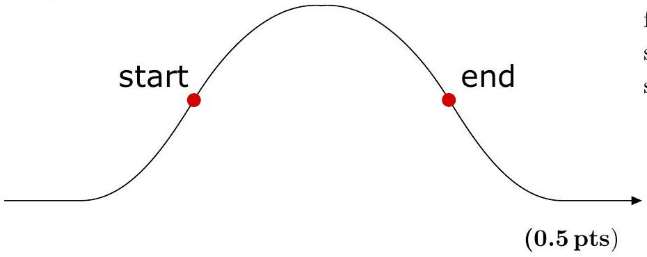
ii. (0.5 pts) Since the plane needs to be in free-fall, there has to be constant acceleration pointing vertically down of magnitude $g$.

$$
\begin{array} { r }
\text { direction ( } 0.2 \mathrm { pts } \text { ) } \\
\text { magnitude ( } 0.3 \mathrm { pts } \text { ) }
\end{array}
$$

iii. (0.5 pts) Since the plane is in free-fall, the horizontal component of the velocity remains constant and at the highest point of its trajectory, the vertical component is 0.
(0.2 pts)

Therefore, the speed of the airplane at its highest point is

$$
\begin{equation*}
v _ { \text {peak } } = v _ { 0 } \cos \alpha _ { 0 } = 314 \mathrm {~km} / \mathrm { h } . \tag{0.3pts}
\end{equation*}
$$

iv. (0.5 pts) Because the vertical component is changing with uniform acceleration $- g$ from $v _ { y 0 } = v _ { 0 } \sin \alpha _ { 0 }$ to 0,
(0.2 pts) the time taken to reach the highest point is

$$
\begin{equation*}
t _ { 0 } = \frac { v _ { 0 } \sin \alpha _ { 0 } } { g } = 9.5 \mathrm {~s} . \tag{0.3pts}
\end{equation*}
$$

v. (0.5 pts) The altitude of the airplane at its highest point can be expressed using the equation for uniform acceleration:
(0.2 pts)

$$
\begin{equation*}
h _ { \max } = h _ { 0 } + v _ { y 0 } t - \frac { g t _ { 0 } ^ { 2 } } { 2 } = h _ { 0 } + \frac { v _ { 0 } ^ { 2 } \sin \alpha _ { 0 } ^ { 2 } } { 2 g } = 8045 \mathrm {~m} . \tag{0.3pts}
\end{equation*}
$$

vi. (0.5 pts) It is clear that, in order to maximize the time of weightlessness, the final speed needs to be as big as possible, equal to $c _ { s }$.
(0.1 pts)

At the end of weightlessness, the horizontal component of the velocity is still $v _ { x f } = v _ { 0 } \cos \alpha _ { 0 }$, the vertical must then be $v _ { y f } = - \sqrt { c _ { s } ^ { 2 } - v _ { x y } ^ { 2 } }$.
(0.2 pts)

Finally, we get the maximal duration to be

$$
\begin{equation*}
t _ { \max } = \frac { v _ { 0 } \sin \alpha _ { 0 } + \sqrt { c _ { s } ^ { 2 } - v _ { 0 } ^ { 2 } \cos \alpha _ { 0 } ^ { 2 } } } { g } = 38.8 \mathrm {~s} . \tag{0.2pts}
\end{equation*}
$$

Part B. Glass of water in weightlessness (3 points)
i. (1 pt) The reason why the water retains its shape is due to surface tension holding it back. In general, when you have a surface with radius $R$, the pressure difference between the inside and outside is given by $\Delta p = 2 \sigma / R$. In weightlessness, the pressure inside the liquid is uniform throughout the volume because there is no gravity to pull it down. Therefore, the pressure difference, and hence the radius of curvature, is the same everywhere along the surface. In other words, the surface of the liquid must form a part of a sphere with the contact surface with the glass still being at an angle $\beta = 0 ^ { \circ }$. Because the surface is tangent with the glass, the radius of curvature of the surface must be $r$ as shown in the figure.
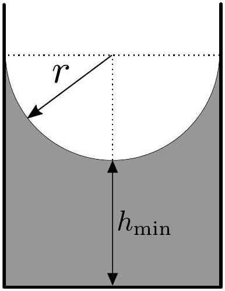
ii. (1 pt) The volume of water will be the same in both scenarios.
(0.1 pts)

Under normal gravity, the volume was $V = \pi r ^ { 2 } h _ { 0 }$ (the volume of a cylinder).
(0.2 pts)

Afterwards, the water can be divided into a cylindrical part of height $h _ { \text {min } }$ and spherical part (or more precisely, a cylinder with a sphere cut out of it) of radius $r$.
(0.2 pts)

The volume of the cylindrical part is simply

$$
\begin{equation*}
V _ { 1 } = \pi r ^ { 2 } h _ { \min } . \tag{0.1pts}
\end{equation*}
$$

The volume of the spherical part is equal to the difference of a cylinder with height and radius equalling to $r$, and a half-sphere of radius $r$. That corresponds to a volume of

$$
\begin{equation*}
V _ { 2 } = \pi r ^ { 3 } - \frac { 1 } { 2 } \cdot \frac { 4 } { 3 } \pi r ^ { 3 } = \pi r ^ { 3 } \left( 1 - \frac { 2 } { 3 } \right) = \frac { 1 } { 3 } \pi r ^ { 3 } . \tag{0.2pts}
\end{equation*}
$$

The total volume is therefore

$$
V = V _ { 1 } + V _ { 2 } = \pi r ^ { 2 } h _ { \min } + \frac { 1 } { 3 } \pi r ^ { 3 } = \pi r ^ { 2 } h _ { 0 }
$$

and so

$$
\begin{equation*}
h _ { \min } = h _ { 0 } - \frac { 1 } { 3 } r = 2 \mathrm {~cm} . \tag{0.2pts}
\end{equation*}
$$

iii. (1 pt) When the glass is continuously filled, the water surface will slowly creep up along the glass while maintaining the same spherical shape. When the water-air-glass interface reaches the edge of the glass, the surface normal of the glass wants to flip by 180° (corresponding to going from inside the glass to outside), but this must happen continuously since the angle of contact between the water and the glass must always be 0° and the glass is filled slowly. This means that while filling the glass, the surface of the water will slowly "invert"

and start from having a radius of curvature $r$ curving inwards to, first, getting flatter while maintaining a spherical shape, and then becoming completely flat when the volume of the water is $V _ { 0 }$, to slowly curving outwards until finally having a radius of curvature of $r$ as shown in the figure. Note that you cannot fill the glass any more because then the outside of the glass would get wet.
(0.3 pts)

As we can see, the glass will hold the normal volume of the water that a glass can hold, $V _ { 0 }$, and additionally a half-sphere of radius $r$.
(0.2 pts)

This corresponds to a total volume of

$$
\begin{equation*}
V _ { \text {total } } = V _ { 0 } + \frac { 1 } { 2 } \cdot \frac { 4 } { 3 } \pi r ^ { 3 } = V _ { 0 } + \frac { 2 } { 3 } \pi r ^ { 3 } = 257 \mathrm {~cm} ^ { 3 } . \tag{0.2pts}
\end{equation*}
$$

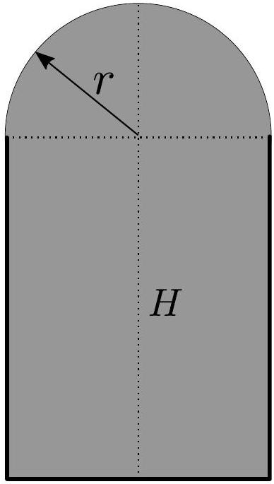
(0.3 pts)

Part C. Sharpshooter on geostationary orbit (4 points) i. (0.7 pts) From Kepler's III law,

$$
\begin{equation*}
\frac { T _ { 0 } ^ { 2 } } { R _ { 0 } ^ { 3 } } = \frac { 4 \pi ^ { 2 } } { G M _ { \oplus } ^ { 2 } } , \tag{1}
\end{equation*}
$$

(0.3 pts) where $R _ { 0 }$ is the radius of the geostationary orbit and $M _ { \oplus }$ Earth's mass. We don't know the value of $M _ { \oplus }$, but we do know the gravitational acceleration on Earth:

$$
\begin{equation*}
g = \frac { G M _ { \oplus } } { R _ { \oplus } ^ { 2 } } . \tag{2}
\end{equation*}
$$

(0.2 pts)

Solving (1) and (2) yields

$$
\begin{equation*}
R _ { 0 } = \sqrt [ 3 ] { \frac { R _ { \oplus } ^ { 2 } g T _ { 0 } ^ { 2 } } { 4 \pi ^ { 2 } } } = 4.2 \times 10 ^ { 4 } \mathrm {~km} = 6.6 R _ { \oplus } \tag{0.2pts}
\end{equation*}
$$

alternatively, instead of using Kepler's III law, a student could write down the force balance (0.3 pts)
ii. (1.8 pts) The spaceship moves with speed

$$
\begin{equation*}
v _ { 0 } = \frac { 2 \pi R _ { 0 } } { T _ { 0 } } = 3080 \mathrm {~m} / \mathrm { s } . \tag{0.1pts}
\end{equation*}
$$

The bullet will start moving with velocity $\vec { w } = \vec { v } _ { 0 } + \vec { u } _ { 0 }$, where the angle between $\vec { v } _ { 0 }$ and $\vec { u } _ { 0 }$ can be freely varied. Like any other satellite, the bullet will start moving along an ellipse around the centre of Earth.
(0.1 pts)

Obviously, the bullet can only hit the spaceship at points where the trajectories of the bullet and spaceship intersect. This corresponds to intersections of an ellipse and a circle, and in this case, there are 2 intersections, since any satellite has only one closest approach to the centre of mass.
(0.2 pts)

One of the intersection points is already known - the point at which the bullet is shot out. From here, it is hopefully easy enough to see that a sufficient solution would be to make the bullet have an orbital period of 24 h, since then, both the bullet and the spaceship will collide after 24 h.
(0.5 pts)

The rest boils down to finding at what angle does one have to shoot to maintain the same orbital period. For this one can use the following reasoning. First note that from Kepler's III law, orbital period $T$ relates to the semi-major axis $a$ as $T \propto a ^ { 3 / 2 }$. Therefore, if we want to maintain $T$, the semi-major axis needs to be fixed.
(0.2 pts)

The semi-major axis is related to the total energy as

$$
E _ { \mathrm { total } } = - \frac { G M _ { \oplus } m _ { \mathrm { bullet } } } { 2 a } .
$$

As we can see, fixing the semi-major axis means that the total energy needs to stay constant and since total energy = kinetic energy + potential energy, the total speed of the bullet and the spaceship need to be equal at the instant when the bullet is shot!
(0.4 pts)

This can be easily achieved by making the angle between $\vec { v } _ { 0 }$ and $\vec { u } _ { 0 }$ such that $\vec { v } _ { 0 } , \vec { u } _ { 0 }$, and $\vec { w }$ form an isosceles triangle. From simple geometry, one gets the desired angle to be

$$
\begin{equation*}
90 ^ { \circ } - \arccos \frac { u _ { 0 } } { 2 v _ { 0 } } = 11.2 ^ { \circ } . \tag{0.3pts}
\end{equation*}
$$

iii. (1.5 pts) Note that similarly to the previous part, the only way to make the bullet and the spaceship collide is to make the bullet and the spaceship meet at the original intersection point after some number of orbital rotations.
(0.2 pts)

In this case, there are actually no other intersection points because the circle and the ellipse are touching at the point where the bullet was shot.
(0.2 pts)

Now, let us find the maximal and minimal orbital period of the bullet.
If the speed of the bullet is chosen to be $u$, then the speed in the laboratory frame is $v _ { 0 } + u$. The total energy per mass expressed at the point where the bullet was shot is

$$
\begin{equation*}
\frac { E _ { \text {total } } } { m _ { \text {bullet } } } = - \frac { G M _ { \oplus } } { 2 a } = \frac { \left( v _ { 0 } + u \right) ^ { 2 } } { 2 } - \frac { G M _ { \oplus } } { R _ { 0 } } . \tag{0.2pts}
\end{equation*}
$$

Therefore,

$$
\begin{equation*}
a = \frac { R _ { 0 } } { 2 } \left( 1 - \frac { R _ { 0 } \left( v _ { 0 } + u \right) ^ { 2 } } { 2 G M _ { \oplus } } \right) ^ { - 1 } . \tag{0.1pts}
\end{equation*}
$$

From Kepler's III law,

$$
\begin{equation*}
\frac { T ^ { 2 } } { a ^ { 3 } } = \frac { 4 \pi ^ { 2 } } { G M _ { \oplus } } , \tag{0.2pts}
\end{equation*}
$$

hence

$$
\begin{equation*}
T = \frac { 2 \pi } { \sqrt { G M _ { \oplus } } } \left( 1 - \frac { R _ { 0 } \left( v _ { 0 } + u \right) ^ { 2 } } { 2 G M _ { \oplus } } \right) ^ { - 3 / 2 } . \tag{0.2pts}
\end{equation*}
$$

We can simplify this by noting that

$$
T _ { 0 } = \frac { 2 \pi } { \sqrt { G M _ { \oplus } } } \left( 1 - \frac { R _ { 0 } v _ { 0 } ^ { 2 } } { 2 G M _ { \oplus } } \right) ^ { - 3 / 2 } ,
$$

so

$$
T = T _ { 0 } \left( \frac { 1 - \frac { R _ { 0 } \left( v _ { 0 } + u \right) ^ { 2 } } { 2 G M _ { \oplus } } } { 1 - \frac { R _ { 0 } v _ { 0 } ^ { 2 } } { 2 G M _ { \oplus } } } \right) ^ { - 3 / 2 } = T _ { 0 } \left( 2 - \frac { R _ { 0 } \left( v _ { 0 } + u \right) ^ { 2 } } { g R _ { \oplus } ^ { 2 } } \right) ^ { - 3 / 2 }
$$

$u$ can go from 0 to $u _ { m }$ so the orbital period can vary from $T ( u = 0 ) = T _ { 0 }$ to $T \left( u = u _ { m } \right) = 1.41 T _ { 0 }$.
By inspection, it is easy to see that choosing the speed such that $T = \frac { 4 } { 3 } T _ { 0 }$ would guarantee the smallest number of orbital period before the collision. Then the collision would happen after four orbital periods of the spaceship (three for the bullet). In other words, the smallest possible travel time until hitting the spaceship is

$$
\begin{equation*}
T = 4 T _ { 0 } = 96 \text { days. } \tag{0.3pts}
\end{equation*}
$$

Problem T2. Controlled fusion (11 points)
Part A. General considerations (0.5 points)
i. (0.5 pts) We need to equate thermal and electrostatic energies, $k _ { B } T = e V$ (0.2 pts)
with $V = 14 \mathrm { kV }$. (0.1 pts)
Hence, the fusion temperature can be expressed in Kelvins as $T = e V / k _ { B }$ (0.1 pts)
which yields numerically

$$
T _ { 0 } = \frac { 14 \mathrm { keV } } { k _ { B } } = \frac { 14 \times 10 ^ { 3 } \times 1.60 \times 10 ^ { - 19 } \mathrm { C } \cdot \mathrm {~V} } { 1.38 \times 10 ^ { - 23 } \mathrm {~J} \cdot \mathrm {~K} ^ { - 1 } } = 1.6 \times 10 ^ { 8 } \mathrm {~K} .
$$

(0.1 pts)

Part B. Tokamak (2.5 points)
i. (0.5 pts) The magnetic field lines curl around the straight current with the direction determined by the right hand rule or something equivalent. (0.2 pts)
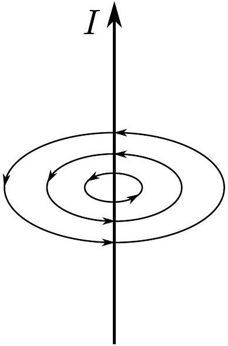
(0.3 pts)

Only one fieldline shown: -0.1 pts. No direction of the fieldlines shown: -0.2 pts; wrong direction: -0.1 pts.
ii. (0.5 pts) Very close to the circular loop, the magnetic field is similar to that of a straight wire. Far away, the magnetic field lines correspond to that of a magnetic dipole. (0.2 pts) The in-between area can be approximate drawn as shown in the figure
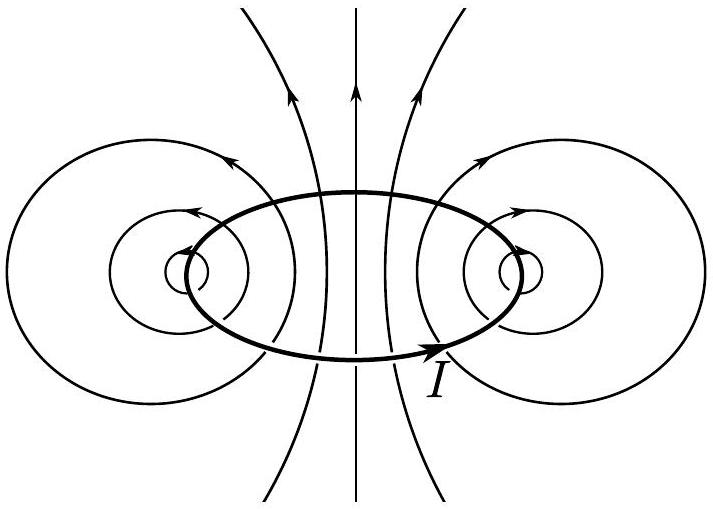
(0.3 pts)

Only one fieldline shown: -0.1 pts. No direction of the fieldlines shown: -0.2 pts; wrong direction: -0.1 pts.
iii. (0.75 pts) Without the infinite wire, the field line would make a short circular loop around the circular current and terminate. In the presence of the long wire, a tangential component of the magnetic field is added, so the previously circular magnetic field line starts to drift in the tangential direction around the infinite wire while still winding rapidly around the circular loop. This forms a helixal pattern along the surface of a toroid as shown in the figure. (0.25 pts)
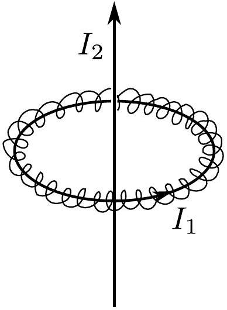
(0.5 pts)
iv. (0.75 pts) Using similar arguments, without the presence of the circular loop, the magnetic field lines would make a short circular loop around the infinite wire and then terminate. If we add the circular loop, the field lines start drifting along the field lines of the circular loop that are very close to the center (the fied lines lie on the $z$ - and $r$-axis in cylindrical coordinates) while winding rapidly around the symmetry axis (after all, the magnetic field strength from the infinite wire is much bigger). This means that the field line forms a dense helix that's slowly getting wider and wider the farther away you go from the plane of the circular loop until it eventually completes the loop by coming back very far away from the circular loop. (0.25 pts)
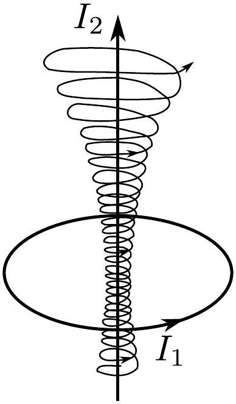

(0.5 pts)

If the helix doesn't get wider, subtract 0.15 pts from the full score.
Part C. Cold fusion (3.5 points)
i. (1 pt) The electron (muon) experiences an electrostatic force of

$$
\begin{equation*}
F = - \frac { 1 } { 4 \pi \epsilon _ { 0 } } \frac { 2 e ^ { 2 } } { R ^ { 2 } } , \tag{0.4pts}
\end{equation*}
$$

where the factor of two comes from the fact that the nucleus has charge $+ 2 e$. This is an attractive force and it acts as a centripetal force

$$
\begin{equation*}
F = \frac { m v ^ { 2 } } { R } = \frac { p ^ { 2 } } { m R } \tag{0.4pts}
\end{equation*}
$$

(formula for centripetal acceleration only yields 0.3 pts). Combining the two, one gets

$$
\begin{equation*}
p = \sqrt { \frac { m e ^ { 2 } } { 2 \pi \epsilon _ { 0 } R } } . \tag{0.2pts}
\end{equation*}
$$

ii. (1 pt) According to the uncertainty principle, the standard deviation of the momentum and the position of the particle obey the following inequality

$$
\begin{equation*}
\sigma _ { x } \sigma _ { p } \geq \frac { \hbar } { 2 } , \tag{0.3pts}
\end{equation*}
$$

where $\hbar = h / 2 \pi$ is the reduced Planck's constant. Since we are after an estimate, the numerical factors do not really matter so we will omit those from now on. The momentum of the electron (muon) is always $p$ so $\sigma _ { p } = p$, whereas the standard deviation of the position is in the order of the radius of the circle, so $\sigma _ { r } \sim R$.
This yields

$$
\begin{equation*}
\sqrt { \frac { m e ^ { 2 } R } { \epsilon _ { 0 } } } \geq h . \tag{0.3pts}
\end{equation*}
$$

Solving for $R$ gives

$$
\begin{equation*}
R \sim \frac { h ^ { 2 } \epsilon _ { 0 } } { m e ^ { 2 } } . \tag{0.2pts}
\end{equation*}
$$

For an electron, $R \left( m = m _ { e } \right) = 1.7 \times 10 ^ { - 10 } \mathrm {~m}$, for a muon, $R \left( m = m _ { \mu } \right) = 8.1 \times 10 ^ { - 13 } \mathrm {~m}$.

No marks for energy expressions, and no marks for $p = m v$. iii. (1 pt) Due to symmetry, we need only consider the force balance on one of the nuclei because the other one experiences exactly the same forces.
(0.1 pts)

The force balance is between the electromagnetic force from the other nucleus and from the electron (muon cloud). The first corresponds to a repulsive force of

$$
\begin{equation*}
F _ { 1 } = \frac { 1 } { 4 \pi \epsilon _ { 0 } } \frac { e ^ { 2 } } { d ^ { 2 } } . \tag{0.2pts}
\end{equation*}
$$

With the electron (muon) cloud, only the charge that is inside a sphere of radius $d$ contributes to the electromagnetic force. This can be verified using Gauss' theorem on the said sphere.
(0.1 pts)

The charge inside the smaller sphere is given by $q =$ $- 2 e d ^ { 3 } / 8 R ^ { 3 }$, because the charge of the sphere scales as the radius cubed.
(0.2 pts)

The force from the cloud is then

$$
\begin{equation*}
F _ { 2 } = - 2 e \frac { d ^ { 3 } } { 8 R ^ { 3 } } \frac { 1 } { 4 \pi \epsilon _ { 0 } } \frac { e } { d ^ { 2 } } . \tag{0.2pts}
\end{equation*}
$$

Now, because of force balance, $F _ { 1 } + F _ { 2 } = 0$, so

$$
\begin{equation*}
\frac { 1 } { 4 \pi \epsilon _ { 0 } } \frac { e ^ { 2 } } { d ^ { 2 } } - \frac { d ^ { 3 } } { 4 R ^ { 3 } } \frac { 1 } { 4 \pi \epsilon _ { 0 } } \frac { e ^ { 2 } } { d ^ { 2 } } = 0 . \tag{0.1pts}
\end{equation*}
$$

Solving for $d$, one gets

$$
\begin{equation*}
d = R \sqrt [ 3 ] { 4 } . \tag{0.1pts}
\end{equation*}
$$

iv. (0.5 pts) Since $d$ scales linearly with $R$ and $R$ is inversely proportional to the mass, the distance between the nuclei is reduced by a factor of $m _ { \mu } / m _ { e } = 207$.
(0.5 pts)

No marks for the answer without any motivation. The points can be obtained only by summarizing the results of Ciii and Civ. Using the result of Civ without the result of Ciii gives 0.1 pt.
Part D. Inertial confinement fusion (4.5 points)
i. (0.5 pts) The fluid shell has uniform mass density along its surface which can be expressed as $\sigma = M / A$, where $A = 4 \pi r ^ { 2 }$ is the total area of the shell.
(0.2 pts)

The mass of the small piece is therefore

$$
\begin{equation*}
\Delta M = \sigma \Delta A = M \frac { \Delta A } { 4 \pi r ^ { 2 } } . \tag{0.3pts}
\end{equation*}
$$

ii. (1 pt) Since the external pressure is much bigger than the internal, the shell will start contracting.
(0.2 pts)

The total force acting on the small piece is $\Delta F = p _ { 0 } \Delta A -$ $p _ { e } \Delta A \simeq - p _ { e } \Delta A$, where a positive force would be pointing radially outwards.
The acceleration can therefore be expressed as

$$
\begin{equation*}
a = \frac { \Delta F } { \Delta M } = - \frac { 4 \pi r ^ { 2 } p _ { e } } { M } . \tag{0.3pts}
\end{equation*}
$$

iii. (1.5 pts) Since $p _ { e } \gg p _ { 0 }$, the final pressure $p _ { m }$ is also much smaller than $p _ { e }$. Indeed, the shell accelerates until the pressure inside becomes equal to the external pressure $p _ { e }$ and continues motion due to inertia, until huge inside pressure stops the motion. So, final volume is correspondingly much smaller than the initial - this can be inferred from the adiabatic law $V \propto p ^ { - 1 / \gamma }$.
(0.2 pts)

So, the work of the external force can be calculated as

$$
\begin{equation*}
W = p _ { e } \Delta V \approx p _ { e } V _ { 0 } . \tag{0.2pts}
\end{equation*}
$$

This work goes to the internal energy,

$$
\begin{equation*}
W = c _ { V } N k _ { B } T _ { m } , \tag{0.2pts}
\end{equation*}
$$

where $c _ { V } = \frac { 3 } { 2 } k _ { B }$ is the heat capacitance by constant volume per one particle, and $N$ is the total number of particles. (0.2 pts) Since the gas becomes totally ionized, each DT molecule will produce 4 particles. (0.2 pts)
So, $N = 4 N _ { 0 }$, where

$$
\begin{equation*}
N _ { 0 } = \frac { p _ { 0 } V _ { 0 } } { k _ { B } T _ { 0 } } . \tag{0.2pts}
\end{equation*}
$$

Bringing all expressions together, we obtain

$$
\begin{equation*}
T _ { m } = \frac { p _ { e } } { 4 p _ { 0 } } T _ { 0 } \tag{0.2pts}
\end{equation*}
$$

To find $r _ { m }$, we combine adiabatic law and ideal gas law to obtain $V ^ { \gamma - 1 } T =$ const . This gives $V \propto T ^ { - 1 / ( \gamma - 1 ) }$ and since $r ( V ) \propto V ^ { 1 / 3 }$, we get

$$
\begin{equation*}
r _ { m } = r \left( \frac { T _ { 0 } } { T _ { m } } \right) ^ { \frac { 1 } { 3 ( \gamma - 1 ) } } = r \left( \frac { 4 p _ { 0 } } { p _ { e } } \right) ^ { \frac { 1 } { 3 ( \gamma - 1 ) } } . \tag{0.1pts}
\end{equation*}
$$

iv. (1.5 pts) To get an estimate of the induced pressure, we
can say that all of the power from the laser goes to increasing the kinetic energy of the evaporated outgoing flow of mass.
(0.3 pts)

If the absolute sign of the rate of change of the mass of the outer shell is $\dot { M }$, then, by considering a small interval of time $\Delta t$, conservation of energy reads as

$$
\begin{equation*}
P \Delta t = \Delta M \frac { u ^ { 2 } } { 2 } = \dot { M } \Delta t \frac { u ^ { 2 } } { 2 } . \tag{0.3pts}
\end{equation*}
$$

Therefore,

$$
\begin{equation*}
\dot { M } = \frac { 2 P } { u ^ { 2 } } . \tag{0.3pts}
\end{equation*}
$$

From the conservation of momentum, one can write

$$
\begin{equation*}
4 \pi r ^ { 2 } p _ { e } = \dot { M } u , \tag{0.3pts}
\end{equation*}
$$

so

$$
\begin{equation*}
p _ { e } = \frac { \dot { M } u } { 4 \pi r ^ { 2 } } = \frac { 2 P } { 4 \pi r ^ { 2 } u } . \tag{0.3pts}
\end{equation*}
$$

## Problem T3. RayleighTaylor instability (9 points) Part A. Instability growth rate (4 points)

i. (1 pt) As can be seen from the figures, what effectively happens is that a small volume of the upper liquid (a cylinder of diameter $a$ and height $x$ ) is swapped with a same volume of the lower liquid.
(0.3 pts)

Since we want to find the change in potential energy, we're interested in how much the vertical coordinate of the small volume changes. That change is equal to $x$ since both volumes are touching the horizontal symmetry line, albeit from different sides.
(0.2 pts)

We can then write the change in potential energy of the upper liquid as

$$
\Delta \Pi _ { 2 } = - \Delta m _ { 2 } g x = - \Delta V \rho _ { 2 } g x = - \frac { \pi a ^ { 2 } x } { 4 } \rho _ { 2 } g x = - \frac { \pi a ^ { 2 } } { 4 } \rho _ { 2 } g x ^ { 2 } .
$$

(0.2 pts)

Similarly, the lower half experiences a change in potential energy of

$$
\Delta \Pi _ { 1 } = \Delta m _ { 1 } g x = \Delta V \rho _ { 1 } g x = \frac { \pi a ^ { 2 } x } { 4 } \rho _ { 1 } g x = \frac { \pi a ^ { 2 } } { 4 } \rho _ { 1 } g x ^ { 2 } .
$$

(0.2 pts)

The total change is then

$$
\Delta \Pi = \Delta \Pi _ { 1 } + \Delta \Pi _ { 2 } = - \frac { \pi a ^ { 2 } } { 4 } \left( \rho _ { 2 } - \rho _ { 1 } \right) g x ^ { 2 } .
$$

(0.1 pts)
ii. (1 pt) Since the liquid is incompressible, all of the liquid will start moving with the same speed along the O-tube. (0.4 pts) The total mass of the liquid is

$$
\begin{equation*}
M = M _ { \text {top } } + M _ { \text {bottom } } = \frac { \pi a ^ { 2 } } { 4 } \pi R \rho _ { 2 } + \frac { \pi a ^ { 2 } } { 4 } \pi R \rho _ { 1 } = \frac { \pi ^ { 2 } a ^ { 2 } R } { 4 } \left( \rho _ { 1 } + \rho _ { 2 } \right) . \tag{0.3pts}
\end{equation*}
$$

The total kinetic energy is then simply

$$
\begin{equation*}
K = \frac { M v ^ { 2 } } { 2 } = \frac { \pi ^ { 2 } a ^ { 2 } R } { 8 } \left( \rho _ { 1 } + \rho _ { 2 } \right) v ^ { 2 } . \tag{0.3pts}
\end{equation*}
$$

iii. (1 pt) According to the conservation of energy, $K + \Delta \Pi =$ const. In other words,

$$
\begin{equation*}
\frac { \pi ^ { 2 } a ^ { 2 } R } { 8 } \left( \rho _ { 1 } + \rho _ { 2 } \right) v ^ { 2 } - \frac { \pi a ^ { 2 } } { 4 } \left( \rho _ { 2 } - \rho _ { 1 } \right) g x ^ { 2 } = \text { const. } \tag{0.2pts}
\end{equation*}
$$

The time derivative of $x ^ { 2 }$ is $2 x \dot { x } = 2 x v$ (chain rule) and the derivative of $v ^ { 2 }$ is $2 v \dot { v } = 2 v a$, where we have used that acceleration is the derivative of velocity. Therefore, the time derivative of the conservation of energy yields

$$
\begin{equation*}
\frac { \pi ^ { 2 } a ^ { 2 } R } { 8 } \left( \rho _ { 1 } + \rho _ { 2 } \right) 2 v a - \frac { \pi a ^ { 2 } } { 4 } \left( \rho _ { 2 } - \rho _ { 1 } \right) g 2 x v = 0 . \tag{0.3pts}
\end{equation*}
$$

The speed cancels out and we can express the acceleration as

$$
\begin{equation*}
a = \frac { \rho _ { 2 } - \rho _ { 1 } } { \rho _ { 2 } + \rho _ { 1 } } \frac { 2 g } { \pi R } x . \tag{3}
\end{equation*}
$$

(0.1 pts)

The acceleration is indeed propotional to the displacement, $x$.

Note that this corresponds to an exponential increase in displacement following $x ( t ) = x _ { 0 } \mathrm { e } ^ { \gamma t }$. This can be verified by taking a time derivative of said displacement two times:

$$
\begin{array} { r }
v ( t ) = \frac { \mathrm { d } x ( t ) } { \mathrm { d } t } = \gamma x _ { 0 } \mathrm { e } ^ { \gamma t } , \\
a ( t ) = \frac { \mathrm { d } a ( t ) } { \mathrm { d } t } = \gamma ^ { 2 } x _ { 0 } \mathrm { e } ^ { \gamma t } = \gamma ^ { 2 } x ( t ) . \tag{0.2pts}
\end{array}
$$

This follows exactly the same form as found in (3). Therefore,

$$
\begin{equation*}
\gamma = \sqrt { \frac { 2 } { \pi } \frac { \rho _ { 2 } - \rho _ { 1 } } { \rho _ { 2 } + \rho _ { 1 } } \frac { g } { R } } \tag{0.2pts}
\end{equation*}
$$

and the interface will start growing exponentially, demonstrating the Rayleigh Taylor instability.
iv. (1 pt) In this case, it is more convenient consider angular displacements and angular accelerations. All the subsequent reasoning stays effectively the same with the main difference being that the displacements and accelerations are replaced with the angular equivalents.

Suppose that the upper hemisphere is displaced by a small angle $\alpha \ll 1$. This causes the centre of mass of the upper and lower hemisphere to shift slightly. Let us consider how the potential energy of the upper hemisphere changes. Note that the centre of mass is at height $\frac { 3 } { 8 } R$ from the sphere's centre. The center of mass will move along a circle of the same radius and is displaced by a small angle $\alpha$.
(0.1 pts) The change in the vertical coordinate is then given by $\Delta h =$ $( 1 - \cos \alpha ) \frac { 3 } { 8 } R$. We can use small angle approximations $\cos \alpha \simeq$ $1 - \frac { \alpha ^ { 2 } } { 2 }$ to get $\Delta h = \frac { 3 } { 16 } R \alpha ^ { 2 }$. The change in the potential energy is then

$$
\begin{equation*}
\Delta \Pi _ { 2 } = - M _ { 2 } g \Delta h = - \frac { 3 } { 16 } R M _ { 2 } g \alpha ^ { 2 } , \tag{0.1pts}
\end{equation*}
$$

where $M _ { 2 } = \frac { 2 } { 3 } \pi R ^ { 3 } \rho _ { 2 }$ is the mass of the upper hemisphere. Similarly,

$$
\begin{equation*}
\Delta \Pi _ { 1 } = M _ { 1 } g \Delta h = \frac { 3 } { 16 } R M _ { 1 } g \alpha ^ { 2 } , \tag{0.1pts}
\end{equation*}
$$

and so the total change in the potential energy is

$$
\begin{equation*}
\Delta \Pi = \Delta \Pi _ { 1 } + \Delta \Pi _ { 2 } = - \frac { 3 } { 16 } R \left( M _ { 2 } - M _ { 1 } \right) g \alpha ^ { 2 } . \tag{0.1pts}
\end{equation*}
$$

The kinetic energy can be found by noting that the sphere will start rotating with an angular velocity $\omega = \frac { \mathrm { d } \alpha } { \mathrm { d } t }$, and if the moment of inertia of the system is $I$, then the kinetic energy is given by

$$
\begin{equation*}
K = \frac { I \omega ^ { 2 } } { 2 } . \tag{0.1pts}
\end{equation*}
$$

The moment of inertia of a sphere is $\frac { 2 } { 5 } M R ^ { 2 }$. The same holds for a hemisphere because the mass distribution from the axis holds the same shape. The total moment of inertia is therefore $I = \frac { 2 } { 5 } \left( M _ { 1 } + M _ { 2 } \right) R ^ { 2 }$ and so

$$
\begin{equation*}
K = \frac { 1 } { 5 } \left( M _ { 1 } + M _ { 2 } \right) R ^ { 2 } \omega ^ { 2 } . \tag{0.2pts}
\end{equation*}
$$

The total energy is then given by

$$
K + \Delta \Pi = \frac { 1 } { 5 } \left( M _ { 1 } + M _ { 2 } \right) R ^ { 2 } \omega ^ { 2 } - \frac { 3 } { 16 } R \left( M _ { 2 } - M _ { 1 } \right) g \alpha ^ { 2 } = \text { const. }
$$

(0.1 pts)

The time derivative of $\omega ^ { 2 }$ is $2 \omega \dot { \omega } = 2 \omega \epsilon$, similarly $\frac { \mathrm { d } \alpha ^ { 2 } } { \mathrm {~d} t } = 2 \alpha \omega$. Taking a time derivative of the conservation of energy thus yields

$$
\begin{equation*}
\frac { 1 } { 5 } \left( M _ { 1 } + M _ { 2 } \right) R ^ { 2 } 2 \omega \epsilon - \frac { 3 } { 16 } R \left( M _ { 2 } - M _ { 1 } \right) g 2 \alpha \omega = 0 . \tag{0.1pts}
\end{equation*}
$$

Therefore,

$$
\epsilon = \frac { 15 } { 16 } \frac { M _ { 2 } - M _ { 1 } } { M _ { 2 } + M _ { 1 } } \frac { g } { R } \alpha = \frac { 15 } { 16 } \frac { \rho _ { 2 } - \rho _ { 1 } } { \rho _ { 2 } + \rho _ { 1 } } \frac { g } { R } \alpha ,
$$

and

$$
\begin{equation*}
\gamma = \sqrt { \frac { 15 } { 16 } \frac { \rho _ { 2 } - \rho _ { 1 } } { \rho _ { 2 } + \rho _ { 1 } } \frac { g } { R } } . \tag{0.1pts}
\end{equation*}
$$

Notably, this differs from the answer of the previous part only by a numerical factor.
Part B. Stabilization due to surface tension (3 points)
i. (1 pt) In the limit case $d = d _ { 0 }$, when any small perturbations occur, surface tension is not enough to hold them back and they start growing exponentially (slowly at the beginning but faster later on). First note that the total volume of the liquid remains fixed.
(0.3 pts)

This means that any amount of top liquid that gets pushed through the interface causes exactly the same amount of bottom liquid to pass to the upper region.
(0.1 pts)

This is enough to figure out the simplest (and indeed, the most stable) way the system can evolve, in the form of two bulges, one corresponding to the upper liquid trying to push down and the other one to the lower liquid trying to push up. (0.1 pts) The sketch is shown below. Finding the exact shape of the interface is more difficult and involves writing down the force balance for a small piece of the interface.
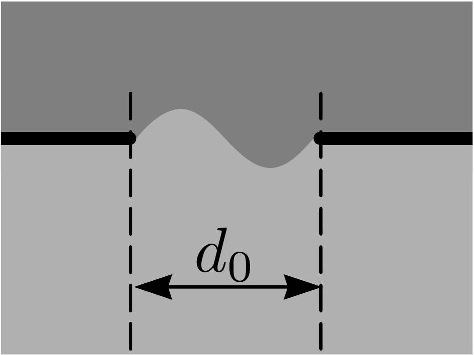
ii. (1 pt) Deformations can now happen along the $z$-axis. Since the length of slit is longer along that direction, the radius of curvature of the surface is smaller and so the surface tensions resists the weight of the upper liquid less. This means that the instabilities along $z$-axis start occurring much earlier than along the $x$-axis. The overall shape of the interface in the $y - z$-intersection stays the same as in the previous part, an approximately sinusoidal shape with a wavelength equalling to $l$.
(0.2 pts)

There must also be a bulge in the $x - y$-direction because otherwise there could not be any displaced liquid along the interface. This time there will only be one bulge, corresponding to either the upper or lower liquid pushing through to the other side.
(0.2 pts)

Notably the limiting factor for this type of instability still comes from the $x - y$-intersection, because the radius of curvature is greatest along that direction. Because the number of bulges is smaller than in the previous part, the radius of curvature is bigger and the force holding the liquid back must be smaller as well. This is consistent with the fact that this type of instability start occurring before the one described in the previous part.

Distance $l / 4$ corresponds to the peaks of the sinusoid-like shape, but with opposite amplitudes. This means that both cross-sections have a singular bulge, but in opposite directions.
(0.2 pts)

The sketches are given below. Notably, they can be interchanged because the shape in the $z$-direction can be flipped along the $z$-axis, swapping the cross-sections.
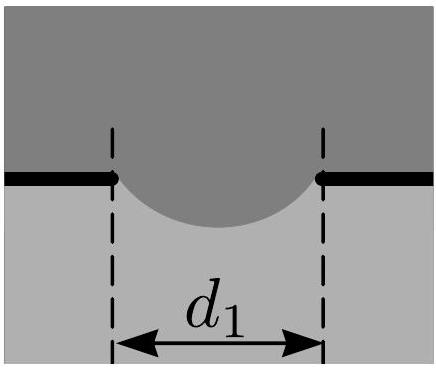
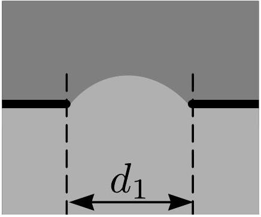
(0.4 pts)
iii. (1 pt) First, let us take the origin of the $x$-axis to be at the axis of symmetry (see figure) and the height of the interface from the horizontal symmetry axis be $y ( x )$. The boundary conditions are $y \left( \pm d _ { 1 } / 2 \right) = 0$.
(0.1 pts)

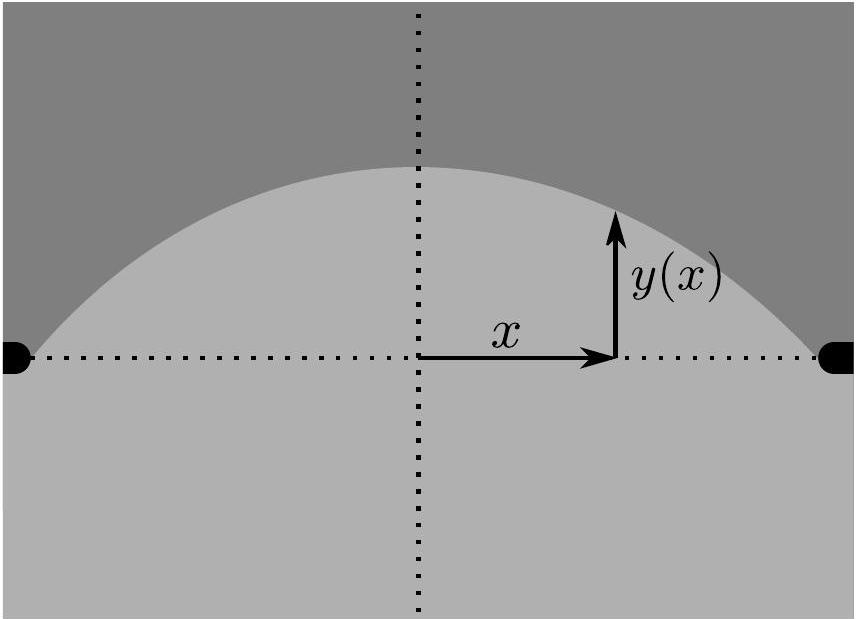
The interface will be slowly expanding due to the instability, but since the expansion is slow, we can treat it as being almost at an equilibrium. This means that the difference of pressures between the bottom and top side is compensated by the surface tension.
(0.1 pts)

The pressure of the top and bottom liquid are the same at $y = 0$, let that be $p _ { 0 }$. The pressure of the upper liquid at $y ( x )$ is then $p _ { 2 } ( x ) = p _ { 0 } - \rho _ { 2 } g y ( x )$ and of the lower liquid $p _ { 1 } ( x ) = p _ { 0 } - \rho _ { 1 } g y ( x )$. Thus, the difference in pressure at the interface is given by

$$
\begin{equation*}
\Delta p = p _ { 1 } ( x ) - p _ { 2 } ( x ) = \left( \rho _ { 2 } - \rho _ { 1 } \right) g y ( x ) . \tag{0.1pts}
\end{equation*}
$$

This is balanced by the surface tension. It is well-known that the difference in pressure from surface tension is given by $\Delta p = \sigma / r$. Note that there is no factor of 2 because the curving is only along one axis (the other is negligible due to $l \gg d _ { 1 }$ ). The balance gives

$$
\begin{equation*}
\left( \rho _ { 2 } - \rho _ { 1 } \right) g y ( x ) = \frac { \sigma } { r } . \tag{4}
\end{equation*}
$$

(0.1 pts)

Now we need to express $r$ in terms of $x$ and $y ( x )$. For this, let us consider the situation given below:

By considering two points separated horizontally by a distance $\mathrm { d } x$, we see that these points span an angle $\mathrm { d } \alpha$ as viewed from the centre of curvature of the interface, where $\mathrm { d } \alpha$ is the difference in the slopes (in radians) of the two points. Using small angle approximations, the slopes can be expressed as $\frac { \mathrm { d } y } { \mathrm {~d} x }$. From the figure and under the assumption that perturbations are very small, we see that $\mathrm { d } x = r \mathrm {~d} \alpha . \mathrm { d } \alpha$ can be found via the difference of slopes:

$$
\mathrm { d } \alpha = \left. \frac { \mathrm { d } y } { \mathrm {~d} x } \right| _ { x } - \left. \frac { \mathrm { d } y } { \mathrm {~d} x } \right| _ { x + \mathrm { d } x } = - \frac { \mathrm { d } ^ { 2 } y } { \mathrm {~d} x } = \frac { \mathrm { d } x } { r } .
$$

From here we get

$$
\begin{equation*}
\frac { 1 } { r } = - \frac { \mathrm { d } ^ { 2 } y } { \mathrm {~d} x ^ { 2 } } , \tag{0.2pts}
\end{equation*}
$$

and we can substitute this to (4) to get

$$
\begin{equation*}
\left( \rho _ { 2 } - \rho _ { 1 } \right) g y = - \sigma \frac { \mathrm { d } ^ { 2 } y } { \mathrm {~d} x ^ { 2 } } . \tag{0.1pts}
\end{equation*}
$$

This is a simple harmonic equation with a solution of the form

$$
\begin{equation*}
y ( x ) = A \sin ( k x ) + B \cos ( k x ) , \tag{0.1pts}
\end{equation*}
$$

with $k = \sqrt { \left( \rho _ { 2 } - \rho _ { 1 } \right) g / \sigma }$.
The bulge has only one peak, is symmetric with respect to $x = 0$, and spans half a wavelength through the length of the cross-section. Therefore,

$$
\begin{equation*}
\lambda = 2 d _ { 1 } = \frac { 2 \pi } { k } = \sqrt { \frac { \sigma } { \left( \rho _ { 2 } - \rho _ { 1 } \right) g } } , \tag{0.1pts}
\end{equation*}
$$

and we see that this uniquely identifies $d _ { 1 }$, the smallest width at which the instabilities start expanding:

$$
\begin{equation*}
d _ { 1 } = \frac { 1 } { 2 } \sqrt { \frac { \sigma } { \left( \rho _ { 2 } - \rho _ { 1 } \right) g } } . \tag{0.1pts}
\end{equation*}
$$

## Part C. Gravity surface waves (2 points)

We can measure the wavelength of the waves from the aerophoto. To get the best accuracy, we should count as many peaks as possible.
(0.4 pts)

We should also keep in mind that the peaks have to be counted along the line of motion of the boat since then the generated waves are not going at an angle with respected to the measured line.
(0.4 pts)

From the figure, we measure 24 peaks along the path spanning a distance of 2710 m.
(0.4 pts)

This gives $\lambda = 2710 \mathrm {~m} / 24 = 113 \mathrm {~m}$ and the speed of the boat can be expressed as

$$
\begin{equation*}
v = \sqrt { \frac { g \lambda } { 2 \pi } } = \sqrt { \frac { 9.81 \mathrm {~m} / \mathrm { s } ^ { 2 } \cdot 113 \mathrm {~m} } { 2 \pi } } \approx 13 \mathrm {~m} / \mathrm { s } \approx 48 \mathrm {~km} / \mathrm { h } . \tag{0.8pts}
\end{equation*}
$$

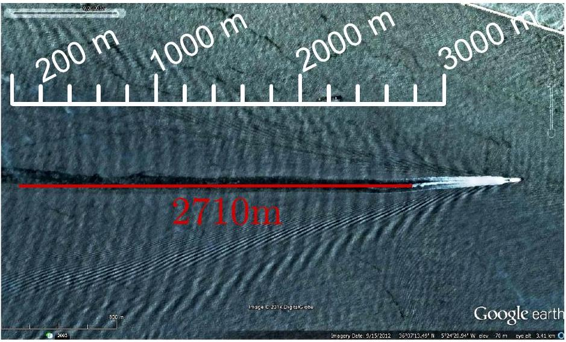
