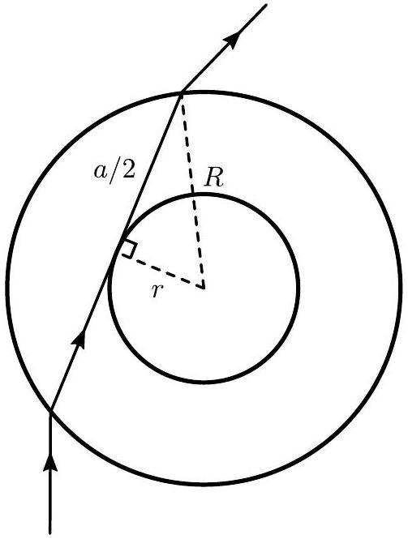
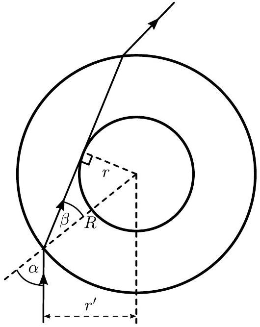
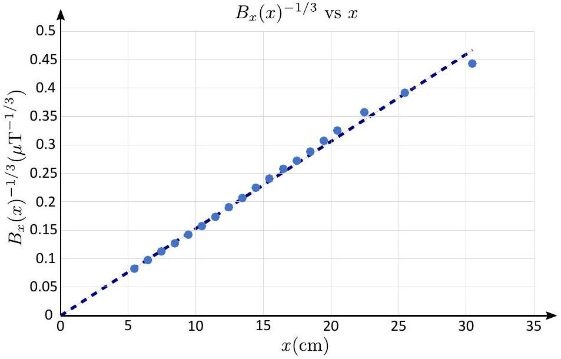

## The $\mathbf { 4 } ^ { \text {th } }$ Gulf Physics Olympiad - Experimental Competition Solutions   Dammam, Saudi Arabia - March $15 { } ^ { \text {th } } 2022$

## Error analysis

In what follows, any time errors of the mean of tabulated data are calculated, standard deviation is used. Assuming there are $N$ data points of the form $x _ { i } , i \in \{ 1 , \ldots , N \}$, the mean is

$$
x _ { \mathrm { avg } } = \frac { 1 } { N } \sum _ { i = 1 } ^ { N } x _ { i } ,
$$

and the standard deviation of the mean

$$
\Delta x _ { \mathrm { avg } } = \sqrt { \frac { \sum _ { i = 1 } ^ { N } \left( x _ { i } - x _ { \mathrm { avg } } \right) ^ { 2 } } { N ( N - 1 ) } } .
$$

When dealing with data points with their individual uncertainties coming from the measuring instrument (for the caliper, it's for example 0.2 mm), those should be added on top of the standard deviation of the mean in quadrature.

For error propagation through equations, Pythagoran rule for adding errors in quadrature is used (alternatively, one could use min-max but for lower accuracy). In general, when you have a variable $y$ be a function of variables $x _ { i } , i \in \{ 1 , \ldots N \}$ with errors $\Delta x _ { i }$, then the error of $y$ is given by

$$
\Delta y = \sqrt { \sum _ { i = 1 } ^ { N } \left( \frac { \partial y } { \partial x _ { i } } \right) ^ { 2 } \Delta x _ { i } ^ { 2 } } .
$$

## Penalising errors and accuracy

- Any time the methods used in finding the errors is not specified or isn't clear from the solution, all the marks for error analysis are to be deducted.
- For most numerical values, the grading scheme specifies an interval for which the student is awarded full marks. If the numerical value is outside of the range, some points are deducted, depending on how far off the value is. In general, if the answers is off by $\Delta y$ from the true value and the full point interval half-width is $\Delta y _ { v } < \Delta y$, then the student gets a fraction of $\Delta y _ { v } / \Delta y$ of the full marks for the numerical value. This fraction starts from 1 when $\Delta y = \Delta y _ { v }$ and decays to 0 as the error tends to infinity.

## Problem E1. Cylinder in cylinder (20 points) Part A. Geometrical characteristics (5 points)

1. (2 pts) We can find the total volume by using the caliper to measure the base diameter $2 R$ and the total height $H$ of the cylinder via

$$
\begin{equation*}
V = \pi R ^ { 2 } H . \tag{0.4pts}
\end{equation*}
$$

The values were measured to be

| $i$ | $2 R ( \mathrm {~mm} )$ | $H ( \mathrm {~mm} )$ |
| :--- | :--- | :--- |
| 1 | 25.2 | 30.4 |
| 2 | 25.0 | 30.5 |
| 3 | 25.3 | 30.5 |
| 3 | 25.1 | 30.4 |
| 3 | 25.3 | 30.5 |

1 diameter measurement (0.3/0.5 pts)
2 diameter measurements (0.4/0.5 pts)
3 or more diameter measurements (0.5/0.5 pts)
1 or more height measurement (0.3/0.3 pts)
Each measurement carries its own uncertainty of that of a caliper $\Delta l = 0.2 \mathrm {~mm}$. Based on this, we calculate $R =$ $( 12.6 \pm 0.1 ) \mathrm { mm } , H = ( 30.5 \pm 0.2 ) \mathrm { mm }$ and $V = ( 15.2 \pm 0.2 ) \mathrm { ml }$ value within $[ 14.8 \mathrm { ml } , 15.6 \mathrm { ml } ]$ (0.4 pts) error (0.4 pts)
2. (1 pt) The height is best measured using a caliper by either making markings on the surface of the cylinder corresponding to the perpendiculars of the ends of the magnet, or by measuring it from far away. Either way, the goal is to remove the effects of parallax when measuring the height of the cylinder. The following measurements were made

| $i$ | $h ( \mathrm {~mm} )$ |
| :--- | :--- |
| 1 | 9.7 |
| 2 | 9.5 |
| 3 | 9.4 |

1 measurement (0.3/0.5 pts)
2 measurements (0.4/0.5 pts)
3 or more measurements (0.5/0.5 pts)
The average height is found to be $h = ( 9.5 \pm 0.2 ) \mathrm { mm }$. value within $[ 9.1 \mathrm {~mm} , 10.0 \mathrm {~mm} ]$ (0.3 pts) error (0.2 pts)
3. (2 pts) A potential method would be to observe the light ray that barely touches the edge of the magnet, (0.4 pts) and make markings where the ray enters and exits the cylinder. This works, because the markings define a chord whose distance from the centre is the radius of the magnet $r = d / 2$. Hence, the distance between the markings $a$ relates to $r$ and $R$ via Pythagoras theorem via $r = \sqrt { R ^ { 2 } - a ^ { 2 } / 4 }$ or in other words,

$$
\begin{equation*}
d = \sqrt { 4 R ^ { 2 } - a ^ { 2 } } . \tag{0.6pts}
\end{equation*}
$$

Figure 1: Optics of the cylinder

We make the following measurements for $a$ :

| $i$ | $a ( \mathrm {~mm} )$ |
| :--- | :--- |
| 1 | 22.2 |
| 2 | 22.5 |
| 3 | 21.8 |

1 measurement (0.3/0.5 pts)
2 measurements (0.4/0.5 pts)
3 or more measurements (0.5/0.5 pts)

This yields $a = ( 22.2 \pm 0.3 ) \mathrm { mm }$ such that $d = ( 12.0 \pm 0.7 ) \mathrm { mm }$. value within $[ 11.0 \mathrm {~mm} , 13.0 \mathrm {~mm} ]$ (0.3 pts)
error (0.2 pts)

Part B. Mechanical characteristics (3 points)

1. (2 pts) We can make a makeshift scale by attaching the cylinder to a rubber thread and measuring how much it extends. The force exerted by the thread is then equal to the Archimedes force of the cylinder and proportional to $\tau \left( l / l _ { 0 } \right.$ given in the problem statement.

Knowing the water density, it would satisfy us to measure the length of the attached thread when the cylinder is submerged $l _ { w }$, when it's not $l _ { a }$ and finally when it's at rest (cylinder isn't attached), $l _ { 0 }$.
(0.3 pts)

Using Archimedes' law, the quantities then satisfy

$$
\begin{align*}
k \tau \left( l _ { a } / l _ { 0 } \right) & = V \rho _ { \mathrm { cy } 1 } g \\
k \tau \left( l _ { w } / l _ { 0 } \right) & = V \left( \rho _ { \mathrm { cyl } } - \rho _ { w } \right) g \tag{0.4pts}
\end{align*}
$$

where $k$ is a constant and the left hand side corresponds to the tension force of the rubber threads. Thus,

$$
\begin{equation*}
\rho _ { \mathrm { cyl } } = \rho _ { w } \frac { \tau \left( l _ { a } / l _ { 0 } \right) } { \tau \left( l _ { a } / l _ { 0 } \right) - \tau \left( l _ { w } / l _ { 0 } \right) } . \tag{0.2pts}
\end{equation*}
$$

We proceed to make one set of measurements (as estimating uncertainties isn't necessary) and get $l _ { 0 } = 135 \mathrm {~mm}$, $l _ { a } = 303 \mathrm {~mm} , l _ { w } = 185 \mathrm {~mm}$.
Thus, we calculate $\tau \left( l _ { a } / l _ { 0 } \right) = 0.556 , \tau \left( l _ { w } / l _ { 0 } \right) = 0.232$ and so $\rho _ { \text {cyl } } = 1720 \mathrm {~kg} / \mathrm { m } ^ { 3 }$.

$$
\begin{equation*}
\text { value within } \left[ 1620 \mathrm {~kg} / \mathrm { m } ^ { 3 } , 1820 \mathrm {~kg} / \mathrm { m } ^ { 3 } \right] \tag{0.3pts}
\end{equation*}
$$

2. (0.5 pts) The total mass of the cylinder is simply found as $m _ { \text {cyl } } = V \rho _ { \text {cyl } } = 26.1 \mathrm {~g}$.
formula (0.3 pts) value within [25.0 g, 27.1 g] (0.2 pts)
3. (0.5 pts) We can express the total mass of the cylinder as a sum of the mass of the magnet and the glass surrounding the magnet:

$$
\begin{equation*}
m _ { \mathrm { cyl } } = h \pi r ^ { 2 } \rho _ { m } + \left( H \pi R ^ { 2 } - h \pi r ^ { 2 } \right) \rho _ { g } . \tag{0.2pts}
\end{equation*}
$$

Thus, glass' density is

$$
\rho _ { g } = \frac { \rho _ { \mathrm { cyl } } H R ^ { 2 } - \rho _ { m } h r ^ { 2 } } { H R ^ { 2 } - h r ^ { 2 } } = 1280 \mathrm {~kg} / \mathrm { m } ^ { 3 } .
$$

formula (0.1 pts)
value within $\left[ 1130 \mathrm {~kg} / \mathrm { m } ^ { 3 } , 1430 \mathrm {~kg} / \mathrm { m } ^ { 3 } \right]$ (0.2 pts)
Part C. Optical properties (5 points)

1. (2.5 pts) The most direct method would be to measure how much the magnet appears to be bigger than its actual width.

Showing or stating the method or idea in text or graphically (0.5 pts)

The optics of this is shown on figure 2. On the figure, $r ^ { \prime }$ is the apparent radius of the magnet when the cylinder is observed from far away. In practice, one could measure the apparent diameter $d ^ { \prime } = 2 r ^ { \prime }$ using a caliper and a marker.

Figure 2: Detailed optics of the cylinder

Carrying out the method or idea correctly (0.25 pts)
From the figure, we work out from Snell's law that $\sin \alpha =$ $n _ { o } \sin \beta$, but from right triangles $\sin \beta = r / R$ and $\sin \alpha = r ^ { \prime } / R$. Hence, $n _ { o } = r ^ { \prime } / r = d ^ { \prime } / d$.

Stating and applying Snell's law correctly (0.5 pts)
Tabulated measurements of the apparent width are shown below

| $i$ | $d ^ { \prime } ( \mathrm { mm } )$ |
| :--- | :--- |
| 1 | 18.3 |
| 2 | 18.5 |
| 3 | 18.8 |

3 or more measurements (0.3 pts) with units (0.2 pts)

Averaging, $d ^ { \prime } = ( 18.5 \pm 0.4 ) \mathrm { mm }$
average value of $d$ with errors (0.25 pts) and so $n _ { o } = 1.54$ with an associated error of $\Delta n _ { o } = 0.09$.
value within [1.50, 1.58] (0.25 pts)
error (0.25 pts)
2. (1.5 pts) Constructing the optical system described in the task statement, we make the following measurements

| $i$ | $L ( \mathrm {~mm} )$ |
| :--- | :--- |
| 1 | 62.7 |
| 2 | 61.1 |
| 3 | 62.0 |
| 4 | 62.6 |
| 5 | 62.2 |

3 or more measurements (0.3 pts) with units (0.2 pts)

Averaging, we find $L = 62.1 \mathrm {~mm}$ with an error of $\Delta L = 0.5 \mathrm {~mm}$.

Value with units within $[ 61.1 \mathrm {~mm} , 63.1 \mathrm {~mm} ]$ (0.5 pts) Error (0.5 pts)
3. (1 pt) Starting from the formula

$$
\left( \frac { 1 } { L - D } - \frac { n _ { o } - 1 } { D } \right) \left( \frac { n _ { c } d } { n _ { c } - n _ { o } } - D \right) = n _ { o }
$$

we find

$$
n _ { c } = n _ { 0 } \left( 1 - \frac { d } { D + \frac { n _ { 0 } } { \frac { 1 } { L - D } - \frac { n _ { 0 } - 1 } { D } } } \right) ^ { - 1 } = 1.60 .
$$

Starting from previous equation of $n _ { 0 }$ and showing the steps of algebraic manipulation to arrive at $n _ { c }$ (0.7 pts) value within [1.55, 1.65] (0.3 pts)

## Part D. Magnetic properties (7 points)

1. (0.5 pts) We measure $\mathcal { E } = 3.15 \mathrm {~V}$. Any value above 3.20 V or 3.00V will give 0 points. Missing units: subtract 0.2 points. 2. (1 pt) We measure $V _ { 1 } = 1.4 \mathrm { mV }$ and $V _ { 2 } = - 2.9 \mathrm { mV }$. (0.2 pts)
(No points are awarded if only $V _ { 1 }$ or $V _ { 2 }$ are measured or voltages readings are incorrect. Reading is judged to be incorrect if the corresponding magnetic field (when calculated correctly) would be greater than $50 \mu \mathrm {~T}$.)

The voltage is affected by the offset voltage and the Earth's magnetic field $B _ { E z }$. The Earth's magnetic field influences the reading by a voltage offset $V _ { E z } = B _ { E z } / a$, where $a$ is a constant. We know that if the battery voltage were to be 3 V, then each millivolt is $10 \mu \mathrm {~T}$. Our battery increases the scaling by a factor of $\mathcal { E } / 3 \mathrm {~V}$. In other words, to convert from volts to microteslas, we multiply our voltage through by $a = 10 \mu \mathrm {~T} / \mathrm { V } \cdot \mathcal { E } / 3 \mathrm {~V} = 10.5 \mu \mathrm {~T} / \mathrm { V }$.

Taking all this together, we have $V _ { 1 } = V _ { 0 } + B _ { E z } / a$ and $V _ { 2 } = V _ { 0 } - a B _ { E z }$ and so $V _ { 0 } = \left( V _ { 1 } + V _ { 2 } \right) / 2$, (0.2 pts)

$$
B _ { E z } = \left( V _ { 1 } - V _ { 2 } \right) a / 2 .
$$

(0.1 pts)
Numerically we get $V _ { 0 } = - 0.8 \mathrm { mV }$, (0.1 pts)

$$
B _ { E z } = \left( V _ { 1 } - V _ { 2 } \right) a / 2 = 23 \mu \mathrm {~T} .
$$

(0.4 pts)

For this magnetic field value, no points are given if its calculation has mistakes (i.e. it does not correspond to the reported voltage values). If $a = 10.0 \mu \mathrm {~T} / \mathrm { V }$ was used even though the voltage was not 3.00V, 0.2 point will be subtracted.
3. (2.5 pts) We measure the sensor voltage throughout the full measurement range, from the end of the ruler at 30 cm up to when voltage reaches 300 mV. To convert to magnetic field, we first offset the measured voltage $V$ to remove the bias and the contribution from the magnetic field. This corresponds to subtracting $V _ { 1 }$ due to the orientation of the sensor. Finally, we divide by $a$ to get the magnetic field, i.e. $B _ { x } ( x ) = \left( V - V _ { 1 } \right) / a$. The tabulated data is given below.

| $l ( \mathrm {~cm} )$ | $x ( \mathrm {~cm} )$ | $V ( \mathrm { mV } )$ | $B _ { x } ( x ) ( \mu \mathrm { T } )$ | $B _ { x } ( x ) ^ { - 1 / 3 } \left( \mu \mathrm {~T} ^ { - 1 / 3 } \right)$ |
| :--- | :--- | :--- | :--- | :--- |
| 30 | 30.5 | 2.5 | 11.6 | 0.442 |
| 25 | 25.5 | 3.0 | 16.8 | 0.390 |
| 22 | 22.5 | 3.5 | 22.1 | 0.357 |
| 20 | 20.5 | 4.2 | 29.4 | 0.324 |
| 19 | 19.5 | 4.7 | 34.7 | 0.307 |
| 18 | 18.5 | 5.4 | 42.0 | 0.288 |
| 17 | 17.5 | 6.2 | 50.4 | 0.271 |
| 16 | 16.5 | 7.0 | 58.8 | 0.257 |
| 15 | 15.5 | 8.3 | 72.5 | 0.240 |
| 14 | 14.5 | 9.9 | 89.3 | 0.224 |
| 13 | 13.5 | 12.3 | 115 | 0.206 |
| 12 | 12.5 | 15.4 | 147 | 0.189 |
| 11 | 11.5 | 19.9 | 194 | 0.173 |
| 10 | 10.5 | 26.2 | 260 | 0.156 |
| 9 | 9.5 | 35.4 | 357 | 0.141 |
| 8 | 8.5 | 48.5 | 495 | 0.126 |
| 7 | 7.5 | 70.0 | 720 | 0.112 |
| 6 | 6.5 | 108 | 1120 | 0.096 |
| 5 | 5.5 | 178 | 1850 | 0.081 |

$l$ is the distance from the face of the magnet and hence, to get the distance from the centre of the magnet $x$, we need to offset it by half of the thickness of the magnet $h / 2 = 0.5 \mathrm {~cm}$. The table features an additional column that's used in the next subtask.
For each voltage value until 10th data point: (0.1 pts)
Datapoints at $l < 4 \mathrm {~cm}$ are not counted
For each calculated $B _ { x }$ value until 10th data point: (0.1 pts)
Calculations at $l < 4 \mathrm {~cm}$ are not counted
For a reading taken at $4 \mathrm {~cm} \leq l < 6 \mathrm {~cm}$ (0.1 pts)
For a reading taken at 6 cm $\leq l < 8 \mathrm {~cm}$ (0.1 pts)
For a reading taken at $l > 25 \mathrm {~cm}$ (0.1 pts)
For a reading taken at 25 cm $\geq l > 20 \mathrm {~cm}$ (0.1 pts)
For a reading taken at 20 cm $\geq l > 15 \mathrm {~cm}$ (0.1 pts)

Marks are not given for obviously wrong voltage values and for $B _ { x }$ values which differ from correct values by more than $20 \%$ plus $10 \mu \mathrm {~T}$.

If offset is not subtracted, multiply the score for taken readings by 0.5.

4. (2.5 pts)

If the magnetic field is given by

$$
B _ { x } ( x ) = \frac { \mu _ { 0 } } { 2 \pi } \frac { p } { x ^ { 3 } } ,
$$

we can linearize it in many different ways, but a convenient way would be to consider $B _ { x } ( x ) ^ { - 1 / 3 }$ vs $x$ as that maintains the linear spacing of the data points. In that case,

$$
B _ { x } ( x ) ^ { - \frac { 1 } { 3 } } = \sqrt [ 3 ] { \frac { 2 \pi } { \mu _ { 0 } p } } x = A x
$$

where the slope gives us $p$ via $p = 2 \pi / \left( \mu _ { 0 } A ^ { 3 } \right)$. We calculate $B _ { x } ( x ) ^ { - 1 / 3 }$ and plot it, shown below.

From the graph, we measure $A = 0.0153 \mu \mathrm {~T} ^ { - 1 / 3 } \mathrm {~cm} ^ { - 1 } =$ $153 \mathrm {~T} ^ { - 1 } \mathrm {~m} ^ { - 1 }$ so

$$
p = \frac { 2 \pi } { \mu _ { 0 } A ^ { 3 } } = 1.40 \mathrm {~A} \mathrm {~m} ^ { 2 } .
$$

Suitably chosen quantities on axis (which makes the graph linear)
(0.5 pts)

For each data point up to the tenth, calculation of the value for the vertical axis with correct plotting
(0.1 pts)

If points are not marked on a plot, only half marks are given. If $B _ { x }$ values are directly plotted, only half marks are given.
Finding the slope of the linear part of the graph
(0.3 pts)

Numerical calculation of $p$
(0.2 pts)
5. (0.5 pts) From the definition, magnetization is

$$
J = \frac { p } { \pi r ^ { 2 } h } = 1.30 \times 10 ^ { 6 } \mathrm { Am } ^ { - 1 } .
$$

Correct value $1.1 \times 10 ^ { 6 } \mathrm { Am } ^ { - 1 } J \leq J \leq 1.4 \times 10 ^ { 6 } \mathrm { Am } ^ { - 1 }$
(0.5 pts)
