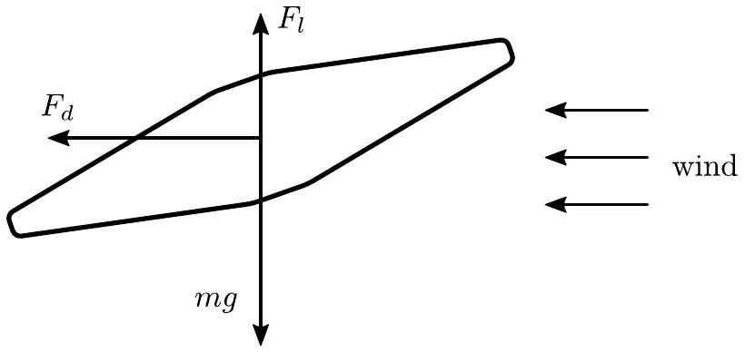

## Problem T3. Sports (10 points) Part A. Hammer throw (4 points)

1. (0.5 pts) We can neglect air drag in this part. The hammer is launched at an angle $\theta = 45 ^ { \circ }$ and travels a distance of $s$. If the starting speed is $v _ { 0 }$, the airtime can be expressed as

$$
\begin{equation*}
t = \frac { 2 v _ { 0 } \sin \theta } { g } = \frac { \sqrt { 2 } v _ { 0 } } { g } . \tag{0.2pts}
\end{equation*}
$$

The horizontal component of the velocity is constant and equal to

$$
\begin{equation*}
v _ { x } = v _ { 0 } \cos \theta = \frac { v _ { 0 } } { \sqrt { 2 } } . \tag{0.1pts}
\end{equation*}
$$

The travelled distance is thus

$$
\begin{equation*}
d = v _ { x } t = \frac { v _ { 0 } ^ { 2 } } { g } \tag{0.1pts}
\end{equation*}
$$

and so

$$
\begin{equation*}
v _ { 0 } = \sqrt { g d } = 28.0 \mathrm {~m} / \mathrm { s } . \tag{0.1pts}
\end{equation*}
$$

2. (1 pt) Before being released, the hammer moves on a circular trajectory of radius $r = L + l = 2.22 \mathrm {~m}$.
This means that the hammer experiences a centripetal acceleration of $v _ { 0 } ^ { 2 } / r$.

This is provided by the tension force $F _ { t }$.
The tension force is compensated by the athlete pulling from the grip. Note that the gravitational force $m g$ is pointing downwards and hence, is perpendicular to the steel wire which is horizontal at the moment when the hammer is released. So the gravitational force cancels out from the force balance projected to the direction of the wire. Hence, the force exerted by the athlete is equal to the centripetal force.
So, we obtain

$$
\begin{equation*}
F _ { t } = \frac { m v _ { 0 } ^ { 2 } } { r } = m g \left( \frac { d } { r } \right) \tag{0.3pts}
\end{equation*}
$$

which yields numerically 2.57 kN.
3. (0.5 pts) We can calculate the drag force from the formula $F _ { D } = 0.24 A \rho _ { a } v _ { 0 } ^ { 2 }$. The radius of the hammer $R$ can be found from the expression for its mass $m = 4 \pi R ^ { 3 } \rho _ { v } / 3$. Hence,

$$
\begin{equation*}
R = \left( \frac { 3 m } { 4 \pi \rho _ { v } } \right) ^ { \frac { 1 } { 3 } } = 6.03 \mathrm {~cm} \tag{0.2pts}
\end{equation*}
$$

and so $A = \pi R ^ { 2 } = 0.0114 \mathrm {~m} ^ { 2 }$ and

$$
\begin{equation*}
F _ { D 0 } = 0.24 A \rho _ { a } v _ { 0 } ^ { 2 } = 2.64 \mathrm {~N} . \tag{0.2pts}
\end{equation*}
$$

4. (1 pt) There are two main approaches. The more reliable one is using energy arguments, the second one using momentum. Both approaches start by noting that the air drag has minimal impact on the velocities and falling positions of the hammer. As such, we can take the hammer's trajectory to be parabolic in the first order, and calculate the second order corrections drag force would have based on the average drag air imparts on the hammer.

One critical thing to note is that we calculated $v _ { 0 }$ ignoring air drag. In reality, the starting speed is a bit bigger to account for drag, but the effect of this on the quantities that this and the following sub-task ask for is negligible. Hence, we still consider the parabolic trajectory starting with speed $v _ { 0 }$ and spanning a horizontal distance of $s$ (this doesn't need to be explicitly mentioned to get full marks).

Approach 1. Energy considerations:
From conservation of energy, the work done by air drag corresponds to change in the kinetic energy between starting and final positions.
Hence, if we can estimate the performed work, we get an estimate for the change in speed. In general, the work done in a segment of length $\Delta l$ is $\Delta W = F _ { D } \Delta l$. The total work done can therefore be approximated as the product of the average drag force and the total length of the parabola. (0.1 pts)

The speed of the hammer starts off at $v _ { 0 }$, then decreases to $v _ { 0 } / \sqrt { 2 }$ at the top of the parabola, and then increases back to $v _ { 0 }$ when it lands. This means the drag force goes from $F _ { D 0 }$ to $F _ { D 0 } / 2$ and back to $F _ { D 0 }$. The average can be estimated as $3 F _ { D 0 } / 4$.

The length of the parabola can be estimated by noting that the actual length of a small segment is $\sqrt { 2 }$ times bigger per its horizontal projection at the sides of the parabola, and equal to the projection at the peak. The length of the parabola is then roughly $( 1 + \sqrt { 2 } ) / 2$ times the horizontal projection, $s$. (0.2 pts)

Putting all this together,

$$
\begin{equation*}
\Delta W \approx \frac { 3 } { 8 } ( 1 + \sqrt { 2 } ) F _ { D 0 } d = 191 \mathrm {~J} . \tag{0.1pts}
\end{equation*}
$$

The conservation of energy reads $m v _ { 0 } ^ { 2 } / 2 = m v _ { 1 } ^ { 2 } / 2 + \Delta W$, where $v _ { 1 }$ is the final speed.
Therefore,

$$
\begin{equation*}
\Delta v \approx v _ { 0 } - v _ { 1 } = v _ { 0 } - \sqrt { v _ { 0 } ^ { 2 } - \frac { 2 \Delta W } { m } } = 0.96 \mathrm {~m} / \mathrm { s } . \tag{0.1pts}
\end{equation*}
$$

Approach 2. Momentum considerations:
The airtime of the hammer is $t \approx \sqrt { 2 } v _ { 0 } / g = 4.04 \mathrm {~s}$.
(0.2 pts)

To a decent approximations, we can decompose the air drag's action into separate horizontal and vertical components. As

such, the horizontal drag at the beginning and at the end of the flight is $0.24 A \rho _ { a } \left( v _ { 0 } \right) ^ { 2 } / \sqrt { 2 } = F _ { D } / \sqrt { 2 }$, and at the middle of the flight $- 0.24 A \rho _ { a } \left( v _ { 0 } / \sqrt { 2 } \right) ^ { 2 } = F _ { D } / \sqrt { 2 }$. We can estimate the average horizontal drag either as the arithmetic average of these two magnitudes, or just take the value $F _ { D } / 2$ from the middle of the flight, because the hammer spends near the maximum height relatively more time than near the ground level.
(0.2 pts)

The drag in the vertical directions is smaller as it starts with the same value $F _ { D } / \sqrt { 2 }$, but at the middle of the flight vanishes ( $v _ { y }$ goes from $v _ { 0 } / \sqrt { 2 }$ to $- v _ { 0 } / \sqrt { 2 }$, passing through 0). We can estimate its average value as the arithmetic average of the initial/final value and the value at the middle of the flight, so $F _ { D } / 4$.
(0.2 pts)

As such, the changes in the horizontal and vertical velocity components can be estimated as $\Delta v _ { x } = - F _ { D } t / ( 2 m ) =$ $- 0.73 \mathrm {~m} / \mathrm { s }$ and $\Delta v _ { y } = - F _ { D } t / ( 4 m ) = - 0.37 \mathrm {~m} / \mathrm { s }$.
(0.2 pts)

The total change in speed is then

$$
\begin{equation*}
\Delta v \approx v _ { 0 } - \sqrt { \left( \frac { v _ { 0 } } { \sqrt { 2 } } - \Delta v _ { x } \right) ^ { 2 } + \left( \frac { v _ { 0 } } { \sqrt { 2 } } - \Delta v _ { y } \right) ^ { 2 } } = 0.77 \mathrm {~m} / \mathrm { s } \tag{0.2pts}
\end{equation*}
$$

Exact answer: $\Delta v = 0.814 \mathrm {~m} / \mathrm { s }$.
5. (1 pt)

One might naturally extend the two approaches in the previous subtask. However, there's a crucial difficulty with using the average horizontal deceleration and that is that the flight duration changes slightly, providing a comparable contribution to the change in length as the horizontal deceleration. This usually results in an error that's bigger than 30 \%. A more accurate approach is to think in terms of the spans of parabolas with different starting speeds, outlined below.

As mentioned in the previous subtask, we're approximating the change in throwing length as the distance between the landing positions of when the hammer is thrown with speed $v _ { 0 }$ with and without drag. Without drag, it flies a distance $s$, but with drag it falls somewhere in-between two points defined by where the hammer falls without drag if the starting speeds were $v _ { 0 }$ and $v _ { 1 }$. We can roughly take this to be in-between the two positions. Hence, with drag the hammer flies a distance of $d ^ { \prime } \approx \left( v _ { 0 } ^ { 2 } / g + v _ { 1 } ^ { 2 } / g \right) / 2$
(0.8 pts)
and so

$$
\begin{equation*}
\Delta x = d - d ^ { \prime } \approx \frac { v _ { 0 } ^ { 2 } - v _ { 1 } ^ { 2 } } { 2 g } = 2.68 \mathrm {~m} . \tag{0.2pts}
\end{equation*}
$$

Exact answer: $\Delta x = 2.39 \mathrm {~m}$.
Part B. Discus throw (1 points)

Even though air drag is stronger during headwind, the wind serves to provide a lift force to the disc, giving it prolonged air time and allowing it to fly farther.
(0.5 pts)
(If additionally to the lift force, other arguments are mentioned, e.g. propelling by rotation, subtract 0.2)

A qualitative force diagram is shown below. The diagram should highlight a tilted discus being pushed against by a headwind.
(0.2 pts)

It should also show gravity, drag and lift force acting on the disc (or instead of the drag and lift, the resultant drag force which is pointed at a more vertical angle than usual). (0.3 pts)
(If any force in the direction of motion is shown, subtract 0.1)

Part C. Pole vault (5 points)

1. (0.5 pts) The pole stores its elastic energy in bending deformation, i.e. the more it bends, the more elastic energy is stored.
(0.3 pts)

From the figure, we see that positions 6 and 7 have the most deformed pole. In 7, it's slightly more bent, as can be seen from how the end points of the poles are closer together. Hence, the answer is 7.
(0.2 pts)
2. (2 pts) We can determine the time interval from the fact that in-between positions 9 and 20, the man is in free-fall. Specifically, the $y$-coordinate of the centre of mass follows a quadratic $y = y _ { 0 } + v _ { y 0 } t - g t ^ { 2 } / 2$.
(0.5 pts)

We measure the $y$-coordinates at positions 16, 18, and 20 to be $y _ { 16 } = 593.0 \mathrm {~cm} , y _ { 18 } = 441.4 \mathrm {~cm} , y _ { 20 } = 183.7 \mathrm {~cm}$.
(0.6 pts)

The time difference between two consecutive recorded points is $\Delta t = 2 \tau$.
(0.1 pts)

Subtracting $y _ { 16 }$, we get

$$
\begin{align*}
& y _ { 18 } - y _ { 16 } = v _ { y 0 } \Delta t - \frac { g \Delta t ^ { 2 } } { 2 } \\
& y _ { 20 } - y _ { 16 } = 2 v _ { y 0 } \Delta t - 2 g \Delta t ^ { 2 } \tag{0.4pts}
\end{align*}
$$

We can solve this by plugging $v _ { y 0 }$ from one equation to the other. Solving the resulting equation gives us

$$
\begin{equation*}
\tau = \frac { \Delta t } { 2 } = \frac { 1 } { 2 } \sqrt { \frac { 2 y _ { 18 } - y _ { 20 } - y _ { 16 } } { g } } = 0.165 \mathrm {~s} . \tag{0.4pts}
\end{equation*}
$$

3. (0.5 pts) We can estimate the speed of the man as the distance covered between positions 1 and 3 divided by $2 \tau$. (0.3 pts)

From the figure, we measure $l _ { 13 } = 295.3 \mathrm {~cm}$ and so $v _ { 2 } \approx$ $l _ { 13 } / ( 2 \tau ) = 8.9 \mathrm {~m} / \mathrm { s } = 32.2 \mathrm {~km} / \mathrm { h }$.
4. (1 pt) We can find this from conservation of energy. For one, there is no work being done by the pole as it starts and ends completely straight (and has negligible kinetic energy). Further, the energy at position 12 is the same as in 16 (because the man is in free-fall). The conservation of energy then reads

$$
\begin{equation*}
\frac { m v _ { 3 } ^ { 2 } } { 2 } + m g y _ { 3 } + W = \frac { m v _ { 16 } ^ { 2 } } { 2 } + m g y _ { 16 } . \tag{0.2pts}
\end{equation*}
$$

From the figure, we measure $y _ { 3 } = 113.9 \mathrm {~cm} , x _ { 16 } = 21.1 \mathrm {~cm}$ (with respect to some arbitrary reference point), $x _ { 18 } = 66.3 \mathrm {~cm}$. (0.2 pts) From part ii., we calculate $v _ { y 0 } = v _ { y 16 } = \left( y _ { 18 } - y _ { 16 } + \right.$ $\left. g \Delta t ^ { 2 } / 2 \right) / \Delta t = - 3.00 \mathrm {~m} / \mathrm { s }$.
(0.2 pts)

We also approximate the horizontal component of the velocity at 16 as $v _ { x 16 } \approx \left( x _ { 18 } - x _ { 16 } \right) / ( 2 \tau ) = 1.37 \mathrm {~m} / \mathrm { s }$ and $v _ { 3 } \approx v _ { 2 }$. (0.2 pts)

We can finally manipulate the conservation of energy to

$$
\begin{align*}
W & = \frac { m v _ { 16 } ^ { 2 } } { 2 } + m g y _ { 16 } - \frac { m v _ { 3 } ^ { 2 } } { 2 } - m g y _ { 3 } \\
& \approx \frac { m v _ { x 16 } ^ { 2 } + m v _ { y 16 } ^ { 2 } } { 2 } + m g y _ { 16 } - \frac { m v _ { 2 } ^ { 2 } } { 2 } - m g y _ { 3 } \\
& = 1.0 \mathrm {~kJ} \tag{0.2pts}
\end{align*}
$$

5. (1 pt) The maximal height of the centre of mass can be found following the measurements from part ii.
(0.2 pts)

From there we found that $y _ { 16 } = 5.930 \mathrm {~m} , v _ { y 16 } = - 3.00 \mathrm {~m} / \mathrm { s }$. Hence, the peak took place $\Delta t _ { 1 } = - v _ { y 16 } / g$ in the past and it has coordinates $y _ { p } = y _ { 16 } - v _ { y 16 } \Delta t _ { 1 } + g \Delta t _ { 1 } ^ { 2 } / 2 = y _ { 16 } + v _ { y 16 } ^ { 2 } / ( 2 g ) =$ 6.39 m.
(0.8 pts)
