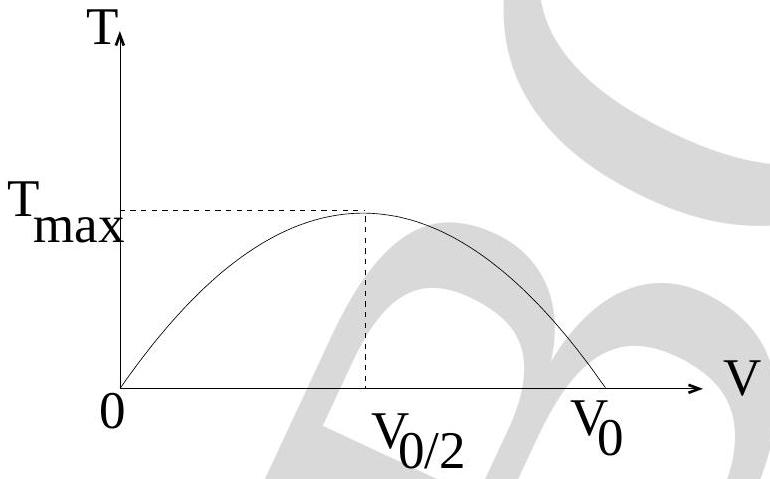
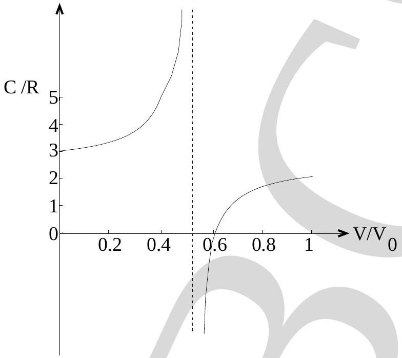

Name: $\_\_\_\_$ Roll No.P09 $\_\_\_\_$

## PART-A

| No. | (a) | (b) | (c) | (d) | Mark | No. | (a) | (b) | (c) | (d) | Mark |
| :--- | :--- | :--- | :--- | :--- | :--- | :--- | :--- | :--- | :--- | :--- | :--- |
| 1. | (a) | (b) | ● | (d) |  | 20. | (a) | (b) | (c) | ● |  |
| 2. | (a) | ● | (c) | (d) |  | 21. | (a) | (b) | ● | (d) |  |
| 3. | (a) | (b) | (c) | ● |  | 22. | ● | (b) | (c) | (d) |  |
| 4. | (a) | ● | (c) | (d) |  | 23. | (a) | (b) | ● | (d) |  |
| 5. | (a) | (b) | ● | (d) |  | 24. | (a) | (b) | ● | (d) |  |
| 6. | ● | (b) | (c) | (d) |  | 25. | (a) | (b) | ● | (d) |  |
| 7. | (a) | ● | (c) | (d) |  | 26. | ● | (b) | (c) | (d) |  |
| 8. | (a) | (b) | (c) | ● |  | 27. |  | (b) | (c) | (d) |  |
| 9. | (a) | ● | (c) | (d) |  | 28. | (a) | (b) | (c) | ● |  |
| 10. | (a) | (b) | ● | (d) |  | 29. | (a) | (b) | ● | (d) |  |
| 11. | (a) | (b) | ● | (d) |  | 30. | (a) | (b) |  | (d) |  |
| 12. | (a) | (b) | (c) | ● |  | 31. | (a) | (b) | (c) | ● |  |
| 13. | (a) | ● | (c) | (d) |  | 32. | (a) | (b) | ● | (d) |  |
| 14. | (a) | (b) | ● | (d) |  | 33. | (a) | (b) | (c) | ● |  |
| 15. | (a) | ● | (c) | (d) |  | 34. | ● | (b) | (c) | (d) |  |
| 16. | ● | (b) | (c) | (d) |  | 35. |  | (b) | (c) | (d) |  |
| 17. | ● | (b) | (c) | (d) |  | 36. |  | (b) | (c) | (d) |  |
| 18. | ● | (b) | (c) | (d) |  | 37. |  |  |  |  | dropped |
| 19. | (a) | (b) | (c) | ● |  | 38. | (a) | ● | (c) | (d) |  |

Subtotal : Subtotal :

Total :

Name: $\_\_\_\_$ Roll No.P09 $\_\_\_\_$

## PART - B

| No. | (a) | (b) | (c) | (d) | (e) | Mark | No. | (a) | (b) | (c) | (d) | (e) | Mark |
| :--- | :--- | :--- | :--- | :--- | :--- | :--- | :--- | :--- | :--- | :--- | :--- | :--- | :--- |
| 1. | (a) | (b) | ● | (d) | (e) |  | 11. | (a) | (b) | (c) | (d) | ● |  |
| 2. | ● | (b) | (c) | (d) | (e) |  | 12. | (a) | ● | (c) | (d) | (e) |  |
| 3. | (a) | (b) | (c) | ● | (e) |  | 13. | ● | (b) | (c) | (d) | (e) |  |
| 4. | (a) | ● | (c) | (d) | (e) |  | 14. | (a) | ● | (c) | (d) | (e) |  |
| 5. | (a) | (b) | (c) | (d) | ● |  | 15. | (a) |  | (c) | (d) | (e) |  |
| 6. | (a) | (b) | (c) | (d) | ● |  | 16. | (a) | (b) | ● | (d) | (e) |  |
| 7. | (a) | (b) | (c) | (d) | ● |  | 17. | (a) | (b) | (c) | ● | (e) |  |
| 8. | ● | (b) | (c) | (d) | (e) |  | 18. | (a) | (b) | ● | (d) | (e) |  |
| 9. | ● | (b) | (c) | (d) | (e) |  | 19. | ● | (b) | (c) | (d) | (e) |  |
| 10. | (a) | ● | (c) | (d) | (e) |  | 20. | (a) | (b) | ● | (d) | (e) |  |

Subtotal : Subtotal :

Total :

Name: $\_\_\_\_$ Roll No.P09 $\_\_\_\_$

## PART - C

Equivalent solutions may exist.

1. $$
\frac { P } { P _ { 0 } } + \frac { V } { V _ { 0 } } = 1 \left( \text { valid for } V < V _ { 0 } , P < P _ { 0 } \right)
$$
2. $$
T = \frac { P _ { 0 } V } { R } \left( 1 - \frac { V } { V _ { 0 } } \right)
$$
3. $$
\frac { d V } { d T } = \frac { R V _ { 0 } } { P _ { 0 } \left( V _ { 0 } - 2 V \right) }
$$
4. $$
T _ { \max } = \frac { P _ { 0 } V _ { 0 } } { 4 R }
$$
5. 
6. $$
C _ { V } = \frac { R } { \gamma - 1 }
$$

Name: $\_\_\_\_$ Roll No.P09 $\_\_\_\_$

7. $$
C = \frac { R } { \gamma - 1 } + \frac { \left( V _ { 0 } - V \right) R } { \left( V _ { 0 } - 2 V \right) }
$$
8. $$
\gamma = \frac { 3 } { 2 }
$$
9. $$
C = R \frac { \left( 3 - \frac { 5 V } { V _ { 0 } } \right) } { \left( 1 - \frac { 2 V } { V _ { 0 } } \right) }
$$
10. 
