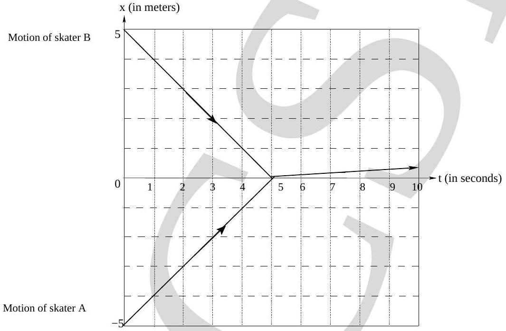
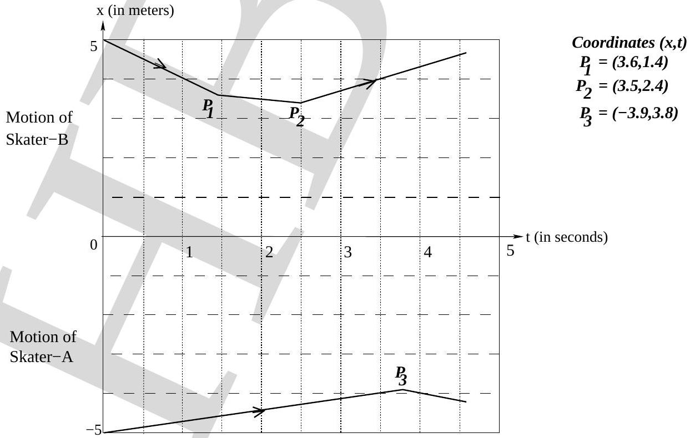
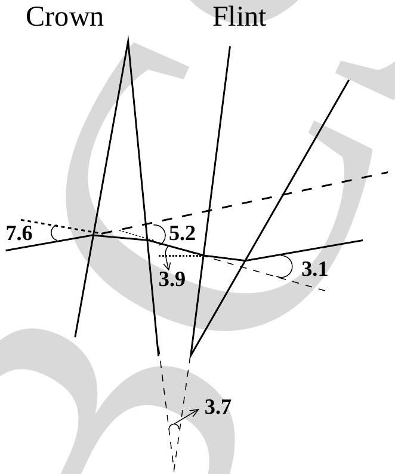

## Solutions   Indian National Physics Olympiad - 2010

Please note that equivalent methods/solutions may exist.
PART - A

1. (a) $\vec { P } _ { A } = 80 \hat { i } \mathrm {~kg} \cdot \mathrm {~m} \cdot \mathrm {~s} ^ { - 1 }$, also acceptable $\vec { P } _ { A } = 70 \hat { i } \mathrm {~kg} \cdot \mathrm {~m} \cdot \mathrm {~s} ^ { - 1 }$;
$\vec { P } _ { B } = - 70 \hat { i } \mathrm {~kg} \cdot \mathrm {~m} \cdot \mathrm {~s} ^ { - 1 }$
    (b) $\vec { P } _ { A } = 20 \hat { i } \mathrm {~kg} \cdot \mathrm {~m} \cdot \mathrm {~s} ^ { - 1 }$;
$\vec { P } _ { B } = - 10 \hat { i } \mathrm {~kg} \cdot \mathrm {~m} \cdot \mathrm {~s} ^ { - 1 }$, also acceptable $\vec { P } _ { B } = - 70 / 8 \hat { i } \mathrm {~kg} \cdot \mathrm {~m} \cdot \mathrm {~s} ^ { - 1 }$
    (c) Number of tosses by $\mathrm { A } = 1$; Number of tosses by $\mathrm { B } = 1$
    (d)See Fig. (1).

Figure 1:
    (e)See Fig. (2).

Figure 2:

2.
(a) $$
\begin{array} { l l }
P _ { 1 } = \frac { 243 } { 32 } P _ { 0 } \quad ; \quad P _ { 2 } = \frac { 243 } { 32 } P _ { 0 } \quad ; \quad P _ { 3 } = \frac { 243 } { 32 } P _ { 0 } \\
V _ { 1 } = \frac { 65 } { 27 } V _ { 0 } \quad ; \quad V _ { 2 } = \frac { 8 } { 27 } V _ { 0 } \quad ; \quad V _ { 3 } = \frac { 8 } { 27 } V _ { 0 } \\
T _ { 1 } = \frac { 585 } { 32 } T _ { 0 } \quad ; \quad T _ { 1 } = \frac { 9 } { 4 } T _ { 0 } \quad ; \quad T _ { 1 } = \frac { 9 } { 4 } T _ { 0 }
\end{array}
$$
(b) Work done $= \frac { 15 } { 4 } P _ { 0 } V _ { 0 }$
(c) Heat supplied $= \frac { 1899 } { 64 } P _ { 0 } V _ { 0 }$
(d) Entropy change in $A _ { 2 } + A _ { 3 } = 0$
Entropy change in $A _ { 1 } = \frac { 3 R } { 2 } \ln \frac { 585 } { 32 } + R \ln \frac { 65 } { 27 }$
3. (a) $A _ { F } = 4.76 { } ^ { 0 }$
(b) $\Delta _ { D } = - 2.1 ^ { 0 }$
(c) See Fig. (3). Note that all angles are expressed in degrees.

Figure 3:

4. (a) $\alpha = \frac { m g R } { I + m R ^ { 2 } }$
(b) $\omega = \sqrt { \frac { 2 \alpha H } { R } }$
(c) $K = m g H$
(d) $\vec { B } = \frac { \mu _ { 0 } } { 2 \pi } \frac { Q \omega ^ { \prime } } { l } \hat { i } \quad$ for $r < R$
$$
= 0 \quad \text { for } r > R
$$
(e) $$
\begin{aligned}
E & = \frac { \mu _ { 0 } Q R ^ { 2 } \alpha ^ { \prime } } { 4 \pi l r } & & \text { for } r \geq R \\
& = \frac { \mu _ { 0 } Q r \alpha ^ { \prime } } { 4 \pi l } & & \text { for } r < R
\end{aligned}
$$

(f) $\tau _ { e m } = Q E R$
(g) $\alpha ^ { \prime } = \frac { m g R } { I + m R ^ { 2 } + \frac { \mu _ { 0 } Q ^ { 2 } R ^ { 2 } } { 4 \pi l } }$
(h) $K ^ { \prime } = \frac { m g H \left( I + m R ^ { 2 } \right) } { I + m R ^ { 2 } + \frac { \mu _ { 0 } Q ^ { 2 } R ^ { 2 } } { 4 \pi l } }$
(i) $K ^ { \prime } - K = - \frac { B ^ { 2 } } { 2 \mu _ { 0 } } \pi R ^ { 2 } l$
(j) Some possible interpretations are
    i. It is the magnetic energy stored in shell. magnetic energy = magnetic energy density $\left( B ^ { 2 } / 2 \mu _ { 0 } \right) \times$ Volume $\left( \pi R ^ { 2 } l \right)$ and/or
    ii. It is the self inductance energy $\left( 1 / 2 L i ^ { 2 } \right)$ of the system. and/or
    iii. Poynting vector argument can also show that it is magnetic energy. $( 2 \pi R l ) \left( \frac { 1 } { \mu _ { 0 } } \int \bar { E } \times \bar { B } d t \right) = K ^ { \prime } - K = \frac { - B ^ { 2 } \pi R ^ { 2 } l } { 2 \mu _ { 0 } }$
5. (a) $\lambda _ { k } = 0.12 \mathrm { hr } ^ { - 1 }$
    (b) $A = 3.70 \times 10 ^ { 4 } \mathrm {~s} ^ { - 1 }$, also acceptable $A = 2.62 \times 10 ^ { 4 } \mathrm {~s} ^ { - 1 }$.
    (c) 5.0 liters

## PART - B

1. b ..... 11. e
2. e ..... 12. e
3. d ..... 13. b
4. d ..... 14. e
5. e ..... 15. d
6. d ..... 16. c
7. a ..... 17. c
8. c ..... 18. d
9. b ..... 19. c
10. c ..... 20. a
