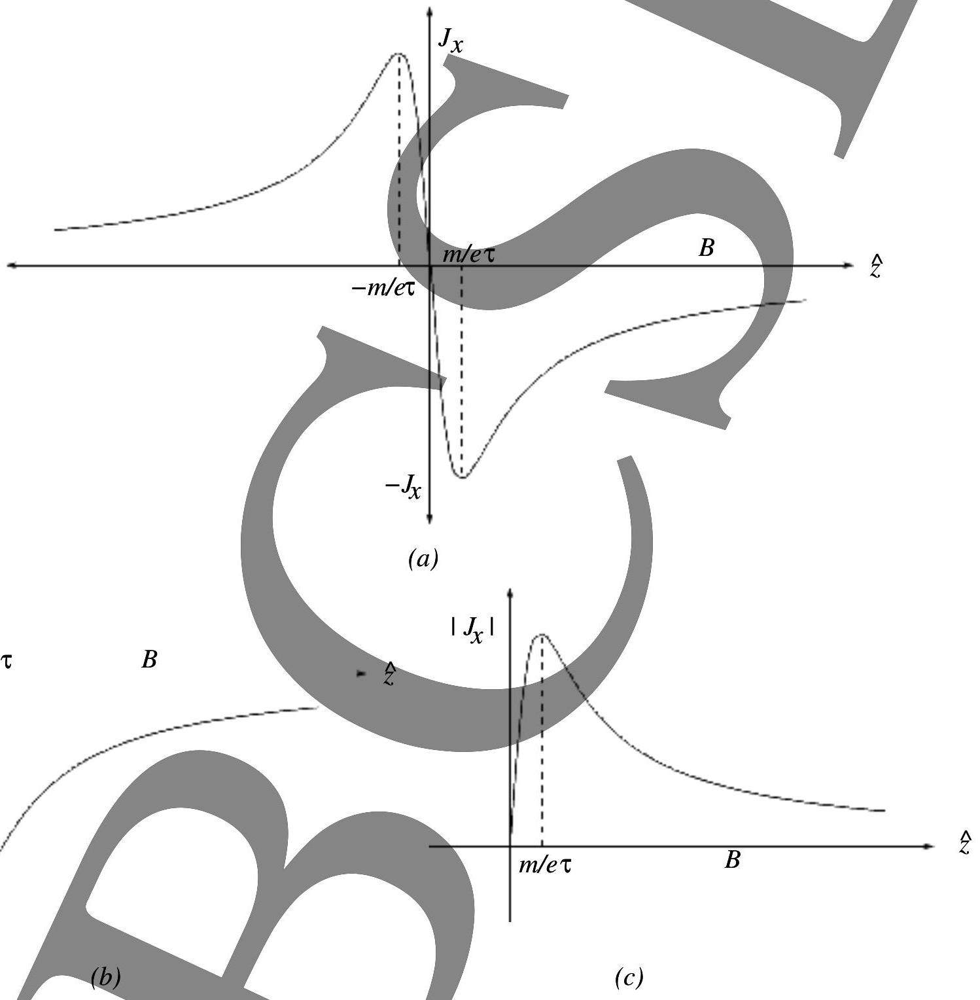
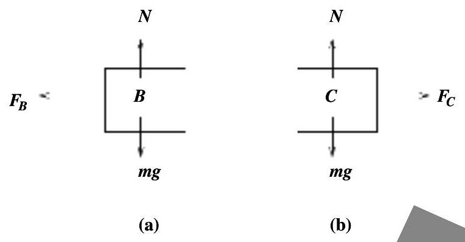
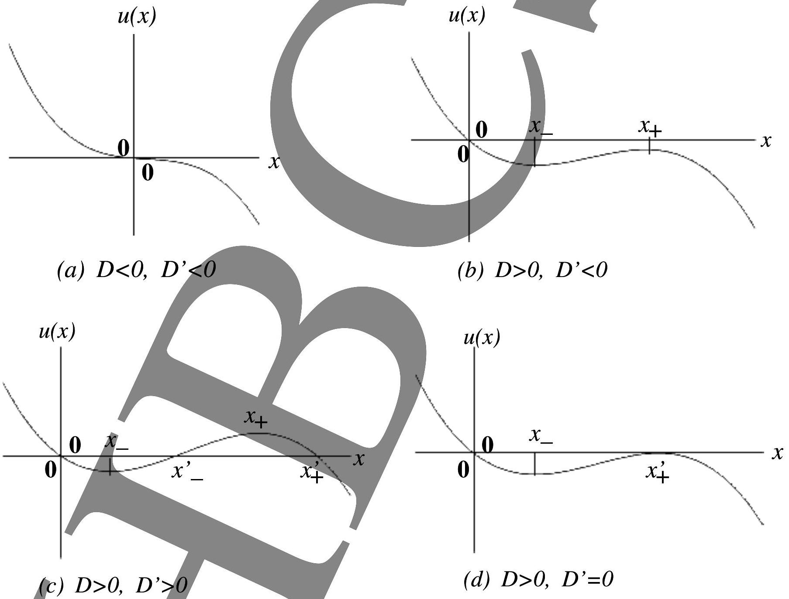
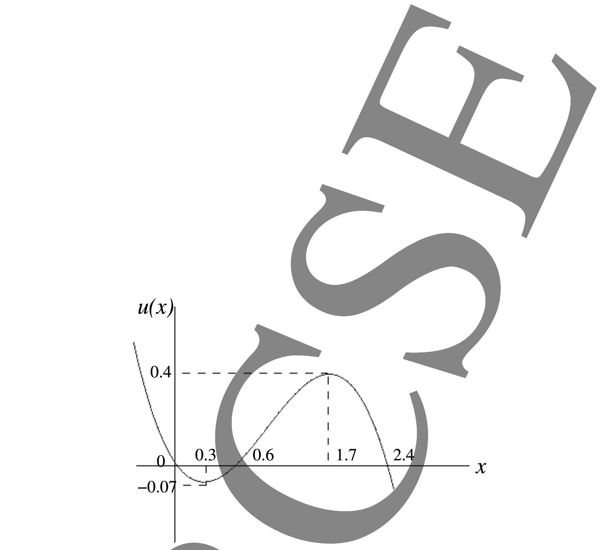

## Indian National Physics Olympiad - 2011 Solutions

Please note that alternate/equivalent solutions may exist. Brief solutions are given below.

1. (a) $F _ { x } = \frac { - \mu _ { 0 } e v _ { y } I } { 2 \pi x }$
$$
F _ { y } = \frac { \mu _ { 0 } e v _ { x } I } { 2 \pi x }
$$
    (b) $v _ { x } = \sqrt { v _ { 0 } ^ { 2 } } - \left( \frac { e \mu _ { 0 } I } { 2 \pi m } \log \frac { x } { a } \right) ^ { 2 }$
    (c) $x _ { \text {max } } = a \exp \left( 2 \pi v _ { 0 } m / e \mu _ { 0 } I \right)$
2. (a) $\Delta x = \frac { \mu _ { l } y d } { D } - \left( \mu _ { g } - \mu _ { l } \right) t _ { g }$
Also acceptable: $\Delta x = \left( \mu _ { g } - \mu _ { l } \right) t _ { g } - \frac { \mu _ { l } y d } { D }$ or $\frac { y d } { D } - \left( \frac { \mu _ { g } } { \mu _ { l } } - 1 \right) t _ { g }$
    (b) $$
\begin{aligned}
y & = \frac { t - 4 } { 10 - t } \times 1.8 \times 10 ^ { - 2 } \mathrm {~m} & & \text { for } t \leq 5 \mathrm {~s} \\
& = 3.6 \times 10 ^ { - 3 } \mathrm {~m} & & \text { for } t > 5 \mathrm {~s}
\end{aligned}
$$
    (c) $t _ { m } = 4 \mathrm {~s}$
    (d) $v = 3.0 \times 10 ^ { - 3 } \mathrm {~m} \cdot \mathrm {~s} ^ { - 1 }$
    (e) $\Delta t = 6.7 \times 10 ^ { - 2 } \mathrm {~s}$
3. (a)

| $P _ { 1 } = \begin{gathered} R \alpha T _ { 0 } \\ V _ { 0 } \end{gathered}$ | $P _ { 2 } = \begin{gathered} R T _ { 0 } \alpha ^ { \gamma / \gamma - 1 } \\ n V _ { 0 } \end{gathered}$ | $P _ { 3 } = \begin{gathered} R T _ { 0 } \\ n V _ { 0 } \end{gathered}$ | $P _ { 4 } = \begin{gathered} R T _ { 0 } \\ V _ { 0 } \alpha ^ { 1 / \gamma - 1 } \end{gathered}$ |
| :--- | :--- | :--- | :--- |
| $V _ { 1 } = V _ { 0 }$ | $V _ { 2 } = \frac { n V _ { 0 } } { \alpha ^ { 1 / \gamma - 1 } }$ | $V _ { 3 } = n V _ { 0 }$ | $V _ { 4 } = \alpha ^ { 1 / \gamma - 1 } V _ { 0 }$ |
| $T _ { 1 } = \alpha T _ { 0 }$ | $T _ { 2 } = \alpha T _ { 0 }$ | $T _ { 3 } = T _ { 0 }$ | $T _ { 4 } = T _ { 0 }$ |

    (b) $W _ { 12 } = R \alpha T _ { 0 } \log \frac { n } { 1 / \gamma - 1 }$
$$
\begin{aligned}
& W _ { 23 } = \frac { R T _ { 0 } ( 1 - \alpha ) } { \gamma - 1 } \\
& W _ { 34 } = R T _ { 0 } \log \binom { \alpha ^ { 1 / \gamma - 1 } } { n } \\
& W _ { 41 } = - \frac { R T _ { 0 } ( \alpha - 1 ) } { \gamma - 1 }
\end{aligned}
$$
    (c) $\boldsymbol { Q } = R \alpha T _ { 0 } \log \left( \frac { n } { \alpha ^ { 1 / \gamma - 1 } } \right)$
Also acceptable: $Q = R T _ { 0 } ( \alpha - 1 ) \log \left( \frac { n } { \alpha ^ { 1 / \gamma - 1 } } \right)$
4. (a) Taking $q _ { 1 } = q _ { 2 } = e , r _ { n } = n ^ { 2 } a _ { 0 } - \beta$
    (b) $E _ { n } = \frac { q _ { 1 } q _ { 2 } } { - 8 \pi \epsilon ^ { 0 } \left( n ^ { 2 } a ^ { 0 } - \beta \right) }$
    (c) $\Delta E = 11.5 \mathrm { eV } ( \pm 0.15 \mathrm { eV }$ acceptable)

5. (a) $m \frac { d \vec { v } } { d t } = - e ( \vec { E } + \vec { v } \times \vec { B } ) - \frac { m \vec { v } } { \tau }$
    (b) $\omega _ { c } = e B / m = 10 ^ { 12 } \mathrm { rad } \cdot \mathrm { s } ^ { - 1 }$
    (c) $\sigma _ { 0 } = n e ^ { 2 } \tau / m = 5.8 \times 10 ^ { 7 }$ (ohm⋅ m) ${ } ^ { - 1 }$
    (d) $$
\begin{aligned}
\sigma _ { x y } & = - \frac { \sigma _ { 0 } \tau \omega _ { c } } { 1 + \omega _ { c } ^ { 2 } \tau ^ { 2 } } ; & & \sigma _ { x z } = 0 \\
\sigma _ { y y } & = \frac { \sigma _ { 0 } } { 1 + \omega _ { c } ^ { 2 } \tau ^ { 2 } } ; & & \sigma _ { y z } = 0 \\
\sigma ^ { z y } & = 0 ; & & \sigma ^ { x z } = \sigma ^ { 0 }
\end{aligned}
$$
    (e)See Fig. (1). Either of Fig. (1a) or (1b) or (1c) is acceptable.

Figure 1: $j _ { x }$ vs $B$
    (f) $B = 229 \mathrm {~T}$
6. (a) $V _ { A } = \frac { 1 - \gamma } { 1 + \gamma } V _ { 0 }$
$$
\begin{aligned}
& V _ { B } = \frac { 2 V _ { 0 } } { 1 + \gamma } \\
& V _ { C } = 0
\end{aligned}
$$
    (b) See Fig. (2) for free body diagrams.
Equations of motion:
$$
m \frac { 2 } { d t ^ { 2 } } = - F _ { B } \text { and } m \frac { 2 } { d t ^ { 2 } } = F _ { C }
$$

Figure 2: (a) Free body diagram for the block $B$. Here $F _ { B } = k \left( L - \left( x _ { C } - x _ { B } \right) \right)$ (b) Free body diagram for the block $C$. Here $F _ { C } = k \left( L - \left( x _ { C } - x _ { B } \right) \right)$.

(c) $\omega = \sqrt { \frac { 2 k } { m } }$
$$
\begin{aligned}
& \alpha = \frac { V _ { 0 } } { 1 + \gamma } \\
& \beta = \frac { V _ { 0 } } { \omega ( 1 + \gamma ) }
\end{aligned}
$$
(d) $0 < \gamma < 2 / 3 \pi$
7. (a) We can define $D = m ^ { 2 } \omega ^ { 4 } - 4 \alpha \delta$ and $D ^ { \prime } = m ^ { 2 } \omega ^ { 4 } - { } _ { 3 } ^ { 16 } \alpha \delta$. There are four possibilities. See Fig. (3) for detailed graphs.

Figure 3: Here $x _ { \pm } = \left( m \omega ^ { 2 } \pm \sqrt { D } \right) / 2 \alpha$ and $x _ { \pm } ^ { \prime } = 3 \left( m \omega ^ { 2 } \pm \sqrt { D ^ { \prime } } \right) / 4 \alpha$.

(b) See Fig. (4).
For $0 < x < 0.6 \quad$ motion is bounded on the left and periodic.
$x \in [ 2.4 , \infty [ \quad$ motion is partially bounded and not periodic.
$x < 0$ and $0.6 < x < 2.4$ forbidden motion.

Figure 4:

