# 2011 INPhO Solutions

Ashmit Dutta

February 27, 2023

#### Abstract

Some years from the Indian Physics Olympiad do not have given solutions. This document serves to provide solutions for the 2011 Indian Physics Olympiad.

## Contents

1 Introduction ..... 2
2 Problem 1 ..... 3
3 Problem 2 ..... 5
4 Problem 3 ..... 7
5 Problem 4 ..... 8
6 Problem 5 ..... 9
7 Problem 6 ..... 11
8 Problem 7 ..... 13

## 1 Introduction

This project arose from a separate solutions project on artofproblemsolving.com where many others have been contributing solutions to past INPhO problems that have no solutions. Thanks to Kushal Thaman for providing extra solutions for me to crosscheck with. Here are my general views of the problems:

- Problem 1: Interesting problem on electromagnetism - namely the motion of electrons from a current-carrying wire. Difficulty 2.5 on POTD scale.
- Problem 2: Pretty standard optics problem with all very managable parts. Difficulty 2 on POTD scale.
- Problem 3: Very standard problem on the Carnot cycle that several textbooks would have. Difficulty 1 on POTD scale.
- Problem 4: Pretty interesting problem on modern physics. Combines several different concepts. Difficulty 3 on POTD scale.
- Problem 5: Very nice problem on conductivity, namely the last 2 parts. The first couple parts are standard and can be found in various textbooks. Difficulty 3 on POTD scale.
- Problem 6: Very nice problem that tests both calculus, essential mechanics concepts, and approximations. Difficulty 3 on POTD scale.
- Problem 7: A basic graphing problem that does not have much physics involved, if at all. Difficulty 1 on POTD scale.

## 2 Problem 1

(a) First, note that the force due to a magnetic field is given by
$$
\begin{equation*}
\vec { F } = q \vec { v } \times \vec { B } . \tag{1}
\end{equation*}
$$
Substituting the electric charge of an electron and splitting the components of $\vec { v }$ into $v \hat { i } + v \hat { j }$ gives us
$$
\begin{equation*}
\vec { F } = - e \left( v _ { x } \hat { i } + v _ { y } \hat { j } \right) \times \vec { B } . \tag{2}
\end{equation*}
$$
Note that the magnetic field points outwards by righthand rule and by Ampere"s Law is $B = \frac { \mu _ { 0 } I } { 2 \pi x }$ where $x$ is the distance from the wire and the electron. Substituting this result and using the properties of vectors tells us
$$
\begin{equation*}
\vec { F } = - e \left( v _ { x } \hat { i } + v _ { y } \hat { j } \right) \times \frac { \mu _ { 0 } I } { 2 \pi x } \hat { k } = \frac { e \mu _ { 0 } I } { 2 \pi x } \left( v _ { y } \hat { i } - v _ { x } \hat { j } \right) . \tag{3}
\end{equation*}
$$
This then tells us the components of force in both $x$ and $y$ directions is
$$
\begin{equation*}
F _ { x } = \frac { e \mu _ { 0 } I } { 2 \pi x } v _ { y } , \quad \text { and } \quad F _ { y } = - \frac { e \mu _ { 0 } I } { 2 \pi x } v _ { x } . \tag{4}
\end{equation*}
$$
(b) Now that we have found the components of force, we can divide by the mass $m$ of the electron to find the acceleration.
$$
\begin{equation*}
F _ { x } = \frac { e \mu _ { 0 } I } { 2 \pi x } v _ { y } \Longrightarrow a _ { x } = \frac { e \mu _ { 0 } I } { 2 \pi m x } v _ { y } \Longrightarrow v _ { x } \frac { d v _ { x } } { d x } = \frac { e \mu _ { 0 } I } { 2 \pi m x } v _ { y } . \tag{5}
\end{equation*}
$$
Noting that $v _ { y } = \sqrt { v _ { 0 } ^ { 2 } - v _ { x } ^ { 2 } }$ (by Pythagorean theorem) we substitute to get the differential equation
$$
\begin{equation*}
v _ { x } \frac { d v _ { x } } { d x } = \frac { e \mu _ { 0 } I } { 2 \pi m x } \sqrt { v _ { 0 } ^ { 2 } - v _ { x } ^ { 2 } } \Longrightarrow \int _ { v _ { 0 } } ^ { v _ { x } } \frac { v _ { x } } { \sqrt { v _ { 0 } ^ { 2 } - v _ { x } ^ { 2 } } } d v _ { x } = - \frac { e \mu _ { 0 } I } { 2 \pi m } \int _ { a } ^ { x } \frac { d x } { x } . \tag{6}
\end{equation*}
$$
To solve this integral, we first use a $u$-substitution
$$
\begin{equation*}
u = v _ { 0 } ^ { 2 } - v _ { x } ^ { 2 } \Longrightarrow d u = - 2 v _ { x } d v _ { x } \Longrightarrow d v _ { x } = - \frac { 1 } { 2 v _ { x } } d u \tag{7}
\end{equation*}
$$
which tells us that
$$
\begin{equation*}
- \frac { 1 } { 2 } \int \frac { 1 } { \sqrt { u } } d u = - \frac { e \mu _ { 0 } I } { 2 \pi m } \int _ { a } ^ { x } \frac { d x } { x } \tag{8}
\end{equation*}
$$
Applying power rule and substituting back $u = v _ { 0 } ^ { 2 } - v _ { x } ^ { 2 }$ gives us
$$
\begin{equation*}
- \left. \sqrt { v _ { 0 } ^ { 2 } - v _ { x } ^ { 2 } } \right| _ { v _ { 0 } } ^ { v _ { x } } = - \left. \frac { e \mu _ { 0 } I } { 2 \pi m } \ln ( x ) \right| _ { a } ^ { x } . \tag{9}
\end{equation*}
$$
Evaluating the bounds
$$
\begin{equation*}
\sqrt { v _ { 0 } ^ { 2 } - v _ { x } ^ { 2 } } = \frac { e \mu _ { 0 } I } { 2 \pi m } \ln \frac { x } { a } \Longrightarrow v _ { x } = \sqrt { v _ { 0 } ^ { 2 } - \left( \frac { e \mu _ { 0 } I } { 2 \pi m } \ln \frac { x } { a } \right) ^ { 2 } } \tag{10}
\end{equation*}
$$

(c) When the electron turns back, its $x$-velocity must become zero. This means that all we do is set our last equation to be zero and solve for $x$. In other words,
$$
\begin{equation*}
0 = v _ { x } = \sqrt { v _ { 0 } ^ { 2 } - \left( \frac { e \mu _ { 0 } I } { 2 \pi m } \ln \frac { x } { a } \right) ^ { 2 } } . \tag{11}
\end{equation*}
$$
Simplifying further tells us
$$
\begin{equation*}
v _ { 0 } = \frac { e \mu _ { 0 } I } { 2 \pi m } \ln \frac { x } { a } \Longrightarrow a \cdot \exp \left( \frac { 2 \pi m v _ { 0 } } { e \mu _ { 0 } I } \right) . \tag{12}
\end{equation*}
$$

## 3 Problem 2

(a) Define $S _ { 1 } P$ and $S _ { 2 } P$ as a geometric length and $x _ { 1 }$ and $x _ { 2 }$ to be the optical path length. We see that
$$
\begin{equation*}
x _ { 1 } = \mu _ { l } \left( S _ { 1 } P \right) . \tag{13}
\end{equation*}
$$
The geometric path length of $x _ { 2 }$ will be defined as $S _ { 2 } P - t _ { g }$ and will be superimposed with the optical path length of the glass. In other words, we have that
$$
\begin{equation*}
x _ { 2 } = \mu _ { l } \left( S _ { 2 } P - t _ { g } \right) + \mu _ { g } t _ { g } . \tag{14}
\end{equation*}
$$
The difference in the path lengths will then be
$$
\begin{equation*}
\Delta x = x _ { 1 } - x _ { 2 } = \mu _ { l } \left( S _ { 1 } P \right) - \mu _ { l } \left( S _ { 2 } P - t _ { g } \right) + \mu _ { g } t _ { g } = \mu _ { l } \left( S _ { 1 } P - S _ { 2 } P \right) - \left( \mu _ { g } - \mu _ { l } \right) t _ { g } . \tag{15}
\end{equation*}
$$
Note that $S _ { 1 } P - S _ { 2 } P = d \sin \theta$ where $\theta = \arctan ( y / D ) \approx \arcsin ( y / D )$ (because $\theta$ is very small) which means that
$$
\begin{equation*}
\Delta x = \mu _ { l } d \sin \theta - \left( \mu _ { g } - \mu _ { l } \right) t _ { g } = \frac { \mu _ { l } y d } { D } - \left( \mu _ { g } - \mu _ { l } \right) t _ { g } . \tag{16}
\end{equation*}
$$
(b) The maximum will be when $\Delta x = 0$. Substituting $\mu _ { l } = 2.50 - 0.25 t$ and $\mu _ { g } = 1.50$ will get us
$$
\begin{equation*}
0 = ( 2.50 - 0.25 t ) \frac { y d } { D } - ( 0.25 t - 1.5 ) t _ { g } \tag{17}
\end{equation*}
$$
then, substituting values of $d , D$ and $t _ { g }$ gives us the final equation of
$$
\begin{equation*}
( 0.25 t - 1.5 ) \times 3.60 \times 10 ^ { - 5 } \mathrm {~m} = y ( 2.50 - 0.25 t ) \times 2.00 \times 10 ^ { - 3 } \mathrm {~m} . \tag{18}
\end{equation*}
$$
When $t \leq 5 \mathrm {~s}$, we find that
$$
\begin{equation*}
y = \frac { t - 4 } { 10 - t } \times 1.8 \times 10 ^ { - 2 } \mathrm {~m} \tag{19}
\end{equation*}
$$
and when $t \geq 5$, we find that $t$ must be
$$
\begin{equation*}
t = 3.6 \times 10 ^ { - 2 } \mathrm {~m} . \tag{20}
\end{equation*}
$$
(c) The time when the central maximum will be at $O$ is when $y = 0$. In other words
$$
\begin{equation*}
0 = \frac { t - 4 } { 10 - t } \times 1.8 \times 10 ^ { - 2 } \mathrm {~m} \Longrightarrow 0 = t - 4 \Longrightarrow t = 4 \mathrm {~s} . \tag{21}
\end{equation*}
$$
(d) All we do is simply evaluate the derivative of $y$. Note that
$$
\begin{equation*}
v _ { c } = \frac { \mathrm { d } y } { \mathrm {~d} t } = \frac { ( 10 - t ) - 10 ( t - 4 ) } { ( 10 - t ) ^ { 2 } } \times 1.8 \times 10 ^ { - 2 } \mathrm {~m} \tag{22}
\end{equation*}
$$
by quotient rule. We know the time at the central maxima from part (c), therefore, by substituting $t = 4$ we get that
$$
\begin{equation*}
v = \frac { 1 } { 6 } \times 1.8 \times 10 ^ { - 2 } \mathrm {~m} = 3.0 \times 10 ^ { - 3 } \mathrm {~ms} ^ { - 1 } . \tag{23}
\end{equation*}
$$

(e) At point $\mathrm { O } , \Delta x$ can be written as
$$
\begin{equation*}
\Delta x = \left( \mu _ { l } - \mu _ { g } \right) t _ { g } \tag{24}
\end{equation*}
$$
since $y = 0$ at point O . We can equate this maxima to $n \lambda$ at point O to get
$$
\begin{equation*}
n \lambda = \left( \mu _ { l } - \mu _ { g } \right) t _ { g } . \tag{25}
\end{equation*}
$$
Substituting the time equivalents of $\mu _ { l }$ and $\mu _ { g }$ tells us that
$$
\begin{equation*}
n \times 6000 \AA = ( 1.5 - 0.25 t ) \times 3.6 \times 10 ^ { - 5 } . \tag{26}
\end{equation*}
$$
Differentiating this result tells us that
$$
\begin{equation*}
\Delta n \times 6000 \AA = - 0.25 \Delta t \times 3.6 \times 10 ^ { - 5 } \tag{27}
\end{equation*}
$$
we can substitute $\Delta n = 1$ to find
$$
\begin{equation*}
\Delta t = 6.7 \times 10 ^ { - 2 } \mathrm {~s} . \tag{28}
\end{equation*}
$$

## 4 Problem 3

(a)The temperature at point 1 is told to be $T _ { 1 } = \alpha T _ { 0 }$ and as no process has undergone, the volume remains invariant as $V _ { 1 } = V _ { 0 }$. At point 1 , the pressure is given easily by the ideal gas law

$$
\begin{equation*}
P _ { 1 } V _ { 0 } = R ( \alpha T ) \Longrightarrow P _ { 1 } = \frac { R \alpha T } { V _ { 0 } } . \tag{29}
\end{equation*}
$$

The process from point 1 to point 2 is an isothermal process, so $T _ { 2 }$ remains as $\alpha T _ { 0 }$. The minimum volume is at point 3 as $n V _ { 0 }$ and the ratio of maximum to minimum temperatures is $\alpha$. This allows us to write

$$
\begin{equation*}
\left( \frac { T _ { H } } { T _ { L } } \right) = \left( \frac { V _ { H } } { V _ { L } } \right) ^ { \gamma - 1 } \Longrightarrow \alpha = \left( \frac { n V _ { 0 } } { V _ { 2 } } \right) ^ { \gamma - 1 } \Longrightarrow V _ { 0 } = \frac { n V _ { 0 } } { \alpha ^ { 1 / ( \gamma - 1 ) } } \tag{30}
\end{equation*}
$$

By the ideal gas law, the pressure $P _ { 2 }$ is then given as

$$
\begin{equation*}
P _ { 2 } = \frac { R T _ { 0 } \alpha ^ { \gamma / \gamma - 1 } } { n V _ { 0 } } . \tag{31}
\end{equation*}
$$

We can make a table to represent the set of all values $\{ P , V , T \}$ :

| $P _ { 1 } = \frac { R \alpha T _ { 0 } } { V _ { 0 } }$ | $P _ { 2 } = \frac { R T \alpha ^ { \gamma / ( \gamma - 1 ) } } { n V _ { 0 } }$ | $P _ { 3 } = \frac { R T _ { 0 } } { n V _ { 0 } }$ | $P _ { 4 } = \frac { R T _ { 0 } } { V _ { 0 } \alpha ^ { 1 / ( 1 - \gamma ) } }$ |
| :--- | :--- | :--- | :--- |
| $V _ { 1 } = V _ { 0 }$ | $V _ { 2 } = \frac { n V _ { 0 } } { \alpha ^ { 1 / ( 1 - \gamma ) } }$ | $V _ { 3 } = n V _ { 0 }$ | $V _ { 4 } = \alpha ^ { 1 / ( 1 - \gamma ) } V _ { 0 }$ |
| $T _ { 1 } = \alpha T _ { 0 }$ | $T _ { 2 } = \alpha T _ { 0 }$ | $T _ { 3 } = T _ { 0 }$ | $T _ { 4 } = T _ { 0 }$ |
(b) Process 1-2 (Isothermal):
$$
W _ { 12 } = R \alpha T _ { 0 } \ln \frac { V _ { 2 } } { V _ { 1 } } = R \alpha T _ { 0 } \ln \left( \frac { n } { \alpha ^ { 1 / \gamma - 1 } } \right) .
$$

Process 2-3 (Adiabatic):

$$
W _ { 23 } = - \Delta U = - C _ { V } \left( T _ { 2 } - T _ { 3 } \right) = - \frac { R } { \gamma - 1 } T _ { 0 } ( 1 - \alpha )
$$

Process 3-4 (Isothermal):

$$
W _ { 34 } = R T _ { 0 } \ln \frac { V _ { 3 } } { V _ { 4 } } = R T _ { 0 } \ln \left( \frac { a ^ { 1 / \gamma - 1 } } { n } \right)
$$

Process 4-1 (Adiabatic):

$$
W _ { 41 } = - \Delta U = - C _ { V } \left( T _ { 4 } - T _ { 1 } \right) = - \frac { R } { \gamma - 1 } T _ { 0 } ( \alpha - 1 )
$$

(c) From the first law of thermodynamics, the total heat will just be the total work done throughout processes 1-4 or in other words
$$
Q = R T _ { 0 } ( \alpha - 1 ) \ln \left( \frac { n } { \alpha ^ { 1 / \gamma - 1 } } \right)
$$

## 5 Problem 4

(a) We have two equations. The first one is the force of attraction between two electrons
$$
\begin{equation*}
\vec { F } = \frac { e ^ { 2 } } { 4 \pi \varepsilon _ { 0 } } \left( \frac { 1 } { r ^ { 2 } } + \frac { \beta } { r ^ { 3 } } \right) = \frac { e ^ { 2 } } { 4 \pi \varepsilon _ { 0 } } \left( \frac { r + \beta } { r ^ { 3 } } \right) = \frac { m v ^ { 2 } } { r } \tag{32}
\end{equation*}
$$
and the other equation is conservation of angular momentum
$$
\begin{equation*}
m v r = n \hbar \Longrightarrow v = \frac { n \hbar } { m r } . \tag{33}
\end{equation*}
$$
Substituting $v$ into the centripetal force equation gives us
$$
\begin{equation*}
\frac { e ^ { 2 } } { 4 \pi \varepsilon _ { 0 } } \left( \frac { r + \beta } { r ^ { 3 } } \right) = \frac { n ^ { 2 } \hbar ^ { 2 } } { m r ^ { 3 } } \tag{34}
\end{equation*}
$$
we then find that
$$
\begin{equation*}
r _ { n } = \frac { 4 \pi \varepsilon _ { 0 } n ^ { 2 } \hbar ^ { 2 } } { m e ^ { 2 } } - \beta = n ^ { 2 } a _ { 0 } - \beta . \tag{35}
\end{equation*}
$$
(b) We consider the kinetic and potential energies of this new modified system. With equation (5), the kinetic energy is given as
$$
\begin{equation*}
K = \frac { 1 } { 2 } m v _ { n } ^ { 2 } = \frac { 1 } { 2 } \frac { e ^ { 2 } } { 4 \pi \varepsilon _ { 0 } } \left( \frac { 1 } { r } + \frac { \beta } { r ^ { 2 } } \right) . \tag{36}
\end{equation*}
$$
Note that $F = - \mathrm { d } U / \mathrm { d } r$, which means the potential energy is given as
$$
\begin{equation*}
U = - \frac { e ^ { 2 } } { 4 \pi \varepsilon _ { 0 } } \left( \frac { 1 } { r } + \frac { \beta } { 2 r ^ { 2 } } \right) . \tag{37}
\end{equation*}
$$
We can now add these two together to get $E _ { n }$ :
$$
\begin{equation*}
E _ { n } = \frac { e ^ { 2 } } { 4 \pi \varepsilon _ { 0 } } \left( \frac { 1 } { 2 r } + \frac { \beta } { 2 r ^ { 2 } } - \frac { 1 } { r } - \frac { \beta } { 2 r ^ { 2 } } \right) = - \frac { e ^ { 2 } } { 8 \pi \varepsilon _ { 0 } } \frac { 1 } { n ^ { 2 } a _ { 0 } - \beta } . \tag{38}
\end{equation*}
$$
(c) We find $\Delta E$ by using
$$
\begin{equation*}
\Delta E = E _ { 2 } - E _ { 1 } \tag{39}
\end{equation*}
$$
by substituting $n = 1$ and $n = 2$. This therefore gives,
$$
\begin{equation*}
\Delta E = \frac { e ^ { 2 } } { 8 \pi \varepsilon _ { 0 } } \left( \frac { 1 } { a _ { 0 } - \beta } - \frac { 1 } { 4 a _ { 0 } - \beta } \right) . \tag{40}
\end{equation*}
$$
Using the fact that $( 1 + x ) ^ { n } \approx 1 + n x$, we can rewrite our equation as
$$
\begin{align*}
\Delta E & = \frac { e ^ { 2 } } { 8 \pi \varepsilon _ { 0 } a _ { 0 } } \left( \frac { 1 } { 1 - \beta / a _ { 0 } } - \frac { 1 } { 4 - \beta / a _ { 0 } } \right)  \tag{41}\\
& \approx \frac { e ^ { 2 } } { 8 \pi \varepsilon _ { 0 } a _ { 0 } } \left( 1 + \frac { \beta } { a _ { 0 } } - \frac { 1 } { 4 } - \frac { \beta } { 16 a _ { 0 } } \right)  \tag{42}\\
& \approx \frac { e ^ { 2 } } { 4 \pi \varepsilon _ { 0 } a _ { 0 } } \left( \frac { 3 } { 4 } + \frac { 15 } { 16 } \frac { \beta } { a _ { 0 } } \right)  \tag{43}\\
& \approx 11.5 \mathrm { eV } . \tag{44}
\end{align*}
$$

## 6 Problem 5

(a) The Lorentz force tells us that
$$
\begin{equation*}
\vec { F } = q ( \vec { E } + \vec { v } \times \vec { B } ) . \tag{45}
\end{equation*}
$$
There is also a retarding force of $F _ { d } = m \vec { v } / \tau$. This tells us that
$$
\begin{equation*}
\vec { F } = m \frac { \mathrm {~d} \vec { v } } { \mathrm {~d} t } = - e ( \vec { E } + \vec { v } \times \vec { B } ) - \frac { m \vec { v } } { \tau } . \tag{46}
\end{equation*}
$$
(b) When $\tau \rightarrow \infty$, the retarding force becomes approximately zero. Since there is no electric field, our total force is then just $e \vec { v } \times \vec { B }$. We equate this to the centripetal force to find that
$$
\begin{equation*}
\frac { m v ^ { 2 } } { r } = e v B \Longrightarrow \frac { v } { r } = \omega = \frac { e B } { m } = 10 ^ { 12 } \mathrm { rad } \cdot \mathrm {~s} ^ { - 1 } . \tag{47}
\end{equation*}
$$
(c) The electric force that acts on each electron is $e E$ and this acts for a time $t$ meaning the momentum increment is just $e E t$. Suppose the velocity after an electron collides is $\overrightarrow { u _ { i } }$. The average momentum of all electrons is [2]
$$
\begin{equation*}
m \bar { v } = \frac { 1 } { N } \sum _ { i } \left( m u _ { i } + e E t \right) . \tag{48}
\end{equation*}
$$
The first sum goes to 0, so our average velocity is given as
$$
\begin{equation*}
\bar { v } = \frac { e E t } { m } . \tag{49}
\end{equation*}
$$
The current density is then
$$
\begin{equation*}
J = N e \frac { e E t } { m } = \frac { N e ^ { 2 } t } { m } E . \tag{50}
\end{equation*}
$$
As $J = \sigma E$, we can then substitute $t$ for $\tau$ to get
$$
\begin{equation*}
\sigma = \frac { N e ^ { 2 } \tau } { m } . \tag{51}
\end{equation*}
$$
(d) We can consider the movement of electrons in the $x - y$ plane. A charged particle experiences two different contributions to its acceleration:
$$
\begin{equation*}
\vec { a } = \frac { q \vec { E } } { m } + \frac { q } { m } ( \vec { v } \times \vec { B } ) . \tag{52}
\end{equation*}
$$
By creating a differential equation in the $x$ and $y$ directions, we can guess a solution of $v _ { x } = C \sin ( \omega t + \phi )$ to get
$$
\begin{align*}
& v _ { x } = v _ { 0 } \left( \cos \left( \omega _ { c } t \right) - 1 \right)  \tag{53}\\
& v _ { y } = v _ { 0 } \sin \left( \omega _ { c } t \right) \tag{54}
\end{align*}
$$
We can average the in a single interval $t$ between two collisions:
$$
\begin{align*}
\bar { v } _ { x } & = \frac { v _ { 0 } } { t } \int _ { 0 } ^ { t } v _ { x } ( t ) \mathrm { d } t  \tag{55}\\
& = \frac { v _ { 0 } } { \omega _ { c } t } ( 1 - \cos \omega t ) \tag{56}
\end{align*}
$$

Next is to integrate over the probability distribution of electrons. This requires the assumption that mean free time of collisions does not depend on prior collisions [1]. In a thermal analogy, one would expect the opposite, because the faster a particle collides, the sooner the time of collision would be. So, we need to assume that $v _ { \text {electrons } } \ll v _ { \text {thermal } }$ and assume a basic exponential probability distribution

$$
\begin{equation*}
p ( t ) = \frac { 1 } { \tau } \exp \frac { t } { \tau } . \tag{57}
\end{equation*}
$$

This probability distribution works because the expected time is just the mean free time $\tau . { } ^ { 1 }$ Using this probability distribution now tells us that

$$
\begin{align*}
\bar { v } _ { x } & = \frac { 1 } { \tau } \int _ { 0 } ^ { \infty } t p ( t ) \bar { v } _ { x } ( t ) \mathrm { d } t  \tag{58}\\
& = \frac { v _ { 0 } } { \omega _ { c } \tau } \left( \int _ { 0 } ^ { \infty } p ( t ) \mathrm { d } t - \int _ { 0 } ^ { \infty } p ( t ) \cos \left( \omega _ { c } t \right) \mathrm { d } t \right)  \tag{59}\\
& = \frac { v _ { 0 } } { \omega _ { c } \tau } \left( 1 - \frac { 1 } { 1 + \tau ^ { 2 } \omega _ { c } ^ { 2 } } \right)  \tag{60}\\
& = \frac { v _ { 0 } \omega _ { c } \tau } { 1 + \omega _ { c } ^ { 2 } \tau ^ { 2 } } \tag{61}
\end{align*}
$$

As conductivity is proportional to velocity, this means that

$$
\begin{equation*}
\sigma _ { x y } = - \frac { \sigma _ { 0 } \tau \omega _ { c } } { 1 + \omega _ { c } ^ { 2 } \tau ^ { 2 } } \tag{62}
\end{equation*}
$$

Similar calculations can be done for $\sigma _ { y y }$ with $v _ { y } ( t )$ to derive

$$
\begin{equation*}
\sigma _ { y y } = \frac { \sigma _ { 0 } } { 1 + \omega _ { c } ^ { 2 } \tau ^ { 2 } } \tag{63}
\end{equation*}
$$

All other conductivity terms go to 0 because the electric and magnetic fields give no contribution.

(e) From the answer key, drawing either (a), (b), or (c) is acceptable.
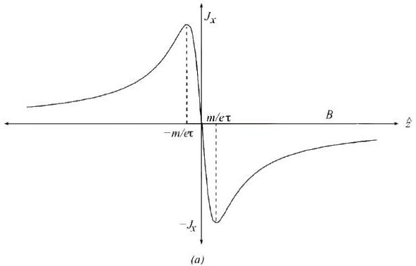

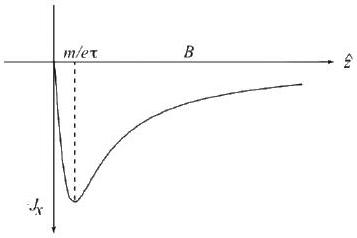
(b)

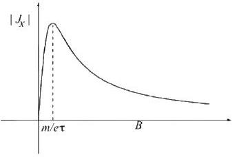
(c)

[^0]

## 7 Problem 6

(a) First, note that block C will have a velocity of zero since the force carried by the spring is non-impulsive. Elastic collision laws have to be used on blocks B and C. Take the reference frame of the center of mass and then convert back to the lab frame to find the resultant velocities. This shows:
$$
\begin{align*}
& v _ { 1 } ^ { \prime } = - v _ { 0 } + 2 v _ { \mathrm { CM } }  \tag{64}\\
& v _ { 2 } ^ { \prime } = - v _ { 2 } + 2 v _ { \mathrm { CM } } \tag{65}
\end{align*}
$$
where
$$
\begin{equation*}
v _ { \mathrm { CM } } = \frac { M v _ { 0 } } { M + m } . \tag{66}
\end{equation*}
$$
Therefore,
$$
\begin{equation*}
v _ { 1 } ^ { \prime } = \frac { M - m } { M + m } v _ { 0 } = \frac { 1 - m / M } { 1 + m / M } v _ { 0 } = \frac { 1 - \gamma } { 1 + \gamma } v _ { 0 } \tag{67}
\end{equation*}
$$
and
$$
\begin{equation*}
v _ { 2 } ^ { \prime } = \frac { 2 M } { M + m } v _ { 0 } = \frac { 2 v _ { 0 } } { 1 + \gamma } . \tag{68}
\end{equation*}
$$
(b) A spring force $F _ { C }$, corresponding to a displacement $x _ { C }$ is directed rightwards to block C. A spring force $F _ { B }$, corresponding to a displacement $x _ { B }$ must be directed leftwards. Apart from this, there are normal and gravitational forces directed on both blocks in the vertical direction which cancel out.
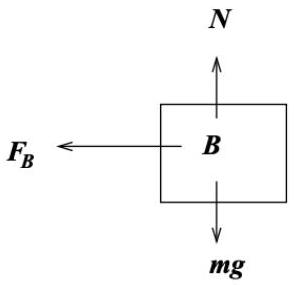
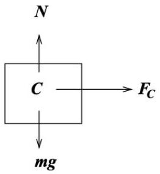
The equations of motion can be expressed as two coupled differential equations
$$
\begin{align*}
& m \ddot { x } _ { B } = - F _ { B } = - k \left( L - \left( x _ { C } - x _ { B } \right) \right)  \tag{69}\\
& m \ddot { x } _ { C } = F _ { C } = k \left( L - \left( x _ { C } - x _ { B } \right) \right) \tag{70}
\end{align*}
$$
(c) We are given the general equations for $x _ { A }$ and $x _ { B }$ are
$$
\begin{align*}
& x _ { B } = \alpha t + \beta \sin ( \omega t )  \tag{71}\\
& x _ { C } = L + \alpha t - \beta \sin ( \omega t ) \tag{72}
\end{align*}
$$
Taking successive derivatives implies
$$
\begin{align*}
& \dot { x } _ { B } = \alpha + \beta \omega \cos ( \omega t )  \tag{73}\\
& \dot { x } _ { C } = \alpha - \beta \omega \cos ( \omega t )  \tag{74}\\
& \ddot { x } _ { B } = - \beta \omega ^ { 2 } \sin ( \omega t )  \tag{75}\\
& \ddot { x } _ { C } = \beta \omega ^ { 2 } \sin ( \omega t ) \tag{76}
\end{align*}
$$

Equating $v _ { B }$ to $\dot { x } _ { B }$ gives the equation

$$
\begin{equation*}
\alpha + \beta \omega \cos ( \omega t ) = \frac { 2 v _ { 0 } } { 1 + \gamma } \tag{77}
\end{equation*}
$$

At $t = 0$, this equation simplifies to

$$
\begin{equation*}
\alpha + \beta \omega = \frac { 2 v _ { 0 } } { 1 + \gamma } \tag{78}
\end{equation*}
$$

Similarly, for $v _ { C }$, we can equate it to $\dot { x } _ { C }$. From the previous part, we know that at $t = 0$, $v _ { C } = 0$, so:

$$
\begin{equation*}
\alpha - \beta \omega = 0 \Longrightarrow \alpha = \beta \omega . \tag{79}
\end{equation*}
$$

Plugging back into equation (7) shows

$$
\begin{equation*}
\alpha = \frac { v _ { 0 } } { 1 + \gamma } , \quad \beta = \frac { v _ { 0 } } { \beta ( 1 + \gamma ) } . \tag{80}
\end{equation*}
$$

Now using our force equation, we have

$$
\begin{align*}
- \frac { k \left( x _ { B } - x _ { C } \right) } { m } & = \ddot { x } _ { B }  \tag{81}\\
- \frac { k } { m } ( 2 \beta \sin ( \omega t ) ) & = - \beta \omega ^ { 2 } \sin ( \omega t )  \tag{82}\\
\omega & = \sqrt { \frac { 2 k } { m } } . \tag{83}
\end{align*}
$$

(d) The coordinate of block B will be described as:
$$
\begin{equation*}
x _ { B } = \frac { v _ { 0 } } { 1 + \gamma } t + \frac { v _ { 0 } } { \omega ( 1 + \gamma ) } \sin ( \omega t ) = \frac { v _ { 0 } } { 1 + \gamma } \left( t + \frac { 1 } { \omega } \sin ( \omega t ) \right) . \tag{84}
\end{equation*}
$$
The condition for the second collision is
$$
\begin{equation*}
x _ { B } ( t ) = v _ { A } t \tag{85}
\end{equation*}
$$
or
$$
\begin{equation*}
\frac { v _ { 0 } } { 1 + \gamma } \left( t + \frac { 1 } { \omega } \sin ( \omega t ) \right) = \frac { 1 - \gamma } { 1 + \gamma } v _ { 0 } t . \tag{86}
\end{equation*}
$$
This is hard to solve, but it can be approximately solved by graphing the functions as shown below.
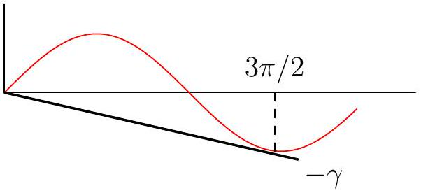
From here, we have that
$$
\begin{equation*}
\frac { \sin \omega t } { \omega t } = - \gamma . \tag{87}
\end{equation*}
$$
Note the max value of $- \sin ( \omega t ) = 1$ has its first maximum at $\omega t = \frac { 3 \pi } { 2 }$. Solving this graphically, we see that for a solution to exist, $\gamma \leq \gamma _ { \text {max } }$. Therefore,
$$
\begin{equation*}
\gamma \omega t \lessapprox 1 \Longrightarrow \gamma \cdot \frac { 3 \pi } { 2 } < 1 \Longrightarrow \gamma \lessapprox \frac { 2 } { 3 \pi } . \tag{88}
\end{equation*}
$$

## 8 Problem 7

(a) From the answer key: We can define $D = m ^ { 2 } \omega ^ { 4 } - 4 \alpha \delta$ and $D ^ { \prime } = m ^ { 2 } \omega ^ { 4 } - \frac { 16 } { 3 } \alpha \delta$.

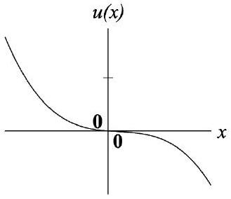
(a) $D < 0 , D ^ { \prime } < 0$

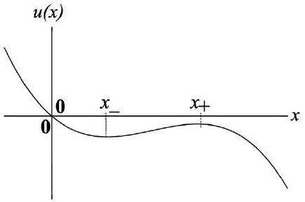
(b) $D > 0 , D ^ { \prime } < 0$

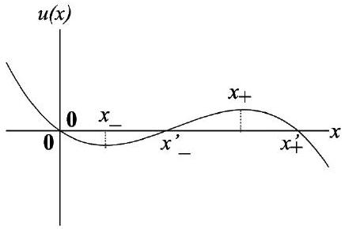
(c) $D > 0 , D ^ { \prime } > 0$

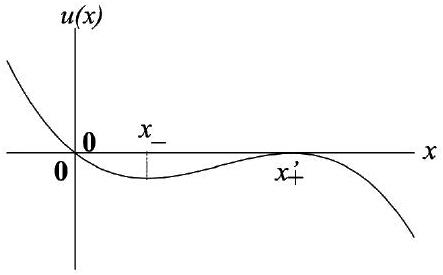
(d) $D > 0 , D ^ { \prime } = 0$

Here $x _ { \pm } = \left( m \omega ^ { 2 } \pm D \right) / 2 \alpha$ and $x _ { \pm } = 3 \left( m \omega ^ { 2 } \pm \sqrt { D ^ { \prime } } \right) / 4 \alpha$

(b) The graph looks like below
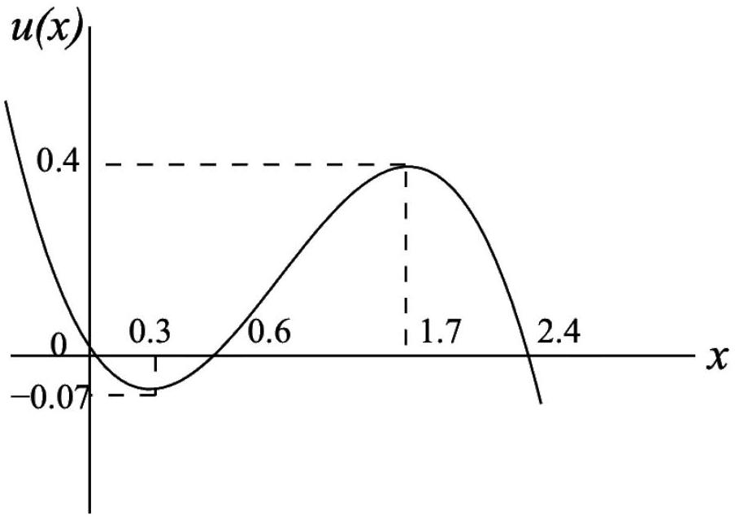
As the total energy is 0 and kinetic energy can only be positive, any areas where $u ( x ) > 0$ is strictly forbidden. This includes $x < 0$ and $0.6 < x < 2.4$. For $0 < x < 0.6$, the motion is bounded on the left. Furthermore, energy increases on either side of the equilibrium point $x = 0.3$ which indicates that motion would be periodic in this area. For $x \in [ 2.4 , \infty )$, the motion is partially bounded but not periodic because there exists no minimum.

## References

[1] Stefan Maus. Conductivity of the ionosphere. 2006.
[2] Edward M. Purcell and David J. Morin. Electricity and Magnetism. Cambridge University Press, 3 edition, 2013.

[^0]:    ${ } ^ { 1 }$ You would have to integrate $\int _ { 0 } ^ { \infty } t p ( t ) \mathrm { d } t$.
