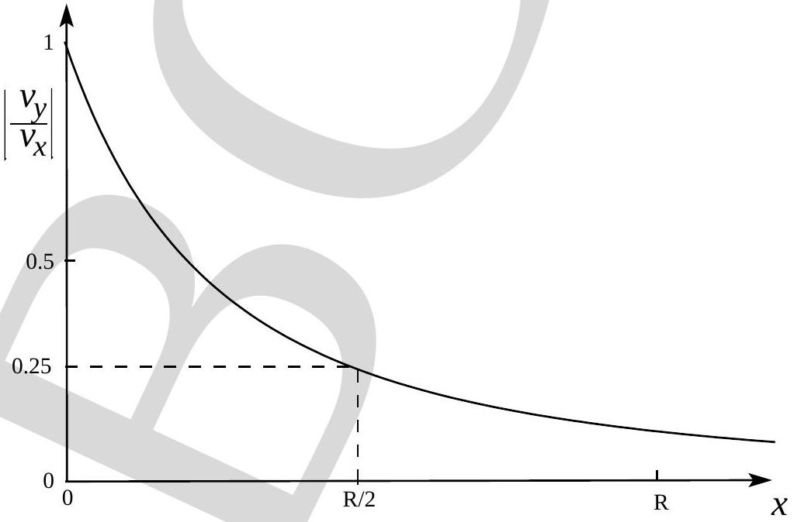
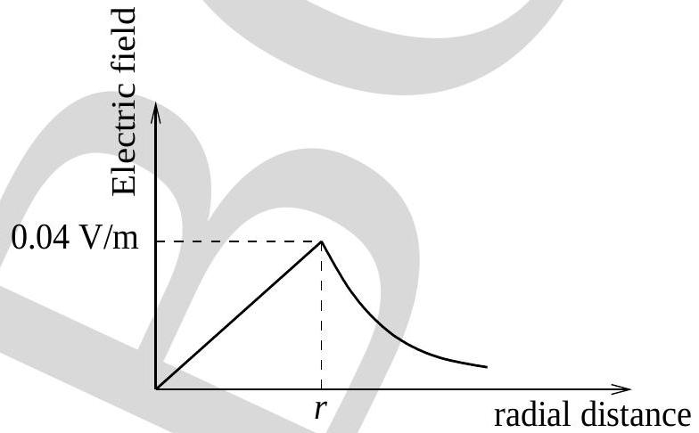
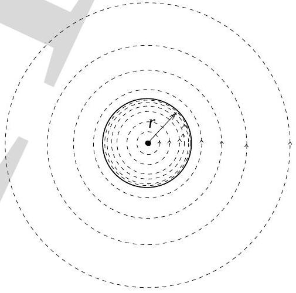
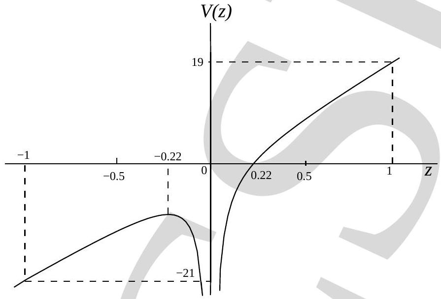

## Indian National Physics Olympiad - 2012 Solutions

Please note that alternate/equivalent solutions may exist. Brief solutions are given below.

1. (a) $\omega _ { i + 1 } = \frac { 7 } { 13 } \omega _ { i } + \frac { 6 } { 13 } \frac { v } { r }$
    (b) $\omega ^ { * } = \frac { v } { r }$

Argument : Initially $\omega _ { i }$ increases until it reaches a value $v = \omega ^ { * } r$, i.e. the speed of the falling ball. Thereafter the ball merely "touches" the sphere and does not impart it any momentum.

(c) $\omega _ { i } = \frac { v } { r } \left( 1 - \left( \frac { 7 } { 13 } \right) ^ { i } \right)$ $i = 0,1,2,3 , \ldots \ldots$.
$$
\text { or } \omega _ { i } = \frac { v } { r } \left( 1 - \left( \frac { 7 } { 13 } \right) ^ { i - 1 } \right)
$$
$i = 1,2,3 , \ldots \ldots$.
(d) $\omega ^ { * } = \frac { v } { r }$
2. (a) $v _ { y } = \frac { R ^ { 2 } } { ( 2 x + R ) ^ { 2 } } v _ { x }$
    (b) See figure below:

(c) Speed $= 2.22 \mathrm {~km} \cdot \mathrm { hr } ^ { - 1 }$
3. (a) $\Gamma = \frac { m _ { a } g } { R } \frac { ( \gamma - 1 ) } { \gamma }$
    (b) For $m _ { a } = 29.0 \mathrm {~kg} \cdot \mathrm { kmol } ^ { - 1 } ; \Gamma =$ approx $10 \mathrm {~K} \cdot \mathrm {~km} ^ { - 1 }$
    (c) $\alpha = \frac { \gamma } { \gamma - 1 }$
    (d) approximately 30.0 km
    (e) $p _ { s } = p _ { s 0 } \exp \left[ \frac { L m _ { v } } { R } \left( \frac { 1 } { T _ { s 0 } } - \frac { 1 } { T } \right) \right]$ where $T _ { s 0 }$ and $p _ { s 0 }$ are the initial points for the integration. A convenient choice would be the triple point of water.

(f) At $z _ { c }$ atmospheric pressure should be equal to saturation pressure. Condition is
$$
p _ { 0 } \left( \frac { T _ { 0 } - \Gamma z _ { c } } { T _ { 0 } } \right) ^ { \gamma / 1 - \gamma } = p _ { s 0 } \exp \left[ \frac { L m _ { v } } { R } \left( \frac { 1 } { T _ { s 0 } } - \frac { 1 } { T _ { 0 } - \Gamma z _ { c } } \right) \right]
$$
4. (a) Magnetic field $= \begin{cases} \frac { \mu _ { 0 } N I } { l } \hat { k } & \rho < r \\ 0 & \rho > r \end{cases}$
Value of magnetic field $= \begin{cases} 1.26 \times 10 ^ { - 2 } \mathrm {~T} & \rho < r \\ 0 & \rho > r \end{cases}$ where $\rho$ is the radial distance.
    (b) $L = \frac { \mu _ { 0 } N ^ { 2 } \pi r ^ { 2 } } { l }$
Value of $L = 1.97 \times 10 ^ { - 2 } \mathrm { H }$
    (c) $E = 3.95 \mathrm {~J}$
    (d) $i = \frac { e } { R } \left( 1 - e ^ { - R t / L } \right) + i _ { 0 } e ^ { - R t / L } \quad$ if $i _ { 0 } \neq 0$
    (e) $e = i R + L \frac { d i } { d t } - i \frac { L v } { l + v t }$
where $L = \mu _ { 0 } N ^ { 2 } \pi r ^ { 2 } / ( l + v t )$
    (f) Electric field $= \begin{cases} \frac { \mu _ { 0 } N i _ { 0 } \omega \rho } { 2 l } \sin ( \omega t ) & \rho < r \\ \frac { \mu _ { 0 } N i _ { 0 } \omega r ^ { 2 } } { 2 \rho l } \sin ( \omega t ) & \rho > r \end{cases}$
    (g) The plot of $E$ with radial distance:

Lines of forces: Note, the lines of force are dense upto $\rho = r$ and increasingly sparse thereafter.

5. (a) Since $\hbar \omega _ { 0 } < E _ { b }$, hence no ionisation by a single photon is possible.
    (b) Speed of electron $= \left| - \frac { e F _ { 0 } } { m \omega } \sin ( \omega t ) \right|$
    (c) Average kinetic energy $= \frac { e ^ { 2 } F _ { 0 } ^ { 2 } } { 4 m \omega ^ { 2 } }$
    (d) $F _ { 0 } = 1.5 \times 10 ^ { 3 } \mathrm {~V} \cdot \mathrm {~m} ^ { - 1 }$
    (e) Potential energy $= - \frac { e ^ { 2 } } { 4 \pi \epsilon _ { 0 } r } + e F _ { 0 } z$
    (f) See figure below:

(g) $F _ { 0 } = \frac { E ^ { 2 } \pi \epsilon _ { 0 } } { e ^ { 3 } }$
(h) approx $174 \mathrm {~V} \cdot \mathrm {~m} ^ { - 1 }$ which is physically possible.
