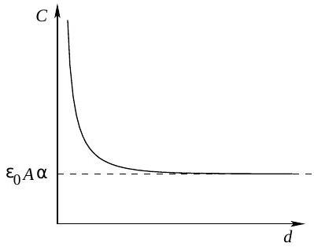
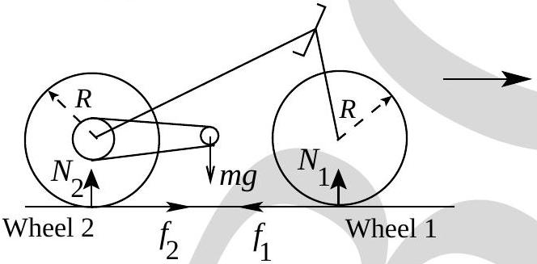
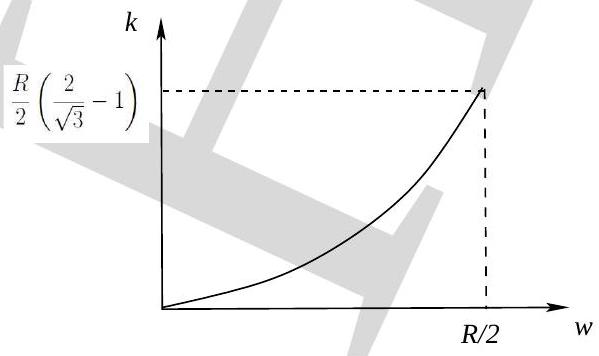
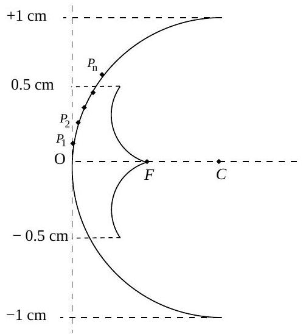
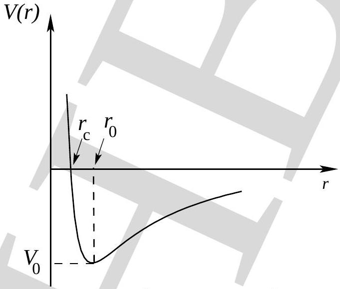

## Indian National Physics Olympiad - 2013 Solutions

PLEASE NOTE THAT ALTERNATE/EQUIVALENT SOLUTIONS MAY EXIST. Brief solutions are given below.

1. (a) $C = \frac { \epsilon _ { 0 } A \alpha } { 1 - e ^ { - \alpha d } }$
    (b) 
    (c) Charge $= \frac { \epsilon _ { 0 } A \alpha V } { 1 - e ^ { - \alpha d } }$
    (d) $\vec { E } ( x ) = \frac { \alpha V e ^ { - \alpha x } } { 1 - e ^ { - \alpha d } } \hat { x }$
2. (a) $\phi = \sin ^ { - 1 } \left( \frac { n h } { d \sqrt { 2 m _ { 0 } K } } \right)$
    (b) $d \approx 2.4 \AA$
3. (a) Here $f _ { 1 } , f _ { 2 }$ are frictional forces and $N _ { 1 } , N _ { 2 }$ are normal reactions.

(b) $a = \frac { \tau } { M R ^ { 2 } + 2 I } R$
(c) $a \leq \frac { \mu g / 2 } { \left( 1 - \frac { \mu } { 4 } \right) }$
(d) $a _ { m } = 2 g / 3$
4. (a) $k = \frac { R } { 2 } \left[ \frac { R } { \left( R ^ { 2 } - \omega ^ { 2 } \right) ^ { 1 / 2 } } - 1 \right]$
    (b) 

(c) 
5. (a) Torque $= \frac { 2 \mu _ { 0 } I ^ { 2 } \left( a ^ { 2 } + b ^ { 2 } \right) a b d \sin \phi } { \pi \left[ \left( a ^ { 2 } - b ^ { 2 } \right) ^ { 2 } + 4 a ^ { 2 } b ^ { 2 } \sin ^ { 2 } \phi \right] } \hat { z }$
    (b) $\phi = \alpha ; - \alpha ; \pi - \alpha ; \pi + \alpha$ where $\alpha = \sin ^ { - 1 } \left[ \left( a ^ { 2 } - b ^ { 2 } \right) / 2 a b \right]$
6. (a) $g ( r , \theta , \dot { r } , \dot { \theta } ) = \frac { F ( r ) } { m } + r \dot { \theta } ^ { 2 }$
    (b) From null azimuthal component
$$
\begin{aligned}
2 \dot { r } \dot { \theta } + r \ddot { \theta } & = 0 \\
\frac { d } { d t } \left( r ^ { 2 } \dot { \theta } \right) & = 0 \\
\frac { d } { d t } \left( m r ^ { 2 } \dot { \theta } \right) & = 0 \\
\frac { d } { d t } L & = 0 \\
= \text { constant } &
\end{aligned}
$$
    (c) $E = \frac { m \left( \dot { r } ^ { 2 } + r ^ { 2 } \dot { \theta } ^ { 2 } \right) } { 2 } - \frac { G M m } { r }$
    (d) $V ( r ) = \frac { L ^ { 2 } } { 2 m r ^ { 2 } } - \frac { G M m } { r }$
    (e) 
where $r _ { 0 } = \frac { L ^ { 2 } } { G M m ^ { 2 } } , r _ { c } = \frac { L ^ { 2 } } { 2 G M m ^ { 2 } }$ and $V _ { 0 } = - \frac { G ^ { 2 } M ^ { 2 } m ^ { 3 } } { 2 L ^ { 2 } }$
    (f) For $E > 0$ orbit is hyperbola. For $E < 0$ orbit is ellipse. At $r = r _ { o }$ orbit is circular.
    (g) $r _ { 0 } = \frac { L ^ { 2 } } { G M m ^ { 2 } }$

(h) $T _ { r } = 2 \pi \sqrt { \frac { r _ { 0 } ^ { 3 } } { G M } }$
(i) $n > - 3$
7. (a) $\Gamma _ { a } = \frac { \left( 1 - \gamma _ { a } \right) m _ { a } g } { \gamma _ { a } R }$ or $- \frac { m _ { a } g } { C _ { a } }$
where $\gamma _ { a } = 7 / 5$ (ratio of specific heats at constant pressure and volume) and $C _ { a }$ is molar specific heat at constant pressure for air.
$\left| \Gamma _ { a } \right| \approx 0.01 ^ { \circ } \mathrm { K } \cdot \mathrm { m } ^ { - 1 }$
    (b) $\Gamma _ { b } = - \frac { m _ { a } g T _ { b } } { C _ { b } T _ { a } }$
    (c) $\ddot { z } = g \left( \frac { m _ { a } T _ { b } } { T _ { a } m _ { b } } - 1 \right)$
    (d) $z _ { 0 } = \frac { T _ { 0 } } { \Gamma _ { a } } \left[ 1 - \left( \frac { m _ { b } } { m _ { a } } \right) ^ { 1 / ( \eta - 1 ) } \right]$
where $\eta = C _ { a } / C _ { b }$.
    (e) Condition: $C _ { a } > C _ { b }$
$\omega = g \sqrt { \frac { m _ { a } ( \eta - 1 ) } { C _ { a } T _ { 0 } } \left( \frac { m _ { a } } { m _ { b } } \right) ^ { 1 / ( \eta - 1 ) } }$
    (f) $\tau \approx 95 \mathrm {~s}$
