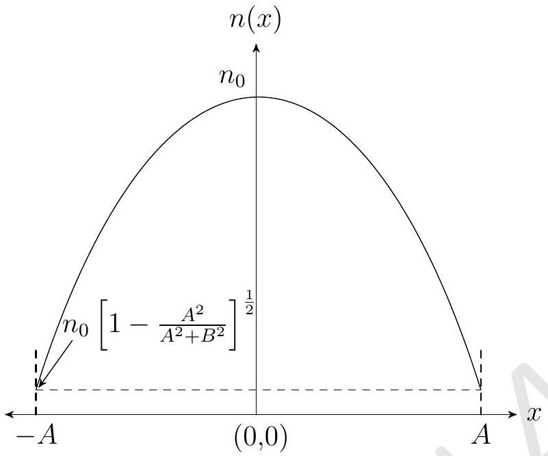

3. (a) Five vibrations of equal amplitudes are superposed first with all in phase agreement yielding intensity $I _ { 1 }$ and then with successive phase difference 30° yielding intensity $I _ { 2 }$. Calculate $I _ { 1 } / I _ { 2 }$.
Solution: Let $a$ be the amplitude of incident wave.
$$
\frac { I _ { 1 } } { I _ { 2 } } = \frac { A _ { 1 } ^ { 2 } } { A _ { 2 } ^ { 2 } } = \frac { 25 a ^ { 2 } } { ( 2 + \sqrt { 3 } ) ^ { 2 } a ^ { 2 } } = 1.8
$$
Here $A _ { 1 } , A _ { 2 }$ are amplitudes of resultant waves in two cases respectively.
(b) The trajectory of a ray in a non homogeneous medium is represented by $x = A \sin ( y / B )$ where $A$ and $B$ are positive constants. Compute the index of refraction $n$ in the space between the planes $x = A$ and $x = - A$, assuming that $n$ depends only on $x$ and has the value $n _ { 0 }$ at $x = 0$. Plot $n ( x )$ for $x \in [ - A , A ]$.

Solution: $n ( x ) = n _ { 0 } \left[ 1 - \frac { x ^ { 2 } } { A ^ { 2 } + B ^ { 2 } } \right] ^ { \frac { 1 } { 2 } }$

Plot of $n ( x )$ :

