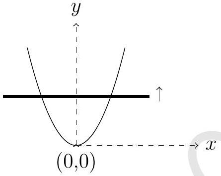
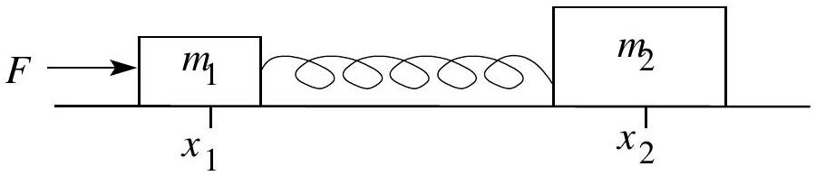
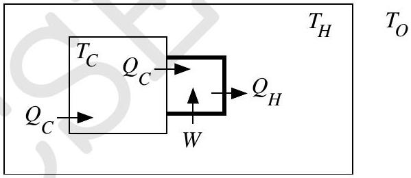
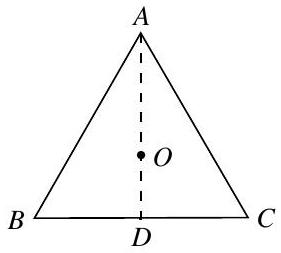
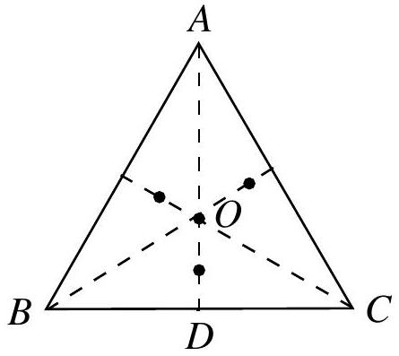
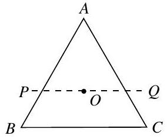
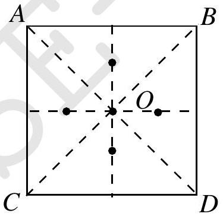
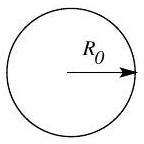
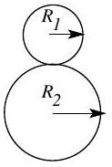
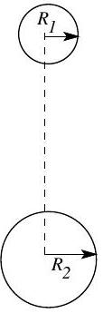

# Indian National Physics Olympiad - 2014 QUESTION PAPER \& SOLUTIONS

HOMI BHABHA CENTRE FOR SCIENCE EDUCATION Tata Institute of Fundamental Research V. N. Purav Marg, Mankhurd, Mumbai, 400088

1. A uniform metallic wire is bent in the form of a parabola and is placed on a horizontal nonconducting floor. A vertical uniform magnetic induction $B$ exists in the region containing the parabolic wire. A straight conducting rod (shown by thick line in the figure below), starting from rest at the vertex of the parabola at time $t = 0$, slides along the parabolic wire with its length perpendicular to the axis of symmetry of the parabola as shown in the figure. Take the equation of the parabola to be $y = k x ^ { 2 }$ where $k$ is a constant. Consider that rod always touches wire.

If the rod moves with a constant speed $v$,

(a) obtain an expression for the induced emf $\left( \epsilon _ { 1 } \right)$ in terms of time $t$. Solution: $\epsilon _ { 1 } ( t ) = 2 v B \sqrt { \frac { v t } { k } }$
(b) Assuming that the rod has resistance $\lambda$ per unit length, obtain current $\left( I _ { 1 } \right)$ in the rod as a function of time. Assume that the parabolic wire has no resistance. Solution: $I _ { 1 } = \frac { B v } { \lambda }$
(c) Obtain the power needed to keep the rod moving with constant speed $v$. Solution: Power $= \frac { 2 B ^ { 2 } v ^ { 2 } } { \lambda } \sqrt { \frac { v t } { k } }$
2. Two blocks of masses $m _ { 1 } = 1.0 \mathrm {~kg}$ and $m _ { 2 } = 2.0 \mathrm {~kg}$ are connected by a massless elastic spring and are at rest on a smooth horizontal surface with the spring at its natural length. A horizontal force of constant magnitude $F = 6.0 \mathrm {~N}$ is applied to the block $m _ { 1 }$ for a certain time $t$ in which $m _ { 1 }$ suffers a displacement $\Delta x _ { 1 } = 0.1 \mathrm {~m}$ and $\Delta x _ { 2 } = 0.05 \mathrm {~m}$. Kinetic energy of the system with respect to center of mass is 0.1 J. The force $F$ is then withdrawn. [Marks:

(a) Calculate $t$. $\left[ 1 \frac { 1 } { 2 } \right]$
Solution:
$$
\begin{aligned}
t & = \sqrt { \frac { 2 \left( m _ { 1 } \Delta x _ { 1 } + m _ { 2 } \Delta x _ { 2 } \right) } { F } } \\
& = 0.26 \mathrm {~s}
\end{aligned}
$$
(b) Calculate the speed and the kinetic energy of the center of mass after the force is withdrawn.
Solution:
$$
\begin{aligned}
\text { Speed } & = \frac { \sqrt { 2 F \left( m _ { 1 } \Delta x _ { 1 } + m _ { 2 } \Delta x _ { 2 } \right) } } { m _ { 1 } + m _ { 2 } } \\
& = 0.52 \mathrm {~m} \cdot \mathrm {~s} ^ { - 1 } \\
\text { Kinetic energy } & = \frac { F \left( m _ { 1 } \Delta x _ { 1 } + m _ { 2 } \Delta x _ { 2 } \right) } { m _ { 1 } + m _ { 2 } } \\
& = 0.40 \mathrm {~J}
\end{aligned}
$$
(c) Calculate the energy stored in the system. $\left[ 2 \frac { 1 } { 2 } \right]$
Solution:
$$
\begin{aligned}
\text { Kinetic energy w.r.t. } \mathrm { CM } + \text { Energy stored } & = \frac { m _ { 2 } \left( \Delta x _ { 1 } - \Delta x _ { 2 } \right) } { m _ { 1 } + m _ { 2 } } F \\
& = 0.20 \mathrm {~J} \\
\text { Energy stored } & = 0.10 \mathrm {~J}
\end{aligned}
$$
Alternatively : 0.60 J is also accepted as correct answer.
3. (a) Five vibrations of equal amplitudes are superposed first with all in phase agreement yielding intensity $I _ { 1 }$ and then with successive phase difference 30° yielding intensity $I _ { 2 }$. Calculate $I _ { 1 } / I _ { 2 }$.
Solution: Let $a$ be the amplitude of incident wave.
$$
\frac { I _ { 1 } } { I _ { 2 } } = \frac { A _ { 1 } ^ { 2 } } { A _ { 2 } ^ { 2 } } = \frac { 25 a ^ { 2 } } { ( 2 + \sqrt { 3 } ) ^ { 2 } a ^ { 2 } } = 1.8
$$
Here $A _ { 1 } , A _ { 2 }$ are amplitudes of resultant waves in two cases respectively.
(b) The trajectory of a ray in a non homogeneous medium is represented by $x = A \sin ( y / B )$ where $A$ and $B$ are positive constants. Compute the index of refraction $n$ in the space between the planes $x = A$ and $x = - A$, assuming that $n$ depends only on $x$ and has the value $n _ { 0 }$ at $x = 0$. Plot $n ( x )$ for $x \in [ - A , A ]$.

Solution: $n ( x ) = n _ { 0 } \left[ 1 - \frac { x ^ { 2 } } { A ^ { 2 } + B ^ { 2 } } \right] ^ { \frac { 1 } { 2 } }$

Plot of $n ( x )$ :

4. It is well known that the temperature of a closed room goes up if the refrigerator is switched on inside it. A refrigerator compartment set to temperature $T _ { C }$ is turned on inside a hut in Leh (Ladakh). The atmosphere (outside the hut) can be considered to be a vast reservoir at constant temperature $T _ { O }$. Walls of hut and refrigerator compartment are conducting. The temperature of the refrigerator compartment is maintained at $T _ { C }$ with the help of a compressor engine. We explain the working of the refrigerator engine and the heat flow with the help of the associated figure.

The larger square is the refrigerator compartment with heat leak per unit time $Q _ { C }$ into it from the room. The same heat per unit time $Q _ { C }$ is pumped out of it by the engine (also called compressor and indicated by the smaller square in thick). The compressor does work $W$ and rejects heat per unit time $Q _ { H }$ into the hut. The thermal conductance (in units of watt per kelvin) of the walls of the compartment and hut respectively are $K _ { C }$ and $K _ { H }$. After a long time it is found that temperature of the hut is $T _ { H }$. The compressor works as a reverse Carnot engine and it does not participate in heat conduction process. [Marks:
(a) State the law of heat conduction for the walls of the hut and the refrigerator compartment.
Solution:
$$
\begin{aligned}
\text { For hut : } Q _ { H } - Q _ { C } & = K _ { H } \left( T _ { H } - T _ { O } \right) \\
\text { For refrigerator compartment: } Q _ { C } & = K _ { C } \left( T _ { H } - T _ { C } \right)
\end{aligned}
$$
(b) We define the dimensionless quantities $k = K _ { H } / K _ { C } , h = T _ { H } / T _ { O }$ and $c = T _ { C } / T _ { O }$. Express $h$ is terms of $c$ and $k$.

Solution:

$$
\begin{aligned}
& h ^ { 2 } - h ( 2 c + k c ) + c ^ { 2 } + k c = 0 \\
& h = \frac { ( 2 c + k c ) \pm \sqrt { ( 2 c + k c ) ^ { 2 } - 4 \left( c ^ { 2 } + k c \right) } } { 2 }
\end{aligned}
$$

(c) Calculate stable temperature $T _ { H }$ given $T _ { O } = 280.0 \mathrm {~K} , T _ { C } = 252.0 \mathrm {~K}$ and $k = 0.90$.
Solution: $h = 1.02$ (choosing - sign) $\Rightarrow T _ { H } = 284.7 \mathrm {~K}$
(d) Now another identical refrigerator is put inside the hut. $T _ { C }$ and $T _ { O }$ do not change but $T _ { H }$, the hut temperature will change to $T _ { H } ^ { \prime }$. State laws of heat conduction for hut and one of the two identical refrigerator compartments.
Solution:
$$
\text { For hut: } 2 \left( Q _ { H } ^ { \prime } - Q _ { C } ^ { \prime } \right) = K _ { H } \left( T _ { H } ^ { \prime } - T _ { O } \right)
$$
For refrigerator compartment : $Q _ { C } ^ { \prime } = K _ { C } \left( T _ { H } ^ { \prime } - T _ { C } \right)$
(e) Assume that the dimensionless quantities $k$ and $c$ do not change. Let $h ^ { \prime } = T _ { H } ^ { \prime } / T _ { O }$. Obtain an expression for $h ^ { \prime }$.

Solution:

$$
\begin{aligned}
& h ^ { \prime 2 } - h ^ { \prime } \left( 2 c + \frac { k } { 2 } c \right) + c ^ { 2 } + \frac { k } { 2 } c = 0 \\
& h ^ { \prime } = \frac { \left( 2 c + \frac { k } { 2 } c \right) \pm \sqrt { \left( 2 c + \frac { k } { 2 } c \right) ^ { 2 } - 4 \left( c ^ { 2 } + \frac { k } { 2 } c \right) } } { 2 }
\end{aligned}
$$

5. Several men of equal mass are standing on a stationary railroad cart such that the combined [3] mass of all men is equal to the mass of the empty cart. A rumour that a bomb is on the left half of the cart, however, leads to chaos and and consequently these men start jumping off the cart to the right, with equal velocities relative to the cart. Find approximately the ratio of the speed $\left( v _ { o } \right)$ that the cart would acquire if all men jump one after the other to the speed $\left( v _ { a } \right)$ that it would acquire if all of them jump simultaneously off the cart. There is no friction between the cart and the ground.
Hint: In calculating the value of the ratio, you should make use of the fact there are a large number of men.

Solution:

$$
\begin{aligned}
& v _ { o } \approx u \ln 2 , v _ { a } = u / 2 \\
& \frac { v _ { o } } { v _ { a } } = 2 \ln 2
\end{aligned}
$$

6. Consider an equilateral triangle ABC of side $2 a$ in the plane of the paper as shown. The centroid of the triangle is $O$. Equal charges $( Q )$ are fixed at the vertices $A , B$ and $C$. In what follows consider all motion and situations to be confined to the plane of the paper.
[Marks: 11]

    (a) A test charge $( q )$, of same sign as $Q$, is placed on the median AD at a point at a distance $\delta$ below $O$. Obtain the force $( \vec { F } )$ felt by the test charge.
Solution: $\vec { F } = \frac { 2 K Q q \left( \frac { a } { \sqrt { 3 } } - \delta \right) } { \left( a ^ { 2 } + \left( \frac { a } { \sqrt { 3 } } - \delta \right) ^ { 2 } \right) ^ { 3 / 2 } } - \frac { K Q q } { \left( \frac { 2 a } { \sqrt { 3 } } + \delta \right) ^ { 2 } }$
Here $K = 1 / 4 \pi \epsilon _ { 0 }$ and direction is upward (towards $A$ ).
    (b) Assuming $\delta \ll a$ discuss the motion of the test charge when it is released.
Solution: Using binomial approximation, $\vec { F } = K Q q \frac { 9 \sqrt { 3 } } { 16 } \frac { \delta } { a ^ { 3 } }$ (upward) which is linear in $\delta$. Hence charge will oscillate simple harmonically about $O$ when released.
    (c) Obtain the force ( $\vec { F } _ { D }$ ) on this test charge if it is placed at the point $D$ as shown in the figure.
Solution: $\vec { F } _ { D } = \frac { K Q q } { 3 a ^ { 2 } }$ (downward)
    (d) In the figure below mark the approximate locations of the equilibrium point(s) for this system. Justify your answer.
Solution: For small $\delta$ force on the test charge is upwards while for large $\delta$ (eg. at $D$ ) force is downwards. So there is a neutral point between $O$ and $D$. By symmetry there will be neutral points on other medians also. In figure below all possible (4) neutral points are shown by •

(e) Is the equilibrium at $O$ stable or unstable if we displace the test charge in the direction of $O P$ ? The line $P Q$ is parallel to the base $B C$. Justify your answer.

Solution: Let the distance along $P$ be $x$ and $O$ to be at $( 0,0 )$. Electric potential of a test charge along $O P$ can be written as

$$
\begin{aligned}
V ( x ) & = \frac { K Q } { \sqrt { x ^ { 2 } + ( 4 / 3 ) } } + \frac { K Q } { \sqrt { ( x + 1 ) ^ { 2 } + ( 1 / 3 ) } } + \frac { K Q } { \sqrt { ( x - 1 ) ^ { 2 } + ( 1 / 3 ) } } \\
& \approx K Q \sqrt { \frac { 3 } { 4 } } \left( 3 + \frac { 9 } { 16 } x ^ { 2 } \right)
\end{aligned}
$$

We can see that $V ( x ) \propto x ^ { 2 }$, hence it is a stable equilibrium.

(f) Consider a rectangle $A B C D$. Equal charges are fixed at the vertices $A , B , C$, and $D . O$ is the centroid. In the figure below mark the approximate locations of all the neutral points of the system for a test charge with same sign as the charges on the vertices. Dotted lines are drawn for the reference.

Solution: Equilibrium points are indicated by •

(g) How many neutral points are possible for a system in which $N$ charges are placed at the $N$ vertices of a regular $N$ sided polygon?

Solution: $N + 1$

7. Bohr-Wheeler fission limit: Using the liquid drop model for the nucleus, Bohr and Wheeler established in 1939 a natural limit for $Z ^ { 2 } / A$ beyond which nuclei are unstable against spontaneous fission, where $Z$ and $A$ are the atomic and nucleon numbers respectively. In the following problem we will estimate this limit.
Consider the liquid drop model of a nucleus where the total energy of the nucleus is considered to be sum of surface energy $U _ { A }$ and electrostatic energy $U _ { E } . U _ { A }$ can be expressed as $U _ { A } = a _ { S } R ^ { 2 }$ where $a _ { S }$ is a dimensioned proportionality constant and $R$ is the radius of the nucleus. In what follows we take the nucleus to be spherical with its radius $R = r _ { 0 } A ^ { 1 / 3 }$ where $r _ { 0 } = 1.2 \mathrm { fm } \left( 1 \mathrm { fm } = 10 ^ { - 15 } \mathrm {~m} \right)$. Consider the case of a nucleus of radius $R _ { 0 }$, atomic mass $A$ and atomic number $Z$ undergoing a fission reaction and breaking into two daughter nuclei of radii $R _ { 1 }$ and $R _ { 2 }$ as shown in figure below. We define the mass ratio of fission

products 1 to 2 as $f$. Assume that mass density and charge density of parent and daughter nuclei are same.
[Marks: 13]

(a) Original nucleus

(b) Moment of fission

(c) Large separation

(a) Estimate the nuclear mass density $\left( \rho _ { n } \right)$ assuming $m _ { p } = m _ { n }$.
Solution: $\rho _ { n } \approx 10 ^ { 17 } \mathrm {~kg} / \mathrm { m } ^ { - 3 }$
(b) The sum of the surface energies of the fissioned daughter nuclei can be written as $U _ { A } ^ { \mathrm { d } } = a _ { S } R _ { 0 } ^ { 2 } \alpha$. Obtain $\alpha$ in terms of $f$.
Solution: $\alpha = \frac { 1 + f ^ { 2 / 3 } } { ( 1 + f ) ^ { 2 / 3 } }$
(c) Obtain the total electrostatic energy $U _ { E } ^ { \mathrm { p } }$ of parent nuclei in terms of given parameters and relevant universal constants.
Solution: $U _ { E } ^ { \mathrm { p } } = \frac { 3 e ^ { 2 } Z ^ { 2 } } { 5 \left( 4 \pi \epsilon _ { 0 } r _ { 0 } A ^ { 1 / 3 } \right) }$
(d) Calculate $U _ { E } ^ { \mathrm { p } }$ (in MeV) in terms of $Z$ and $A$ only.
Solution: $U _ { E } ^ { \mathrm { p } } = 0.72 Z ^ { 2 } A ^ { - 1 / 3 } \mathrm { MeV }$
(e) i. Obtain the total electrostatic energy $U _ { E } ^ { \mathrm { d } }$ of daughter nuclei just after the fission i.e. at the instance shown in Fig. (b).
Solution: $\left. U _ { E } ^ { \mathrm { d } } = \frac { 3 e ^ { 2 } } { 5 \left( 4 \pi \epsilon _ { 0 } r _ { 0 } \right. } \right) \left( \frac { Z _ { 1 } ^ { 2 } } { A _ { 1 } ^ { 1 / 3 } } + \frac { Z _ { 2 } ^ { 2 } } { A _ { 2 } ^ { 1 / 3 } } + \frac { 5 } { 3 } \frac { Z _ { 1 } Z _ { 2 } } { A _ { 1 } ^ { 1 / 3 } + A _ { 2 } ^ { 1 / 3 } } \right)$
Here $Z _ { 1 } , R _ { 1 }$ are atomic number and radius of daughter nuclei.
ii. $U _ { E } ^ { \mathrm { d } }$ can be simplified and written in terms of $U _ { E } ^ { \mathrm { p } }$ i.e. in terms of electrostatic energy of parent nucleus as $U _ { E } ^ { \mathrm { d } } = \beta U _ { E } ^ { \mathrm { p } }$ where $\beta$ depends solely on $f$. Obtain $\beta$.
Solution: $\beta = \frac { 1 + f + f ^ { 1 / 3 } + f ^ { 2 } + f ^ { 5 / 3 } } { ( 1 + f ) ^ { 5 / 3 } \left( 1 + f ^ { 1 / 3 } \right) }$

(f) Surface energy calculation
    i. Energy $Q$ released in fission is described as the difference in energy between the instances shown in Fig. (a) and Fig. (c) i.e. parent nuclei and product nuclei separated by a very large distance. Obtain the expression for $a _ { S }$ in terms of $\{ Q ( \mathrm { inMeV } ) , Z , A , \alpha , \gamma \}$, where $A$ and $Z$ refer to the parent nucleus. Here $\gamma$ depends solely on $f$.
$$
\text { Solution: } a _ { S } = \frac { Q - 0.72 ( 1 - \gamma ) Z ^ { 2 } A ^ { - 1 / 3 } } { r _ { 0 } ^ { 2 } A ^ { 2 / 3 } ( 1 - \alpha ) } \text { where } \gamma = \frac { 1 + f ^ { 5 / 3 } } { ( 1 + f ) ^ { 5 / 3 } }
$$
        ii. Assuming that the above expression holds, calculate $a _ { S }$ (in units of MeV/fm ${ } ^ { 2 }$ ) for the following reaction with $Q$ value 173.2 MeV:
$$
{ } _ { 0 } ^ { 1 } n + { } _ { 92 } ^ { 235 } \mathrm { U } \rightarrow { } _ { 56 } ^ { 141 } \mathrm { Ba } + { } _ { 36 } ^ { 92 } \mathrm { Kr } + 3 \left( { } _ { 0 } ^ { 1 } n \right)
$$
Solution: $a _ { S } = 12.7 \mathrm { MeV } / \mathrm { fm } ^ { - 2 }$.
(g) General $Z ^ { 2 } / A$ limit Condition for fission to occur can be expressed as $\frac { Z ^ { 2 } } { A } > C$ where $C$ depends on $a _ { S }$ and $f$. Obtain $C$.
Solution: $\frac { Z ^ { 2 } } { A } > \frac { \alpha - 1 } { ( 1 - \gamma ) } \frac { a _ { S } r _ { 0 } ^ { 2 } } { 0.72 \mathrm { MeV } }$
(h) Assume that $a _ { S }$ is a constant function of $f$, using the value of $a _ { S }$ obtained in part f(ii), calculate the minimum value of $C$.

Solution: $Z ^ { 2 } / A$ limit is matter of fundamental physics. If we define $f$ as mass ratio of fission products 2 to 1 then for spontaneous fission this $f$ should be equally valid. It is possible only if $f = 1 / f$ which gives $f = 1$. Hence $C = 1.4 a _ { S } = 17.6$

8. A conducting wire frame of single turn in the shape of a rectangle $A B C D$ (sides $A B = a$, $B C = b$ ) is free to rotate about the side $A B$ which is horizontal. Initially, the frame is held in a horizontal plane and a steady current $i$ (clockwise as seen from above) is switched on in the wire and then the frame is released (still free to rotate about $A B$ ). Find the magnitude and direction of the minimum uniform magnetic field necessary to keep the frame horizontal. The origin of the coordinate system is at $A$ and $A B$ lies along the direction of the $+ x$ axis. Take the mass of the wire per unit length as $\lambda$ and the acceleration due to gravitational field to be $g \hat { k }$. Here $\hat { k }$ is unit vector in $+ z$ direction.

Solution: Minimum magnetic field $= \frac { \lambda ( a + b ) g } { i a }$ which is in the direction of $+ y$ or $- y$ axis.
