Roll No.

Q1.a A particle of mass m slides along a frictionless track, fixed in the horizontal plane, of the form $r = \varnothing \exp ( - a \theta )$ where $a$ is a positive constant. Its initial speed at $t = 0$ is $v _ { 0 }$ when $\theta = 0$. Recall that in polar coordinates $\boldsymbol { r } = r \boldsymbol { r } , \frac { d \boldsymbol { r } } { d t } = \boldsymbol { v } = \frac { d r } { d t } \boldsymbol { r } + r \frac { d \theta } { d t } \theta , \boldsymbol { r }$ and $\boldsymbol { \theta }$ are unit vectors in the radial direction and a direction perpendicular to $\boldsymbol { r }$ respectively.
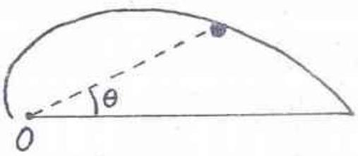
(i) Find the $\theta$ dependence of both the speed and the angle $\alpha$ that the velocity vector makes with the radial line connecting origin O with the particle. (2 + 2)

Only force acting on the particle is the Normal force N which does no work. (1)

Thus $\mathrm { v } _ { \mathrm { v } }$ throughout.
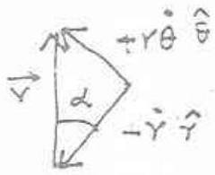
Let $\alpha$ be the angle made by the velocity vector with the radial ( $\tan \alpha \frac { d \theta } { d t } r - \frac { d r } { d t } = 1 / \mathrm { a }$ and hence is a constant. (2)
$v ( \theta ) = \operatorname { constant }$ and independent of $\theta$
$\alpha ( \theta ) =$ constant $= { } ^ { - 1 } 1$ and and nondent of $\theta$

Roll No.

(ii) Obtain an expression for the rate of change of angular momentum $\frac { d L } { d t }$ about O in terms of $\alpha$ and other related quantities. (4)

Angular momentum about $\mathrm { O } : L$ - in directed out of the plane of motic

$$
\begin{equation*}
\frac { d L } { d t } = m \frac { d r } { d t } v _ { 0 } \sin \alpha = - n { } ^ { 2 } v \sin \alpha \cos \alpha \tag{3}
\end{equation*}
$$

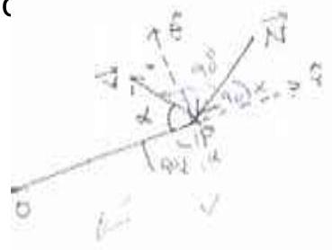

$$
\mathrm { dL } / \mathrm { dt } = - m _ { 0 } ^ { 2 } \sin \alpha \cos \alpha
$$

( iii) ) Obtain an expression for the normal force N exerted by the track on the particle in terms of $\theta , \alpha$ and other related quantities. (2)

Torque about O: $\tau = - N r \cos \alpha$
Hence $N = \frac { m v v _ { 0 } ^ { 2 } } { r _ { 0 } \frac { 1 + a ^ { 2 } } { 1 + 1 } } e ^ { a \theta }$

$$
\mathrm { N } ( \theta ) = \frac { m v _ { 0 } ^ { 2 } } { r _ { 0 } \frac { 1 } { 1 + a ^ { 2 } } } e ^ { a \theta }
$$

Roll No.

Q 1 b) A cylinder of mass $M$ and radius $R$ is placed on an inclined plane with angle of inclination $\theta$. The inclined plane has acceleration $a _ { 0 }$ with respect to an inertial frame as shown in the figure.
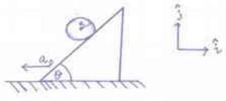
Assuming the cylinder rolls without slipping,
(i) Draw the free body diagram of the cylinder in the frame of the inclined plane. (2)
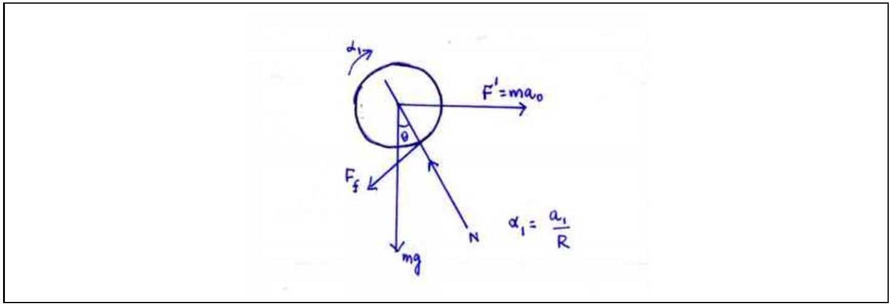
(ii) Find the acceleration $\boldsymbol { a }$ of the center of mass of the cylinder with respect to an inertial frame. (8)

Choose the noninertial frame of the inclined plane. Let the acceleration of the cylinder in this fra $a _ { 1 }$ and the angular acceleration $\alpha$

$$
\begin{align*}
& N - m g \cos \theta - F ^ { \prime } \sin \theta = 0  \tag{1}\\
& - m g \sin \theta + F ^ { \prime } \cos \theta - F _ { f } = m a _ { 1 }  \tag{1}\\
& F _ { f } R = I \alpha _ { 1 } = > _ { f } F = \frac { M } { 2 } a _ { 1 } \tag{2}
\end{align*}
$$

Since $F = m a _ { 0 }$

$$
\begin{align*}
& m a _ { 0 } \cos \theta - m g \sin \theta - \frac { M } { 2 } a _ { 1 } = M a _ { 1 } \\
& = > _ { 1 } a = \frac { 2 } { 3 } \left( a _ { 0 } \cos \theta - g \sin \theta \right) \tag{2}
\end{align*}
$$

Thus $a = { } _ { 1 } a + \theta \quad \quad _ { 1 } c _ { 1 } \cos \theta - a _ { 0 } i + a _ { 1 } \sin \theta j$ (2)

$$
\boldsymbol { a } = a _ { 1 } \cos \theta - a _ { 0 } i + a _ { 1 } \sin \theta j \text { where } \mu = \frac { 2 } { 3 } \left( a _ { 0 } \cos \theta - g \sin \theta \right)
$$

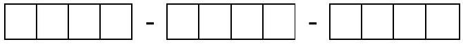

Q 2a) An uncharged solid spherical conductor of radius R has its centre at the origin of a cartesian frame OXY Z. Two point charges each of +Q are placed at fixed positions at (5R/2, 0, 0) and (0, 0, 3R/2). There will be induced charges on the sphere due to these charges.
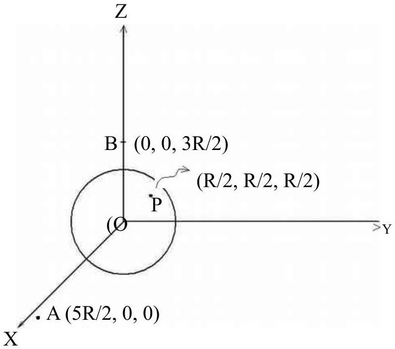
(i) Find the electric field $\boldsymbol { E }$ at point $\mathrm { P } ( \mathrm { R } / 2 , \mathrm { R } / 2 , \mathrm { R } / 2 )$ due to the induced charges. (4)

The vector distance from A to $\boldsymbol { P } _ { \boldsymbol { A } \boldsymbol { P } } = - 2 \mathrm { R } \boldsymbol { i } + \mathrm { R } / 2 \boldsymbol { j } + \mathrm { R } / 2 \boldsymbol { k }$ (0.5)

The vector distance from B to $\mathrm { P } \boldsymbol { r } _ { \boldsymbol { B } \boldsymbol { P } } = \mathrm { R } / 2 \boldsymbol { i } + \mathrm { R } / 2 \boldsymbol { j } - \mathrm { R } \boldsymbol { k }$ (0.5)
Electric field at P due to charge at B $\boldsymbol { E } _ { \boldsymbol { B } } = \mathrm { Q } / \left( 4 \pi \varepsilon _ { 0 } \right) \left( \boldsymbol { r } _ { \boldsymbol { B } \boldsymbol { P } } / \left| \boldsymbol { r } _ { \boldsymbol { B } \boldsymbol { P } } \right| ^ { 3 } \right)$ (0.5)
Electric field at P due to charge at $\mathrm { A } \boldsymbol { E } _ { \boldsymbol { A } } = \mathrm { Q } / \left( 4 \pi \varepsilon _ { 0 } \right) \left( \boldsymbol { r } _ { \boldsymbol { A } \boldsymbol { P } } / \left| \boldsymbol { r } _ { \boldsymbol { A } \boldsymbol { P } } \right| ^ { 3 } \right)$ (0.5)

Electric field at P due to charges at A and B $\boldsymbol { E } _ { \boldsymbol { P } } = \boldsymbol { E } _ { \boldsymbol { A } } + \boldsymbol { E } _ { \boldsymbol { B } }$ (0.5)
$\boldsymbol { E } _ { \boldsymbol { P } } = 2 ^ { 3 / 2 } \mathrm { Q } / \left( 4 \pi \varepsilon _ { 0 } \mathrm { R } ^ { 2 } \right) \left( \left( 9 / 2 - 2 \times 3 ^ { 1 / 2 } \right) \boldsymbol { i } + \left( 9 / 2 + 3 ^ { 1 / 2 } \right) \boldsymbol { j } + \left( 9 - 3 ^ { 1 / 2 } \right) \boldsymbol { k } \right)$ (0.5)

Total field inside a conductor is 0 , thus induced field at $\mathrm { P } \boldsymbol { E } = - \boldsymbol { E } _ { \boldsymbol { P } }$ (1.0)

$$
\boldsymbol { E } = - \frac { Q } { 4 \pi \varepsilon _ { 0 } R ^ { 2 } } \frac { 2 \overline { 2 } } { 27 \overline { 3 } } \left( - 2 \overline { 3 } + \frac { 9 } { 2 } \boldsymbol { i } + \frac { \overline { 3 } } { 2 } + \frac { 9 } { 2 } \boldsymbol { j } + \frac { \overline { 3 } } { 2 } - 9 \boldsymbol { k } \right)
$$

(ii) What is the electric potential V at point P due to the induced charges? (0.5)
Thus the potential at any point is the same as the potential $\mathrm { V } ( 0.0,0 )$ at ( $0,0,0$ )

$$
\begin{equation*}
\mathrm { V } ( 0,0,0 ) = \mathrm { Q } / \left( 4 \pi \varepsilon _ { 0 } \mathrm { R } \right) ( 2 / 3 + 2 / 5 ) = 16 / 15 \left( \mathrm { Q } / \left( 4 \pi \varepsilon _ { 0 } \mathrm { R } \right) \right) \tag{1}
\end{equation*}
$$

$$
\begin{equation*}
\text { Potential at } P V ( R / 2 , R / 2 , R / 2 ) = 16 / 15 \left( Q / \left( 4 \pi \varepsilon _ { 0 } R \right) \right) = V _ { A } + V _ { B } + V \tag{0.5}
\end{equation*}
$$

$$
\begin{equation*}
\mathrm { V } _ { \mathrm { A } } = \mathrm { Q } / \left( 4 \pi \varepsilon _ { 0 } \mathrm { R } \right) ( 2 / 9 ) ^ { 1 / 2 } \tag{0.5}
\end{equation*}
$$

$$
\begin{equation*}
\mathrm { V } _ { \mathrm { B } } = \mathrm { Q } / \left( 4 \pi \varepsilon _ { 0 } \mathrm { R } \right) ( 2 / 3 ) ^ { 1 / 2 } \tag{0.5}
\end{equation*}
$$

$$
\begin{equation*}
\mathrm { V } = \mathrm { Q } / \left( 4 \pi \varepsilon _ { 0 } \mathrm { R } \right) \left( 16 / 15 - ( 2 / 9 ) ^ { 1 / 2 } - ( 2 / 3 ) ^ { 1 / 2 } \right) \tag{1.0}
\end{equation*}
$$

$$
\mathrm { V } = \mathrm { Q } / \left( 4 \pi \varepsilon _ { 0 } \mathrm { R } \right) \left( 16 / 15 - ( 2 / 9 ) ^ { 1 / 2 } - ( 2 / 3 ) ^ { 1 / 2 } \right)
$$

Roll No.

Q2b) ( i) Consider two point charges Q and Q1 at the points (0,0,d) and (0,0,b) with $\mathrm { d } > \mathrm { b }$. Express Q1 and b in terms of Q, d and R such that the equipotential surface with 0 potential is a sphere of radius R for d>R.
(2 + 2)
The potential at any point $\mathrm { P } ( \mathrm { x } , \mathrm { y } , \mathrm { z } )$ is

$$
\mathrm { V } = 1 / 4 \Gamma _ { 6 } \mathrm {~g} _ { \mathrm { Q } } 1 / \mathfrak { s } + \mathrm { Q } _ { 4 } { } _ { 4 }
$$

If the point P is to lie on the surface of a sphere of radius R with 0 potent $\mathrm { Q } 1 / \left( \mathrm { b } + \vec { R } - 2 \mathrm { bRCos } \theta ^ { 2 } f = - \mathrm { Q } / \mathrm { R } ^ { 2 } + \mathrm { R } - 2 \mathrm { Rd } \operatorname { Cos } ^ { 2 } \theta ^ { 2 } \right.$
This must be true for the points of the sphere on the z axis at $\theta = 0$ and At $\theta = 0$

$$
\mathrm { Q } 1 / ( \mathrm { b } - \mathrm { R } ) = - \mathrm { Q } / ( \mathrm { d } - \mathrm { R } )
$$

At $\theta = \pi$.

$$
\begin{equation*}
Q 1 / ( b + R ) = - Q / ( d + R ) \tag{0.5}
\end{equation*}
$$

i.e.Q1 d - Q1R = -Qb + QR Thus b>>R
Q1d+Q1R = -Qb -QR
Which implies that Q1d $= - 2 Q b$
Q1 = -Qb/d
Further $- 2 \mathrm { Q } 1 \mathrm { R } = - 2 \mathrm { Qr }$
Thus Q1 =- Q
Contradiction and hence $\mathrm { b } < \mathrm { R }$
Thus at $\theta = 0$
Q1/(R-b) = -Q/(d-R)
Thus Q1=-Q R/d
Further Q1 = -Qb/R

$$
\begin{equation*}
\text { Thus } \mathrm { b } = 2 / \mathrm { R } \tag{0.5}
\end{equation*}
$$

With this choice at any $\theta$

$$
\begin{equation*}
V = 1 / 4 \text { I』દ } \left( - \mathrm { QR } / \mathrm { d } { } ^ { 2 } \mathrm { Pd } ^ { 2 } + { } ^ { 2 } - 2 \mathrm { bRCos } { } ^ { 2 } + \mathrm { Q } / \left( { } ^ { 2 } d + \mathrm { R } ^ { 2 } - 2 \operatorname { Rd } \operatorname { Cos } ^ { 2 } { } ^ { 2 } \right) = 0 \right. \tag{0.5}
\end{equation*}
$$

$$
\begin{aligned}
& \mathrm { Q } 1 = - \mathrm { QR } / \mathrm { d } \\
& \mathrm {~b} = \mathrm { R } ^ { 2 } / \mathrm { d }
\end{aligned}
$$

(ii) Consider a point charge Q at (0,0,d) near a grounded spherical conductor of radius $\mathrm { R } < \mathrm { d }$. What is the electric field $\boldsymbol { E }$ on the charge Q due to the induced charges on the sphere?
From the earlier problem, this problem is electrostatically identical with a charge Q at (0,0,d) and charge -QR/d at $\left( 0 ^ { 2 } / \mathrm { d } \right) \mathrm { R }$ Thus the electric field at Q is

$$
\begin{aligned}
\mathbf { E } & = 1 / 4 \pi \varepsilon \left( \mathrm { QR } / \mathrm { d } \left( 1 / \left( { } ^ { 2 } - \mathbb { R R } ^ { 2 } \right) / \mathrm { d } \right) ^ { 2 } ( - \mathbf { z } ) \right. \\
& = 1 / 4 \pi \varepsilon \left( \operatorname { RdQ } / \left( \mathrm { QAR } ^ { 2 } \right) ^ { 2 } \right) ( - \mathbf { z } )
\end{aligned}
$$

$$
\boldsymbol { E } = 1 / 4 \Gamma _ { \Theta } \varepsilon \left( \mathrm { RdQ } / \left( \mathrm { AlR } ^ { 2 } \right) ^ { 2 } \right) ( - \mathbf { z } )
$$

Using the superposition principle the problem is equivalent to Q at $\left( 0,0 , \mathrm {~d} ^ { \mathrm { z } } \right) \mathrm { d } \rightarrow \mathrm { QR } / \mathrm { dL }$ at $( 0,0 , \mathrm { R }$ $4 \pi { } ^ { \mathrm { g } } \mathrm { VR }$ at ( $0,0,0$ ) .
The total charge on the sphere is

$$
q = 4 \Gamma _ { \varpi } \dot { \otimes } / R - Q R / d
$$

q =4π६VR -QR/d
(ii)Find the force $\boldsymbol { F }$ on the charge Q.

The electric field at $( 0,0 , \mathrm {~d} )$ is

$$
\begin{equation*}
\mathbf { E } = 1 / 4 _ { b } \left( \varepsilon \left( R d Q / R ^ { 2 } \in R ^ { 2 } \right) ^ { 2 } ( - \mathbf { z } ) + 4 \delta l * R / d ( \mathbf { z } ) \right) \tag{0.5}
\end{equation*}
$$

Now $\mathrm { q } = 4 _ { \mathrm { d } } d \not E R - \mathrm { QR } / \mathrm { d }$
Hence the force on Q is

$$
\begin{equation*}
F = Q / 4 d ( \varepsilon q + Q R / d ) ^ { 2 } / d \left( Q R / d \left( d { } ^ { 2 } p d \right) ^ { 2 } \right) z \tag{0.5}
\end{equation*}
$$

$$
F = \mathrm { Q } / 4 \pi \delta \left( ( \mathrm { q } + \mathrm { QR } / \mathrm { d } ) ^ { 2 } / \mathrm { d } \mathrm { QR } / \mathrm { d } \left( \mathrm {~d} ^ { 2 } \mathrm { Pd } \right) ^ { 2 } \right) \mathrm { z }
$$

(iii) If $\mathrm { d } \ggg \mathrm { R }$ find an expression for the force $\boldsymbol { F }$ on Q and also comment on its nature if $\mathrm { qQ } > 0$

Expanding to the powers of R/d

$$
\begin{equation*}
\mathbf { F } = \mathrm { qQ } / 4 \sqrt { \mathrm {~b} } \mathbf { E } / \mathrm { d } ^ { \mathrm { p } } \mathbf { z } : \text { Nature repulsive } ( 0.5 + 0.5 ) \tag{1}
\end{equation*}
$$

$$
F = \mathrm { qQ } / 4 \pi \varepsilon 1 / d ^ { \mathrm { p } } \mathbf { z }
$$

Nature of force: repulsive

Expanding in powers of $\delta / \mathrm { R }$
F = Q4 $\pi \varepsilon _ { 0 } 1 / 4 ~ 8 ( - z )$ : Nature attractive (0.5) + (0.5)

$$
F = \mathrm { Q } ^ { 2 } / 4 \pi \varepsilon _ { 0 } 1 / 48 ( - \mathrm { z } )
$$

Nature of force: attractive
(v) Briefly explain the observation on the nature of the forces in parts (v) and (vi)

When $\mathrm { d } \ggg \mathrm { R }$, the electric field at d looks like the Electric field due to a charge q. Thus the force is repulsive.

When $\mathrm { d } = \mathrm { R } + \delta$ with $\delta - - \mathbb { C }$, the field at d due to the negative induced charge is larger than the uniform field due to the conductor being charged to potential V and hence the attraction.

Roll No.
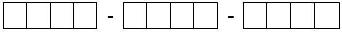
Q3 a). Light falls on the surface AB of a rectangular slab from air. Determine the smallest refractive index n that the material of the slab can have so that all incident light emerges from the opposite face CD. (2)
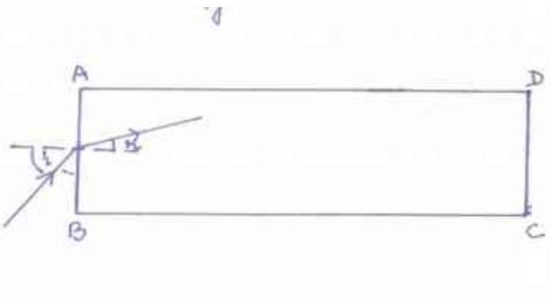
Let the light be incident at an angle i to the normal. If r is the angle of reflection then Sin $\mathrm { i } = \mathrm { n } \operatorname { Sin } \mathrm { r }$, where n is the refractive index of the material.
If the ray is to be reflected from the surface perpendicular to AB
$\operatorname { Sin } ( 90 - r ) = \operatorname { Cos } r > = 1 / n$
i.e. $\left( 1 - \mathrm { S } ^ { 2 } \pi \right) ^ { 1 / 2 } > = 1 / n$
i.e. $1 +$ Siin $k = { } ^ { 2 } \mathrm { n }$
The largest value of $\operatorname { Sin } 2 \mathrm { i } = 1$
Hence ${ } ^ { 2 } n > = 2$

$$
\begin{equation*}
\mathrm { n } = 2 \tag{1}
\end{equation*}
$$

$$
\mathrm { n } = 2 ^ { 1 / 2 }
$$

Roll No.

3 b) (i) Consider a slab of transparent material of thickness b, length 1 and refractive index $\mathrm { n } =$ $2 ^ { 1 / 2 }$,surrounded by air. There is a mirror M of height $\mathrm { b } / 2$ inside the slab at a distance d from the face AB.
The mirror is placed parallel to face AB, its lower end touching the face BC and the reflecting side towards AB . A narrow beam of monochromatic rays of light is incident at the center P of the face AB.
The incident beam has an angle of incidence i lying between $- \pi / 2$ and $\pi / 2$. Ignoring diffraction effects find the values of i such that the rays emerge out of the opposite face CD.
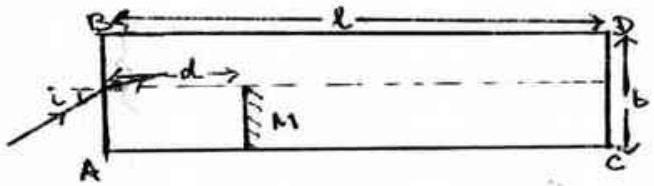
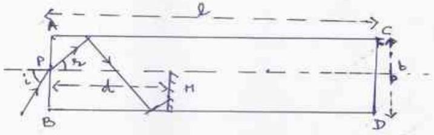
The critical angle for this material is $\pi / 4$. If r is the angle of refraction at the face AB , then
Sin $\mathrm { r } =$ Sin $\mathrm { i } ^ { 1 / 2 } \mathrm { z } = 1 \frac { 1 } { 2 }$
thus $\mathrm { r } < = \pi / 4$
thus the angle $\theta$ made by the face perpendicular to AB is such that
$\theta > = \pi / 4$.
Hence all rays will either emerge from DC or get reflected from the mirror M and emerge from the AB .
To find the condition for reflection consider a ray incident at an angle i such that $0 < = \mathrm { i } < = \pi / 2$.
If the ray hits the central axis at a distance X after reflection then X = b/ tanr where r is the angle refraction.
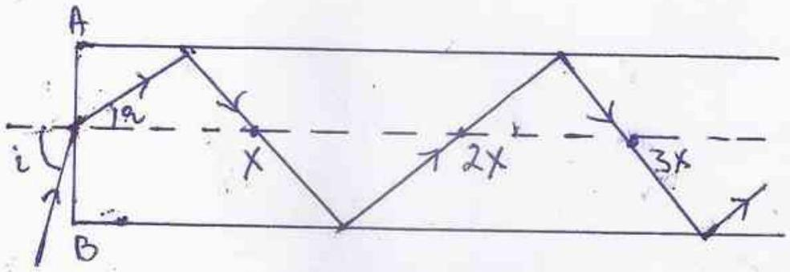
It is clear from the figure that the ray with incident angle i will get reflected from the mirror if $X < 0$ $3 \mathrm { X } < \mathrm { d } < 4 \mathrm { X }$ or $5 \mathrm { X } < \mathrm { d } < 6 \mathrm { X }$
i.e $( 2 m - 1 ) X < d < 2 m X$ where $m = 1,2,3$,
or (2m-1) b/ tan r < d < 2m b/ tan r
Since tan r is positive
(2m-1) b/d < tan r < 2m b/d
Now $\mathrm { i } =$ Si(m Sin r) = Sim Sin(talytanr))

Roll No.

Since $r$ and $i$ are positively correlated , the condition for reflection can be written in terms of i by substituting values of the limiting value of $\tan r$
i.e. $\operatorname { Sin } ^ { i } \left( \mathrm { n } \operatorname { Sin } \left( \tan ^ { - 1 } ( 2 \mathrm {~m} - 1 ) \mathrm { b } / \mathrm { d } \right) \right) < \mathrm { i } { } ^ { - 2 } \left( \right.$ Siஞin $\left. \left( \operatorname { ta } ^ { 1 } \right) ( 2 \mathrm { mb } / \mathrm { d } ) \right)$
Thus the condition for the rays to emerge from the opposite face CD is
$\operatorname { Sin } ^ { - 1 } \left( \mathrm { n } \operatorname { Sin } \left( \tan ^ { - 1 } ( 2 \mathrm {~m} ) \mathrm { b } / \mathrm { d } \right) \right) < \mathrm { i } < ^ { - 1 } \left( \operatorname { Sin } \operatorname { Sin } \left( \tan ^ { - 1 } ( 2 \mathrm {~m} + 1 ) \mathrm { b } / \mathrm { d } \right) \right)$ for $\mathrm { m } = 0,1,2,3$ etc.
For the case when $- \pi / 2 < = \mathrm { i } < = 0$ the condition gets reversed so that it will get reflected from the for
$2 \mathrm {~m} \times < = \mathrm { d } < = ( 2 \mathrm {~m} + 1 ) \times \mathrm { m } = 0,1,2.3$
Thus the condition for emergence from face CD is
$\operatorname { Sin } ^ { - 1 } \left( \mathrm { n } \operatorname { Sin } \left( \tan ^ { - 1 } ( 2 \mathrm {~m} - 1 ) \mathrm { b } / \mathrm { d } \right) \right) < \mathrm { i } < - \mathrm { l } \left( \right.$ Siஞin $\left. \left( \operatorname { ta } ^ { - 1 } ( 2 \mathrm {~m} ) \mathrm { b } / \mathrm { d } \right) \right)$ for $\mathrm { m } = 1,2,3$ etc.

For $0 \leq i \leq \frac { \pi } { 2 }$
$\operatorname { Sin } ^ { - 1 } \left( \mathrm { n } \operatorname { Sin } \left( \tan ^ { - 1 } ( 2 \mathrm {~m} ) \mathrm { b } / \mathrm { d } \right) \right) < \mathrm { i } < ^ { - 1 } \left( \operatorname { Sin } \operatorname { Sin } \left( \tan ^ { - 1 } ( 2 \mathrm {~m} + 1 ) \mathrm { b } / \mathrm { d } \right) \right)$ for $\mathrm { m } = 0,1,2,3$ etc.
For $- \frac { \pi } { 2 } \leq i \leq 0$
$\operatorname { Sin } ^ { - 1 } \left( \mathrm { n } \operatorname { Sin } \left( \tan ^ { - 1 } ( 2 \mathrm {~m} - 1 ) \mathrm { b } / \mathrm { d } \right) \right) < - \mathrm { i } ^ { - 3 }$ (BiSin(tậh(2m)b/d)) for $\mathrm { m } = 1,2,3$ etc.
(ii) What happens if the angle of incidence $\mathrm { i } = 0 ^ { 0 }$ ?

Practically there is no single ray. There is a bunch. Hence a part of the bunch shall be reflected and part transmitted through the opposite face.

## Roll No.

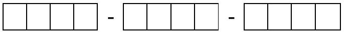

3 c) Whenever an object is heated the dimensions as well as the refractive index changes. Within a range of temperatures the changes are linear in the temperature differences. If the length and refractive index of a cylindrical object at room temperature (24°C) is $L$ and $n$ respectively, then the changes $\Delta L$ and $\Delta n$ are characterized by two properties of the body $\beta = \frac { 1 } { L } \frac { \Delta L } { \Delta T }$ and $\gamma = \frac { \Delta n } { \Delta T }$ where $\Delta T$ is the change in temperature. If $\beta$ is known $\gamma$ can be determined from observing the interference pattern due to reflection from the top surface and the bottom surface of a normally incident Laser beam of wavelength $\lambda$ on a cylindrical sample of length L . As the temperature changes the fringe patterns shift.
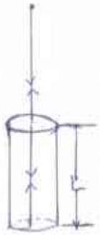
(i) Obtain a relation between $\gamma$ and the fringe shift $m$. (3)
Ans. Optical path difference is $2 \operatorname { Ln }$. Constructive interference takes place if $2 L n = \left( m _ { 1 } + \frac { 1 } { 2 } \right) \lambda$ (1)

When the Temperature changes from T to $T + \Delta$ Tconstructive interference takes place if

$$
\begin{equation*}
2 n + \Delta n \quad L + \Delta L = \left( m _ { 2 } + \frac { 1 } { 2 } \right) \lambda \text { where } \Delta L = L \beta \Delta T \tag{1}
\end{equation*}
$$

Thus $2 L \frac { \Delta n } { \Delta T } + n \beta \Delta \mathrm {~T} = \left( m _ { 1 } - m _ { 2 } \right) \lambda = m \lambda$

$$
\begin{equation*}
\gamma = \frac { \Delta n } { \Delta T } = \frac { m \lambda } { 2 L \Delta T } - n \beta \tag{1}
\end{equation*}
$$

$$
\gamma \stackrel { \frac { m \lambda } { 2 L \Delta T } } { - n \beta }
$$

(ii) In a real experiment with $\mathrm { L } = 1.0 \mathrm {~cm} . , \mathrm { n } = 1.515$ and $\beta = 7.19 \times 10 ^ { - 16 } { } ^ { 0 } \mathrm { C } ^ { - 1 }$ a Laser beam of $\lambda =$ 632nm.was used. The data of the fringe shift with the temperature is given below:

| m | 1 | 2 | 3 | 4 | 5 | 6 | 7 | 8 | 9 | 10 |
| :--- | :--- | :--- | :--- | :--- | :--- | :--- | :--- | :--- | :--- | :--- |
| $\mathrm { T } ^ { 0 } \mathrm { C }$ | 25.4 | 27.0 | 28.9 | 31.0 | 33.4 | 35.3 | 37.6 | 40.0 | 42.2 | 44.4 |

| m | 11 | 12 | 13 | 14 | 15 | 16 | 17 | 18 | 19 | 20 |
| :--- | :--- | :--- | :--- | :--- | :--- | :--- | :--- | :--- | :--- | :--- |
| $\mathrm { T } ^ { 0 } \mathrm { C }$ | 46.6 | 48.9 | 51.6 | 54.0 | 56.2 | 58.6 | 61.2 | 64.0 | 66.4 | 69 |

Plot a graph between m and $\mathrm { T } ^ { 0 } \mathrm { C }$. (4)

(Marking scheme: 0.5 for using the full graph paper; 0.5 for mentioning scaling of x axis; 0.5 for mentioning scaling of y axis; 2.0 for drawing a smooth graph and taking an average line; 0.5 points for choosing two far off points to calculate slope)

Roll No.
$\_\_\_\_$
$\_\_\_\_$
$\_\_\_\_$
$\_\_\_\_$ - $\_\_\_\_$
$\_\_\_\_$
$\_\_\_\_$
$\_\_\_\_$
$\_\_\_\_$ - $\_\_\_\_$
$\_\_\_\_$
$\_\_\_\_$
$\_\_\_\_$
$\_\_\_\_$
$\_\_\_\_$

Roll No.
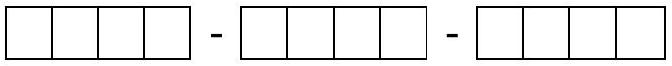
(iii) From the plot find $\gamma$.
(3)

$$
\begin{aligned}
\gamma & = \frac { 12 \times 632 \times 10 ^ { 7 } } { 2 \times 1 \times 29 } - 1.515 \times 7.19 \times 10 \\
& = 13.075 \times 10 ^ { - 6 } - 10.893 \times 10 ^ { - 6 } = 13.075 \times 10 ^ { - 6 } ( 1 ) \\
& = 1.30 \times 10 ^ { - 6 } { } ^ { 6 } \mathrm { C } ^ { - 1 } \quad ( 1 \text { for correct sig.figures } 1 \text { for units } )
\end{aligned}
$$

$\gamma = 1.3 \times 10 ^ { - 6 } { } ^ { 0 } \mathrm { C } ^ { - 1 }$ (Remember the least count is till the first decimal digit)

Roll No.

Q4) The figure shows a double chambered vessel with thermally insulated walls and partition. On each side there are n moles of an ideal monoatomic gas. Initially the pressure, volume and temperature on each side is $\mathrm { P } _ { 0 } , \mathrm {~V} _ { 0 }$ and $\mathrm { T } _ { 0 }$ respectively. The heater in the first chamber supplies heat very slowly till the gas in the first chamber expands such that the pressure, volume and temperature of the gas on the left side is $\mathrm { P } _ { 1 }$, $\mathrm { V } _ { 1 } , \mathrm {~T} _ { 1 }$ respectively. The pressure, volume and temperature of the gas in the right chamber is $\mathrm { P } _ { 2 } = 27 \mathrm { P } _ { 0 } / 8$, $\mathrm { V } _ { 2 }$ and $\mathrm { T } _ { 2 }$ respectively.
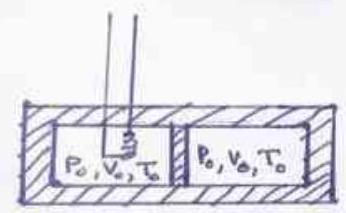
a) Complete the Table below: (5)

| $\mathrm { P } _ { 1 } = 27 \mathrm { P } _ { 0 } / 8$ | $\mathrm { V } _ { 1 } = \left( 2 - ( 8 / 27 ) ^ { 3 / 5 } \right) \mathrm { V } _ { 0 }$ | $\mathrm { T } _ { 1 } = \left( 27 / 4 - ( 27 / 8 ) ^ { 2 / 5 } \right) \mathrm { T } _ { 0 }$ |
| :--- | :--- | :--- |
| $\mathrm { P } _ { 2 } = 27 \mathrm { P } _ { 0 } / 8$ | $\mathrm { V } _ { 2 } = ( 8 / 27 ) ^ { 3 / 5 } \mathrm {~V} _ { 0 }$ | $\mathrm { T } _ { 2 } = ( 27 / 8 ) ^ { 2 / 5 } \mathrm {~T} _ { 0 }$ |

Since the gas is monoatomic $\gamma = 5 / 3$. Given $\mathrm { P } _ { 2 } = 27 \mathrm { P } _ { 0 } / 8$. Since the system is in equilibrium $\mathrm { P } _ { 1 } = 27 \mathrm { P } _ { 0 } / 8 ( 1 )$ Since chamber two is compressed adiabatically, $\mathrm { P } _ { 0 } \mathrm {~V} _ { 0 } { } ^ { \gamma } = \mathrm { P } _ { 2 } \mathrm {~V} _ { 2 } { } ^ { \gamma }$.

$$
\begin{align*}
& \text { Hence } \mathrm { V } _ { 2 } = ( 8 / 27 ) ^ { 3 / 5 } \mathrm {~V} _ { 0 }  \tag{1}\\
& \mathrm {~V} _ { 1 } = 2 \mathrm {~V} _ { 0 } - \mathrm { V } _ { 2 } = \left( 2 - ( 8 / 27 ) ^ { 3 / 5 } \right) \mathrm { V } _ { 0 }  \tag{1}\\
& \mathrm { P } _ { 0 } \mathrm {~V} _ { 0 } = \mathrm { nRT } _ { 0 } \quad \text { and } \mathrm { P } _ { 2 } \mathrm {~V} _ { 2 } = \mathrm { nRT } _ { 2 } \text { Hence } \mathrm { T } _ { 2 } = ( 27 / 8 ) ^ { 2 / 5 } \mathrm {~T} _ { 0 }  \tag{1}\\
& \mathrm { P } _ { 1 } \mathrm {~V} _ { 1 } = \mathrm { nRT } _ { 1 } \quad \text { Hence } \mathrm { T } _ { 1 } = \left( 27 / 4 - ( 27 / 8 ) ^ { 2 / 5 } \right) \mathrm { T } _ { 0 } \tag{1}
\end{align*}
$$

## Roll No.

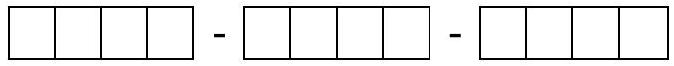
b) Find the work $\Delta W$ done on the gas in the second chamber in terms of the molar specific heat and $\mathrm { T } _ { 0 }$.
(2)
Since the change is adiabatic $\Delta Q = 0$ Thus $\Delta W = - \Delta U$

$$
\begin{equation*}
\Delta W = { } _ { V _ { 0 } } ^ { V _ { 2 } } P d V = K { } _ { V _ { 0 } } ^ { V _ { 2 } } \frac { d V } { V ^ { \gamma } } = \frac { K } { 1 - \gamma } V _ { 2 } ^ { 1 - \gamma } - 6 ^ { 1 - \gamma } = \frac { 1 } { 1 - \gamma } P _ { 2 } V _ { 2 } - B _ { 0 } V _ { 0 } \tag{1}
\end{equation*}
$$

With $\gamma = \frac { C _ { P } } { C _ { v } }$ and $C _ { P } - C _ { v } = R , \Delta W = - n C _ { v } \left( ( 27 / 8 ) ^ { 2 / 5 } - 1 \right) T _ { 0 }$
Alternatively $\Delta W = - \Delta U = - n C _ { \psi } \left( T _ { 2 } - 1 \right) = - n C _ { v } \left( ( 27 / 8 ) ^ { 2 / 5 } - 1 \right) T _ { 0 }$

$$
\Delta W = n C _ { v } \left( ( 27 / 8 ) ^ { 2 / 5 } - 1 \right) T _ { 0 }
$$

c) Find the amount of heat $\Delta Q$ that flows into the first chamber in terms of the molar specific heat and $\mathrm { T } _ { 0 }$.

$$
\begin{equation*}
\Delta Q = \Delta U + \Delta W = n _ { 1 } C T _ { 1 } - T _ { 0 } + n C _ { v } \left( ( 27 / 8 ) ^ { 2 / 5 } - 1 \right) T _ { 0 } \tag{1}
\end{equation*}
$$

$$
\begin{equation*}
= > \Delta Q = \frac { 19 } { 4 } n C _ { v } T _ { 0 } \tag{1}
\end{equation*}
$$

$$
\Delta Q = \frac { 19 } { 4 } n C _ { v } T _ { 0 }
$$

Roll No.
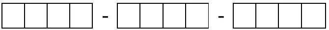

Q5 While performing an experiment with a liquid z (specific heat capacity $2.19 \mathrm {~kJ} \mathrm { Kg } \mathrm { K } ^ { - 1 }$ ), an experimenter starts with 200 ml of the liquid z in a beaker on a hot plate which is attached with scales to measure mass on it along with time. There is no lid over the beaker and the liquid is kept exposed to the surrounding. The experimenter inserts a thermometer such that it is always in contact with the liquid near the bottom of the beaker. The experimenter turns on the hot plate at $\mathrm { t } = 0 \mathrm {~min}$. and records the liquid temperature as well as the combined mass of the liquid, beaker and thermometer every minute. After 24 mins. he observes that there is no more liquid in the beaker. The observations are tabulated below:

| Time (min) | 0 | 1 | 2 | 3 | 4 | 5 | 6 | 7 | 8 | 9 | 10 | 11 | 12 |
| :--- | :--- | :--- | :--- | :--- | :--- | :--- | :--- | :--- | :--- | :--- | :--- | :--- | :--- |
| Temp . (°C) | 24 | 25 | 28 | 37 | 50 | 64 | 77 | 90 | 102 | 113 | 124 | 134 | 143 |
| Mass (gm) | 310 | 310 | 310 | 310 | 310 | 310 | 310 | 310 | 310 | 310 | 310 | 307 | 307 |

| Time (min) | 13 | 14 | 15 | 16 | 17 | 18 | 19 | 20 | 21 | 22 | 23 | 24 |
| :--- | :--- | :--- | :--- | :--- | :--- | :--- | :--- | :--- | :--- | :--- | :--- | :--- |
| Temp . (°C) | 152 | 158 | 160 | 160 | 160 | 159 | 160 | 160 | 161 | 160 | 161 | - |
| Mass (gm) | 305 | 302 | 288 | 264 | 241 | 214 | 190 | 165 | 138 | 110 | 79 | 69 |

Based on the above data

a) Plot a qualitative graph between the rate of change of temperature vs. temperature i.e. $\Delta \mathrm { T } / \Delta \mathrm { t }$ vs T. (5)

(Make an appropriate Table for the plot)

| t(min) | $\mathrm { T } = ( \mathrm { T } 1 + \mathrm { T } 2 ) / 2 ^ { \circ } \mathrm { C }$ | $\Delta \mathrm { T } = \mathrm { T } 2 - \mathrm { T } 1 ^ { \circ } \mathrm { C }$ | $\Delta \mathrm { t } = \mathrm { t } 2 - \mathrm { t } 1 ( \mathrm {~min} )$ | $\Delta \mathrm { T } / \Delta \mathrm { t } ^ { 0 } \mathrm { Cmin } ^ { - 1 }$ |
| :--- | :--- | :--- | :--- | :--- |
| 0 |  |  |  |  |
| 1 | 24.5 | 1 | 1 | 1 |
| 2 | 26.5 | 3 | 1 | 3 |
| 3 | 32.5 | 9 | 1 | 9 |
| 4 | 43.5 | 13 | 1 | 13 |
| 5 | 57 | 14 | 1 | 14 |
| 6 | 70.5 | 13 | 1 | 13 |
| 7 | 83.5 | 13 | 1 | 13 |
| 8 | 96 | 12 | 1 | 12 |
| 9 | 107.5 | 11 | 1 | 11 |
| 10 | 118.5 | 11 | 1 | 11 |
| 11 | 138.5 | 10 | 1 | 10 |
| 12 | 147.5 | 9 | 1 | 9 |
| 13 | 155 | 9 | 1 | 9 |
| 14 | 159 | 6 | 1 | 6 |

$\_\_\_\_$

| 15 | 160 | 2 | 1 | 2 |
| :--- | :--- | :--- | :--- | :--- |
| 16 | 160 | 0 | 1 | 0 |
| 17 | 160 | 0 | 1 | 0 |
| 18 | 159.5 | -1 | 1 | -1 |
| 19 | 159.5 | 1 | 1 | 1 |
| 20 | 160 | 0 | 1 | 0 |
| 21 | 160.5 | 1 | 1 | 1 |
| 22 | 160.5 | -1 | 1 | -1 |
| 23 | 160.5 | 1 | 1 | 1 |

(marking scheme: 1 mark for making an appropriate table and choosing T to be an average;0.5 marks for correct $\Delta \mathrm { T }$; 0.5 marks for using the whole graph paper; 0.5 marks for indicating scale on x axis; 0.5 marks for indicating scale on y axis; 1.5 marks for a smooth plot; 0.5 marks for indicating fluctuations around $160 ^ { \circ } \mathrm { C }$ )

Roll No.

Topic : $\_\_\_\_$ Date : $\_\_\_\_$
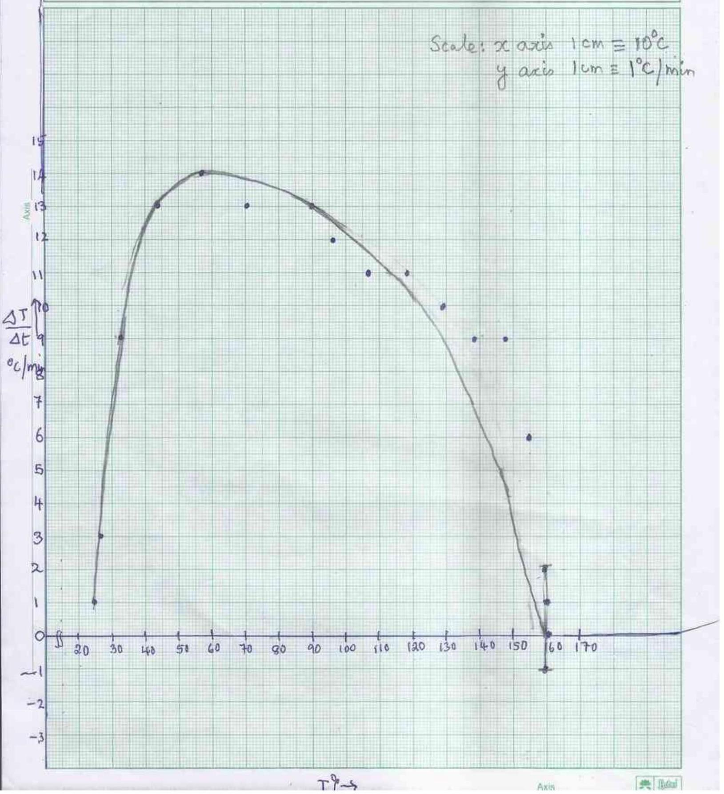

Roll No.

b)(i) Identify the temperature T at which dT/dt becomes zero.
(1)

From the graph at around $160 ^ { 0 } \mathrm { C }$, neglecting random fluctuation, the Temp. is constant.
$\mathrm { T } = 180$
0
(ii) From(i) which intrinsic property of the liquid can be inferred ? What is the value? (2 + 1)

Intrinsic property: Boiling point

Value:16 0
(iii) Give two possible reasons as to why the there is a $1 ^ { 0 }$ fluctuation in temperature after 15 mins. (2)

Least count of instrumencisflatistical fluctuations such as non-uniform heating by the hot plate, convective corrections, radiation etc.
c) Plot m vs. t after t=15 min. (4)
(Marking scheme: 0.5 for using the full graph paper; 0.5 for mentioning scaling of x axis; 0.5 for mentioning scaling of y axis; 2.0 for drawing a smooth graph and taking an average line; 0.5 points for choosing two far off points to calculate slope)

Roll No.
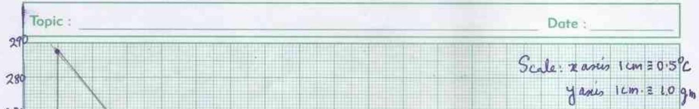
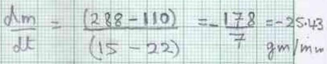

Roll No.

d) It is established from other experiments that at $\mathrm { t } = 19 \mathrm {~min}$, the liquid z absorbs heat from the hot plate at the rate 84.0W. Using this information what intrinsic property of the liquid, other than its boiling point, may be inferred? Find its value (2 + 3)

Latent heat L

$$
\begin{equation*}
( \mathrm { dQ } / \mathrm { dt } ) _ { = 22 \mathrm {~min} } = \mathrm { L } \left( \mathrm { dm } / \mathrm { dt } _ { 22 \mathrm {~min} } \right. \tag{2}
\end{equation*}
$$

From graph $( \mathrm { dm } / \mathrm { dt } ) _ { \mathrm { t } = 22 \mathrm {~min} } = 25.4 \mathrm { gm } / \mathrm { min } = 0.43 \mathrm {~kg} / \mathrm { f }$ 园c
$84 = \mathrm { L } \times 0.4238 \times 10$
$\mathrm { L } = 84 / 0.4238 \times 10198 \mathrm {~kJ}$ ̈ kg (1 for value correct significant figures consistent with data)

Intrinsic property: Latent heat

Value: 198kJ-KğThe accuracy of instruments)

## Roll No.

Q6) A Schwarzschild black hole is characterized by its mass $M$ and a mathematical spherical surface of radius $R _ { S } = \frac { 2 G M } { c ^ { 2 } }$ called the event horizon. If the radial distance of an object $r$ from the black hole is such that $r < R _ { \mathcal { S } }$, then the object is "swallowed" by the black hole and $r$ rapidly decreases to the singular point $r = 0$.
a) Suppose a black hole of mass $M$ "captures" a proton to form a "black hole proton atom (BHP)". Find the smallest radius $r _ { B }$ of this atom.

If $m$ is the mass of the proton and $v$ the speed in a circular orbit, then with $m \lll M m \frac { v ^ { 2 } } { r } = \frac { G m M } { r ^ { 2 } }$

Bohr's quantization condition gives $m v r = n \hbar$ where r is the radius of the orbit

Hence $v = \left( \frac { G M } { r } \right)$ Since $v = \frac { n \hbar } { m r }$
$r = \frac { n ^ { 2 } \hbar ^ { 2 } } { G M m ^ { 2 } }$ Hence the smallest radius $r _ { B } = \frac { \hbar ^ { 2 } } { G M m ^ { 2 } }$
b) Obtain a numerical upper bound on $M$ such that a stable BHP may exist.

For a stable BHP to exist $r _ { B } > R$
i.e. $\frac { \hbar ^ { 2 } } { G M m ^ { 2 } } > \frac { 2 G M } { c ^ { 2 } }$ Thus $M ^ { 2 } < \frac { \hbar c ^ { 2 } } { 2 ( G m ) ^ { 2 } }$ or $M < \frac { \hbar c } { 2 ( G m ) }$
$M < 2 . \mathrm { X } 10 ^ { 11 } \mathrm { Kg }$. (Correct decimal place consistent with values given 0.5 )

$$
M < 2 . X 16 \mathrm { Kg } .
$$

## Roll No.

c) Find the minimum energy $E _ { m i n }$, in Mev ,required to dissociate this BHP atom from the ground state. . (2)

The energy of the $\mathrm { BHP } = E = - 0 . \mathrm { F } _ { r } ^ { \mathrm { M } m }$, Substituting for $r , E _ { n } = - 0 . \mathrm { E } _ { n ^ { 2 } \hbar ^ { 2 } } ^ { 2 M ^ { 2 } m ^ { 3 } } ( 1.0 )$
Thus the min energy required to dissociate the atom is $E _ { \text {min } } = 0.5 \frac { G ^ { 2 } M ^ { 2 } m ^ { 3 } } { \hbar ^ { 2 } }$ (0.5)
Choose $M = \mathrm { Kg }$, substituting values $E _ { \text {min } } = 55 \mathrm { MeV }$ (0.5)

$$
E _ { \min } = 55 \mathrm { MeV }
$$

d) In 1974, Stephen Hawking showed that quantum effects cause black holes to radiate like a black body with temperature $T _ { B H } = \frac { 10 ^ { 23 } K } { M }$. Discuss then the possibility of the existence of a stable BHP atom. (3)

For $M = 10 ^ { 11 } \mathrm { Kg } . T _ { B H } = \frac { 10 ^ { 23 } K } { 10 ^ { 11 } } = 10 ^ { 2 } K ^ { 0 }$ At this temperature thermal energies $\simeq k T _ { B H } = 82 M e V$ The dissociation energy required is $55 M e V$. Thus the BHP is thermally unstable.
