# Indian National Physics Olympiad - 2016

Final Solutions
Roll Number: $\mathbf { 1 } | \mathbf { 6 } | \mid \mathbf {} -$ - □
□ - □
□
□
Date: $31 ^ { \text {st } }$ January 2016
Time : 09:00-12:00 (3 hours)
Maximum Marks: 50

Full Name (BLOCK letters) Ms. / Mr.: $\_\_\_\_$

Centre (e.g. Jaipur): $\_\_\_\_$
I permit/do not permit (strike out one) HBCSE to reveal my academic performance and personal details to a third party.

Besides the International Physics Olympiad (IPhO) , do you also want to be considered for the Asian Physics Olympiad (APhO) -2016? For APhO - 2016 pre-departure training, your presence will be required in Delhi and Hong Kong from April 25-May 10. In principle you can participate in both olympiads.

Yes/No.
I have read the procedural rules for INPhO and agree to abide by them.

Signature
(Do not write below this line)
MARKS

| Question: | 1 | 2 | 3 | 4 | 5 | 6 | Total |
| :--- | :--- | :--- | :--- | :--- | :--- | :--- | :--- |
| Marks: | 6 | 4 | 10 | 9 | 9 | 12 | 50 |
| Score: |  |  |  |  |  |  |  |

## Instructions:

1. Write the last four digits of your roll number on every page of this booklet.
2. Fill out the attached performance card. Do not detach it from this booklet.
3. Booklet consists of 13 pages (excluding this sheet) and 6 questions.
4. Questions consist of sub-questions. Write your detailed answer in the blank space provided below the sub-question and final answer to the sub-question in the smaller box which follows the blank space. Note that your detailed answer will be considered in the evaluation.
5. Extra sheets are attached at the end in case you need more space. You may also use these extra sheets for detailed answer as well as for rough work. Strike out your rough work.
6. Non-programmable scientific calculator is allowed.
7. A mobile phone cannot be used as a calculator.
8. Mobiles, pagers, smart watches, slide rules, log tables etc. are not allowed.
9. This entire booklet must be returned.

## Table of Information

Speed of light in vacuum $c = 3.00 \times 10 ^ { 8 } \mathrm {~m} \cdot \mathrm {~s} ^ { - 1 }$
Planck's constant $h = 6.63 \times 10 ^ { - 34 } \mathrm {~J} \cdot \mathrm {~s}$
Universal constant of Gravitation $G = 6.67 \times 10 ^ { - 11 } \mathrm {~N} \cdot \mathrm {~m} ^ { 2 } \cdot \mathrm {~kg} ^ { - 2 }$
Magnitude of electron charge $e = 1.60 \times 10 ^ { - 19 } \mathrm { C }$
Mass of electron $m _ { e } = 9.11 \times 10 ^ { - 31 } \mathrm {~kg} = 0.51 \mathrm { MeV } \cdot c ^ { - 2 }$
Stefan-Boltzmann constant $\sigma = 5.67 \times 10 ^ { - 8 } \mathrm {~W} \cdot \mathrm {~m} ^ { - 2 } \cdot \mathrm {~K} ^ { - 4 }$
Value of $1 / 4 \pi \epsilon _ { 0 } \quad = \quad 9.00 \times 10 ^ { 9 } \mathrm {~N} \cdot \mathrm {~m} ^ { 2 } \cdot \mathrm { C } ^ { - 2 }$
Permeability constant $\mu _ { 0 } = 4 \pi \times 10 ^ { - 7 } \mathrm { H } \cdot \mathrm { m } ^ { - 1 }$
Universal Gas Constant $R = 8.31 \mathrm {~J} \cdot \mathrm {~K} ^ { - 1 } \cdot \mathrm {~mole} ^ { - 1 }$
Molar mass of air $\quad = \quad 29.0 \mathrm {~kg} \cdot \mathrm { kmol } ^ { - 1 }$
Rest mass of proton $m _ { p } = 1.67 \times 10 ^ { - 27 } \mathrm {~kg}$
1 atomic mass unit $1 u = 1.661 \times 10 ^ { - 27 } \mathrm {~kg}$

Please note that alternate/equivalent methods and different way of expressing final solutions may exist.
1. A glass rod of refractive index 1.50 of rectangular cross section $\{ d \times l \}$ is bent into a "U" shape (see Fig. (A). The cross sectional view of this rod is shown in Fig. (B).

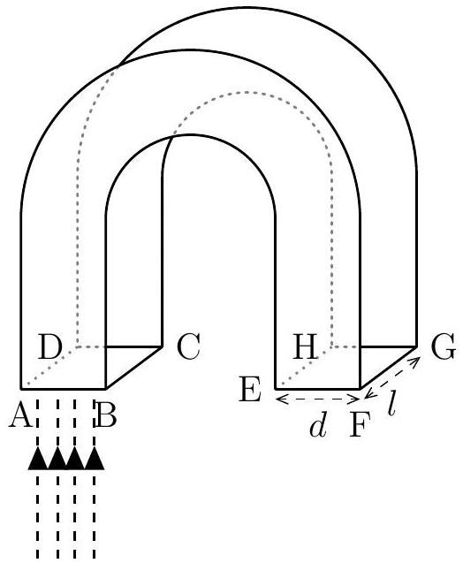
(A)

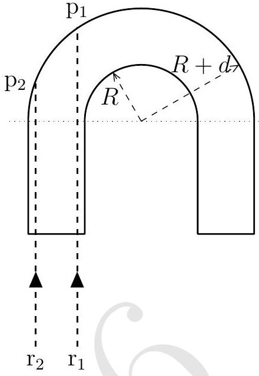
(B)

Bent portion of the rod is semi-circular with inner and outer radii $R$ and $R + d$ respectively. Parallel monochromatic beam of light is incident normally on face ABCD.

(a) Consider two monochromatic rays $\mathrm { r } _ { 1 }$ and $\mathrm { r } _ { 2 }$ in Fig. (B). State whether the following statements are True or False.

| Statement | True/False |
| :--- | :--- |
| If $\mathrm { r } _ { 1 }$ is total internally reflected from the semi circular section at the point $\mathrm { p } _ { 1 }$ then $\mathrm { r } _ { 2 }$ will necessarily be total internally reflected at the point $\mathrm { p } _ { 2 }$. | True |
| If $\mathrm { r } _ { 2 }$ is total internally reflected from the semi circular section at the point $\mathrm { p } _ { 2 }$ then $\mathrm { r } _ { 1 }$ will necessarily be total internally reflected at the point $\mathrm { p } _ { 1 }$. | False |

(b) Consider the ray $\mathrm { r } _ { 1 }$ whose point of incidence is very close to the edge BC. Assume it undergoes total internal reflection at $\mathrm { p } _ { 1 }$. In cross sectional view below, draw the trajectory of this reflected ray beyond the next glass-air boundary that it encounters.

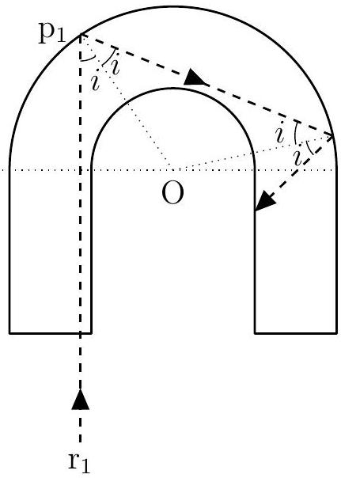

(c) Obtain the minimum value of the ratio $R / d$ for which any light ray entering the glass normally through the face ABCD undergoes at least one total internal reflection.
Solution: For total internal reflection
$$
\sin i \geq \sin \theta _ { c }
$$
where $i$ is the incidence angle of the ray on bent portion of the rod (see figure in part (b)) and $\theta _ { c }$ is the critical angle for glass-air boundary. For a light ray close to edge BC
$$
\frac { R } { R + d } \geq \frac { 1 } { n _ { \text {glass } } }
$$
For refractive index $n _ { \text {glass } } = 1.5$
$$
R \geq 2 d
$$
Minimum value of $R / d = 2$
(d) A glass rod with the above computed minimum ratio of $R / d$, is fully immersed in water of refractive index 1.33. What fraction of light flux entering the glass through the plane surface ABCD undergoes at least one total internal reflection?

Solution:
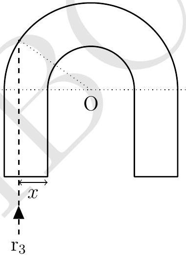
Let the intensity of beam be $I _ { 0 }$. Flux entering through glass slab will be $d l I _ { 0 }$. Assume that any light ray up to distance $x$ from the edge BC undergoes at least one total internal reflection. Then the flux going through at least one total internal reflection will be $( d - x ) l I _ { 0 }$. Also

$$
\frac { R + x } { R + d } = \frac { n _ { \text {water } } } { n _ { \text {glass } } }
$$

For $R / d = 2$ and $n _ { \text {water } } = 1.33 , x = 2 d / 3$.
Fraction of light = 0.33 or 0.34.
2. A uniformly charged thin spherical shell of total charge $Q$ and radius $R$ is centred at the origin. There is a tiny circular hole in the shell of radius $r ( r \ll R )$ at $z = R$. Find the electric field just outside and inside the hole, i.e., at $z = R + \delta$ and $z = R - \delta$ $( \delta \ll r )$.

Solution: Electric field of a circular disc with charge density $\sigma$ of radius $r$ at any point $z$ on its axis for $z \ll r$

$$
\vec { E } = \frac { \sigma } { 2 \epsilon _ { 0 } } \hat { z }
$$

Given system can be considered as a spherical shell of radius $R$ with charge density $\sigma$ and a disk of radius $r$ with charge density $- \sigma$.

$$
\begin{aligned}
\vec { E } ( R + \delta ) & = \text { Electric field due to shell } + \text { Electric field due to hole } \\
& = \frac { \sigma R ^ { 2 } } { \epsilon _ { 0 } ( R + \delta ) ^ { 2 } } \hat { z } - \frac { \sigma } { 2 \epsilon _ { 0 } } \hat { z } \\
& \approx \frac { \sigma } { 2 \epsilon _ { 0 } } \hat { z }
\end{aligned}
$$

Similarly

$$
\vec { E } ( R - \delta ) = \frac { \sigma } { 2 \epsilon _ { 0 } } \hat { z }
$$

For $R \gg r$

$$
\vec { E } ( R + \delta ) = \vec { E } ( R - \delta ) = \frac { Q } { 8 \pi \epsilon _ { 0 } R ^ { 2 } } \hat { z } \text { i.e. radially outward. }
$$

Answers expressed up to second order approximations are also accepted.

3. This problem is designed to illustrate the advantage that can be obtained by the use of multiple-staged instead of single-staged rockets as launching vehicles. Suppose that the payload (e.g., a space capsule) has mass $m$ and is mounted on a two-stage rocket (see figure). The total mass (both rockets fully fuelled, plus the payload) is $N m$.
The mass of the second-stage rocket plus the payload, after first-stage burnout and separation, is $n m$. In each stage the ratio of container mass to initial mass (container plus fuel) is $r$, and the exhaust speed is $V$, constant relative to the engine. Note that at the end of each state when the fuel is completely exhausted, the container drops off immediately without affecting the velocity of rocket. Ignore gravity.
    (a) Obtain the velocity $v$ of the rocket gained from the first-stage burn, starting from rest in terms of $\{ V , N , n , r \}$.

Solution: Variable mass equation gives

$$
m \frac { d \vec { v } } { d t } = \vec { F } _ { \text {external } } + \vec { v } _ { \text {relative } } \frac { d m } { d t }
$$

No gravity hence $\vec { F } _ { \text {external } } = 0 , \left| \vec { v } _ { \text {relative } } \right| = v$. Solving rocket equation

$$
\begin{equation*}
v = V \ln \frac { m _ { i } } { m _ { f } } \tag{1}
\end{equation*}
$$

Here

$$
\begin{equation*}
\text { initial mass } m _ { i } = N m \tag{2}
\end{equation*}
$$

final mass $m _ { f } = [ N r + n ( 1 - r ) ] m$
Answers are written in terms of speed. Answer written in terms of velocity with proper sign (-ve) are also acceptable.

(b) Obtain a corresponding expression for the additional velocity $u$ gained from the second stage burn.
Solution: Now $m _ { i } = n m , m _ { f } = m ( n r + 1 - r )$. Equation (1) yields
$$
\begin{equation*}
u = V \ln \frac { n } { n r + 1 - r } \tag{4}
\end{equation*}
$$
or
$$
\begin{equation*}
\vec { u } = \vec { V } \ln \frac { n } { n r + 1 - r } \tag{5}
\end{equation*}
$$
(c) Adding $v$ and $u$, you have the payload velocity $w$ in terms of $N , n$, and $r$. Taking $N$ and $r$ as constants, find the value of $n$ for which $w$ is a maximum. For this maximum condition obtain $u / v$.
Solution: From Eqs. (3 and 5)
$$
\begin{aligned}
w & = V \ln \frac { N n } { [ N r + n ( 1 - r ) ] [ n r + 1 - r ] } \\
& = V \ln f ( n )
\end{aligned}
$$
Maximizing $w$ is equivalent to maximizing $f ( n )$. Differentiating and setting equal to zero, we obtain
$$
\begin{equation*}
n = \sqrt { N } \Rightarrow \frac { u } { v } = \frac { \ln [ \sqrt { N } / \{ r \sqrt { N } + ( 1 - r ) \} ] } { \ln [ N / \{ N r + \sqrt { N } ( 1 - r ) \} ] } = 1 \tag{6}
\end{equation*}
$$
where we have used Eqs. (1 and 5).
(d) Find an expression for the payload velocity $w _ { s }$ of a single-stage rocket with the same values of $N , r$, and $V$.
Solution: Here $m _ { i } = N m$ and $m _ { f } = m + r ( N m - m )$. Using Eq. (1)
$$
w _ { s } = V \ln \frac { N } { N r + 1 - r }
$$
(e) Suppose that it is desired to obtain a payload velocity of 10 km/s, using rockets for which $V = 2.5 \mathrm {~km} / \mathrm { s }$ and $r = 0.1$. Using the maximum condition of part (c) obtain the value of $N$ if the job is to be done with a two-stage rocket.

Solution: Payload velocity

$$
w = u + v = 2 V \ln \frac { \sqrt { N } } { r \sqrt { N } + 1 - r }
$$

For the desired value of $w , N = 649.4$ ( $645 < N < 655$ accepted.)
4. The realization towards the latter half of nineteenth century that blackbody radiation in a cavity can be considered to be a gas in equilibrium became an important milestone in the development of modern physics. The equation of state of such a gas with pressure $P$ and volume $V$ is $P = u / 3$. Here $u$ is the internal energy per unit volume. Also, $u = \beta T ^ { 4 }$, where $\beta$ is a constant and $T$ is absolute temperature at which radiation is in equilibrium with the walls of the cavity.

(a) Using the first law of thermodynamics obtain an expression for $d Q$ in terms of volume, temperature and other related quantities.

Solution: From first law of thermodynamics we have

$$
d Q = d U + d W = d ( u V ) + P d V
$$

Using $u = \beta T ^ { 4 } , d u = 4 \beta T ^ { 3 } d T$

$$
\begin{equation*}
d Q = \frac { 4 \beta } { 3 } \left( T ^ { 4 } d V + 3 T ^ { 3 } V d T \right) \tag{7}
\end{equation*}
$$

(b) For a reversible process the entropy is defined as $d S = d Q / T$. Obtain an expression for $S ( V , T )$ for the radiation gas.

Solution:

$$
\begin{equation*}
\frac { d Q } { T } = d S = d \left( \frac { 4 \beta } { 3 } T ^ { 3 } V \right) \tag{8}
\end{equation*}
$$

At $T = 0 , S = 0$. Hence

$$
\begin{equation*}
S = \frac { 4 \beta } { 3 } T ^ { 3 } V \tag{9}
\end{equation*}
$$

(c) Imagine the universe to be a perfectly spherical adiabatic enclosure of radius $r$ containing pure radiation. Rate of expansion of the universe is governed by a law

$$
\frac { d r } { d t } = \alpha r
$$

where $\alpha$ is a constant. At $t = 0$, the universe has size $r _ { 0 }$ and temperature $T _ { 0 }$. Determine its temperature $T ( t )$ for $t > 0$.

Solution: As universe expands adiabatically, $d Q = 0$. Equation (7) gives

$$
\frac { d V } { V } + 3 \frac { d T } { T } = 0
$$

Using $V = 4 \pi r ^ { 3 } / 3$

$$
\begin{align*}
\frac { d r } { r } + \frac { d T } { T } & = 0  \tag{10}\\
\Rightarrow r T = r _ { 0 } T _ { 0 } & = \text { constant }
\end{align*}
$$

Using rate of expansion law

$$
\begin{array} { r }
r = r _ { 0 } e ^ { \alpha t } \\
\Rightarrow T = T _ { 0 } e ^ { - \alpha t } \tag{12}
\end{array}
$$

(d) Here $\alpha$ is $72 \mathrm {~km} \cdot \mathrm {~s} ^ { - 1 } \cdot \mathrm { Mpc } ^ { - 1 }$ where $1 \mathrm { Mpc } = 3.26 \times 10 ^ { 6 }$ light years. State the dimensions of $\alpha$. Obtain its numerical value in SI units as per the dimensions stated.
Solution:
$$
\begin{gathered}
{ [ \alpha ] = \mathrm { T } ^ { - 1 } } \\
\alpha = 2.33 \times 10 ^ { - 18 } \mathrm {~s} ^ { - 1 }
\end{gathered}
$$
5. This question is about a closed electrical black box with three terminals $\mathrm { A } , \mathrm { B }$, and C as shown. It is known that the electrical elements connecting the points A, B, C inside the box are resistances (if any) in delta formation. A student is provided a variable power supply, an ammeter and a voltmeter. Schematic symbols for these elements are given in part (a). She is allowed to connect these elements externally between only two of the terminals (AB or BC or CA) at a time to form a
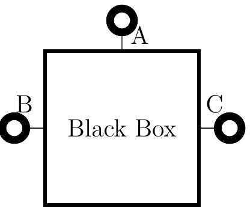
suitable circuit.
    (a) Draw a suitable circuit using the above elements to measure voltage across the terminals A and B and the current drawn from power supply as per Ohm's law.

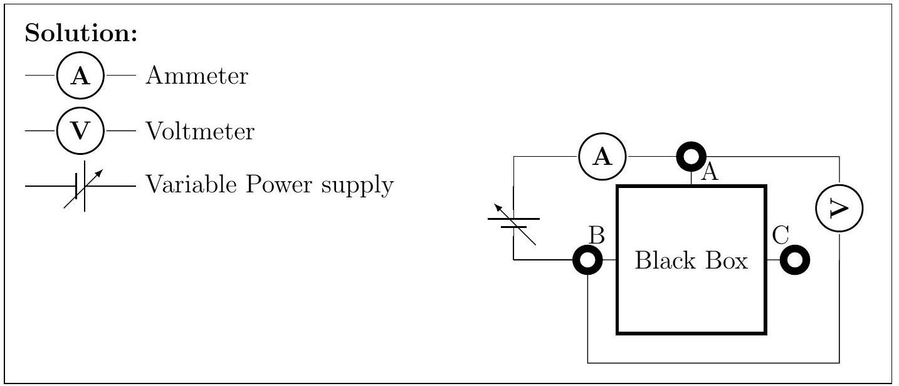

(b) She obtains the following readings in volt and milliampere for the three possible connections to the black box.

| AB |  | BC |  | AC |  |
| :--- | :--- | :--- | :--- | :--- | :--- |
| $V ( \mathrm {~V} )$ | $I ( \mathrm {~mA} )$ | $V ( \mathrm {~V} )$ | $I ( \mathrm {~mA} )$ | $V ( \mathrm {~V} )$ | $I ( \mathrm {~mA} )$ |
| 0.53 | 0.54 | 0.83 | 0.17 | 0.85 | 0.15 |
| 0.77 | 0.77 | 1.65 | 0.35 | 1.70 | 0.30 |
| 1.02 | 1.01 | 2.47 | 0.53 | 2.55 | 0.45 |
| 1.49 | 1.51 | 3.29 | 0.71 | 3.4 | 0.60 |
| 1.98 | 2.02 | 4.11 | 0.89 | 4.25 | 0.75 |
| 2.49 | 2.51 | 4.94 | 1.06 | 5.10 | 0.90 |

In each case plot $V$ (on $Y$-axis)- $I$ (on $X$-axis) on the graph papers provided. Preferably use a pencil to plot. Calculate the values of resistances from the plots. Show your calculations below for each plot clearly indicating graph number.

Solution: See graphs for the calculations of slopes. $R _ { \mathrm { AB } } = 0.98 \mathrm { k } \Omega , R _ { \mathrm { BC } }$ $= 4.60 \mathrm { k } \Omega , R _ { \mathrm { CA } } = 5.67 \mathrm { k } \Omega$.

(c) From your calculations above draw the arrangement of resistances inside the box indicating their values.

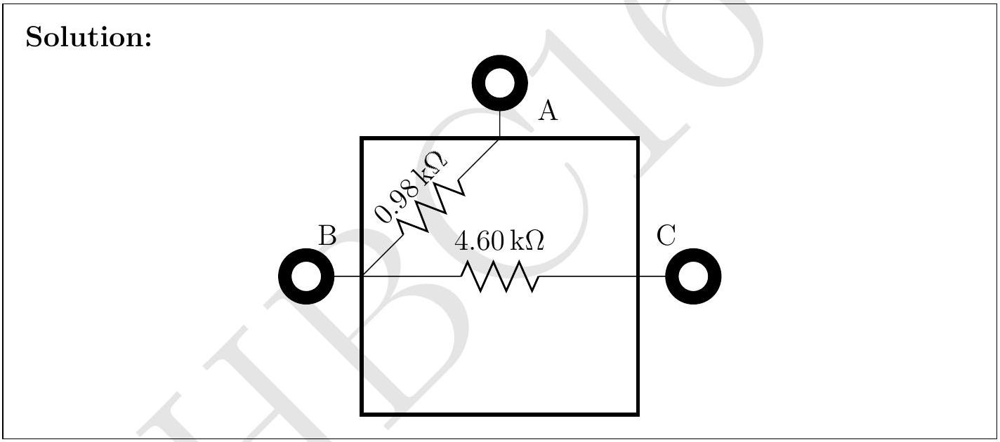

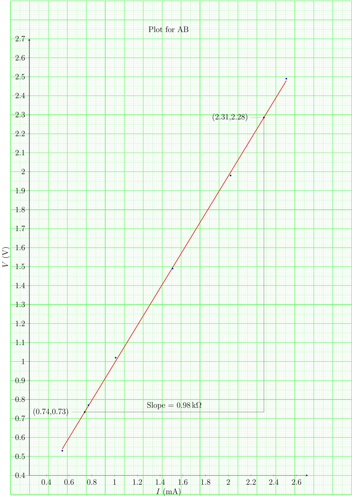

## INPhO - 2016 - Final Solutions

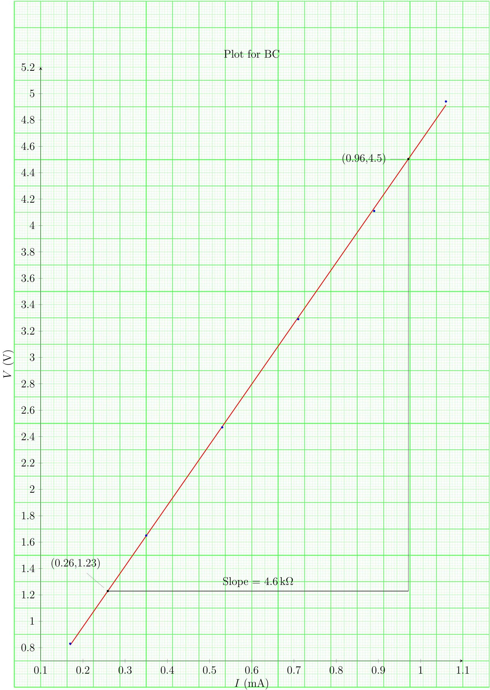

## INPhO - 2016 - Final Solutions

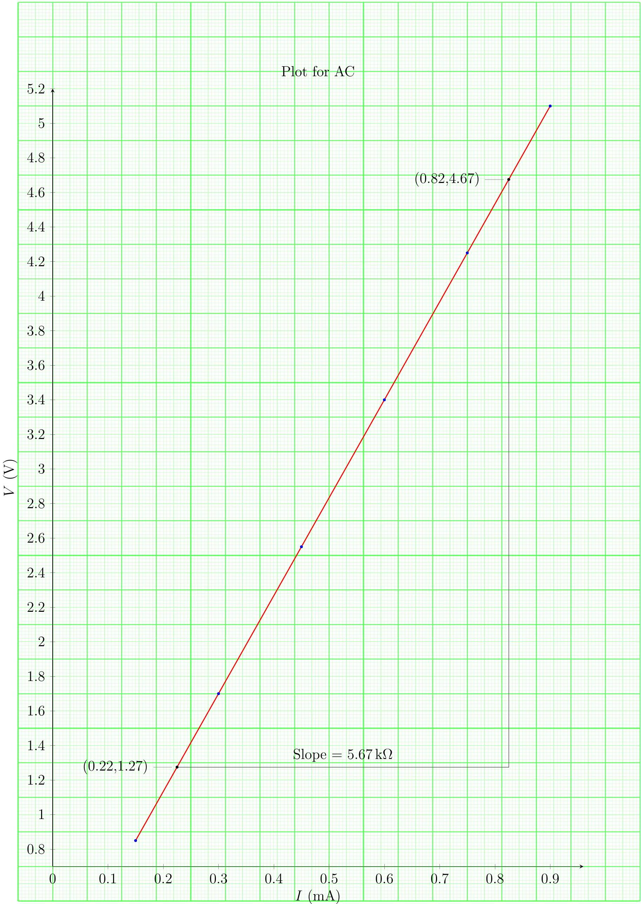

6. The Yukawa Potential and the nucleus

In 1935 the Japanese physicist Hideki Yukawa proposed that the strong attractive central potential binds the proton and the neutron with the associated potential energy $U ( r )$ where

$$
U ( r ) = - g ^ { 2 } \frac { e ^ { - r / \lambda } } { r }
$$

where $\lambda = \hbar / m _ { \pi } c$, with $m _ { \pi }$, being the pion mass $= 138.00 \mathrm { MeV } / \mathrm { c } ^ { 2 }$ and $r$ is the distance between nucleons. Here $g ^ { 2 }$ is the nuclear force constant. Our task is to determine the numerical value of nuclear force constant $g ^ { 2 }$. For simplicity we assume that the proton and the neutron in the deuteron have equal masses, $m _ { \mathrm { p } } = m _ { \mathrm { n } } = m =$ $938.00 \mathrm { MeV } / \mathrm { c } ^ { 2 }$. Here subscript n,p refers to neutron and proton respectively (see figure below). They are in circular motion under the influence of $U ( r )$ about their centre of mass (CM) and their ground state binding energy $\left( E _ { b } \right)$ is 2.22 MeV.

This two mass problem can be reduced to that of a single mass namely effective mass $\mu = m _ { \mathrm { p } } / 2$ in CM frame with velocity $\bar { v } =$ $\overline { v _ { \mathrm { n } } } - \overline { v _ { \mathrm { p } } }$ where $\left| \overline { v _ { \mathrm { n } } } \right| = \left| \overline { v _ { \mathrm { p } } } \right|$. The total angular momentum of the n-p pair is quantized as per the Bohr quantization formula.
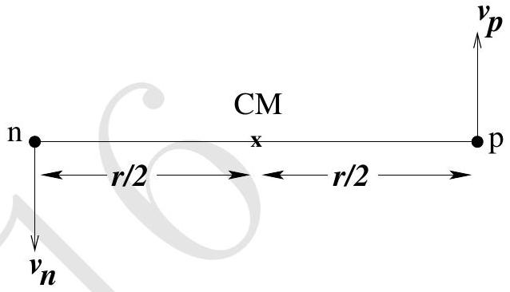
In what follows, express numerical values of energy in $\mathrm { MeV } \left( 1 \mathrm { MeV } = 1.6 \times 10 ^ { - 13 } \mathrm {~J} \right)$ and length in $\mathrm { fm } \left( 1 \mathrm { fm } = 10 ^ { - 15 } \mathrm {~m} \right)$, mass in $\mathrm { MeV } / \mathrm { c } ^ { 2 }$ and related quantities in terms of these.

(a) Calculate $\lambda$.
Solution: $\lambda = 1.431 \mathrm { fm }$.
(b) State the total energy $E$ of the deuteron in terms of $\{ \mu , r \}$ and relevant quantities.
Solution: $E = \frac { \mu v ^ { 2 } } { 2 } - \frac { g ^ { 2 } e ^ { - r / \lambda } } { r }$
(c) Relate the centripetal force on $\mu$ to $U ( r )$.
Solution:
$$
\begin{array} { r }
\frac { m _ { n } v _ { n } ^ { 2 } } { r _ { n } } = \frac { d } { d r } U ( r ) \\
\frac { \mu v ^ { 2 } } { r } = \frac { g ^ { 2 } e ^ { - r / \lambda } } { r } \left( \frac { 1 } { r } + \frac { 1 } { \lambda } \right)
\end{array}
$$
Answers written in terms of proton's mass and velocity are also accepted.
(d) State the magnitude of the total angular momentum $L$ about the CM.

Solution:

$$
L = m _ { p } v _ { p } r _ { p } + m _ { n } v _ { n } r _ { n } = \mu v r \text { or } n \hbar
$$

(e) Obtain the expression for $n ^ { \text {th } }$ energy level $\left( E _ { n } \right)$ of deuteron in terms of $g ^ { 2 }$ and $r _ { n }$, where $r _ { n }$ is the radius of corresponding circular orbit.

Solution: Bohr quantization condition gives

$$
v = \frac { n \hbar } { \mu r }
$$

Replace $v ^ { 2 }$ in part (b) to obtain

$$
E _ { n } = \frac { n ^ { 2 } \hbar ^ { 2 } } { 2 \mu \lambda ^ { 2 } } \frac { 1 } { x _ { n } ^ { 2 } } - \frac { g ^ { 2 } } { \lambda } \frac { e ^ { - x _ { n } } } { x _ { n } } \quad \text { where } x _ { n } = r _ { n } / \lambda
$$

Answer can be expressed in various ways. For example in terms of $L$ or $g ^ { 2 }$ can also be eliminated.

(f) Consider the ground state of the deuteron $( n = 1 )$. Define $x _ { 1 } = r _ { 1 } / \lambda$. Here $r _ { 1 }$ is the radius of first orbit of deuteron. Obtain a polynomial equation of $x _ { 1 }$ involving only fundamental constants and $E _ { b }$.

Solution: Using Bohr quantization condition in part (d)

$$
\begin{array} { r }
\frac { g ^ { 2 } \mu \lambda } { n ^ { 2 } \hbar ^ { 2 } } \left( x _ { n } ^ { 2 } + x _ { n } \right) e ^ { - x _ { n } } = 1 \\
E _ { n } = - n ^ { 2 } \left( \frac { \hbar ^ { 2 } } { 2 \mu \lambda ^ { 2 } } \right) \frac { 1 } { x _ { n } ^ { 2 } } + n ^ { 2 } \frac { g ^ { 2 } } { \lambda } \frac { e ^ { - x _ { n } } } { x _ { n } } \tag{14}
\end{array}
$$

Result of part (e) can be used to eliminate $e ^ { - x _ { n } }$.

$$
\begin{equation*}
E _ { n } = - n ^ { 2 } \left( \frac { \hbar ^ { 2 } } { 2 \mu \lambda ^ { 2 } } \right) \frac { 1 } { x _ { n } ^ { 2 } } \frac { \left( 1 - x _ { n } \right) } { \left( 1 + x _ { n } \right) } \tag{15}
\end{equation*}
$$

For $n = 1 , E _ { 1 } = - E _ { b }$. Thus

$$
\begin{array} { r }
E _ { b } = \left( \frac { \hbar ^ { 2 } } { 2 \mu \lambda ^ { 2 } } \right) \frac { 1 } { x _ { 1 } ^ { 2 } } \frac { \left( 1 - x _ { 1 } \right) } { \left( 1 + x _ { 1 } \right) } \\
x _ { 1 } ^ { 3 } + x _ { 1 } ^ { 2 } + \eta x _ { 1 } - \eta = 0 \tag{17}
\end{array}
$$

where $\eta = \hbar ^ { 2 } / 2 \mu \lambda ^ { 2 } E _ { b }$
Answer written in different form with correct orders of polynomials are accepted.

(g) Estimate $x _ { 1 }$ numerically. Also calculate the radius of first orbit i.e. $r _ { 1 }$. [2]

Solution: Using $\eta = 9.1 , x _ { 1 } = 0.85$ which gives $r _ { 1 } = 1.22 \mathrm { fm }$.

(h) Obtain the nuclear force constant $g ^ { 2 }$ numerically in units of MeV⋅fm.

Solution: $g ^ { 2 } = 86.2 \mathrm { MeV } \mathrm { fm }$
**** END OF THE QUESTION PAPER ****
