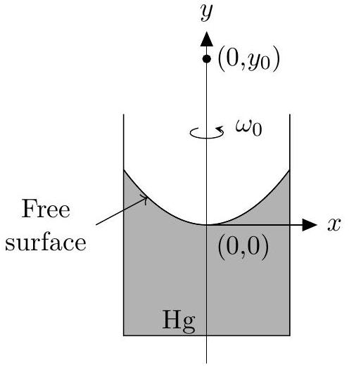
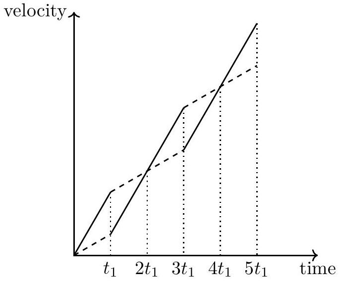
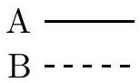
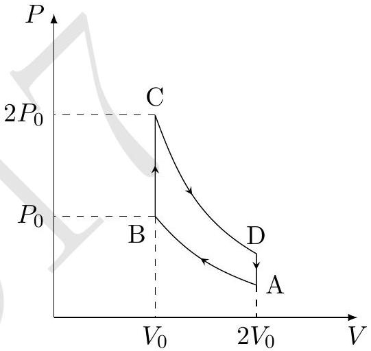
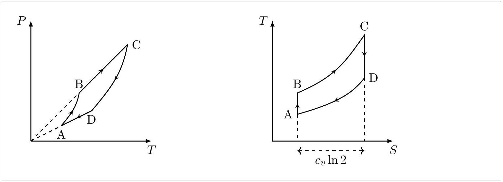
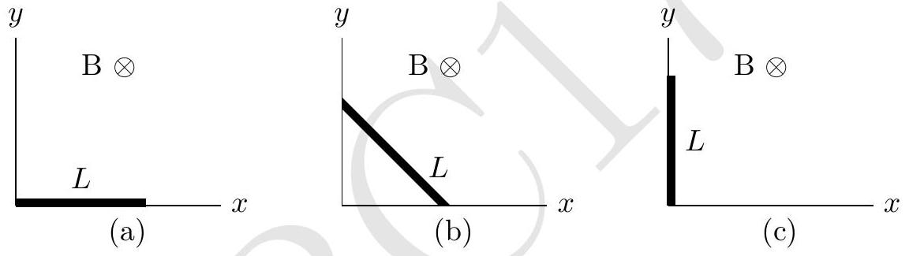
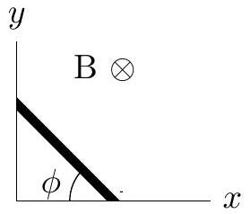
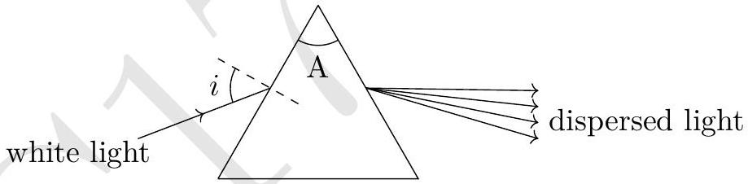
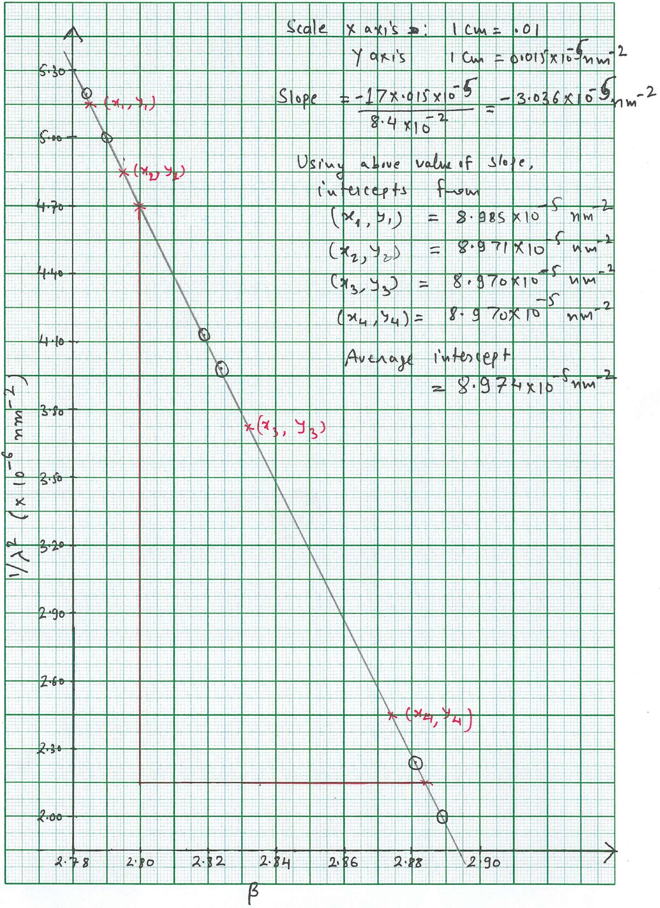

## Indian National Physics Olympiad - 2017

Date: $29 ^ { \text {th } }$ January 2017 Solutions Roll Number: $\_\_\_\_$
$\_\_\_\_$ 1 7 $\_\_\_\_$ - -
$\_\_\_\_$
$\_\_\_\_$
$\_\_\_\_$
$\_\_\_\_$ - $\_\_\_\_$
$\_\_\_\_$ | □
$\_\_\_\_$
Time : 09:00-12:00 (3 hours) Maximum Marks: 75

I permit/do not permit (strike out one) HBCSE to reveal my academic performance and personal details to a third party.
Besides the International Physics Olympiad (IPhO) 2017, do you also want to be considered for the Asian Physics Olympiad (APhO) 2017? For APhO 2017 and its pre-departure training, your presence will be required in Delhi and Russia from April 26 to May 10, 2017. In principle, you can participate in both olympiads. Yes/No.
Full Name (BLOCK letters) Ms./Mr.: $\_\_\_\_$

Extra sheets attached : □ Date $\overline { \text { Centre(e.g.Jaipur) } }$ Signature (Do not write below this line)

Instructions

1. This booklet consists of 6 pages (excluding this sheet) and total of 6 questions.
2. This booklet is divided in two parts: Questions with Summary Answer Sheet and Detailed Answer Sheet. Write roll number at the top wherever asked.
3. The final answer to each sub-question should be neatly written in the box provided below each sub-question in the Questions \& Summary Answer Sheet.
4. You are also required to show your detailed work for each question in a reasonably neat and coherent way in the Detailed Answer Sheet. You must write the relevant Question Number on each of these pages.
5. Marks will be awarded on the basis of what you write on both the Summary Answer Sheet and the Detailed Answer Sheet. Simple short answers and plots may be directly entered in the Summary Answer Sheet. Marks may be deducted for absence of detailed work in questions involving loner calculations. Strike out any rough work that you do not want to be evaluated.
6. Adequate space has been provided in the answersheet for you to write/calculate your answers. In case you need extra space to write, you may request for additional blank sheets from the invigilator. Write your roll number on the extra sheets and get them attached to your answersheet and indicate number of extra sheets attached at the top of this page.
7. Non-programmable scientific calculators are allowed. Mobile phones cannot be used as calculators.
8. Use blue or black pen to write answers. Pencil may be used for diagrams/graphs/sketches.
9. This entire booklet must be returned at the end of the examination.

Table of Constants
| Speed of light in vacuum | $c$ | $3.00 \times 10 ^ { 8 } \mathrm {~m} \cdot \mathrm {~s} ^ { - 1 }$ |
| :--- | :--- | :--- |
| Planck's constant | $h$ | $6.63 \times 10 ^ { - 34 } \mathrm {~J} \cdot \mathrm {~s}$ |
| Universal constant of Gravitation | G | $6.67 \times 10 ^ { - 11 } \mathrm {~N} \cdot \mathrm {~m} ^ { 2 } \cdot \mathrm {~kg} ^ { - 2 }$ |
| Magnitude of electron charge | $e$ | $1.60 \times 10 ^ { - 19 } \mathrm { C }$ |
| Mass of electron | $m _ { e }$ | $9.11 \times 10 ^ { - 31 } \mathrm {~kg}$ |
| Value of $1 / 4 \pi \epsilon _ { 0 }$ |  | $9.00 \times 10 ^ { 9 } \mathrm {~N} \cdot \mathrm {~m} ^ { 2 } \cdot \mathrm { C } ^ { - 2 }$ |
| Universal Gas Constant | $R$ | $8.31 \mathrm {~J} \cdot \mathrm {~K} ^ { - 1 } \cdot \mathrm {~mole} ^ { - 1 }$ |

Table of Constants
| Question | Marks | Score |
| :--- | :--- | :--- |
| 1 | 5 |  |
| 2 | 7 |  |
| 3 | 11 |  |
| 4 | 14 |  |
| 5 | 15 |  |
| 6 | 23 |  |
| Total | 75 |  |

HOMI BHABHA CENTRE FOR SCIENCE EDUCATION
Tata Institute of Fundamental Research
V. N. Purav Marg, Mankhurd, Mumbai, 400088

1. A massive star of mass $M$ is in uniform circular orbit around a supermassive black hole of mass $M _ { b }$. Initially, the radius and angular frequency of the orbit are $R$ and $\omega$ respectively. According to Einstein's theory of general relativity the space around the two objects is distorted and gravitational waves are radiated. Energy is lost through this radiation and as a result the orbit of the star shrinks gradually. One may assume, however, that the orbit remains circular throughout and Newtonian mechanics holds.
    (a) The power radiated through gravitational wave by this star is given by
$$
L _ { G } = K c ^ { x } G ^ { y } M ^ { 2 } R ^ { 4 } \omega ^ { 6 }
$$
where $c$ is the speed of light, $G$ is the universal gravitational constant, and $K$ is a dimensionless constant. Obtain $x$ and $y$ by dimensional analysis.
Solution: $x = - 5 , y = 1$
    (b) Obtain the total mechanical energy $( E )$ of the star in terms of $M , M _ { b }$, and $R$. [1]
Solution: $E = \frac { - G M _ { b } M } { 2 R }$
    (c) Derive an expression for the rate of decrease in the orbital period $( d T / d t )$ in terms of the masses, period $T$ and constants.
Solution: From Kepler's law
$$
T ^ { 2 } = \frac { 4 \pi ^ { 2 } R ^ { 3 } } { G M _ { b } }
$$
Using previous part
$$
E = - \frac { \left( G M _ { b } 2 \pi \right) ^ { 2 / 3 } M } { 2 T ^ { 2 / 3 } }
$$
Also $d E / d t = L _ { G }$. This yields
$$
\frac { d T } { d t } = - \frac { 3 K G ^ { 5 / 3 } M _ { b } ^ { 2 / 3 } M ( 2 \pi ) ^ { 8 / 3 } } { c ^ { 5 } T ^ { 5 / 3 } }
$$
Answers without -ve sign are also accepted.

Detailed answers can be found on page numbers: $\_\_\_\_$

2. The free surface of mercury (Hg) is a good reflecting surface. A tall cylinder partly filled with Hg and possessing total moment of inertia $I$ is rotated about its axis with the constant angular velocity $\omega _ { 0 }$ as shown in figure. The Hg surface attains a paraboloidal profile. The radius of curvature $\rho$ of a general profile is given by
$$
\rho = \left| \frac { \left[ 1 + ( d y / d x ) ^ { 2 } \right] ^ { 3 / 2 } } { d ^ { 2 } y / d x ^ { 2 } } \right|
$$
where the symbols have their usual meaning.

    (a) Obtain the expression for $\rho$ of the Hg surface in terms of $\omega _ { 0 }$, the distance $x$ from the cylinder axis, and $g$.

Solution:

$$
\rho = \frac { \left[ 1 + \left( \frac { \omega _ { 0 } ^ { 2 } x } { g } \right) ^ { 2 } \right] ^ { 3 / 2 } } { \omega _ { 0 } ^ { 2 } / g }
$$

(b) Calculate the value of $\rho$ at the lowest point of the Hg surface, that is $( 0,0 )$, when $\omega _ { 0 } = 78 \mathrm { rpm }$ (revolutions per minute).
Solution:
$$
\rho _ { x = 0 } = \frac { g } { \omega _ { 0 } ^ { 2 } } = 14.7 \mathrm {~cm} \approx 15 \mathrm {~cm}
$$
(c) Consider a point object at $\left( 0 , y _ { 0 } \right)$ as shown in the figure. Obtain an expression for the image position $y _ { i }$ in terms of given quantities. State conditions on $y _ { 0 }$ for the formation of real and virtual images.
Solution: Using mirror equation
$$
\frac { 1 } { f } = \frac { 1 } { y _ { i } } - \frac { 1 } { y _ { 0 } }
$$
where $f = - \rho _ { x = 0 } / 2$. This gives
$$
y _ { i } = \frac { g y _ { 0 } } { g - 2 \omega _ { 0 } ^ { 2 } y _ { 0 } }
$$
For real images $y _ { 0 } > g / 2 \omega _ { 0 } ^ { 2 }$. For virtual images $y _ { 0 } < g / 2 \omega _ { 0 } ^ { 2 }$.
A different sign convention can also be used provided it is consistent with the conditions of real and virtual images.
Detailed answers can be found on page numbers: $\_\_\_\_$
3. Two identical blocks A and B each of mass $M$ are placed on a long inclined plane (angle of inclination $= \theta$ ) with A higher up than B . The coefficients of friction between the plane and the blocks A and B are respectively $\mu _ { A }$ and $\mu _ { B }$ with $\tan \theta > \mu _ { B } > \mu _ { A }$. The two blocks are initially held fixed at a distance $d$ apart. At $t = 0$ the two blocks are released from rest.
(a) At what time $t _ { 1 }$ will the two blocks collide?
$$
\text { Solution: } t _ { 1 } = \sqrt { \frac { 2 d } { \left( \mu _ { B } - \mu _ { A } \right) g \cos \theta } }
$$
(b) Consider each collision to be elastic. At what time $t _ { 2 }$ and $t _ { 3 }$ will the blocks collide a second and third time respectively?
Solution: $t _ { 2 } = 3 t _ { 1 } , t _ { 3 } = 5 t _ { 1 }$
(c) Draw a schematic velocity-time diagram for the two blocks from $t = 0$ till $t = t _ { 3 }$. Draw below them on a single diagram and use solid line ( $\_\_\_\_$ ) to depict block A and dashed line (----) to depict block B.

Solution:

Detailed answers can be found on page numbers: $\_\_\_\_$

4. One mole of an ideal gas ( $c _ { p } / c _ { v } = \gamma$ where symbols have their usual meanings) is subjected to an Otto cycle (A-B-C-D) as shown in the following $P$ -$V$ diagram. Path A-B and C-D are adiabats. The temperature at B is $T _ { B } = T _ { 0 }$. Diagram is not to scale.

    (a) Find the temperatures at $\mathrm { A } , \mathrm { C }$, and D in terms of $T _ { 0 }$ and pressures at A and D in terms of $P _ { 0 }$.
Solution: $T _ { A } = \frac { T _ { 0 } } { 2 ^ { \gamma - 1 } } ; \quad T _ { C } = 2 T _ { 0 } ; \quad T _ { D } = \frac { T _ { 0 } } { 2 ^ { \gamma - 2 } } ; \quad P _ { A } = \frac { P _ { 0 } } { 2 ^ { \gamma } } ; \quad P _ { D } = \frac { P _ { 0 } } { 2 ^ { \gamma - 1 } }$
    (b) Find total heat absorbed $( \Delta Q )$ by the system, the total work done $( \Delta W )$ and efficiency $( \eta )$ of the Otto cycle in terms of $\gamma$ and related quantities.

Solution:

$$
\begin{gathered}
\Delta Q = c _ { v } \left( T _ { C } - T _ { B } \right) + c _ { v } \left( T _ { A } - T _ { D } \right) = c _ { v } T _ { 0 } \left( 1 - \frac { 1 } { 2 ^ { \gamma - 1 } } \right) \\
\Delta W = \Delta Q \\
\eta = 1 - \frac { Q _ { B C } } { Q _ { A D } } = 1 - \frac { 1 } { 2 ^ { \gamma - 1 } }
\end{gathered}
$$

$\Delta Q = c _ { v } T _ { 0 }$ is also accepted provided $\eta$ is correctly obtained.

(c) Draw below corresponding $P - T$ and $T - S$ (entropy) diagrams for the cycle. $\left[ 6 \frac { 1 } { 2 } \right]$

Solution:

Detailed answers can be found on page numbers:

$\_\_\_\_$

5. A metallic rod of mass $m$ and length $L$ (thick line in the figure below) can slide without friction on two perpendicular wires (thin lines in the figures). Entire arrangement is located in the horizontal plane. A constant magnetic field of magnitude $B$ exists perpendicular to this plane in the downward direction. The wires have negligible resistance compared to the rod whose resistance is $R$. Initially, the rod is along one of the wires so that one end of it is at the junction of the two wires (see Fig. (a)).

The rod is given an initial angular speed $\Omega$ such that it slides with its two ends always in contact with the two wires (see Fig. (b)), and just comes to rest in an aligned position with the other wire (see Fig. (c)). Determine $\Omega$. Neglect the self-inductance of the system.

Solution:

An intermediate position of the rod is shown in figure. The coordinates of the centre of mass of the rod are given by

$$
\begin{align*}
x _ { \mathrm { cm } } & = \frac { L } { 2 } \cos \phi  \tag{1}\\
y _ { \mathrm { cm } } & = \frac { L } { 2 } \sin \phi \tag{2}
\end{align*}
$$

Thus the kinetic energy $T$ of the rod at any instant is

$$
\begin{equation*}
T = \frac { 1 } { 2 } m v _ { \mathrm { cm } } ^ { 2 } + \frac { 1 } { 2 } I _ { \mathrm { cm } } \dot { \phi } ^ { 2 } = \frac { m L ^ { 2 } \omega ^ { 2 } } { 6 } \tag{3}
\end{equation*}
$$

Magnitude of the induced $\operatorname { emf } \mathcal { E }$, is given by

$$
\begin{equation*}
\mathcal { E } = \frac { 1 } { 2 } B L ^ { 2 } \cos ( 2 \phi ) \dot { \phi } \tag{4}
\end{equation*}
$$

The power dissipated due to the current is equal to the loss of kinetic energy of the rod. We have

$$
\begin{align*}
- \frac { d T } { d t } & = \frac { \mathcal { E } ^ { 2 } } { R }  \tag{5}\\
\int _ { \Omega } ^ { 0 } \dot { \phi } & = - \frac { 3 B ^ { 2 } L ^ { 2 } } { 4 m R } \int _ { 0 } ^ { \frac { \pi } { 2 } } \cos ^ { 2 } ( 2 \phi ) d \phi  \tag{6}\\
\Longrightarrow \Omega & = \frac { 3 \pi B ^ { 2 } L ^ { 2 } } { 16 m R } \tag{7}
\end{align*}
$$

Above solution can also be obtained calculating torque on the rod. Correct methods are accepted.

Detailed answers can be found on page numbers: $\_\_\_\_$

6. White light is incident at an angle $i$ on a prism of angle A placed in air as shown. Let $D$ be the angular deviation (not necessarily a minimum) suffered by an emer-

gent ray of a particular wavelength.
    (a) Obtain an expression for $\sin ( D + A - i )$ in terms of the refractive index $n$ and trigonometric functions of $i$ and $A$ only.
Solution: $\sin ( D + A - i ) = n \sin \left( A - \sin ^ { - 1 } \frac { \sin i } { n } \right)$
    (b) Let $A = 60.00 ^ { \circ }$ and $i = 45.62 ^ { \circ }$. Obtain the refractive index $\left( n _ { \lambda } \right)$ for a ray of wavelength $\lambda$ which has suffered deviation $D = 49.58 ^ { \circ }$.
Solution: $n _ { \lambda } = 1.615$
    (c)A detailed microscopic theory yields the relation between the refractive index, $n$, of the material of the prism and the angular frequency $\omega = 2 \pi c / \lambda$ of the incident light as

$$
\frac { n ^ { 2 } - 1 } { n ^ { 2 } + 2 } = \frac { N e ^ { 2 } } { 3 \epsilon _ { 0 } m _ { e } } \left( \frac { 1 } { \omega _ { 0 } ^ { 2 } - \omega ^ { 2 } } \right)
$$

Here $N$ is the electron density and $\omega _ { 0 } = 2 \pi c / \lambda _ { 0 }$ the natural frequency of oscillation of the electron of the material. The other symbols have their usual meaning. The table below lists the refractive indices at six wavelengths.

| $\lambda ( \mathrm { nm } )$ | 706.54 | 667.82 | 501.57 | 492.19 | 447.15 | 438.79 |
| :--- | :--- | :--- | :--- | :--- | :--- | :--- |
| $n$ | 1.6087 | 1.6108 | 1.6263 | 1.6277 | 1.6358 | 1.6376 |

Re-express the above equation to get a linear relationship in terms of $\beta = \left( n ^ { 2 } + 2 \right) / \left( n ^ { 2 } - 1 \right)$ and a suitable power of $\lambda$. Tabulate and plot so that you may obtain $N$ and $\omega _ { 0 }$. (Two graph papers are provided with this booklet in case you make a mistake).

Solution: Linear relation:

$$
\frac { 1 } { \lambda ^ { 2 } } = \frac { 1 } { \lambda _ { 0 } ^ { 2 } } - \beta \frac { N e ^ { 2 } } { 3 \epsilon _ { 0 } m _ { e } ( 2 \pi c ) ^ { 2 } } .
$$

Any linear form of above equation is accepted.
Graph is plotted between $\beta$ vs $1 / \lambda ^ { 2 }$ at the end of this booklet.

| $1 / \lambda ^ { 2 } \left( \times 10 ^ { - 6 } \mathrm {~nm} ^ { - 2 } \right)$ | 2.0032 | 2.2422 | 3.9750 | 4.1280 | 5.0014 | 5.1938 |
| :--- | :--- | :--- | :--- | :--- | :--- | :--- |
| $\beta$ | 2.8893 | 2.8813 | 2.8239 | 2.8188 | 2.7901 | 2.7839 |

(d) Calculate the values of $N , \omega _ { 0 }$ from the graph you plotted. Which part of the electromagnetic spectrum does $\lambda _ { 0 }$ belong to?
Solution: From the drawn graph, $N = 1.01 \times 10 ^ { 29 } \mathrm {~m} ^ { - 3 } ; \omega _ { 0 } = 1.78 \times 10 ^ { 16 } \mathrm {~Hz} . \lambda _ { 0 }$ belongs to the ultraviolet part of the electromagnetic spectrum. Accepted values:
$$
9.90 \times 10 ^ { 28 } \leq N \leq 1.10 \times 10 ^ { 29 } \mathrm {~m} ^ { - 3 } \text { and } 1.68 \times 10 ^ { 16 } \leq \omega _ { 0 } \leq 1.88 \times 10 ^ { 16 } \mathrm {~Hz} .
$$
(e) An X-ray of energy 1.000 keV is incident on the prism. If we write $n = 1 + \delta$ then obtain the numerical value of $\delta$ for this ray.
Solution: $\delta \approx - 0.70 \times 10 ^ { - 4 }$
(f) For the X-ray of the previous part let $i _ { c }$ be the critical angle and $\theta _ { c } = 90 - i _ { c }$ be the corresponding grazing angle. Obtain $\theta _ { c }$.
Solution: $\theta _ { c } = 0.68 ^ { \circ }$
Detailed answers can be found on page numbers: $\_\_\_\_$

$\_\_\_\_$

