## Solutions of Indian National Physics Olympiad - 2018

Date: 28 January 2018
Roll Number: 18 18 8 - - - |  |  |
| :--- | :--- | - - - \begin{tabular} { | l | l | }

\hline \&  
\hline
\end{tabular} □

Time : 09:00-12:00 (3 hours) Maximum Marks: 75

I permit/do not permit (strike out one) HBCSE to reveal my academic performance and personal details to a third party.
Besides the International Physics Olympiad (IPhO) 2018, do you also want to be considered for the Asian Physics Olympiad (APhO) 2018? For APhO 2018 and its pre-departure training, your presence will be required in Delhi and Vietnam from April 28 to May 15, 2018. In principle, you can participate in both Olympiads. Yes/No.
Full Name (BLOCK letters) Ms./Mr.: $\_\_\_\_$

Extra sheets attached : □ $\overline { \text { Date } }$ Centre (e.g. Kochi) Signature (Do not write below this line) Instructions

1. This booklet consists of 16 pages (excluding this sheet) and total of 7 questions.
2. This booklet is divided in two parts: Questions with Summary Answer Sheet and Detailed Answer Sheet. Write roll number at the top wherever asked.
3. The final answer to each sub-question should be neatly written in the box provided below each sub-question in the Questions \& Summary Answer Sheet.
4. You are also required to show your detailed work for each question in a reasonably neat and coherent way in the Detailed Answer Sheet. You must write the relevant Question Number(s) on each of these pages.
5. Marks will be awarded on the basis of what you write on both the Summary Answer Sheet and the Detailed Answer Sheet. Simple short answers and plots may be directly entered in the Summary Answer Sheet. Marks may be deducted for absence of detailed work in questions involving longer calculations. Strike out any rough work that you do not want to be considered for evaluation.
6. Adequate space has been provided in the answersheet for you to write/calculate your answers. In case you need extra space to write, you may request additional blank sheets from the invigilator. Write your roll number on the extra sheets and get them attached to your answersheet and indicate number of extra sheets attached at the top of this page.
7. Non-programmable scientific calculators are allowed. Mobile phones cannot be used as calculators.
8. Use blue or black pen to write answers. Pencil may be used for diagrams/graphs/sketches.
9. This entire booklet must be returned at the end of the examination.

Table of Constants
| Speed of light in vacuum | $c$ | $3.00 \times 10 ^ { 8 } \mathrm {~m} \cdot \mathrm {~s} ^ { - 1 }$ |
| :--- | :--- | :--- |
| Planck's constant | $h$ | $6.63 \times 10 ^ { - 34 } \mathrm {~J} \cdot \mathrm {~s}$ |
|  | $\hbar$ | $h / 2 \pi$ |
| Universal constant of Gravitation | $G$ | $6.67 \times 10 ^ { - 11 } \mathrm {~N} \cdot \mathrm {~m} ^ { 2 } \cdot \mathrm {~kg} ^ { - 2 }$ |
| Magnitude of electron charge | $e$ | $1.60 \times 10 ^ { - 19 } \mathrm { C }$ |
| Rest mass of electron | $m _ { e }$ | $9.11 \times 10 ^ { - 31 } \mathrm {~kg}$ |
| Rest mass of proton | $m _ { p }$ | $1.67 \times 10 ^ { - 27 } \mathrm {~kg}$ |
| Value of $1 / 4 \pi \epsilon _ { 0 }$ |  | $9.00 \times 10 ^ { 9 } \mathrm {~N} \cdot \mathrm {~m} ^ { 2 } \cdot \mathrm { C } ^ { - 2 }$ |
| Avogadro's number | $N _ { A }$ | $6.022 \times 10 ^ { 23 } \mathrm {~mol} ^ { - 1 }$ |
| Acceleration due to gravity | $g$ | $9.81 \mathrm {~m} \cdot \mathrm {~s} ^ { - 2 }$ |
| Universal Gas Constant | $R$ | $8.31 \mathrm {~J} \cdot \mathrm {~K} ^ { - 1 } \cdot \mathrm {~mol} ^ { - 1 }$ |
| Molar mass of water |  | $18.02 \mathrm {~g} \cdot \mathrm {~mol} ^ { - 1 }$ |
| Permeability constant | $\mu _ { 0 }$ | $4 \pi \times 10 ^ { - 7 } \mathrm { H } \cdot \mathrm { m } ^ { - 1 }$ |

Table of Constants
| Question | Marks | Score |
| :--- | :--- | :--- |
| 1 | 4 |  |
| 2 | 8 |  |
| 3 | 12 |  |
| 4 | 9 |  |
| 5 | 10 |  |
| 6 | 17 |  |
| 7 | 15 |  |
| Total | 75 |  |

HOMI BHABHA CENTRE FOR SCIENCE EDUCATION
Tata Institute of Fundamental Research
V. N. Purav Marg, Mankhurd, Mumbai, 400088

ANY ALTERNATIVE METHOD OF SOLUTION TO ANY QUESTION THAT IS SCIENTIFICALLY AND MATHEMATICALLY CORRECT, AND LEADS TO THE SAME ANSWER WILL BE ACCEPTED WITH FULL CREDIT. PARTIALLY COR-RECT ANSWERS WILL GAIN PARTIAL CREDIT.

1. In a nucleus, the attractive central potential which binds the proton and the neutron is called the Yukawa potential. The associated potential energy $U ( r )$ is

$$
U ( r ) = - \alpha \frac { e ^ { - r / \lambda } } { r }
$$

Here $\lambda = 1.431 \mathrm { fm } \left( \mathrm { fm } = 10 ^ { - 15 } \mathrm {~m} \right) , r$ is the distance between nucleons, and $\alpha = 86.55 \mathrm { MeV } \cdot \mathrm { fm }$ is the nuclear force constant $\left( 1 \mathrm { MeV } = 1.60 \times 10 ^ { - 13 } \mathrm {~J} \right)$. Assume nuclear force constant $\alpha$ to be $A \hbar c$. Here $\hbar = h / 2 \pi$ and $h$ is Planck's constant. In order to compare the nuclear force to other fundamental forces of nature within the nucleus of Deuterium $\left( { } ^ { 2 } \mathrm { H } \right)$, let the constants associated with the electrostatic force and the gravitational force to be equal to $B \hbar c$ and $C \hbar c$ respectively. Here $A , B$ and $C$ are dimensionless. State the expression and numerical values of $A , B$ and $C$.

| $A =$ | Value of $A =$ |
| :--- | :--- |
| $B =$ | Value of $B =$ |
| $C =$ | Value of $C =$ |

Solution:

$$
\begin{aligned}
& A = \frac { \alpha } { \hbar c } = 0.44 \\
& B = \frac { e ^ { 2 } } { 4 \pi \epsilon _ { 0 } \hbar c } = 7.31 \times 10 ^ { - 3 } \text { or } \frac { q _ { p } q _ { n } } { 4 \pi \epsilon _ { 0 } \hbar c } = 0 \\
& C = \frac { G m _ { p } ^ { 2 } } { \hbar c } \text { or } \frac { G m _ { n } m _ { p } } { \hbar c } = 5.60 \times 10 ^ { - 39 } \text { to } 6.00 \times 10 ^ { - 39 }
\end{aligned}
$$

Detailed answers can be found on page numbers:

2. An opaque sphere of radius $R$ lies on a horizontal plane. On the perpendicular through the point of contact, there is a point source of light at a distance $R$ above the top of the sphere (i.e. $3 R$ from the plane).
    (a) Find the area of the shadow of the sphere on the plane.
Area =

Solution:
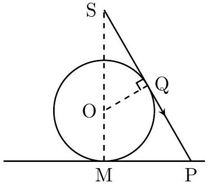

MP is the radius $r$ of the shadow on ground. Let, $\angle \mathrm { MSP } = \theta$. Triangles OSQ and SMP are similar.

$$
\begin{aligned}
\frac { \mathrm { MP } } { \mathrm { MS } } & = \frac { \mathrm { OQ } } { \mathrm { SQ } } \\
\Rightarrow \frac { r } { 3 R } & = \frac { R } { \sqrt { \mathrm { OS } ^ { 2 } - \mathrm { OQ } ^ { 2 } } } = \frac { R } { \mathrm { SQ } } = \frac { R } { R \sqrt { 3 } } \\
r & = R \sqrt { 3 }
\end{aligned}
$$

Area of the shadow $= 3 \pi R ^ { 2 }$.

(b) A transparent liquid of refractive index $\sqrt { 3 }$ is filled above the plane such that the sphere is just covered with liquid. Find the area of the shadow of the sphere on the plane now.
Area =
Solution:
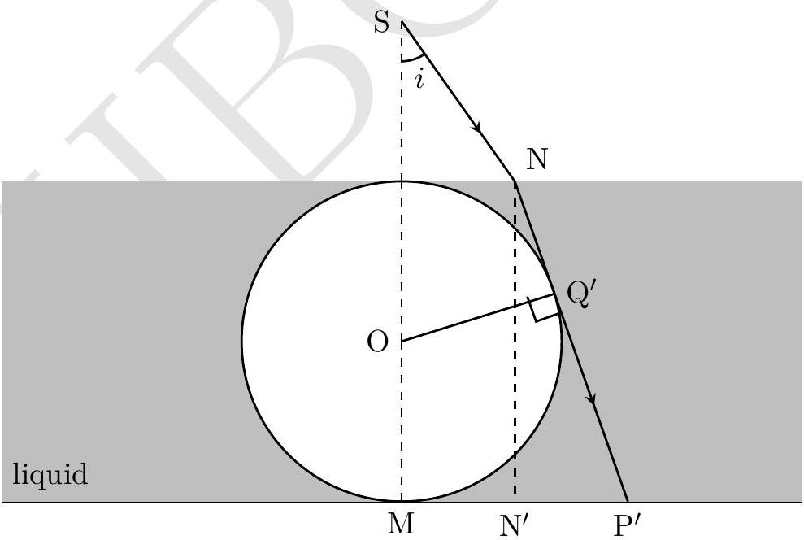

Ray from $S$ is refracted at N. New radius of shadow is $\mathrm { MP } ^ { \prime } = r ^ { \prime }$. Also, $\angle \mathrm { N } ^ { \prime } \mathrm { NP } ^ { \prime } = \theta$. In $\triangle \mathrm { NP } ^ { \prime } \mathrm { N } ^ { \prime }$

$$
\begin{aligned}
\cos \theta & = \frac { \mathrm { NN } ^ { \prime } } { \mathrm { NP } ^ { \prime } } = \frac { 2 R } { r ^ { \prime } + R \tan i } \\
r ^ { \prime } + R \tan i & = \frac { 2 R } { \cos \theta } = 2 R \sec \theta \\
r ^ { \prime } & = \mathrm { P } ^ { \prime } \mathrm { N } ^ { \prime } + \mathrm { N } ^ { \prime } \mathrm { M } \\
& = 2 R \tan \theta + R \tan i
\end{aligned}
$$

which yields

$$
\begin{aligned}
& \sec \theta - \tan \theta = \tan i \\
\Rightarrow & 2 i = \frac { \pi } { 2 } - \theta \\
\Rightarrow & \sin \theta = \frac { \sin i } { \sqrt { 3 } } = \frac { 1 } { 3 } \\
& r ^ { \prime } = 2 R \tan \theta + R \tan i = 2 R \frac { 1 } { \sqrt { 8 } } + R \frac { 1 } { \sqrt { 2 } } = R \sqrt { 2 } \\
\mathrm {~N} & = 2 \pi R ^ { 2 } .
\end{aligned}
$$

Detailed answers can be found on page numbers:

3. Consider an infinite ladder of resistors. The input current $I _ { 0 }$ is indicated in the figure.
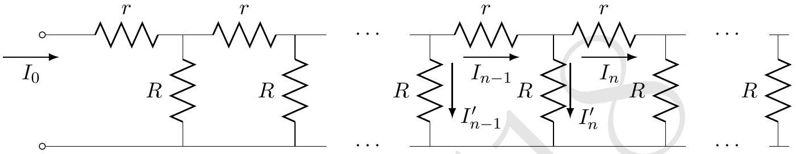
    (a) Find the equivalent resistance of the ladder. [2]
Equivalent resistance =
Solution:
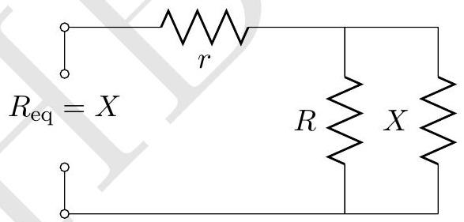
Let equivalent resistance be $X$
$$
\begin{aligned}
r + \frac { R X } { R + X } = & X \\
& X = \frac { r \pm \sqrt { r ^ { 2 } + 4 r R } } { 2 }
\end{aligned}
$$
Taking positive sign
$$
X = \frac { r + \sqrt { r ^ { 2 } + 4 r R } } { 2 }
$$
    (b) Find the recursion relation obeyed by the currents through the horizontal resistors $r$. You will get a relationship where $I _ { n }$ will be related to (may be several) $I _ { i } \mathrm {~s} , i < n , n > 0$. Relation :

Solution: From Kirchhoff's circuit law

$$
\begin{equation*}
I _ { n - 1 } = I _ { n } + I _ { n } ^ { \prime } \tag{1}
\end{equation*}
$$

Using Kirchhoff's voltage law

$$
\begin{equation*}
r I _ { n } + R I _ { n + 1 } ^ { \prime } - R I _ { n } ^ { \prime } = 0 \tag{2}
\end{equation*}
$$

From Eq. (1) we see that

$$
I _ { n + 1 } ^ { \prime } - I _ { n } ^ { \prime } = \left( I _ { n } - I _ { n + 1 } \right) - \left( I _ { n - 1 } - I _ { n } \right) = 2 I _ { n } - I _ { n + 1 } - I _ { n - 1 }
$$

So that Eq. (2) becomes

$$
\begin{equation*}
I _ { n + 1 } - \left( 2 + \frac { r } { R } \right) I _ { n } + I _ { n - 1 } = 0 \tag{3}
\end{equation*}
$$

which is the required recursion relation.

(c) Solve this for the special case $R = r$ to obtain $I _ { n }$ and $I _ { n } ^ { \prime }$ as explicit functions of $n$. You may have to make a reasonable assumption about the behaviour of $I _ { n }$ as $n$ becomes large.
$$
I _ { n } =
$$
$I _ { n } ^ { \prime } =$

Solution: First method:
One can see that $I _ { n - 1 } , I _ { n } , I _ { n + 1 }$ form geometric progression. Also
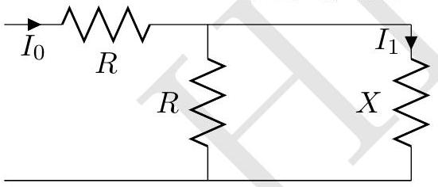
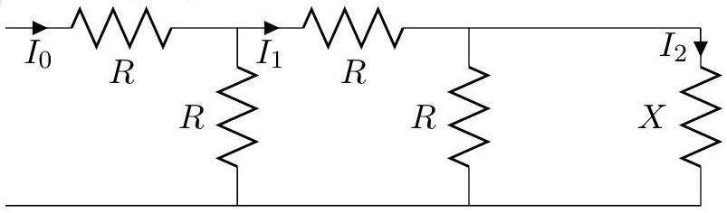

$$
\begin{aligned}
I _ { 1 } & = I _ { 0 } \frac { R } { R + X } \\
I _ { 2 } & = I _ { 1 } \frac { R } { R + X } = I _ { 0 } \left( \frac { R } { R + X } \right) ^ { 2 }
\end{aligned}
$$

(see the figure to the left)
(see the figure to the right)
Hence $I _ { n } = I _ { 0 } \left( \frac { R } { R + X } \right) ^ { n }$
For $r = R , I _ { n } = I _ { 0 } \left( \frac { 3 - \sqrt { 5 } } { 2 } \right) ^ { n } = I _ { 0 } k ^ { n } = I _ { 0 } \left( \frac { \sqrt { 5 } - 1 } { 2 } \right) ^ { 2 n }$
Using Eq. (2)

$$
I _ { n } ^ { \prime } = I _ { 0 } \left( \frac { \sqrt { 5 } - 1 } { 2 } \right) \left( \frac { 3 - \sqrt { 5 } } { 2 } \right) ^ { n - 1 } = I _ { 0 } \left( \frac { \sqrt { 5 } - 1 } { 2 } \right) ^ { 2 n - 1 }
$$

Second method:
For $R = r$, Eq. (3) becomes

$$
\begin{equation*}
I _ { n + 1 } - 3 I _ { n } + I _ { n - 1 } = 0 \tag{4}
\end{equation*}
$$

We can solve this linear recursion relation by assuming the ansatz $I _ { n } \sim \rho ^ { n }$. This leads to

$$
\rho ^ { 2 } - 3 \rho + 1 = 0
$$

so that we have

$$
\rho = \frac { 3 \pm \sqrt { 5 } } { 2 }
$$

This means that the general solution to (4) is

$$
\begin{equation*}
I _ { n } = A \left( \frac { 3 - \sqrt { 5 } } { 2 } \right) ^ { n } + B \left( \frac { 3 + \sqrt { 5 } } { 2 } \right) ^ { n } \tag{5}
\end{equation*}
$$

The second term grows without bound with increasing $n$ - so that for an infinite ladder we must have $B = 0$. Also when $n = 0 , I _ { 0 } = A$. Thus

$$
\begin{aligned}
& I _ { n } = I _ { 0 } \left( \frac { 3 - \sqrt { 5 } } { 2 } \right) ^ { n } \\
& I _ { n } ^ { \prime } = I _ { n - 1 } - I _ { n } = I _ { 0 } \left( \frac { \sqrt { 5 } - 1 } { 2 } \right) \left( \frac { 3 - \sqrt { 5 } } { 2 } \right) ^ { n - 1 }
\end{aligned}
$$

(d) If the ladder is chopped off after the $N$-th node (so that $I _ { N + 1 } = 0$ ) what will the form of $\frac { I _ { n } } { I _ { N } }$ be for $n \leq N$ ?
$$
\frac { I _ { n } } { I _ { N } } =
$$

Solution: First method: Consider the end part of the ladder as shown below.
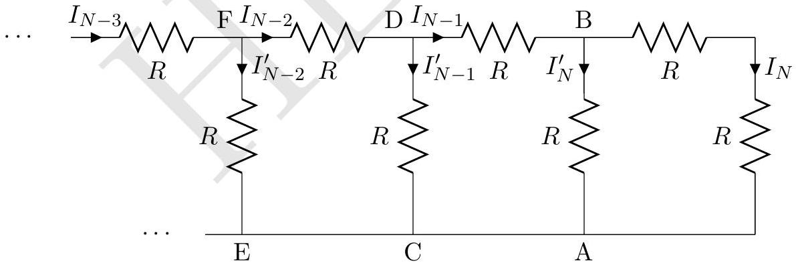
Voltage drop across $\mathrm { AB } = 2 R I _ { N } = I _ { N } ^ { \prime } R \Rightarrow I _ { N } ^ { \prime } = 2 I _ { N }$ and $I _ { N - 1 } = 3 I _ { N }$.
Voltage drop across CD $= \frac { 5 R } { 3 } 3 I _ { N } = I _ { N - 1 } ^ { \prime } R \Rightarrow I _ { N - 1 } ^ { \prime } = 5 I _ { N }$ and $I _ { N - 2 } = 8 I _ { N }$.
Voltage drop across $\mathrm { EF } = \frac { 13 R } { 8 } 8 I _ { N } = I _ { N - 2 } ^ { \prime } R \Rightarrow I _ { N - 2 } ^ { \prime } = 13 I _ { N }$ and $I _ { N - 3 } = 21 I _ { N }$..
This is depicted in figure below.
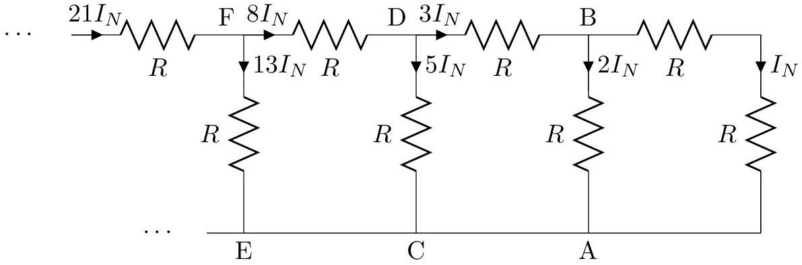

This looks like the terms of Fibonacci sequence. Fibonacci sequence is 1,1,2,3,5,8,13...etc in which $n$th term of Fibonacci sequence is the sum of previous two terms i.e. $F _ { n } =$ $F _ { n - 1 } + F _ { n - 2 } , F _ { 1 } = F _ { 2 } = 1$. In other words:

$$
I _ { N - 1 } = F _ { 4 } , I _ { N - 2 } = F _ { 6 } , I _ { N - 3 } = F _ { 8 } , I _ { N - 4 } = F _ { 10 } \ldots
$$

In general

$$
\begin{align*}
\frac { I _ { N - r } } { I _ { N } } & = F _ { 2 r + 2 }  \tag{6}\\
\frac { I _ { n } } { I _ { N } } & = F _ { 2 ( N - n ) + 2 } \tag{7}
\end{align*}
$$

Second method: See Eq. 5. If $I _ { N + 1 } = 0$, we must have

$$
A \rho _ { 1 } ^ { N + 1 } + B \rho _ { 2 } ^ { N + 1 } = 0
$$

where $\rho _ { 2,1 } = \frac { 3 \pm \sqrt { 5 } } { 2 }$. Thus $B = - A \left( \frac { \rho _ { 1 } } { \rho _ { 2 } } \right) ^ { N + 1 }$ and thus

$$
I _ { n } = A \left( \rho _ { 1 } ^ { n } - \rho _ { 2 } ^ { n } \left( \frac { \rho _ { 1 } } { \rho _ { 2 } } \right) ^ { N + 1 } \right)
$$

and thus

$$
\frac { I _ { n } } { I _ { N } } = \frac { \rho _ { 1 } ^ { n } - \rho _ { 2 } ^ { n } \left( \frac { \rho _ { 1 } } { \rho _ { 2 } } \right) ^ { N + 1 } } { \rho _ { 1 } ^ { N } - \rho _ { 2 } ^ { N } \left( \frac { \rho _ { 1 } } { \rho _ { 2 } } \right) ^ { N + 1 } } = \frac { \rho _ { 1 } \rho _ { 2 } } { \rho _ { 2 } - \rho _ { 1 } } \left[ \rho _ { 1 } ^ { n - N - 1 } - \rho _ { 2 } ^ { n - N - 1 } \right]
$$

Substituting the values, we get

$$
\begin{equation*}
\frac { I _ { n } } { I _ { N } } = \frac { 1 } { \sqrt { 5 } } \left[ \left( \frac { 3 + \sqrt { 5 } } { 2 } \right) ^ { N + 1 - n } - \left( \frac { 3 - \sqrt { 5 } } { 2 } \right) ^ { N + 1 - n } \right] \tag{8}
\end{equation*}
$$

Equations (7) and (8) are equivalent.
Generalization
if $r \neq R$ :
Solution to Eq. (3) is

$$
\rho _ { 2,1 } = \frac { b \pm \sqrt { b ^ { 2 } - 4 } } { 2 } \text { where } b = 2 + \frac { r } { R }
$$

Thus

$$
\begin{align*}
\frac { I _ { n } } { I _ { N } } & = \frac { \rho _ { 1 } \rho _ { 2 } } { \rho _ { 2 } - \rho _ { 1 } } \left[ \rho _ { 1 } ^ { n - N - 1 } - \rho _ { 2 } ^ { n - N - 1 } \right]  \tag{9}\\
& = \frac { 1 } { \rho _ { 2 } - \rho _ { 1 } } \left[ \rho _ { 2 } ^ { N + 1 - n } - \rho _ { 1 } ^ { N + 1 - n } \right] \tag{10}
\end{align*}
$$

Alternate form of Eqs. (7), (8) and (10) are also accepted.

Detailed answers can be found on page numbers:

4. An hour glass is placed on a weighing scale. Initially all the sand of mass $m _ { 0 } \mathrm {~kg}$ in the glass is held in the upper reservoir (ABC) and the mass of the glass alone is $M \mathrm {~kg}$. At $t = 0$, the sand is released. It exits the upper reservoir at constant rate $\frac { d m } { d t } = \lambda \mathrm { kg } / \mathrm { s }$ where $m$ is the mass of the sand in the upper reservoir at time $t$ sec. Assume that the speed of the falling sand is zero at the neck of the glass and after it falls through a constant height $h$ it instantaneously comes to rest on the floor (DE) of the hour
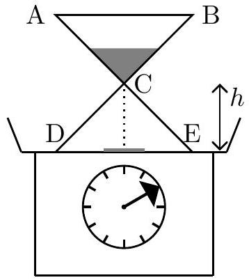
glass. Obtain the reading on the scale for all times $t > 0$. Make a detailed plot of the reading vs time. detailed plot of the reading vs time.

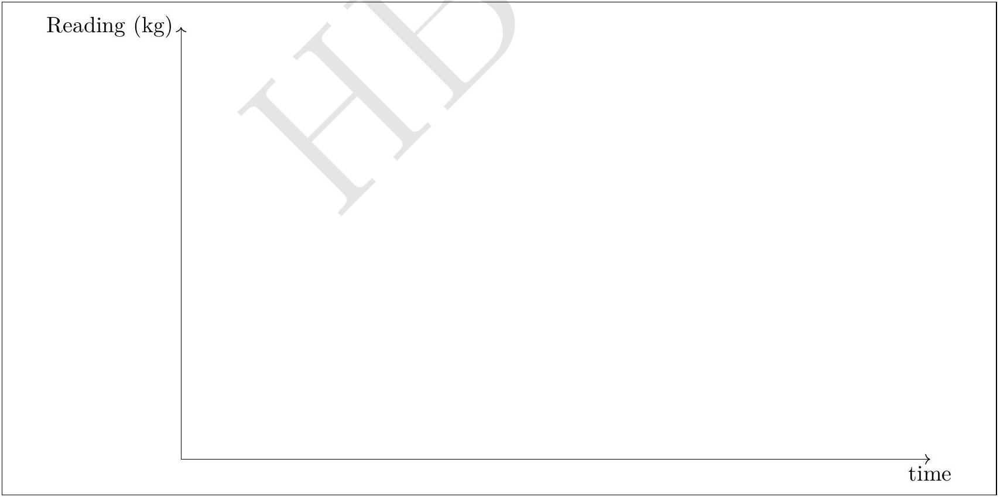

Solution: Velocity of grain when reaches to bottom $v = \sqrt { 2 g h }$. At $t = 0$, sand is released. Time taken $t _ { 1 } = \sqrt { 2 h / g }$.

- $0 < t < t _ { 1 }$ :
For $t < 0$, the scale was $( m + M ) g$. As $t = 0 \rightarrow t _ { 1 }$, more sand will enter the mid air

portion and hence the reading will drop,
$$
\begin{align*}
\lambda & = \frac { d m } { d t } \Rightarrow m = \lambda t  \tag{11}\\
\text { Weight } \left( W _ { 1 } \right) & = ( M + m ) g - \lambda t _ { 1 } g \tag{12}
\end{align*}
$$
    - $t _ { 1 } < t < t _ { 2 }$
Here $t _ { 2 } = m / \lambda$ is the time when all the sand has left the upper reservoir. Just after $t = t _ { 1 }$, force on the scale will partly due to weight of sand as given in above equation and partly due to impulse provided by falling sand.
$$
\begin{align*}
\text { Impulse force } & = v \frac { d m } { d t } = \lambda \sqrt { 2 g h }  \tag{13}\\
\text { Weight } \left( W _ { 2 } \right) & = \left[ ( M = m ) g - \lambda t _ { 1 } g \right] + \lambda \sqrt { 2 g h } = ( M + m ) g \tag{14}
\end{align*}
$$
    - $t _ { 2 } < t < t _ { 3 }$
Here $t _ { 3 } = m / \lambda + \sqrt { 2 h / g }$. This is the time span between the sand has left upper reservoir to when all sand has reached the floor of the hour glass. The weight is
$$
\begin{equation*}
W _ { 3 } = W _ { 2 } + \lambda \left( t - t _ { 2 } \right) g \tag{15}
\end{equation*}
$$
    - For $t > t _ { 3 }$, weight is
$$
W _ { 4 } = ( M + m ) g
$$

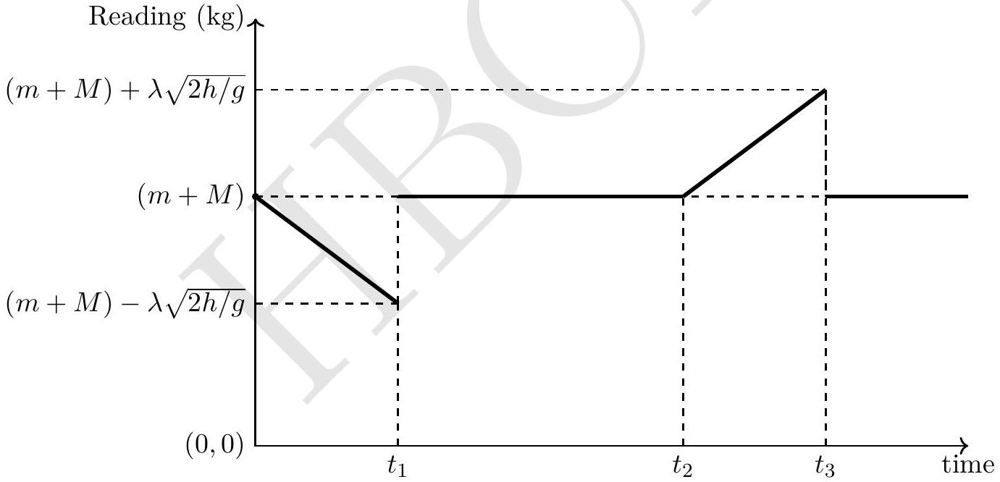

Detailed answers can be found on page numbers:

5. (a) Consider two short identical magnets each of mass $M$ and each of which maybe considered as point dipoles of magnetic moment $\vec { \mu }$. One of them is fixed to the floor with its magnetic moment pointing upwards and the other one is free and found to float in equilibrium at a height $z$ above the fixed dipole. The magnetic field due to a point dipole at a distance $r$ from it is
$$
\vec { B } ( \vec { r } ) = \frac { \mu _ { 0 } } { 4 \pi r ^ { 3 } } ( 3 ( \vec { \mu } \cdot \hat { r } ) \hat { r } - \vec { \mu } )
$$
Obtain an expression for the magnitude of the dipole moment of the magnet in terms of $z$ and related quantities.
$$
\vec { \mu } =
$$

Solution: Given

$$
\begin{aligned}
& \vec { B } ( \vec { r } ) = \frac { \mu _ { 0 } } { 4 \pi r ^ { 3 } } [ 3 ( \vec { \mu } \cdot \hat { r } ) \hat { r } - \vec { \mu } ] \\
& \begin{aligned}
\hat { r } = \hat { k } , r & = z \\
\vec { B } ( z ) & = \frac { \mu _ { 0 } } { 4 \pi z ^ { 3 } } [ 3 \mu \hat { k } - \mu \hat { k } ] \\
& = \frac { \mu _ { 0 } } { 4 \pi z ^ { 3 } } [ 2 \mu \hat { k } ] \\
B ( z ) & = \frac { \mu _ { 0 } \mu } { 2 \pi z ^ { 3 } }
\end{aligned}
\end{aligned}
$$

The magnets are oppositely facing along $\hat { z }$. The force on the upper magnet due to the lower fixed magnet is

$$
\vec { F } = \frac { 3 \mu _ { 0 } \mu ^ { 2 } } { 2 \pi z ^ { 4 } }
$$

The repulsive magnetic force is balanced by the weight acting down.

$$
\begin{align*}
M g & = \frac { 3 } { 2 } \frac { \mu _ { 0 } } { \pi z ^ { 4 } } \mu ^ { 2 }  \tag{16}\\
\mu ^ { 2 } & = \frac { 2 } { 3 } \frac { \pi z ^ { 4 } } { \mu _ { 0 } } M g \\
\mu & = \left( \frac { M g } { 6 } \frac { 4 \pi } { \mu _ { 0 } } \right) ^ { 1 / 2 } z ^ { 2 } \tag{17}
\end{align*}
$$

(b) i. Consider a ring of mass $M _ { r }$ rotating with uniform angular speed about its axis. A charge $q$ is smeared uniformly over it. Relate its angular momentum $\overrightarrow { S _ { r } }$ to its magnetic moment $\left( \overrightarrow { \mu _ { r } } \right)$.

$$
\overrightarrow { \mu _ { r } } =
$$

Solution: Let radius of the ring to be $R$ and it is rotating with the angular speed $\omega \hat { z }$. Dipole moment can be expressed as

$$
\begin{aligned}
\vec { \mu } _ { r } = \text { current × area } & = \frac { q \omega } { 2 \pi } \pi R ^ { 2 } \hat { z } \\
\vec { S } _ { r } & = M _ { r } \omega R ^ { 2 } \hat { z } \\
\Rightarrow \vec { \mu } _ { r } & = \frac { q } { 2 M _ { r } } \vec { S } _ { r }
\end{aligned}
$$

ii. Assume that the electron is a sphere of uniform charge density rotating about its diameter with constant angular speed. Also assume that the same relation as in the previous part holds between its angular momentum $\vec { S }$ and its magnetic dipole moment $\left( \vec { \mu } _ { \mathrm { B } } \right)$. Further assume that $S = h / ( 2 \pi )$ where $h$ is Planck's constant. Calculate $\mu _ { B }$.

$$
\mu _ { \mathrm { B } } =
$$

Solution:

$$
\mu _ { \mathrm { B } } = \frac { e \hbar } { 2 m _ { e } } = 9.20 \times 10 ^ { - 24 } \text { to } 9.30 \times 10 ^ { - 24 } \mathrm {~A} \cdot \mathrm {~m} ^ { 2 }
$$

iii. Assume that the sole contribution to the dipole moment of a $\mathrm { ZnFe } _ { 2 } \mathrm { O } _ { 4 }$ molecule comes from an unpaired electron. Also assume that the magnets in the part (5a) are 0.482 kg each of $\mathrm { ZnFe } _ { 2 } \mathrm { O } _ { 4 }$ and the unpaired electrons of the molecules are all aligned. Calculate the height $z$. (Note: The molecular weight of $\mathrm { ZnFe } _ { 2 } \mathrm { O } _ { 4 } = 211$ )
$$
z =
$$

Solution: The system (dipole) is made of $\mathrm { ZnFe } _ { 2 } \mathrm { O } _ { 4 }$ and has one electron/molecule. The number of molecules is

$$
\begin{align*}
& = \frac { \text { Mass of } \mathrm { ZnFe } _ { 2 } \mathrm { O } _ { 4 } \text { in } \mathrm { gm } } { \text { Molecular weight of } \mathrm { ZnFe } _ { 2 } \mathrm { O } _ { 4 } } \times N _ { A }  \tag{18}\\
& = \frac { M } { A } \times N _ { A } \tag{19}
\end{align*}
$$

Assuming that each molecule of $\mathrm { ZnFe } _ { 2 } \mathrm { O } _ { 4 }$ has one unpaired electron and each contributes to dipole moment. Further all of them are perfectly aligned. Hence dipole moment is

$$
\begin{equation*}
\mu = \frac { M N _ { A } \mu _ { \mathrm { B } } } { A } \tag{20}
\end{equation*}
$$

Using Eq. (17)

$$
6.60 \leq z ( \mathrm {~cm} ) \leq 6.80
$$

iv. In an experiment $\mu _ { B }$ is aligned along a magnetic field of 1 T. It is flipped in a direction anti-parallel to the magnetic field by an incident photon. What should be the wavelength of this photon?
Wavelength =

Solution:

$$
\begin{equation*}
\text { Wavelength } = \frac { h c } { 2 \mu _ { \mathrm { B } } B } = 1.00 \text { to } 1.10 \mathrm {~cm} \tag{21}
\end{equation*}
$$

Detailed answers can be found on page numbers:
6. The Van der Waals Gas:

Consider $n$ mole of a non-ideal (realistic) gas. Its equation of state maybe described by the Van der Waals equation

$$
\left( P + \frac { a n ^ { 2 } } { V ^ { 2 } } \right) \left( \frac { V } { n } - b \right) = R T
$$

where $a$ and $b$ are positive constants. We take one mole of the gas $( n = 1 )$. You must bear in mind that one is often required to make judicious approximations to understand realistic systems.

(a) For this part only take $a = 0$. Obtain expressions in terms of $V , T$ and constants for
$$
\text { i. the coefficient of volume expansion } ( \beta ) \text {; }
$$
$$
\beta =
$$

Solution:

$$
\begin{equation*}
\beta = \frac { 1 } { V } \left( \frac { d V } { d T } \right) _ { p } = \frac { V - b } { V T } \tag{22}
\end{equation*}
$$

ii. the isothermal compressibility $( \kappa )$.
$$
\kappa =
$$

Solution:

$$
\begin{equation*}
\kappa = - \frac { 1 } { V } \left( \frac { d V } { d P } \right) _ { T } = \frac { ( V - b ) ^ { 2 } } { V R T } \tag{23}
\end{equation*}
$$

(b) Criticality:
The Van der Waals gas exhibits phase transition. A typical isotherm at low temperature is shown in the figure. Here $L ( G )$ represents the liquid (gas) phase and at $P _ { L G }$ there are three possible solutions for the volume $\left( V _ { L } , V _ { L G } , V _ { G } \right)$. As the temperature is raised, at a certain temperature $T _ { c }$, the three values of the volume merge to a single value, $V _ { c }$ (corresponding pressure being $P _ { c }$ ). This is called the point of criticality. As the temperature is raised further there exists only one real solution for the volume and the isotherm resembles that of an ideal gas.
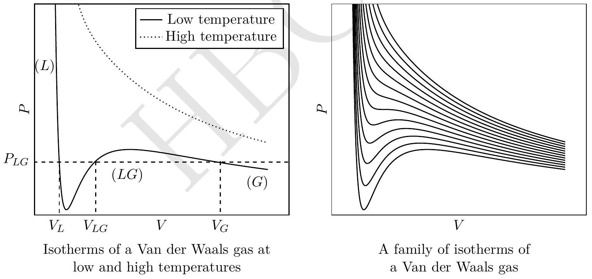
    i. Obtain the critical constants $P _ { c } , V _ { c }$ and $T _ { c }$ in terms of $a , b$ and $R$.
$$
\begin{array} { | l | l | l | }
\hline P _ { c } = & V _ { c } = & T _ { c } = \\
\hline
\end{array}
$$
Solution: At criticality, the curve is a cubic like function. Hence
$$
\left( \frac { d P } { d V } \right) _ { T } = \left( \frac { d ^ { 2 } P } { d V ^ { 2 } } \right) _ { T } = 0
$$

Above condition along with Van der Waal's equation can be used to obtain

$$
\begin{align*}
V _ { C } & = 3 b  \tag{24}\\
T _ { C } & = \frac { 8 a } { 27 R b }  \tag{25}\\
P _ { C } & = \frac { a } { 27 b ^ { 2 } } \tag{26}
\end{align*}
$$

ii. Obtain the values of $a$ and $b$ for $\mathrm { CO } _ { 2 }$ given $T _ { c } = 3.04 \times 10 ^ { 2 } \mathrm {~K}$ and $P _ { c } = 7.30 \times 10 ^ { 6 } \mathrm {~N} \cdot \mathrm {~m} ^ { - 2 }$.
$a =$
$b =$

Solution: $a = 0.37 \mathrm {~m} ^ { 6 } \cdot \mathrm {~Pa} / \mathrm { mol } ^ { 2 }$ and $b = 4.33 \times 10 ^ { - 5 } \mathrm {~m} ^ { 3 } / \mathrm { mol }$.

iii. The constant $b$ represents the volume of the gas molecules of the system. Estimate the size $d$ of a $\mathrm { CO } _ { 2 }$ molecule.
$d =$

Solution:

$$
\begin{aligned}
& b = N _ { A } d ^ { 3 } \text { or } N _ { A } 4 \pi r ^ { 3 } / 3 \\
& d = 1.0 \times 10 ^ { - 10 } \mathrm {~m} \text { to } 6.0 \times 10 ^ { - 10 } \mathrm {~m}
\end{aligned}
$$

(c) The gas phase:

For the gaseous phase the volume $V _ { G } \gg b$. Let the pressure $P _ { L G } = P _ { 0 }$, the saturated vapour pressure.

i. Obtain the expression for $V _ { G }$ in terms of $R , T , P _ { 0 }$ and $a$.
$V _ { G } =$

Solution:

$$
\begin{array} { r }
P _ { 0 } V _ { G } ^ { 2 } - R T V _ { G } + a = 0 \\
V _ { G } = \frac { R T } { 2 P _ { 0 } } \left( 1 \pm \left( 1 - \frac { 4 a P _ { 0 } } { R ^ { 2 } T ^ { 2 } } \right) ^ { 1 / 2 } \right)
\end{array}
$$

Taking positive sign since in the ideal gas limit $a \longrightarrow 0 , V _ { I } = \frac { R T } { P _ { 0 } }$ for one mole.

$$
V _ { G } \simeq \frac { R T } { P _ { 0 } } - \frac { a } { R T }
$$

$$
\begin{aligned}
& \text { ii. } \text { State } \\
& V _ { I } =
\end{aligned}
$$

Solution: $V _ { I } = \frac { R T } { P _ { 0 } }$

iii. Obtain $\left( V _ { G } - V _ { I } \right) / V _ { I }$ for water given $T = 1.00 \times 10 ^ { 2 } { } ^ { \circ } \mathrm { C } , P _ { 0 } = 1.00 \times 10 ^ { 5 } \mathrm {~Pa} , b = 3.10 \times$ $10 ^ { - 5 } \mathrm {~m} ^ { 3 } \cdot \mathrm {~mol} ^ { - 1 }$ and $a = 0.56 \mathrm {~m} ^ { 6 } \cdot \mathrm {~Pa} \cdot \mathrm {~mol} ^ { - 2 }$. Comment on your result.
$$
\frac { V _ { G } - V _ { I } } { V _ { I } } = \quad \text { Comment: }
$$

Solution: Comment 1: For ideal gas, $\frac { a } { R T }$ vanishes as $T \rightarrow \infty$.

$$
\frac { V _ { G } - V _ { I } } { V _ { I } } = \frac { - a P _ { 0 } } { ( R T ) ^ { 2 } } \simeq - 5.50 \times 10 ^ { - 3 } \text { to } - 7.00 \times 10 ^ { - 3 }
$$

Comment 2: Answer is negative, indicating attractive intermolecular forces.

(d) The liquid phase:
For the liquid phase $P \ll a / V _ { L } ^ { 2 }$.
    i. Obtain the expression for $V _ { L }$.
$$
V _ { L } =
$$

Solution: In this phase $P \ll \frac { a } { V _ { L } ^ { 2 } }$ Hence

$$
\begin{array} { r }
\frac { a } { V _ { L } ^ { 2 } } \left( V _ { L } - b \right) = R T \\
V _ { L } = \frac { a } { 2 R T } \left( 1 \pm \sqrt { 1 - \frac { 4 b R T } { a } } \right)
\end{array}
$$

Taking negative sign since as $T \rightarrow 0 , V _ { L } \rightarrow b$.

$$
\begin{aligned}
V _ { L } & = \frac { a } { 2 R T } \left( 1 - \sqrt { 1 - \frac { 4 b R T } { a } } \right) \\
& \simeq b \left( 1 + \frac { b R T } { a } \right)
\end{aligned}
$$

ii. Obtain the density of water $\left( \rho _ { w } \right)$. You may take the molar mass to be $1.80 \times 10 ^ { - 2 }$ $\mathrm { kg } \cdot \mathrm { mole } ^ { - 1 }$.
$$
\rho _ { w } =
$$

Solution:

$$
\begin{equation*}
\rho _ { w } \approx \frac { 1.80 \times 10 ^ { - 2 } } { b } = 3.60 \times 10 ^ { 2 } \text { to } 6.00 \times 10 ^ { 2 } \mathrm { Kg } / \mathrm { m } ^ { 3 } \tag{27}
\end{equation*}
$$

iii.The heat of vaporization is the energy required to overcome the attractive intermolecular force as the system is taken from the liquid phase $\left( V _ { L } \right)$ to the gaseous phase $\left( V _ { G } \right)$. The term $a / V ^ { 2 }$ represents this. Obtain the expression for the specific heat of vaporization per unit mass $( L )$ and obtain its value for water.

| $L =$ | Value of $L =$ |
| :--- | :--- |
| Solution: $\begin{aligned} L \times \text { molar mass } & = \int _ { V _ { L } } ^ { V _ { G } } \frac { a } { V ^ { 2 } } d V \simeq \frac { a } { V _ { L } } \\ L & \simeq 6.0 \times 10 ^ { 5 } \text { to } 1.1 \times 10 ^ { 6 } \mathrm {~J} / \mathrm { Kg } \end{aligned}$ |  |

Detailed answers can be found on page numbers:
7. A small circular hole of diameter $d$ is punched on the side and the near the bottom of a transparent cylinder of diameter $D$. The hole is initially sealed and the cylinder is filled with water of density $\rho _ { w }$. It is then inverted onto a bucket filled to the brim with water. The seal is removed, air rushes in and height $h ( t )$ of the water level (as measured from the surface level of the water in the bucket) is recorded at different times $( t )$. The figure below and the table in part (c) illustrates this process. Assume that air is an incompressible fluid with density $\rho _ { a }$ and its motion into the cylinder is a streamline flow. Thus its speed $v$ is related to the pressure difference $\Delta P$ by the Bernoulli relation. Take the outside pressure $P _ { 0 }$ to be atmospheric pressure $= 1.00 \times 10 ^ { 5 } \mathrm {~Pa}$.
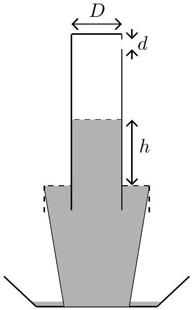
    (a) Obtain the dependence of the instantaneous speed $v _ { w }$ of the water level in the cylinder on $h$.
$$
v _ { w } =
$$

Solution: at time $t$ from pressure balance equation

$$
\begin{aligned}
P _ { 0 } & = p + h \rho _ { w } g \\
\Delta P & = P _ { 0 } - p = h \rho _ { w } g
\end{aligned}
$$

From Bernoulli's principle

$$
\begin{aligned}
\frac { 1 } { 2 } v ^ { 2 } \rho _ { a } & = h \rho _ { w } g = \Delta P \\
v & = \sqrt { \frac { 2 \rho _ { w } g } { \rho _ { a } } } \sqrt { h }
\end{aligned}
$$

The speed of air gushing in through the small hole is related to speed $v _ { w }$ of fall of water level by
$$
\begin{align*}
\frac { \pi d ^ { 2 } } { 4 } v & = \frac { \pi D ^ { 2 } } { 4 } v _ { w }  \tag{28}\\
v _ { w } & = \frac { d ^ { 2 } } { D ^ { 2 } } \sqrt { \frac { 2 \rho _ { w } g } { \rho _ { a } } } \sqrt { h } \tag{29}
\end{align*}
$$
(b) Obtain the dependence of $h$ on time.
$$
h =
$$

Solution:

$$
\begin{aligned}
& v _ { w } = - \frac { d h } { d t } = \frac { d ^ { 2 } } { D ^ { 2 } } \sqrt { \frac { 2 \rho _ { w } g } { \rho _ { a } } } \sqrt { h } \\
& \sqrt { h } = \sqrt { h _ { 0 } } - \frac { d ^ { 2 } } { D ^ { 2 } } \sqrt { \frac { \rho _ { w } g } { 2 \rho _ { a } } } t
\end{aligned}
$$

(c)The table gives the height $h$ as function of time $t$. Draw a suitable linear graph ( $t$ on $x$ axis) from this data on the graph paper provided. Two graph papers are provided with this booklet in case you make a mistake.

| $t ( \mathrm { sec } )$ | $h ( \mathrm {~cm} )$ |
| :--- | :--- |
| 0.57 | 21.54 |
| 1.20 | 20.10 |
| 1.81 | 18.67 |
| 2.47 | 17.23 |
| 3.07 | 15.80 |
| 3.86 | 14.36 |
| 4.55 | 12.92 |
| 5.34 | 11.49 |
(d) From the graph and the following data: $D = 6.66 \mathrm {~cm} , \rho _ { a } = 1.142 \mathrm {~kg} / \mathrm { m } ^ { 3 } , \rho _ { w } = 1.000 \times$ $10 ^ { 3 } \mathrm {~kg} / \mathrm { m } ^ { 3 }$ obtain
i. The height $h _ { 0 }$ at $t = 0$.
$$
h _ { 0 } =
$$
Solution: $22.0 \leq h _ { 0 } ( \mathrm {~cm} ) \leq 24.0$
ii. The value of $d$.
$$
d =
$$
Solution: $- 0.27 \leq \operatorname { slope } ( \sqrt { \mathrm { cm } } / s ) \leq - 0.25$
$$
0.13 \leq d ( \mathrm {~cm} ) \leq 0.14
$$
iii. The initial speed $\left( v _ { w } \right)$ of the water level.
$$
v _ { w } ( t = 0 ) =
$$

Solution: $2.35 \leq v _ { w } ( \mathrm {~cm} / \mathrm { s } ) \leq 2.65$

Detailed answers can be found on page numbers:

□
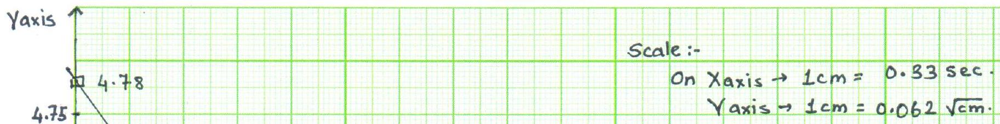
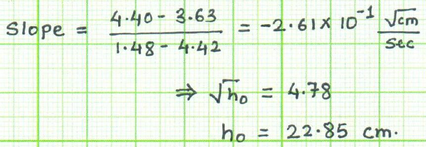
