## Solutions of Indian National Physics Olympiad - 2019

Date: 03 February 2019
Time : 09:00-12:00 (3 hours)

Extra sheets attached : □ Centre (e.g. Kota)
(Do not write below this line) Instructions

1. This booklet consists of 20 pages (excluding this page) and total of 7 questions.
2. This booklet is divided in two parts: Questions with Summary Answer Sheet and Detailed Answer Sheet. Write roll number at the top wherever asked.
3. The final answer to each sub-question should be neatly written in the box provided below each sub-question in the Questions \& Summary Answer Sheet.
4. You are also required to show your detailed work for each question in a reasonably neat and coherent way in the Detailed Answer Sheet. You must write the relevant Question Number(s) on each of these pages.
5. Marks will be awarded on the basis of what you write on both the Summary Answer Sheet and the Detailed Answer Sheet. Simple short answers and plots may be directly entered in the Summary Answer Sheet. Marks may be deducted for absence of detailed work in questions involving longer calculations. Strike out any rough work that you do not want to be considered for evaluation.
6. Adequate space has been provided in the answersheet for you to write/calculate your answers. In case you need extra space to write, you may request additional blank sheets from the invigilator. Write your roll number on the extra sheets and get them attached to your answersheet and indicate number of extra sheets attached at the top of this page.
7. Non-programmable scientific calculators are allowed. Mobile phones cannot be used as calculators.
8. Use blue or black pen to write answers. Pencil may be used for diagrams/graphs/sketches.
9. This entire booklet must be returned at the end of the examination.

Table of Constants
| Speed of light in vacuum | $c$ | $3.00 \times 10 ^ { 8 } \mathrm {~m} \cdot \mathrm {~s} ^ { - 1 }$ |
| :--- | :--- | :--- |
| Planck's constant | $h$ | $6.63 \times 10 ^ { - 34 } \mathrm {~J} \cdot \mathrm {~s}$ |
|  | $\hbar$ | $h / 2 \pi$ |
| Universal constant of Gravitation | $G$ | $6.67 \times 10 ^ { - 11 } \mathrm {~N} \cdot \mathrm {~m} ^ { 2 } \cdot \mathrm {~kg} ^ { - 2 }$ |
| Magnitude of electron charge | $e$ | $1.60 \times 10 ^ { - 19 } \mathrm { C }$ |
| Rest mass of electron | $m _ { e }$ | $9.11 \times 10 ^ { - 31 } \mathrm {~kg}$ |
| Value of $1 / 4 \pi \epsilon _ { 0 }$ |  | $9.00 \times 10 ^ { 9 } \mathrm {~N} \cdot \mathrm {~m} ^ { 2 } \cdot \mathrm { C } ^ { - 2 }$ |
| Avogadro's number | $N _ { A }$ | $6.022 \times 10 ^ { 23 } \mathrm {~mol} ^ { - 1 }$ |
| Acceleration due to gravity | $g$ | $9.81 \mathrm {~m} \cdot \mathrm {~s} ^ { - 2 }$ |
| Universal Gas Constant | $R$ | $8.31 \mathrm {~J} \cdot \mathrm {~K} ^ { - 1 } \cdot \mathrm {~mol} ^ { - 1 }$ |
|  | R | $0.0821 \mathrm { l } \cdot \mathrm { atm } \cdot \mathrm { mol } ^ { - 1 } \cdot \mathrm {~K} ^ { - 1 }$ |
| Permeability constant | $\mu _ { 0 }$ | $4 \pi \times 10 ^ { - 7 } \mathrm { H } \cdot \mathrm { m } ^ { - 1 }$ |

| Question | Marks | Score |
| :--- | :--- | :--- |
| 1 | 9 |  |
| 2 | 11 |  |
| 3 | 12 |  |
| 4 | 7 |  |
| 5 | 9 |  |
| 6 | 14 |  |
| 7 | 13 |  |
| Total | 75 |  |

HOMI BHABHA CENTRE FOR SCIENCE EDUCATION
Tata Institute of Fundamental Research
V. N. Purav Marg, Mankhurd, Mumbai, 400088

1. In the lower part of the earth's atmosphere, the temperature decreases with increase of height. Choose the origin of the coordinate system at the ground level with the $y$ - axis vertically upward and the $x$-axis horizontal. We assume a linear decrease of temperature such that the temperature at a height $y$ from the ground level is
$$
T ( y ) = T _ { 0 } ( 1 - b y )
$$
where $T _ { 0 }$ is the temperature at the ground level. The constant $b = 0.023 \mathrm {~km} ^ { - 1 }$. We consider the propagation of sound in the $x - y$ plane. Ignore any attenuation, reflection, and diffraction of sound.
    (a) If $v _ { 0 }$ is the speed of sound at the ground level, obtain an expression for the speed of sound $v ( y )$ at height $y$, in terms of $v _ { 0 }$ and $b$.
$$
v ( y ) =
$$

Solution: Speed of sound is

$$
\begin{equation*}
v = \sqrt { \frac { \gamma R T } { m } } \tag{1.1}
\end{equation*}
$$

where $m$ and $\gamma$ are the molar mass and adiabatic index of the gas respectively.

$$
\begin{equation*}
v ( y ) = \sqrt { \frac { \gamma R T ( y ) } { m } } = \sqrt { \frac { \gamma R T _ { 0 } } { m } } \sqrt { 1 - b y } = v _ { 0 } \sqrt { 1 - b y } \tag{1.2}
\end{equation*}
$$

Here $v _ { 0 } = \sqrt { \gamma R T _ { 0 } / m }$ is the speed of the sound at ground level.

(b) Suppose sound propagates from the origin with an initial angle $\theta _ { 0 }$ with the $x$-axis. Obtain an expression for the angle $\theta$ made by the direction of propagation of sound with the horizontal at height $y$, in terms of $\theta _ { 0 }$ and $b$.
$$
\theta =
$$

Solution: Consider the propogation of sound "ray" from one medium to the other.
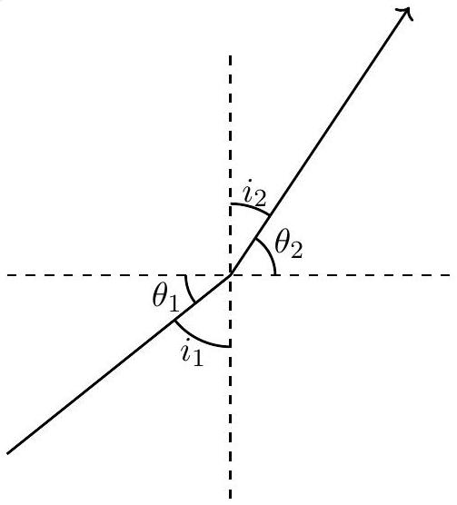

From Snell's law,

$$
\begin{align*}
\frac { \sin i _ { 2 } } { \sin i _ { 1 } } & = \frac { v _ { 2 } } { v _ { 1 } }  \tag{1.3}\\
\frac { \sin \left( \frac { \pi } { 2 } - \theta _ { 2 } \right) } { \sin \left( \frac { \pi } { 2 } - \theta _ { 1 } \right) } & = \frac { \cos \theta _ { 2 } } { \cos \theta _ { 1 } } = \frac { v _ { 2 } } { v _ { 1 } }  \tag{1.4}\\
\frac { \cos \theta } { \cos \theta _ { 0 } } & = \frac { v ( y ) } { v _ { 0 } } = \sqrt { 1 - b y }  \tag{1.5}\\
\theta & = \cos ^ { - 1 } \left[ \cos \theta _ { 0 } \sqrt { 1 - b y } \right] \tag{1.6}
\end{align*}
$$

(c) Obtain an expression for the $x$ and $y$ coordinates of a point on the path of propagation as functions of $\theta$.
$$
x =
$$
$$
y =
$$

Solution:

$$
\begin{align*}
y & = \frac { 1 } { b } \left( 1 - \frac { \cos ^ { 2 } \theta } { \cos ^ { 2 } \theta _ { 0 } } \right)  \tag{1.7}\\
\frac { d y } { d x } & = \tan \theta  \tag{1.8}\\
d x & = \frac { 2 \cos \theta \sin \theta } { \tan \theta b \cos ^ { 2 } \theta _ { 0 } } d \theta  \tag{1.9}\\
x = \int _ { 0 } ^ { x } d x & = \frac { 1 } { 2 b \cos ^ { 2 } \theta _ { 0 } } \left[ 2 \left( \theta - \theta _ { 0 } \right) + \sin 2 \theta - \sin 2 \theta _ { 0 } \right] \tag{1.10}
\end{align*}
$$

(d) For this part assume the direction of propagation of sound to be horizontal at the origin. For the case where $y$ is of the order 100 m or less, obtain an approximated expression relating $x$ and $y$ i.e. $y ( x )$. Obtain $x$ for $y = 2.00 \mathrm {~m}$.
$$
y ( x ) = \quad \text { Value of } x =
$$

Solution: For $y \leq 100 \mathrm {~m}$ and $\theta _ { 0 } = 0$, Eq. (1.6) gives $\theta \approx 3 ^ { \circ }$ (very small).

$$
\begin{align*}
y & \approx \frac { 1 } { b } \left[ 1 - \left( 1 - \frac { \theta ^ { 2 } } { 2 } \right) ^ { 2 } \right] = \frac { 1 } { b } \theta ^ { 2 }  \tag{1.11}\\
x & \approx \frac { 1 } { 2 b } ( 2 \theta + 2 \theta ) = \frac { 2 \theta } { b }  \tag{1.12}\\
x ^ { 2 } & = \frac { 4 y } { b }  \tag{1.13}\\
x ( y = 2 ) & \approx 590 \mathrm {~m} \tag{1.14}
\end{align*}
$$

Accepted range 585-600 m.

Detailed answers can be found on page numbers:

2. Consider a particle of mass $m$ confined to a one dimensional box of length $L$. The particle moves in the box with momentum $p$ colliding elastically with the walls. We consider the quantum mechanics of this system. As far as possible, express your answers in terms of $\alpha = h ^ { 2 } / 8 m$.
    (a) At each energy state, the particle may be represented by a standing wave given by the de Broglie hypothesis. Express its wavelengths $\lambda _ { \mathrm { dB } }$ in terms of $L$ in the $n ^ { \text {th } }$ energy state.
$$
\lambda _ { \mathrm { dB } } =
$$
Solution: $\lambda _ { \mathrm { dB } } = \frac { 2 L } { n }$
    (b) Write the energy of the $n ^ { \text {th } }$ energy state, $E _ { n }$.
$$
E _ { n } =
$$

Solution:

$$
\begin{equation*}
E _ { n } = \frac { p ^ { 2 } } { 2 m } = \frac { n ^ { 2 } h ^ { 2 } } { 8 m L ^ { 2 } } = \frac { \alpha n ^ { 2 } } { L ^ { 2 } } \tag{2.1}
\end{equation*}
$$

where we have used $p = h / \lambda _ { \mathrm { dB } }$.

(c) Let there be $N$ (mass $m$ ) electrons in this box where $N$ is an even number. Obtain the expression for the lowest possible total energy $U _ { 0 }$ of the system (e.g., the ground state energy of this $N$-particle system). Neglect coulombic interaction between the electrons.
$$
U _ { 0 } =
$$
Solution: Highest occupied level is $n _ { \text {max } } = N / 2$ and each level is occupied by the two electrons.
$$
\begin{equation*}
U _ { 0 } = \sum _ { n = 1 } ^ { N / 2 } E _ { n } = \frac { 2 \alpha } { L ^ { 2 } } \sum _ { n = 1 } ^ { N / 2 } n ^ { 2 } = \frac { \alpha N ( N + 1 ) ( N + 2 ) } { 12 L ^ { 2 } } \tag{2.2}
\end{equation*}
$$
(d) Express the total energy $U _ { 1 }$ in terms of $U _ { 0 }$ and relevant quantities when the system is in the first excited state. Also express the total energy $U _ { 2 }$ in terms of $U _ { 0 }$ and relevant quantities when the system is in the second excited state.
$$
U _ { 1 } =
$$

$U _ { 2 } =$

Solution: $1 ^ { \text {st } }$ excited state configuration is
Energy level Configuration

$$
N / 2 + 1 \quad - 1 - - -
$$

$$
N / 2 \quad - 1 - - -
$$

$$
\begin{align*}
U _ { 1 } & = U _ { 0 } - \frac { \alpha } { L ^ { 2 } } \left( \frac { N } { 2 } \right) ^ { 2 } + \frac { \alpha } { L ^ { 2 } } \left( \frac { N } { 2 } + 1 \right) ^ { 2 }  \tag{2.3}\\
& = U _ { 0 } + \frac { \alpha } { L ^ { 2 } } ( N + 1 ) \tag{2.4}
\end{align*}
$$

Solution: $2 ^ { \text {nd } }$ excited state configuration is
Energy level Configuration

$$
\begin{align*}
& N / 2 + 1 \quad - 1 \ldots  \tag{-1 - --}\\
& N / 2 \quad - 1 \text { h - - }  \tag{_1b___}\\
& N / 2 - 1 \quad - \ldots  \tag{_1---}\\
& 0 - \frac { \alpha } { L ^ { 2 } } \left( \frac { N } { 2 } - 1 \right) ^ { 2 } + \frac { \alpha } { L ^ { 2 } } \left( \frac { N } { 2 } + 1 \right) ^ { 2 } \\
& 0 + \frac { \alpha } { L ^ { 2 } } 2 N
\end{align*}
$$

(e) When the system is in the ground state, let the length of the box change slowly from $L$ to $L - \Delta L$. Obtain the magnitude of the force $F$ on each wall in terms of $U _ { 0 }$, when $\Delta L \ll L$.

$$
F =
$$

Solution: From the work-energy theorem,

$$
\begin{align*}
F \Delta L & = U _ { \text {final } } - U _ { \text {initial } }  \tag{2.7}\\
& = \frac { \alpha N ( N + 1 ) ( N + 2 ) } { 12 } \left[ \frac { 1 } { ( L - \Delta L ) ^ { 2 } } - \frac { 1 } { L ^ { 2 } } \right]  \tag{2.8}\\
F & \approx \frac { \alpha N ( N + 1 ) ( N + 2 ) 2 } { 12 L ^ { 3 } } = \frac { 2 U _ { 0 } } { L } \tag{2.9}
\end{align*}
$$

(f) Assuming $N$ is large ( $N \gg 1$ ) obtain the ratio $r$ of $d U _ { 0 } / d N$ to the energy level of the highest occupied ground state.

$r =$

Solution:

$$
\begin{align*}
\frac { d U _ { 0 } } { d N } & = \frac { \alpha } { 12 L ^ { 2 } } \frac { d } { d N } \left( N ^ { 3 } + 3 N ^ { 2 } + 2 N \right)  \tag{2.10}\\
& \approx \frac { \alpha } { 12 L ^ { 2 } } 3 N ^ { 2 } \tag{2.11}
\end{align*}
$$

Highest occupied ground state corresponds to $N / 2$, for which the energy level is $\alpha N ^ { 2 } / 4 L ^ { 2 }$. Thus

$$
\begin{equation*}
r = 1 \tag{2.12}
\end{equation*}
$$

(g) We assume once again that $N$ is large. Consider the possibility of the electrons forming a uniform continuum of length $L$ with constant linear density. Using dimensional analysis, calculate the gravitational energy of this system $U _ { \mathrm { G } }$ assuming that it depends on its total mass, universal gravitational constant $G$ and $L$. Equate this (attractive) energy to the (repulsive) energy $U _ { 0 } ( N )$. Obtain $L$ in terms of $N$ and related quantities.
$$
U _ { \mathrm { G } } =
$$
$$
L =
$$
$$
\text { Solution: } \left[ U _ { G } \right] = \frac { G M ^ { 2 } } { L } = \frac { G N ^ { 2 } m ^ { 2 } } { L } \text { or } - \frac { G N ^ { 2 } m ^ { 2 } } { L }
$$

Solution: For large $N , U _ { 0 } \approx \alpha N ^ { 3 } / 12 L ^ { 2 }$.

$$
\begin{align*}
\frac { G N ^ { 2 } m ^ { 2 } } { L } & = \frac { \alpha N ^ { 3 } } { 12 L ^ { 2 } }  \tag{2.13}\\
L & = \frac { \alpha N ^ { 3 } } { 12 G M ^ { 2 } } = \frac { N h ^ { 2 } } { 96 G m ^ { 3 } } \tag{2.14}
\end{align*}
$$

Detailed answers can be found on page numbers:
3. A chain of length $l$ and linear density $\lambda$ hangs from a horizontal support with both ends A and B fixed to a horizontal support as shown. The two fixed ends are close to each other. At time $t$ $= 0$ the end A is released. All vertical distances $( x )$ are measured with respect to the horizontal support with the downward direction taken as positive (A and B are initially at $x = 0$ ).

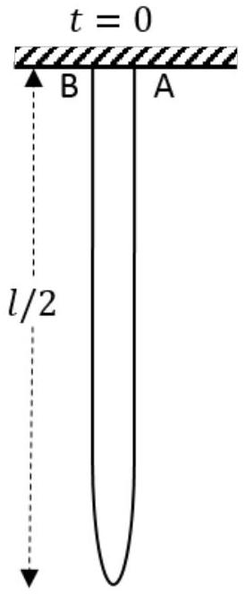
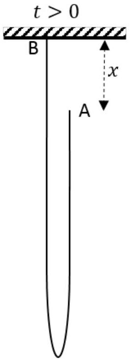

(a) Obtain the momentum $P$ of the center of mass of the system when the end A has fallen by a distance $x$, in terms of $x$ and speed $\dot { x }$.
$$
P =
$$
Solution: Let total mass of the chain to be $M = \lambda l$.
The mass of the left side of the chain $= \lambda \left( \frac { l + x } { 2 } \right)$
CM of the left side of the chain $= \left( \frac { l + x } { 4 } \right)$
The mass of the right side of the chain $= \lambda \left( \frac { l - x } { 2 } \right)$
CM of the right side of the chain $= \left( x + \frac { l - x } { 4 } \right)$
$$
\begin{align*}
x _ { \mathrm { CM } } & = \frac { \lambda \left( \frac { l + x } { 2 } \right) \left( \frac { l + x } { 4 } \right) + \lambda \left( \frac { l - x } { 2 } \right) \left( x + \frac { l - x } { 4 } \right) } { \lambda l }  \tag{3.1}\\
\lambda l x _ { \mathrm { CM } } & = \frac { \lambda l ^ { 2 } } { 4 } + \frac { \lambda l x } { 2 } - \frac { \lambda x ^ { 2 } } { 4 }  \tag{3.2}\\
P = \lambda l \dot { x } _ { \mathrm { CM } } & = \lambda \left( \frac { l - x } { 2 } \right) \dot { x } \tag{3.3}
\end{align*}
$$
(b) Assume that the end A is falling freely under gravity, i.e., $\ddot { x } = g$. Obtain the tension $T$ at the fixed end B just before the chain completes the fall and becomes entirely vertical.
$$
T =
$$
Solution:
$$
\begin{align*}
& \ddot { x } = g  \tag{3.4}\\
& \dot { x } = g t = \sqrt { 2 g x }  \tag{3.5}\\
& \dot { P } = M g - T \tag{3.6}
\end{align*}
$$

From Eq. (3.3)

$$
\begin{align*}
\dot { P } & = \frac { \lambda } { 2 } \left[ \ddot { x } ( l - x ) - \dot { x } ^ { 2 } \right]  \tag{3.7}\\
\frac { \lambda } { 2 } [ g l - 3 g x ] & = M g - T  \tag{3.8}\\
T ( x ) & = \frac { M g } { 2 } \left( 1 + \frac { 3 x } { l } \right) = \frac { \lambda l g } { 2 } \left( 1 + \frac { 3 x } { l } \right)  \tag{3.9}\\
T ( x = l ) & = 2 \lambda l g \tag{3.10}
\end{align*}
$$

Experimentally, the value of tension is found to be different from the above result. We adopt an alternative approach assuming conservation of mechanical energy.

(c) Obtain the potential energy $U ( x )$ of the chain and plot it versus $x$. Take the potential energy of a point mass placed at the horizontal support to be zero.

Solution: In general, $U = - \lambda l g x _ { \mathrm { CM } }$. Using Eq. (3.2)

$$
\begin{equation*}
U = \frac { - \lambda g } { 4 } \left( l ^ { 2 } + 2 l x - x ^ { 2 } \right) \tag{3.11}
\end{equation*}
$$

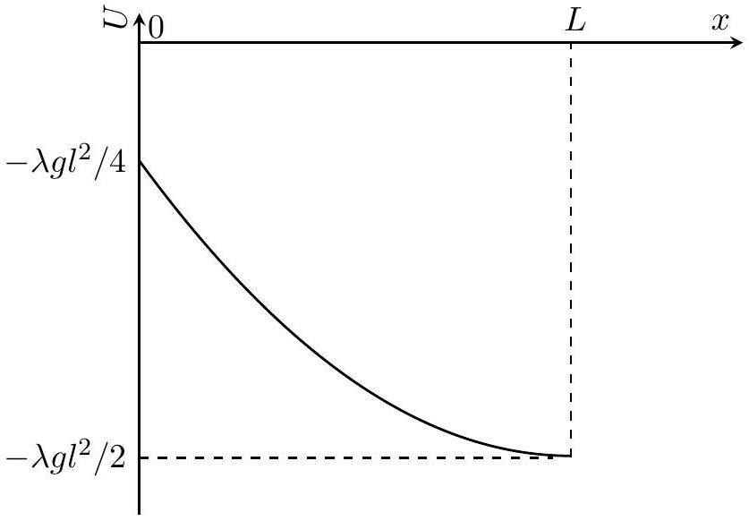

(d) Obtain the speed $\dot { x }$ when the end A has fallen by a distance $x$. Assume that all sections of the falling (right side) part of the chain have the same speed.

$$
\dot { x } =
$$

Solution: From Eq. (3.3), kinetic energy of the chain

$$
\begin{equation*}
K ( x ) = \frac { 1 } { 2 } \lambda \left( \frac { l - x } { 2 } \right) \dot { x } ^ { 2 } \tag{3.12}
\end{equation*}
$$

As the total energy is conserved,

$$
\begin{align*}
U ( x ) + K ( x ) & = U ( t = 0 )  \tag{3.13}\\
\dot { x } ^ { 2 } & = \left[ \frac { g \left( 2 l x - x ^ { 2 } \right) } { ( l - x ) } \right] ^ { 1 / 2 }  \tag{3.14}\\
\dot { x } & = \left[ \frac { g \left( 2 l x - x ^ { 2 } \right) } { ( l - x ) } \right] ^ { 1 / 2 } \tag{3.15}
\end{align*}
$$

(e) Hence obtain $T ( x )$ at B as a function of $x$ and related quantities. You are advised to simplify your expression as far as possible.
$$
T ( x ) =
$$

Solution:

$$
\frac { d } { d t } \dot { x } ^ { 2 } = 2 \dot { x } \ddot { x }
$$

Substituing Eq. (3.15) in the above equation yields

$$
\begin{equation*}
\ddot { x } = g + \frac { g \left( 2 l x - x ^ { 2 } \right) } { 2 ( l - x ) ^ { 2 } } \tag{3.16}
\end{equation*}
$$

Combining Eqs. (3.6), (3.7) and (3.16)

$$
\begin{align*}
T & = \lambda l g - \frac { \lambda } { 2 } \left[ \ddot { x } ( l - x ) - \dot { x } ^ { 2 } \right]  \tag{3.17}\\
& = \frac { \lambda g } { 4 ( l - x ) } \left[ 2 l ^ { 2 } + 2 l x - 3 x ^ { 2 } \right] \tag{3.18}
\end{align*}
$$

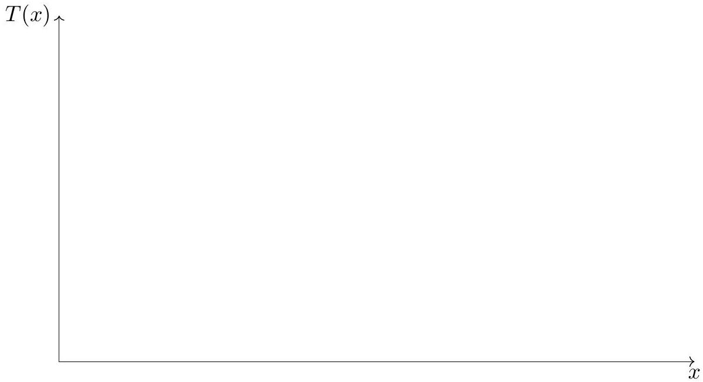

Solution:
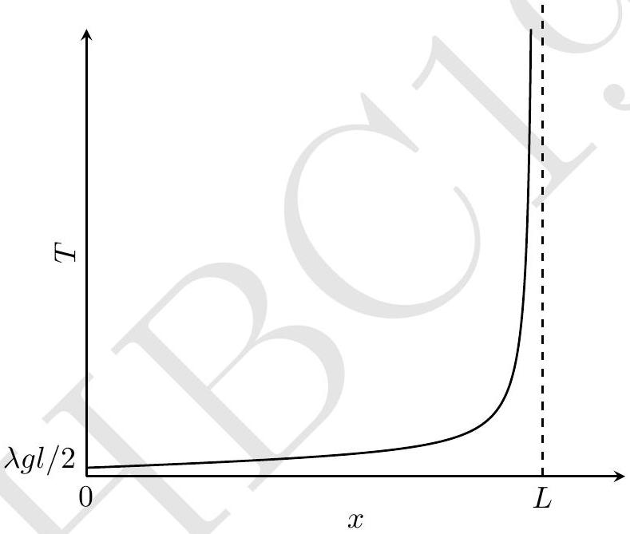

Detailed answers can be found on page numbers:

4. Consider a long narrow cylinder of cross section $A$ filled with a compressible liquid up to height $h$ whose density $\rho$ is a function of the pressure $P ( z )$ as $\rho ( z ) = \frac { \rho _ { 0 } } { 2 } \left( 1 + \frac { P ( z ) } { P _ { 0 } } \right)$ where $P _ { 0 }$ and $\rho _ { 0 }$ are constants. The depth $z$ is measured from the free surface of the liquid where the pressure is equal to the atmospheric pressure ( $P _ { \text {atm } }$ ).
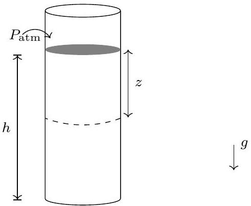
(a) Obtain the pressure $( P ( z ) )$ as a function of $z$. Obtain the mass $( M )$ of liquid in the tube.

$$
P ( z ) =
$$

Solution:

$$
\begin{align*}
P ( z ) & = \int \rho ( z ) g d z + P _ { \mathrm { atm } }  \tag{4.1}\\
& = \int _ { 0 } ^ { z } \frac { \rho _ { 0 } } { 2 } \left( 1 + \frac { P ( z ) } { P _ { 0 } } \right) g d z + P _ { \mathrm { atm } }  \tag{4.2}\\
\frac { d P ( z ) } { d z } & = \frac { \rho _ { 0 } } { 2 } \left( 1 + \frac { P ( z ) } { P _ { 0 } } \right) g  \tag{4.3}\\
\int _ { P _ { \mathrm { atm } } } ^ { P ( z ) } \frac { d P ( z ) } { P _ { 0 } + P ( z ) } & = \int _ { 0 } ^ { z } \frac { \rho _ { 0 } g d z } { 2 P _ { 0 } }  \tag{4.4}\\
\log \frac { P _ { 0 } + P ( z ) } { P _ { 0 } + P _ { \mathrm { atm } } } & = \frac { \rho _ { 0 } g z } { 2 P _ { 0 } }  \tag{4.5}\\
P ( z ) & = \left[ \left( P _ { 0 } + P _ { \mathrm { atm } } \right) e ^ { \rho _ { 0 } g z / 2 P _ { 0 } } - P _ { 0 } \right] \tag{4.6}
\end{align*}
$$

$$
M =
$$

Solution:

$$
\begin{align*}
\rho ( z ) & = \frac { \rho _ { 0 } \left( P _ { 0 } + P _ { \mathrm { atm } } \right) } { 2 P _ { 0 } } e ^ { \rho _ { 0 } g z / 2 P _ { 0 } }  \tag{4.7}\\
M & = \int _ { 0 } ^ { h } \rho ( z ) A d z  \tag{4.8}\\
& = \frac { A } { g } \left( P _ { 0 } + P _ { \mathrm { atm } } \right) \left( e ^ { \rho _ { 0 } g h / 2 P _ { 0 } } - 1 \right) \tag{4.9}
\end{align*}
$$

(b) Let $P _ { \mathrm { i } } ( z )$ be the pressure at $z$, if the liquid were incompressible with density $\rho _ { 0 } / 2$. Assuming that $P _ { 0 } \gg \rho _ { 0 } g z$ obtain an approximated expression for $\Delta P = P ( z ) - P _ { \mathrm { i } } ( z )$.
$$
\Delta P \approx
$$

Solution:

$$
\begin{align*}
P _ { i } ( z ) & = P _ { \mathrm { atm } } + \frac { \rho _ { 0 } } { 2 } g z  \tag{4.10}\\
P ( z ) & = \left( P _ { 0 } + P _ { \mathrm { atm } } \right) e ^ { \rho _ { 0 } g z / 2 P _ { 0 } } - P _ { 0 }  \tag{4.11}\\
& \approx P _ { 0 } \left( 1 + \frac { P _ { \mathrm { atm } } } { P _ { 0 } } \right) \left[ 1 + \frac { \rho _ { 0 } g z } { 2 P _ { 0 } } + \left( \frac { \rho _ { 0 } g z } { 2 P _ { 0 } } \right) ^ { 2 } \frac { 1 } { 2 } \right] - P _ { 0 }  \tag{4.12}\\
\Delta P & = P ( z ) - P _ { i } ( z )  \tag{4.13}\\
& = \frac { \left( \rho _ { 0 } g z \right) ^ { 2 } } { 8 P _ { 0 } } + \frac { P _ { \mathrm { atm } } } { P _ { 0 } } \frac { \rho _ { 0 } g z } { 2 } + \frac { P _ { \mathrm { atm } } } { 2 } \left( \frac { \rho _ { 0 } g z } { 2 P _ { 0 } } \right) ^ { 2 } \tag{4.14}
\end{align*}
$$

which is correct upto second order in $\rho _ { 0 } g z / 2 P _ { 0 }$.

$$
\begin{equation*}
\Delta P \approx \frac { P _ { \mathrm { atm } } } { P _ { 0 } } \frac { \rho _ { 0 } g z } { 2 } \tag{4.15}
\end{equation*}
$$

which is correct upto first order in $\rho _ { 0 } g z / 2 P _ { 0 }$.
Both Eqs. (4.14) and (4.15) (mentioning order of approximation) gain full credit.

Detailed answers can be found on page numbers:

5. A pair of long parallel metallic rails of negligible resistance and separation $w$ are placed horizontally. A horizontal metal rod (dark thick line) of mass $M$ and resistance $R$ is placed perpendicularly onto the rails at one end (as shown). A uniform magnetic field $B$ exists perpendicular to the plane of the paper (pointing into the page). One end of the rail track is connected to a key $( \mathrm { K } )$ and a capacitor of capacitance $C$ charged to voltage $V _ { 0 }$. At $t = 0$ the key is closed. Neglect friction and self inductance of the loop.
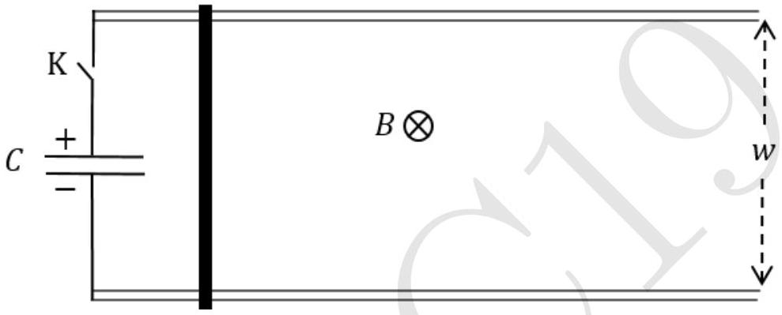
    (a) What is the final speed $\left( v _ { \text {final } } \right)$ attained by the rod?
$$
v _ { \text {final } } =
$$

Solution: At $t = 0 , Q _ { 0 } = C V _ { 0 }$. At any instant, $\dot { Q } = - I$, where $Q$ is the charge on capacitor and $I$ is the current in RC circuit. From Newton's second law and Lorentz force,

$$
\begin{align*}
m \frac { d v } { d t } & = I w B  \tag{5.1}\\
& = - \dot { Q } w B \tag{5.2}
\end{align*}
$$

Induced emf in the circuit is $B w v$. From KVL,

$$
\begin{align*}
\frac { Q } { C } & = I R + B w v  \tag{5.3}\\
& = - \dot { Q } R + B w v \tag{5.4}
\end{align*}
$$

Differentiating Eq. (5.4) and using Eq. (5.2)

$$
\begin{align*}
\ddot { Q } & = - \frac { 1 } { R C } \dot { Q } - \frac { B ^ { 2 } w ^ { 2 } } { m R } \dot { Q }  \tag{5.5}\\
& = - \dot { Q } \left[ \frac { 1 } { R C } + \frac { B ^ { 2 } w ^ { 2 } } { m R } \right]  \tag{5.6}\\
\ddot { Q } & = - \frac { \dot { Q } } { \tau } \text { where } \frac { 1 } { \tau } = \frac { 1 } { R C } + \frac { B ^ { 2 } w ^ { 2 } } { m R }  \tag{5.7}\\
\log \left( \frac { \dot { Q } } { \dot { Q } _ { 0 } } \right) & = - \frac { t } { \tau } \text { where } \dot { Q } _ { 0 } = I ( t = 0 ) = - \frac { V _ { 0 } } { R }  \tag{5.8}\\
\dot { Q } & = - \frac { V _ { 0 } } { R } e ^ { - t / \tau } \tag{5.9}
\end{align*}
$$

Combining Eqs. (5.2) and (5.9)

$$
\begin{align*}
m \frac { d v } { d t } & = \frac { V _ { o } B w } { R } e ^ { - t / \tau }  \tag{5.10}\\
\int _ { 0 } ^ { v _ { \text {final } } } m d v & = \int _ { 0 } ^ { \infty } \frac { V _ { 0 } B w } { R } e ^ { - t / \tau } d t  \tag{5.11}\\
m v _ { \text {final } } & = \left. \frac { B w V _ { 0 } } { R } ( - \tau ) e ^ { - t / \tau } \right| _ { 0 } ^ { \infty }  \tag{5.12}\\
& = \frac { B w V _ { 0 } \tau } { R }  \tag{5.13}\\
v _ { \text {final } } & = \frac { B w C V _ { 0 } } { m + B ^ { 2 } w ^ { 2 } c } \tag{5.14}
\end{align*}
$$

(b) Consider the ratio $r$ of the maximum kinetic energy attained by the rod to the energy initially stored in the capacitor. What is $r _ { \text {max } }$, the maximum possible value of $r$, by appropriately choosing $B$ ?

$$
r _ { \max } =
$$

Solution:

$$
\begin{align*}
r & = \frac { m v _ { \max } ^ { 2 } / 2 } { C V _ { 0 } ^ { 2 } / 2 }  \tag{5.15}\\
& = \frac { x } { ( 1 + x ) ^ { 2 } } \text { where } x = \frac { B ^ { 2 } w ^ { 2 } C } { m } \tag{5.16}
\end{align*}
$$

$r$ has a maximum value of $\frac { 1 } { 4 }$ at $x = 1$

$$
\begin{equation*}
r _ { \max } = 1 / 4 \tag{5.17}
\end{equation*}
$$

(c) Let $M = 10.0 \mathrm {~kg} , w = 0.10 \mathrm {~m} , V _ { 0 } = 1.00 \times 10 ^ { 4 } \mathrm {~V}$ and a bank of capacitors ensures that $C$ $= 1.00 \mathrm {~F}$. If $r = r _ { \text {max } }$, calculate the value of $v _ { \text {final } }$.

$$
v _ { \text {final } } \left( r = r _ { \max } \right) =
$$

Solution: For $r _ { \text {max } }$,

$$
\begin{align*}
\frac { B ^ { 2 } w ^ { 2 } C } { m } & = 1 \Rightarrow B = 31.6 \mathrm {~T}  \tag{5.18}\\
v _ { \max } & = 1.58 \times 10 ^ { 3 } \mathrm {~m} / \mathrm { s } \tag{5.19}
\end{align*}
$$

Detailed answers can be found on page numbers:

6. Consider $n$ moles of a monoatomic non-ideal (realistic) gas. Its equation of state may be described by the van der Waal's equation
$$
\left( P + \frac { a n ^ { 2 } } { V ^ { 2 } } \right) \left( \frac { V } { n } - b \right) = R T
$$
where $a$ and $b$ are positive constants and other symbols have their usual meanings. The internal energy change of a realistic gas can be given by
$$
d U = C _ { V } d T + \left\{ T \left( \frac { d P } { d T } \right) _ { V } - P \right\} d V
$$
As indicated in the above expression, the derivative of pressure is taken at constant volume.
We take one mole of the gas $( n = 1 )$ through a Diesel cycle (ABCDA) as shown in the following $P - V$ diagram (diagram is not to scale). During the whole cycle assume that the molar heat capacity at constant volume ( $C _ { V }$ ) remains constant at $3 R / 2$. Path AB and CD are reversible adiabats.
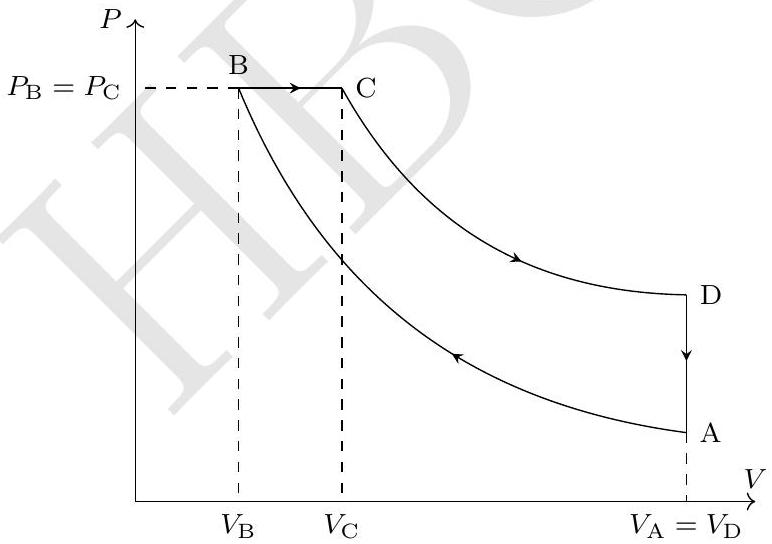
    (a) Obtain the temperature at $\mathrm { B } \left( T _ { \mathrm { B } } \right)$ in terms of temperature at $\mathrm { A } \left( T _ { \mathrm { A } } \right) , V _ { \mathrm { A } } , V _ { \mathrm { B } }$ and constants only.
$$
T _ { \mathrm { B } } =
$$
Solution:
$$
d U = C _ { V } d T + \left\{ \frac { R T } { V - b } - P \right\} d V
$$
AB and CD are reversible adiabats, hence entropy change during these processes are zero.

$$
\begin{align*}
\Delta S _ { \mathrm { AB } } = \Delta S _ { \mathrm { CD } } & = \int _ { A } ^ { B } \frac { d Q } { T } = \int _ { C } ^ { D } \frac { d Q } { T } = 0  \tag{6.1}\\
\int _ { \mathrm { A } } ^ { \mathrm { B } } \frac { d Q } { T } & = \int \frac { C _ { V } } { T } d T + \int \frac { R } { V - b } d V = 0  \tag{6.2}\\
C _ { V } \ln \frac { T _ { \mathrm { B } } } { T _ { \mathrm { A } } } & = - R \ln \left( \frac { V _ { \mathrm { B } } - b } { V _ { \mathrm { A } } - b } \right)  \tag{6.3}\\
T _ { \mathrm { B } } & = T _ { \mathrm { A } } \left( \frac { V _ { \mathrm { B } } - b } { V _ { \mathrm { A } } - b } \right) ^ { - R / C _ { V } } = T _ { \mathrm { A } } \left( \frac { V _ { \mathrm { B } } - b } { V _ { \mathrm { A } } - b } \right) ^ { - 2 / 3 } \tag{6.4}
\end{align*}
$$
(b) Let temperature at A to be $T _ { \mathrm { A } } = 100.00 \mathrm {~K} , V _ { \mathrm { A } } = 8.00 \mathrm { l } , V _ { \mathrm { B } } = 1.00 \mathrm { l } , V _ { \mathrm { C } } = 2.00 \mathrm { l } , a = 1.355$ $\mathrm { l } ^ { 2 } \cdot \mathrm {~atm} / \mathrm { mol } ^ { 2 }$, and $b = 0.0313 \mathrm { l } / \mathrm { mol }$. Calculate the highest temperature reached during the whole cycle.
Highest temperature =
Solution: Highest temperature during cycle is at $T _ { C }$.
$$
\begin{equation*}
T _ { \mathrm { B } } = 407.5 \mathrm {~K} \tag{6.5}
\end{equation*}
$$
which gives, from van der Waal equation
$$
\begin{align*}
P _ { \mathrm { B } } & = 33.18 \mathrm {~atm} = P _ { \mathrm { C } }  \tag{6.6}\\
\Rightarrow T _ { \mathrm { C } } & = 803.76 \mathrm {~K} \approx 804 \mathrm {~K} \tag{6.7}
\end{align*}
$$
Different value of $T _ { C }$ (within a range) obtained due to reasonable roundoff in previous step(s) will be credited.
(c) Calculate the efficiency $\eta$ of the cycle.
Value of $\eta =$

Solution:

$$
\begin{align*}
d Q _ { \text {in } } = d Q _ { \mathrm { BC } } & = d U + P _ { \mathrm { B } } d V  \tag{6.8}\\
& = C _ { V } d T + \frac { R T } { V - b } d V  \tag{6.9}\\
& = C _ { V } d T + \left( P + \frac { a } { V ^ { 2 } } \right) d V  \tag{6.10}\\
Q _ { \text {in } } & = C _ { V } \left( T _ { \mathrm { C } } - T _ { \mathrm { B } } \right) + P _ { \mathrm { B } } \left( V _ { \mathrm { C } } - V _ { \mathrm { B } } \right) - \left. \frac { a } { V } \right| _ { V _ { \mathrm { B } } } ^ { V _ { \mathrm { C } } }  \tag{6.11}\\
Q _ { \text {out } } & = Q _ { \mathrm { DA } } = C _ { V } \left( T _ { \mathrm { A } } - T _ { \mathrm { D } } \right)  \tag{6.12}\\
\eta & = 1 - \frac { Q _ { \text {out } } } { Q _ { \text {in } } } = 67.7 \% \approx 68 \% \tag{6.13}
\end{align*}
$$

Different value of $\eta$ (within a range) obtained due to reasonable roundoff in previous step(s) will be credited.

(d) Draw the corresponding $T - S$ (entropy) and $V - T$ diagram for the Diesel cycle. Wherever possible, mention the numerical values of $T , V$, and $S$ on the diagrams.
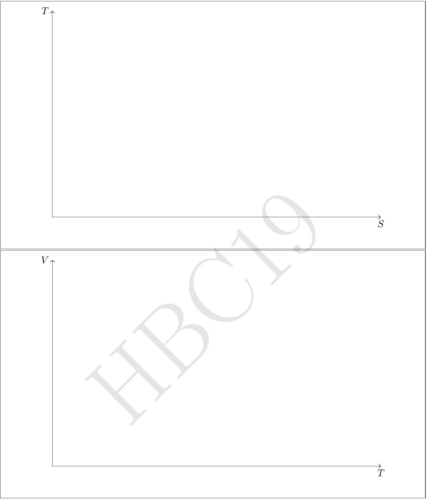

Solution:

$$
\begin{align*}
\Delta S _ { \mathrm { BC } } & = \int \frac { d Q } { d T } = \int \frac { C _ { V } d T } { T } + \int \frac { R } { V - b } d V  \tag{6.14}\\
& = C _ { V } \ln \frac { T _ { C } } { T _ { \mathrm { B } } } + R \ln \frac { V _ { C } - b } { V _ { \mathrm { B } } - b }  \tag{6.15}\\
& = 1.73 R = \Delta S _ { \mathrm { DA } } \tag{6.16}
\end{align*}
$$

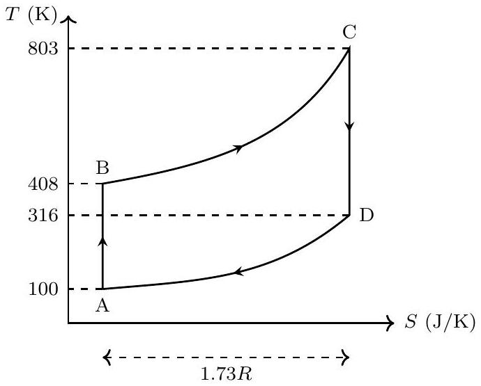

Solution:
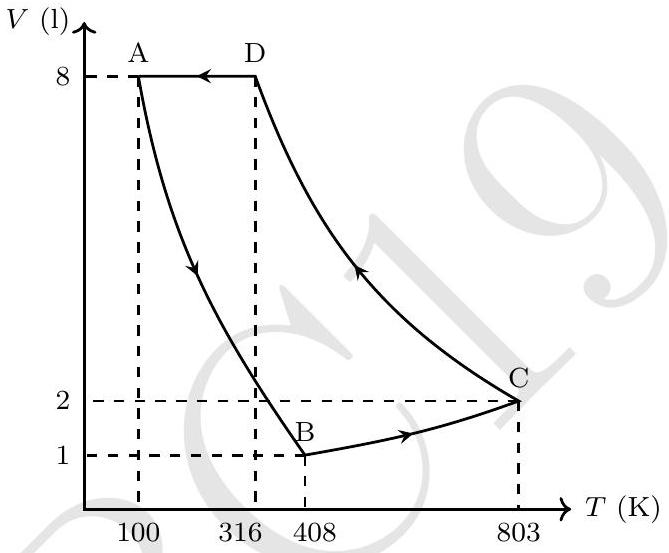

Detailed answers can be found on page numbers:

7. As shown, a magnet of mass $m = 19.00 \mathrm {~g}$ slides on a rough non-magnetic metallic inclined plane which makes an angle $\theta$ with the horizontal. One can change the angle of inclination of the plane. Due to relative motion between the magnet and the plane, eddy currents are generated inside the metal which retard motion of the magnet.
Assume that the magnitude of the resistive force on the magnet is $b v$ where $b$ is a positive constant and $v$ is the instantaneous speed of the magnet. Let $\mu$ be the coefficient of kinetic friction between the magnet and the plane.
    (a) If the magnet starts moving from rest at time $t = 0$, obtain the expression of its terminal velocity $V _ { \mathrm { T } }$. Also obtain the displacement $S ( t )$ along the inclined plane as a function of time. Take $S ( 0 ) = 0$.
$$
V _ { \mathrm { T } } =
$$
$$
S ( t ) =
$$

Solution:

$$
\begin{align*}
V _ { \mathrm { T } } & = \frac { m g ( \sin \theta - \mu \cos \theta ) } { b }  \tag{7.1}\\
S ( t ) & = V _ { \mathrm { T } } \left[ t - \frac { m } { b } \left( 1 - e ^ { - t b / m } \right) \right] \tag{7.2}
\end{align*}
$$

(b)For a fixed $\theta$ a student records $S$ for all values of $t$ as shown in the table below. Draw a suitable graph and obtain the terminal velocity $V _ { \mathrm { T } }$ of the magnet from this graph. For this and the next part, three graph papers are provided with this booklet. No extra graph papers will be provided.

| $t ( \mathrm {~s} )$ | $S ( \mathrm {~m} )$ |
| :--- | :--- |
| 0.016 | 0.001 |
| 0.049 | 0.003 |
| 0.070 | 0.006 |
| 0.090 | 0.010 |
| 0.120 | 0.017 |
| 0.174 | 0.029 |
| 0.230 | 0.046 |
| 0.270 | 0.058 |
| 0.320 | 0.074 |
| 0.370 | 0.091 |

$$
V _ { \mathrm { T } } =
$$

Graph is plotted on page no. : $\_\_\_\_$
Solution: $V _ { \mathrm { T } } =$ slope of the graph $= 0.315 \mathrm {~m} / \mathrm { s }$
Accepted range $0.301 \mathrm {~m} / \mathrm { s } \leq V _ { \mathrm { T } } \leq 0.329 \mathrm {~m} / \mathrm { s }$.
(c)The above process is repeated for various values of $\theta$. The obtained values of terminal velocities for the different $\theta$ are given below.

| $\theta$ (degree) | $V _ { \mathrm { T } } ( \mathrm { m } / \mathrm { s } )$ |
| :--- | :--- |
| 19 | 0.15 |
| 24 | 0.23 |
| 28 | 0.29 |
| 35 | 0.40 |
| 40 | 0.46 |
| 45 | 0.53 |
| 48 | 0.58 |
| 52 | 0.62 |

Plot a suitable graph and obtain the values of $b$ and $\mu$ from this graph.

| $b =$ | $\mu =$ |
| :--- | :--- |

Graph is plotted on page no. : $\_\_\_\_$

Solution:

$$
\begin{equation*}
\frac { V _ { \mathrm { T } } } { \cos \theta } = \frac { m g } { b } \tan \theta - \frac { \mu m g } { b } \tag{7.3}
\end{equation*}
$$

Graph is plotted for $V _ { \mathrm { T } } / \cos \theta$ vs $\tan \theta$.

| $\tan \theta$ | $V _ { \mathrm { T } } / \cos \theta ( \mathrm { m } / \mathrm { s } )$ |
| :--- | :--- |
| 0.34 | 0.16 |
| 0.45 | 0.25 |
| 0.53 | 0.33 |
| 0.70 | 0.49 |
| 0.84 | 0.60 |
| 1.00 | 0.75 |
| 1.11 | 0.87 |
| 1.28 | 1.01 |

Slope of the graph $= 0.91 \mathrm {~m} / \mathrm { s } = \frac { m g } { b } \Rightarrow b = 0.21 \mathrm {~N} \cdot \mathrm {~s} / \mathrm { m }$
Intercept $= 0.16 = \frac { \mu m g } { b } \Rightarrow \mu = 0.18$
Accepted range of slope $= 0.86 - 0.96 \mathrm {~m} / \mathrm { s }$
Accepted range of intercept $= 0.12 - 0.19 \mathrm {~m} / \mathrm { s }$
Respective ranges of $b$ and $\mu$ are
$0.19 \leq b \leq 0.22 \mathrm {~m} / \mathrm { s }$ and $0.14 \leq \mu \leq 0.20$
Determination of $b$ and $\mu$ from a graph of $V _ { \mathrm { T } }$ vs $\theta$ using an appropriate method also gains credit.

Detailed answers can be found on page numbers:

$\_\_\_\_$
$\_\_\_\_$
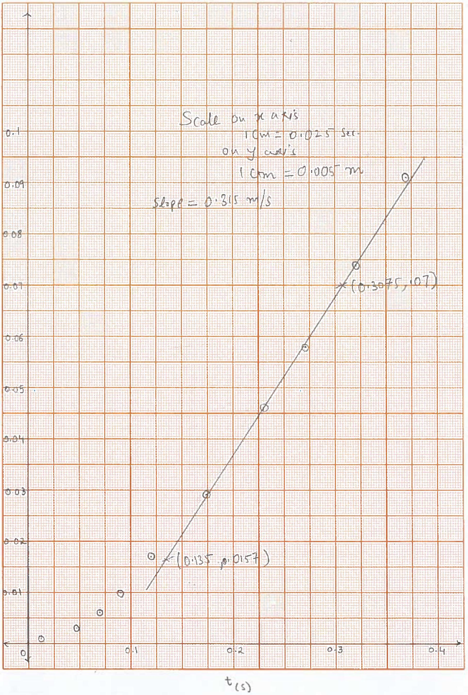

$\_\_\_\_$
$\_\_\_\_$
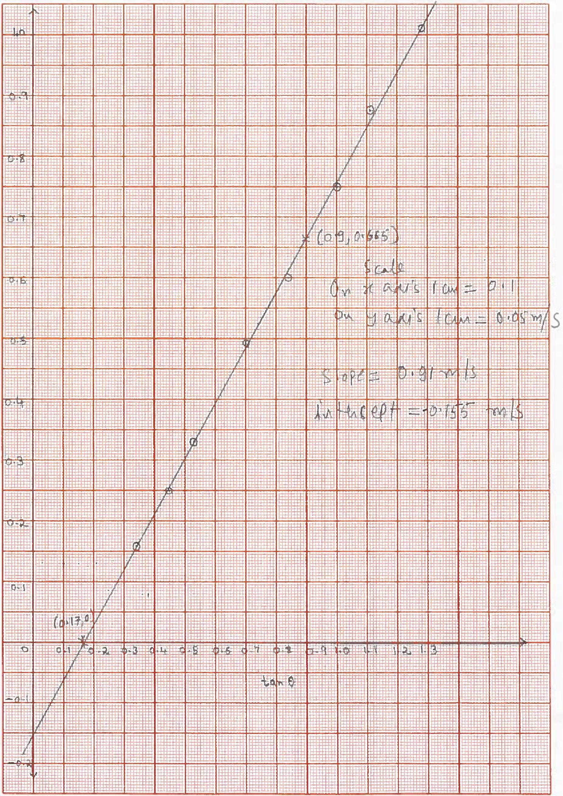
