## Solutions of Indian National Physics Olympiad - 2020

Date: 02 February 2020
Roll Number: □
□ 20 □
□
□
□
□
□
□
Time : 09:00-12:00 (3 hours) Maximum Marks: 80

Extra sheets attached : □ $\overline { \text { INO Centre (e.g. Ranchi) } }$
(Do not write below this line)

Instructions

1. This booklet consists of 16 pages (excluding this page) and total of 5 questions.
2. This booklet is divided in two parts: Questions with Summary Answer Sheet and Detailed Answer Sheet. Write roll number at the top wherever asked.
3. The final answer to each sub-question should be neatly written in the box provided below each sub-question in the Questions \& Summary Answer Sheet.
4. You are also required to show your detailed work for each question in a reasonably neat and coherent way in the Detailed Answer Sheet. You must write the relevant Question Number(s) on each of these pages.
5. Marks will be awarded on the basis of what you write on both the Summary Answer Sheet and the Detailed Answer Sheet. Simple short answers and plots may be directly entered in the Summary Answer Sheet. Marks may be deducted for absence of detailed work in questions involving longer calculations. Strike out any rough work that you do not want to be considered for evaluation.
6. Adequate space has been provided in the answersheet for you to write/calculate your answers. In case you need extra space to write, you may request additional blank sheets (maximum two) from the invigilator. Write your roll number on the extra sheets and get them attached to your answersheet and indicate number of extra sheets attached at the top of this page.
7. Non-programmable scientific calculators are allowed. Mobile phones cannot be used as calculators.
8. Use blue or black pen to write answers. Pencil may be used for diagrams/graphs/sketches.
9. This entire booklet must be returned at the end of the examination.

| Table of Constants |  |  | Question | Marks | Score |
| :--- | :--- | :--- | :--- | :--- | :--- |
| Speed of light in vacuum | $c$ | $3.00 \times 10 ^ { 8 } \mathrm {~m} \cdot \mathrm {~s} ^ { - 1 }$ |  |  |  |
| Planck's constant | $h$ | $6.63 \times 10 ^ { - 34 } \mathrm {~J} \cdot \mathrm {~s}$ | 1 | 13 |  |
|  | $\hbar$ | $h / 2 \pi$ |  |  |  |
| Universal constant of Gravitation | G | $6.67 \times 10 ^ { - 11 } \mathrm {~N} \cdot \mathrm {~m} ^ { 2 } \cdot \mathrm {~kg} ^ { - 2 }$ | 2 | 12 |  |
| Magnitude of electron charge | $e$ | $1.60 \times 10 ^ { - 19 } \mathrm { C }$ |  |  |  |
| Rest mass of electron | $m _ { e }$ | $9.11 \times 10 ^ { - 31 } \mathrm {~kg}$ | 3 | 15 |  |
| Value of $1 / 4 \pi \epsilon _ { 0 }$ |  | $9.00 \times 10 ^ { 9 } \mathrm {~N} \cdot \mathrm {~m} ^ { 2 } \cdot \mathrm { C } ^ { - 2 }$ |  |  |  |
| Avogadro's number | $N _ { A }$ | $6.022 \times 10 ^ { 23 } \mathrm {~mol} ^ { - 1 }$ | 4 | 20 |  |
| Acceleration due to gravity | $g$ | $9.81 \mathrm {~m} \cdot \mathrm {~s} ^ { - 2 }$ |  |  |  |
| Universal Gas Constant | $R$ | $8.31 \mathrm {~J} \cdot \mathrm {~K} ^ { - 1 } \cdot \mathrm {~mol} ^ { - 1 }$ | 5 | 20 |  |
|  | R | $0.0821 \mathrm { l } \cdot \mathrm { atm } \cdot \mathrm { mol } ^ { - 1 } \cdot \mathrm {~K} ^ { - 1 }$ |  |  |  |
| Permeability constant | $\mu _ { 0 }$ | $4 \pi \times 10 ^ { - 7 } \mathrm { H } \cdot \mathrm { m } ^ { - 1 }$ | Total | 80 |  |

Please note that alternate/equivalent methods and different way of expressing final solutions may exist.

1. A certain gas obeys the equation of state $U ( S , V , N ) = a S ^ { 7 } / V ^ { 4 } N ^ { 2 }$, where $a$ is a dimensioned constant. Here $U$ represents the internal energy of the gas, $S$ the entropy, $V$ the volume and $N$ the fixed number of particles of the system.
    (a) Let such a gas be filled in a box of volume $V$ and the internal energy of the system be $U$. A partition is placed to divide the box into two equal parts, each having volume $V / 2$. For each part, the internal energy is now $\alpha U$ and the dimensioned constant be $\beta a$. Obtain $\alpha$ and $\beta$.
$$
\alpha =
$$
$$
\beta =
$$

Solution: An extensive parameter of the system gets halved if the size of the system is halved, while an intensive parameter remains unchanged. The internal energy and the entropy, both are extensive parameters. Thus $\alpha = 1 / 2 , \quad \beta = 1$.

(b) The temperature $T$ can be expressed in terms of the derivative of internal energy as
$$
T = \left( \frac { d U } { d S } \right) _ { V , N }
$$
where the subscripts indicate that the differentiation has been carried out keeping $V$ and $N$ constant. In a similar way, express pressure $P$ in terms of a derivative of the internal energy.
$$
P =
$$

Solution:

$$
P = - \left( \frac { d U } { d V } \right) _ { S , N }
$$

(c) Find the equation of state of the given system relating $P , T$, and $V$.
$$
P =
$$

Solution: From the definition of temperature,

$$
T = \frac { 7 a S ^ { 6 } } { N ^ { 2 } V ^ { 4 } }
$$

From part (b)

$$
P = \frac { 4 a S ^ { 7 } } { V ^ { 5 } N ^ { 2 } }
$$

Eliminating $S$ yields

$$
P = C \frac { T ^ { 7 / 6 } } { V ^ { 1 / 3 } }
$$

where $C = \frac { 4 N ^ { 1 / 3 } } { 7 ^ { 7 / 6 } a ^ { 1 / 6 } }$

(d) One mole of this gas executes a Carnot cycle ABCDA between reservoirs at temperatures $T _ { 1 }$ and $T _ { 2 } \left( T _ { 1 } > T _ { 2 } \right)$. Obtain the heat change in the process AB $\left( Q _ { \mathrm { AB } } \right)$ and work done by the system in the processes AB and BC ( $W _ { \mathrm { AB } } , W _ { \mathrm { BC } }$ ) of the cycle. Express your answers only in terms of temperatures $T _ { 1 } , T _ { 2 }$, volumes $V _ { A } , V _ { B }$, and the other constants.
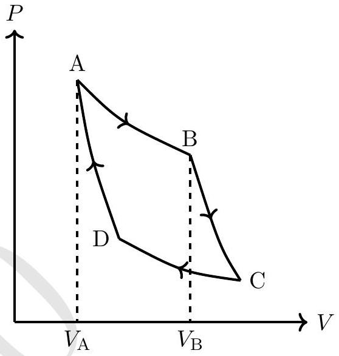
$$
Q _ { \mathrm { AB } } =
$$
$$
W _ { \mathrm { AB } } =
$$
$$
W _ { \mathrm { BC } } =
$$

Solution:

$$
S = \frac { 7 } { 4 } \frac { P V } { T } , \quad U = \frac { P V } { 4 }
$$

Leg AB: A → B (isothermal) $\Rightarrow T _ { 1 } =$ constant

$$
\begin{align*}
Q _ { \mathrm { AB } } & = T _ { 1 } \int _ { \mathrm { A } } ^ { \mathrm { B } } d S  \tag{1.1}\\
& = \frac { 7 } { 4 } \left( P _ { B } V _ { B } - P _ { A } V _ { A } \right) \tag{1.2}
\end{align*}
$$

Using equation of state,

$$
Q _ { \mathrm { AB } } = \frac { 7 C } { 4 } \left[ V _ { B } ^ { \frac { 2 } { 3 } } - V _ { A } ^ { \frac { 2 } { 3 } } \right] T _ { 1 } ^ { \frac { 7 } { 6 } }
$$

$$
\begin{gather*}
W _ { \mathrm { AB } } = \int _ { \mathrm { A } } ^ { \mathrm { B } } P d V = c \int _ { \mathrm { A } } ^ { \mathrm { B } } V ^ { - 1 / 3 } T _ { 1 } ^ { 7 / 6 } d V  \tag{1.3}\\
W _ { \mathrm { AB } } = \frac { 3 C } { 2 } T _ { 1 } ^ { 7 / 6 } \left[ V _ { B } ^ { \frac { 2 } { 3 } } - V _ { A } ^ { \frac { 2 } { 3 } } \right]
\end{gather*}
$$

Leg BC is isentropic/adiabatic $\Rightarrow Q = 0$ or $S =$ constant. From first law,

$$
\begin{align*}
W _ { \mathrm { BC } } = - \Delta U & = \frac { a S ^ { 7 } } { N ^ { 2 } } \left[ \frac { 1 } { V _ { B } ^ { 4 } } - \frac { 1 } { V _ { C } ^ { 4 } } \right]  \tag{1.4}\\
& = \frac { a } { N ^ { 2 } } \left[ \frac { S ^ { 7 } } { V _ { B } ^ { 4 } } - \frac { S ^ { 7 } } { V _ { C } ^ { 4 } } \right] \tag{1.5}
\end{align*}
$$

Also, $S = \frac { 7 C } { 4 } V ^ { 2 / 3 } T ^ { 1 / 6 }$

$$
\begin{gather*}
W _ { \mathrm { BC } } = \frac { a } { N ^ { 2 } } \left( \frac { 7 C } { 4 } \right) ^ { 7 } \left[ V _ { B } ^ { \frac { 2 } { 3 } } T _ { 1 } ^ { \frac { 7 } { 6 } } - V _ { C } ^ { \frac { 2 } { 3 } } T _ { 2 } ^ { \frac { 7 } { 6 } } \right]  \tag{1.6}\\
W _ { \mathrm { BC } } = \frac { a } { N ^ { 2 } } \left[ \frac { 7 C } { 4 } \right] ^ { 7 } V _ { B } ^ { \frac { 2 } { 3 } } T _ { 1 } ^ { \frac { 1 } { 6 } } \left[ T _ { 1 } - T _ { 2 } \right]
\end{gather*}
$$

Detailed answers can be found on page numbers:

2. An insulating uniformly charged cylindrical shell of radius $a$ lies with its axis along the $z$ axis. The shell's moment of inertia per unit length about the $z$ axis and the surface charge density are $I$ and $\sigma$ respectively. The cylinder is placed in an external uniform magnetic field $B _ { \mathrm { ex } } \hat { z }$, and is initially at rest. Starting at $t = 0$ the external magnetic field is slowly reduced to zero. What is the final angular velocity $\omega$ of the cylinder?
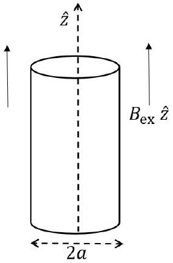
$\omega =$

Detailed answers can be found on page numbers:

Solution: As the magnetic field drops, its time derivative results in an induced electric field,

in azimuthal direction.

$$
\begin{equation*}
E _ { \phi } ( r ) = - \frac { r \dot { B } _ { z } } { 2 } \tag{2.1}
\end{equation*}
$$

This field acts on the charged cylindrical shell to produce azimuthal torque (per unit length).

$$
\begin{align*}
\tau _ { \phi } & = a E _ { \phi } ( a ) 2 \pi a \sigma  \tag{2.2}\\
\tau _ { \phi } & = I \frac { d \omega } { d t }  \tag{2.3}\\
d \omega & = - \frac { \sigma \pi a ^ { 3 } } { I } d B _ { z }  \tag{2.4}\\
\omega & = - \frac { \sigma \pi a ^ { 3 } } { I } \int _ { B _ { i } } ^ { B _ { f } } d B _ { z }  \tag{2.5}\\
& = \frac { \sigma \pi a ^ { 3 } } { I } \left( B _ { i } - B _ { f } \right) \tag{2.6}
\end{align*}
$$

$B _ { i } = B _ { \mathrm { ex } }$ and $B _ { f }$ is the non-zero magnetic field produced by the rotating charged cylinder. For the rotating cylinder, compare with solenoid,the magnetic field will be along $z$ axis and equal to

$$
\begin{align*}
\overrightarrow { B _ { f } } & = \mu _ { 0 } n i \hat { z }  \tag{2.7}\\
& = \mu _ { 0 } j _ { \phi } \hat { z } \tag{2.8}
\end{align*}
$$

where $j _ { \phi } = a \sigma \omega$ is azimuthal current per unit length. Thus

$$
\overrightarrow { B _ { f } } = \mu _ { 0 } a \sigma \omega \hat { z }
$$

$$
\begin{align*}
& \omega = \frac { \sigma \pi a ^ { 3 } } { I } \left( B _ { \mathrm { ex } } - \mu _ { 0 } a \sigma \omega \right)  \tag{2.9}\\
& \omega = \frac { \sigma \pi a ^ { 3 } } { I } \left( 1 + \frac { \mu _ { 0 } \sigma ^ { 2 } a ^ { 4 } \pi } { I } \right) ^ { - 1 } B _ { \mathrm { ex } } \tag{2.10}
\end{align*}
$$

3. Consider the Bohr model of the hydrogen atom. Let $m _ { e }$ and $e$ be the mass and magnitude of the charge of the electron respectively. Let $a _ { 0 }$ be the ground state radius (Bohr radius).
(a) Obtain an expression for the ionisation energy $I _ { \mathrm { H } }$ of the ground state of the hydrogen atom in terms of $a _ { 0 }$ and constants.
$$
I _ { \mathrm { H } } =
$$

Solution: Centripetal acceleration is given by Coulomb force.

$$
\begin{align*}
\frac { m _ { e } v ^ { 2 } } { a _ { 0 } } & = \frac { K e ^ { 2 } } { a _ { 0 } ^ { 2 } } ; \quad K = \frac { 1 } { 4 \pi \epsilon _ { 0 } } ; \quad m _ { e } v r = \hbar  \tag{3.1}\\
a _ { 0 } & = \frac { \hbar ^ { 2 } } { K m _ { e } e ^ { 2 } }  \tag{3.2}\\
\text { Total energy } & = \frac { m _ { e } v ^ { 2 } } { 2 } - \frac { K e ^ { 2 } } { a _ { 0 } } = - \frac { K e ^ { 2 } } { 2 a _ { 0 } }  \tag{3.3}\\
I _ { \mathrm { H } } & = \frac { K e ^ { 2 } } { 2 a _ { 0 } } \tag{3.4}
\end{align*}
$$

(b) Consider a singly ionised helium atom $\mathrm { He } ^ { + }$. Obtain the ground state ionisation energy $I _ { \mathrm { He } ^ { + } }$ of $\mathrm { He } ^ { + }$in terms of $I _ { \mathrm { H } }$.
$$
I _ { \mathrm { He } ^ { + } } =
$$

Solution:

$$
\begin{align*}
\frac { m _ { e } v ^ { 2 } } { r } & = \frac { 2 K e ^ { 2 } } { r ^ { 2 } } \text { and } m _ { e } v r = \hbar  \tag{3.5}\\
r & = \frac { \hbar ^ { 2 } } { 2 K m e ^ { 2 } } = \frac { a _ { 0 } } { 2 } \tag{3.6}
\end{align*}
$$

Total Energy (T.E.) $= \frac { 1 } { 2 } m _ { e } v ^ { 2 } - \frac { 2 K e ^ { 2 } } { r } = - \frac { K e ^ { 2 } } { r } = \frac { 2 K e ^ { 2 } } { a _ { 0 } } = - 4 I _ { H }$
$I _ { \mathrm { He } ^ { + } } = 4 I _ { \mathrm { H } }$

(c) Now consider a two electron system with arbitrary atomic number $Z$. Use the Bohr model to obtain the ground state radius $( r ( Z ) )$ in terms of $a _ { 0 }$ and $Z$. Assume the two electrons are in the same circular orbit and as far apart as possible.
$$
r ( Z ) =
$$

Solution:

$$
\begin{align*}
\frac { m _ { e } v ^ { 2 } } { r } & = \frac { K Z e ^ { 2 } } { r ^ { 2 } } - \frac { K e ^ { 2 } } { ( 2 r ) ^ { 2 } } \text { and } m _ { e } v r = \hbar  \tag{3.9}\\
m _ { e } v ^ { 2 } r & = K e ^ { 2 } \left( Z - \frac { 1 } { 4 } \right) \text { and } m _ { e } v ^ { 2 } r = \frac { \hbar ^ { 2 } } { m _ { e } r }  \tag{3.10}\\
r & = \frac { \hbar ^ { 2 } } { K m _ { e } e ^ { 2 } \left( Z - \frac { 1 } { 4 } \right) } = \frac { a _ { 0 } } { \left( Z - \frac { 1 } { 4 } \right) } \tag{3.11}
\end{align*}
$$

(d) Derive an expression for the first ionisation energy $I _ { Z } ^ { \text {th } }$ for two electron system with arbitrary $Z$ in terms of $Z$ and $I _ { \mathrm { H } }$.
$$
I _ { Z } =
$$

Solution:

$$
\begin{align*}
\text { Kinetic Energy (K.E.) } = m _ { e } v ^ { 2 } & = \frac { K e ^ { 2 } \left( Z - \frac { 1 } { 4 } \right) } { r }  \tag{3.12}\\
& = \frac { K e ^ { 2 } \left( Z - \frac { 1 } { 4 } \right) ^ { 2 } } { a _ { 0 } }  \tag{3.13}\\
& = 2 \left( Z - \frac { 1 } { 4 } \right) ^ { 2 } I _ { \mathrm { H } } \tag{3.14}
\end{align*}
$$

$$
\begin{align*}
\operatorname { Potential } \text { Energy (P.E.) } & = - \frac { 2 K Z e ^ { 2 } } { r } + \frac { K e ^ { 2 } } { 2 r }  \tag{3.15}\\
& = \frac { - 2 K e ^ { 2 } } { r } \left( Z - \frac { 1 } { 4 } \right)  \tag{3.16}\\
& = \frac { - 2 K e ^ { 2 } } { a _ { 0 } } \left( Z - \frac { 1 } { 4 } \right) ^ { 2 }  \tag{3.17}\\
& = - 4 \left( Z - \frac { 1 } { 4 } \right) ^ { 2 } I _ { \mathrm { H } } \tag{3.18}
\end{align*}
$$

$$
\begin{align*}
( \text { T.E. } ) _ { \mathrm { i } } & = - 2 \left( Z - \frac { 1 } { 4 } \right) ^ { 2 } I _ { \mathrm { H } }  \tag{3.19}\\
( \text { T.E. } ) _ { \mathrm { f } } & = - Z ^ { 2 } I _ { \mathrm { H } }  \tag{3.20}\\
I _ { Z } ^ { \text {th } } & = ( \text { T.E } ) _ { \mathrm { f } } - ( \text { T.E } ) _ { \mathrm { i } } = 2 \left( Z - \frac { 1 } { 4 } \right) ^ { 2 } I _ { \mathrm { H } } - Z ^ { 2 } I _ { \mathrm { H } }  \tag{3.21}\\
I _ { Z } ^ { \text {th } } & = \left( Z ^ { 2 } - Z + \frac { 1 } { 8 } \right) I _ { H } \tag{3.22}
\end{align*}
$$

(e)The table below contains the experimental data of $I _ { Z } ^ { \text {expt } }$ (in units of Rydberg where 1 Ryd = 13.6 eV) versus $Z$ for various two-electron systems.

|  | $Z$ | $I _ { Z } ^ { \text {expt } }$ |
| :--- | :--- | :--- |
| $\mathrm { H } ^ { - }$ | 1 | 0.055 |
| He | 2 | 1.81 |
| $\mathrm { Li } ^ { + }$ | 3 | 5.56 |
| $\mathrm { Be } ^ { + + }$ | 4 | 11.32 |
| $\mathrm { B } ^ { 3 + }$ | 5 | 19.07 |
| $\mathrm { C } ^ { 4 + }$ | 6 | 28.83 |
| $\mathrm { N } ^ { 5 + }$ | 7 | 40.60 |
| $\mathrm { O } ^ { 6 + }$ | 8 | 54.37 |
| $\mathrm { F } ^ { 7 + }$ | 9 | 70.15 |

Experimental values were not found to be equal to the theoretical predictions. This difference arises mainly from non-inclusion of Pauli's principle in the theoretical derivation of part (d). It was suggested that if the value of $Z$ was reduced by some fixed amount $\alpha \left( Z ^ { * } = Z - \alpha \right)$

in the final expression of $I _ { Z } ^ { \text {th } }$ obtained in part (d), then $I _ { Z ^ { * } } ^ { \text {th } } \approx I _ { Z } ^ { \text {expt } }$. Draw a suitable linear plot and from the graph find $\alpha$. Two graph papers are provided with this booklet in case you make a mistake.

$$
\alpha =
$$

Solution:

$$
\begin{equation*}
\Delta I _ { Z } = I _ { Z } ^ { \mathrm { th } } - I _ { Z } ^ { \mathrm { expt } } = I _ { Z } ^ { \mathrm { th } } - I _ { Z ^ { * } } ^ { \mathrm { th } } = \left\{ \left[ Z ^ { 2 } - Z + \frac { 1 } { 8 } \right] - \left[ ( Z - \alpha ) ^ { 2 } - ( Z - \alpha ) + \frac { 1 } { 8 } \right] \right\} I _ { \mathrm { H } } \tag{3.23}
\end{equation*}
$$

$$
\begin{equation*}
\Delta I _ { Z } = \left[ - \alpha ^ { 2 } + 2 Z \alpha - \alpha \right] I _ { \mathrm { H } } \tag{3.24}
\end{equation*}
$$

|  | $Z$ | $\left( I _ { Z } ^ { \text {expt } } \right)$ | $I _ { Z } ^ { \text {th } }$ | ( $I _ { Z } ^ { \text {th } } - I _ { Z } ^ { \text {expt } }$ ) |
| :--- | :--- | :--- | :--- | :--- |
| $\mathrm { H } ^ { - }$ | 1 | 0.055 | 0.125 | 0.07 |
| He | 2 | 1.81 | 2.13 | 0.32 |
| $\mathrm { Li } ^ { + }$ | 3 | 5.56 | 6.13 | 0.57 |
| $\mathrm { Be } ^ { + + }$ | 4 | 11.32 | 12.13 | 0.81 |
| $\mathrm { B } ^ { 3 + }$ | 5 | 19.07 | 20.13 | 1.06 |
| $\mathrm { C } ^ { 4 + }$ | 6 | 28.83 | 30.13 | 1.30 |
| $\mathrm { N } ^ { 5 + }$ | 7 | 40.60 | 42.13 | 1.53 |
| $\mathrm { O } ^ { 6 + }$ | 8 | 54.37 | 56.13 | 1.76 |
| $\mathrm { F } ^ { 7 + }$ | 9 | 70.15 | 72.13 | 1.98 |

A plot of $\Delta I _ { Z }$ vs $Z$ is a linear graph.
Slope of the graph $= 2 \alpha = 0.24$

$$
\alpha = 0.12
$$

One can also linearize in the following way:

$$
\begin{align*}
I _ { Z } ^ { \mathrm { expt } } & = I _ { Z ^ { * } } ^ { \mathrm { th } } = \left( Z - \alpha - \frac { 1 } { 2 } \right) ^ { 2 } - \frac { 1 } { 8 }  \tag{3.25}\\
\sqrt { I _ { Z } ^ { \mathrm { expt } } + \frac { 1 } { 8 } } & = Z - \alpha - \frac { 1 } { 2 } \tag{3.26}
\end{align*}
$$

Plot of $\sqrt { I _ { Z } ^ { \text {expt } } + \frac { 1 } { 8 } }$ vs $Z$ is a linear graph. This method gives $\alpha = 0.10$. Both methods are acceptable.
Accepted range of $\alpha$ is : $0.10 \leq \alpha \leq 0.14$.
Graph is on the last page of this booklet.
Detailed answers can be found on page numbers:

4. A sound source S is performing uniform circular motion with time period $T$. It is continuously emitting sound of a fixed frequency $f _ { 0 }$. Two detectors 1 and 2 are placed somewhere in the same plane as the circular trajectory of the source. The frequency $f$, of the sound received by the two detectors is plotted as a function of time $t$ as shown below (the clocks of the two detectors are synchronized).
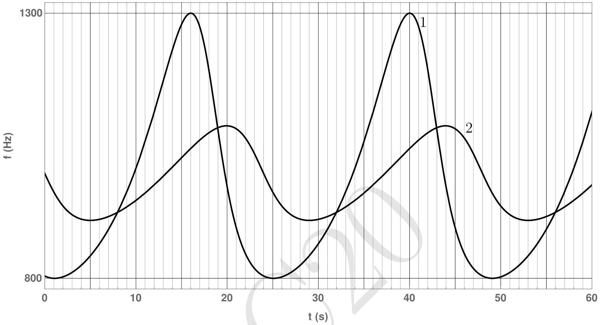
Take the speed of sound in the medium to be 330 m/s.

(a) Determine the time period $T$ of the source.
$$
T =
$$

Solution: Note the time at the peak frequencies of any of the detectors. For detector 1, first peak is at $t = 16 \mathrm {~s}$ and the second peak is at $t = 40 \mathrm {~s}$. Hence the time period of the source $T = 24 \mathrm {~s}$.

(b) The figure below shows the circular trajectory of the source S. Qualitatively mark the positions of both the detectors by indicating 1 and 2. Here O denotes the centre of the trajectory. You must provide detailed justification of your answer in the detailed answer sheet.

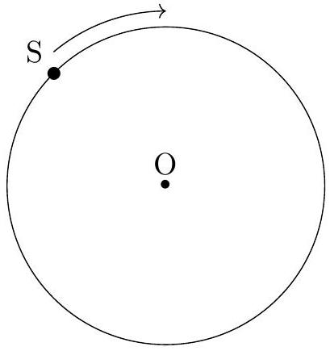

Solution: Couple of things can be easily seen from the graphs:
Time period of the source $T = 24 \mathrm {~s}$.
Time difference between the maximum and minimum frequencies detected by detector 1 $= 9 \mathrm {~s}$.
Time difference between the maximum and minimum frequencies detected by detector 2 $= 9 \mathrm {~s}$.
Time difference between the maximum frequencies detected by detector 1 and 2 = 4 s.

Maximum frequency detected by $1 = 1300 \mathrm {~Hz}$.
Minimum frequency detected by $1 = 800 \mathrm {~Hz}$.
Resolution of the graph is not enough to give the maximum and minimum frequencies detected by the detector 2. Let the source S is moving in the circle of radius $R$. There are four possibilities:

1. Both detectors are outside the circle.
2. Both detectors are inside the circle.
3. One detector is inside and other is outside the circle.
4. One detector is either inside or outside the circle, and other detector is at $R$.
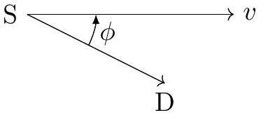

When source is approaching the stationary detector D is at an angle $\phi$, the frequency detected by D is

$$
f = \frac { f _ { 0 } } { 1 - \frac { v } { c } \cos \phi }
$$

Here $f _ { 0 }$ is the frequency emitted by the source, and $c$ is the speed of the sound. If we consider fourth possibility, we should have observed a sharp change in the plot when source is crossing the detector. Hence, we rule out this case.
When the detector $\mathrm { D } _ { \text {out } }$ is outside the circle (see figure below):

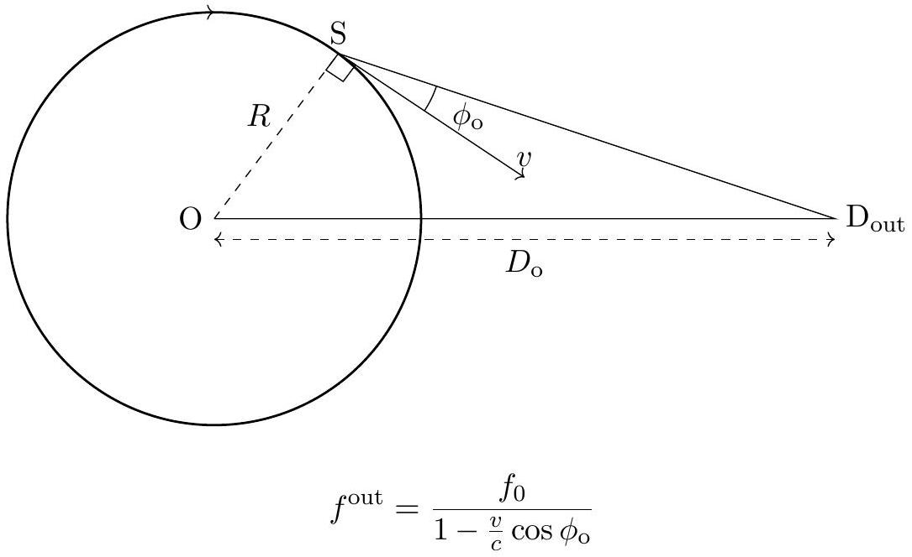
For maximum and minimum frequency, $\cos \phi = \pm 1$
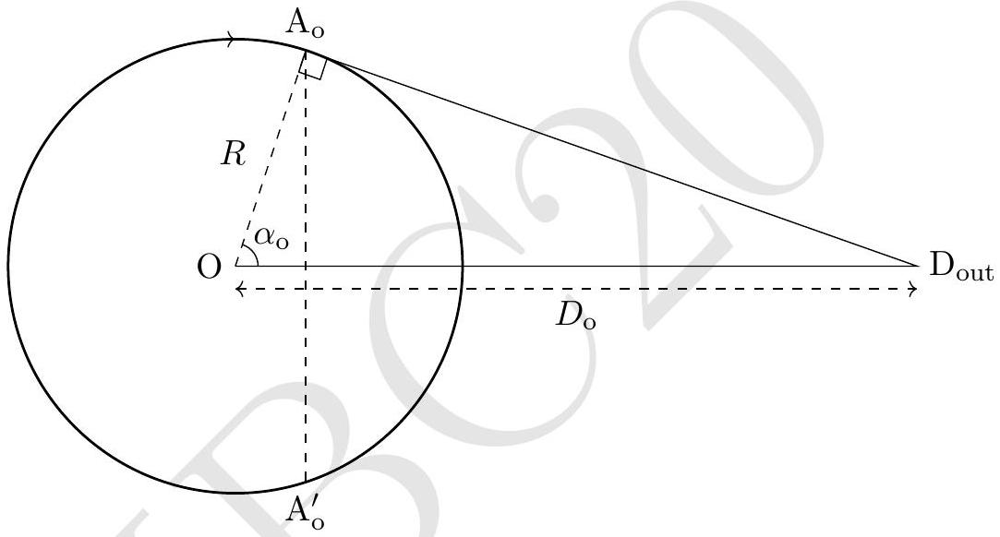

$$
\begin{align*}
& \text { at } \mathrm { A } _ { \mathrm { o } } , f _ { \max } ^ { \text {out } } = \frac { f _ { 0 } } { 1 - \frac { v } { c } } = \frac { f _ { 0 } } { 1 - \frac { \omega R } { c } }  \tag{4.1}\\
& \text { at } \mathrm { A } _ { \mathrm { o } } ^ { \prime } , f _ { \min } ^ { \text {out } } = \frac { f _ { 0 } } { 1 + \frac { v } { c } } = \frac { f _ { 0 } } { 1 + \frac { \omega R } { c } } \tag{4.2}
\end{align*}
$$

If both the detectors are outside, maximum and minimum frequencies detected by them are same which is not the case if you observe the graph given in the question. Hence, we rule out the first possibility.
When detector $\mathrm { D } _ { \text {in } }$ is inside the circle (see figure below):
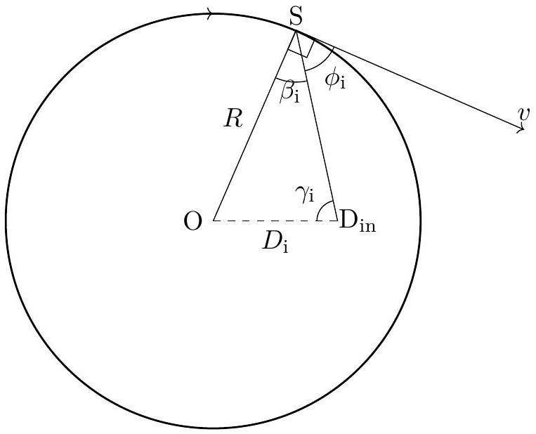

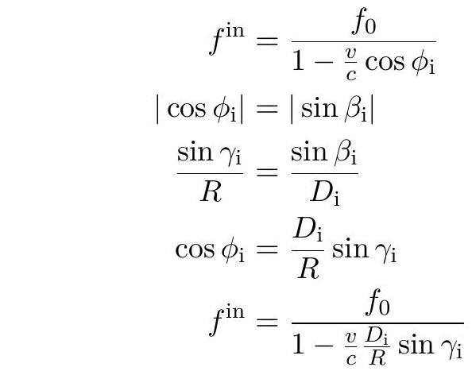
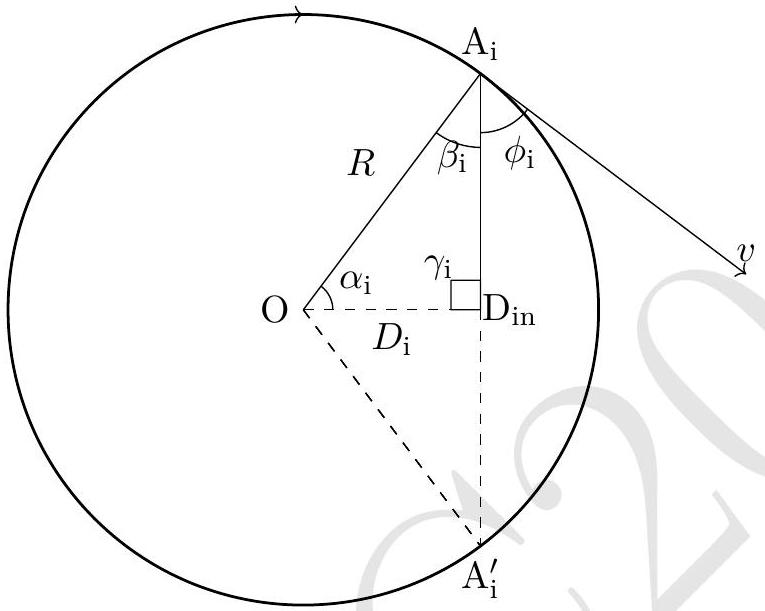
$f ^ { \text {in } }$ is maximum (minimum) when $\sin \gamma _ { \mathrm { i } }$ is $1 ( - 1 )$.

$$
\begin{align*}
& \text { at } \mathrm { A } _ { \mathrm { i } } , f _ { \max } ^ { \mathrm { in } } = \frac { f _ { 0 } } { 1 - \frac { \omega D _ { \mathrm { i } } } { c } } < f _ { \max } ^ { \text {out } }  \tag{4.8}\\
& \text { at } \mathrm { A } _ { \mathrm { i } } ^ { \prime } , f _ { \min } ^ { \text {in } } = \frac { f _ { 0 } } { 1 + \frac { \omega D _ { \mathrm { i } } } { c } } > f _ { \min } ^ { \text {out } } \tag{4.9}
\end{align*}
$$

If both the detectors are inside, again there are two possibilities: they are at the same distances or at the different distances from the center. In the former case, their observed peak frequencies will be same which is clearly not evident from the given graph. In the latter case, their maximum frequencies will be different but the time difference between the maximum and minimum frequencies will also be different. However from the graph, the time difference between maximum and minimum frequencies for detectors 1 and 2 is

$$
t \left( f _ { \min } \right) - t \left( f _ { \max } \right) = 9 \mathrm {~s}
$$

This is possible only if one detector is inside and other detector is outside. Also, detector may not be colinear with the center.
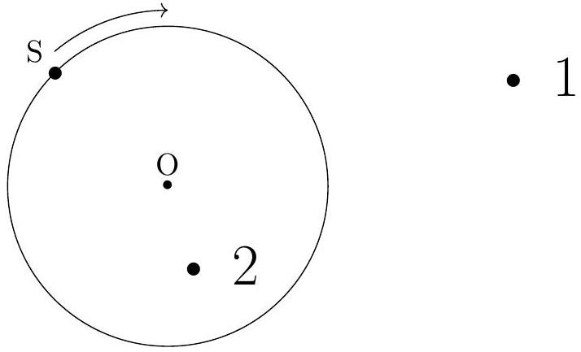
In this part, marking (anywhere) 1 outside and 2 inside the circle with a correct justification will be given full credit.

(c) Obtain the frequency $f _ { 0 }$ of the source.
$$
f _ { 0 } =
$$

Solution: From equations (4.1) and (4.2),

$$
\begin{align*}
\frac { f _ { 0 } } { 1 - \frac { v } { c } } & = 1300 \mathrm {~Hz}  \tag{4.10}\\
\frac { f _ { 0 } } { 1 + \frac { v } { c } } & = 800 \mathrm {~Hz}  \tag{4.11}\\
f _ { 0 } & \approx 991 \mathrm {~Hz} \tag{4.12}
\end{align*}
$$

(d) Calculate the distance $( D )$ between the detectors.
$$
D =
$$

Solution: We have to find out $D _ { \mathrm { i } } , D _ { \mathrm { o } }$ and angle $\theta$ between the detectors. From equations (4.10) and (4.11),

$$
\begin{align*}
v & = 78.6 \mathrm {~m} / \mathrm { s }  \tag{4.13}\\
v & = R \omega = R \frac { 2 \pi } { 24 }  \tag{4.14}\\
R & \approx 300 \mathrm {~m} \tag{4.15}
\end{align*}
$$

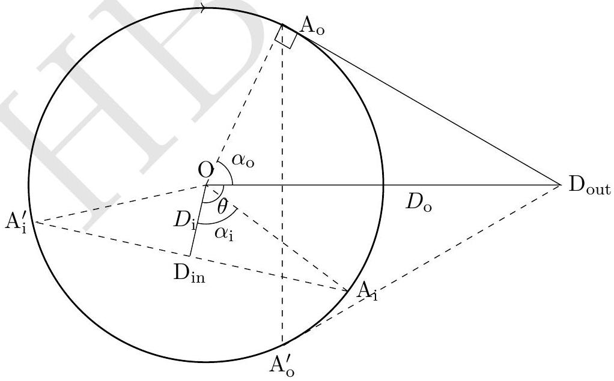
By symmetry, $\mathrm { A } _ { \mathrm { o } }$ and $\mathrm { A } _ { \mathrm { o } } ^ { \prime }$ are equidistant from the detector 1. Similarly, $\mathrm { A } _ { \mathrm { i } }$ and $\mathrm { A } _ { \mathrm { i } } ^ { \prime }$ are equidistant from the detector 2. It takes 9 s from $\mathrm { A } _ { \mathrm { i } }$ to $\mathrm { A } _ { \mathrm { i } } ^ { \prime } \left( \mathrm { A } _ { \mathrm { o } } \right.$ and $\left. \mathrm { A } _ { \mathrm { o } } ^ { \prime } \right)$. Hence

$$
\begin{align*}
2 \angle \alpha _ { \mathrm { o } } & = 2 \angle \alpha _ { \mathrm { i } } = \frac { 3 \pi } { 4 }  \tag{4.16}\\
D _ { \mathrm { i } } & = R \cos \alpha _ { \mathrm { i } } \approx 115 \mathrm {~m}  \tag{4.17}\\
D _ { \mathrm { o } } & = \frac { R } { \cos \alpha _ { \mathrm { o } } } \approx 784 \mathrm {~m} \tag{4.18}
\end{align*}
$$

There will be signal delay due to finite $D _ { \mathrm { o } }$ and $D _ { \mathrm { i } }$.
Let $\theta$ be the angular separation between the detectors. Time difference between the peak

frequencies of detectors 1 and 2 is 4 seconds.

$$
\begin{align*}
4 & = \frac { \theta } { \omega } + \frac { \mathrm { A } _ { \mathrm { i } } \mathrm { D } _ { \mathrm { in } } } { c } - \frac { \mathrm { A } _ { \mathrm { o } } \mathrm { D } _ { \mathrm { out } } } { c }  \tag{4.19}\\
4 & = \frac { \theta } { \omega } + \frac { R \sin \alpha _ { \mathrm { i } } } { c } - \frac { D _ { \mathrm { o } } \sin \alpha _ { \mathrm { o } } } { c }  \tag{4.20}\\
\Rightarrow \theta & = \frac { \pi } { 3 } - \frac { \omega R \sin \alpha _ { \mathrm { i } } } { c } + \frac { \omega D _ { \mathrm { o } } \sin \alpha _ { \mathrm { o } } } { c }  \tag{4.21}\\
& = 1.4 \mathrm { rad } \tag{4.22}
\end{align*}
$$

The distance between the detectors $= \sqrt { \mathrm { OD } _ { \text {in } } ^ { 2 } + \mathrm { OD } _ { \text {out } } ^ { 2 } - 2 \mathrm { OD } _ { \text {in } } \cdot \mathrm { OD } _ { \text {out } } \cdot \cos ( 1.4 ) } \approx 773$ m

Detailed answers can be found on page numbers:
5. The following is the top view of an assembly kept on a smooth horizontal table.
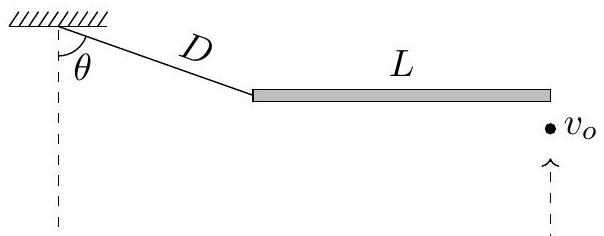
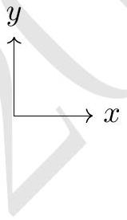
A massless inextensible string of length $D$ lies with one end fixed, while the other is attached to one end of a uniform rod of length $L$. The system is initially at rest with the rod aligned along the $x$-axis and the string stretched to its natural length at an angle with the negative $y$-axis $\theta ( \cos \theta = 1 / 3 )$. At a certain instant, a bullet of the same mass $m$ as the rod and negligible dimensions is fired horizontally along the positive $y$-direction. The bullet hits the rod at its right end with velocity $v _ { o }$ and gets lodged in it, the impact being nearly instantaneous. What is the tension $( T )$ in the string immediately after the impact? Assume the string doesn't break.

$$
T =
$$

Solution: Geometry of the problem dictates that the string becomes taut during the impact and hence exerts an impulse. We conclude:

1. Angular momentum is conserved only about $P$.
2. The velocity of $P$ is perpendicular to the string right after the impact (refer to the figure).

We have two unknowns - $\omega$ and $u$.

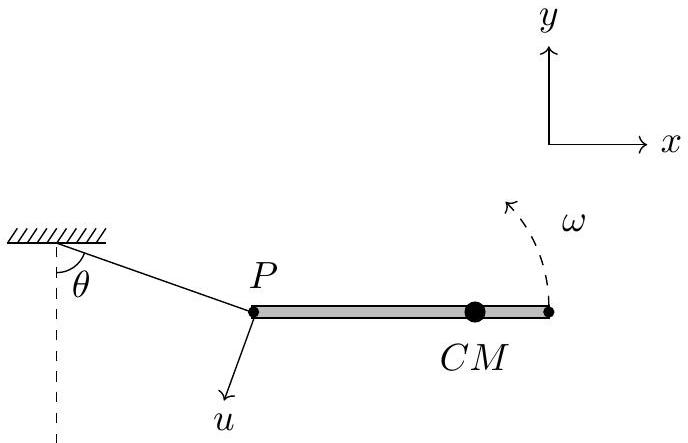
We first note that the momentum of CM is preserved perpendicular to the string since the string applies force only along its length.

$$
\begin{aligned}
\left( P _ { i } \right) _ { \perp } & = \left( P _ { f } \right) _ { \perp } \\
m v \sin \theta & = 2 m \left( v _ { f } \right) _ { \perp }
\end{aligned}
$$

where $\left( v _ { f } \right) _ { \perp }$ is the velocity of the CM perpendicular to the string. CM is located at a distance $\frac { 3 L } { 4 }$ from $P$. So, $\left( v _ { f } \right) _ { \perp } = \frac { 3 L \omega } { 4 } \sin \theta - u$

$$
\begin{equation*}
\Longrightarrow \frac { 3 L \omega } { 4 } \sin \theta - u = \frac { v _ { o } \sin \theta } { 2 } \tag{5.1}
\end{equation*}
$$

Applying conservation of angular momentum about $P$,

$$
\begin{align*}
L _ { i } & = L _ { f } \\
m v _ { o } L & = 2 m \left( \frac { 3 L \omega } { 4 } - u \sin \theta \right) \frac { 3 L } { 4 } + I _ { \mathrm { cm } } \omega \tag{5.2}
\end{align*}
$$

Solving equations 5.1 and 5.2, we get

$$
\begin{align*}
\omega & = \frac { v _ { o } } { L }  \tag{5.3}\\
u & = \frac { v _ { o } } { 3 \sqrt { 2 } } \tag{5.4}
\end{align*}
$$

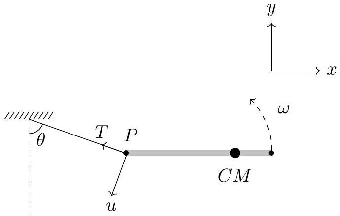
Designate the tension in the string immediately after the impact as $T$. This gives a clockwise angular acceleration of the rod equal to

$$
\begin{equation*}
\alpha = \frac { 3 L } { 4 } \frac { T \cos \theta } { I _ { \mathrm { cm } } } = \frac { 18 T \cos \theta } { 5 m L } \tag{5.5}
\end{equation*}
$$

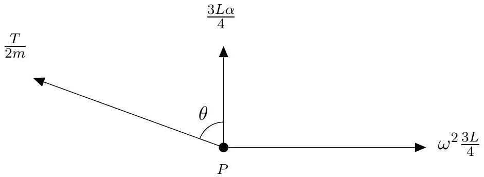
We now calculate the acceleration of $P$ on the rod in the direction of the string, $\left( a _ { P } \right) _ { \| }$(in the ground frame) and set it equal to $\frac { u ^ { 2 } } { D }$.
To this end, note that the acceleration of the CM in the direction of the string is equal to $\frac { T } { 2 m }$. Also, point $P$ is instantaneously rotating about the CM with angular velocity $\omega$ in a circle of radius $\frac { 3 L } { 4 }$ - this gives a centripetal acceleration of $\omega ^ { 2 } \times \frac { 3 L } { 4 }$ directed towards the CM. Furthermore, the tangential acceleration of $P$ along its trajectory is given by $\frac { 3 L \alpha } { 4 }$. Accounting for all these contributions and taking appropriate components, we can write the acceleration of point $P$ in the direction of the string as

$$
\left( a _ { P } \right) _ { \| } = \frac { T } { 2 m } + \frac { 27 T } { 10 m } \cos ^ { 2 } \theta - \frac { 3 \omega ^ { 2 } L } { 4 } \sin \theta
$$

Now we know

$$
\begin{equation*}
\left( a _ { P } \right) _ { \| } = \frac { T } { 2 m } + \frac { 27 T } { 10 m } \cos ^ { 2 } \theta - \frac { 3 \omega ^ { 2 } L } { 4 } \sin \theta = \frac { u ^ { 2 } } { D } \tag{5.6}
\end{equation*}
$$

Hence we get

$$
T = \frac { 5 m v _ { o } ^ { 2 } } { 4 } \left[ \frac { 1 } { 18 D } + \frac { 1 } { L \sqrt { 2 } } \right]
$$

Comment [not for grading purposes]:
We assumed above that the string is taut. This is consistent with the solution above, as we found a non-zero answer for the tension. However, if you do not picture that the geometry of the problem requires tension in the string, you can convince yourselves that this is the correct assumption, by assuming that the tension is zero and arriving at a contradiction.
Assume that the string becomes slack. Let the angular velocity of the rod be $\omega$ counterclockwise, as seen from top, immediately after the impact. Then, noting that velocity of CM remains preserved (because the string is assumed to go slack during the impact) and applying conservation of angular momentum about the point of impact, one gets

$$
\begin{aligned}
L _ { i } & = L _ { f } \\
0 & = 2 m \frac { v _ { o } } { 2 } \frac { L } { 4 } - I _ { \mathrm { cm } } \omega \\
\omega & = \frac { m v _ { o } L } { 4 I _ { \mathrm { cm } } }
\end{aligned}
$$

where $I _ { \mathrm { cm } }$ is the moment of inertia of the rod and the bullet system about its center of mass. Now, $I _ { \mathrm { cm } } = \frac { m L ^ { 2 } } { 12 } + \frac { m L ^ { 2 } } { 8 } + \frac { m L ^ { 2 } } { 8 } = \frac { 5 m L ^ { 2 } } { 24 }$, thereby yielding

$$
\omega = \frac { 6 v _ { o } } { 5 L }
$$

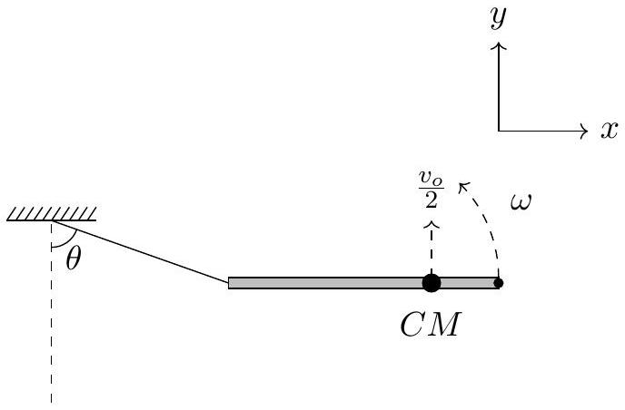
The velocity of the end of the string tied to the $\operatorname { rod } ( P )$ immediately after the impact, therefore, would be given by $- \left( \frac { 3 L } { 4 } \times \frac { 6 v _ { o } } { 5 L } - \frac { v _ { o } } { 2 } \right) \hat { j } = - \frac { 2 v _ { o } } { 5 } \hat { j }$. But this would mean the string would get elongated. Contradiction!

Detailed answers can be found on page numbers:
**** END OF THE QUESTION PAPER ****

□
□
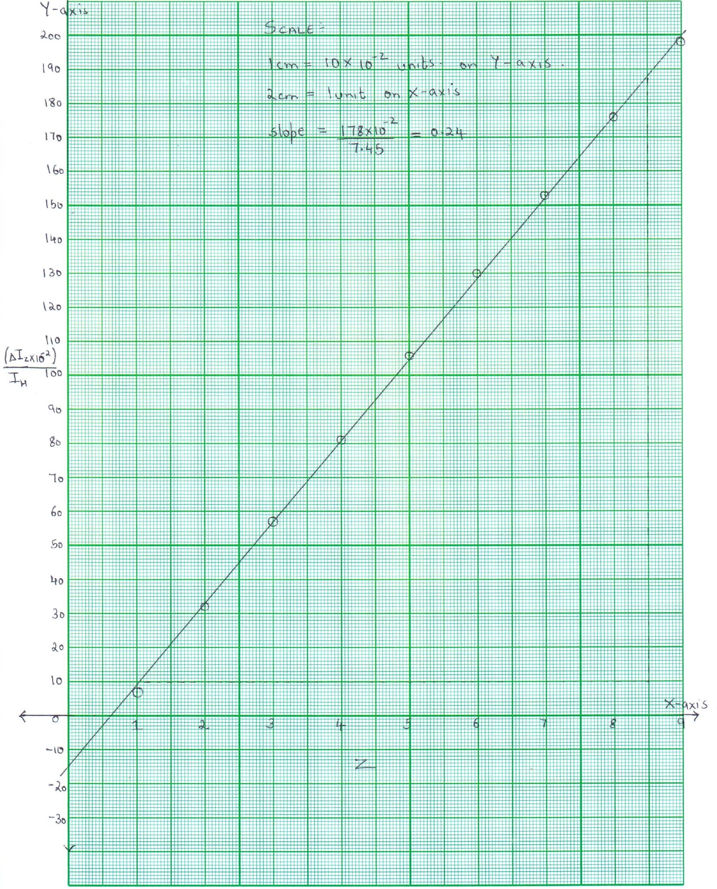
