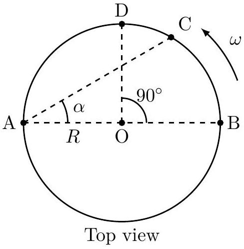
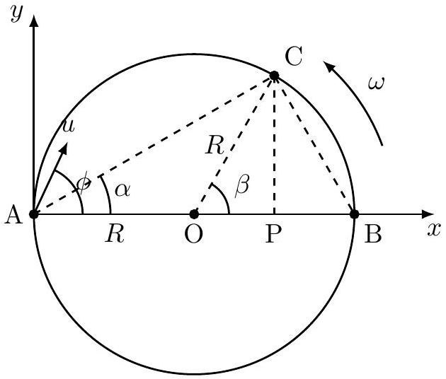
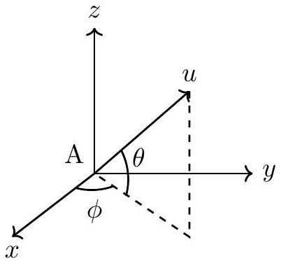

5. Two friends, Amina (A) and Beena (B), are sitting at diametrically opposite points of a merrygo-round (taken as a circular disk in the horizontal plane) of radius $R$ that is rotating at constant angular speed $\omega$ in the anticlockwise direction, when viewed from the top (see figure below).

When Amina is at the position A (as shown in the figure), she throws a ball with velocity $\vec { u }$ (relative to the merrygo-round) in such a manner that Beena catches it when she reaches the position $\mathrm { C } ( \angle B A C = \alpha )$. Here $\vec { u }$ makes an angle $\theta$ with respect to the horizontal, and $\phi$ is the angle made by the horizontal projection of $\vec { u }$ with respect to the line AB. Neglect air resistance, friction, and the effect of throwing or catching the ball on the speed of the merry-go-round.

(a) [6 marks] Determine $u , \theta$ and $\phi$, in terms of $R , \omega , \alpha$, and other relevant quantities.

Solution:
Point of throwing: A; Point of catching: C
Position of $C$ at instant of projection: B

We take the point A as the origin and the $x$-axis along the diameter AB . The $y$-axis is in the horizontal plane, perpendicular to AB. The $z$-axis is taken along vertical direction.

Given, $\omega =$ angular speed of rotation; $\vec { u } =$ velocity of throwing

$\theta =$ Projection angle with respect to horizontal
$\phi =$ Projection angle with respect to diameter $A B$ ( $x$-axis)
$\alpha = \angle B A C \quad \Longrightarrow \beta = \angle B O C = 2 \alpha$
Time of flight = time taken for $B$ to reach $C = T = \frac { R \beta } { v _ { s } } = \frac { R \beta } { R \omega } = \frac { 2 \alpha } { \omega }$
Equations of motion along three directions:

$$
\begin{align*}
x : & u _ { x } \cdot T = A P \\
& \Longrightarrow ( u \cos \theta \cos \phi ) \cdot \frac { 2 \alpha } { \omega } = R + R \cos \beta = R ( 1 + \cos 2 \alpha ) = 2 R \cos ^ { 2 } \alpha \\
& \Longrightarrow u \cos \theta \cos \phi = \frac { R \omega } { \alpha } \cos ^ { 2 } \alpha \tag{5.1}
\end{align*}
$$

$$
\begin{align*}
y : & \left( u _ { y } - R \omega \right) \cdot T = C P \\
& \Longrightarrow ( u \cos \theta \sin \phi - R \omega ) \cdot \frac { 2 \alpha } { \omega } = R \sin \beta = 2 R \sin \alpha \cos \alpha \\
& \Longrightarrow u \cos \theta \sin \phi = \frac { R \omega } { \alpha } \sin \alpha \cos \alpha + R \omega = \frac { R \omega } { \alpha } [ \sin \alpha \cos \alpha + \alpha ] \tag{5.2}
\end{align*}
$$

$$
\begin{array} { l l }
z : & u _ { z } \cdot T - \frac { 1 } { 2 } g T ^ { 2 } = 0 \\
& \Longrightarrow u \sin \theta = \frac { g T } { 2 } = \frac { g \alpha } { \omega } \tag{5.3}
\end{array}
$$

Dividing eq. (5.2) by eq. (5.1),

$$
\begin{align*}
& \tan \phi = \frac { \sin \alpha \cos \alpha + \alpha } { \cos ^ { 2 } \alpha } = \tan \alpha + \alpha \sec ^ { 2 } \alpha \\
\Longrightarrow & \phi = \tan ^ { - 1 } \left( \tan \alpha + \alpha \sec ^ { 2 } \alpha \right) \tag{5.4}
\end{align*}
$$

Squaring eqs. (5.1), (5.2), (5.3) and adding,

$$
\begin{align*}
u ^ { 2 } \cos ^ { 2 } \theta + u ^ { 2 } \sin ^ { 2 } \theta & = \left( \frac { R \omega } { \alpha } \right) ^ { 2 } \left[ \cos ^ { 4 } \alpha + \sin ^ { 2 } \alpha \cos ^ { 2 } \alpha + \alpha ^ { 2 } + 2 \alpha \sin \alpha \cos \alpha \right] + \left( \frac { g \alpha } { \omega } \right) ^ { 2 } \\
\Longrightarrow u ^ { 2 } & = \left( \frac { R \omega } { \alpha } \right) ^ { 2 } \left[ \cos ^ { 2 } \alpha + 2 \alpha \sin \alpha \cos \alpha + \alpha ^ { 2 } \right] + \left( \frac { g \alpha } { \omega } \right) ^ { 2 } \tag{5.5}
\end{align*}
$$

$$
\begin{equation*}
\Longrightarrow u = \left[ \left( \frac { g \alpha } { \omega } \right) ^ { 2 } + \left( \frac { R \omega } { \alpha } \right) ^ { 2 } \left[ \cos ^ { 2 } \alpha + 2 \alpha \sin \alpha \cos \alpha + \alpha ^ { 2 } \right] \right] ^ { 1 / 2 } \tag{5.6}
\end{equation*}
$$

From (5.3) and (5.6),

$$
\begin{equation*}
\theta = \sin ^ { - 1 } \left[ \frac { g \alpha } { \omega } \left[ \left( \frac { g \alpha } { \omega } \right) ^ { 2 } + \left( \frac { R \omega } { \alpha } \right) ^ { 2 } \left[ \cos ^ { 2 } \alpha + 2 \alpha \sin \alpha \cos \alpha + \alpha ^ { 2 } \right] \right] ^ { - 1 / 2 } \right] \tag{5.7}
\end{equation*}
$$

(b) [3 marks] If Amina throws the ball with $\phi = 60 ^ { \circ }$, and appropriate values of $\theta$ and $u$ such that Beena can catch it, what is the magnitude of the displacement, $s$, of the ball when it is caught by Beena? For this part only, take $R = 1.5 \mathrm {~m}$, and it is enough to state your answer within a range of 0.5 m.

Solution:
The displacement of the ball is the length of $\mathrm { AC } = s = 2 R \cos \alpha$.
Thus we need to determine $\alpha$ when $\phi = 60 ^ { \circ }$. Equation (5.4) can be used for this. Note that values of $\theta$ and $u$ are not needed.
Putting $\phi = 60 ^ { \circ }$ in equation (5.4), we have

$$
f ( \alpha ) = \tan \alpha + \alpha \sec ^ { 2 } \alpha = \tan 60 ^ { \circ } = \sqrt { 3 }
$$

This equation cannot be solved analytically. We use trial values of $\alpha$ to find the solution

by interpolation.
$$
\begin{aligned}
& f ( \pi / 6 ) = \frac { 1 } { \sqrt { 3 } } + \frac { \pi } { 6 } \left( \frac { 2 } { \sqrt { 3 } } \right) ^ { 2 } = 1.275 < \sqrt { 3 } \\
& f ( \pi / 4 ) = 1 + \frac { \pi } { 4 } ( \sqrt { 2 } ) ^ { 2 } = 2.571 > \sqrt { 3 }
\end{aligned}
$$
Thus
$$
\begin{aligned}
& \frac { \pi } { 6 } < \alpha < \frac { \pi } { 4 } \\
\Longrightarrow & \frac { \sqrt { 3 } } { 2 } > \cos \alpha > \frac { 1 } { \sqrt { 2 } } \\
\Longrightarrow & 2 R \frac { \sqrt { 3 } } { 2 } > 2 R \cos \alpha > 2 R \frac { 1 } { \sqrt { 2 } } \\
\Longrightarrow & \sqrt { 3 } R > s > \sqrt { 2 } R
\end{aligned}
$$
Putting $R = 1.5 \mathrm {~m}$,
$$
2.1 \text { metre } < s < 2.6 \text { metre }
$$
Any answer that encloses the actual value of 2.4 m and has a range $\leq 0.5 \mathrm {~m}$ is acceptable.
(c) [0.5 marks] Determine the speed of throwing $u _ { \mathrm { D } }$ if Beena catches the ball at the point D $\left( \angle B O D = 90 ^ { \circ } \right)$, instead of C.

Solution:
This is a special case of the above, where $\alpha = \frac { \pi } { 4 }$. Using the above results,

$$
\begin{equation*}
u _ { \mathrm { D } } = \left[ \left( \frac { g \pi } { 4 \omega } \right) ^ { 2 } + \left( \frac { 4 R \omega } { \pi } \right) ^ { 2 } \left[ \frac { 1 } { 2 } + \frac { \pi } { 4 } + \frac { \pi ^ { 2 } } { 16 } \right] \right] ^ { 1 / 2 } \tag{5.8}
\end{equation*}
$$

(d) [3 marks] What should be the angular speed $\omega _ { m }$ of the merry-go-round for which the speed of throwing $u _ { \mathrm { D } }$ will be minimum for Beena to catch the ball at the position D? What is this minimum speed of throwing $u _ { m }$ ?

Solution:
This can be determined by finding the minimum of $u _ { \mathrm { D } }$, or equivalently, $u _ { \mathrm { D } } ^ { 2 }$. From (5.8),

$$
\begin{gathered}
u _ { \mathrm { D } } ^ { 2 } = \left( \frac { g \pi } { 4 \omega } \right) ^ { 2 } + \left( \frac { 4 R \omega } { \pi } \right) ^ { 2 } \left[ \frac { 1 } { 2 } + \frac { \pi } { 4 } + \frac { \pi ^ { 2 } } { 16 } \right] \\
\left. \therefore \frac { \mathrm { d } \left( u _ { \mathrm { D } } ^ { 2 } \right) } { \mathrm { d } \omega } \right| _ { \omega _ { m } } = 0 \Longrightarrow - \frac { ( g \pi ) ^ { 2 } } { 8 \omega _ { m } ^ { 3 } } + \frac { 32 R ^ { 2 } \omega _ { m } } { \pi ^ { 2 } } \left[ \frac { 1 } { 2 } + \frac { \pi } { 4 } + \frac { \pi ^ { 2 } } { 16 } \right] = 0 \\
\Longrightarrow \omega _ { m } ^ { 4 } = \frac { g ^ { 2 } \pi ^ { 4 } } { 256 R ^ { 2 } \left[ \frac { 1 } { 2 } + \frac { \pi } { 4 } + \frac { \pi ^ { 2 } } { 16 } \right] } \\
\Longrightarrow \omega _ { m } = \frac { \pi } { 4 } \left[ \frac { 1 } { 2 } + \frac { \pi } { 4 } + \frac { \pi ^ { 2 } } { 16 } \right] ^ { - 1 / 4 } \sqrt { \frac { g } { R } }
\end{gathered}
$$

Also,

$$
\left. \frac { \mathrm { d } ^ { 2 } \left( u _ { \mathrm { D } } ^ { 2 } \right) } { \mathrm { d } \omega ^ { 2 } } \right| _ { \omega _ { m } } = \frac { 3 ( g \pi ) ^ { 2 } } { 8 \omega _ { m } ^ { 4 } } + \frac { 32 R ^ { 2 } } { \pi ^ { 2 } } \left[ \frac { 1 } { 2 } + \frac { \pi } { 4 } + \frac { \pi ^ { 2 } } { 16 } \right] > 0 .
$$

implying $u _ { \mathrm { D } } ^ { 2 }$ is minimum at $\omega = \omega _ { m }$.

$$
\therefore u _ { m } ^ { 2 } = g R \left[ \frac { 1 } { 2 } + \frac { \pi } { 4 } + \frac { \pi ^ { 2 } } { 16 } \right] ^ { 1 / 2 } + g R \left[ \frac { 1 } { 2 } + \frac { \pi } { 4 } + \frac { \pi ^ { 2 } } { 16 } \right] ^ { 1 / 2 }
$$

$$
\Longrightarrow u _ { m } = \left( \frac { 1 } { 2 } + \frac { \pi } { 4 } + \frac { \pi ^ { 2 } } { 16 } \right) ^ { 1 / 4 } \sqrt { 2 g R }
$$

Alternative solution without calculus
Observe that

$$
u _ { \mathrm { D } } ^ { 2 } = \frac { \lambda } { \omega ^ { 2 } } + \mu \omega ^ { 2 }
$$

where $\lambda = \left( \frac { g \pi } { 4 } \right) ^ { 2 } > 0 , \mu = \left( \frac { 4 R } { \pi } \right) ^ { 2 } \left[ \frac { 1 } { 2 } + \frac { \pi } { 4 } + \frac { \pi ^ { 2 } } { 16 } \right] > 0$.
We can write

$$
u _ { \mathrm { D } } ^ { 2 } = \left( \frac { \sqrt { \lambda } } { \omega } - \omega \sqrt { \mu } \right) ^ { 2 } + 2 \sqrt { \lambda \mu } .
$$

The first term can be made zero by the choice of

$$
\omega = \omega _ { m } = \left( \frac { \lambda } { \mu } \right) ^ { 1 / 4 }
$$

leading to the minimum value of $u _ { \mathrm { D } } ^ { 2 }$ as $u _ { m } ^ { 2 } = 2 \sqrt { \lambda \mu }$. Upon substituting the values of $\lambda$ and $\mu$ the desired expressions are obtained.

(e) [2.5 marks] Consider the case when Amina throws the ball when she is at A, and catches it herself when she reaches the point B (Beena is not involved in this case). Take the angular speed of the merry-go-round to be $\omega = \sqrt { g / R }$. Find $u , \theta$ and $\phi$ in this case.

Solution:
This case is NOT a special case of the above.
Now $T = \frac { \tau } { 2 } = \frac { \pi } { \omega }$.
Further, $\omega = \sqrt { g / R }$.
The equations of motion are:

$$
\begin{equation*}
x : \quad u _ { x } \cdot T = A B \Longrightarrow ( u \cos \theta \cos \phi ) \cdot \frac { \pi } { \omega } = 2 R \Longrightarrow u \cos \theta \cos \phi = \frac { 2 R \omega } { \pi } = \frac { 2 } { \pi } \sqrt { g R } \tag{5.9}
\end{equation*}
$$

$$
\begin{equation*}
y : \quad \left( u _ { y } - R \omega \right) \cdot T = 0 \Longrightarrow u \cos \theta \sin \phi = R \omega = \sqrt { g R } \tag{5.10}
\end{equation*}
$$

$$
\begin{equation*}
z : \quad u _ { z } T - \frac { 1 } { 2 } g T ^ { 2 } = 0 \Longrightarrow u \sin \theta = \frac { g T } { 2 } = \frac { \pi g } { 2 \omega } = \frac { \pi } { 2 } \sqrt { g R } \tag{5.11}
\end{equation*}
$$

Dividing eq. (5.10) by eq. (5.9),

$$
\tan \phi = \frac { \pi } { 2 } \Longrightarrow \phi = \tan ^ { - 1 } \frac { \pi } { 2 } = 57.52 ^ { \circ }
$$

Squaring eqs. (5.10) and (5.9), and adding,

$$
\begin{align*}
& u ^ { 2 } \cos ^ { 2 } \theta = g R \left[ \frac { 4 } { \pi ^ { 2 } } + 1 \right] \\
\Longrightarrow & u = \sqrt { g R } \left[ \frac { \pi ^ { 2 } } { 4 } + \frac { 4 } { \pi ^ { 2 } } + 1 \right] ^ { 1 / 2 } = 1.97 \sqrt { g R } \tag{5.12}
\end{align*}
$$

Using eqs. (5.11) and (5.12),

$$
\sin \theta = \frac { \pi } { 2 } \left[ \frac { \pi ^ { 2 } } { 4 } + \frac { 4 } { \pi ^ { 2 } } + 1 \right] ^ { - 1 / 2 } \Longrightarrow \theta = \sin ^ { - 1 } ( 0.80 ) = 52.96 ^ { \circ }
$$

Space for rough work - will NOT be submitted for evaluation
