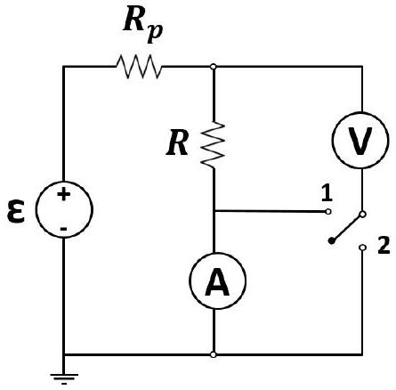
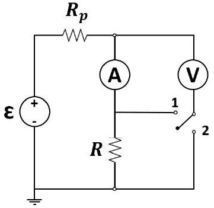
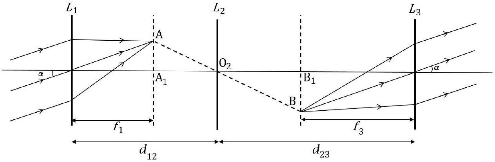

# Indian Olympiad Qualifier in Physics (IOQP) 2020-2021

conducted jointly by
Homi Bhabha Centre for Science Education (HBCSE-TIFR) and
Indian Association of Physics Teachers (IAPT)
Part II: Indian National Physics Olympiad (INPhO)
Homi Bhabha Centre for Science Education (HBCSE-TIFR)

Date: 07 February 2021
Time: 10:15-12:15 (2 hours) Maximum Marks: 50

Instructions

1. This booklet consists of 10 pages and total of 5 questions. Write roll number at the top wherever asked.
2. Booklet to write the answers is provided separately. Instructions to write the answers are on the Answer Booklet.
3. Marks will be awarded on the basis of what you write on both the Summary Answer Sheet and the Detailed Answer Sheets in the Answer Booklet. Simple short answers and plots may be directly entered in the Summary Answer Sheet. Marks may be deducted for absence of detailed work in questions involving longer calculations.
4. Strike out any rough work that you do not want to be considered for evaluation. You may also use the space on the Question Paper for rough work - this will NOT be evaluated.
5. Non-programmable scientific calculators are allowed. Mobile phones cannot be used as calculators.
6. Last page of the question paper can be used for rough work.
7. Please submit the Answer Booklet at the end of the examination. You may retain the Question Paper.

Table of Constants
| Speed of light in vacuum | $c$ | $3.00 \times 10 ^ { 8 } \mathrm {~m} \cdot \mathrm {~s} ^ { - 1 }$ |
| :--- | :--- | :--- |
| Planck's constant | $h$ | $6.63 \times 10 ^ { - 34 } \mathrm {~J} \cdot \mathrm {~s}$ |
| Magnitude of electron charge | $e$ | $1.60 \times 10 ^ { - 19 } \mathrm { C }$ |
| Rest mass of electron | $m _ { e }$ | $9.11 \times 10 ^ { - 31 } \mathrm {~kg}$ |
| Value of $1 / 4 \pi \epsilon _ { 0 }$ |  | $9.00 \times 10 ^ { 9 } \mathrm {~N} \cdot \mathrm {~m} ^ { 2 } \cdot \mathrm { C } ^ { - 2 }$ |
| Acceleration due to gravity | $g$ | $9.81 \mathrm {~m} \cdot \mathrm {~s} ^ { - 2 }$ |

Please note that alternate/equivalent methods and different way of expressing final solutions may exist. A correct method will be suitably awarded.

1. The ammeter-voltmeter method is widely used for measuring electrical resistances in the physics laboratory. In this method, the resistance $R$ is always derived from the readings $V$ and $I$ from a voltmeter and an ammeter respectively, using Ohm's law: $R = V / I$. While using this method, it is assumed that the ammeter and voltmeter used in the setup are ideal. In this problem, we will find the pitfalls of this assumption and devise a new setup with a better performance.
The standard ammeter-voltmeter setup consists of a DC voltage source $( \varepsilon )$ maintained at a constant voltage, a protection resistance $\left( \mathrm { R } _ { \mathrm { p } } \right)$, an ammeter (A), and a voltmeter (V). The unknown internal resistances of the ammeter and the voltmeter are $R _ { A }$ and $R _ { V }$, respectively. Also, $R _ { V } \gg R _ { A }$. We aim to measure the true value $R$ of an unknown resistor.
We consider a two commonly used circuit configurations (1) and (2) indicated by the two possible positions of the switch in the circuit diagram shown below. Let the measured values of the resistance $R$ be $R _ { \mathrm { m } 1 }$ and $R _ { \mathrm { m } 2 }$ in the setups (1) and (2), respectively. The relative error, $\Delta$, is defined as the ratio of the absolute error of the measurement to the actual value: $\Delta = \left( R _ { \mathrm { m } } - R \right) / R$.

    (a) [2 marks] Obtain the relative errors in the measurements ( $\Delta _ { 1 }$ and $\Delta _ { 2 }$ ) for each of the above configurations.

Solution:
Setup (1):
Current through the ammeter

$$
I _ { 1 } = \frac { V _ { 1 } } { R } + \frac { V _ { 1 } } { R _ { V } }
$$

whereas the voltage corresponds to the voltage across the voltmeter-resistance combination. Thus the measured resistance

$$
\begin{align*}
R _ { \mathrm { m } 1 } & = \frac { V _ { 1 } } { I _ { 1 } } = \frac { R } { 1 + \frac { R } { R _ { V } } }  \tag{1.1}\\
\Delta _ { 1 } & = - \frac { 1 } { 1 + \frac { R _ { V } } { R } } \tag{1.2}
\end{align*}
$$

Setup (2):
Current through the ammeter

$$
I _ { 2 } = \frac { V _ { 2 } } { R + R _ { A } }
$$

Thus

$$
\begin{align*}
R _ { \mathrm { m } 2 } & = \frac { V _ { 2 } } { I _ { 2 } } = R + R _ { A }  \tag{1.3}\\
\Delta _ { 2 } & = \frac { R _ { A } } { R } \tag{1.4}
\end{align*}
$$

(b) [4 marks] Using exactly the same circuit elements, can you suggest a step by step procedure, with the necessary circuit diagram(s), to measure the true value of the resistance R, regardless of the values of the internal resistances of the ammeter and the voltmeter? You may use the measurements made in part (a).

Solution:

1. We use the configuration shown below. When the switch is in position 1, ammeter and voltmeter are in parallel and we calculate $R _ { A } = V / I$.

2. When we use the switch in position 2, the configuration is same as position 2 of part (a).
$$
R = R _ { \mathrm { m } 2 } - R _ { A }
$$
This will give the true value of the resistance.
2. [8 marks] Prof. Saha gave the following problem to four students.
In this problem work done by a system on its surroundings is taken as positive. A non-ideal gas follows the Van der Waals equation of state
$$
\left( P + \frac { n ^ { 2 } a } { V ^ { 2 } } \right) ( V - n b ) = n R T
$$
where $P , V$, and $T$ denote the pressure, volume, and temperature, respectively; $n$ is the number of moles; $R$ is the universal gas constant and $a , b$ are dimensional positive constants. This gas expands adiabatically from an initial temperature $T _ { i }$ and volume $V _ { i }$ to a final temperature $T _ { f }$ and volume $V _ { f }$. The adiabatic process is described by an equation of the form $f ( P , V ; n , a , b , \alpha ) =$ constant, where $\alpha$ is a dimensionless number which is greater than 1. It is given that $\alpha \rightarrow \gamma$ in the ideal gas limit, where $\gamma$ is the adiabatic exponent. What is the work $( W )$ done by the gas in the process?
The four students solved the problem independently and gave four different answers. Their answers were:
(a) $W = \frac { n R } { \alpha - 1 } \left( T _ { i } - T _ { f } \right) + n ^ { 2 } a \left( V _ { f } ^ { - 1 } - V _ { i } ^ { - 1 } \right)$
(b) $W = \frac { n R } { \alpha - 1 } \left( T _ { f } - T _ { i } \right) + n ^ { 2 } a \left( V _ { f } ^ { - 1 } - V _ { i } ^ { - 1 } \right)$
(c) $W = \frac { n R } { \alpha - 1 } \left( T _ { i } - T _ { f } \right) + n ^ { 2 } a \left( V _ { f } ^ { \alpha - 1 } - V _ { i } ^ { \alpha - 1 } \right)$
(d) $W = \frac { n R } { \alpha - 1 } \left( T _ { i } - T _ { f } \right) \left[ 1 - \left( \frac { V _ { f } - n b } { V _ { i } - n b } \right) ^ { \alpha - 1 } \right]$
Now, Prof. Saha had actually provided the exact expression of $f ( P , V ; n , a , b , \alpha )$ to the students, but could not remember it during evaluation. Still, he could determine that some or all of the four answers above must be incorrect, based on general physical arguments alone.
Consider each of the four answers and give at least one reason for each of them showing why it is wrong, or possibly correct. Note that you are not required to give a correct expression for $W$ or a detailed derivation for it in this question.

Solution:

(a) For adiabatic expansion, $T _ { f } < T _ { i }$, and $V _ { f } > V _ { i }$. Even though the first term is positive and the second term is negative, it is possible to have $W > 0$, which is true for adiabatic expansion. Also, in the ideal gas limit ( $\alpha \rightarrow \gamma$ and $a \rightarrow 0$ ), this gives the correct expression. So this may be the correct expression.
(b) For adiabatic expansion, $T _ { f } < T _ { i }$ and $V _ { f } > V _ { i }$. Therefore, in this case $W < 0$, which is incorrect.

(c) From Van der Waals equation, $a / V$ has dimensions of energy. So $a V ^ { \alpha - 1 }$ cannot have dimensions of energy, making this expression incorrect.
(d) Since $T _ { f } < T _ { i }$ and $V _ { f } > V _ { i }$, here $W < 0$ making this incorrect.
3. Consider an electron (mass $m$, magnitude of charge $e$ ) moving initially around a nucleus of charge $2 e$ in a circular orbit of radius $10 ^ { - 10 } \mathrm {~m}$. In this problem we use SI units throughout and neglect all relativistic effects.
(a) [2 marks] Obtain the expression for the frequency, $f$, of the electron in the circular orbit (numerical value is not required).

Solution:
The centripetal force for the circular motion of the electron is provided by the Coulomb attraction of the nucleus. Let $r$ be the radius of the circular orbit, and $v$ the speed of the electron in this orbit, then

$$
\begin{align*}
\frac { m v ^ { 2 } } { r } & = \frac { 2 e ^ { 2 } } { 4 \pi \epsilon _ { 0 } r ^ { 2 } }  \tag{3.1}\\
f & = \frac { v } { 2 \pi r } = \left( \frac { 2 } { 4 \pi \epsilon _ { 0 } m } \right) ^ { 1 / 2 } \frac { e } { 2 \pi r ^ { 3 / 2 } } \tag{3.2}
\end{align*}
$$

From classical electrodynamics, we know that an accelerated electron radiates energy. The expression for the power $P$ of this radiation is given by

$$
P = K \epsilon _ { 0 } ^ { w } e ^ { x } a ^ { y } c ^ { z }
$$

where $a$ is the acceleration, $c$ is the speed of light, $\epsilon _ { 0 }$ is the permittivity of free space, and $K$ is a dimensionless constant.

(b) [2 marks] Obtain $\{ w , x , y , z \}$ using dimensional analysis.
Solution: $w = - 1 , x = 2 , y = 2 , z = - 3$

Due to the loss of energy through radiation, the electron does not remain in the circular orbit, and gradually spirals into the nucleus. Take the constant $K$ to be $5.31 \times 10 ^ { - 2 }$.

(c) [5 marks] Let $T$ be the time it takes for the electron to reach the nucleus. Calculate $T$ if the radius of the nucleus is $10 ^ { - 14 } \mathrm {~m}$.

Solution:
The total energy of an electron in the orbit is

$$
\begin{align*}
E ( r ) & = - \frac { 1 } { 4 \pi \epsilon _ { 0 } } \frac { e ^ { 2 } } { r }  \tag{3.3}\\
- \dot { E } ( r ) & = - \frac { 1 } { 4 \pi \epsilon _ { 0 } } \frac { e ^ { 2 } \dot { r } } { r ^ { 2 } } \tag{3.4}
\end{align*}
$$

the acceleration is

$$
\begin{equation*}
a = \frac { v ^ { 2 } } { r } = \frac { 1 } { 4 \pi \epsilon _ { 0 } } \frac { 2 e ^ { 2 } } { m r ^ { 2 } } \tag{3.5}
\end{equation*}
$$

We use Eq. (3.5) in the power radiated, which yields the energy loss rate

$$
\begin{equation*}
- \dot { E } ( r ) = - K \frac { 1 } { \left( 4 \pi \epsilon _ { 0 } \right) ^ { 2 } } \frac { 4 e ^ { 6 } } { \epsilon _ { 0 } c ^ { 3 } m ^ { 2 } r ^ { 4 } } \tag{3.6}
\end{equation*}
$$

Here negative sign indicates that the energy of the electron is decreasing. Combining

Eqs. (3.4) and (3.6)

$$
\begin{equation*}
r ^ { 2 } d r = - \frac { K 4 e ^ { 4 } } { \left( 4 \pi \epsilon _ { 0 } \right) \epsilon _ { 0 } c ^ { 3 } m ^ { 2 } } d t \tag{3.7}
\end{equation*}
$$

Integrating the equation

$$
\begin{equation*}
\int _ { 10 ^ { - 10 } } ^ { 10 ^ { - 14 } } r ^ { 2 } d r = - \frac { K 4 e ^ { 4 } } { \left( 4 \pi \epsilon _ { 0 } \right) \epsilon _ { 0 } c ^ { 3 } m ^ { 2 } } \int _ { 0 } ^ { T } d t \tag{3.8}
\end{equation*}
$$

which yields

$$
\begin{equation*}
T \sim \frac { 10 ^ { - 30 } } { 48 \pi } \frac { \left( 4 \pi \epsilon _ { 0 } \right) ^ { 2 } c ^ { 3 } m ^ { 2 } } { K e ^ { 4 } } \sim 5.26 \times 10 ^ { - 11 } \mathrm {~s} . \tag{3.9}
\end{equation*}
$$

4. [12 marks] Three thin convex lenses $\mathrm { L } _ { 1 } , \mathrm {~L} _ { 2 }$, and $\mathrm { L } _ { 3 }$ with focal lengths $f _ { 1 } , f _ { 2 }$, and $f _ { 3 }$, respectively, are arranged in order ( $\mathrm { L } _ { 1 }$ followed by $\mathrm { L } _ { 2 }$, followed by $\mathrm { L } _ { 3 }$ from left to right) with their principal axes coincident. The distance $d _ { 12 }$ between $\mathrm { L } _ { 1 }$ and $\mathrm { L } _ { 2 }$, and the distance $d _ { 23 }$ between $\mathrm { L } _ { 2 }$ and $\mathrm { L } _ { 3 }$ are such that $d _ { 12 } + d _ { 23 } \geq f _ { 1 } + 4 f _ { 2 } + f _ { 3 }$. If a parallel beam of light incident on $\mathrm { L } _ { 1 }$ at a small angle to the principal axis remains parallel to itself when leaving the system after passing through $\mathrm { L } _ { 2 }$ and $\mathrm { L } _ { 3 }$, draw the appropriate ray diagram and determine $d _ { 12 }$ and $d _ { 23 }$ in terms of $f _ { 1 } , f _ { 2 }$, and $f _ { 3 }$.

Solution:
An incoming parallel beam falling on the thin lens $\mathrm { L } _ { 1 }$ will converge to a certain point A on the focal plane of $\mathrm { L } _ { 1 }$. The point A serves as the point source for $\mathrm { L } _ { 2 }$ whose image is formed on the other side of $\mathrm { L } _ { 2 }$ at a certain point B. The line AB must intersect the principal axis at the pole $\mathrm { O } _ { 2 }$ of $\mathrm { L } _ { 2 }$. For a parallel beam to emerge from $\mathrm { L } _ { 3 }$, B must lie in the focal plane of $\mathrm { L } _ { 3 }$. The necessary ray diagram is drawn below.

Since $\alpha \approx 0$, we make the approximations

$$
\begin{aligned}
& \mathrm { AA } _ { 1 } = f _ { 1 } \tan \alpha \approx f _ { 1 } \alpha \\
& \mathrm { BB } _ { 1 } = f _ { 2 } \tan \alpha \approx f _ { 2 } \alpha
\end{aligned}
$$

From magnification formula for lens $\mathrm { L } _ { 2 }$,

$$
\begin{aligned}
\frac { \mathrm { BB } _ { 1 } } { \mathrm { AA } _ { 1 } } & = \frac { f _ { 3 } \alpha } { f _ { 1 } \alpha } = \frac { v _ { 2 } } { - u _ { 2 } } = \frac { d _ { 23 } - f _ { 3 } } { d _ { 12 } - f _ { 1 } } \\
\Longrightarrow & \frac { d _ { 12 } } { f _ { 1 } } = \frac { d _ { 23 } } { f _ { 3 } } = k ( \text { say } ) \\
\Longrightarrow d _ { 12 } & = k f _ { 1 } \quad \text { and } \quad d _ { 23 } = k f _ { 3 }
\end{aligned}
$$

From the lens equation for lens $\mathrm { L } _ { 2 }$,

$$
\begin{aligned}
\frac { 1 } { v _ { 2 } } - \frac { 1 } { u _ { 2 } } & = \frac { 1 } { f _ { 2 } } \\
\frac { 1 } { \left( d _ { 23 } - f _ { 3 } \right) } - \frac { 1 } { - \left( d _ { 12 } - f _ { 1 } \right) } & = \frac { 1 } { f _ { 2 } } \\
\frac { 1 } { f _ { 3 } ( k - 1 ) } + \frac { 1 } { f _ { 1 } ( k - 1 ) } & = \frac { 1 } { f _ { 2 } } \\
\Longrightarrow \quad k = 1 + \frac { f _ { 2 } } { f _ { 1 } } + \frac { f _ { 2 } } { f _ { 3 } } &
\end{aligned}
$$

Then,

$$
\begin{aligned}
& d _ { 12 } = f _ { 1 } + f _ { 2 } + \frac { f _ { 1 } f _ { 2 } } { f _ { 3 } } \\
& d _ { 23 } = f _ { 2 } + f _ { 3 } + \frac { f _ { 2 } f _ { 3 } } { f _ { 1 } }
\end{aligned}
$$

5. Two friends, Amina (A) and Beena (B), are sitting at diametrically opposite points of a merrygo-round (taken as a circular disk in the horizontal plane) of radius $R$ that is rotating at constant angular speed $\omega$ in the anticlockwise direction, when viewed from the top (see figure below).

When Amina is at the position A (as shown in the figure), she throws a ball with velocity $\vec { u }$ (relative to the merrygo-round) in such a manner that Beena catches it when she reaches the position $\mathrm { C } ( \angle B A C = \alpha )$. Here $\vec { u }$ makes an angle $\theta$ with respect to the horizontal, and $\phi$ is the angle made by the horizontal projection of $\vec { u }$ with respect to the line AB. Neglect air resistance, friction, and the effect of throwing or catching the ball on the speed of the merry-go-round.

(a) [6 marks] Determine $u , \theta$ and $\phi$, in terms of $R , \omega , \alpha$, and other relevant quantities.

Solution:
Point of throwing: A; Point of catching: C
Position of $C$ at instant of projection: B

We take the point A as the origin and the $x$-axis along the diameter AB . The $y$-axis is in the horizontal plane, perpendicular to AB. The $z$-axis is taken along vertical direction.

Given, $\omega =$ angular speed of rotation; $\vec { u } =$ velocity of throwing

$\theta =$ Projection angle with respect to horizontal
$\phi =$ Projection angle with respect to diameter $A B$ ( $x$-axis)
$\alpha = \angle B A C \quad \Longrightarrow \beta = \angle B O C = 2 \alpha$
Time of flight = time taken for $B$ to reach $C = T = \frac { R \beta } { v _ { s } } = \frac { R \beta } { R \omega } = \frac { 2 \alpha } { \omega }$
Equations of motion along three directions:

$$
\begin{align*}
x : & u _ { x } \cdot T = A P \\
& \Longrightarrow ( u \cos \theta \cos \phi ) \cdot \frac { 2 \alpha } { \omega } = R + R \cos \beta = R ( 1 + \cos 2 \alpha ) = 2 R \cos ^ { 2 } \alpha \\
& \Longrightarrow u \cos \theta \cos \phi = \frac { R \omega } { \alpha } \cos ^ { 2 } \alpha \tag{5.1}
\end{align*}
$$

$$
\begin{align*}
y : & \left( u _ { y } - R \omega \right) \cdot T = C P \\
& \Longrightarrow ( u \cos \theta \sin \phi - R \omega ) \cdot \frac { 2 \alpha } { \omega } = R \sin \beta = 2 R \sin \alpha \cos \alpha \\
& \Longrightarrow u \cos \theta \sin \phi = \frac { R \omega } { \alpha } \sin \alpha \cos \alpha + R \omega = \frac { R \omega } { \alpha } [ \sin \alpha \cos \alpha + \alpha ] \tag{5.2}
\end{align*}
$$

$$
\begin{array} { l l }
z : & u _ { z } \cdot T - \frac { 1 } { 2 } g T ^ { 2 } = 0 \\
& \Longrightarrow u \sin \theta = \frac { g T } { 2 } = \frac { g \alpha } { \omega } \tag{5.3}
\end{array}
$$

Dividing eq. (5.2) by eq. (5.1),

$$
\begin{align*}
& \tan \phi = \frac { \sin \alpha \cos \alpha + \alpha } { \cos ^ { 2 } \alpha } = \tan \alpha + \alpha \sec ^ { 2 } \alpha \\
\Longrightarrow & \phi = \tan ^ { - 1 } \left( \tan \alpha + \alpha \sec ^ { 2 } \alpha \right) \tag{5.4}
\end{align*}
$$

Squaring eqs. (5.1), (5.2), (5.3) and adding,

$$
\begin{align*}
u ^ { 2 } \cos ^ { 2 } \theta + u ^ { 2 } \sin ^ { 2 } \theta & = \left( \frac { R \omega } { \alpha } \right) ^ { 2 } \left[ \cos ^ { 4 } \alpha + \sin ^ { 2 } \alpha \cos ^ { 2 } \alpha + \alpha ^ { 2 } + 2 \alpha \sin \alpha \cos \alpha \right] + \left( \frac { g \alpha } { \omega } \right) ^ { 2 } \\
\Longrightarrow u ^ { 2 } & = \left( \frac { R \omega } { \alpha } \right) ^ { 2 } \left[ \cos ^ { 2 } \alpha + 2 \alpha \sin \alpha \cos \alpha + \alpha ^ { 2 } \right] + \left( \frac { g \alpha } { \omega } \right) ^ { 2 } \tag{5.5}
\end{align*}
$$

$$
\begin{equation*}
\Longrightarrow u = \left[ \left( \frac { g \alpha } { \omega } \right) ^ { 2 } + \left( \frac { R \omega } { \alpha } \right) ^ { 2 } \left[ \cos ^ { 2 } \alpha + 2 \alpha \sin \alpha \cos \alpha + \alpha ^ { 2 } \right] \right] ^ { 1 / 2 } \tag{5.6}
\end{equation*}
$$

From (5.3) and (5.6),

$$
\begin{equation*}
\theta = \sin ^ { - 1 } \left[ \frac { g \alpha } { \omega } \left[ \left( \frac { g \alpha } { \omega } \right) ^ { 2 } + \left( \frac { R \omega } { \alpha } \right) ^ { 2 } \left[ \cos ^ { 2 } \alpha + 2 \alpha \sin \alpha \cos \alpha + \alpha ^ { 2 } \right] \right] ^ { - 1 / 2 } \right] \tag{5.7}
\end{equation*}
$$

(b) [3 marks] If Amina throws the ball with $\phi = 60 ^ { \circ }$, and appropriate values of $\theta$ and $u$ such that Beena can catch it, what is the magnitude of the displacement, $s$, of the ball when it is caught by Beena? For this part only, take $R = 1.5 \mathrm {~m}$, and it is enough to state your answer within a range of 0.5 m.

Solution:
The displacement of the ball is the length of $\mathrm { AC } = s = 2 R \cos \alpha$.
Thus we need to determine $\alpha$ when $\phi = 60 ^ { \circ }$. Equation (5.4) can be used for this. Note that values of $\theta$ and $u$ are not needed.
Putting $\phi = 60 ^ { \circ }$ in equation (5.4), we have

$$
f ( \alpha ) = \tan \alpha + \alpha \sec ^ { 2 } \alpha = \tan 60 ^ { \circ } = \sqrt { 3 }
$$

This equation cannot be solved analytically. We use trial values of $\alpha$ to find the solution

by interpolation.
$$
\begin{aligned}
& f ( \pi / 6 ) = \frac { 1 } { \sqrt { 3 } } + \frac { \pi } { 6 } \left( \frac { 2 } { \sqrt { 3 } } \right) ^ { 2 } = 1.275 < \sqrt { 3 } \\
& f ( \pi / 4 ) = 1 + \frac { \pi } { 4 } ( \sqrt { 2 } ) ^ { 2 } = 2.571 > \sqrt { 3 }
\end{aligned}
$$
Thus
$$
\begin{aligned}
& \frac { \pi } { 6 } < \alpha < \frac { \pi } { 4 } \\
\Longrightarrow & \frac { \sqrt { 3 } } { 2 } > \cos \alpha > \frac { 1 } { \sqrt { 2 } } \\
\Longrightarrow & 2 R \frac { \sqrt { 3 } } { 2 } > 2 R \cos \alpha > 2 R \frac { 1 } { \sqrt { 2 } } \\
\Longrightarrow & \sqrt { 3 } R > s > \sqrt { 2 } R
\end{aligned}
$$
Putting $R = 1.5 \mathrm {~m}$,
$$
2.1 \text { metre } < s < 2.6 \text { metre }
$$
Any answer that encloses the actual value of 2.4 m and has a range $\leq 0.5 \mathrm {~m}$ is acceptable.
(c) [0.5 marks] Determine the speed of throwing $u _ { \mathrm { D } }$ if Beena catches the ball at the point D $\left( \angle B O D = 90 ^ { \circ } \right)$, instead of C.

Solution:
This is a special case of the above, where $\alpha = \frac { \pi } { 4 }$. Using the above results,

$$
\begin{equation*}
u _ { \mathrm { D } } = \left[ \left( \frac { g \pi } { 4 \omega } \right) ^ { 2 } + \left( \frac { 4 R \omega } { \pi } \right) ^ { 2 } \left[ \frac { 1 } { 2 } + \frac { \pi } { 4 } + \frac { \pi ^ { 2 } } { 16 } \right] \right] ^ { 1 / 2 } \tag{5.8}
\end{equation*}
$$

(d) [3 marks] What should be the angular speed $\omega _ { m }$ of the merry-go-round for which the speed of throwing $u _ { \mathrm { D } }$ will be minimum for Beena to catch the ball at the position D? What is this minimum speed of throwing $u _ { m }$ ?

Solution:
This can be determined by finding the minimum of $u _ { \mathrm { D } }$, or equivalently, $u _ { \mathrm { D } } ^ { 2 }$. From (5.8),

$$
\begin{gathered}
u _ { \mathrm { D } } ^ { 2 } = \left( \frac { g \pi } { 4 \omega } \right) ^ { 2 } + \left( \frac { 4 R \omega } { \pi } \right) ^ { 2 } \left[ \frac { 1 } { 2 } + \frac { \pi } { 4 } + \frac { \pi ^ { 2 } } { 16 } \right] \\
\left. \therefore \frac { \mathrm { d } \left( u _ { \mathrm { D } } ^ { 2 } \right) } { \mathrm { d } \omega } \right| _ { \omega _ { m } } = 0 \Longrightarrow - \frac { ( g \pi ) ^ { 2 } } { 8 \omega _ { m } ^ { 3 } } + \frac { 32 R ^ { 2 } \omega _ { m } } { \pi ^ { 2 } } \left[ \frac { 1 } { 2 } + \frac { \pi } { 4 } + \frac { \pi ^ { 2 } } { 16 } \right] = 0 \\
\Longrightarrow \omega _ { m } ^ { 4 } = \frac { g ^ { 2 } \pi ^ { 4 } } { 256 R ^ { 2 } \left[ \frac { 1 } { 2 } + \frac { \pi } { 4 } + \frac { \pi ^ { 2 } } { 16 } \right] } \\
\Longrightarrow \omega _ { m } = \frac { \pi } { 4 } \left[ \frac { 1 } { 2 } + \frac { \pi } { 4 } + \frac { \pi ^ { 2 } } { 16 } \right] ^ { - 1 / 4 } \sqrt { \frac { g } { R } }
\end{gathered}
$$

Also,

$$
\left. \frac { \mathrm { d } ^ { 2 } \left( u _ { \mathrm { D } } ^ { 2 } \right) } { \mathrm { d } \omega ^ { 2 } } \right| _ { \omega _ { m } } = \frac { 3 ( g \pi ) ^ { 2 } } { 8 \omega _ { m } ^ { 4 } } + \frac { 32 R ^ { 2 } } { \pi ^ { 2 } } \left[ \frac { 1 } { 2 } + \frac { \pi } { 4 } + \frac { \pi ^ { 2 } } { 16 } \right] > 0 .
$$

implying $u _ { \mathrm { D } } ^ { 2 }$ is minimum at $\omega = \omega _ { m }$.

$$
\therefore u _ { m } ^ { 2 } = g R \left[ \frac { 1 } { 2 } + \frac { \pi } { 4 } + \frac { \pi ^ { 2 } } { 16 } \right] ^ { 1 / 2 } + g R \left[ \frac { 1 } { 2 } + \frac { \pi } { 4 } + \frac { \pi ^ { 2 } } { 16 } \right] ^ { 1 / 2 }
$$

$$
\Longrightarrow u _ { m } = \left( \frac { 1 } { 2 } + \frac { \pi } { 4 } + \frac { \pi ^ { 2 } } { 16 } \right) ^ { 1 / 4 } \sqrt { 2 g R }
$$

Alternative solution without calculus
Observe that

$$
u _ { \mathrm { D } } ^ { 2 } = \frac { \lambda } { \omega ^ { 2 } } + \mu \omega ^ { 2 }
$$

where $\lambda = \left( \frac { g \pi } { 4 } \right) ^ { 2 } > 0 , \mu = \left( \frac { 4 R } { \pi } \right) ^ { 2 } \left[ \frac { 1 } { 2 } + \frac { \pi } { 4 } + \frac { \pi ^ { 2 } } { 16 } \right] > 0$.
We can write

$$
u _ { \mathrm { D } } ^ { 2 } = \left( \frac { \sqrt { \lambda } } { \omega } - \omega \sqrt { \mu } \right) ^ { 2 } + 2 \sqrt { \lambda \mu } .
$$

The first term can be made zero by the choice of

$$
\omega = \omega _ { m } = \left( \frac { \lambda } { \mu } \right) ^ { 1 / 4 }
$$

leading to the minimum value of $u _ { \mathrm { D } } ^ { 2 }$ as $u _ { m } ^ { 2 } = 2 \sqrt { \lambda \mu }$. Upon substituting the values of $\lambda$ and $\mu$ the desired expressions are obtained.

(e) [2.5 marks] Consider the case when Amina throws the ball when she is at A, and catches it herself when she reaches the point B (Beena is not involved in this case). Take the angular speed of the merry-go-round to be $\omega = \sqrt { g / R }$. Find $u , \theta$ and $\phi$ in this case.

Solution:
This case is NOT a special case of the above.
Now $T = \frac { \tau } { 2 } = \frac { \pi } { \omega }$.
Further, $\omega = \sqrt { g / R }$.
The equations of motion are:

$$
\begin{equation*}
x : \quad u _ { x } \cdot T = A B \Longrightarrow ( u \cos \theta \cos \phi ) \cdot \frac { \pi } { \omega } = 2 R \Longrightarrow u \cos \theta \cos \phi = \frac { 2 R \omega } { \pi } = \frac { 2 } { \pi } \sqrt { g R } \tag{5.9}
\end{equation*}
$$

$$
\begin{equation*}
y : \quad \left( u _ { y } - R \omega \right) \cdot T = 0 \Longrightarrow u \cos \theta \sin \phi = R \omega = \sqrt { g R } \tag{5.10}
\end{equation*}
$$

$$
\begin{equation*}
z : \quad u _ { z } T - \frac { 1 } { 2 } g T ^ { 2 } = 0 \Longrightarrow u \sin \theta = \frac { g T } { 2 } = \frac { \pi g } { 2 \omega } = \frac { \pi } { 2 } \sqrt { g R } \tag{5.11}
\end{equation*}
$$

Dividing eq. (5.10) by eq. (5.9),

$$
\tan \phi = \frac { \pi } { 2 } \Longrightarrow \phi = \tan ^ { - 1 } \frac { \pi } { 2 } = 57.52 ^ { \circ }
$$

Squaring eqs. (5.10) and (5.9), and adding,

$$
\begin{align*}
& u ^ { 2 } \cos ^ { 2 } \theta = g R \left[ \frac { 4 } { \pi ^ { 2 } } + 1 \right] \\
\Longrightarrow & u = \sqrt { g R } \left[ \frac { \pi ^ { 2 } } { 4 } + \frac { 4 } { \pi ^ { 2 } } + 1 \right] ^ { 1 / 2 } = 1.97 \sqrt { g R } \tag{5.12}
\end{align*}
$$

Using eqs. (5.11) and (5.12),

$$
\sin \theta = \frac { \pi } { 2 } \left[ \frac { \pi ^ { 2 } } { 4 } + \frac { 4 } { \pi ^ { 2 } } + 1 \right] ^ { - 1 / 2 } \Longrightarrow \theta = \sin ^ { - 1 } ( 0.80 ) = 52.96 ^ { \circ }
$$

Space for rough work - will NOT be submitted for evaluation
