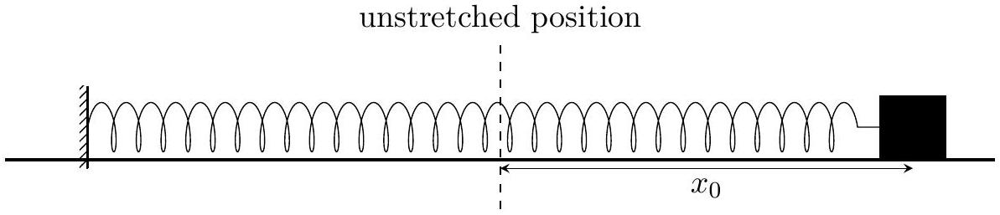
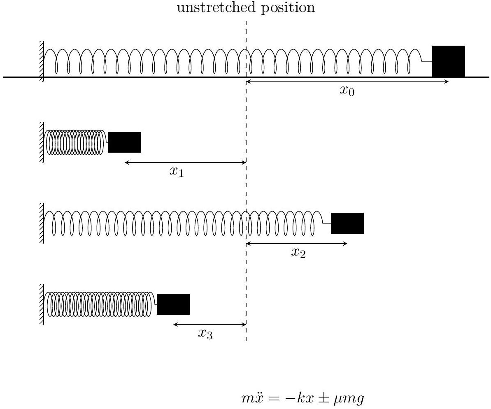
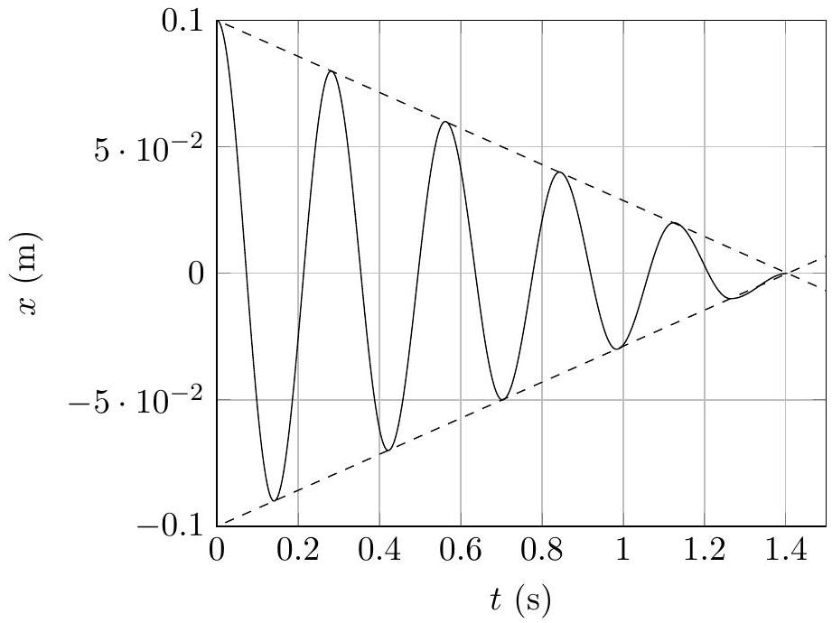
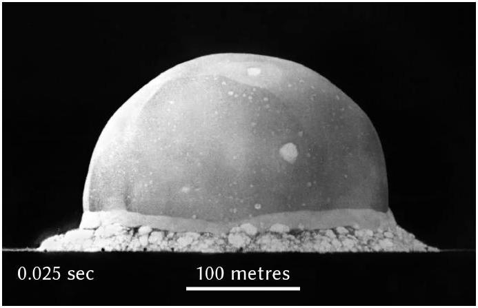
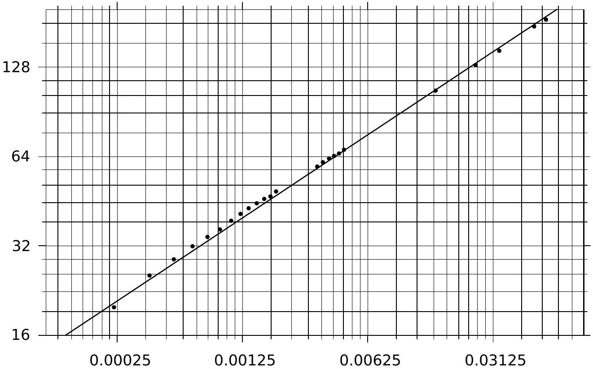
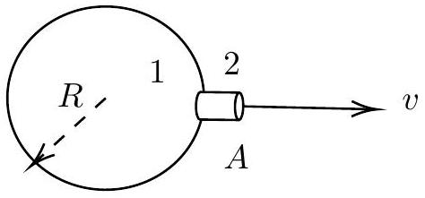
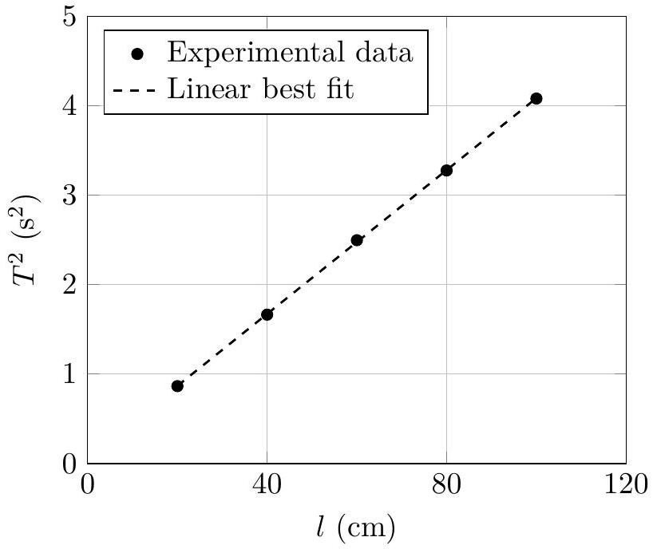
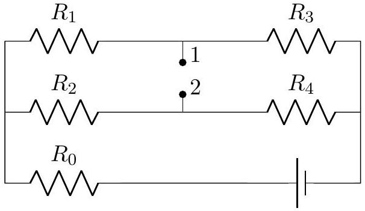
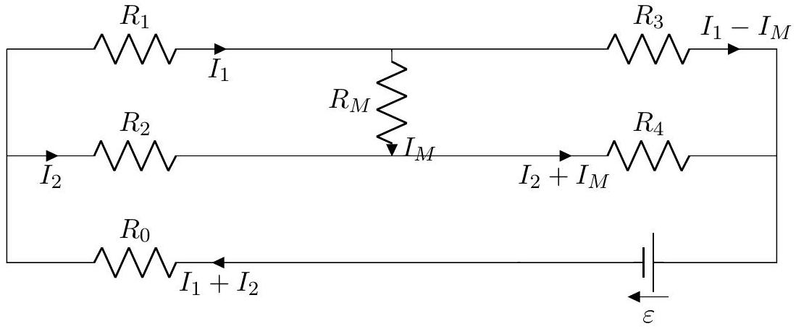

5. Non-programmable scientific calculators are allowed. Mobile phones cannot be used as calculators.
6. Please submit the Answer Booklet at the end of the examination. You may retain the Question Paper.

1. A block of mass $m = 0.1 \mathrm {~kg}$ is attached to a spring (one end fixed to the wall) with spring constant $k = 50 \mathrm {~N} \mathrm {~m} ^ { - 1 }$. The block slides on a rough horizontal table along the $x$-axis. Assume that both the coefficients of kinetic $\left( \mu _ { k } \right)$ and static friction $\left( \mu _ { s } \right)$ are same and constant $\left( \mu _ { k } = \mu _ { s } = \mu = 0.25 \right)$. The block is initially displaced to $x _ { 0 } = 0.1 \mathrm {~m}$ from the unstretched position (normal length of the spring, $x = 0$ ) of the spring and released from rest as shown below. Neglect any air resistance. Take the acceleration $g$ due to gravity to be $10 \mathrm {~m} / \mathrm { s } ^ { 2 }$.

    (a) [3 marks] How many times $( n )$ will the block cross the unstretched position before coming to rest permanently?

Solution:

where the ± sign is used so that the friction is opposite to the direction of the velocity of the block. Lets define the ratio of the frictional force to the maximum restoring force to be $\alpha$ i.e. $\alpha = \mu m g / k x _ { 0 }$. During the first half cycle of the motion, the loss of potential energy is equal to the work done against friction

$$
\begin{equation*}
\frac { k x _ { 0 } ^ { 2 } } { 2 } - \frac { k x _ { 1 } ^ { 2 } } { 2 } = \mu m g \left( x _ { 0 } - x _ { 1 } \right) \tag{1.2}
\end{equation*}
$$

where $x _ { 1 }$ is the displacement after one half cycle. This gives

$$
\begin{align*}
& x _ { 1 } = - x _ { 0 } + 2 \alpha x _ { 0 }  \tag{1.3}\\
& x _ { 2 } = - x _ { 1 } - 2 \alpha x _ { 0 } \tag{1.4}
\end{align*}
$$

Thus

$$
\begin{array} { r }
x _ { j } = - x _ { j - 1 } - ( - 1 ) ^ { j } 2 \alpha x _ { 0 } \\
x _ { j } = ( - 1 ) ^ { j } ( 1 - 2 \alpha j ) x _ { 0 } \tag{1.6}
\end{array}
$$

The block will come to rest permanently at $x _ { n }$ when

$$
\begin{align*}
\left| x _ { n } \right| \leq \alpha x _ { 0 } & < \left| x _ { n - 1 } \right|  \tag{1.7}\\
\frac { 1 - \alpha } { 2 \alpha } & \leq n < \frac { 1 + \alpha } { 2 \alpha } \tag{1.8}
\end{align*}
$$

For the given values of $\mu , m , k$ and $x _ { 0 } , \alpha = 0.05$. Thus $9.5 \leq n < 10.5$. The block will cross the unstretched position 9 times and then comes to the rest at the unstretched position.

(b) [1 marks] Determine the total distance $D$ covered by the block before coming to rest.
Solution: Total distance
$$
\begin{align*}
D & = x _ { 0 } + \sum _ { j = 1 } ^ { n - 1 } x _ { j } + x _ { n }  \tag{1.9}\\
& = x _ { 0 } + \sum _ { j = 1 } ^ { n - 1 } ( - 1 ) ^ { j } ( 1 - 2 \alpha j ) x _ { 0 } + 0.1  \tag{1.10}\\
& = 2 n ( 1 - \alpha n ) x _ { 0 } + 0.1 = 1.00 \mathrm {~m} \tag{1.11}
\end{align*}
$$
(c) [6 marks] Let us divide one complete oscillation of the block, starting from a fully stretched condition of the spring, into four distinct sections, requiring the following times in order:
    (i) $t _ { 1 }$ : time taken for the block to move from fully stretched to the unstretched position,
    (ii) $t _ { 2 }$ : time taken for the block to move from the unstretched position to fully compressed position,
    (iii) $t _ { 3 }$ : time taken for the block to move from fully compressed to the unstretched position,
    (iv) $t _ { 4 }$ : time taken for the block to move from the unstretched position to fully stretched position.

Let the distance covered during the above intervals be $d _ { 1 } , d _ { 2 } , d _ { 3 }$, and $d _ { 4 }$, respectively.
Also, let $T _ { 1 }$ and $T _ { 2 }$ be the time taken to complete the first and the second oscillations, respectively, starting from the initial displacement, $x _ { 0 }$.
Compare the above times and distances by inserting an appropriate sign (from among <, >, or = only) between the given quantities in each of the boxes below. Note that you will be penalised for 0.5 marks for giving each incorrect answer in this part. You need not to justify your answer.

| $t _ { 1 }$ | $t _ { 2 }$ | $t _ { 2 }$ | $t _ { 3 }$ | $t _ { 1 }$ | $t _ { 3 }$ |
| :--- | :--- | :--- | :--- | :--- | :--- |
| $d _ { 1 }$ | $d _ { 2 }$ | $d _ { 2 }$ | $d _ { 4 }$ | $T _ { 1 }$ | $T _ { 2 }$ |

Solution:

| $t _ { 1 } > t _ { 2 }$ | $t _ { 2 } < t _ { 3 }$ | $t _ { 1 } < t _ { 3 }$ |
| :--- | :--- | :--- |
| $d _ { 1 } > d _ { 2 }$ | $d _ { 2 } > d _ { 4 }$ | $T _ { 1 } = T _ { 2 }$ |

(d) [2 marks] Qualitatively plot the displacement $x$ from the unstretched position vs the time $t$.

Solution: Equations of motion are

$$
\begin{array} { l l }
m \ddot { x } = - k x + \mu m g & ( \dot { x } < 0 ) \\
m \ddot { x } = - k x - \mu m g & ( \dot { x } > 0 ) \tag{1.13}
\end{array}
$$

The general solution to the above equation is simply the solution for the SHO and an additive constant.

$$
\begin{array} { l l }
x = A \cos \omega t + C & ( \dot { x } < 0 ) \\
x = A \cos \omega t - C & ( \dot { x } > 0 ) \tag{1.15}
\end{array}
$$

and velocity and the acceleration are

$$
\begin{align*}
\dot { x } & = - A \omega \sin \omega t  \tag{1.16}\\
\ddot { x } & = A \omega ^ { 2 } \cos \omega t \tag{1.17}
\end{align*}
$$

Using the above equations in Eqs. (1.12) and (1.13)

$$
\begin{array} { l l }
x ( t ) = A \cos \omega t + \alpha x _ { 0 } & ( \dot { x } < 0 ) \\
x ( t ) = A \cos \omega t - \alpha x _ { 0 } & ( \dot { x } > 0 ) \tag{1.19}
\end{array}
$$

For the given value of $\mu , \alpha = 0.05$. Every half swing exhibits simple harmonic motion. Turning points are regularly spaced in time at every $\pi / \omega$ intervals. The initial position at each turning point (or the end position of the previous half turn) determines the amplitude and phase for the following half turn. During the time interval between the turning point $t _ { j }$ and $t _ { j + 1 }$

$$
\begin{equation*}
x _ { j } ( t ) = A _ { j } \cos \omega t - \alpha x _ { 0 } ( - 1 ) ^ { j } \tag{1.20}
\end{equation*}
$$

Note, for the compression of the spring, $\dot { x } < 0$ and $j = 1,3,5 \ldots$ Comparing Eqs. (1.20) and (1.6)

$$
\begin{align*}
( - 1 ) ^ { j } ( 1 - 2 \alpha j ) x _ { 0 } & = A _ { j } ( - 1 ) ^ { j } - \alpha x _ { 0 } ( - 1 ) ^ { j }  \tag{1.21}\\
A _ { j } & = x _ { 0 } ( 1 - \alpha ( 2 j - 1 ) ) \tag{1.22}
\end{align*}
$$

To summarize the results, the motion of each half swing is essentially the motion of a simple harmonic oscillator centered about either $\alpha x _ { 0 }$ or $- \alpha x _ { 0 }$. At each turning point $( t = j \pi / \omega )$, the amplitude of the oscillator decreases by $2 \alpha x _ { 0 }$. Before $j = n$, given by the Eq. (1.8), the mass moves according to

$$
\begin{equation*}
x _ { j } ( t ) = x _ { 0 } \left[ \{ 1 - \alpha ( 2 j - 1 ) \} \cos \omega t - ( - 1 ) ^ { j } \alpha \right] \tag{1.23}
\end{equation*}
$$

The plot of $x$ vs $t$ for the given value of $\alpha$ is shown below. The displacement lies within a pair of straight lines (shown by the dotted lines) with slopes $\pm 2 \alpha x _ { 0 } / ( \pi / \omega )$.

2. The first explosion of an atomic bomb was the Trinity test in New Mexico in 1945. This explosion released a very large amount of energy $E$ which created an expanding fireball (known as the Trinity fireball). A snapshot of this fireball taken 0.025 s after the explosion is shown in the photograph below.

A scientist, Prof. Geoffrey Taylor, could make an estimate of the energy released by the bomb from an analysis of such photographs. Here we try to follow in his footsteps, with some suitable simplifications.
To begin, we assume that the fireball is spherical in nature. Its radius $( R )$ increases with time $( t )$ depending on the explosion energy $E$ and the density $\rho$ of the surrounding air (which is taken as constant and uniform).
We are also given a graph of the data obtained by Prof. Taylor, as shown below. However, the axes labels of the graph are missing.

Given data:
1 kiloton (kt) of TNT $= 4.2 \times 10 ^ { 12 } \mathrm {~J}$
Density $\rho$ of air outside the fireball $= 1.22 \mathrm {~kg} / \mathrm { m } ^ { 3 }$.
    (a) [3 marks] What are the quantities represented by the axes of the graph? Also state the respective units in which they are expressed. In the detailed answer sheet, justify your answer.

Solution: It is clear that this graph is on a log-log scale. Physical quantities which are involved: $E , R , \rho , V$ and time $t$. Here $E$ and $\rho$ are constant. Possible answers can be $R$ vs $t , V$ vs $t$, or $V$ vs $R$. We can get a relation between $R$ and $t$ and then verify from the slope of the straight line. Also, from the time and length scale given in the explosion picture tells us that at $t = 25 \mathrm {~ms} , R$ is in between 100-200 m.
Thus, it is a $R ( \mathrm {~m} )$ vs $t ( \mathrm {~s} )$ plot on a log-log scale.
(b) [4 marks] Find the slope $( s )$ of the best fit line shown in the graph. What are the dimensions of the quantity $s$ ?

Solution: We take two random points $\left( x _ { 1 } , y _ { 1 } \right) , \left( x _ { 2 } , y _ { 2 } \right)$ on the line passing through the grid. Then the slope of the graph is

$$
\begin{align*}
s & = \frac { \log \left( y _ { 2 } \right) - \log \left( y _ { 1 } \right) } { \log \left( x _ { 2 } \right) - \log \left( x _ { 1 } \right) }  \tag{2.1}\\
& = \frac { \log \left( 32 \times 2 ^ { 0.6 } \right) - \log \left( 16 \times 2 ^ { 0.2 } \right) } { \log \left( 0.00125 \times 5 ^ { 0.2 } \right) - \log \left( 0.00005 \times 5 ^ { 0.8 } \right) }  \tag{2.2}\\
& = 0.43 \tag{2.3}
\end{align*}
$$

The slope is dimensionless.

(c) [3 marks] From a dimensional analysis based on the above simplified model, make an estimate of the energy $E$ released (in kt of TNT) in the Trinity test.
Solution: Using the dimensional analysis, $E$ can be expressed as $[ E ] = \rho ^ { \alpha } t ^ { \beta } R ^ { \gamma }$. Using the dimensions of the quantities involved,
$$
\begin{align*}
& E = \frac { R ^ { 5 } \rho } { t ^ { 2 } }  \tag{2.4}\\
& R = E \frac { t ^ { 2 / 5 } } { \rho ^ { 1 / 5 } } \tag{2.5}
\end{align*}
$$
According to the above equation, a plot of $R$ vs $t$ on a log-log scale will have a slope of 0.4. This we have already found in the previous part.
From $\left( x _ { 2 } , y _ { 2 } \right) , E \approx 26 \mathrm { kt }$ TNT.
The yield of the Trinity test was officially estimated as 21 kt TNT.

3. Consider an air filled spherical balloon comprised of elastic material of surface tension $\gamma =$ $500 \mathrm {~kg} / \mathrm { s } ^ { 2 }$. The pressure outside the balloon is the atmospheric pressure $\left( P _ { \mathrm { atm } } = 101 \mathrm { kPa } \right)$ and the density of air outside is $\rho _ { \mathrm { atm } } = 1.22 \mathrm {~kg} / \mathrm { m } ^ { 3 }$.
The balloon starts deflating slowly. Assume that the average velocity of air inside the balloon is negligible, and air leaves the balloon in a streamline fashion. Consider $\gamma$ to be constant throughout, and the air to be incompressible.
    (a) [8 marks] Write an expression for the time $t$ required to deflate the balloon through a small opening of cross-sectional area $A$ from an initial radius $R _ { 0 }$ to a final radius $R$.
    (b) [1 marks] Obtain the value of this time for $A = 1 \times 10 ^ { - 5 } \mathrm {~m} ^ { 2 } , R _ { 0 } = 0.15 \mathrm {~m}$, and $R = 0.05 \mathrm {~m}$.
Solution:
Pressure of air inside the balloon of radius $r$ and given surface tension $\gamma$ is
$$
\begin{equation*}
P = P _ { \mathrm { atm } } + \frac { 4 \gamma } { r } \tag{3.1}
\end{equation*}
$$

Consider the schematic diagram of deflating the balloon. Just inside the balloon, at point (1), gas can be treated stationary. Outside, at point (2), it can be treated flowing out with speed $v$. Then by Bernoulli's equation
$$
\begin{equation*}
P _ { 1 } = P _ { 2 } + \frac { \rho v ^ { 2 } } { 2 } \tag{3.2}
\end{equation*}
$$
Outside pressure and density are $P _ { \text {atm } }$ and $\rho _ { \text {atm } }$ respectively. Also, the inside pressure is given by the Eq. (3.1). Thus
$$
\begin{align*}
P _ { \mathrm { atm } } + \frac { 4 \gamma } { r } & = P _ { \mathrm { atm } } + \frac { \rho _ { \mathrm { atm } } v ^ { 2 } } { 2 }  \tag{3.3}\\
\Rightarrow v & = \sqrt { \frac { 8 \gamma } { \rho _ { \mathrm { atm } } r } } \tag{3.4}
\end{align*}
$$
Volume of air flowing through hole of area $A$ per sec at $P _ { \text {atm } }$ is
$$
\begin{align*}
\frac { d V } { d t } & = A v  \tag{3.5}\\
\frac { d } { d t } \left( \frac { 4 \pi r ^ { 3 } } { 3 } \right) & = A v  \tag{3.6}\\
4 \pi r ^ { 2 } \frac { d r } { d t } & = A v \tag{3.7}
\end{align*}
$$
We use Eq. (3.4) in the above equation, which yields
$$
\begin{equation*}
r ^ { 5 / 2 } d r = \frac { A } { 4 \pi } \sqrt { \frac { 8 \gamma } { \rho } } d t \tag{3.8}
\end{equation*}
$$
Integrating from $R _ { 0 }$ to $R _ { 1 }$
$$
\begin{equation*}
t = \frac { 4 \pi } { 7 A } \sqrt { \frac { \rho _ { \mathrm { atm } } } { 2 \gamma } } \left[ R _ { 0 } ^ { 7 / 2 } - R _ { 1 } ^ { 7 / 2 } \right] \tag{3.9}
\end{equation*}
$$
In Eq. (3.1) if the extra pressure taken as $2 \gamma / R$ then
$$
\begin{equation*}
t = \frac { 4 \pi } { 7 A } \sqrt { \frac { \rho _ { \mathrm { atm } } } { \gamma } } \left[ R _ { 0 } ^ { 7 / 2 } - R _ { 1 } ^ { 7 / 2 } \right] \tag{3.11}
\end{equation*}
$$
For the given values, Eq. (3.9) gives $t = 8.02 \mathrm {~s}$ and Eq. (3.10) yields 11.22 s . Both Eqs. (3.9) and (3.10) and accordingly the calculated values are considered correct.

4. A student performed an experiment to determine the acceleration due to gravity $( g )$ using a simple pendulum which has a spherical bob of diameter $d$ hung with a long string. She varied the length of the string $l$, and measured the period of oscillation $T$ every time. She calculated the value of $g$ from each measurement as shown in the table below.
She noticed that not only was the average value of $g$ smaller than the expected value, each one of the measurements had yielded a value smaller than the true value.
Next, she plotted a graph between $T ^ { 2 }$ and $l$ from the same data, and obtained the value of $g = 981 \mathrm {~cm} / \mathrm { s } ^ { 2 }$ from the slope of the best fit line.

| $l ($ in cm $)$ | $T$ (in s) | $g$ (in cm/s) |
| :--- | :--- | :--- |
| 20 | 0.93 | 912 |
| 40 | 1.29 | 948 |
| 60 | 1.58 | 948 |
| 80 | 1.81 | 963 |
| 100 | 2.02 | 967 |
| Average $g$ |  | 947 |

    (a) [3 marks] What do you think might be the main cause for the consistently low values of $g$ that she obtained from each of her measurements?
Solution: A low value of $g$ from the formula $g = 4 \pi ^ { 2 } l / T ^ { 2 }$ can result either from an underestimation of $l$ or an overestimation of $T$.
The latter can happen in case of either a fast-running clock (stopwatch) or a consistent error in the measurement. We are told that the instruments were accurate and the measurements were properly made. So this possibility is ruled out.
Under the given assumption that the measurements of $l$ were accurate, the only way that the value of $l$ can be underestimated systematically is by ignoring the size of the bob of the pendulum. Since the student recorded only the length of the string, and did not add the radius of the bob, this caused an underestimation of $l$, and consequently, of $g$.
    (b) [4 marks] Explain in detail why she still obtained a correct value of $g$ from the slope of the graph plotted from the same data.

Assume that the instruments of measuring time and length were accurate enough, and all the measurements of the stated quantities were correct within the accuracy of the instruments. It is verified that the graph and the linear best fit were correctly plotted, and all numerical calculations in the above are correct. Note that you are not expected to plot any graph (no graph paper is provided to you).

Solution: When $T ^ { 2 }$ is plotted against $l$, one should obtain a linear graph of the form

$$
T ^ { 2 } = a l + b
$$

where, in the ideal case, $l$ represents the distance of the centre of mass of the bob from the suspension point, the slope $a = \frac { 4 \pi ^ { 2 } } { g }$, and the intercept $b = 0$.

If the size of the bob is not included in the measurement of $l$, one should still get a linear graph, with same value of $a$, but now with $b = \frac { 4 \pi ^ { 2 } r } { g }$, where $r$ is the radius of the bob. Careful inspection of the graph indeed shows a positive intercept on the $T ^ { 2 }$-axis, confirming this scenario. However, since the slope of the line is unaffected by the underestimation of $l$, the value of $g$ is still correctly determined from the slope.

Note that an overestimation of $T$ by $\Delta T$, say, would have caused the slope of the graph, and hence the derived $g$, to change since $T ^ { 2 }$ would have been modified by a term proportional to $T$ itself.

5. [12 marks] A circuit consists of an emf source and five resistors with unknown resistances. When an ideal ammeter is connected between points 1 and 2, its reading is $I _ { A }$. If instead a resistor $R$ is connected to the same two points, the current through that resistor is $I _ { R }$. If instead an ideal voltmeter is connected between points 1 and 2, its reading is $V$. Obtain $V$ in terms of $I _ { A } , R$ and $I _ { R }$ only.

Solution:

Resistances, currents and emf are shown in the diagram. Imagine also there is a resistance $R _ { M }$ between terminals 1 and 2. We can set later $R _ { M } = 0$ for an ideal ammeter and $I _ { M } = 0$ for an ideal voltmeter placed between two terminals. Applying Krichoff's law

$$
\begin{align*}
\varepsilon = \left( I _ { 1 } + I _ { 2 } \right) R _ { 0 } + I _ { 1 } R _ { 1 } + \left( I _ { 1 } - I _ { M } \right) R _ { 3 } & = \left( R _ { 0 } + R _ { 1 } + R _ { 3 } \right) I _ { 1 } + I _ { 2 } R _ { 0 } - I _ { M } R _ { 3 }  \tag{5.1}\\
& = R _ { 013 } I _ { 1 } + R _ { 0 } I _ { 2 } - R _ { 3 } I _ { M }  \tag{5.2}\\
\varepsilon = \left( I _ { 1 } + I _ { 2 } \right) R _ { 0 } + I _ { 2 } R _ { 2 } + \left( I _ { 2 } + I _ { M } \right) R _ { 4 } & = \left( R _ { 0 } + R _ { 2 } + R _ { 4 } \right) I _ { 2 } + I _ { 1 } R _ { 0 } + I _ { M } R _ { 4 }  \tag{5.3}\\
& = R _ { 024 } I _ { 2 } + R _ { 0 } I _ { 1 } + R _ { 4 } I _ { M } \tag{5.4}
\end{align*}
$$

Solving above equations

$$
\begin{equation*}
I _ { 1 } = \frac { \varepsilon R _ { 24 } + I _ { M } \left( R _ { 0 } R _ { 34 } + R _ { 3 } R _ { 24 } \right) } { R _ { 0 } R _ { 1234 } + R _ { 13 } R _ { 24 } } \text { and } I _ { 2 } = \frac { \varepsilon R _ { 13 } - I _ { M } \left( R _ { 0 } R _ { 34 } + R _ { 4 } R _ { 13 } \right) } { R _ { 0 } R _ { 1234 } + R _ { 13 } R _ { 24 } } \tag{5.5}
\end{equation*}
$$

Potential difference between terminal 1 and 2 is

$$
\begin{equation*}
V _ { 12 } = I _ { 2 } R _ { 2 } - I _ { 1 } R _ { 1 } = \varepsilon A - I _ { M } B \tag{5.6}
\end{equation*}
$$

where the coefficients $A$ and $B$ depends only on resistances in the circuit. When an ideal ammeter is placed between terminals $V _ { 12 } = 0$ and $I _ { M } = I _ { A }$.

$$
\varepsilon A = I _ { A } B
$$

When a resistance $R$ is placed between terminals, $I _ { M } = I _ { R }$ and $V _ { 12 } = I _ { R } R$. This yields

$$
\begin{equation*}
I _ { R } R = \varepsilon A - I _ { R } B = I _ { A } B - I _ { R } B \Rightarrow B = \frac { I _ { R } R } { I _ { A } - I _ { R } } \tag{5.7}
\end{equation*}
$$

When an ideal voltmeter is placed between terminals, $I _ { M } = 0$. Hence $V _ { 12 } = \varepsilon A - 0 = I _ { A } B$ or

$$
V _ { 12 } = \frac { I _ { A } I _ { R } } { I _ { A } - I _ { R } } R
$$

**** END OF THE QUESTION PAPER ****
