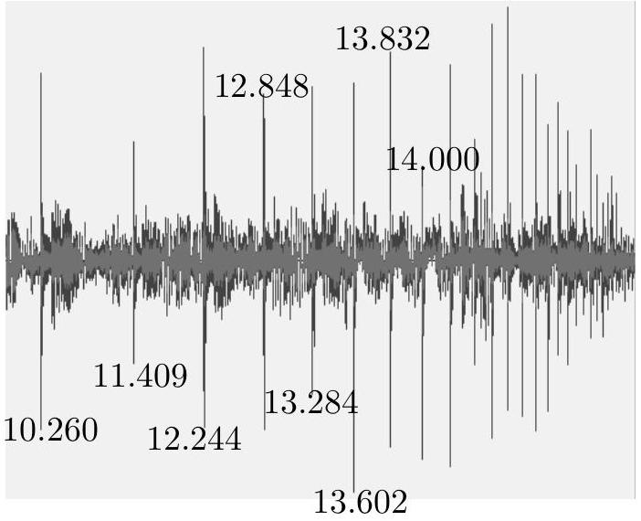

## 1. [6 marks] Dancing on the floor

There are various apps that record the intensity of an audio signal. An app (WaveEditor™ here) displays the audio signal as a wave, whose amplitude is proportional to the audio signal's loudness. A smartphone with this app recording the sound signal is kept on a uniformly built flat floor of a classroom.

A perfectly small spherical steel ball is thrown up such that it almost touches the ceiling and comes back without hitting. The ball hits the floor and thereafter it keeps bouncing. The app records the sound signal produced when the ball hits the floor on every bounce. A screenshot of the recording is shown. The timestamps (in seconds) of the first eight consecutive bounces are also shown next to the peak. For example, the app records a peak at 10.260 s when the first time the ball hits the floor.

Make reasonable assumptions, when the ball hits the floor and calculate the height of the classroom from the given data. State your assumptions clearly.

Solution: The initial height of the peaks seems to be random. This might happen when the ball hits the floor near the phone and some time away from the phone. The time interval between the peaks is reducing, indicating that the ball is colliding inelastically with the floor.
It is also not given when the app started recording the sound. If we take the timestamp of first peak (10.26 s) to be the true time taken for the first bounce, that will give the height of the room to be 131 m which is a nonphysical number for a classroom's height.

Since the ball and the floor both are uniformly shaped objects, we can consider that in each bounce, the ball loses the same amount of energy. Let the height of the room be $h _ { 0 }$. The ball attains the height $h _ { 1 }$, and $h _ { 2 }$ after the first and the second bounce respectively.

$$
\begin{align*}
& \frac { E _ { 0 } } { E _ { 1 } } = \frac { E _ { 1 } } { E _ { 2 } } = \frac { E _ { 2 } } { E _ { 3 } } = \ldots  \tag{1.1}\\
& \Rightarrow \frac { h _ { 0 } } { h _ { 1 } } = \frac { h _ { 1 } } { h _ { 2 } } \tag{1.2}
\end{align*}
$$

Let the time interval between the first and the second bounce be $\Delta t _ { 1 }$ and the time interval between second and the third bounce be and $\Delta t _ { 2 }$. This yields

$$
\begin{equation*}
h _ { 0 } = \frac { h _ { 1 } ^ { 2 } } { h _ { 2 } } \tag{1.3}
\end{equation*}
$$

where

$$
\begin{align*}
& h _ { 1 } = \frac { 1 } { 2 } g \left( \frac { \Delta t _ { 1 } } { 2 } \right) ^ { 2 }  \tag{1.4}\\
& h _ { 2 } = \frac { 1 } { 2 } g \left( \frac { \Delta t _ { 2 } } { 2 } \right) ^ { 2 } \tag{1.5}
\end{align*}
$$

Substituting Eqs. (1.4) and (1.5) in Eq.(1.3), we get

$$
\begin{equation*}
h _ { 0 } = \frac { g } { 8 } \frac { \Delta t _ { 1 } ^ { 4 } } { \Delta t _ { 2 } ^ { 2 } } = 3.06 \mathrm {~m} \tag{1.6}
\end{equation*}
$$

Alternate ways of solving exist. The accepted range of $h _ { 0 }$ is $2.80 \mathrm {~m} - 3.12 \mathrm {~m}$.
