# Indian National Physics Olympiad (INPhO)-2023   HOMI BHABHA CENTRE FOR SCIENCE EDUCATION   Tata Institute of Fundamental Research   V. N. Purav Marg, Mankhurd, Mumbai, 400088

## Solutions

Date: 29 January 2023
Time: 09:00-12:00 (3 hours) Maximum Marks: 60

Instructions Roll No.:

1. This booklet consists of 19 pages and total of 5 questions. Write roll number at the top wherever asked.
2. Booklet to write the answers is provided separately. Instructions to write the answers are on the Answer Booklet.
3. Non-programmable scientific calculators are allowed. Mobile phones cannot be used as calculators.
4. Please submit the Answer Sheet at the end of the examination. You may retain the Question Paper.

Table of Constants
| Speed of light in vacuum | $c$ | $3.00 \times 10 ^ { 8 } \mathrm {~m} \cdot \mathrm {~s} ^ { - 1 }$ |
| :--- | :--- | :--- |
| Planck's constant | $h \hbar$ | $6.63 \times 10 ^ { - 34 } \mathrm {~J} \cdot \mathrm {~s} h / 2 \pi$ |
| Universal constant of Gravitation | G | $6.67 \times 10 ^ { - 11 } \mathrm {~N} \cdot \mathrm {~m} ^ { 2 } \cdot \mathrm {~kg} ^ { - 2 }$ |
| Magnitude of electron charge | $e$ | $1.60 \times 10 ^ { - 19 } \mathrm { C }$ |
| Rest mass of electron | $m _ { e }$ | $9.11 \times 10 ^ { - 31 } \mathrm {~kg}$ |
| Value of $1 / 4 \pi \epsilon _ { 0 }$ |  | $9.00 \times 10 ^ { 9 } \mathrm {~N} \cdot \mathrm {~m} ^ { 2 } \cdot \mathrm { C } ^ { - 2 }$ |
| Avogadro's number | $N _ { A }$ | $6.022 \times 10 ^ { 23 } \mathrm {~mol} ^ { - 1 }$ |
| Acceleration due to gravity | $g$ | $9.81 \mathrm {~m} \cdot \mathrm {~s} ^ { - 2 }$ |
| Universal Gas Constant | $R$ | $8.31 \mathrm {~J} \cdot \mathrm {~K} ^ { - 1 } \cdot \mathrm {~mol} ^ { - 1 }$ |
|  | $R$ | $0.0821 \mathrm { l } \cdot \mathrm { atm } \cdot \mathrm { mol } ^ { - 1 } \cdot \mathrm {~K} ^ { - 1 }$ |
| Boltzmann constant | $K _ { B }$ | $1.3806 \times 10 ^ { - 23 } \mathrm {~J} \cdot \mathrm {~K} ^ { - 1 }$ |
| Permeability constant | $\mu _ { 0 }$ | $4 \pi \times 10 ^ { - 7 } \mathrm { H } \cdot \mathrm { m } ^ { - 1 }$ |
| 1 Angstrom unit | $1 \AA$ | $1 \times 10 ^ { - 10 } \mathrm {~m}$ |
| 1 micro unit | $1 \mu$ | $1 \times 10 ^ { - 6 }$ units |
| 1 electron volt | 1 eV | $1.6 \times 10 ^ { - 19 } \mathrm {~J}$ |

| Q No | 1 | 2 | 3 | 4 | 5 | Total |
| :--- | :--- | :--- | :--- | :--- | :--- | :--- |
| Maximum Marks | 6 | 6 | 16 | 16 | 16 | 60 |

Please note that alternate/equivalent methods and different way of expressing final solutions may exist. A correct method will be suitably awarded.

## 1. [6 marks] Dancing on the floor

There are various apps that record the intensity of an audio signal. An app (WaveEditor™ here) displays the audio signal as a wave, whose amplitude is proportional to the audio signal's loudness. A smartphone with this app recording the sound signal is kept on a uniformly built flat floor of a classroom.

A perfectly small spherical steel ball is thrown up such that it almost touches the ceiling and comes back without hitting. The ball hits the floor and thereafter it keeps bouncing. The app records the sound signal produced when the ball hits the floor on every bounce. A screenshot of the recording is shown. The timestamps (in seconds) of the first eight consecutive bounces are also shown next to the peak. For example, the app records a peak at 10.260 s when the first time the ball hits the floor.

Make reasonable assumptions, when the ball hits the floor and calculate the height of the classroom from the given data. State your assumptions clearly.

Solution: The initial height of the peaks seems to be random. This might happen when the ball hits the floor near the phone and some time away from the phone. The time interval between the peaks is reducing, indicating that the ball is colliding inelastically with the floor.
It is also not given when the app started recording the sound. If we take the timestamp of first peak (10.26 s) to be the true time taken for the first bounce, that will give the height of the room to be 131 m which is a nonphysical number for a classroom's height.

Since the ball and the floor both are uniformly shaped objects, we can consider that in each bounce, the ball loses the same amount of energy. Let the height of the room be $h _ { 0 }$. The ball attains the height $h _ { 1 }$, and $h _ { 2 }$ after the first and the second bounce respectively.

$$
\begin{align*}
& \frac { E _ { 0 } } { E _ { 1 } } = \frac { E _ { 1 } } { E _ { 2 } } = \frac { E _ { 2 } } { E _ { 3 } } = \ldots  \tag{1.1}\\
& \Rightarrow \frac { h _ { 0 } } { h _ { 1 } } = \frac { h _ { 1 } } { h _ { 2 } } \tag{1.2}
\end{align*}
$$

Let the time interval between the first and the second bounce be $\Delta t _ { 1 }$ and the time interval between second and the third bounce be and $\Delta t _ { 2 }$. This yields

$$
\begin{equation*}
h _ { 0 } = \frac { h _ { 1 } ^ { 2 } } { h _ { 2 } } \tag{1.3}
\end{equation*}
$$

where

$$
\begin{align*}
& h _ { 1 } = \frac { 1 } { 2 } g \left( \frac { \Delta t _ { 1 } } { 2 } \right) ^ { 2 }  \tag{1.4}\\
& h _ { 2 } = \frac { 1 } { 2 } g \left( \frac { \Delta t _ { 2 } } { 2 } \right) ^ { 2 } \tag{1.5}
\end{align*}
$$

Substituting Eqs. (1.4) and (1.5) in Eq.(1.3), we get

$$
\begin{equation*}
h _ { 0 } = \frac { g } { 8 } \frac { \Delta t _ { 1 } ^ { 4 } } { \Delta t _ { 2 } ^ { 2 } } = 3.06 \mathrm {~m} \tag{1.6}
\end{equation*}
$$

Alternate ways of solving exist. The accepted range of $h _ { 0 }$ is $2.80 \mathrm {~m} - 3.12 \mathrm {~m}$.
2. Knock it off!

Consider a 100 W small isotropic source of blue light of wavelength $4500 \AA$. A metallic surface of $1.00 \mathrm {~cm} ^ { 2 }$ and work function 2.20 eV is kept at a distance of 1.00 m from the source and oriented to receive normal radiation.

(a) [2 marks] Assume that all the energy is uniformly absorbed by atoms on the top layer of the surface. Also, all the energy absorbed by an atom on the surface is taken up by one electron. The radius of the atom is $1.00 \AA$. Estimate the time $\tau _ { \mathrm { e } }$ needed by the electron to receive 1.00 eV of energy.

Solution:

$$
\begin{gather*}
\frac { P } { 4 \pi R ^ { 2 } } \pi \times r ^ { 2 } \Delta t = 1 \mathrm { eV }  \tag{2.1}\\
\Delta t = \tau = 0.64 \mathrm { sec } \tag{2.2}
\end{gather*}
$$

Time calculated using $4 r ^ { 2 }$ instead of $\pi r ^ { 2 }$ is also credited fully.

(b) [1 marks] According to the above classical model, how many electrons are emitted by the metallic surface in time $\tau _ { \mathrm { e } }$ ?

Solution: None, since the work function is 2.2eV. The electron needs another 1.41sec.

(c) [2 marks] In quantum theory, photons are emitted and absorbed as quanta. Assuming photoelectric efficiency of 1\%, calculate the rate of emission of electrons $\left( N _ { \mathrm { e } } \right)$ from the surface.
Solution: $N _ { e } = 1.8 \times 10 ^ { 13 } \mathrm {~s} ^ { - 1 }$
(d) [1 marks] Assuming further that all the emitted photoelectrons move normal to the surface what would be the maximum current density $\left( J _ { \max } \right)$ one may expect?

Solution:

$$
\text { Current density } J = \frac { N _ { e } e } { A }
$$

where $A$ is the area of metallic surface.

$$
\begin{equation*}
J _ { \max } = 2.88 \times 10 ^ { - 2 } \mathrm { Amp } / \mathrm { m } ^ { 2 } \tag{2.3}
\end{equation*}
$$

## 3. [16 marks] Work in progress

One mole of an ideal monoatomic gas goes through a linear process from A to B as shown in the pressure-volume $( P - V )$ diagram. The temperature at A is $T _ { \mathrm { A } } = 227 ^ { \circ } \mathrm { C }$. The process is such that, the temperature decreases and the heat is continuously supplied to the gas. The ratio of the specific heat at the constant pressure to that at the constant volume is 5/3. Obtain the expression for the maximum work $\left( W _ { \text {max } } \right)$ the gas can perform in such a process. Calculate $W _ { \text {max } }$.
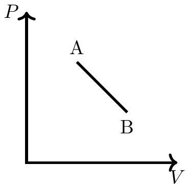

Solution: The variation of $P$ is linear with respect to $V$, hence it can be written as

$$
\begin{equation*}
P = - a V + b \tag{3.1}
\end{equation*}
$$

where $a$ and $b$ are positive constants. At A,

$$
\begin{align*}
P _ { A } V _ { A } & = R T _ { A }  \tag{3.2}\\
\left( - a V _ { A } + b \right) V _ { A } & = R \times 500 \tag{3.3}
\end{align*}
$$

where $T _ { A } = 500 \mathrm {~K}$. Using the ideal gas equation $P V = R T$

$$
\begin{align*}
T & = \frac { P V } { R } = \frac { - a V ^ { 2 } + b V } { R }  \tag{3.4}\\
\frac { d T } { d V } & = \frac { - 2 a V + b } { R } \tag{3.5}
\end{align*}
$$

In this process, $V$ is increasing but the temperature is decreasing, hence

$$
\begin{equation*}
\frac { d T } { d V } \leq 0 \tag{3.6}
\end{equation*}
$$

Using Eq. (3.5)

$$
\begin{align*}
\frac { - 2 a V + b } { R } & \leq 0  \tag{3.7}\\
\Longrightarrow V & \geq \frac { b } { 2 a } \tag{3.8}
\end{align*}
$$

This is the lower bound on the volume. This means if we want work done to be maximum

$$
\begin{equation*}
V _ { \min } = V _ { A } = \frac { b } { 2 a } \tag{3.9}
\end{equation*}
$$

Using the first law of thermodynamics $d Q = d U + P d V$,

$$
\begin{equation*}
d Q = \frac { R } { \gamma - 1 } d T + P d V \tag{3.10}
\end{equation*}
$$

where we use $d U = C _ { V } d T$ and Eq.(3.2), Eq. (3.5), and $\gamma = 5 / 3$ in the above equation yields

$$
\begin{align*}
d Q & = \frac { 3 R ( - 2 a V + b ) d V } { 2 R } + ( - a V + b ) d V  \tag{3.11}\\
\frac { d Q } { d V } & = \left( - 4 a V + \frac { 5 b } { 2 } \right) \tag{3.12}
\end{align*}
$$

In the process, heat is taken and volume is also increasing. hence

$$
\begin{align*}
\frac { d Q } { d V } & \geq 0  \tag{3.13}\\
- 4 a V + \frac { 5 b } { 2 } & \geq 0  \tag{3.14}\\
\Longrightarrow V & \leq \frac { 5 b } { 8 a } \tag{3.15}
\end{align*}
$$

This is the upper bound on the volume. This means if we want work done to be maximum

$$
\begin{equation*}
V _ { \max } = V _ { \mathrm { B } } = \frac { 5 b } { 8 a } \tag{3.16}
\end{equation*}
$$

To get maximum work, The gas must expand from $V _ { A }$ to $V _ { B }$

$$
\begin{align*}
W _ { \max } & = \int _ { V _ { A } } ^ { V _ { B } } P d V = \int _ { V _ { \mathrm { A } } } ^ { V _ { \mathrm { B } } } ( - a V + b ) d V  \tag{3.17}\\
& = \left[ \frac { - a V ^ { 2 } } { 2 } + b V \right] _ { b / 2 a } ^ { 5 b / 8 a } \tag{3.18}
\end{align*}
$$

Substituting the limits, we get,

$$
\begin{equation*}
W _ { \max } = \frac { 7 } { 128 } \frac { b ^ { 2 } } { a } \tag{3.19}
\end{equation*}
$$

Solving $\left( - a V _ { A } + b \right) V _ { A } = 500 R$, we get $\frac { b ^ { 2 } } { a } = 500 \times 4 R$. Substituting this in the above equation, we get,

$$
\begin{equation*}
W _ { \max } \approx 909 \mathrm {~J} \tag{3.20}
\end{equation*}
$$

## 4. Electrostatic TikTok

Consider a fixed infinite vertical thin rod (shown by the red color in the figure below) of linear charge density $\lambda$ along the $z$-axis at the origin (see figure below). A uniformly charged ring of total charge $Q$, mass $M$, and radius $a$ is placed with its center at the origin in the $x - y$ plane. Point P is an arbitrary point on the ring. The projection of point P on $x - y$ plane makes an angle $\theta$ with respect to the $x$-axis in the anticlockwise direction as seen from the top.

The ring is now given an initial angular velocity $\omega _ { 0 }$ about the $x$-axis. We define the angle $\alpha$ which the plane of the ring makes with the $x - y$ plane. This is illustrated by drawing line segment AB in the plane of the ring. Initially $\alpha = 0$. Ignore gravity.
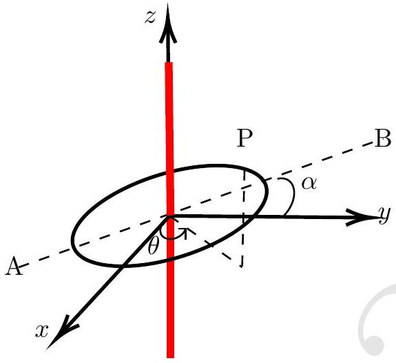
You may find the following differentiation useful

$$
\begin{equation*}
D = \frac { d } { d \theta } \left[ \tan ^ { - 1 } ( q \tan \theta ) \right] = \frac { 1 } { 1 + ( q \tan \theta ) ^ { 2 } } \left[ q \left( \sec ^ { 2 } \theta \right) \right] \tag{4.1}
\end{equation*}
$$

(a) [1 marks] State an expression for the electric field $\left( \vec { E } _ { 0 } \right)$ due to the infinite rod at a point on the ring when $\alpha = 0$ in terms of $x , y$ and $\theta$, and related quantities.
Solution: The electric field on the ring due to the infinite rod is given by
$$
\begin{equation*}
\vec { E } _ { 0 } = \frac { \lambda ( x \hat { x } + y \hat { y } ) } { 2 \pi \epsilon _ { 0 } \left( x ^ { 2 } + y ^ { 2 } \right) } \tag{4.2}
\end{equation*}
$$
Since the rod is infinite, the electric field will not depend on $z$.
$$
\begin{equation*}
\overrightarrow { E _ { 0 } } = \frac { \lambda ( a \cos \theta \hat { x } + a \sin \theta \hat { y } ) } { 2 \pi \epsilon _ { 0 } \left( a ^ { 2 } \cos ^ { 2 } \theta + a ^ { 2 } \sin ^ { 2 } \theta \right) } \tag{4.3}
\end{equation*}
$$
The above expression simplifies to
$$
\begin{equation*}
\vec { E } _ { 0 } = \frac { \lambda ( \cos \theta \hat { x } + \sin \theta \hat { y } ) } { 2 \pi \epsilon _ { 0 } a } \tag{4.4}
\end{equation*}
$$
(b) [2 marks] At some instant the ring makes an angle $\alpha$. Derive an expression for the electric field $\vec { E }$ due to the infinite rod at a point on the ring in terms of $\theta$, and $\alpha$.
Solution: The new coordinates of the ring are
$$
\begin{align*}
x = \frac { a \cos \theta } { \sqrt { 1 + \sin ^ { 2 } \theta \tan ^ { 2 } \alpha } } , y & = \frac { a \sin \theta } { \sqrt { 1 + \sin ^ { 2 } \theta \tan ^ { 2 } \alpha } } \text { and } z = \frac { a \sin \theta \tan \alpha } { \sqrt { 1 + \sin ^ { 2 } \theta \tan ^ { 2 } \alpha } } . \\
\vec { E } & = \frac { \lambda ( x \hat { x } + y \hat { y } ) } { 2 \pi \epsilon _ { 0 } \left( x ^ { 2 } + y ^ { 2 } \right) }  \tag{4.5}\\
& = \frac { \lambda } { 2 \pi \epsilon _ { 0 } a } \sqrt { \left( 1 + \sin ^ { 2 } \theta \tan ^ { 2 } \alpha \right) } ( \cos \theta \hat { x } + \sin \theta \hat { y } ) \tag{4.6}
\end{align*}
$$

(c) [1 marks] Find the net force $\vec { F }$ acting on the ring.
Solution: Charge $d Q$ in elementary length is $\frac { Q } { 2 \pi \cos \alpha } \frac { 1 } { \left( 1 + \sin ^ { 2 } \theta \tan ^ { 2 } \alpha \right) } d \theta$. Force on small element $d s$ is
$$
\begin{equation*}
d \vec { F } = \vec { E } d Q = \frac { \lambda } { 2 \pi \epsilon _ { 0 } a } \sqrt { \left( 1 + \sin ^ { 2 } \theta \tan ^ { 2 } \alpha \right) } ( \cos \theta \hat { x } + \sin \theta \hat { y } ) \frac { Q } { 2 \pi \cos \alpha } \frac { 1 } { \left( 1 + \sin ^ { 2 } \theta \tan ^ { 2 } \alpha \right) } d \theta \tag{4.7}
\end{equation*}
$$
which simplifies to
$$
\begin{equation*}
d \vec { F } = \frac { \lambda Q } { 4 \pi ^ { 2 } \epsilon _ { 0 } a \cos \alpha } \frac { \cos \theta \hat { x } + \sin \theta \hat { y } } { \sqrt { \left( 1 + \sin ^ { 2 } \theta \tan ^ { 2 } \alpha \right) } } \tag{4.8}
\end{equation*}
$$
where $C = \lambda Q / 4 \pi ^ { 2 } \epsilon _ { o } a$. Consider
$$
\begin{align*}
d F _ { x } & = \frac { C } { \cos \alpha } \frac { \cos \theta } { \sqrt { \left( 1 + \sin ^ { 2 } \theta \tan ^ { 2 } \alpha \right) } } d \theta  \tag{4.9}\\
F _ { x } & = \frac { C } { \cos \alpha } \int _ { - \pi } ^ { \pi } \frac { \cos \theta } { \sqrt { \left( 1 + \sin ^ { 2 } \theta \tan ^ { 2 } \alpha \right) } } d \theta \tag{4.10}
\end{align*}
$$
The integrand is an even function, hence
$$
\begin{equation*}
F _ { x } = \frac { 2 C } { \cos \alpha } \int _ { 0 } ^ { \pi } \frac { \cos \theta } { \sqrt { \left( 1 + \sin ^ { 2 } \theta \tan ^ { 2 } \alpha \right) } } d \theta \tag{4.12}
\end{equation*}
$$
using $\int _ { 0 } ^ { 2 a } f ( x ) d x = \int _ { 0 } ^ { a } f ( x ) d x + \int _ { 0 } ^ { a } f ( 2 a - x ) d x$
$$
\begin{equation*}
F _ { x } = \frac { 2 C } { \cos \alpha } \left[ \int _ { 0 } ^ { \pi / 2 } \frac { \cos \theta } { \left( 1 + \sin ^ { 2 } \theta \tan ^ { 2 } \alpha \right) } + \int _ { 0 } ^ { \pi / 2 } \frac { \cos ( \pi - \theta ) } { \left( 1 + \sin ^ { 2 } ( \pi - \theta ) \tan ^ { 2 } \alpha \right) } \right] = 0 \tag{4.14}
\end{equation*}
$$
Similarly
$$
\begin{equation*}
F _ { y } = 0 \tag{4.15}
\end{equation*}
$$
The total force acting on the ring is zero. Answers based on symmetric arguments will be also given credit.
(d) [5 marks] Find the net torque $\vec { \tau }$ acting on the ring in terms of $\alpha$ and the constants only. Qualitatively plot torque as a function of $\alpha$.

Solution:

$$
\begin{equation*}
d \tau = \vec { r } \times d \vec { F } ( \theta ) \tag{4.16}
\end{equation*}
$$

Consider

$$
\begin{align*}
d \tau _ { z } & = x d F _ { y } - y d F _ { x }  \tag{4.17}\\
& = 0  \tag{4.18}\\
\Longrightarrow \tau _ { z } & = 0  \tag{4.19}\\
\tau _ { y } = \int _ { - \pi } ^ { \pi } z d F _ { x } \tau _ { y } & = \frac { a C \tan \alpha } { 2 \cos \alpha } \int _ { - \pi } ^ { \pi } \frac { \sin 2 \theta } { \left( 1 + \sin ^ { 2 } \theta \tan ^ { 2 } \alpha \right) } \tag{4.20}
\end{align*}
$$

Integrand is odd function, hence

$$
\begin{equation*}
\tau _ { y } = 0 \tag{4.21}
\end{equation*}
$$

$$
\begin{align*}
& \tau _ { x } = \int _ { - \pi } ^ { \pi } - z d F _ { y }  \tag{4.22}\\
& \tau _ { x } = - \int _ { - \pi } ^ { \pi } \frac { a \sin \theta \tan \alpha } { \sqrt { 1 + \sin ^ { 2 } \theta \tan ^ { 2 } \alpha } } \frac { C \sin \theta } { \cos \alpha \left( 1 + \sin ^ { 2 } \theta \tan ^ { 2 } \theta \right) } \tag{4.23}
\end{align*}
$$

which simplifies to

$$
\begin{equation*}
\tau _ { x } = - a C \int _ { - \pi } ^ { \pi } \frac { \tan ^ { 2 } \theta \sin \alpha } { \left( \cos ^ { 2 } \alpha + \tan ^ { 2 } \theta \right) } d \theta \tag{4.24}
\end{equation*}
$$

The integrand is an even function, hence

$$
\begin{equation*}
\tau _ { x } = - 2 a C \sin \alpha \int _ { 0 } ^ { \pi } \frac { \tan ^ { 2 } \theta } { \left( \cos ^ { 2 } \alpha + \tan ^ { 2 } \theta \right) } d \theta \tag{4.25}
\end{equation*}
$$

using $\int _ { 0 } ^ { 2 a } f ( x ) d x = \int _ { 0 } ^ { a } f ( x ) d x + \int _ { 0 } ^ { a } f ( 2 a - x ) d x$

$$
\begin{align*}
& \tau _ { x } = - 4 a C \sin \alpha \int _ { 0 } ^ { \pi / 2 } \frac { \tan ^ { 2 } \theta } { \left( \cos ^ { 2 } \alpha + \tan ^ { 2 } \theta \right) } d \theta  \tag{4.26}\\
& \tau _ { x } = - 4 a C \sin \alpha \sec ^ { 2 } \alpha \int _ { 0 } ^ { \pi / 2 } \frac { \tan ^ { 2 } \theta } { \left( 1 + \sec ^ { 2 } \alpha \tan ^ { 2 } \theta \right) } d \theta \tag{4.27}
\end{align*}
$$

Substituting $\sec \alpha = u$, in above equation, we get

$$
\begin{equation*}
\tau _ { x } = - 4 a C \sin \alpha u ^ { 2 } \int _ { 0 } ^ { \pi / 2 } \frac { \tan ^ { 2 } \theta } { \left( 1 + u ^ { 2 } \tan ^ { 2 } \theta \right) } d \theta \tag{4.28}
\end{equation*}
$$

It is given that

$$
\begin{align*}
D & = \frac { d } { d \theta } \left( \tan ^ { - 1 } ( u \tan \theta ) \right) = \frac { u \sec ^ { 2 } \theta } { 1 + u ^ { 2 } \tan ^ { 2 } \theta }  \tag{4.29}\\
& = \frac { u \left( 1 + \tan ^ { 2 } \theta \right) } { 1 + u ^ { 2 } \tan ^ { 2 } \theta }  \tag{4.30}\\
D & = \frac { u } { 1 + u ^ { 2 } \tan ^ { 2 } \theta } + \frac { u \tan ^ { 2 } \theta } { 1 + u ^ { 2 } \tan ^ { 2 } \theta } + u - u \frac { 1 + u ^ { 2 } \tan ^ { 2 } \theta } { 1 + u ^ { 2 } \tan ^ { 2 } \theta } \tag{4.31}
\end{align*}
$$

Solving above equation, we get

$$
\begin{equation*}
\frac { \tan ^ { 2 } \theta } { 1 + u ^ { 2 } \tan ^ { 2 } \theta } = \frac { D } { u - u ^ { 3 } } - \frac { 1 } { 1 - u ^ { 2 } } \tag{4.32}
\end{equation*}
$$

Hence Substituting above equation in Eq.(4.28) , we get

$$
\begin{align*}
\tau _ { x } & = - 4 C a \sin \alpha u ^ { 2 } \int _ { 0 } ^ { \pi / 2 } \left[ \frac { D } { u - u ^ { 3 } } - \frac { 1 } { 1 - u ^ { 2 } } \right] d \theta  \tag{4.33}\\
\tau _ { x } & = - 4 C a \sin \alpha u ^ { 2 } \int _ { 0 } ^ { \pi / 2 } \left[ \frac { D } { u - u ^ { 3 } } - \frac { 1 } { 1 - u ^ { 2 } } \right] d \theta \tag{4.34}
\end{align*}
$$

Substituting value of D, we get

$$
\begin{gather*}
\tau _ { x } = - 4 C a \sin \alpha u ^ { 2 } \int _ { 0 } ^ { \pi / 2 } \left[ \frac { \frac { d } { d \theta } \left( \tan ^ { - 1 } ( u \tan \theta ) \right) } { u - u ^ { 3 } } - \frac { 1 } { 1 - u ^ { 2 } } \right] d \theta  \tag{4.35}\\
\tau _ { x } = - 4 C a \sin \alpha u ^ { 2 } \left[ \frac { \tan ^ { - 1 } ( u \tan \theta ) } { u - u ^ { 3 } } - \frac { \theta } { 1 - u ^ { 2 } } \right] _ { 0 } ^ { \pi / 2 } \tag{4.36}
\end{gather*}
$$

Applying limits and solving further, we get

$$
\begin{equation*}
\tau _ { x } = - \frac { \lambda Q } { 2 \pi \epsilon _ { 0 } } \tan ( \alpha / 2 ) \tag{4.38}
\end{equation*}
$$

Working of $\tau _ { y } , \tau _ { z }$ is not required.
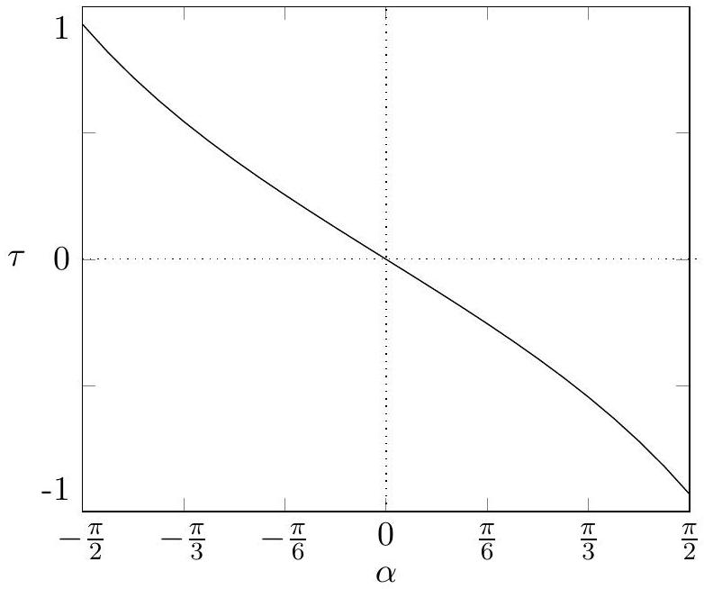

(e) [2 marks] Let the ring is in equilibrium with respect to $\alpha = 0$. Derive an expression for the time period $T$ of small oscillations of the ring in terms of $\lambda$, and $Q$. Take $\lambda = 0.1 \mu \mathrm { C } / \mathrm { m } , Q = 2.0 \mu \mathrm { C }$, $M = 50.0 \mathrm {~g}$, radius $a = 5.0 \mathrm {~cm}$, and $\omega _ { 0 } = 1.0 \mathrm { rad } / \mathrm { s }$. Calculate $T$.

Solution: Under small angle approximation of $\alpha , \tau _ { x }$ becomes

$$
\begin{align*}
\tau _ { x } & = \frac { - \lambda Q \alpha } { 4 \pi \epsilon _ { 0 } }  \tag{4.39}\\
I \frac { d ^ { 2 } \alpha } { d t ^ { 2 } } & = \frac { - \lambda Q \alpha } { 4 \pi \epsilon _ { 0 } }  \tag{4.40}\\
\frac { M a ^ { 2 } } { 2 } \frac { d ^ { 2 } \alpha } { d t ^ { 2 } } & = \frac { - \lambda Q \alpha } { 4 \pi \epsilon _ { 0 } }  \tag{4.41}\\
\frac { d ^ { 2 } \alpha } { d t ^ { 2 } } & = - \frac { 2 \lambda Q } { 4 M a ^ { 2 } \pi \epsilon _ { 0 } } \alpha \tag{4.42}
\end{align*}
$$

This is a differential equation of SHM, hence

$$
\begin{align*}
T ^ { 2 } & = \frac { 4 \pi ^ { 2 } } { \frac { 2 \lambda Q } { 4 M a ^ { 2 } \pi \epsilon _ { 0 } } }  \tag{4.43}\\
\Longrightarrow T & = 2 \pi a \sqrt { \frac { 2 M \pi \epsilon _ { 0 } } { Q \lambda } }  \tag{4.44}\\
T & = 1.17 \mathrm {~s} \tag{4.45}
\end{align*}
$$

This can be used as an electrostatic clock!

(f) [2.5 marks] Find an expression for the potential energy $U$ of the ring in terms of $\alpha$. Qualitatively plot $U$ as a function of $\alpha$. Take the zero of potential energy to be at $\alpha = 0$.

Solution: We know that $\tau = - \frac { d U } { d \alpha }$

$$
\begin{align*}
\Longrightarrow U & = - \int \tau d \alpha  \tag{4.46}\\
& = \frac { \lambda Q } { 2 \pi \epsilon _ { 0 } } \int \tan ( \alpha / 2 ) d \alpha  \tag{4.47}\\
U & = - \frac { \lambda Q } { 2 \pi \epsilon _ { 0 } } 2 \log ( \cos ( \alpha / 2 ) ) + c \tag{4.48}
\end{align*}
$$

where $c$ is the constant of integration. At $\alpha = 0 , U = 0$, which implies that $c = 0$.

$$
\begin{equation*}
\Longrightarrow U ( \alpha ) = - \frac { \lambda Q } { \pi \epsilon _ { 0 } } \log ( \cos ( \alpha / 2 ) ) \tag{4.49}
\end{equation*}
$$

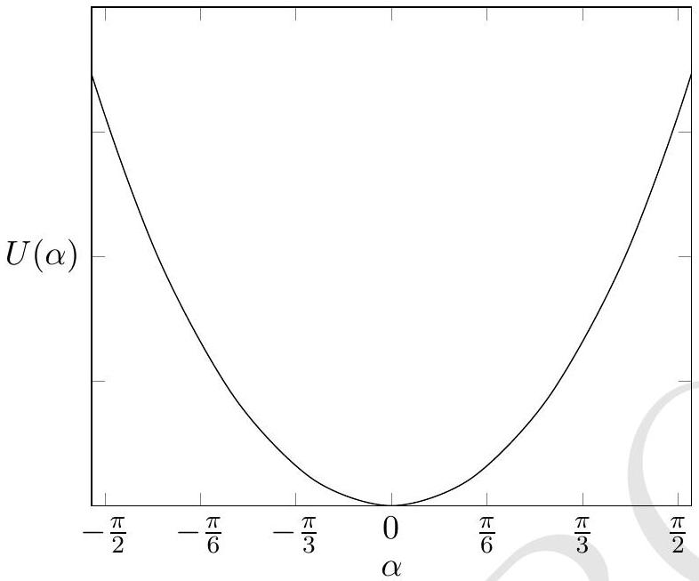

(g) [2.5 marks] Obtain the expression of maximum value of $\alpha \left( \alpha _ { \text {max } } \right)$ in terms of $\omega _ { 0 }$. Calculate $\alpha _ { \text {max } }$.

Solution: Consider

$$
\begin{array} { r }
I \frac { d ^ { 2 } \alpha } { d t ^ { 2 } } = \tau _ { x } \\
\frac { M a ^ { 2 } } { 2 } \frac { d ^ { 2 } \alpha } { d t ^ { 2 } } = \frac { - \lambda Q } { 2 \pi \epsilon _ { 0 } } \tan ( \alpha / 2 ) \tag{4.51}
\end{array}
$$

Multiplying both sides by $\frac { d \alpha } { d t }$

$$
\begin{equation*}
\frac { M a ^ { 2 } } { 2 } \frac { d ^ { 2 } \alpha } { d t ^ { 2 } } \frac { d \alpha } { d t } = \frac { - \lambda Q } { 2 \pi \epsilon _ { 0 } } \tan ( \alpha / 2 ) \frac { d \alpha } { d t } \tag{4.52}
\end{equation*}
$$

Integrating on both sides

$$
\begin{align*}
\frac { M a ^ { 2 } } { 4 } \left( \frac { d \alpha } { d t } \right) ^ { 2 } & = \frac { \lambda Q } { \pi \epsilon _ { 0 } } \log ( \cos ( \alpha / 2 ) ) + c ^ { \prime }  \tag{4.53}\\
\left( \frac { d \alpha } { d t } \right) ^ { 2 } & = \frac { 32 \pi ^ { 2 } } { T ^ { 2 } } \log ( \cos ( \alpha / 2 ) ) + c ^ { \prime } \tag{4.54}
\end{align*}
$$

where $c ^ { \prime }$ is the constant of integration. At $t = 0 , \frac { d \alpha } { d t } = \omega _ { 0 }$, which implies that $c = \omega _ { 0 } ^ { 2 }$.

$$
\begin{align*}
\left( \frac { d \alpha } { d t } \right) ^ { 2 } & = \frac { 32 \pi ^ { 2 } } { T ^ { 2 } } \log ( \cos ( \alpha / 2 ) ) + \omega _ { 0 } ^ { 2 }  \tag{4.55}\\
\frac { d \alpha } { d t } & = \sqrt { \frac { 32 \pi ^ { 2 } } { T ^ { 2 } } \log ( \cos ( \alpha / 2 ) ) + \omega _ { 0 } ^ { 2 } } \tag{4.56}
\end{align*}
$$

For $\alpha = \alpha _ { \text {max } } , \frac { d \alpha } { a t } = 0$, hence solving above equation, we get

$$
\begin{align*}
& \alpha _ { \max } = 2 \left[ \cos ^ { - 1 } \left( \exp \left( - \frac { \omega _ { 0 } ^ { 2 } T ^ { 2 } } { 32 \pi ^ { 2 } } \right) \right) \right]  \tag{4.57}\\
& \alpha _ { \max } = 10.66 ^ { \circ } \tag{4.58}
\end{align*}
$$

## 5. If Prof. Snell had a smartphone

A typical smartphone screen is made up of mainly two components: a sheet of touch-sensitive glass (where you move your finger to operate the phone) of thickness $t$ at the top and a LCD screen below it consisting of a regular array of "RGB elements" that emit light. These elements have a separation of $d$ between them. There is a thin air gap of depth $h$ between the touch-sensitive glass and the LCD screen (see Fig. (1)for a cross sectional view). We

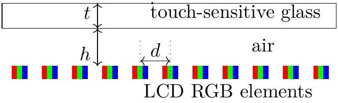
Figure 1

estimate the value of $h$ from the following experiment.
We use two smartphones (S-I and S-II) in this exercise - S-I is the target instrument in which we want to estimate $h$, and S-II is the measuring instrument that can capture photos of the screen of S-I which we then analyse using a image-processing software.

A digital image captured by the camera of a smartphone (S-II here) consists of discrete picture elements called pixels. The image captured by S-II is processed through a software. A red color reference line is drawn on the image (see Fig. 3(a)). The software plots the "brightness value" at every point of the reference line as a function of the number of pixels from the left end of the line. Thus, pixel number is a marker for distance here. First, we need to calibrate distance in terms of pixel number.

The phone S-I is kept horizontal and the display is kept ON. A ruler is placed on its screen. S-II is fixed above S-I to capture images. The image of the screen captured is shown in Fig (2).

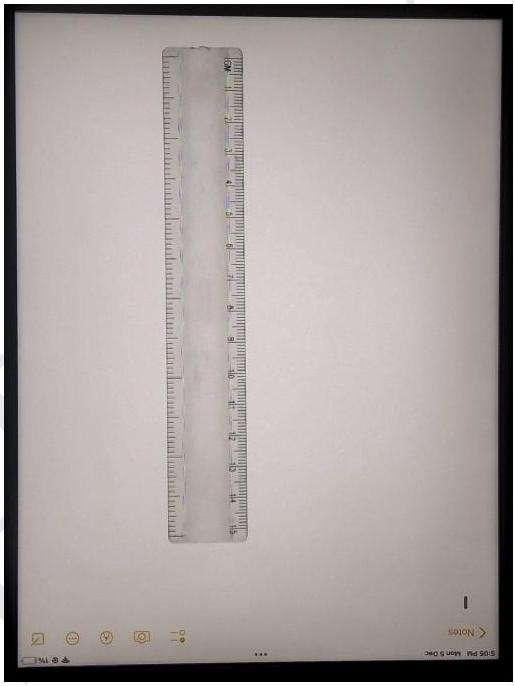
Figure 2

Figure 3(a) shows a part of the image of the ruler and its brightness value profile along the red reference line in Fig. 3(b).

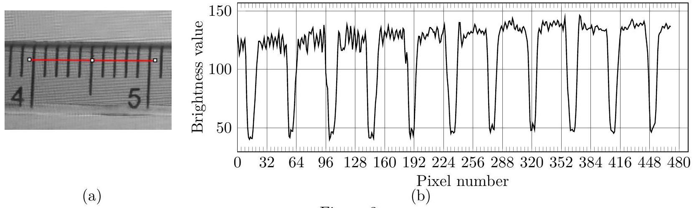
Figure 3

(a) [2 marks] State the number of pixels used by the camera of S-II to capture one centimeter of the screen of S-I.
Solution:
Wherever there is a black color comes into the picture, the brightness value profile will show a dip. There is a dip at pixel number 12 that refers to the 4 cm marker of the ruler. Similarly, the brightness value dip at pixel number 452 is for the 5 cm marker of the scale. Hence the number of pixels present in 1cm of the image is 440. We denote the value $\theta = 1 / 440$ to be the scaling factor to convert the measurements obtained in pixels to the centimeter scale.
Accepted answer range : 432-448 pixels.
(b) [5 marks] We keep the setup the same as the last part. Next, a few small water drops are placed on the glass screen of S-I beside the ruler (see Figs. 4(a) and 4(b) for a top and side view, respectively). We model every drop as a hemispherical lens of radius $R$ that magnifies the array of RGB elements of the LCD screen of S-I (see Fig. 4(c); the figure is not to scale).

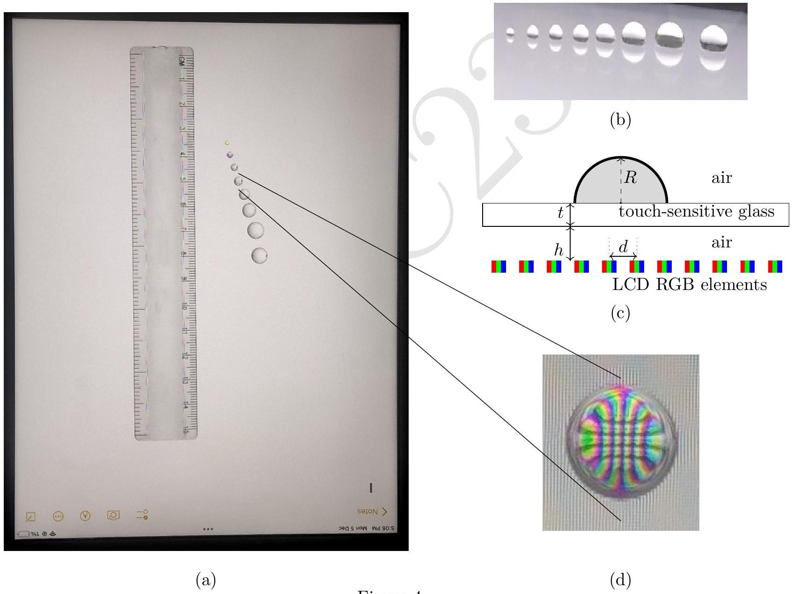
Figure 4

Figure 4(d) shows the magnified image of the array of the RGB elements of the screen as viewed from the top through one of the drops. This image is captured by S-II keeping the camera settings and distance same as in the previous part. The brightness value profiles of the images of the five chosen drops along the reference lines are shown in Fig. (5) on the next page.
Using the profile plots, write the radius of the water drop ( $R$ in mm) and the corresponding magnification $( M )$ of the separation $d$ between the array of RGB elements of S-I for each waterdrop lens. Use the table in the Summary Answer sheet to report your data. Describe the method you have used and the calculations in the Detailed Answer sheet.

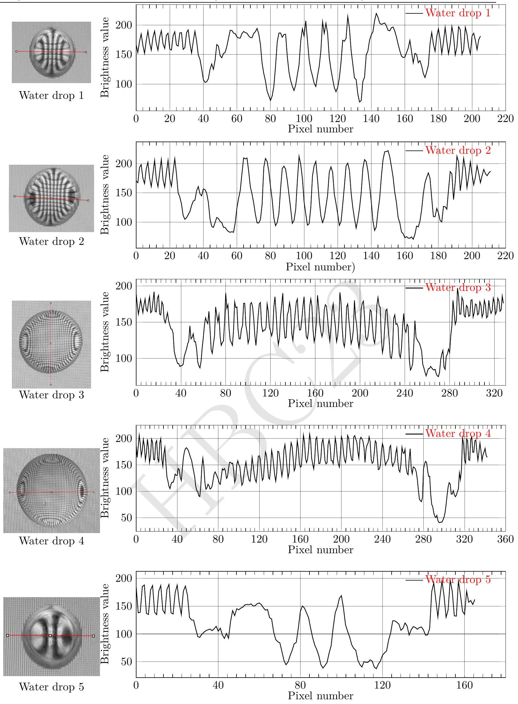
Figure 5: Question of part (b)

Solution: The red line is drawn beyond the waterdrops' diameters. In each brightness value profile, there are three distinct regions present. Reading from the left, a closely packed peaks,

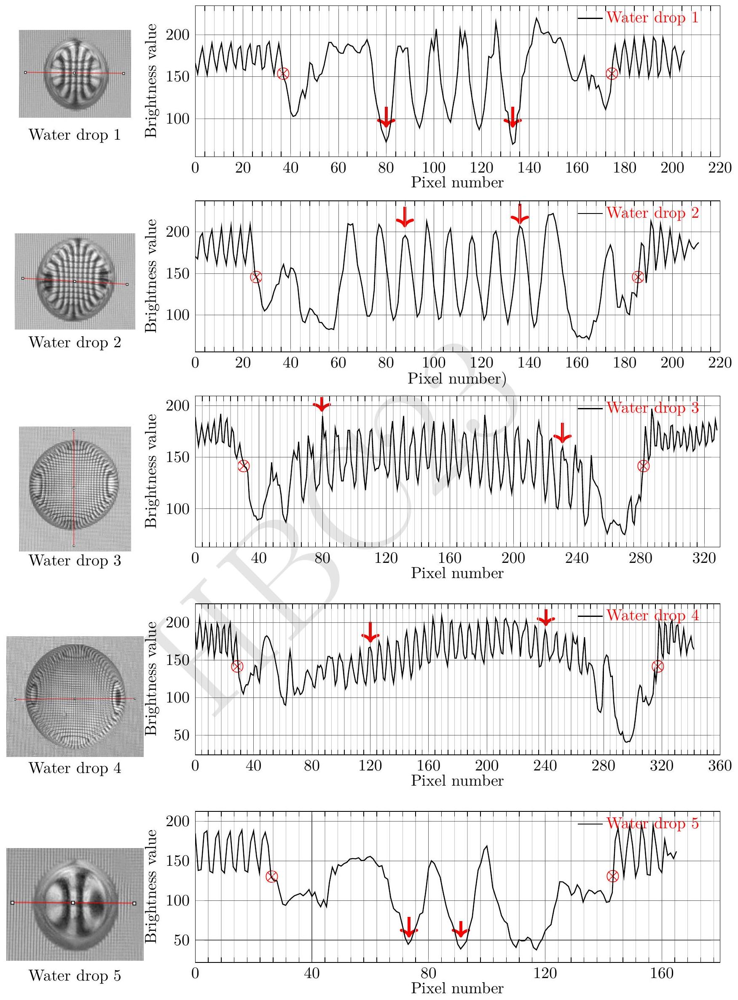
Figure 6: Solution of part (b)

then the central region where the peaks are dispersed and the right side to the central region is again a closely packed peaks. The right and left regions are the plots of the smartphone S-I's screen without the waterdrop lens. The distance $d$ between each peak in these regions refers to the distance between the RGB elements of S-I. Note that $d$ for each picture will be the same since all the images are extracted from one single image Fig. (4a).
The magnified distance $D$ will be different for the drops, depending on the radius $R$. The central region is the magnified plot of the smartphone S-I screen seen through the waterdrop. The distance $D$ between the two peaks in the central region is the magnified distance between S-I's RGB elements. The magnfication is $D / d$. For accuracy, we will count the $n$ number of peaks for a distance and then divide the distance by $n$. The exact locations we have used on the plots to calculate $D$ are indicated by a red color arrow ↓ (see Fig. (6)).
For each drop, we identify the pixel number which separates the waterdrop region. The distance along this region will be the diameter of the drop. Alternatively, you can also measure the length of the region with a physical ruler and then convert it into a pixel number. The boundary points of the waterdrop regions which we have used on the plots to calculate $R$ are indicated by a red color symbol ⊗ (see Fig. (6)).
Every time we obtain the distance from the graph in terms of the pixel number, we multiply it by the scaling factor $\theta$ (obtained in part (a)) to convert it to the centimeter scale.

| No. | Drop region |  | * $R$ (cm) | Magnified distance |  |  |  |
| :--- | :--- | :--- | :--- | :--- | :--- | :--- | :--- |
|  | Start pixel | End pixel |  | $n$ | Distance |  | ** $D$ (cm) |
|  |  |  |  |  | Start pixel | End pixel |  |
| 1 | 36 | 172 | 0.155 | 4 | 80 | 132 | 0.030 |
| 2 | 24 | 184 | 0.182 | 5 | 88 | 136 | 0.022 |
| 3 | 31.11 | 280 | 0.283 | 22 | 80 | 231.11 | 0.016 |
| 4 | 31.11 | 315.56 | 0.323 | 19 | 120 | 240 | 0.014 |
| 5 | 26.67 | 142.22 | 0.131 | 1 | 71.11 | 88.89 | 0.040 |

Here

$$
\begin{aligned}
* R ( \mathrm {~cm} ) & = \frac { \text { End pixel } - \text { Start pixel } } { 2 } \theta \\
* * D ( \mathrm {~cm} ) & = \frac { \text { End pixel } - \text { Start pixel } } { n } \theta
\end{aligned}
$$

and $n$ is the number of peaks (or dips) counted.
The original distance $d$ (unmagnified) between the RGB elements can be obtained by counting the dips in the left or right regions of any of the graphs. See the right side region of the water drop 1 graph, there are six peaks in 20 pixel numbers of the image, i.e. total of five RGB elements in 20 pixel numbers. Thus

$$
\begin{align*}
d & = \frac { 20 } { 5 } \theta  \tag{5.1}\\
& = \frac { 1 } { 110 } \mathrm {~cm} \tag{5.2}
\end{align*}
$$

Interesting fact for the readers: RGB elements are nothing but the "pixels" inside S-I which you use to define the quality of a screen. When you refer to PPI (pixel per inch) of a phone, you are indicating the number of $R G B$ elements in an inch of the screen display. We used ipad 8th generation as the S-I. Apple website gives PPI (pixel per inch) for the iPad to be 264 (https://support.apple.com/kb/SP822). The value of $d$ obtained gives the PPI value to be ~279 PPI. Not a bad answer for an amateur setup!

Data table for the Summary answer sheet:

| Water drop | $R ( \mathrm {~cm} )$ | $M = D / d$ |
| :--- | :--- | :--- |
| 1 | 0.155 | 3.25 |
| 2 | 0.182 | 2.40 |
| 3 | 0.283 | 1.72 |
| 4 | 0.328 | 1.58 |
| 5 | 0.131 | 4.44 |

Final values within five percent of the official answers will be credited fully.

(c) [9 marks] For the given smartphone, $t = 0.50 \mathrm {~mm}$, the refractive indices of the touch-sensitive glass, water drop, and the air to be 3/2, 4/3, and 1 respectively. Using the data table of the previous part, plot a suitable linear graph to obtain the distance $( h )$ of the RGB elements from the touch-sensitive glass. Use the table given in the summary answer sheet to enter the data used to plot the graph. Show your detailed theoretical calculation in the Detailed Answer sheet.
Solution: We use the standard results for the reflection formula from a spherical surface.
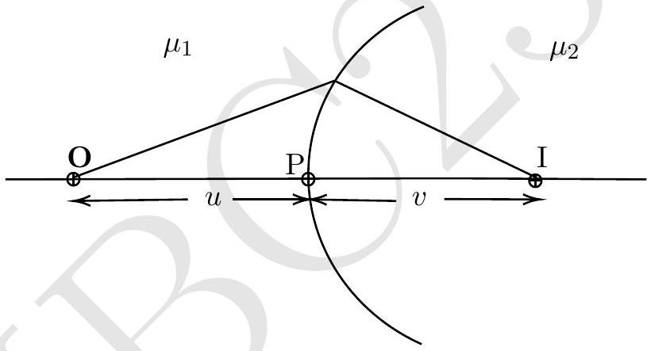
$$
\begin{equation*}
\frac { \mu _ { 2 } } { v } - \frac { \mu _ { 1 } } { u } = \frac { \mu _ { 2 } - \mu _ { 1 } } { R } \tag{5.3}
\end{equation*}
$$
$$
\begin{equation*}
\text { Magnification } M = \frac { I } { O } = \frac { \mu _ { 1 } } { \mu _ { 2 } } \frac { v } { u } \tag{5.4}
\end{equation*}
$$
Here the symbols have their usual meanings. The sign will be adjusted accordingly. There is refraction occurring at the three surfaces.
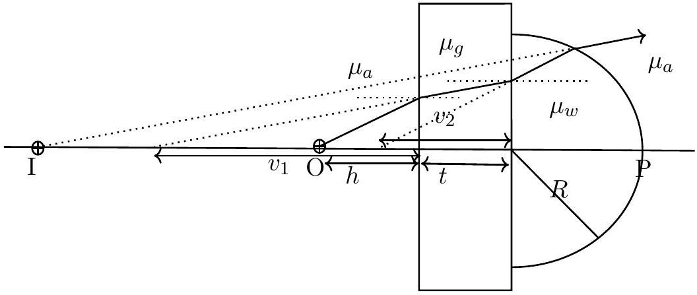
The first refraction is at the air-glass interface. Using $\mu _ { 1 } = \mu _ { a } , \mu _ { 2 } = \mu _ { g } , R = \infty$ in the Eq.(5.3)
$$
\begin{array} { r }
\frac { \mu _ { g } } { v _ { 1 } } - \frac { \mu _ { a } } { - h } = 0 \\
v _ { 1 } = - \mu _ { g } h \tag{5.6}
\end{array}
$$

The second refraction is at the glass-water interface. Now $u _ { 2 } = \left| v _ { 1 } \right| + t$. This gives

$$
\begin{array} { r }
\frac { \mu _ { w } } { v _ { 2 } } - \frac { \mu _ { g } } { - u _ { 2 } } = 0 \\
v _ { 2 } = - \left( \mu _ { g } h + t \right) \frac { \mu _ { w } } { \mu _ { g } } \tag{5.8}
\end{array}
$$

The third refraction is at the water-air interface. Now $u _ { 3 } = \left| v _ { 2 } \right| + R$ gives

$$
\begin{equation*}
\frac { \mu _ { a } } { v _ { 3 } } - \frac { \mu _ { w } } { - u _ { 3 } } = \frac { \mu _ { a } - \mu _ { w } } { - R } \tag{5.9}
\end{equation*}
$$

Magnification will only be from the third interface.

$$
\begin{equation*}
M = \frac { \mu _ { w } } { \mu _ { a } } \frac { v _ { 3 } } { u _ { 3 } } \tag{5.10}
\end{equation*}
$$

Using $\mu _ { g } = 3 / 2 , \mu _ { w } = 4 / 3$, and $\mu _ { a } = 1$ in the Eqs. (5.9 and 5.10) yields

$$
\begin{equation*}
\frac { 1 } { M } = \frac { 3 } { 4 } - \frac { 1 } { 3 R } \left( h + \frac { 2 t } { 3 } \right) \tag{5.11}
\end{equation*}
$$

A graph of $1 / M$ vs $1 / 3 R$ will be linear. The graph is plotted on the next page. For the obtained data set
Slope $= 2.67 \mathrm {~mm}$ which gives $h = 2.34 \mathrm {~mm}$.
Accepted answer range: $( 2.34 \pm 5 \% ) \mathrm { mm }$.

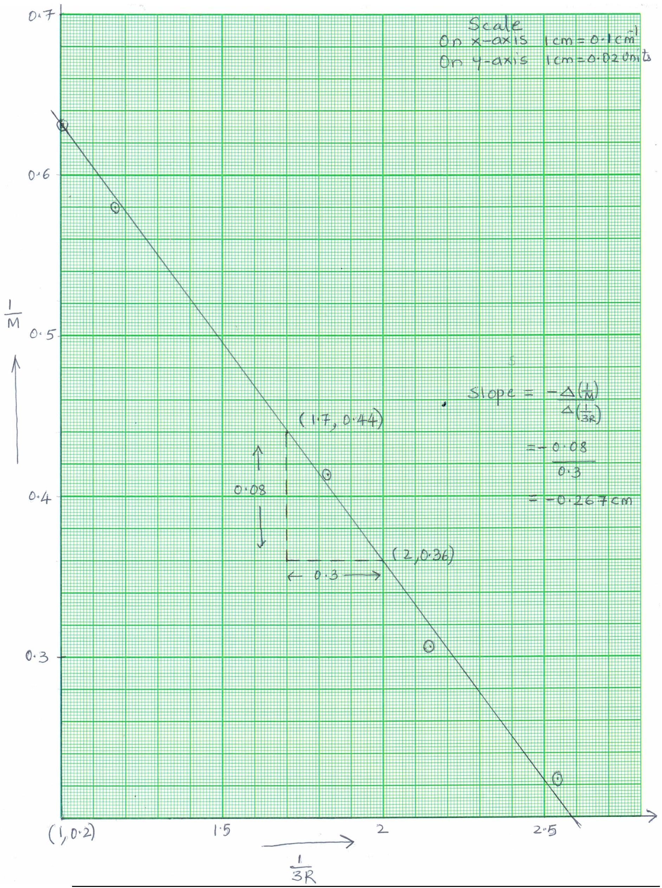
