2. Booklet to write the answers is provided separately. Instructions to write the answers are on the Answer Booklet.
3. Non-programmable scientific calculators are allowed. Mobile phones cannot be used as calculators.
4. Please submit the Answer Sheet at the end of the examination. You may retain the Question Paper.

Table of Constants
| Universal constant of Gravitation | G | $6.67 \times 10 ^ { - 11 } \mathrm {~N} \cdot \mathrm {~m} ^ { 2 } \cdot \mathrm {~kg} ^ { - 2 }$ |
| :--- | :--- | :--- |
| Value of $1 / 4 \pi \epsilon _ { 0 }$ |  | $9.00 \times 10 ^ { 9 } \mathrm {~N} \cdot \mathrm {~m} ^ { 2 } \cdot \mathrm { C } ^ { - 2 }$ |
| Avogadro's number | $N _ { A }$ | $6.022 \times 10 ^ { 23 } \mathrm {~mol} ^ { - 1 }$ |
| Acceleration due to gravity | $g$ | $9.81 \mathrm {~m} \cdot \mathrm {~s} ^ { - 2 }$ |
| Universal Gas Constant | $R$ | $8.31 \mathrm {~J} \cdot \mathrm {~K} ^ { - 1 } \cdot \mathrm {~mol} ^ { - 1 }$ |
|  | R | $0.0821 \mathrm { l } \cdot \mathrm { atm } \cdot \mathrm { mol } ^ { - 1 } \cdot \mathrm {~K} ^ { - 1 }$ |
| Molar mass of Helium |  | $4.003 \mathrm {~g} \cdot \mathrm {~mol} ^ { - 1 }$ |
| Boltzmann constant | $k _ { B }$ | $1.3806 \times 10 ^ { - 23 } \mathrm {~J} \cdot \mathrm {~K} ^ { - 1 }$ |
| Earth's radius | $R _ { E }$ | 6371km |
| Earth's mass | $M _ { E }$ | $5.97 \times 10 ^ { 24 } \mathrm {~kg}$ |
| Moon's mass | $M _ { M }$ | $7.35 \times 10 ^ { 22 } \mathrm {~kg}$ |
| Moon's radius | $R _ { M }$ | 1737km |

| Question Number | 1 | 2 | 3 | 4 | 5 | 6 | Total |
| :--- | :--- | :--- | :--- | :--- | :--- | :--- | :--- |
| Maximum Marks | 8 | 18 | 14 | 11 | 18 | 11 | 80 |

1. [8 marks] An electrifying experiment
Professor Coulomb was investigating how the magnitude of the force $( | \vec { F } | )$ between two charged spheres depends on the distance between their centres. He conducted four separate experiments by placing two identical conducting spheres 1 and 2, each of radius $a$, at different distances $d$ from each other. The experiments are outlined in the table below. Here $Q _ { 1 }$ and $Q _ { 2 }$ are the charges on the spheres 1 and 2, respectively. The measurement results are presented in the graph.

| Experiment no. | $a ( \mathrm {~m} )$ | $Q _ { 1 }$ | $Q _ { 2 }$ |
| :--- | :--- | :--- | :--- |
| 1 | 0.10 | $+ Q$ | $+ Q$ |
| 2 | 0.10 | $+ Q$ | $- Q$ |
| 3 | 0.05 | $+ Q$ | $+ Q$ |
| 4 | 0.05 | $+ Q$ | $- Q$ |

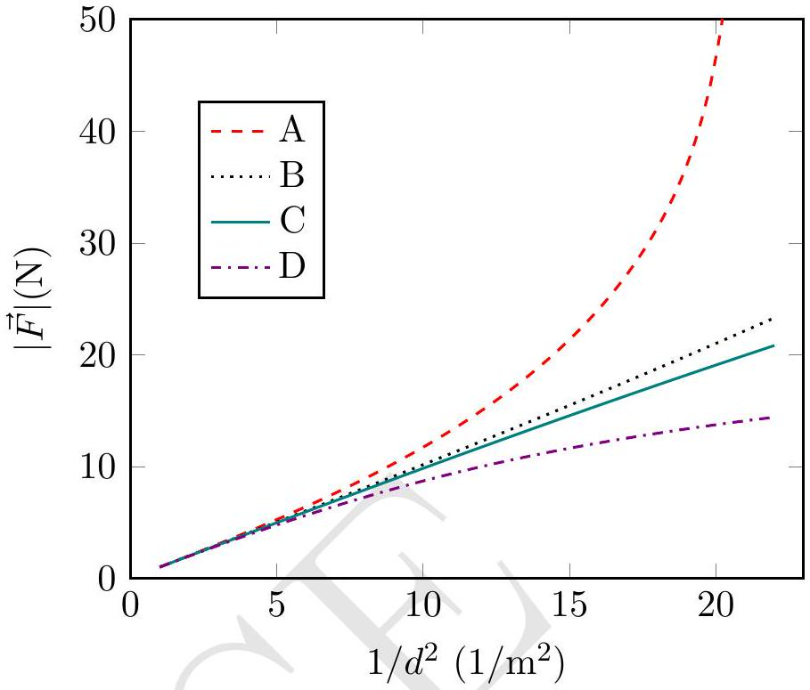
Figure out which measurement (A, B, C, D) belongs to which experiment (1, 2, 3, 4). Explain your answers in the detailed answersheet. You may draw diagrams, if necessary.

Solution: Here conducting spheres exhibit polarization when brought close, impacting the effective distance between charges. For two positively charged spheres at a distance $d$ from their centers, polarization increases the effective distance, reducing the force. Similarly, for a positively and a negatively charged sphere, also at distance $d$ from their centers, polarization decreases the effective distance and increases the force. The order of effective distances in the four experiments is $d _ { 1 } ^ { \text {eff } } > d _ { 3 } ^ { \text {eff } } > d _ { 4 } ^ { \text {eff } } > d _ { 2 } ^ { \text {eff } }$. This is depicted in the figure below.
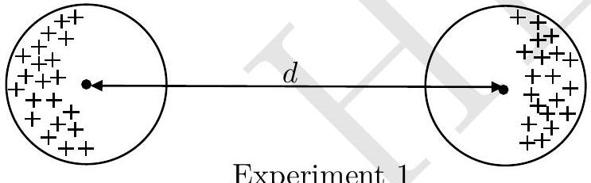
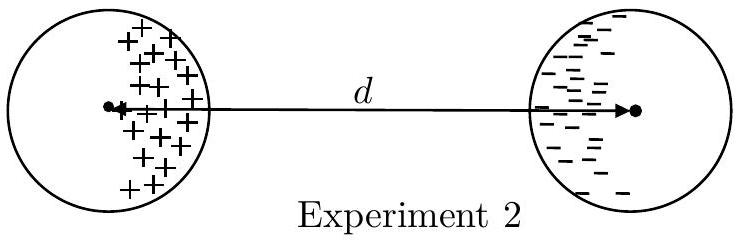

The correct choices will be:
Experiment 1: D
Experiment 2: A
Experiment 3: C
Experiment 4: B

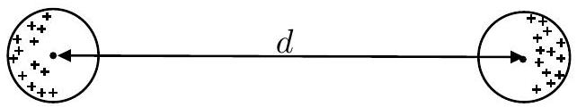
Experiment 3

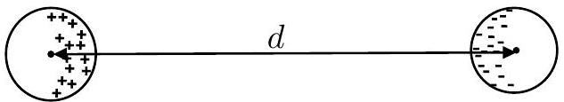
Experiment 4

2. A Potpourri of Prism Problems
(a) [7 marks] In the most common method to determine the angle of minimum deviation by a prism, we record the angles of deviation $( \delta )$ for various angles of incidence $( i )$ and then plot a graph. However, Professor Joseph proposed an ingenious idea to determine the angle of minimum deviation with just a single angle of incidence. Eager to share his breakthrough, he penned a letter to his friend, Professor Amal Nathan, outlining his method for an equilateral prism. According to Professor Joseph, the only tools required were four pins, a board, a marker pen or pencil, a scale, a protractor, and, of course, the prism. He even claimed that one may not need all the materials listed.
In his letter, Professor Joseph began to sketch a figure to illustrate the method. Here triangle ABC is the trace of the prism. The dashed curve is an arc of a circle centered at A. The dotted circles are centered on the points of intersection of the arc with the sides of the triangle. Unfortunately, he forgot to complete the figure. Can you describe the experimental method to determine the angle of minimum deviation using the unfinished figure of Professor Joseph? You must provide the following:
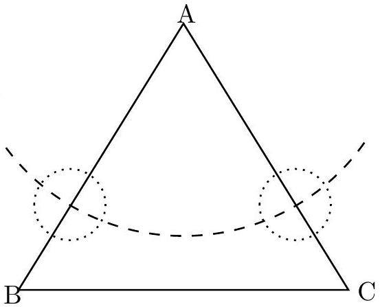
    1. A complete ray diagram using the given figure. You may use the one already provided on the answersheet or draw a fresh one.
    2. Outline of the essential experimental steps using some or all of the equipment mentioned above and nothing more. Use the detailed answer sheet for this.

Solution:
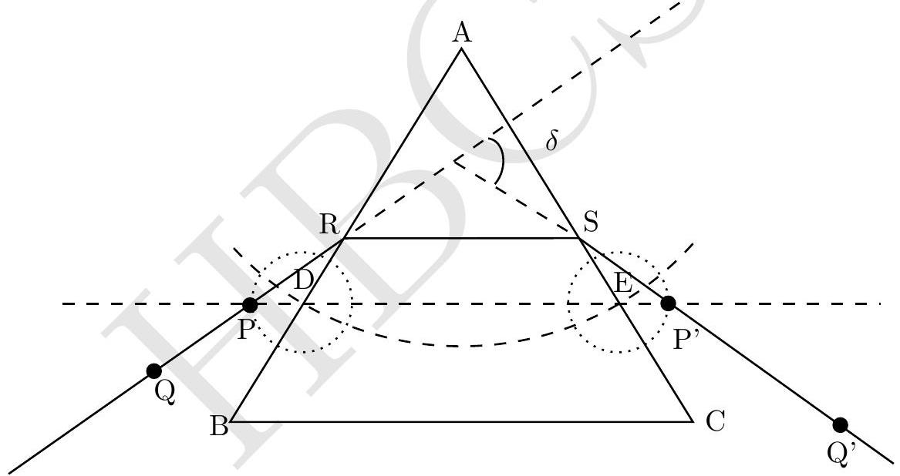
The big arc is drawn to draw a line parallel to the base BC, with A as the center. Smaller dotted circles are then drawn, centering on points D and E. The goal is to minimize the angle of deviation, which occurs when the refracted ray is parallel to the base. To observe and measure this deviation, the following steps are taken:

1. Draw a line passing through D and E. This is the dashed line parallel to the base BC.
2. Mark point P, where the circle centered at D intersects the line DE. Similarly, mark P'.
3. Mount pins on the points P and P'.
4. Mount 3rd pin at a position Q on the left side, such that pins at $\mathrm { P } , \mathrm { P } ^ { \prime }$, and Q appear collinear when observed from the right side refracting face of the prism.
5. In a similar manner looking from the left side, align the 4th pin labeled as Q' on the right side, such that pins at $\mathrm { P } , \mathrm { P } ^ { \prime } , \mathrm { Q }$, and $\mathrm { Q } ^ { \prime }$ appear collinear.

6. Observe the incident, refracted, and emergent rays formed by the pin's positions and the prism.
7. Extend the lines drawn to measure the angle of deviation.
8. Since $\mathrm { PD } = \mathrm { P }$ 'E, the refracted ray is parallel to the base, and the angle $\delta$ represents the minimum deviation.
9. Utilize a protractor to measure the angle.
(b) [1.5 marks] Consider a right-angled isosceles prism as depicted below. The prism is placed on a table ( $x - y$ plane). The triangular faces are non-refracting surfaces. The refractive index of the prism is 1.50. The sides $\mathrm { AB } = \mathrm { AC } = \mathrm { AD } = 1$ unit. The prism is positioned such that point D is at the origin, with the axes defined in the figure. An arrow-shaped object is pasted on the face BCFE of the prism as shown. Draw the image of the object as seen by an observer in front of the face BCFE.
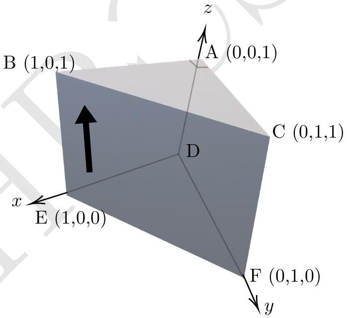

Solution: The formed image is virtual and located behind face ACDF when seen from face BCFE. The pasted arrow is symmetric about edge AD. It undergoes two total internal reflections, resulting in the image being identical to the object but laterally shifted.
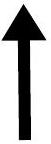

(c) [1.5 marks] Now an object, shaped like the letter "P" as illustrated in the left figure below, is held in front of the face ABED of the prism, placed on a table ( $x - y$ plane). The corresponding top view of this configuration is also presented in the right figure below.

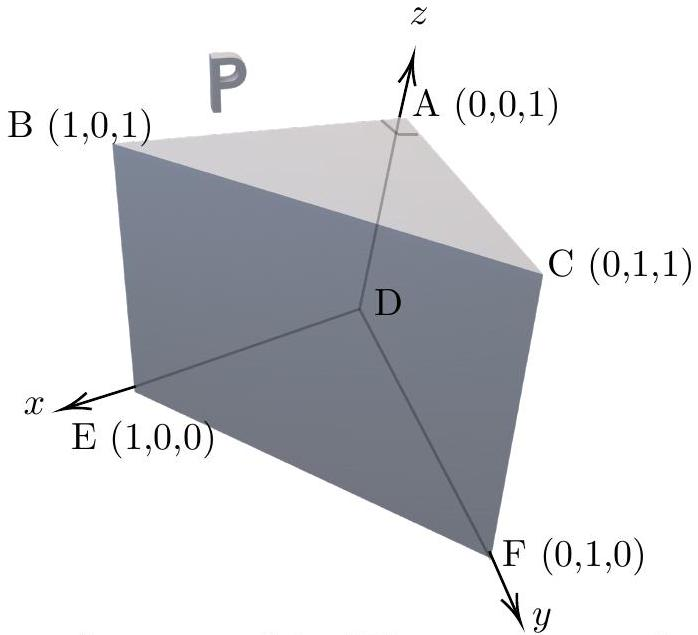
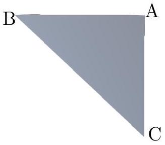
Draw the image of the "P" as seen by an observer in front the face ACFD. Additionally, draw a qualitative ray diagram illustrating the image formation.

Solution: The formed image is virtual and positioned behind face BCFE when observed facing face ACDE. It undergoes total internal reflection. Ray diagram and the resultant image is shown below.
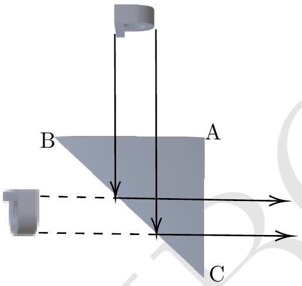
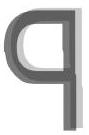

(d) [5 marks] In this part, alongside the setup of part (c) with the prism ABCDEF and the object "P" positioned in front of its face ABED, we introduce another identical prism, A'B'C'D'E'F' (see below).
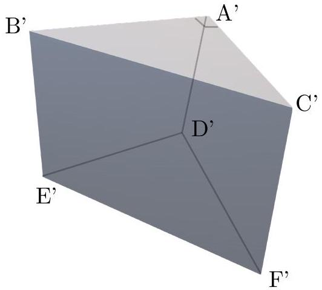
A specific experiment requires placing the prism A'B'C'D'E'F' in combination with the existing setup so that the following image (as shown below) of the object "P" can be obtained.
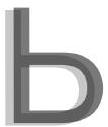
Without disturbing the prism ABCDEF, where and how would you hold the prism A'B'C'D'E'F' to achieve this resultant image?
Provide your answer in terms of the coordinates of the vertices of the prism A'B'C'D'E'F', taking vertex D of the first prism as the origin. Additionally, specify that to view such an

image, the viewer should be facing which particular face of the prism.
Hint: The position of the second prism is such that any one of the parts (such as at least one of the vertices, edges, or faces) touches the table. The viewer should be positioned in a way that allows a clear line of sight to the area where the image is formed, ensuring an unobstructed view of the desired image.

Solution:
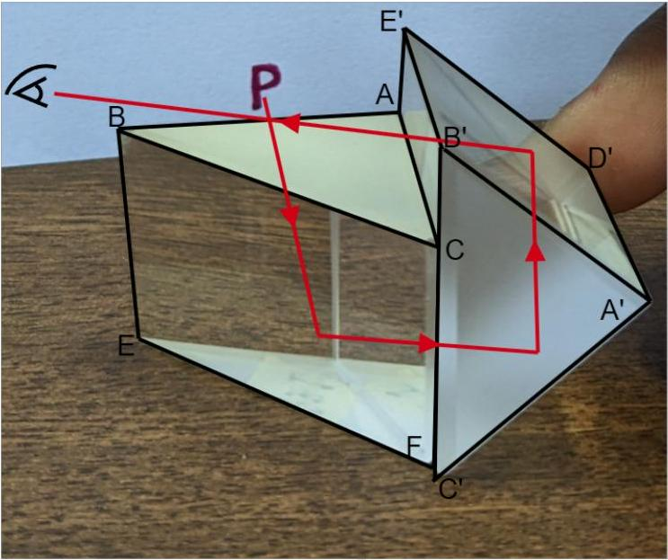
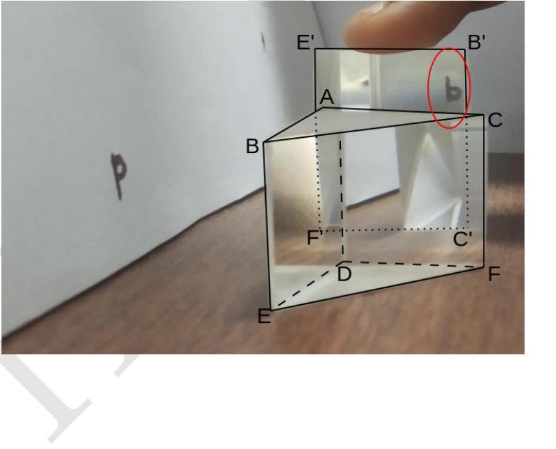

The light rays from object "P" initially pass through faces ABED of prism 1 at a normal angle. Subsequently, due to total internal reflection, the rays are reflected from face BCFE. The reflected light exits prism 1 through face ACFD and enters prism 2 through face E'B'C'F'. Inside prism 2, the light undergoes total internal reflection twice, occurring at faces A'C'F'D' and A'D'E'B'. The image formed is virtual and located behind the face C'F'E'B' face of the prism.
Face $\mathbf { C } ^ { \prime } \mathbf { F } ^ { \prime } \mathbf { E } ^ { \prime } \mathbf { B } ^ { \prime }$ of the prism 2 can be kept in the plane $\mathbf { Y Z }$, touching the face $\mathbf { C A D F }$ of the prism 1.
The position of the observer is in the plane $\mathbf { Y Z }$ and facing $\mathbf { C } ^ { \prime } \mathbf { F } ^ { \prime } \mathbf { E } ^ { \prime } \mathbf { B } ^ { \prime }$ face of the second prism.
Coordinates of the face C'F'E'B' are
C': (0, 1, 0)
F': (0, 0, 0)
E': $( 0,0 , \sqrt { 2 } )$
B': $( 0,1 , \sqrt { 2 } )$
Alternate configuration, leading to the correct image are equally credited.

(e) [3 marks] In a spectrograph, two equilateral prisms denoted as 1 and 2 with refractive indices $\mu _ { 1 } = 1.50$ and $\mu _ { 2 } = 1.68$, respectively, are placed one after another (see the figure below). The incident ray is shown on the left and the final emergent ray is shown on the right.
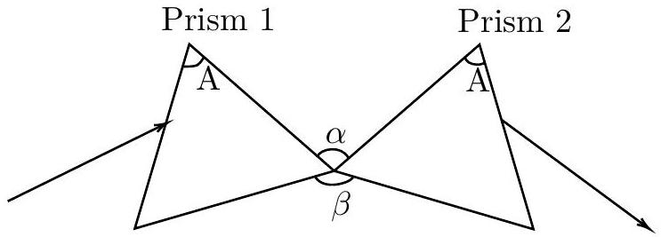
Find the angle $( \beta )$ between the bases of the two prisms if each prism is individually adjusted for minimum deviation for the respective incident rays. Obtain the total deviation $\delta$ of the beam of light in this configuration. Express your answers in terms of $\mu _ { 1 } , \mu _ { 2 } , A$. Calculate $\beta$ and $\delta$ in degrees.
Solution: Let angle of incidence be $i _ { 1 }$ and for this ray, the angle of emergence from the second prism be $i _ { 1 } ^ { \prime }$. The angle of refraction at first prism be $i _ { 1 P }$. The angle of incidence of light for second prism is $i _ { 1 } ^ { \prime }$, as it is adjusted for minimum deviation. Angle of refraction for ray going from air to 2nd prism be $i _ { 1 P } ^ { \prime }$.
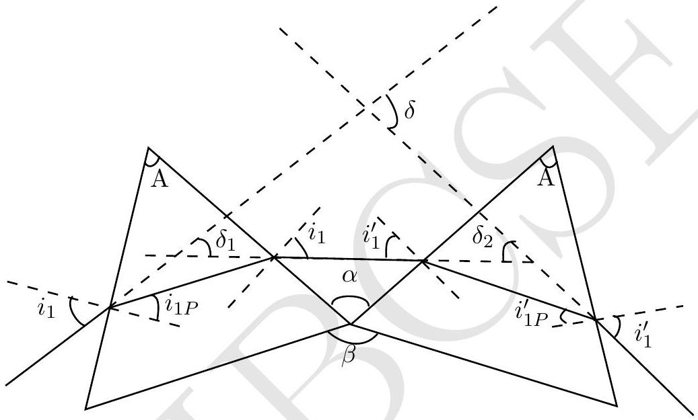
$$
\begin{align*}
\sin i _ { 1 } & = \mu _ { 1 } \sin \frac { A } { 2 }  \tag{2.1}\\
\sin i _ { 1 } ^ { \prime } & = \mu _ { 2 } \sin \frac { A } { 2 } \tag{2.2}
\end{align*}
$$
From geometry
$$
\begin{align*}
& \alpha = i _ { 1 } + i _ { 1 } ^ { \prime }  \tag{2.3}\\
& \alpha = \sin ^ { - 1 } \left( \mu _ { 1 } \sin \frac { A } { 2 } \right) + \sin ^ { - 1 } \left( \mu _ { 2 } \sin \frac { A } { 2 } \right)  \tag{2.4}\\
& \beta = 240 - \left( i _ { 1 } + i _ { 1 } ^ { \prime } \right)  \tag{2.5}\\
& \beta = 240 - \left( \sin ^ { - 1 } \left( \mu _ { 1 } \sin \frac { A } { 2 } \right) + \sin ^ { - 1 } \left( \mu _ { 2 } \sin \frac { A } { 2 } \right) \right) \tag{2.6}
\end{align*}
$$
For $\mu _ { 1 } = 1.50 , \mu _ { 2 } = 1.68$ and $A = 60 ^ { \circ }$, we get
$$
\begin{align*}
& \alpha = 105 ^ { \circ } 44 ^ { \prime }  \tag{2.7}\\
& \beta = 134 ^ { \circ } 16 ^ { \prime } \tag{2.8}
\end{align*}
$$
From figure and geometry If the angle of minimum deviation of the first prism is $\delta _ { 1 }$ and the second prism is $\delta _ { 2 }$., then
$$
\begin{align*}
& A + \delta _ { 1 } = 2 i _ { 1 }  \tag{2.9}\\
& A + \delta _ { 2 } = 2 i _ { 1 } ^ { \prime } \tag{2.10}
\end{align*}
$$

The total deviation produced by two prisms is

$$
\begin{align*}
\delta & = \delta _ { 1 } + \delta _ { 2 }  \tag{2.11}\\
\delta & = 2 \left( i _ { 1 } + i _ { 1 } ^ { \prime } - A \right)  \tag{2.12}\\
\delta & = 2 \left( \sin ^ { - 1 } \left( \mu _ { 1 } \sin \frac { A } { 2 } \right) + \sin ^ { - 1 } \left( \mu _ { 2 } \sin \frac { A } { 2 } \right) - A \right)  \tag{2.13}\\
& = 91 ^ { \circ } 28 ^ { \prime } \tag{2.14}
\end{align*}
$$
