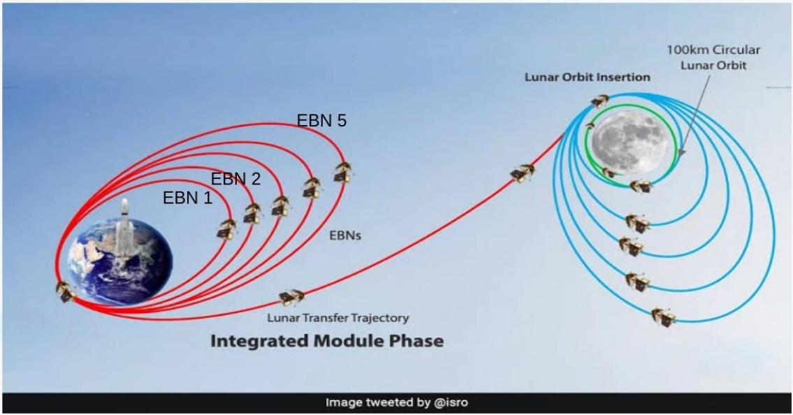
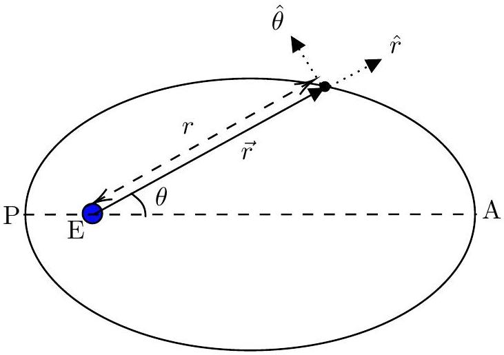
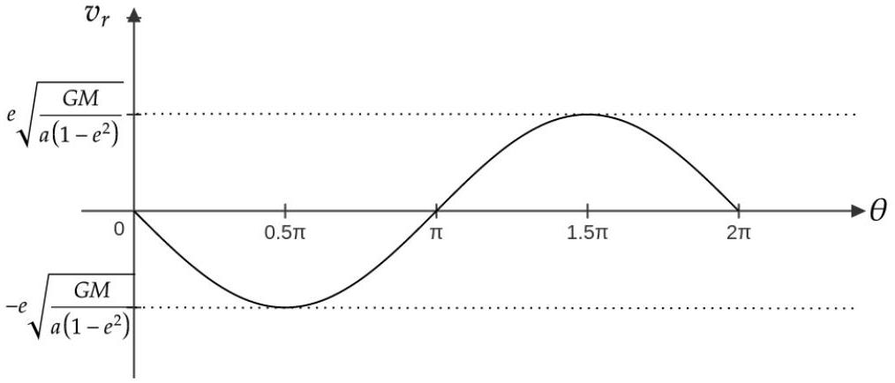
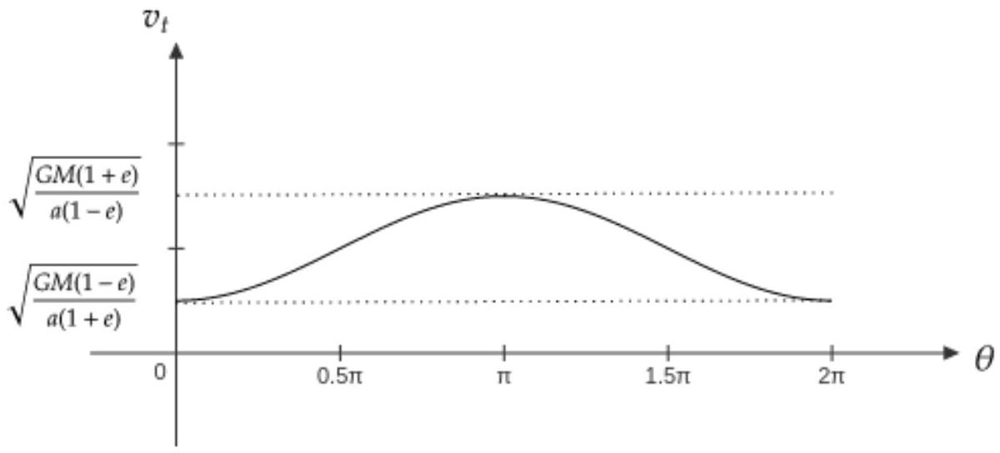
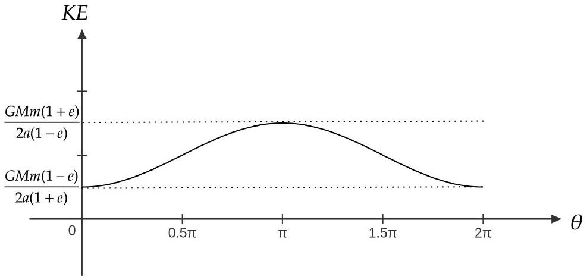

## 3. Chandrayaan-3

On July 14, 2023, India's lunar mission satellite, Chandrayaan-3, was successfully launched by the Indian Space Research Organization (ISRO). Chandrayaan-3 (mass $m = 3900 \mathrm {~kg}$ ) was taken to the Moon through a series of Earth Bound Manoeuvres (elliptical) orbits (EBNs) as depicted in the figure below. In this problem, we will explore the physics governing some part of its journey, employing a simplified model. For all parts of this problem except part (f), we consider Chandrayaan-3 to be moving only under the influence of Earth's gravity (a central force).

(a) [6 marks] Upon launch, Chandrayaan-3 entered an elliptical orbit around Earth, with Earth at one of the foci (E) as shown below. The points P and A are the perigee (nearest point from the Earth) and apogee (farthest point from the Earth), respectively. We introduce the polar coordinate system ( $r , \theta$ ), where $\vec { r }$ is the vector from the centre of the Earth (origin) to the satellite, and $\theta$ is the angle that $\vec { r }$ makes with the major axis ( $\mathrm { PA } = 2 a$ ). The directions of unit vectors $\hat { r }$ and $\hat { \theta }$ are shown in the figure.

The equation of the ellipse can be written in polar coordinates as
$$
r = \frac { r _ { 0 } } { ( 1 - e \cos \theta ) }
$$

where $e$ is eccentricity of the orbit $( 0 < e < 1 )$ and $r _ { 0 }$ is called the latus rectum. The velocity $\vec { v }$ of the satellite in polar coordinates can be written as

$$
\vec { v } = v _ { r } \hat { r } + v _ { t } \hat { \theta } = \dot { r } \hat { r } + r \dot { \theta } \hat { \theta }
$$

where $v _ { r } = \dot { r }$ is the "radial" speed and $v _ { t } = r \dot { \theta }$ is the "tangential" speed. Make schematic plots of the speeds $v _ { r }$ and $v _ { t }$ as functions of $\theta$ over one full orbit. Mark any significant points in the plots in terms of $a , e$, and other variables.

Solution: It is given that

$$
\begin{array} { r }
r = \frac { r _ { 0 } } { ( 1 - e \cos \theta ) } \\
\therefore v _ { r } = \dot { r } = - \frac { r _ { 0 } e \sin \theta \dot { \theta } } { ( 1 - e \cos \theta ) ^ { 2 } } \tag{3.2}
\end{array}
$$

Since the force is central, angular momentum $l$ is conserved. The conserved angular momentum is given by

$$
\begin{align*}
l & = m r ^ { 2 } \dot { \theta }  \tag{3.3}\\
\Longrightarrow \dot { \theta } & = \frac { l } { m r ^ { 2 } } \tag{3.4}
\end{align*}
$$

Substituting above equation and expression of $r$ in $v _ { r }$, after simplifying, we get

$$
\begin{equation*}
v _ { r } = - \frac { e l \sin \theta } { m r _ { 0 } } \tag{3.5}
\end{equation*}
$$

We know that

$$
\begin{equation*}
v _ { t } = \frac { l } { m r } \tag{3.6}
\end{equation*}
$$

Substituting the value of $r$, we get

$$
\begin{equation*}
v _ { t } = \frac { l ( 1 - e \cos \theta ) } { m r _ { 0 } } \tag{3.7}
\end{equation*}
$$

From above equation, the value of $v _ { t }$ is maximum, when $\cos \theta$ is minimum. i.e. $\theta = - \pi$. The maximum value of $v _ { t }$

$$
\begin{equation*}
v _ { t } ^ { \max } = \frac { l ( 1 + e ) } { m r _ { 0 } } \tag{3.8}
\end{equation*}
$$

From Eq. (3.7), $v _ { t }$ is minimum, when $\cos \theta$ is maximum. i.e $\theta = 0$. The minimum value of $v _ { t }$

$$
\begin{equation*}
v _ { t } ^ { \min } = \frac { l ( 1 - e ) } { m r _ { 0 } } \tag{3.9}
\end{equation*}
$$

Since the velocities at P and A are purely tangential, and P is closer to earth as compared to A , hence the tangential speed is maximum at P. Let the velocity of the satellite in the given orbit at P be $v _ { p }$ and velocity at A be $v _ { a }$. Conservation of energy gives:

$$
\begin{equation*}
\frac { 1 } { 2 } m v _ { a } ^ { 2 } - \frac { G M m } { r _ { a } } = \frac { 1 } { 2 } m v _ { p } ^ { 2 } - \frac { G M m } { r _ { p } } \tag{3.10}
\end{equation*}
$$

Conservation of angular momentum gives

$$
\begin{align*}
m v _ { a } r _ { a } & = m v _ { p } r _ { p }  \tag{3.11}\\
v _ { p } & = v _ { a } \frac { r _ { a } } { r _ { p } } \tag{3.12}
\end{align*}
$$

Substituting the above equation into the energy conservation equation, we get

$$
\begin{equation*}
v _ { p } = \sqrt { \frac { G M } { a } \frac { ( 1 + e ) } { ( 1 - e ) } } \tag{3.13}
\end{equation*}
$$

Similarly

$$
\begin{equation*}
v _ { a } = \sqrt { \frac { G M } { a } \frac { ( 1 - e ) } { ( 1 + e ) } } \tag{3.14}
\end{equation*}
$$

Hence the conserved angular momentum can be written as

$$
\begin{equation*}
l = m v _ { a } r _ { a } = m v _ { a } r _ { a } \tag{3.15}
\end{equation*}
$$

On simplification, we get

$$
\begin{equation*}
l = m r _ { o } \sqrt { \frac { G M } { a \left( 1 - e ^ { 2 } \right) } } \tag{3.16}
\end{equation*}
$$

$v _ { r }$ and $v _ { t }$ can also be written as

$$
\begin{array} { r }
v _ { r } = - e \sqrt { \frac { G M } { a \left( 1 - e ^ { 2 } \right) } } \sin \theta \\
v _ { t } = \sqrt { \frac { G M } { a \left( 1 - e ^ { 2 } \right) } } ( 1 - e \cos \theta ) \tag{3.18}
\end{array}
$$

Similarly $v _ { r } ^ { \text {max } } , v _ { r } ^ { \text {min } } , v _ { t } ^ { \text {max } }$ and $v _ { t } ^ { \text {min } }$ can also be written as

$$
\begin{align*}
& v _ { r } ^ { \max } = e \sqrt { \frac { G M } { a \left( 1 - e ^ { 2 } \right) } } \text { at } \theta = 3 \pi / 2  \tag{3.19}\\
& v _ { r } ^ { \min } = - e \sqrt { \frac { G M } { a \left( 1 - e ^ { 2 } \right) } } \text { at } \theta = \pi / 2  \tag{3.20}\\
& v _ { t } ^ { \max } = \sqrt { \frac { G M } { a \left( 1 - e ^ { 2 } \right) } } ( 1 + e ) = \sqrt { \frac { G M ( 1 + e ) } { a ( 1 - e ) } } \text { at } \theta = \pi  \tag{3.21}\\
& v _ { t } ^ { \min } = \sqrt { \frac { G M } { a \left( 1 - e ^ { 2 } \right) } } ( 1 - e ) = \sqrt { \frac { G M ( 1 - e ) } { a ( 1 + e ) } } \quad \text { at } \theta = 0 \text { and } 2 \pi \tag{3.22}
\end{align*}
$$

(b) [1.5 marks] Obtain an expression for the total energy $( E )$ of the orbiting satellite in terms of $a$ and other constants.

Solution: Let

$$
\begin{equation*}
\frac { v _ { a } } { r _ { p } } = \frac { v _ { p } } { r _ { a } } = C \tag{3.23}
\end{equation*}
$$

Putting Eq. (3.23) in Eq. (3.10), we get

$$
\begin{equation*}
\frac { 1 } { 2 } m C ^ { 2 } r _ { p } ^ { 2 } - \frac { G M m } { r _ { a } } = \frac { 1 } { 2 } m C ^ { 2 } r _ { a } ^ { 2 } - \frac { G M m } { r _ { p } } \tag{3.24}
\end{equation*}
$$

solving above equation, we get

$$
\begin{equation*}
C ^ { 2 } = \frac { 2 G M } { \left( r _ { p } + r _ { a } \right) r _ { a } r _ { p } } \tag{3.25}
\end{equation*}
$$

Again using Eq. (3.23) and value of $C ^ { 2 }$ from above equation in LHS of the Eq. (3.24), we get

$$
\begin{equation*}
E = \frac { 1 } { 2 } m \frac { 2 G M r _ { p } ^ { 2 } } { r _ { a } r _ { p } \left( r _ { a } + r _ { a } \right) } - \frac { G M m } { r _ { a } } \tag{3.26}
\end{equation*}
$$

Solving above equation, and substituting $r _ { a } + r _ { p } = 2 a$, we get

$$
\begin{equation*}
E = - \frac { G M m } { 2 a } \tag{3.27}
\end{equation*}
$$

(c) [1 marks] Plot the kinetic energy (KE) of the satellite as a function of $\theta$ over one full orbit. Mark any significant points in terms of $a , e$, and other variables.

Solution:

$$
\begin{equation*}
K E = \frac { 1 } { 2 } m v ^ { 2 } \tag{3.28}
\end{equation*}
$$

where $v ^ { 2 } = v _ { r } ^ { 2 } + v _ { t } ^ { 2 }$. Substituting the value of $v _ { r }$ and $v _ { t }$ in the above equation, we get

$$
\begin{equation*}
K E = \frac { G M m \left( 1 + e ^ { 2 } - 2 e \cos \theta \right) } { 2 a \left( 1 - e ^ { 2 } \right) } \tag{3.29}
\end{equation*}
$$

For $\theta = 0 , K E = K E _ { \text {min } } = \frac { G M m ( 1 - e ) } { 2 a ( 1 + e ) }$, and for $\theta = \pi K E = K E _ { \text {max } } = \frac { G M m ( 1 + e ) } { 2 a ( 1 - e ) }$

(d) [1.5 marks] The perigee and apogee of the elliptical orbit in part (a) are 200 km and 36500 km, respectively. It is generally described as a (200×36500) km orbit. Here the distances are defined from the surface of the Earth. Calculate the period of rotation $T$ (in hr) of Chandrayaan-3 in this orbit.

Solution: The period of the orbit is given by

$$
\begin{equation*}
T ^ { 2 } = \frac { 4 \pi ^ { 2 } } { G M } a ^ { 3 } \tag{3.30}
\end{equation*}
$$

where $a = \frac { r _ { p } + r _ { a } } { 2 }$, where $r _ { p }$ is perigee distance given by $r _ { p } = 200 \mathrm {~km} + R _ { E }$ and $r _ { a }$ is apogee distance given by $r _ { a } = 36500 \mathrm {~km} + R _ { E }$ and i.e. $a = 6371 + \frac { ( 200 + 36500 ) \mathrm { km } } { 2 } = 24721 \mathrm {~km}$

$$
\begin{align*}
T & = \sqrt { \frac { 4 \times \pi ^ { 2 } } { 6.67 \times 10 ^ { - 11 } \times 5.972 \times 10 ^ { 24 } } 24721 ^ { 3 } \times 10 ^ { 9 } }  \tag{3.31}\\
& = 10.75 \mathrm { hr } \tag{3.32}
\end{align*}
$$

(e) [2.5 marks] To move Chandrayaan-3 from the first orbit (in part (d)) to another elliptical orbit EBN-1, an instantaneous boost was applied at perigee by changing the velocity by $\Delta v$, without altering the direction. This changed the apogee to 41800 km above Earth's surface while keeping the perigee unchanged. Calculate $\Delta v$.

Solution: since the velocities at P and A are purely tangential, and P is closer to earth as compared to A, hence the tangential speed is maximum at P. Let the velocity of the satellite in the given orbit at P be $v _ { p }$ and velocity at A be $v _ { a }$. Conservation of energy gives:

$$
\begin{equation*}
\frac { 1 } { 2 } m v _ { a } ^ { 2 } - \frac { G M m } { r _ { a } } = \frac { 1 } { 2 } m v _ { p } ^ { 2 } - \frac { G M m } { r _ { p } } \tag{3.33}
\end{equation*}
$$

Conservation of angular momentum gives

$$
\begin{align*}
m v _ { a } r _ { a } & = m v _ { p } r _ { p }  \tag{3.34}\\
v _ { p } & = v _ { a } \frac { r _ { a } } { r _ { p } } \tag{3.35}
\end{align*}
$$

Substituting the above equation into the energy conservation equation, we get

$$
\begin{align*}
& v _ { p } = \sqrt { \frac { 2 G M r _ { a } } { r _ { p } \left( r _ { p } + r _ { a } \right) } }  \tag{3.36}\\
& v _ { p } = \sqrt { \frac { G M r _ { a } } { a r _ { p } } }  \tag{3.37}\\
& v _ { p } = \sqrt { \frac { G M } { a } \frac { ( 1 + e ) } { ( 1 - e ) } } \tag{3.38}
\end{align*}
$$

Similarly

$$
\begin{align*}
& v _ { a } = \sqrt { \frac { 2 G M r _ { p } } { r _ { a } \left( r _ { p } + r _ { a } \right) } }  \tag{3.39}\\
& v _ { a } = \sqrt { \frac { G M r _ { p } } { a r _ { a } } }  \tag{3.40}\\
& v _ { a } = \sqrt { \frac { G M } { a } \frac { ( 1 - e ) } { ( 1 + e ) } } \tag{3.41}
\end{align*}
$$

From Eq. (3.36)

$$
\begin{align*}
& v _ { p } = \sqrt { \frac { 2 G M r _ { a } } { r _ { p } \left( r _ { p } + r _ { a } \right) } }  \tag{3.42}\\
& v _ { p } = 10.251 \mathrm {~km} / \mathrm { s } \tag{3.43}
\end{align*}
$$

In the new orbit, the perigee distance is kept the same, and the apogee distance changed to 41800 km, hence $r _ { a } = 41800 + R _ { E } = 48171 \mathrm {~km}$ and $r _ { p }$ remains as it is. Hence, the new velocity at the perigee distance is $v _ { p } ^ { \prime }$ Using the expression Eq. (3.36), the $v _ { p } ^ { \prime }$ can be written as

$$
\begin{align*}
& v _ { p } ^ { \prime } = \sqrt { \frac { 2 G M r _ { a } } { r _ { p } \left( r _ { a } ^ { \prime } + r _ { p } \right) } }  \tag{3.44}\\
& v _ { p } ^ { \prime } = 10.327 \mathrm {~km} / \mathrm { s } \tag{3.45}
\end{align*}
$$

Now the boost required $\Delta v$ at this position would be

$$
\begin{align*}
\Delta v & = v _ { p } ^ { \prime } - v _ { p }  \tag{3.46}\\
\Delta v & = 0.076 \mathrm {~km} / \mathrm { s } \tag{3.47}
\end{align*}
$$

[^0]Solution: Let the apogee distance be $r _ { m a } = R _ { m } + 1437 \mathrm {~km}$ and perigee distance be $r _ { m p } = R _ { m } + 100$ km The velocity of the satellite at perigee, when it is in the elliptic orbit, is $v _ { m p }$ and the velocity

when it is in the circular orbit is $v _ { m }$ we know that

$$
\begin{align*}
& v _ { m p } = \sqrt { \frac { 2 G M _ { M } r _ { m a } } { r _ { m p } \left( r _ { m a } + r _ { m p } \right) } }  \tag{3.48}\\
& v _ { m p } = 1.838 \mathrm {~km} / \mathrm { s } \tag{3.49}
\end{align*}
$$

Similarly here apogee distance be $r _ { m a } = R _ { m } + 100 \mathrm {~km}$ and perigee distance be $r _ { m p } = R _ { m } + 100$ km . Let $r _ { m } = r _ { m a } = r _ { m p }$

$$
\begin{align*}
v _ { m } & = \sqrt { \frac { 2 G M _ { m } r _ { m } } { r _ { m } \left( r _ { m } + r _ { m } \right) } }  \tag{3.50}\\
v _ { m } & = 1.633 \mathrm {~km} / \mathrm { s } \tag{3.51}
\end{align*}
$$

The boost required $\Delta v ^ { \prime }$

$$
\begin{align*}
\Delta v ^ { \prime } & = v _ { m } - v _ { m p }  \tag{3.53}\\
\Delta v ^ { \prime } & = - 0.205 \mathrm {~km} / \mathrm { s } \tag{3.54}
\end{align*}
$$
