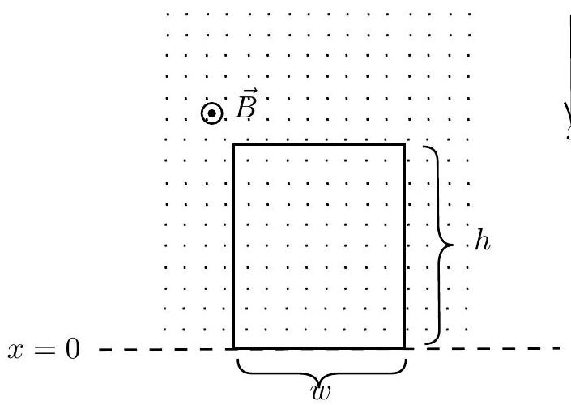
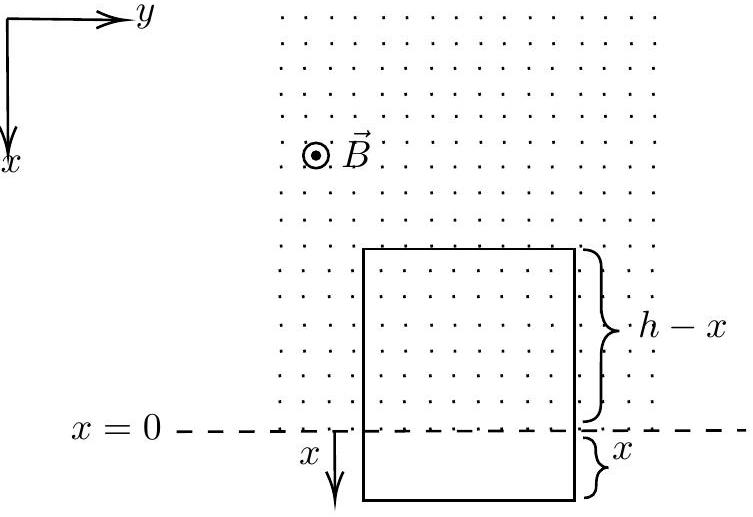
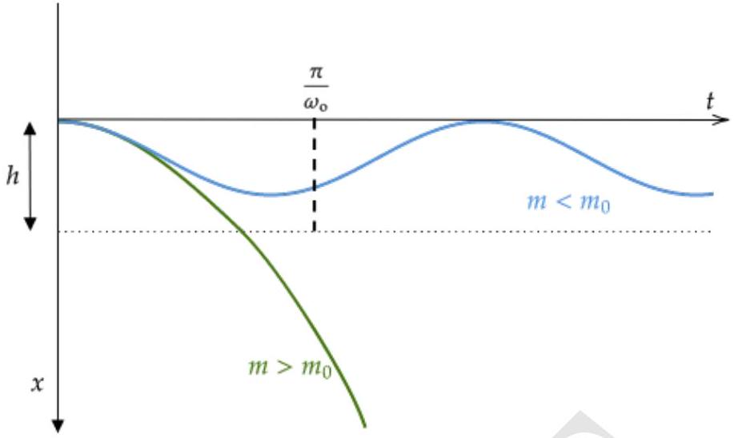

## 4. Mag-Grav Tussle

A rectangular conducting loop of mass $m$, width $w$, length $h$, and self inductance $L$ is held in the vertical $x - y$ plane with its bottom edge along the $y$-axis (see figure on the left below). In this problem take the resistance of the loop to be zero. A uniform magnetic field $\vec { B }$ is applied horizontally as shown in the figure such that

$$
\begin{aligned}
\vec { B } & = B \hat { k } \quad \text { for } x \leq 0 \\
& = 0 \quad \text { for } x > 0
\end{aligned}
$$

The loop is released from rest at time $t = 0$ and descends under gravity (see the figure to the right below). The acceleration due to gravity $g$ is in $+ x$ direction.

(a)

(b)

(a) [5 marks] Obtain $x ( t )$, the position of the bottom edge of the loop at time $t$, in terms of relevant variables.

Solution:

$$
\begin{array} { r }
m \ddot { x } = m g - B I w \\
\phi = B w ( h - x ) + L I \\
- I R = \dot { \phi } = - B w \dot { x } + L \dot { I } \tag{4.3}
\end{array}
$$

Since $R = 0$ Implies

$$
\begin{equation*}
\dot { I } = \frac { B w \dot { x } } { L } \tag{4.4}
\end{equation*}
$$

Differentiating equation of motion with respect to $t$

$$
\begin{gather*}
m \ddot { v } = - B w \dot { I }  \tag{4.5}\\
\ddot { v } = \frac { - B ^ { 2 } w ^ { 2 } \dot { x } } { m L }  \tag{4.6}\\
= - \omega _ { 0 } ^ { 2 } v \tag{4.7}
\end{gather*}
$$

where

$$
\begin{equation*}
\omega _ { 0 } ^ { 2 } = \frac { B ^ { 2 } w ^ { 2 } } { m L } \tag{4.8}
\end{equation*}
$$

The solution to $v$ is

$$
\begin{array} { r }
v = A \cos \omega _ { 0 } t + D \sin \omega _ { 0 } t \\
\dot { v } = - A \omega _ { 0 } \sin \omega _ { 0 } t + D \omega _ { 0 } \cos \omega _ { 0 } t \\
\ddot { v } = - A \omega _ { 0 } ^ { 2 } \cos \omega _ { 0 } t + D \omega _ { 0 } ^ { 2 } \sin \omega _ { 0 } t \tag{4.11}
\end{array}
$$

Applying boundary conditions at $t = 0 , \dot { v } = g , v = 0$ which implies that

$$
\begin{array} { r }
D = \frac { g } { \omega _ { 0 } } \\
A = 0 \tag{4.13}
\end{array}
$$

Hence,

$$
\begin{array} { r }
v = \frac { g } { \omega _ { 0 } } \sin \omega _ { 0 } t \\
x = - \frac { g } { \omega _ { 0 } ^ { 2 } } \cos \omega _ { 0 } t + C \tag{4.15}
\end{array}
$$

at $t = 0 , x = 0$, which implies that $C = \frac { g } { \omega _ { 0 } ^ { 2 } }$
Hence,

$$
\begin{equation*}
x = \frac { g } { \omega _ { 0 } ^ { 2 } } \left( 1 - \cos \omega _ { 0 } t \right) \tag{4.16}
\end{equation*}
$$

(b) [6 marks] Imagine different possible scenarios for the nature of motion of the loop and plot $x ( t )$ for each.

Solution: We found that

$$
\begin{equation*}
x = \frac { g } { \omega _ { 0 } ^ { 2 } } \left( 1 - \cos \omega _ { 0 } t \right) \tag{4.17}
\end{equation*}
$$

The frequency of the oscillation is inversely proportional to $m$, and the amplitude increases

with $m$. When the loop oscillates, the amplitude is

$$
\begin{equation*}
x _ { m } = 2 \frac { g } { \omega _ { 0 } ^ { 2 } } = 2 \frac { g m L } { B ^ { 2 } w ^ { 2 } } \tag{4.18}
\end{equation*}
$$

We can take three limiting cases, $m > m _ { 0 }$, and $m < m _ { 0 }$, where $m _ { 0 } = h B ^ { 2 } w ^ { 2 } / 2 g L$.

For $m < m _ { 0 }$, the loop oscillates. For $m > m _ { 0 }$, the loop will come out of the magnetic field quicker it falls under gravity. Similarly, any suitable inequality involving g, L, h, B, m, and w, which distinguishes the above two cases correctly, will be considered.
