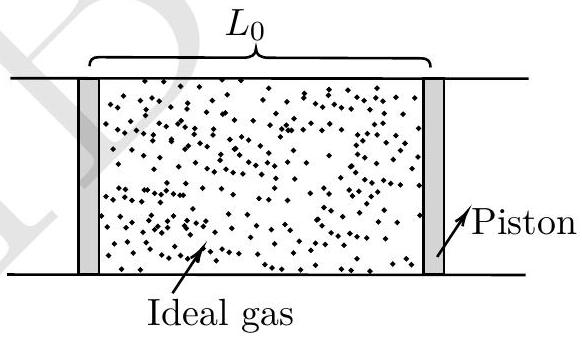
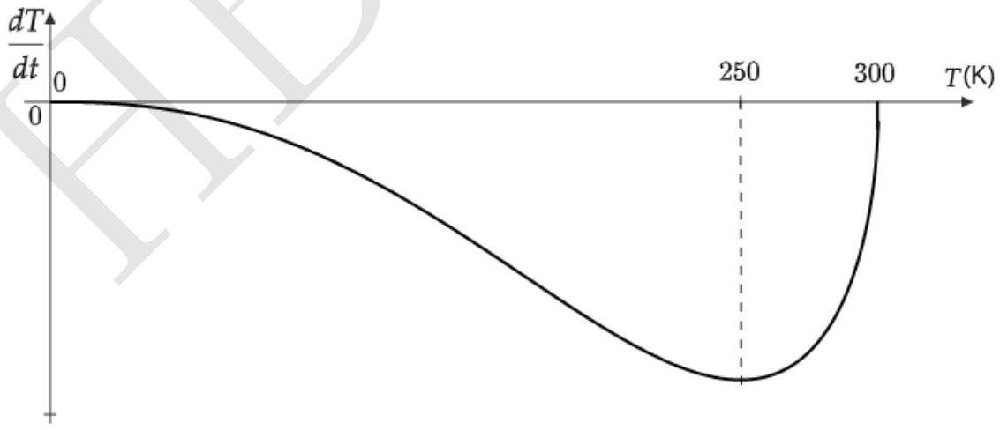

## 5. Thermal Tussle

Consider a horizontal insulated cylindrical tube of very large length. Two identical insulated pistons, each of mass $M = 0.2 \mathrm {~kg}$ are fitted within the tube separated by a length $L _ { 0 } = 1 \mathrm {~m}$. The space between the two pistons is filled with one mole of (ideal) helium gas, initially at temperature $T _ { 0 } = 300 \mathrm {~K}$. The external pressure, everywhere outside the pistons and tube, is zero.

Initially, the pistons are held in place by an external mechanism. At time $t = 0$, the mechanism is released and the pistons move without friction and the process is quasistatic initially. Assume that the gas behaves ideally throughout. Let $C _ { p }$ and $C _ { v }$ be the specific heats of the gas at constant pressure and volume respectively. Also, $\gamma = C _ { p } / C _ { v } = 5 / 3$.

(a) [ $\mathbf { 6 }$ marks] Determine the velocity $\left( v _ { p } \right)$ of each piston in terms of the gas temperature $T$ and other relevant variables. At what temperature $\left( T _ { c } \right)$, is the process no longer quasistatic? Calculate $T _ { c }$.

Solution: Given the initial temperature of the system to be $T _ { 0 }$, the initial energy of the system is $C _ { v } T _ { 0 }$. When the piston starts moving, from the work-energy theorem, the energy of the system is

$$
\begin{equation*}
\frac { 1 } { 2 } M v _ { 1 } ^ { 2 } + \frac { 1 } { 2 } M v _ { 2 } ^ { 2 } + C _ { v } T = C _ { v } T _ { 0 } \tag{5.1}
\end{equation*}
$$

Also from conservation momentum, we have $v _ { 2 } = - v _ { 1 } = v$.

From above equation, we get

$$
\begin{array} { r }
M v ^ { 2 } + C _ { v } T = C _ { v } T _ { 0 } \\
v ^ { 2 } = \frac { C _ { v } } { M } \left( T _ { 0 } - T \right) \\
v = \sqrt { \frac { C _ { v } } { M } \left( T _ { 0 } - T \right) } \tag{5.4}
\end{array}
$$

For the process to be quasistatic and adiabatic the piston's velocity cannot be greater than rms velocity of the gas.

$$
\begin{equation*}
\sqrt { \frac { C _ { v } } { M } \left( T _ { 0 } - T \right) } < \sqrt { \frac { 3 R T } { m } } \tag{5.5}
\end{equation*}
$$

where $m$ is molar mass of the gas. Solving the above equation, we get

$$
\begin{equation*}
T > \frac { C _ { v } T _ { 0 } m } { 3 R M + m C _ { v } } \approx 3 \mathrm {~K} \tag{5.7}
\end{equation*}
$$

Below this temperature, the piston's velocity exceeds rms velocity, which indicates that the piston moves very rapidly. This is where the quasi-static limit will breaks down. For the estimation purpose, we can also take the average velocity or the most probable velocity and the corresponding limit would be 3.5K and 4.4K respectively.

(b) [4 marks] From here, we restrict our analysis only to the quasistatic regime of the process. We define $u = T / T _ { 0 }$. Obtain the relation between $u$ and $t$ in the following form
$$
t = f ( u )
$$
You may leave the answer in terms of a suitable integral involving $L _ { 0 } , M$ and other variables.

Solution: Since the process adiabatic.

$$
\begin{equation*}
T _ { 1 } V _ { 1 } ^ { \gamma - 1 } = T _ { 2 } V _ { 2 } ^ { \gamma - 1 } \tag{5.8}
\end{equation*}
$$

Which implies

$$
\begin{equation*}
T L ^ { \gamma - 1 } = T _ { 0 } L _ { 0 } ^ { \gamma - 1 } \tag{5.9}
\end{equation*}
$$

To express the temperature as a function of time, Differentiating Eq. (5.8) w.r.t $t$, we get

$$
\begin{equation*}
L ^ { \gamma - 1 } \frac { d T } { d t } + T ( \gamma - 1 ) L ^ { \gamma - 2 } \frac { d L } { d t } = 0 \tag{5.10}
\end{equation*}
$$

From Eq. (5.8), we get

$$
\begin{equation*}
L = \left( \frac { T _ { 0 } L _ { 0 } ^ { ( \gamma - 1 ) } } { T } \right) ^ { \frac { 1 } { \gamma - 1 } } \tag{5.11}
\end{equation*}
$$

Also

$$
\begin{equation*}
\frac { d L } { d t } = 2 v = 2 \sqrt { \frac { C _ { v } } { M } \left( T _ { 0 } - T \right) } \tag{5.12}
\end{equation*}
$$

Substituting Eq. (5.11) and Eq. (5.12) into Eq. (5.10), we get

$$
\begin{equation*}
\frac { T _ { 0 } L _ { 0 } ^ { ( \gamma - 1 ) } } { T } \frac { d T } { d t } + T ( \gamma - 1 ) \left( \frac { T _ { 0 } L _ { 0 } ^ { ( \gamma - 1 ) } } { T } \right) ^ { \left( \frac { \gamma - 2 } { \gamma - 1 } \right) } 2 \sqrt { \frac { C _ { v } } { M } \left( T _ { 0 } - T \right) } = 0 \tag{5.13}
\end{equation*}
$$

For Mono atomic gas $\gamma = 5 / 3$, hence above equation becomes

$$
\begin{equation*}
\frac { T _ { 0 } L _ { 0 } ^ { 2 / 3 } } { T } \frac { d T } { d t } + T \frac { 2 } { 3 } \left( \frac { T _ { 0 } L _ { 0 } ^ { 2 / 3 } } { T } \right) ^ { - 1 / 2 } 2 \sqrt { \frac { C _ { v } } { M } \left( T _ { 0 } - T \right) } = 0 \tag{5.14}
\end{equation*}
$$

Rearranging above equation, we get,

$$
\begin{equation*}
d t = - \frac { 1 } { B _ { 1 } } \frac { d T } { T ^ { 5 / 2 } \left( T _ { 0 } - T \right) ^ { 1 / 2 } } \tag{5.15}
\end{equation*}
$$

Where $B _ { 1 } = \frac { 2 \sqrt { 2 / 3 } \sqrt { N _ { A } k / M } } { L _ { 0 } T _ { 0 } ^ { 3 / 2 } }$ Integrating above equation, we get

$$
\begin{equation*}
\int _ { 0 } ^ { t } d t = - \int \frac { 1 } { B _ { 1 } } \frac { \frac { d T } { T _ { 0 } } } { \left( \frac { T } { T _ { 0 } } \right) ^ { 5 / 2 } T _ { 0 } ^ { 2 } \left( 1 - \frac { T } { T _ { 0 } } \right) ^ { 1 / 2 } } \tag{5.16}
\end{equation*}
$$

Let $u = T / T _ { 0 }$, then above integral becomes

$$
\begin{align*}
\int _ { 0 } ^ { t } d t & = - \int _ { u _ { 0 } } ^ { u } \frac { 1 } { B _ { 1 } } \frac { d u } { u ^ { 5 / 2 } T _ { 0 } ^ { 2 } ( 1 - u ) ^ { 1 / 2 } }  \tag{5.17}\\
t & = - \frac { 1 } { B _ { 1 } T _ { 0 } ^ { 2 } } \int _ { u _ { 0 } } ^ { u } \frac { d u } { u ^ { 5 / 2 } ( 1 - u ) ^ { 1 / 2 } } \tag{5.18}
\end{align*}
$$

(c) [4 marks] Qualitatively plot the rate of change of temperature $( d T / d t )$ vs $T$. Mark any significant point(s) on the temperature axis in the plot.

Solution: Temperature decreases over time. From Eq. (5.15), it is evident that the derivative of the temperature function is always negative. Additionally, at $t = 0$ and $t = 300 \mathrm {~K} , d T / d t = 0$. The function exhibits an extremum at $T = 250 \mathrm {~K}$. These details are illustrated in the figure below.

(d) [4 marks] At what time $t$ does the temperature $T$ of the gas reach 20K? What is the piston velocity $\left( v _ { \mathrm { p } } \right)$ at this point?

Solution: The integration from Eq. (5.18) can be solved by substituting $u = \cos ^ { 2 } \theta$ and using boundary conditions as $u = 1$ for $T = T _ { 0 }$, we get

$$
\begin{equation*}
\left( \frac { 1 - u } { u } \right) ^ { 3 / 2 } + 3 \left( \frac { 1 - u } { u } \right) ^ { 1 / 2 } - \frac { 3 B _ { 1 } T _ { 0 } ^ { 2 } t } { 2 } = 0 \tag{5.19}
\end{equation*}
$$

Using above equation, for $n = 1$ moles and $L _ { 0 } = 1 \mathrm {~m}$, the temperature reaches 20K after 0.232s.
From Eq. (5.4) The piston's velocity at this point is $132.1 \mathrm {~m} / \mathrm { s }$.
