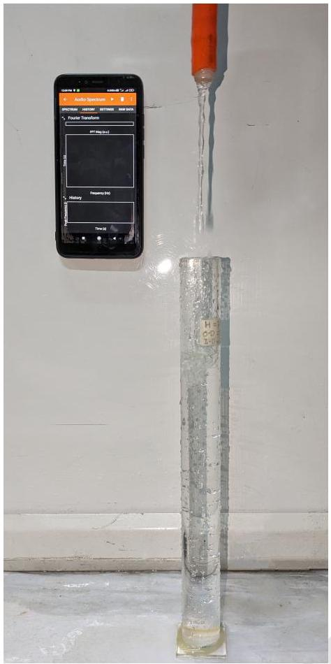
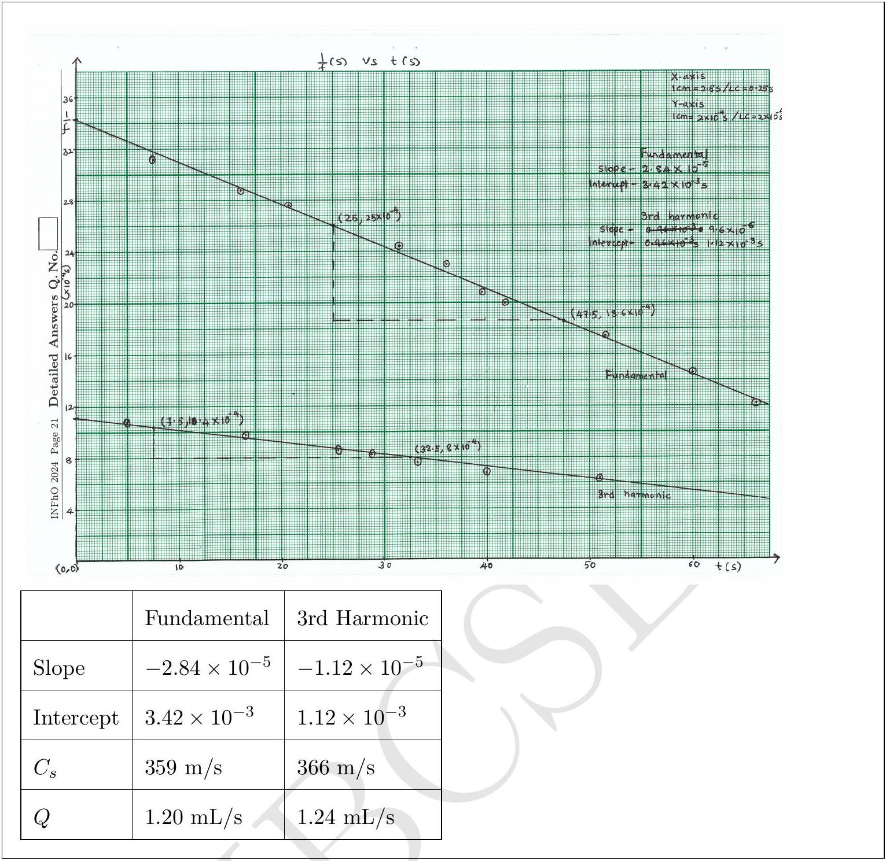

## 6. Sonic Sleuth

During her summer vacation, Dheera decides to carry out a smartphone based experiment. She utilizes a smartphone's frequency sensor that can measure the frequency of the audio signal it receives. She takes a long cylindrical tube closed at one end. This tube has a length of $L = 30.0 \mathrm {~cm}$ and an inner diameter of $d = 2.45 \mathrm {~cm}$. Dheera starts filling the tube with water, which is dripping from a tap at a constant rate $Q$ (measured in milliliters per second (mL/s)).

Dheera positions her smartphone near the open end of the tube to measure the frequency of the sound emitted as water fills the tube. An app on the phone captures a range of frequencies in the recorded audio at any given time. At randomly chosen values of time $t$, one of the frequencies at that time is shown in the following table.

| Time $t ( \mathrm {~s} )$ | Frequency $f ( \mathrm {~Hz} )$ | Time $t ( \mathrm {~s} )$ | Frequency $f$ (Hz) |
| :--- | :--- | :--- | :--- |
| 5.0 | 915 | 36.0 | 434 |
| 7.6 | 320 | 39.6 | 481 |
| 16.2 | 345 | 41.9 | 500 |
| 16.7 | 1008 | 42.5 | 1454 |
| 20.9 | 360 | 51.1 | 1618 |
| 25.7 | 1148 | 51.6 | 574 |
| 28.9 | 1196 | 56.1 | 1782 |
| 31.5 | 410 | 60.2 | 680 |
| 33.3 | 1290 | 66.3 | 820 |

Help her to analyse the experiment.

(a) [3 marks] Derive the expression for the velocity of sound $c _ { s }$ in terms of $f , t$, and constants.
Solution: The frequency of the sound in the tube is determined by the formula:
$$
\begin{equation*}
f = \frac { n c _ { s } } { 4 ( h + 0.3 d ) } \tag{6.1}
\end{equation*}
$$
Here, $h$ and $d$ represent the length of the air column and the diameter of the tube, respectively. The variable $n$ is an odd integer representing the fundamental, third, fifth harmonics, and so on. The speed of sound is denoted by $c _ { s }$, and the term $0.3 d$ in the denominator accounts for the end correction in the tube.
When water falls at a constant rate (Q), it creates the disturbances in the air column of the tube. These disturbances travel as sound waves through the air column, which we detect and analyze. If the length of the tube is $L$, the equation (6.1) can be modified as:
$$
\begin{equation*}
c _ { s } = \frac { \left. f 4 \left( L - \left( \frac { Q } { A } \right) t \right) + 0.3 d \right) } { n } \tag{6.2}
\end{equation*}
$$
Here, $A = \pi d ^ { 2 } / 4$ represents the area of the base, and $n$ is an odd integer representing the fundamental, third, fifth harmonics, and so on.

(b) [8 marks] Choose a pair of suitable variables and plot a linear graph. Specify the axis labels. Obtain the speed of sound $c _ { s }$ and the rate $Q$ from this plot.

Solution: Since the height of the water level varies linearly with time, we expect the frequency of the sound to increase with time. By linearizing the equation (6.1), we get:

$$
\begin{align*}
f & = \frac { n c _ { s } } { \left. 4 \left( L - \left( \frac { Q } { A } \right) t \right) + 0.3 d \right) }  \tag{6.3}\\
\frac { 1 } { f } & = - \frac { 4 \left( \frac { Q } { A } \right) t } { n c _ { s } } + \frac { 4 ( L + 0.3 d ) } { n c _ { s } } \tag{6.4}
\end{align*}
$$

Plotting the relationship between $1 / f$ and $t$ will yield a linear graph. The values for the plot are as follows.

| Fundamental |  |  | 3rd Harmonic |  |  |
| :--- | :--- | :--- | :--- | :--- | :--- |
| Time(s) | Frequency(Hz) | 1/f (s) | Time(s) | Frequency(Hz) | 1/f (s) |
| 7.6 | 320 | 0.00313 | 5 | 915 | 0.00109 |
| 16.2 | 345 | 0.00290 | 16.7 | 1008 | 0.00099 |
| 20.9 | 360 | 0.00278 | 25.7 | 1148 | 0.00087 |
| 31.5 | 410 | 0.00244 | 28.9 | 1196 | 0.00084 |
| 36 | 434 | 0.00230 | 33.3 | 1290 | 0.00078 |
| 39.6 | 481 | 0.00208 | 42.5 | 1454 | 0.00069 |
| 41.9 | 500 | 0.00200 | 51.1 | 1618 | 0.00062 |
| 51.6 | 574 | 0.00174 | 56.1 | 1782 | 0.00056 |
| 60.2 | 680 | 0.00147 |  |  |  |
| 66.3 | 820 | 0.00122 |  |  |  |

The presence of two distinct straight lines in the graph indicates the existence of two harmonic frequencies in the dataset. Upon examining the ratio of these frequencies, it becomes evident that these two lines correspond to $n = 1$ and $n = 3$. The intercept and slope of the graph can be used to determine the speed of sound and the rate of water filling, respectively.

## Space for rough work - will NOT be submitted for evaluation

[^0]:    (f) [1.5 marks] After a series of manoeuvres, Chandrayaan-3 was placed in an elliptical orbit of ( $100 \times 1437$ ) km around the Moon. Here, the distances are calculated from the surface of the Moon. Calculate the change in velocity $\Delta v ^ { \prime }$, applied at the perigee, that is required to bring Chandrayaan-3 from this elliptical orbit to a circular orbit at a distance of 100 km from the surface of the Moon. For this part, assume that Chandrayaan-3 is only under the influence of the Moon's gravitational field.
