# Indian National Physics Olympiad (INPhO)-2025   HOMI BHABHA CENTRE FOR SCIENCE EDUCATION   Tata Institute of Fundamental Research   V. N. Purav Marg, Mankhurd, Mumbai, 400088

## Solutions

Date: 02 February 2025
Time: 09:00-12:00 (3 hours) Maximum Marks: 75

Instructions Roll Number: □
□
□
□ - □
□
□
□
□ - □
□
□
□

1. This booklet consists of 24 pages and total of 5 questions. Write roll number at the top wherever asked.
2. Booklet to write the answers is provided separately. Instructions to write the answers are on the Answer Booklet.
3. Non-programmable scientific calculators are allowed. Mobile phones cannot be used as calculators.
4. Please submit the Answer Sheet at the end of the examination. You may retain the Question Paper.

Table of Constants
| Speed of light in vacuum | $c$ | $3.00 \times 10 ^ { 8 } \mathrm {~m} \cdot \mathrm {~s} ^ { - 1 }$ |
| :--- | :--- | :--- |
| Magnitude of electron charge | $e$ | $1.60 \times 10 ^ { - 19 } \mathrm { C }$ |
| Value of $1 / 4 \pi \epsilon _ { 0 }$ |  | $9.00 \times 10 ^ { 9 } \mathrm {~N} \cdot \mathrm {~m} ^ { 2 } \cdot \mathrm { C } ^ { - 2 }$ |
| Avogadro's number | $N _ { A }$ | $6.022 \times 10 ^ { 23 } \mathrm {~mol} ^ { - 1 }$ |
| Acceleration due to gravity | $g$ | $9.81 \mathrm {~m} \cdot \mathrm {~s} ^ { - 2 }$ |
| Universal Gas Constant | $R$ | $8.31 \mathrm {~J} \cdot \mathrm {~K} ^ { - 1 } \cdot \mathrm {~mol} ^ { - 1 }$ |
|  | $R$ | $0.0821 \mathrm { l } \cdot \mathrm { atm } \cdot \mathrm { mol } ^ { - 1 } \cdot \mathrm {~K} ^ { - 1 }$ |
| Boltzmann constant | $k _ { B }$ | $1.3806 \times 10 ^ { - 23 } \mathrm {~J} \cdot \mathrm {~K} ^ { - 1 }$ |
| Permeability constant | $\mu _ { 0 }$ | $4 \pi \times 10 ^ { - 7 } \mathrm { H } \cdot \mathrm { m } ^ { - 1 }$ |

| Question Number | 1 | 2 | 3 | 4 | 5 | Total |
| :--- | :--- | :--- | :--- | :--- | :--- | :--- |
| Maximum Marks | 8 | 14 | 16 | 22 | 15 | 75 |

Please note that alternate/equivalent methods and different ways of expressing final solutions may exist. A correct method will be suitably awarded.

## 1. The Flywheel Chronicles

In the following experiment we are interested in determining the moment of inertia of a flywheel. The free ends of the axle in a flywheel assembly are placed inside grooves at both ends, to rigid supports provided on the wall (see diagram below). The diameter of the axle is $d = 2.72 \mathrm {~cm}$. The total work done by the axle in overcoming the friction in the two grooves per rotation is $W$. A massless string, attached to a point mass $m$ is wound tightly in $n$ turns (without overlap) on the axle. The string unwinds from the axle without slipping as the mass descends from an initial height $h$. The length of the string is adjusted such that when the mass just touches the floor, the string detaches from the axle.
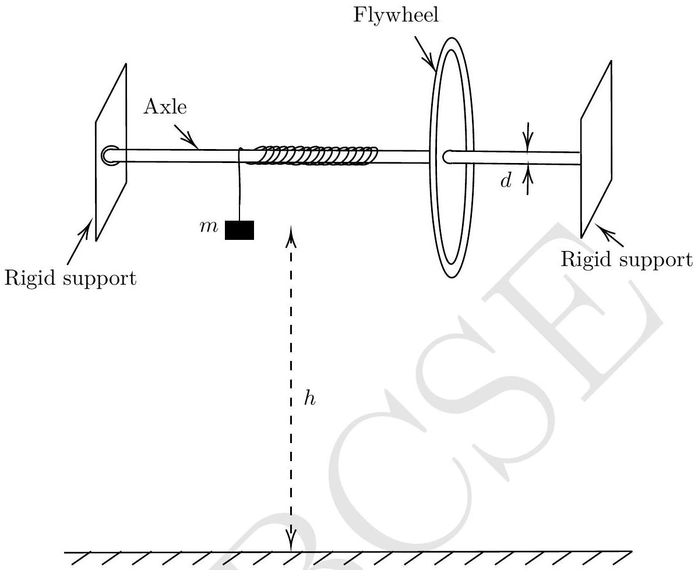
From the instant when the mass touches the floor (taken as $t = 0$ ), the flywheel continues to rotate, adding another $N$ number of rotations before coming to rest in time $t = T$. The figure is not to scale.

(a) [5 marks] Derive an expression for the moment of inertia $I$ of the flywheel in terms of $m , N , T$, and other known parameters.

Solution: Using conservation of energy

$$
\begin{equation*}
m g h = n W + \frac { 1 } { 2 } m v ^ { 2 } + \frac { 1 } { 2 } I \omega ^ { 2 } \tag{1.1}
\end{equation*}
$$

Also,

$$
\begin{array} { r }
N W = \frac { 1 } { 2 } I \omega ^ { 2 } \\
W = \frac { I \omega ^ { 2 } } { 2 N } \tag{1.3}
\end{array}
$$

Substituting Eq.(1.3) in Eq.(1.1), we get

$$
\begin{equation*}
m g h = n \cdot \frac { 1 } { 2 N } I \omega ^ { 2 } + \frac { 1 } { 2 } m v ^ { 2 } + \frac { 1 } { 2 } I \omega ^ { 2 } \tag{1.4}
\end{equation*}
$$

Simplifying above equation we get,

$$
\begin{equation*}
I = \frac { 2 m g h } { \omega ^ { 2 } \left( 1 + \frac { n } { N } \right) } - \frac { m d ^ { 2 } } { 4 \left( 1 + \frac { n } { N } \right) } \tag{1.5}
\end{equation*}
$$

where $\omega = \frac { 4 \pi N } { T }$
Final answers written in the form of $W$ are also accepted.

(b)[3 marks] The following data has been obtained in this experiment.

| $m$ (gm) | $N$ | $T$ (sec) |
| :--- | :--- | :--- |
| 150.0 | 145.25 | 190.0 |
| 200.0 | 200.00 | 225.5 |
| 250.0 | 238.50 | 235.5 |

Calculate the value of $I$ for $n = 16$, and $h = 139 \mathrm {~cm}$.
Solution: From the given data, we can calculate the respective value of the moment of inertia $I _ { 1 } , I _ { 2 } , I _ { 3 }$ are $3.99 \times 10 ^ { 5 } \mathrm { gm } - \mathrm { cm } ^ { 2 } , 4.06 \times 10 ^ { 5 } \mathrm { gm } - \mathrm { cm } ^ { 2 } , 3.94 \times 10 ^ { 5 } \mathrm { gm } - \mathrm { cm } ^ { 2 }$. The mean value of the moment of inertia is $4.00 \times 10 ^ { 5 } \mathrm { gm } - \mathrm { cm } ^ { 2 }$.

## 2. Gearminator: Rise of the Machines

We consider a "thought experiment" involving a DC motor and a DC generator coupled mechanically through a gearbox, operating under idealized conditions, to explore the power output and efficiency of the system (see schematic figure below). The schematic gearbox assembly is also shown in the figure.
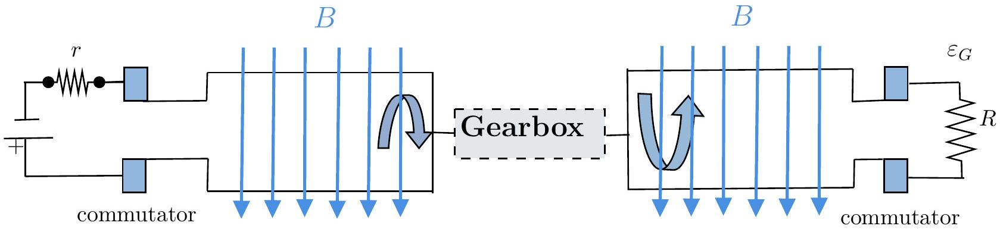

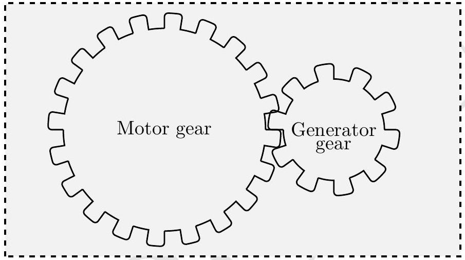
Gearbox

Both the motor and the generator have $N$ loops of area $A$ and rotate in a uniform magnetic field of strength $B$. As usual, both the motor and the generator use commutators (indicated by the blue blocks) to reverse the direction of current in each arm every half cycle, to ensure unidirectional output. The generator is connected to an external resistance $R$, and the motor is driven by a constant voltage $V _ { M }$ with an internal resistance $r$. The gearbox is idealized, with no energy loss due to friction or otherwise, and no slipping between the teeth of the gears. For a pair of meshing gears, as shown above, the angular speed ratio, also known as the gear ratio $X$, is defined as:

$$
X = \frac { \omega _ { M } } { \omega _ { G } } ,
$$

where $\omega _ { M }$ and $\omega _ { G }$ are the angular velocities of the motor and the generator, respectively. Let $\left\langle P _ { G } \right\rangle$, and $\left\langle P _ { M } \right\rangle$ be the time-averaged generator output power and the time-averaged motor input power, respectively, over one complete cycle.

(a) [ $\mathbf { 6 }$ marks] Derive the expression for $\omega _ { G }$ in terms of $X , R , r$, and the given parameters. For fixed values of $r$ and $R$, determine the expression of $X$ for which $\omega _ { G }$ is maximum.

Solution: First, we analyze motor equations:
Applying voltage $V _ { M }$ drives the motor. The current $I _ { M }$ and and the angular speed $\omega _ { M }$ are determined through the following equations.

- The circuit equation for motor with speed $\omega _ { M }$ is
$$
\begin{equation*}
V _ { M } - \epsilon _ { b M } - I _ { M } r = 0 \tag{2.1}
\end{equation*}
$$

where $\epsilon _ { b M } = N A B \omega _ { M } \sin \left( \omega _ { M } t \right)$ is the induced back emf. Thus, the current $I _ { M }$ is

$$
\begin{equation*}
I _ { M } = \frac { 1 } { r } \left( V _ { M } - N B A \omega _ { M } \sin \left( \omega _ { M } t \right) \right) \tag{2.2}
\end{equation*}
$$

- The magnetic torque on the coils carrying current $I _ { M }$ is

$$
\begin{align*}
\tau _ { M } & = N I _ { M } B A \sin \left( \omega _ { M } t \right)  \tag{2.3}\\
& = \frac { 1 } { r } \left( V _ { M } N B A \sin \left( \omega _ { M } t \right) - N ^ { 2 } B ^ { 2 } A ^ { 2 } \omega _ { M } \sin ^ { 2 } \left( \omega _ { M } t \right) \right) \tag{2.4}
\end{align*}
$$

The Gearbox is massless, and there is no loss of power. Thus,

$$
\begin{equation*}
\tau _ { M } \omega _ { M } = \tau _ { G } \omega _ { G } \Rightarrow \tau _ { G } = X \tau _ { M } \tag{2.5}
\end{equation*}
$$

For generator: Gearbox drives the motor with torque $\tau _ { G }$. The current $I _ { G }$ and and the angular speed $\omega _ { G }$ are determined through the following equations.

- The circuit equation for generator with speed $\omega _ { G }$ is
$$
\begin{equation*}
e _ { b G } - I _ { G } R = 0 \tag{2.6}
\end{equation*}
$$
where $\epsilon _ { b G } = N A B \omega _ { G } \sin \left( \omega _ { G } t \right)$ is the induced back emf. Thus, the current $I _ { G }$ is
$$
\begin{equation*}
I _ { G } = \frac { 1 } { R } N B A \omega _ { G } \sin \left( \omega _ { G } t \right) \tag{2.7}
\end{equation*}
$$

- The magnetic torque on the coils carrying current $I _ { G }$ is

$$
\begin{align*}
\tau _ { G } & = N I _ { G } B A \sin \left( \omega _ { G } t \right) \\
& = \frac { 1 } { R } N ^ { 2 } B ^ { 2 } A ^ { 2 } \omega _ { G } \sin ^ { 2 } \left( \omega _ { G } t \right) \tag{2.8}
\end{align*}
$$

Since there is no dissipation in the gearbox, from Eq. (2.5), we get

$$
\begin{equation*}
\left\langle \tau _ { G } \right\rangle = \left\langle \tau _ { M } \right\rangle X \tag{2.9}
\end{equation*}
$$

From Eq. (2.8)

$$
\begin{equation*}
\left\langle \tau _ { G } \right\rangle = \frac { N ^ { 2 } B ^ { 2 } A ^ { 2 } \omega _ { G } } { 2 R } \tag{2.10}
\end{equation*}
$$

Since $\left\langle \sin ^ { 2 } ( \omega t ) \right\rangle = 1 / 2$ over one complete cycle, and from Eq. (2.4)

$$
\begin{equation*}
\left\langle \tau _ { M } \right\rangle = \frac { 2 V _ { M } N B A } { \pi r } - \frac { N ^ { 2 } B ^ { 2 } A ^ { 2 } \omega _ { M } } { 2 r } \tag{2.11}
\end{equation*}
$$

Since $\left\langle \sin ^ { 2 } ( \omega t ) \right\rangle = 1 / 2$, and $\langle \sin ( \omega t ) \rangle = 2 / \pi$ over one complete cycle. Using Eq. (2.9), we obtain

$$
\begin{gather*}
\frac { \omega _ { G } } { R } = \frac { \left( 4 V _ { M } / \pi N B A \right) X } { r } - \frac { X ^ { 2 } \omega _ { G } } { r }  \tag{2.12}\\
\omega _ { G } \left( \frac { 1 } { R } + \frac { X ^ { 2 } } { r } \right) = \left( \frac { 4 V _ { M } } { \pi N B A } \right) \frac { X } { r }  \tag{2.13}\\
\omega _ { G } = \left( \frac { 4 V _ { M } } { \pi N B A } \right) \frac { 1 } { \left( \frac { r } { X R } + X \right) } \tag{2.14}
\end{gather*}
$$

To maximize $\omega _ { G }$, minimize the denominator $r / R X + X$. Differentiating:

$$
\begin{gather*}
\frac { d } { d X } \left( \frac { r } { R X } + X \right) = 0  \tag{2.15}\\
- \frac { r } { R X ^ { 2 } } + 1 = 0  \tag{2.16}\\
\Rightarrow X = \sqrt { \frac { r } { R } } \tag{2.17}
\end{gather*}
$$

(b) [3 marks] Derive the expression for the generator output power $\left\langle P _ { G } \right\rangle$ in terms of $X , R , r$, and the given parameters. For fixed values of $r$ and $R$, determine the expression of $X$ for which $\left\langle P _ { G } \right\rangle$ is maximum.
Solution: The generator output power is
$$
\begin{array} { r }
\left\langle P _ { G } \right\rangle = \frac { \left\langle \epsilon _ { G } ^ { 2 } \right\rangle } { R } = \frac { N ^ { 2 } B ^ { 2 } A ^ { 2 } \omega _ { G } ^ { 2 } } { 2 R } \\
\left\langle P _ { G } \right\rangle = \frac { 8 V _ { M } ^ { 2 } } { \pi ^ { 2 } R \left( \frac { r } { X R } + X \right) ^ { 2 } }
\end{array}
$$
To maximize $\left\langle P _ { G } \right\rangle$, differentiate with respect to $X$ and solve for $X$
$$
\begin{equation*}
X = \sqrt { \frac { r } { R } } \tag{2.18}
\end{equation*}
$$
(c) [5 marks] For fixed values of $r$ and $R$, determine the condition on $X$ for which the efficiency $\eta$ is maximum, where
$$
\eta = \frac { \left\langle P _ { G } \right\rangle } { \left\langle P _ { M } \right\rangle } .
$$
Calculate this maximum value of $\eta$.

Solution: The motor input power is:

$$
\begin{align*}
\left\langle P _ { M } \right\rangle & = \left\langle V _ { M } I _ { M } \right\rangle  \tag{2.19}\\
& = \left\langle \frac { V _ { M } } { r } \left( V _ { M } - N B A \omega _ { M } \sin \left( \omega _ { M } t \right) \right) \right\rangle  \tag{2.20}\\
& = \frac { V _ { M } } { r } \left( V _ { M } - \frac { 2 } { \pi } N B A X \omega _ { G } \right)  \tag{2.21}\\
& = \frac { V _ { M } ^ { 2 } } { r } \left( 1 - \left( \frac { 8 } { \pi ^ { 2 } } \right) \frac { 1 } { \left( \frac { r } { X ^ { 2 } R } + 1 \right) } \right) \tag{2.22}
\end{align*}
$$

and

$$
\begin{equation*}
\left\langle P _ { G } \right\rangle = \frac { 8 V _ { M } ^ { 2 } } { \pi ^ { 2 } R \left( \frac { r } { X R } + X \right) ^ { 2 } } \tag{2.23}
\end{equation*}
$$

The efficiency is given by:

$$
\begin{equation*}
\eta = \frac { \left\langle P _ { G } \right\rangle } { \left\langle P _ { M } \right\rangle } \tag{2.24}
\end{equation*}
$$

Substituting the expressions for $\left\langle P _ { G } \right\rangle$ and $\left\langle P _ { M } \right\rangle$, maximize $\eta$ with respect to $X$, we get

$$
\begin{equation*}
X _ { \max } \approx 1.52 \sqrt { \frac { r } { R } } \tag{2.25}
\end{equation*}
$$

At this $X$, efficiency $\eta$ is maximum. The maximum value of $\eta$ can be calculated by substituting value $X _ { \text {max } }$ in $\eta$.

$$
\begin{equation*}
\eta _ { \max } \approx 0.4 \tag{2.26}
\end{equation*}
$$

3. Love is in the air

A thermodynamic cycle is performed for one mole of an ideal monoatomic gas. The representation of this cycle is in the shape of a "heart" in the volume $( V )$ - temperature $( T )$ graph (shown as the shaded area below). However, neither of the axes are provided in the graph. The graph is drawn to scale with 1 cm along the $V$-axis representing 4 litre, and 1 cm along the $T$-axis representing 80 K.

It is given that the pressure at the point $X$ is minimum for the whole cycle, with the temperature and volume at this point being $T _ { X } = 224 \mathrm {~K}$ and $V _ { X } = 24$ litre.

(a) [13 marks] Draw both the $V$ and $T$ axes to scale in the same diagram given in the Summary Answersheet. Indicate the origin by "O". Justify your answer in the detailed answersheet. You are given one extra answer box in the answersheet, in case of any mistake in the first.

Solution: We begin with the ideal gas law:

$$
\begin{equation*}
P V = n R T \tag{3.1}
\end{equation*}
$$

Differentiating with respect to volume, $V$, we get:

$$
\begin{align*}
P + V \frac { d P } { d V } & = n R \frac { d T } { d V }  \tag{3.2}\\
\frac { R T } { V } + V \frac { d P } { d V } & = n R \frac { d T } { d V }  \tag{3.3}\\
T & = n \frac { d T } { d V } V - \frac { V ^ { 2 } } { R } \frac { d P } { d V } \tag{3.4}
\end{align*}
$$

At points of extreme pressure (maxima or minima), we have $\frac { d P } { d V } = 0$. Equation (3.4) then simplifies to:

$$
\begin{equation*}
T = n \frac { d T } { d V } V \tag{3.5}
\end{equation*}
$$

This implies that the tangent drawn to the $T - V$ curve at these extreme pressure points must pass through the origin of the $T - V$ graph. Let's denote the origin as point O. Point X represents a pressure minimum (as given), and we need to find points where pressure is maximum.
We are given the volume $V _ { X } = 24 \mathrm {~L}$, which scales to 6 cm on the graph, and the temperature $T _ { X } = 224 \mathrm {~K}$, which scales to 2.8 cm. Using these scaled values, the distance OX can be calculated as:

$$
\begin{equation*}
O X = \sqrt { V _ { X } ^ { 2 } + T _ { X } ^ { 2 } } = \sqrt { 6 ^ { 2 } + 2.8 ^ { 2 } } \approx 6.6 \mathrm {~cm} \tag{3.6}
\end{equation*}
$$

From Equation (3.4), for $n = 1$, at point X, we have

$$
\begin{equation*}
\left. \frac { d T } { d V } \right| _ { X } = \frac { T _ { X } } { V _ { X } } \tag{3.7}
\end{equation*}
$$

The slope of the tangent at X with respect to the volume axis is given by:

$$
\frac { d T } { d V } = \tan ( \theta ) = \frac { T _ { X } } { V _ { X } } = \frac { 2.8 } { 6 }
$$

Thus, the angle the tangent makes with the volume axis, $\theta$, is:

$$
\theta = \arctan \left( \frac { 2.8 } { 6 } \right) \approx 25 ^ { \circ }
$$

To draw the axes:

1. Draw a tangent line to the curve at point X.
2. Locate the origin (O) at a distance of 6.6 cm from point X on the tangent line. This means there are two possible locations for the origin, one on either side of X along the tangent.
3. Draw the volume (V) axis by drawing a line passing through O that makes an angle of approximately 25° with the tangent line at X.
4. Draw the temperature (T) axis by drawing a line perpendicular to the V axis and passing through the origin (O).

Note that the axes are oriented such that no part of the cycle falls into the negative $T$ or $V$ quadrants.
We therefore have two possible sets of axes, corresponding to the two possible origins. The solutions are displayed below, and either answer will be accepted. Origins are marked here by $O _ { 1 }$ and $O _ { 2 }$.

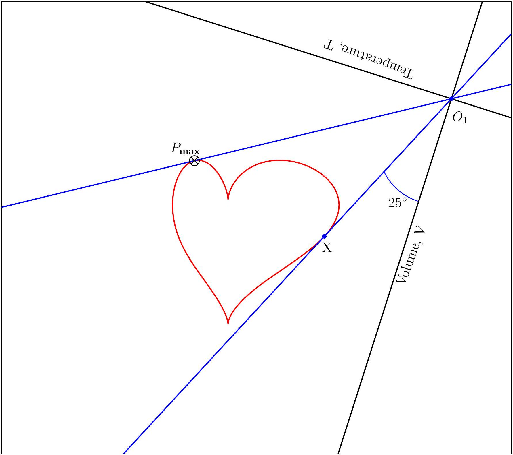

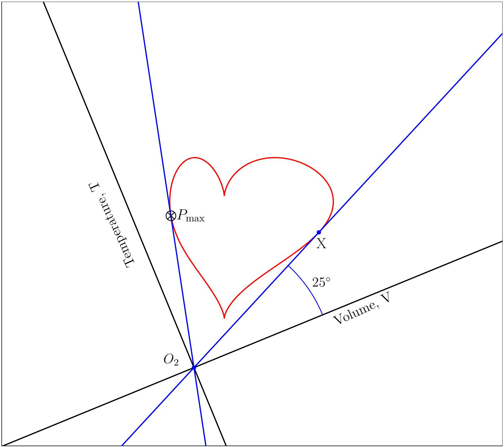

(b)[3 marks] For the axes and origin you have drawn, indicate the point(s) on the graph where the pressure is/are maximum in the cycle by ⊗ and label it as $P _ { \text {max } }$ on the curve. Determine the value of the maximum pressure.
Solution: Once the axes are drawn, our next goal is to identify the point, which we call $P _ { \text {max } }$, where the slope of the tangent line to the curve is maximized and this tangent line passes through the origin. In other words, we seek the point on the $T - V$ curve with the steepest tangent that extends back to the origin.
Having located point $P _ { \text {max } }$, we can then determine its coordinates in "cm" as measured on our defined axes. Multiplying these coordinate values by the corresponding scale factors for temperature and volume will give the volume and temperature in L and K respectively. Then we can use ideal gas law to obtain the maximum pressure on these points.
The point $P _ { \text {max } }$ where the pressure is maximum is indicated in both the possible axes.
Exact numerical values for these parameters are provided in the table below. Answers within a reasonable tolerance will be considered acceptable.

| Origin | Coordinates $( V , T )$ |  | Values $( V , T )$ |  | Pressure value (atm) |
| :--- | :--- | :--- | :--- | :--- | :--- |
| $O _ { 1 }$ | 4.8 cm | 8.0 cm | 19.2 L | 640.0 K | 2.7 (accetable range is 2.4 to 2.8) |
| $O _ { 2 }$ | 1.3 cm | 5.4 cm | 5.2 L | 432.0 K | 6.8 (accetable range is 6.3 to 7.5) |

## 4. The Magnetic Black Box (MBB)

A magnetometer is a Hall-effect-based sensor that measures the magnetic field at its location. In the figure below, a magnetometer is located somewhere inside a closed "magnetic black box" (which we shall henceforth refer to as MBB) of negligible thickness. Fig. (1) gives a top view, where the red rectangle depicts the MBB. The plane of the rectangle is taken as the $x - y$ plane of coordinates, with the origin O taken at the top right corner. The unknown location of the magnetometer is denoted by the coordinates $\left( x _ { 0 } , y _ { 0 } \right)$. For example, it could be located at the position marked by - inside the MBB. Note that the actual location of the magnetometer inside the MBB may be different from that in the figure; this is true for all subsequent figures in this problem as well.

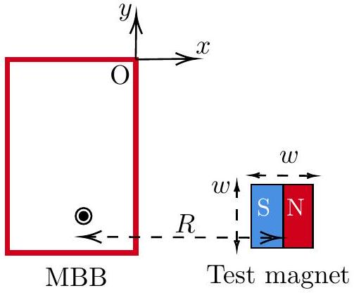
Figure 1: Schematic representation of the magnetic black box (MBB) and a test magnet.

The components $B _ { x } , B _ { y }$ and $B _ { z }$ of the magnetic field measured by the magnetometer depend on the strength and the orientation of the magnetic dipole moment, of a magnet positioned nearby and the distance $R$ between the center of the magnet and the magnetometer. The effect of the Earth's magnetic field is neglected throughout this problem.

Vanya is performing an experiment using the MBB. She has to first locate the exact position of the magnetometer inside the MBB. She has a cubical test magnet of side length $w = 10 \mathrm {~mm}$ (see Fig. (1)) and unknown dipole strength $\vec { P }$.

She places the MBB on a wooden table. Then she records the magnetic field values displayed by the magnetometer as the test magnet is moved either parallel to the $y$-axis while keeping $x$ fixed (vertical scan) or parallel to the $x$-axis while keeping $y$ fixed (horizontal scan) as shown in Fig. (2). The magnitudes of the distances, $r _ { x }$ and $r _ { y }$, measured from the center of the magnet, are also shown in the figure.

For each scan, Vanya also tries different orientations of the magnet by aligning the dipole moment vector $\vec { P }$ either parallel or anti-parallel to the $y$-axis or $x$-axis. The different orientations (I to IV) are shown in Fig. (3). During the experiment, assume that the magnetometer location and the magnet's center are at the same height (i.e., their $z$-coordinates are always the same).

The graphs in Fig. (4) display the variation of the magnetic field $B _ { x }$ for four of the vertical and horizontal scans (denoted by A, B, C, D) with certain combinations of the orientations.

(a) [7 marks] Based on the above plots, identify which orientations (I-IV) these curves belong to. To indicate your answer, fill in the table in the answersheet. Determine the coordinates $\left( x _ { 0 } , y _ { 0 } \right)$ of the magnetometer's position. You must justify your answers.

Solution: Let us understand this by an example when conducting a horizontal scan with the magnet in orientation IV, the behavior of the $B _ { x }$ component of the magnetic field varies as follows:

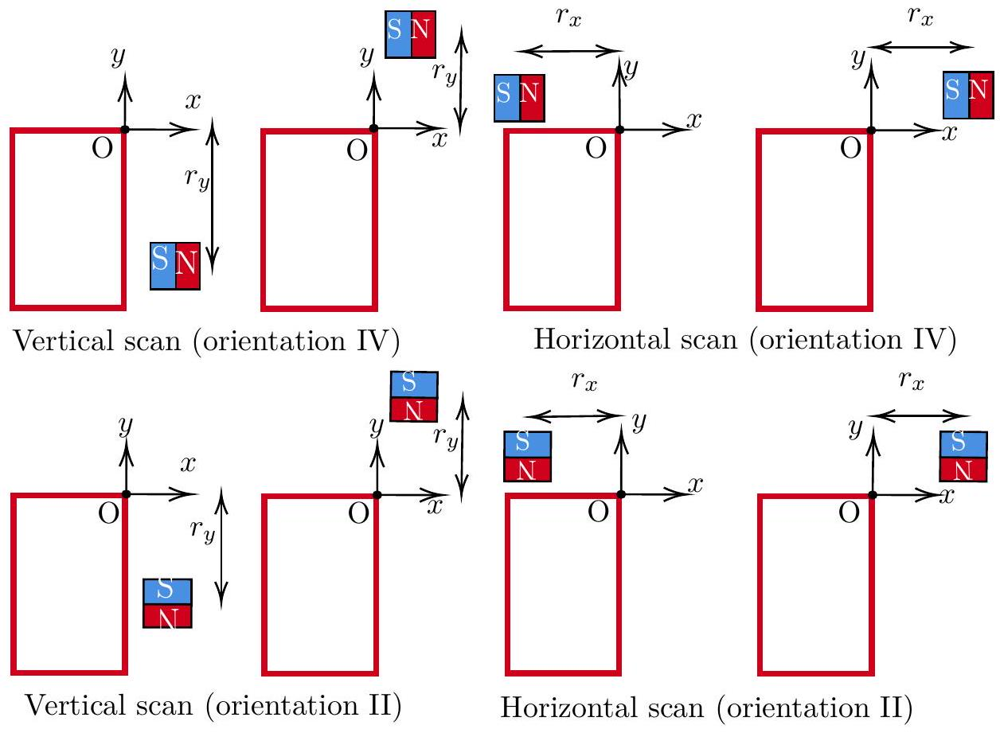
Figure 2: Some of the configurations of the vertical and horizontal scans as seen from the top. See Fig. (3) for the explanation of orientations.

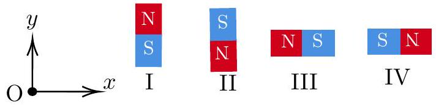
Figure 3: Different orientations of the test magnet

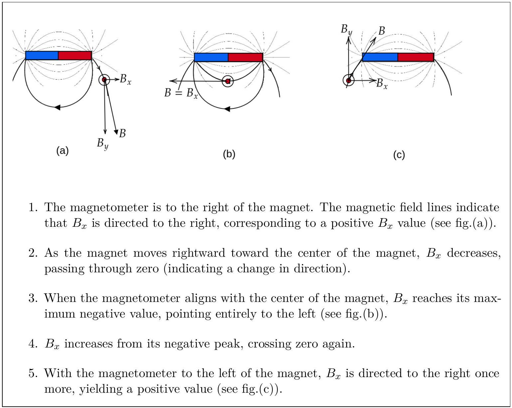

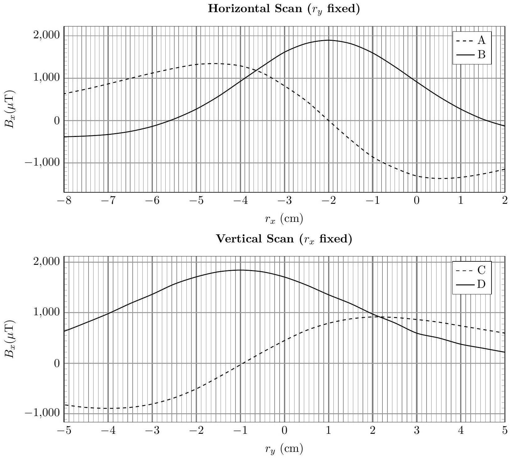
Figure 4

This progression results in a $B _ { x }$ vs. $r _ { x }$ plot that starts with a positive value at (a), descends to a negative peak at (b), and returns to a positive value at (c). This is qualitatively depicted in the figure below.
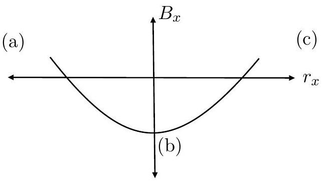
Orientation III will produce a graph that is the exact opposite of the previous one, with the signs of $B _ { x }$ reversed, as the dipole vector is now aligned in the $- x$ direction.

Let us consider another example with Orientation I, as shown in the figure below.

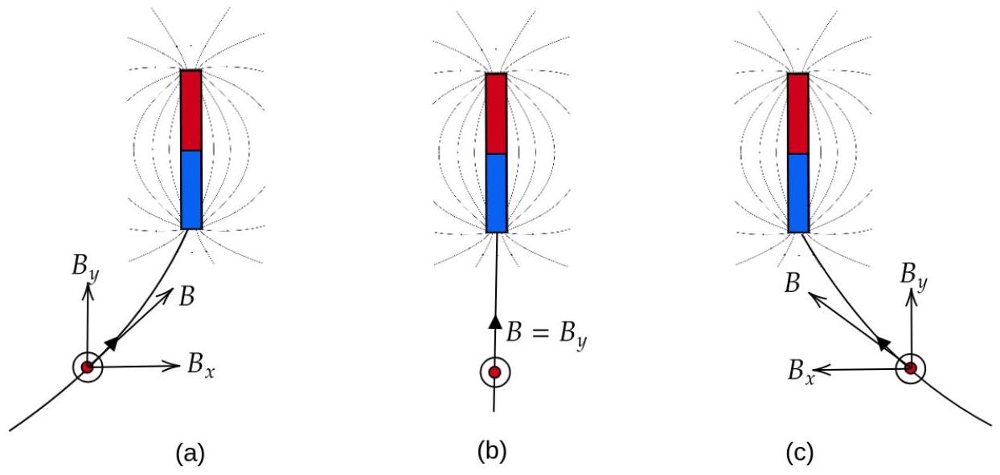
In this case, $B _ { x }$ is positive when the magnet is to the right of the magnetometer (a), zero when the center of the magnet aligns with the magnetometer (b), and negative (pointing left) when the magnet is to the left of the magnetometer (c). This is qualitatively depicted in the figure below.
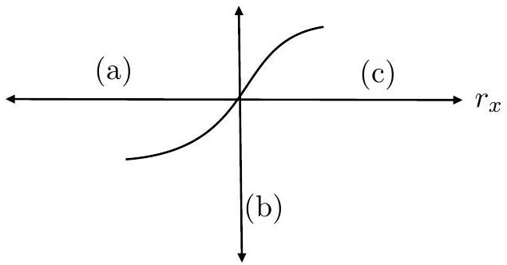
Orientation II will be just the opposite of Orientation I.
Similarly, we can analyze the vertical scan graphs. In this case, $B _ { x }$ will vary like $B _ { y }$ in the horizontal scan. Therefore, you can change the axis symbols in the diagrams above to reflect this adjustment for the vertical scan.
Considering the above analysis, we can summarize the results in the table below.

| Scan | Plot | Orientation |
| :--- | :--- | :--- |
| Horizontal scan | A | II |
|  | B | III |
| Vertical scan | C | I |
|  | D | IV |

Magnetometer coordinates:
The magnet's centre aligns with the magnetometer when the graph B peaks during the horizontal scan. This happens at $r _ { x } = - 2 \mathrm {~cm}$. At this position, the magnet's centre is located at -2 cm, which corresponds to the $x$-coordinate of the magnetometer. Similarly, the vertical scan provides the $y$-coordinate of the magnetometer, which is found to be -1 cm.
Coordinates of magnetometer are: (-2 , -1)cm

(b) Vanya is given two cuboidal magnetic sets M1 and M2, each constructed using two identical cubic magnets (of side length $w = 10 \mathrm {~mm}$ ). In set M1, two magnets, each of dipole moment $P ^ { \prime }$, are joined in an attractive configuration. In set M2, the magnets are joined in a repulsive configuration using a strong adhesive. Thus, each magnetic set has a length of $2 w$ (as shown

in Fig. (5)).

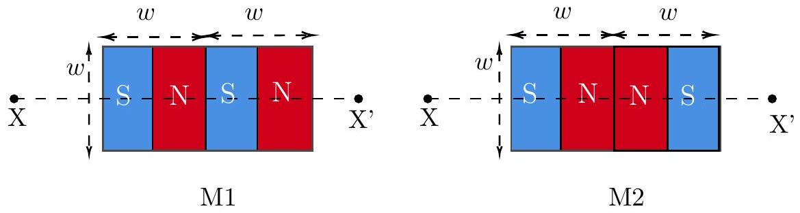
Figure 5: Magnetic sets M1 and M2. Here $w = 10 \mathrm {~mm}$.

Vanya aligns the central axis (XX' in Fig. (5)) of one magnetic set M1 or M2 such that the central axis passes through the magnetometer and is parallel to the $x$-axis. A representation of the setup is shown in Fig. 6. By keeping the $y$-coordinate fixed at $y _ { 0 }$, Vanya moves the

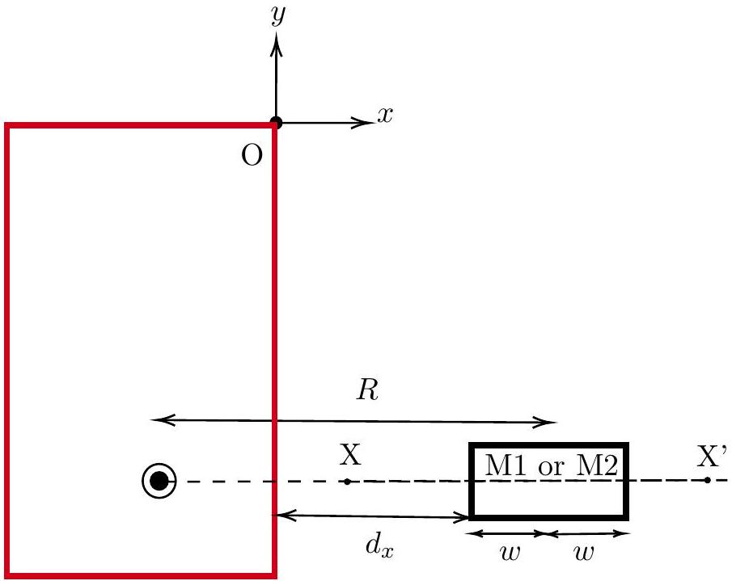
Figure 6: Setup for measuring the dipole moment.

magnetic set parallel to the $x$-axis. The distance from the magnetometer to the midpoint of the magnetic set is $R$. For each position, she measures the distance $d _ { x }$ (the distance from the face of the MBB to the nearest edge of the magnetic set) and the corresponding magnetic field component, $B _ { x }$.

i. [5 marks] For the case of $R \gg w$, obtain expressions for the net magnetic field $B$ at the magnetometer due to M1 and M2 in terms of $R , w , P ^ { \prime }$, and other constants. You may assume that each individual magnet can be modelled as a pair of magnetic monopoles separated by a distance $w$.

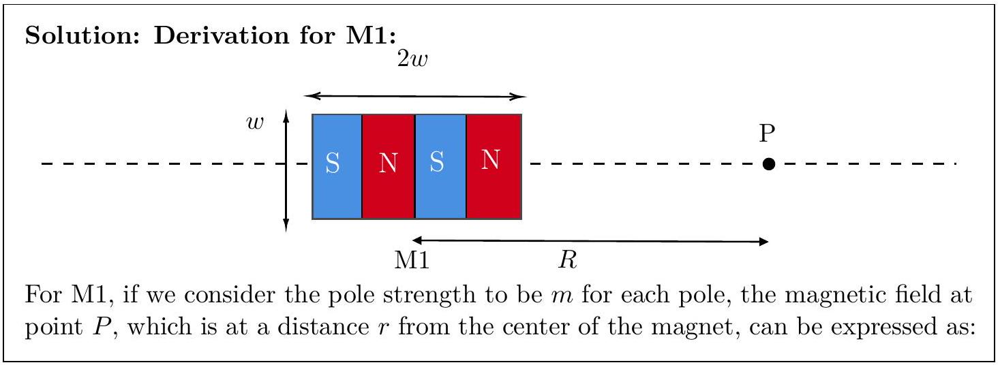

$$
\begin{aligned}
& B = \frac { \mu _ { 0 } } { 4 \pi } \left( - \frac { m } { ( R + w ) ^ { 2 } } + \frac { m } { R ^ { 2 } } - \frac { m } { R ^ { 2 } } + \frac { m } { ( R - w ) ^ { 2 } } \right) \\
& B = \frac { \mu _ { 0 } m } { 4 \pi R ^ { 2 } } \left( - \left( 1 + \frac { w } { R } \right) ^ { - 2 } + \left( 1 - \frac { w } { R } \right) ^ { - 2 } \right)
\end{aligned}
$$

We can use the approximation $\frac { w } { R } \ll 1$ and simplify the expression up to the third order term in $w / R$ :

$$
\begin{equation*}
B \approx - \frac { \mu _ { 0 } m } { 4 \pi R ^ { 2 } } \left( \left( 1 - \frac { 2 w } { R } + \frac { 3 w ^ { 2 } } { R ^ { 2 } } \right) - \left( 1 + \frac { 2 w } { R } + \frac { 3 w ^ { 2 } } { R ^ { 2 } } \right) \right) \tag{4.1}
\end{equation*}
$$

$$
\begin{equation*}
B = 4 \frac { \mu _ { 0 } P ^ { \prime } } { 4 \pi R ^ { 3 } } \tag{4.2}
\end{equation*}
$$

where $P ^ { \prime } = m w$ is the dipole moment of the individual magnets in M1.
Similarly for M2:
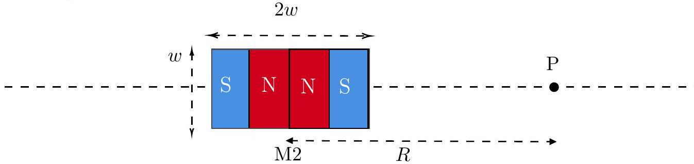
the magnetic field at $P$ due to the individual poles can be written as:

$$
\begin{aligned}
& B = \frac { \mu _ { 0 } } { 4 \pi } \left( - \frac { m } { ( R + w ) ^ { 2 } } + \frac { m } { R ^ { 2 } } + \frac { m } { R ^ { 2 } } - \frac { m } { ( R - w ) ^ { 2 } } \right) \\
& B = \frac { \mu _ { 0 } m } { 4 \pi R ^ { 2 } } \left( - \left( 1 + \frac { w } { R } \right) ^ { - 2 } + 2 - \left( 1 - \frac { w } { R } \right) ^ { - 2 } \right)
\end{aligned}
$$

Keeping only up to the $( w / R ) ^ { 3 }$ terms:

$$
\begin{equation*}
B = \frac { \mu _ { 0 } m } { 4 \pi R ^ { 2 } } \left( - \left( 1 - \frac { 2 w } { R } + \frac { 3 w ^ { 2 } } { R ^ { 2 } } \right) + 2 - \left( 1 + \frac { 2 w } { R } + \frac { 3 w ^ { 2 } } { R ^ { 2 } } \right) \right) \tag{4.3}
\end{equation*}
$$

$$
\begin{equation*}
B = - 6 \frac { \mu _ { 0 } P ^ { \prime } w } { 4 \pi R ^ { 4 } } \tag{4.4}
\end{equation*}
$$

where $P ^ { \prime }$ is the dipole moment of the individual magnets used in $M _ { 2 }$.
ii. [10 marks] One set of Vanya's data is presented in the table below.

| $d _ { x } ( \mathrm {~cm} )$ | $B _ { x } ( \mu \mathrm {~T} )$ | $d _ { x } ( \mathrm {~cm} )$ | $B _ { x } ( \mu \mathrm {~T} )$ |
| :--- | :--- | :--- | :--- |
| 2.1 | -1359 | 3.1 | -646 |
| 2.3 | -1168 | 3.3 | -563 |
| 2.5 | -1001 | 3.5 | -493 |
| 2.7 | -855 | 3.7 | -447 |
| 2.9 | -743 | 3.9 | -398 |

Plot a suitable linear graph to analyze the data, and from the graph, identify whether the data belongs to M1 or M2. Justify your answer. From the same linear plot (or a different one), calculate $P ^ { \prime }$ of the individual magnets used in constructing the magnetic set.

Solution: Linearizing the data for M2:
If we take the logarithm of Eqs. (4.2) and (4.4), we obtain:

$$
\begin{align*}
& \ln | B | = 3 \ln R + \ln \left( \frac { 4 P ^ { \prime } \mu _ { 0 } } { 4 \pi } \right)  \tag{4.5}\\
& \ln | B | = 4 \ln R + \ln \left( \frac { 6 P ^ { \prime } w \mu _ { 0 } } { 4 \pi } \right) \tag{4.6}
\end{align*}
$$

Thus, a plot of $\ln | B |$ vs. $\ln R$ will be linear, and the slope of this plot will indicate whether the dataset corresponds to M1 or M2.
Updated dataset after adjusting the lengths

| $R = \left\| x _ { 0 } \right\| + d _ { x } + w ( \mathrm {~cm} )$ | $\| B \| ( \mu \mathrm { T } )$ | $\ln R$ | $\ln B$ |
| :--- | :--- | :--- | :--- |
| 5.1 | 1359 | -2.975 | -6.60 |
| 5.3 | 1168 | -2.937 | -6.75 |
| 5.5 | 1001 | -2.900 | -6.91 |
| 5.7 | 855 | -2.864 | -7.06 |
| 5.9 | 743 | -2.830 | -7.20 |
| 6.1 | 646 | -2.797 | -7.34 |
| 6.3 | 563 | -2.764 | -7.48 |
| 6.5 | 493 | -2.733 | -7.62 |
| 6.7 | 447 | -2.703 | -7.71 |
| 6.9 | 398 | -2.673 | -7.83 |

The graph is plotted on the Pg. 19.
The slope of the graph = 4.08.
Which indicates that the dataset corresponds to M2.
The intercept of the graph is $\ln \left( \frac { 6 P ^ { \prime } w \mu _ { 0 } } { 4 \pi } \right) = 18.74 \Rightarrow P ^ { \prime } = 1.21 \mathrm {~A} \cdot \mathrm {~m} ^ { 2 }$.
The acceptable range of $P ^ { \prime }$ is: $1.00 - 2.00 \mathrm {~A} \cdot \mathrm {~m} ^ { 2 }$

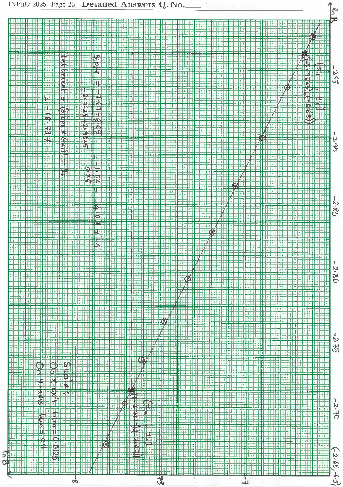

5. Metalens

A metasurface is a two-dimensional, ultra-thin optical structure consisting of an array of nanospaced optical nano-elements (also known as meta-atoms) on a flat surface (typically an ultra-thin glass plate). The primary function of the nano-elements is to locally introduce a phase shift $\phi ( \overrightarrow { \mathbf { r } } )$ to the wave, incident at position $\overrightarrow { \mathbf { r } }$. This function, $\phi ( \overrightarrow { \mathbf { r } } )$, is called the phase profile of the metasurface.
Metalens has a circular metasurface with a circularly symmetric phase profile function, $\phi ( r )$, which depends on the distance $r$ of the point from the center of the metalens (see figure below). This type of metalens can be used for focusing incoming parallel rays to a point. Unlike normal lenses, the metalens will look just like an ultrathin circular disc.
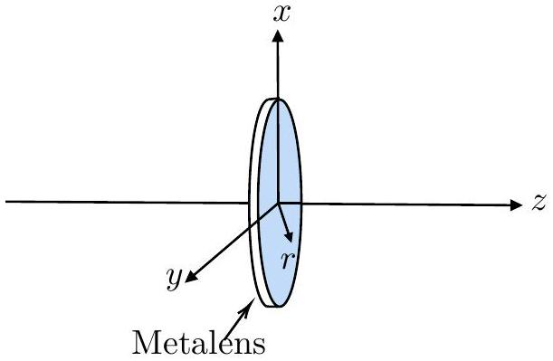
Consider two homogeneous media of refractive indices $n _ { 1 }$ and $n _ { 2 }$ separated by a metalens as shown in the figure below. Suppose a beam of plane wave is incident at point $Q$ (at distance $r$ from the pole $P$ ) on the metasurface at an angle of $\theta _ { 1 }$ from medium 1. Assume that the rays falling at $Q$ are in the plane containing $P Q$ and the axis of the lens ( $x - z$ plane). These rays will be refracted at an angle $\theta _ { 2 }$ in the medium 2. The angle of refraction $\theta _ { 2 }$ depends on $r$. Thus, the modified law of refraction for the metasurface can be written as

$$
n _ { 1 } \sin \theta _ { 1 } - n _ { 2 } \sin \theta _ { 2 } = f ( r )
$$

Similarly, the rays falling at $Q ^ { \prime }$, at a distance $r ^ { \prime }$, will be refracted by an angle $\theta _ { 2 } ^ { \prime }$.
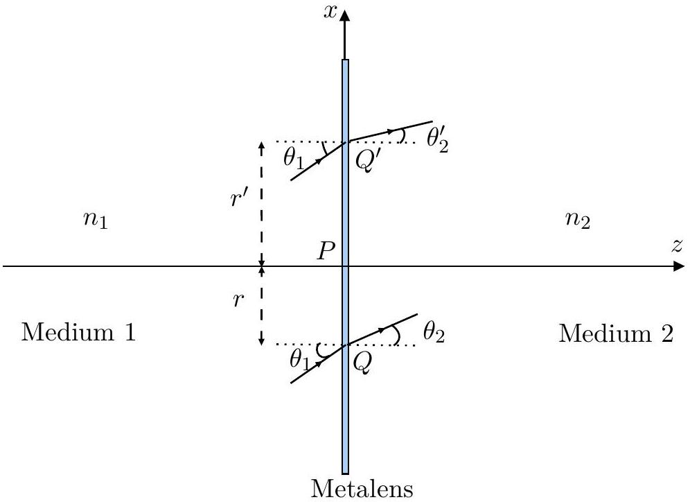

(a) [8 marks] Find $f ( r )$ in terms of $\phi ( r )$ and $k _ { o }$, the wave number of the incoming wave in a vacuum. To determine $f ( r )$, assume two rays in $x - z$ plane incident at an angle $\theta _ { 1 }$ at two infinitesimally close points, $r$ and $r + \Delta r$, are refracted by the same angle $\theta _ { 2 }$. You don't need to derive the exact functional form of $\phi ( r )$ for this part.

Solution:

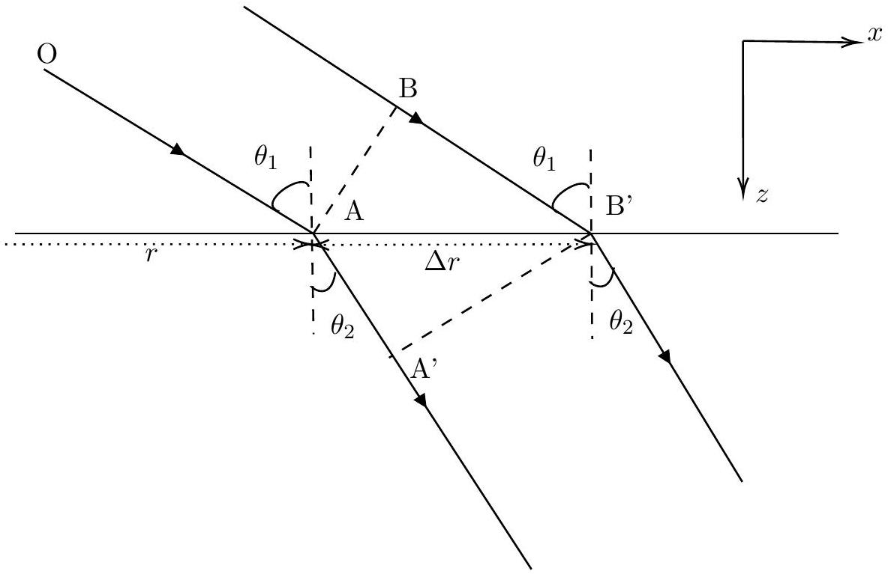
Consider two rays, which are close to each other, incident locally on metalens. The ray $O A$ is incident at an angle $\theta _ { 1 }$ at $r$ and exits in medium 2 at an angle $\theta _ { 2 }$. Similarly the ray $B B ^ { \prime }$ exits in medium 2 at an angle of $\theta _ { 2 }$ from $r + \Delta r$. The rays being very close to each other have a plane wavefront. Let wavefront AB propagate to A'B' in time $t$. Let $\psi _ { A } , \psi _ { B } , \psi _ { A ^ { \prime } }$ and $\psi _ { B ^ { \prime } }$ be phases at points $A , B , A ^ { \prime }$ and $B ^ { \prime }$ respectively. Then

$$
\begin{aligned}
& \psi _ { A ^ { \prime } } - \psi _ { A } = k _ { 2 } \Delta r \sin \theta _ { 2 } - \omega t + \phi ( r ) \\
& \psi _ { B ^ { \prime } } - \psi _ { B } = k _ { 1 } \Delta r \sin \theta _ { 1 } - \omega t + \phi ( r + \Delta r )
\end{aligned}
$$

Since these two phase differences must be equal, we get

$$
\begin{aligned}
k _ { 2 } \Delta r \sin \theta _ { 2 } - k _ { 1 } \Delta r \sin \theta _ { 1 } & = \phi ( r + \Delta r ) - \phi ( r ) \\
n _ { 2 } \sin \theta _ { 2 } - n _ { 1 } \sin \theta _ { 1 } & = \frac { 1 } { k _ { 0 } } \frac { \phi ( r + \Delta r ) - \phi ( r ) } { \Delta r } \rightarrow \frac { 1 } { k _ { 0 } } \frac { d \phi ( r ) } { d r }
\end{aligned}
$$

Alternate solution:
Time interval for the wavefront to travel from $A$ to $A ^ { \prime }$ is equal to the time taken by the wavefront to travel from $B$ to $B ^ { \prime }$.

$$
\begin{equation*}
\tau _ { A A ^ { \prime } } + \tau _ { A ^ { \prime } } = \tau _ { B B ^ { \prime } } + \tau _ { B ^ { \prime } } \tag{5.1}
\end{equation*}
$$

where $\tau _ { B B ^ { \prime } }$ is the time it takes for point B on the wavefront (traveling at speed $v _ { 1 }$ ) to reach point $\mathrm { B } ^ { \prime }$, and $\tau _ { A A ^ { \prime } }$ is the time it takes the transmitted portion of that same wavefront (traveling a speed $v _ { 2 }$ ) to reach point A' from point A. The time delays due to the metasurface at points A and B' are $\tau _ { A }$ and $\tau _ { B }$, respectively. From figure

$$
\begin{gathered}
\tau _ { A A ^ { \prime } } = \frac { 1 } { c } \Delta r n _ { 2 } \sin \theta _ { 2 } \\
\tau _ { B B ^ { \prime } } = \frac { 1 } { c } \Delta r n _ { 1 } \sin \theta _ { 1 } \\
\tau _ { A } = \frac { \phi _ { A } } { c k _ { o } } = \frac { \phi ( r ) } { c k _ { o } } \\
\tau _ { B } ^ { \prime } = \frac { \phi _ { A } } { c k _ { o } } = \frac { \phi ( r + \Delta r ) } { c k _ { o } }
\end{gathered}
$$

Substituting above terms in Eq.5.1, we get

$$
\Delta r \sin \theta _ { 2 } + \frac { \Phi ( r ) } { k _ { o } } = \Delta r \sin \theta _ { 1 } + \frac { \Phi ( r + \Delta r ) } { k _ { 0 } }
$$

Simplifying:
$$
\frac { \Phi ( r + \Delta r ) - \Phi ( r ) } { \Delta r } = \frac { 1 } { k _ { 0 } } \frac { d \Phi } { d r }
$$
This gives the relation:
$$
\frac { 1 } { k _ { 0 } } \frac { d \Phi } { d r } = n _ { 2 } \sin \theta _ { 2 } - n _ { 1 } \sin \theta _ { 1 }
$$
(b) [4 marks] Derive an expression for the phase profile $\phi ( r )$, to convert a plane wavefront to spherical wavefront, with light being focused to a point $F$ on the axis (see figure below), which is at a distance $f$ from the pole P.
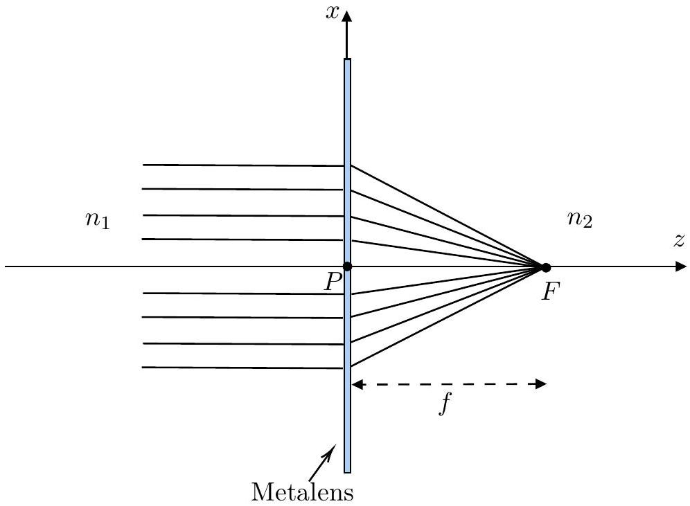

Solution: From the previous part

$$
n _ { 2 } \sin \theta _ { 2 } - n _ { 1 } \sin \theta _ { 1 } = \frac { 1 } { k _ { o } } \frac { d \phi } { d r }
$$

From the above figure, the ray arriving at $r$ (with $\theta _ { 1 } = 0$ ) must bend by an angle $\theta _ { 2 } = \sin ^ { - 1 } \left( \frac { r } { \sqrt { f ^ { 2 } + r ^ { 2 } } } \right)$. Thus,

$$
\frac { n _ { 2 } r } { \sqrt { \left( f ^ { 2 } + r ^ { 2 } \right) } } - 0 = \frac { 1 } { k _ { o } } \frac { d \phi } { d r }
$$

Simplifying above equation, we get

$$
\phi ( r ) = \pm k _ { 2 } \left( \sqrt { \left( r ^ { 2 } + f ^ { 2 } \right) } - f \right)
$$

where $k _ { 2 } = k _ { o } n _ { 2 }$

(c) [3 marks] Consider a metalens whose phase profile is obtained in part (b). For the paraxial approximation, derive an expression for the lens equation, having object distance $u$ and image distance being $v$, with focal length $f$ (see figure below).

Solution: We know that

$$
n _ { 2 } \sin \theta _ { 2 } - n _ { 1 } \sin \theta _ { 1 } = \frac { 1 } { k _ { o } } \frac { d \phi } { d r }
$$

For paraxial rays, we can use small angle approximation, $\sin \theta _ { 1 } = r / u$ and then above

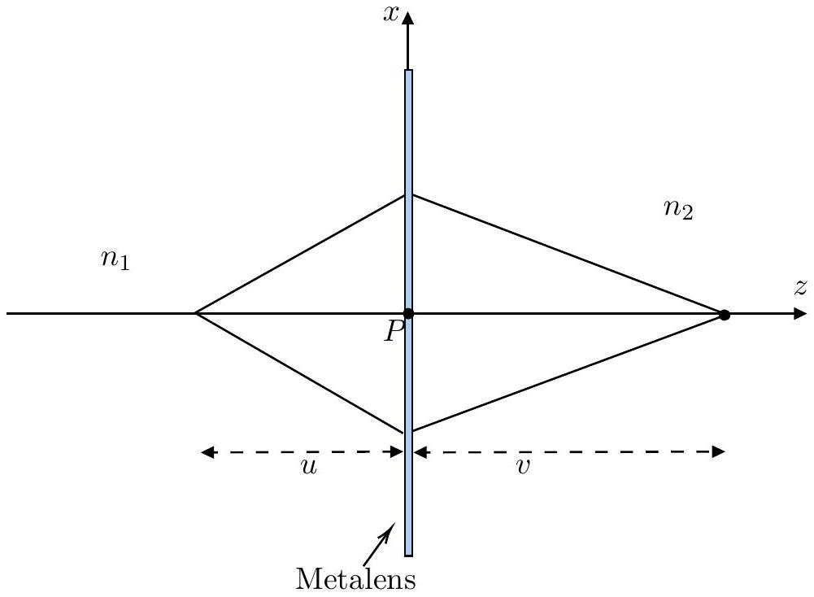
equation becomes

$$
n _ { 2 } \theta _ { 2 } - n _ { 1 } \theta _ { 1 } = \frac { 1 } { k _ { o } } \frac { d \phi } { d r }
$$

We know that

$$
\frac { 1 } { k _ { 0 } } \frac { d \phi } { d r } = \frac { n _ { 2 } r } { \sqrt { \left( r ^ { 2 } + f ^ { 2 } \right) } }
$$

For paraxial approximation, we get

$$
\frac { 1 } { k _ { 0 } } \frac { d \phi } { d r } = \frac { n _ { 2 } r } { \sqrt { \left( r ^ { 2 } + f ^ { 2 } \right) } } \approx n _ { 2 } \frac { r } { f }
$$

Using these approximations, we get

$$
\frac { n _ { 1 } } { u } + \frac { n _ { 2 } } { v } = \frac { n _ { 2 } } { f }
$$

If $n _ { 1 } = n _ { 2 }$, then the above equation becomes

$$
\begin{equation*}
\frac { 1 } { u } + \frac { 1 } { v } = \frac { 1 } { f } \tag{5.2}
\end{equation*}
$$
