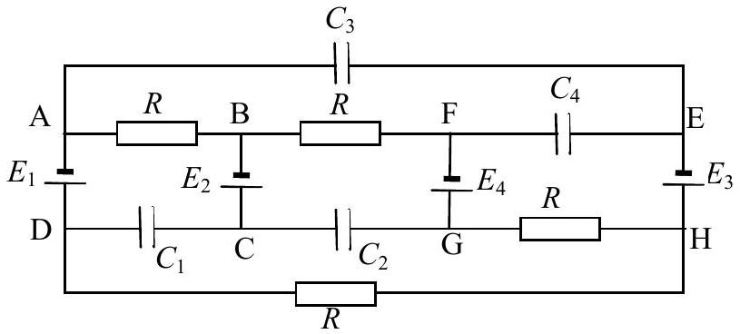
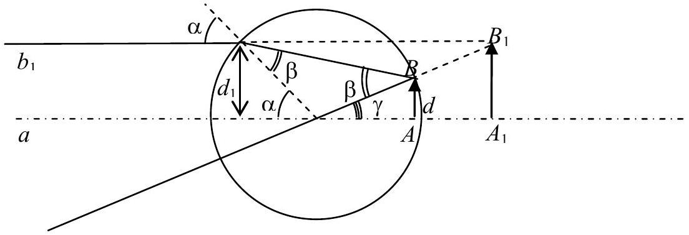
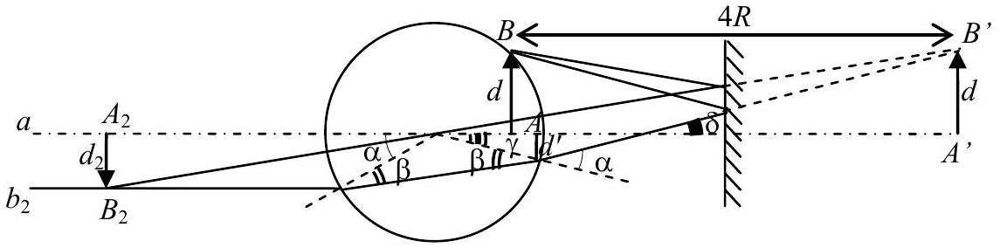
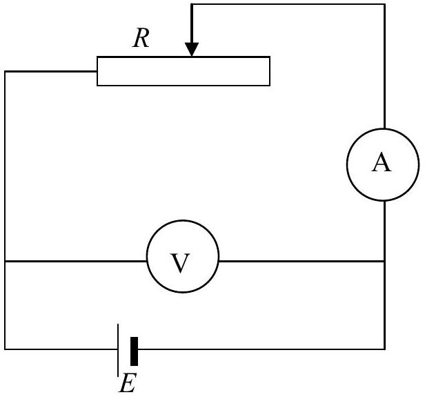
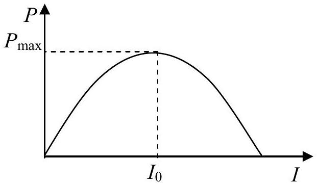
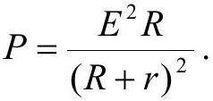
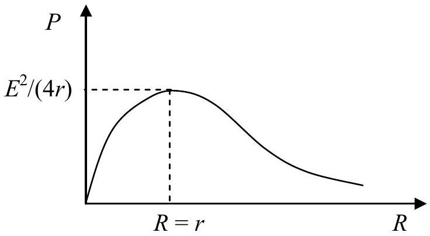
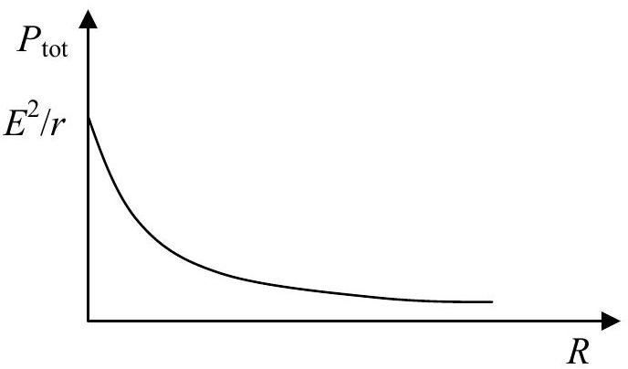
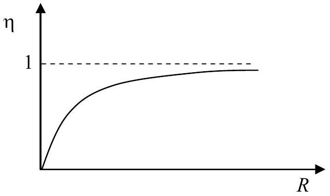

# Solutions to the problems of the 5-th International Physics Olympiad, 1971, Sofia, Bulgaria

The problems and the solutions are adapted by
Victor Ivanov
Sofia State University, Faculty of Physics, 5 James Bourcier Blvd., 1164 Sofia, Bulgaria

Reference: O. F. Kabardin, V. A. Orlov, in "International Physics Olympiads for High School Students", eds. V. G. Razumovski, Moscow, Nauka, 1985. (In Russian).

## Theoretical problems

## Question 1.

The blocks slide relative to the prism with accelerations $\mathbf { a } _ { 1 }$ and $\mathbf { a } _ { 2 }$, which are parallel to its sides and have the same magnitude $a$ (see Fig. 1.1). The blocks move relative to the earth with accelerations:

$$
\begin{align*}
& \mathbf { w } _ { 1 } = \mathbf { a } _ { 1 } + \mathbf { a } _ { 0 } ;  \tag{1.1}\\
& \mathbf { w } _ { 2 } = \mathbf { a } _ { 2 } + \mathbf { a } _ { 0 } . \tag{1.2}
\end{align*}
$$

Now we project $\mathbf { w } _ { 1 }$ and $\mathbf { w } _ { 2 }$ along the $x$ - and $y$-axes:

Fig. 1.1

The equations of motion for the blocks and for the prism have the following vector forms (see Fig. 1.2):

Fig. 1.2

The forces of tension $\mathbf { T } _ { 1 }$ and $\mathbf { T } _ { 2 }$ at the ends of the thread are of the same magnitude $T$ since the masses of the thread and that of the pulley are negligible. Note that in equation (1.9) we account for the net force $- \left( \mathbf { T } _ { 1 } + \mathbf { T } _ { 2 } \right)$, which the bended thread exerts on the

prism through the pulley. The equations of motion result in a system of six scalar equations when projected along $x$ and $y$ :

$$
\begin{align*}
& m _ { 1 } a \cos \alpha _ { 1 } - m _ { 1 } a _ { 0 } = T \cos \alpha _ { 1 } - R _ { 1 } \sin \alpha _ { 1 }  \tag{1.10}\\
& m _ { 1 } a \sin \alpha _ { 1 } = T \sin \alpha _ { 1 } + R _ { 1 } \cos \alpha _ { 1 } - m _ { 1 } g  \tag{1.11}\\
& m _ { 2 } a \cos \alpha _ { 2 } - m _ { 2 } a _ { 0 } = - T \cos \alpha _ { 2 } + R _ { 2 } \sin \alpha _ { 2 }  \tag{1.12}\\
& m _ { 2 } a \sin \alpha _ { 2 } = T \sin \alpha _ { 2 } + R _ { 2 } \sin \alpha _ { 2 } - m _ { 2 } g  \tag{1.13}\\
& - M a _ { 0 } = R _ { 1 } \sin \alpha _ { 1 } - R _ { 2 } \sin \alpha _ { 2 } - T \cos \alpha _ { 1 } + T \cos \alpha _ { 2 }  \tag{1.14}\\
& 0 = R - R _ { 1 } \cos \alpha _ { 1 } - R _ { 2 } \cos \alpha _ { 2 } - M g \tag{1.15}
\end{align*}
$$

By adding up equations (1.10), (1.12), and (1.14) all forces internal to the system cancel each other. In this way we obtain the required relation between accelerations $a$ and $a _ { 0 }$ :

$$
\begin{equation*}
a = a _ { 0 } \frac { M + m _ { 1 } + m _ { 2 } } { m _ { 1 } \cos \alpha _ { 1 } + m _ { 2 } \cos \alpha _ { 2 } } . \tag{1.16}
\end{equation*}
$$

The straightforward elimination of the unknown forces gives the final answer for $a _ { 0 }$ :

$$
\begin{equation*}
a _ { 0 } = \frac { \left( m _ { 1 } \sin \alpha _ { 1 } - m _ { 2 } \sin \alpha _ { 2 } \right) \left( m _ { 1 } \cos \alpha _ { 1 } + m _ { 2 } \cos \alpha _ { 2 } \right) } { \left( m _ { 1 } + m _ { 2 } + M \right) \left( m _ { 1 } + m _ { 2 } \right) - \left( m _ { 1 } \cos \alpha _ { 1 } + m _ { 2 } \cos \alpha _ { 2 } \right) ^ { 2 } } . \tag{1.17}
\end{equation*}
$$

It follows from equation (1.17) that the prism will be in equilibrium $\left( a _ { 0 } = 0 \right)$ if:

$$
\begin{equation*}
\frac { m _ { 1 } } { m _ { 2 } } = \frac { \sin \alpha _ { 2 } } { \sin \alpha _ { 1 } } . \tag{1.18}
\end{equation*}
$$

## Question 2.

We will denote by $H ( H =$ const $)$ the height of the tube above the mercury level in the pan, and the height of the mercury column in the tube by $h _ { i }$. Under conditions of mechanical equilibrium the hydrogen pressure in the tube is:

$$
\begin{equation*}
P _ { H _ { 2 } } = P _ { \text {air } } - \rho g h _ { i } , \tag{2.1}
\end{equation*}
$$

where $\rho$ is the density of mercury at temperature $t _ { i }$ :

$$
\begin{equation*}
\rho = \rho _ { 0 } ( 1 - \beta t ) \tag{2.2}
\end{equation*}
$$

The index $i$ enumerates different stages undergone by the system, $\rho _ { 0 }$ is the density of mercury at $t _ { 0 } = 0 { } ^ { \circ } \mathrm { C }$, or $T _ { 0 } = 273 \mathrm {~K}$, and $\beta$ its coefficient of expansion. The volume of the hydrogen is given by:

$$
\begin{equation*}
V _ { i } = S \left( H - h _ { i } \right) . \tag{2.3}
\end{equation*}
$$

Now we can write down the equations of state for hydrogen at points $0,1,2$, and 3 of the $P V$ diagram (see Fig. 2):

$$
\begin{align*}
& \left( P _ { 0 } - \rho _ { 0 } g h _ { 0 } \right) S \left( H - h _ { 0 } \right) = \frac { m } { M } R T _ { 0 } ;  \tag{2.4}\\
& \left( P _ { 1 } - \rho _ { 0 } g h _ { 1 } \right) S \left( H - h _ { 1 } \right) = \frac { m } { M } R T _ { 0 } ;  \tag{2.5}\\
& \left( P _ { 2 } - \rho _ { 1 } g h _ { 2 } \right) S \left( H - h _ { 2 } \right) = \frac { m } { M } R T _ { 2 } , \tag{2.6}
\end{align*}
$$

where $P _ { 2 } = \frac { P _ { 1 } T _ { 2 } } { T _ { 0 } } , \quad \rho _ { 1 } = \frac { \rho _ { 0 } } { 1 + \beta \left( T _ { 2 } - T _ { 0 } \right) } \approx \rho _ { 0 } \left[ 1 - \beta \left( T _ { 2 } - T _ { 0 } \right) \right]$ since the process $1 - 3$ is isochoric, and:

$$
\begin{equation*}
\left( P _ { 2 } - \rho _ { 2 } g h _ { 3 } \right) S \left( H - h _ { 3 } \right) = \frac { m } { M } R T _ { 3 } \tag{2.7}
\end{equation*}
$$

where $\rho _ { 2 } \approx \rho _ { 0 } \left[ 1 - \beta \left( T _ { 3 } - T _ { 0 } \right) \right] , T _ { 3 } = T _ { 2 } \frac { V _ { 3 } } { V _ { 2 } } = T _ { 2 } \frac { H - h _ { 3 } } { H - h _ { 2 } }$ for the isobaric process 2-3.

Fig. 2

After a good deal of algebra the above system of equations can be solved for the unknown quantities, an exercise, which is left to the reader. The numerical answers, however, will be given for reference:

$$
\begin{aligned}
& H \approx 1.3 \mathrm {~m} ; \\
& m \approx 2.11 \times 10 ^ { - 6 } \mathrm {~kg} ; \\
& T _ { 2 } \approx 364 \mathrm {~K} ; \\
& P _ { 2 } \approx 1.067 \times 10 ^ { 5 } \mathrm {~Pa} ; \\
& T _ { 3 } \approx 546 \mathrm {~K} ; \\
& P _ { 2 } \approx 4.8 \times 10 ^ { 4 } \mathrm {~Pa} .
\end{aligned}
$$

## Question 3.

A circuit equivalent to the given one is shown in Fig. 3. In a steady state (the capacitors are completely charged already) the same current $I$ flows through all the resistors in the closed circuit ABFGHDA. From the Kirchhoff's second rule we obtain:

$$
\begin{equation*}
I = \frac { E _ { 4 } - E _ { 1 } } { 4 R } . \tag{3.1}
\end{equation*}
$$

Next we apply this rule for the circuit ABCDA:

$$
\begin{equation*}
V _ { 1 } + I R = E _ { 2 } - E _ { 1 } , \tag{3.2}
\end{equation*}
$$

where $V _ { 1 }$ is the potential difference across the capacitor $C _ { 1 }$. By using the expression (3.1) for $I$, and the equation (3.2) we obtain:

$$
\begin{equation*}
V _ { 1 } = E _ { 2 } - E _ { 1 } - \frac { E _ { 4 } - E _ { 1 } } { 4 } = 1 \mathrm {~V} . \tag{3.3}
\end{equation*}
$$

Similarly, we obtain the potential differences $V _ { 2 }$ and $V _ { 4 }$ across the capacitors $C _ { 2 }$ and $C _ { 4 }$ by considering circuits BFGCB and FGHEF:

$$
\begin{equation*}
V _ { 2 } = E _ { 4 } - E _ { 2 } - \frac { E _ { 4 } - E _ { 1 } } { 4 } = 5 \mathrm {~V} , \tag{3.4}
\end{equation*}
$$

$$
\begin{equation*}
V _ { 4 } = E _ { 4 } - E _ { 3 } - \frac { E _ { 4 } - E _ { 1 } } { 4 } = 1 \mathrm {~V} . \tag{3.5}
\end{equation*}
$$

Finally, the voltage $V _ { 3 }$ across $C _ { 3 }$ is found by applying the Kirchhoff's rule for the outermost circuit EHDAH:

$$
\begin{equation*}
V _ { 3 } = E _ { 3 } - E _ { 1 } - \frac { E _ { 4 } - E _ { 1 } } { 4 } = 5 \mathrm {~V} . \tag{3.6}
\end{equation*}
$$

The total energy of the capacitors is expressed by the formula:

$$
\begin{equation*}
W = \frac { C } { 2 } \left( V _ { 1 } ^ { 2 } + V _ { 2 } ^ { 2 } + V _ { 3 } ^ { 2 } + V _ { 4 } ^ { 2 } \right) = 26 \mu \mathrm {~J} . \tag{3.7}
\end{equation*}
$$

Fig. 3

When points B and H are short connected the same electric current $I$ ' flows through the resistors in the BFGH circuit. It can be calculated, again by means of the Kirchhoff's rule, that:

$$
\begin{equation*}
I ^ { \prime } = \frac { E _ { 4 } } { 2 R } . \tag{3.8}
\end{equation*}
$$

The new steady-state voltage on $C _ { 2 }$ is found by considering the BFGCB circuit:

$$
\begin{equation*}
V _ { 2 } ^ { \prime } + I ^ { \prime } R = E _ { 4 } - E _ { 2 } \tag{3.9}
\end{equation*}
$$

or finally:

$$
\begin{equation*}
V _ { 2 } ^ { \prime } = \frac { E _ { 4 } } { 2 } - E _ { 2 } = 0 \mathrm {~V} . \tag{3.10}
\end{equation*}
$$

Therefore the charge $q _ { 2 } ^ { \prime }$ on $C _ { 2 }$ in the new steady state is zero.

## Question 4.

In a small time interval $\Delta t$ the fish moves upward, from point $A$ to point $B$, at a small distance $d = v \Delta t$. Since the glass wall is very thin we can assume that the rays leaving the aquarium refract as if there was water - air interface. The divergent rays undergoing one single refraction, as show in Fig. 4.1, form the first, virtual, image of the fish. The corresponding vertical displacement $A _ { 1 } B _ { 1 }$ of that image is equal to the distance $d _ { 1 }$ between the optical axis $a$ and the ray $b _ { 1 }$, which leaves the aquarium parallel to $a$. Since distances $d$ and $d _ { 1 }$ are small compared to $R$ we can use the small-angle approximation: $\sin \alpha \approx \tan \alpha \approx \alpha ($ rad $)$. Thus we obtain:

$$
\begin{align*}
& d _ { 1 } \approx R \alpha ;  \tag{4.1}\\
& d \approx R \gamma ;  \tag{4.2}\\
& \alpha + \gamma = 2 \beta ;  \tag{4.3}\\
& \alpha \approx n \beta . \tag{4.4}
\end{align*}
$$

From equations (4.1) - (4.4) we find the vertical displacement of the first image in terms of $d$ :

$$
\begin{equation*}
d _ { 1 } = \frac { n } { 2 - n } d , \tag{4.5}
\end{equation*}
$$

and respectively its velocity $v _ { 1 }$ in terms of $v$ :

$$
\begin{equation*}
v _ { 1 } = \frac { n } { 2 - n } = 2 v . \tag{4.6}
\end{equation*}
$$

Fig. 4.1

The rays, which are first reflected by the mirror, and then are refracted twice at the walls of the aquarium form the second, real image (see Fig. 4.2). It can be considered as originating from the mirror image of the fish, which move along the line $A ^ { \prime } B ^ { \prime }$ at exactly the same distance $d$ as the fish do.

Fig. 4.2

The vertical displacement $A _ { 2 } B _ { 2 }$ of the second image is equal to the distance $d _ { 2 }$ between the optical axis $a$ and the ray $b _ { 2 }$, which is parallel to $a$. Again, using the small-angle approximation we have:

$$
\begin{align*}
& d ^ { \prime } \approx 4 R \delta - d ,  \tag{4.7}\\
& d _ { 2 } \approx R \alpha \tag{4.8}
\end{align*}
$$

Following the derivation of equation (4.5) we obtain:

$$
\begin{equation*}
d _ { 2 } = \frac { n } { 2 - n } d ^ { \prime } . \tag{4.9}
\end{equation*}
$$

Now using the exact geometric relations:

$$
\begin{equation*}
\delta = 2 \alpha - 2 \beta \tag{4.10}
\end{equation*}
$$

and the Snell's law (4.4) in a small-angle limit, we finally express $d _ { 2 }$ in terms of $d$ :

$$
\begin{equation*}
d _ { 2 } = \frac { n } { 9 n - 10 } d , \tag{4.11}
\end{equation*}
$$

and the velocity $v _ { 2 }$ of the second image in terms of $v$ :

$$
\begin{equation*}
v _ { 2 } = \frac { n } { 9 n - 10 } v = \frac { 2 } { 3 } v . \tag{4.12}
\end{equation*}
$$

The relative velocity of the two images is:

$$
\begin{equation*}
\mathbf { v } _ { \text {rel } } = \mathbf { v } _ { 1 } - \mathbf { v } _ { 2 } \tag{4.13}
\end{equation*}
$$

in a vector form. Since vectors $\mathbf { v } _ { 1 }$ and $\mathbf { v } _ { 2 }$ are oppositely directed (one of the images moves upward, the other, downward) the magnitude of the relative velocity is:

$$
\begin{equation*}
v _ { \mathrm { rel } } = v _ { 1 } + v _ { 2 } = \frac { 8 } { 3 } v . \tag{4.14}
\end{equation*}
$$

## Experimental problem

The circuit is given in the figure below:

Sliding the contact along the rheostat sets the current $I$ supplied by the source. For each value of $I$ the voltage $U$ across the source terminals is recorded by the voltmeter. The power dissipated in the rheostat is:

$$
P = U I
$$

provided that the heat losses in the internal resistance of the ammeter are negligible.

1. A typical $P - I$ curve is shown below:

If the current varies in a sufficiently large interval a maximum power $P _ { \text {max } }$ can be detected at a certain value, $I _ { 0 }$, of $I$. Theoretically, the $P ( I )$ dependence is given by:

$$
\begin{equation*}
P = E I - I ^ { 2 } r , \tag{5.1}
\end{equation*}
$$

where $E$ and $r$ are the EMF and the internal resistance of the dc source respectively. The maxim value of $P$ therefore is:

$$
\begin{equation*}
P _ { \max } = \frac { E ^ { 2 } } { 4 r } , \tag{5.2}
\end{equation*}
$$

and corresponds to a current:

$$
\begin{equation*}
I _ { 0 } = \frac { E } { 2 r } . \tag{5.3}
\end{equation*}
$$

2. The internal resistance is determined trough (5.2) and (5.3) by recording $P _ { \max }$ and $I _ { 0 }$ from the experimental plot:

$$
r = \frac { P _ { \max } } { I _ { 0 } ^ { 2 } } .
$$

3. Similarly, EMF is calculated as:

$$
E = \frac { 2 P _ { \max } } { I _ { 0 } } .
$$

4. The current depends on the resistance of the rheostat as:

$$
I = \frac { E } { R + r } .
$$

Therefore a value of $R$ can be calculated for each value of $I$ :

$$
\begin{equation*}
R = \frac { E } { I } - r . \tag{5.4}
\end{equation*}
$$

The power dissipated in the rheostat is given in terms of $R$ respectively by:

The $P - R$ plot is given below:

Its maximum is obtained at $R = r$.
5. The total power supplied by the dc source is:

6. The efficiency respectively is:

$$
\begin{equation*}
\eta = \frac { P } { P _ { t o t } } = \frac { R } { R + r } . \tag{5.7}
\end{equation*}
$$

