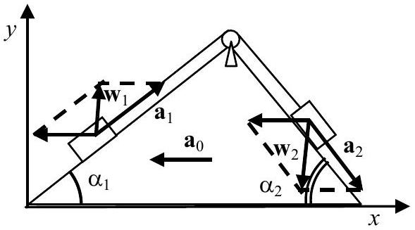
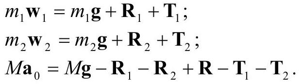
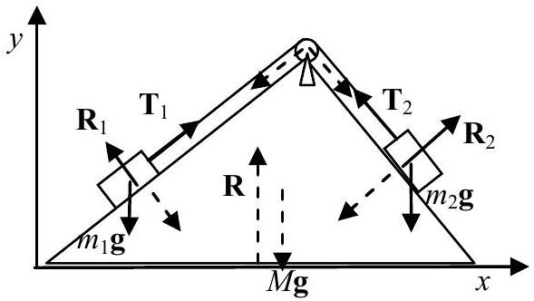

## Question 1.

The blocks slide relative to the prism with accelerations $\mathbf { a } _ { 1 }$ and $\mathbf { a } _ { 2 }$, which are parallel to its sides and have the same magnitude $a$ (see Fig. 1.1). The blocks move relative to the earth with accelerations:

$$
\begin{align*}
& \mathbf { w } _ { 1 } = \mathbf { a } _ { 1 } + \mathbf { a } _ { 0 } ;  \tag{1.1}\\
& \mathbf { w } _ { 2 } = \mathbf { a } _ { 2 } + \mathbf { a } _ { 0 } . \tag{1.2}
\end{align*}
$$

Now we project $\mathbf { w } _ { 1 }$ and $\mathbf { w } _ { 2 }$ along the $x$ - and $y$-axes:

Fig. 1.1

The equations of motion for the blocks and for the prism have the following vector forms (see Fig. 1.2):

Fig. 1.2

The forces of tension $\mathbf { T } _ { 1 }$ and $\mathbf { T } _ { 2 }$ at the ends of the thread are of the same magnitude $T$ since the masses of the thread and that of the pulley are negligible. Note that in equation (1.9) we account for the net force $- \left( \mathbf { T } _ { 1 } + \mathbf { T } _ { 2 } \right)$, which the bended thread exerts on the

prism through the pulley. The equations of motion result in a system of six scalar equations when projected along $x$ and $y$ :

$$
\begin{align*}
& m _ { 1 } a \cos \alpha _ { 1 } - m _ { 1 } a _ { 0 } = T \cos \alpha _ { 1 } - R _ { 1 } \sin \alpha _ { 1 }  \tag{1.10}\\
& m _ { 1 } a \sin \alpha _ { 1 } = T \sin \alpha _ { 1 } + R _ { 1 } \cos \alpha _ { 1 } - m _ { 1 } g  \tag{1.11}\\
& m _ { 2 } a \cos \alpha _ { 2 } - m _ { 2 } a _ { 0 } = - T \cos \alpha _ { 2 } + R _ { 2 } \sin \alpha _ { 2 }  \tag{1.12}\\
& m _ { 2 } a \sin \alpha _ { 2 } = T \sin \alpha _ { 2 } + R _ { 2 } \sin \alpha _ { 2 } - m _ { 2 } g  \tag{1.13}\\
& - M a _ { 0 } = R _ { 1 } \sin \alpha _ { 1 } - R _ { 2 } \sin \alpha _ { 2 } - T \cos \alpha _ { 1 } + T \cos \alpha _ { 2 }  \tag{1.14}\\
& 0 = R - R _ { 1 } \cos \alpha _ { 1 } - R _ { 2 } \cos \alpha _ { 2 } - M g \tag{1.15}
\end{align*}
$$

By adding up equations (1.10), (1.12), and (1.14) all forces internal to the system cancel each other. In this way we obtain the required relation between accelerations $a$ and $a _ { 0 }$ :

$$
\begin{equation*}
a = a _ { 0 } \frac { M + m _ { 1 } + m _ { 2 } } { m _ { 1 } \cos \alpha _ { 1 } + m _ { 2 } \cos \alpha _ { 2 } } . \tag{1.16}
\end{equation*}
$$

The straightforward elimination of the unknown forces gives the final answer for $a _ { 0 }$ :

$$
\begin{equation*}
a _ { 0 } = \frac { \left( m _ { 1 } \sin \alpha _ { 1 } - m _ { 2 } \sin \alpha _ { 2 } \right) \left( m _ { 1 } \cos \alpha _ { 1 } + m _ { 2 } \cos \alpha _ { 2 } \right) } { \left( m _ { 1 } + m _ { 2 } + M \right) \left( m _ { 1 } + m _ { 2 } \right) - \left( m _ { 1 } \cos \alpha _ { 1 } + m _ { 2 } \cos \alpha _ { 2 } \right) ^ { 2 } } . \tag{1.17}
\end{equation*}
$$

It follows from equation (1.17) that the prism will be in equilibrium $\left( a _ { 0 } = 0 \right)$ if:

$$
\begin{equation*}
\frac { m _ { 1 } } { m _ { 2 } } = \frac { \sin \alpha _ { 2 } } { \sin \alpha _ { 1 } } . \tag{1.18}
\end{equation*}
$$
