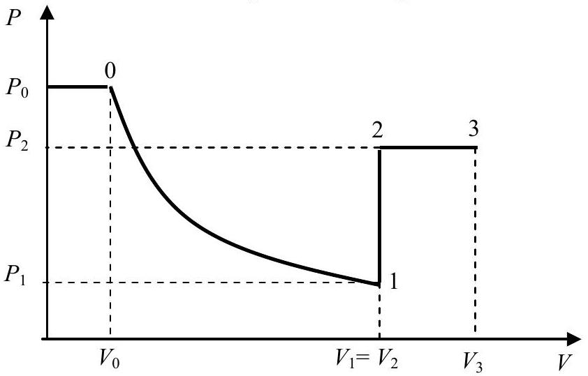

## Question 2.

We will denote by $H ( H =$ const $)$ the height of the tube above the mercury level in the pan, and the height of the mercury column in the tube by $h _ { i }$. Under conditions of mechanical equilibrium the hydrogen pressure in the tube is:

$$
\begin{equation*}
P _ { H _ { 2 } } = P _ { \text {air } } - \rho g h _ { i } , \tag{2.1}
\end{equation*}
$$

where $\rho$ is the density of mercury at temperature $t _ { i }$ :

$$
\begin{equation*}
\rho = \rho _ { 0 } ( 1 - \beta t ) \tag{2.2}
\end{equation*}
$$

The index $i$ enumerates different stages undergone by the system, $\rho _ { 0 }$ is the density of mercury at $t _ { 0 } = 0 { } ^ { \circ } \mathrm { C }$, or $T _ { 0 } = 273 \mathrm {~K}$, and $\beta$ its coefficient of expansion. The volume of the hydrogen is given by:

$$
\begin{equation*}
V _ { i } = S \left( H - h _ { i } \right) . \tag{2.3}
\end{equation*}
$$

Now we can write down the equations of state for hydrogen at points $0,1,2$, and 3 of the $P V$ diagram (see Fig. 2):

$$
\begin{align*}
& \left( P _ { 0 } - \rho _ { 0 } g h _ { 0 } \right) S \left( H - h _ { 0 } \right) = \frac { m } { M } R T _ { 0 } ;  \tag{2.4}\\
& \left( P _ { 1 } - \rho _ { 0 } g h _ { 1 } \right) S \left( H - h _ { 1 } \right) = \frac { m } { M } R T _ { 0 } ;  \tag{2.5}\\
& \left( P _ { 2 } - \rho _ { 1 } g h _ { 2 } \right) S \left( H - h _ { 2 } \right) = \frac { m } { M } R T _ { 2 } , \tag{2.6}
\end{align*}
$$

where $P _ { 2 } = \frac { P _ { 1 } T _ { 2 } } { T _ { 0 } } , \quad \rho _ { 1 } = \frac { \rho _ { 0 } } { 1 + \beta \left( T _ { 2 } - T _ { 0 } \right) } \approx \rho _ { 0 } \left[ 1 - \beta \left( T _ { 2 } - T _ { 0 } \right) \right]$ since the process $1 - 3$ is isochoric, and:

$$
\begin{equation*}
\left( P _ { 2 } - \rho _ { 2 } g h _ { 3 } \right) S \left( H - h _ { 3 } \right) = \frac { m } { M } R T _ { 3 } \tag{2.7}
\end{equation*}
$$

where $\rho _ { 2 } \approx \rho _ { 0 } \left[ 1 - \beta \left( T _ { 3 } - T _ { 0 } \right) \right] , T _ { 3 } = T _ { 2 } \frac { V _ { 3 } } { V _ { 2 } } = T _ { 2 } \frac { H - h _ { 3 } } { H - h _ { 2 } }$ for the isobaric process 2-3.

Fig. 2

After a good deal of algebra the above system of equations can be solved for the unknown quantities, an exercise, which is left to the reader. The numerical answers, however, will be given for reference:

$$
\begin{aligned}
& H \approx 1.3 \mathrm {~m} ; \\
& m \approx 2.11 \times 10 ^ { - 6 } \mathrm {~kg} ; \\
& T _ { 2 } \approx 364 \mathrm {~K} ; \\
& P _ { 2 } \approx 1.067 \times 10 ^ { 5 } \mathrm {~Pa} ; \\
& T _ { 3 } \approx 546 \mathrm {~K} ; \\
& P _ { 2 } \approx 4.8 \times 10 ^ { 4 } \mathrm {~Pa} .
\end{aligned}
$$
