## Mechanics - Problem I (8 points)

A particle moves along the positive axis $O x$ (one-dimensional situation) under a force having a projection $F _ { x } = F _ { 0 }$ on $O x$, as represented, as function of $x$, in the figure 1.1. In the origin of the $O x$ axis is placed a perfectly reflecting wall.
A friction force, with a constant modulus $F _ { f } = 1,00 \mathrm {~N}$, acts everywhere on the particle.
The particle starts from the point $x = x _ { 0 } = 1,00 \mathrm {~m}$ having the kinetic energy $E _ { c } = 10,0 \mathrm {~J}$.

a. Find the length of the path of the particle until its' final stop
b. Plot the potential energy $U ( x )$ of the particle in the force field $F _ { x }$.
c. Qualitatively plot the dependence of the particle's speed as function of its' $x$ coordinate.

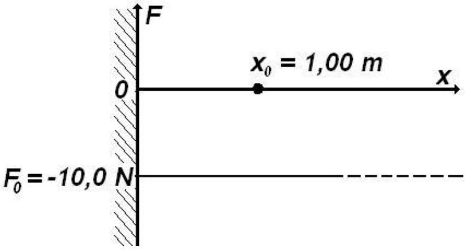
Figure 1.1

## Probsem I - Solution

a. It is possible to make a model of the situation in the problem, considering the Ox axis vertically oriented having the wall in its' lower part. The conservative force $F _ { x }$ could be the weight of the particle. One may present the motion of the particle as the vertical motion of a small elastic ball elastically colliding with the ground and moving with constant friction through the medium. The friction force is smaller than the weight.
The potential energy of the particle can be represented in analogy to the gravitational potential energy of the ball, $m \cdot g \cdot h$, considering $m \cdot g = \left| F _ { x } \right| ; h = x$. As is very well known, in the field of a conservative force, the variation of the potential energy depends only on the initial and final positions of the particle, being independent of the path between those positions.

For the situation in the problem, when the particle moves towards the wall, the force acting on it is directed towards the wall and has the modulus I

$$
\begin{align*}
& F _ { \leftarrow } = \left| F _ { x } \right| - F _ { f }  \tag{1.1}\\
& F _ { \leftarrow } = 9 N \tag{1.2}
\end{align*}
$$

As a consequence, the motion of the particle towards the wall is a motion with a constant acceleration having the modulus

$$
\begin{equation*}
a _ { \leftarrow } = \frac { F _ { \leftarrow } } { m } = \frac { \left| F _ { x } \right| - F _ { f } } { m } \tag{1.3}
\end{equation*}
$$

During the motion, the speed of the particle increases.

Hitting the wall, the particle starts moving in opposite direction with a speed equal in modulus with the one it had before the collision.
When the particle moves away from the wall, in the positive direction of the Ox axis, the acting force is again directed towards to the wall and has the magnitude

$$
\begin{align*}
& F _ { \rightarrow } = \left| F _ { x } \right| + F _ { f }  \tag{1.4}\\
& F _ { \rightarrow } = 11 \mathrm {~N} \tag{1.5}
\end{align*}
$$

Correspondingly, the motion of the particle from the wall is slowed down and the magnitude of the acceleration is

$$
\begin{equation*}
a _ { \rightarrow } = \frac { F _ { \rightarrow } } { m } = \frac { \left| F _ { x } \right| + F _ { f } } { m } \tag{1.6}
\end{equation*}
$$

During this motion, the speed of the particle diminishes to zero.
Because during the motion a force acts on the particle, the body cannot have an equilibrium position in any point on axis - the origin making an exception as the potential energy vanishes there. The particle can definitively stop only in this point.
The work of a conservative force from the point having the coordinate $x _ { 0 } = 0$ to the point $x , L _ { 0 \rightarrow x }$ is correlated with the variation of the potential energy of the particle $U ( x ) - U ( 0 )$ as follows

$$
\left\{ \begin{array} { l }
U ( x ) - U ( 0 ) = - L _ { 0 \rightarrow x }  \tag{1.7}\\
U ( x ) - U ( 0 ) = - \int _ { 0 } ^ { x } \vec { F } _ { x } \cdot \overrightarrow { d x } = \int _ { 0 } ^ { x } \left| F _ { x } \right| \cdot d x = \left| F _ { x } \right| \cdot x
\end{array} \right.
$$

Admitting that the potential energy of the particle vanishes for $x = 0$, the initial potential energy of the particle $U \left( x _ { 0 } \right)$ in the field of conservative force

$$
\begin{equation*}
F _ { x } ( x ) = F _ { 0 } \tag{1.8}
\end{equation*}
$$

can be written

$$
\begin{equation*}
U \left( x _ { 0 } \right) = \left| F _ { 0 } \right| \cdot x _ { 0 } \tag{1.9}
\end{equation*}
$$

The initial kinetic energy $E \left( x _ { 0 } \right)$ of the particle is - as given

$$
\begin{equation*}
E \left( x _ { 0 } \right) = E _ { c } \tag{1.10}
\end{equation*}
$$

and, consequently the total energy of the particle $W \left( x _ { 0 } \right)$ is

$$
\begin{equation*}
W \left( x _ { 0 } \right) = U \left( x _ { 0 } \right) + E _ { c } \tag{1.11}
\end{equation*}
$$

The draw up of the particle occurs when the total energy of the particle is entirely exhausted by the work of the friction force. The distance covered by the particle before it stops, $D$, obeys

$$
\left\{ \begin{array} { l }
W \left( x _ { 0 } \right) = D \cdot F _ { f }  \tag{1.12}\\
U \left( x _ { 0 } \right) + E _ { c } = D \cdot F _ { f } \\
\left| F _ { x } \right| \cdot x _ { 0 } + E _ { c } = D \cdot F _ { f }
\end{array} \right.
$$

so that ,

$$
\begin{equation*}
D = \frac { \left| F _ { x } \right| \cdot x _ { 0 } + E _ { c } } { F _ { f } } \tag{1.13}
\end{equation*}
$$

and

$$
\begin{equation*}
D = 20 \mathrm {~m} \tag{1.14}
\end{equation*}
$$

The relations (1.13) and (1.14) represent the answer to the question I.a.
b. The relation (1.7) written as

$$
\begin{equation*}
U ( x ) = \left| F _ { x } \right| \cdot x \tag{1.15}
\end{equation*}
$$

gives the linear dependence of the potential energy to the position .
If the motion occurs without friction, the particle can reach a point $A$ situated at the distance $\delta$ apart from the origin in which the kinetic energy vanishes. In the point $A$ the energy of the particles is entirely potential.
The energy conservation law for the starting point and point $A$ gives

$$
\left\{ \begin{array} { l }
E _ { c } + \left| F _ { x } \right| \cdot x _ { 0 } = \left| F _ { x } \right| \cdot \delta  \tag{1.16}\\
\delta = x _ { 0 } + \frac { E _ { c } } { \left| F _ { x } \right| }
\end{array} \right.
$$

The numerical value of the position of point $A$, furthest away from the origin, is $\delta = 2 m$
if the motion occurs without friction.
The representation of the dependence of the potential energy on the position in the domain $( 0 , \delta )$ is represented in the figure 1.2.

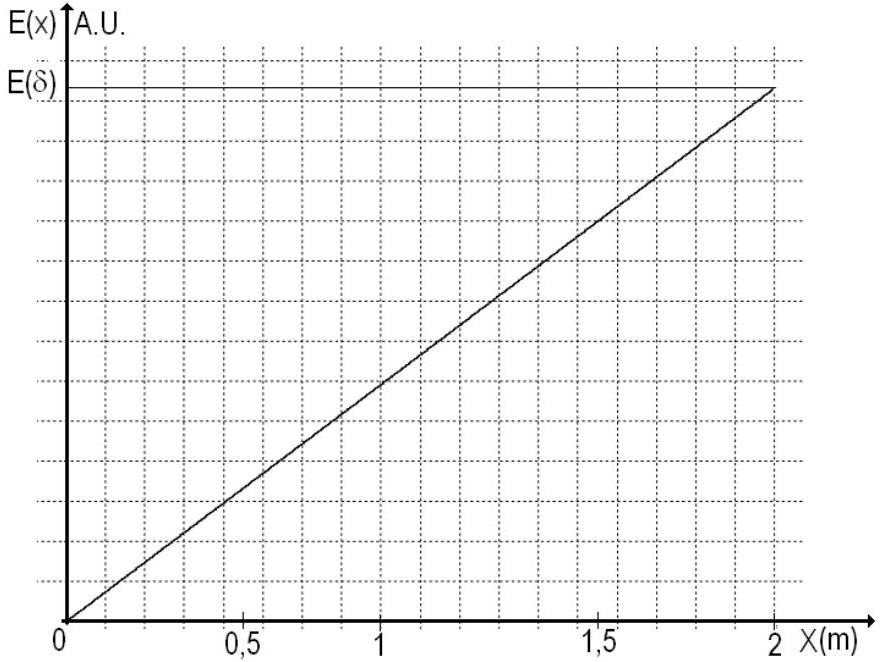
Figure 1.2

During the real motion of the particle (with friction) the extreme positions reached by the particle are smaller than $\delta$ (because of the leak of energy due to friction).
The graph in the figure 1.2 is the answer to the question I.b.

c. During the motion of the particle its energy decrease because of the dissipation work of the friction force. The speed of the particle has a local maximum near the wall. Denoting $v _ { k }$ the speed of the particle just before its' k ${ } ^ { \text {th } }$ collision with the wall and $v _ { k + 1 }$ the speed just before its' next collision,

$$
v _ { k } > v _ { k + 1 }
$$

Among two successive collisions, the particle reaches its' $x _ { k }$ positions in which its' speed vanishes and the energy of the particle is purely potential. These positions are closer and closer to the wall because a part of the energy of the particle is dissipated through friction.

$$
\begin{equation*}
x _ { k + 1 } < x _ { k } \tag{1.17}
\end{equation*}
$$

Case 1
When the particle moves towards the wall, both its' speed and its' kinetic energy increases. The potential energy of the particle decreases. During the motion - independent of its' direction- energy is dissipated through the friction force.
The potential energy of the particle, $U ( x )$, the kinetic energy $E ( x )$ and the total energy of the particle during this part of the motion $W ( x )$ obey the relation

$$
\begin{equation*}
W \left( x _ { 0 } \right) - W ( x ) = F _ { f } \cdot \left( x _ { 0 } - x \right) \tag{1.18}
\end{equation*}
$$

the position $x$ lying in the domain

$$
\begin{equation*}
x \in \left( 0 , x _ { 0 } \right) \tag{1.19}
\end{equation*}
$$

covered from $x _ { 0 }$ towards origin. The relation (1.18) can be written as

$$
\begin{equation*}
\left[ E _ { c } + \left| F _ { x } \right| \cdot x _ { 0 } \right] - \left[ \frac { m \cdot v ^ { 2 } } { 2 } + \left| F _ { x } \right| \cdot x \right] = F _ { f } \cdot \left( x _ { 0 } - x \right) \tag{1.20}
\end{equation*}
$$

so that

$$
\left\{ \begin{array} { l }
v ^ { 2 } = \frac { 2 } { m } \left[ E _ { c } + \left| F _ { x } \right| \cdot x _ { 0 } - \left| F _ { x } \right| \cdot x - F _ { f } \cdot \left( x _ { 0 } - x \right) \right]  \tag{1.21}\\
v ^ { 2 } = \frac { 2 } { m } \left[ E _ { c } + x _ { 0 } \left( \left| F _ { x } \right| - F _ { f } \right) - x \left( \left| F _ { x } \right| - F _ { f } \right) \right]
\end{array} \right.
$$

and by consequence

$$
\begin{equation*}
v = - \sqrt { \frac { 2 } { m } \left[ E _ { c } + x _ { 0 } \left( \left| F _ { x } \right| - F _ { f } \right) - x \left( \left| F _ { x } \right| - F _ { f } \right) \right] } \tag{1.22}
\end{equation*}
$$

The minus sign in front of the magnitude of the speed indicates that the motion of the particle occurs into the negative direction of the coordinate axis.
Using the problem data

$$
\left\{ \begin{array} { l }
v ^ { 2 } = \frac { 2 } { m } ( 19 - 9 \cdot x )  \tag{1.23}\\
v = - \sqrt { \frac { 2 } { m } ( 19 - 9 \cdot x ) }
\end{array} \right.
$$

The speed of the particle at the first collision with the wall $v _ { 1 \leftarrow }$ can be written as

and has the value

$$
\begin{equation*}
v _ { 1 \leftarrow } = - \sqrt { \frac { 2 } { m } 19 } \tag{1.25}
\end{equation*}
$$

The total energy near the wall, purely kinetic $E _ { 1 \leftarrow }$, has the expression

$$
\begin{equation*}
E _ { 1 \leftarrow } = E _ { c } + x _ { 0 } \left( \left| F _ { x } \right| - F _ { f } \right) \tag{1.26}
\end{equation*}
$$

The numerical value of this energy is

$$
\begin{equation*}
E _ { 1 \leftarrow } = 19 \mathrm {~J} \tag{1.27}
\end{equation*}
$$

The graph in the figure (1.3) gives the dependence on position of the square of the speed for the first part of the particle's motion.

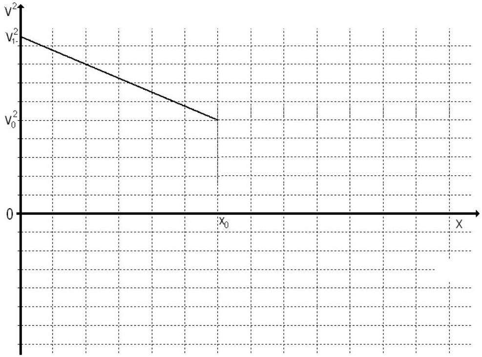
Figure 1.3

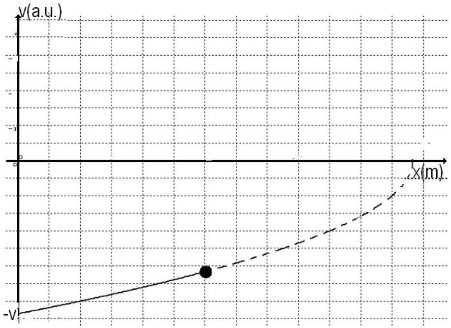
Figure 1.4

The graph in the figure (1.4) presents the speed's dependence on the position in this first part of the particle's motion (towards the wall).
After the collision with the wall, the speed of the particle, $v _ { 1 \rightarrow }$, has the same magnitude as the speed just before the collision but it is directed in the opposite way. In the graphical representation of the speed as a function of position, the collision with the wall is represented as a jump of the speed from a point lying on negative side of the speed axis to a point lying on positive side of the speed axis. The absolute value of the speed just before and immediately after the collision is the same as represented in the figure 1.5.

$$
\begin{equation*}
v _ { 1 \rightarrow } = \sqrt { \frac { 2 } { m } \left[ E _ { c } + x _ { 0 } \left( \left| F _ { x } \right| - F _ { f } \right) \right] } \tag{1.28}
\end{equation*}
$$

After the first collision, the motion of the particle is slowed down with a constant deceleration $a _ { \rightarrow }$ and an initial speed $v _ { 1 \rightarrow }$.
This motion continues to the position $x _ { 1 }$ where the speed vanishes.
From Galileo law it can be inferred that

$$
\left\{ \begin{array} { l }
0 = v _ { 1 \rightarrow } ^ { 2 } - 2 \cdot a _ { \rightarrow } \cdot x _ { 1 }  \tag{1.29}\\
x _ { 1 } = \frac { v _ { 1 \rightarrow } ^ { 2 } } { 2 \cdot a _ { \rightarrow } } = \frac { \frac { 2 } { m } \left[ E _ { c } + x _ { 0 } \left( \left| F _ { x } \right| - F _ { f } \right) \right] } { 2 \cdot \frac { \left| F _ { x } \right| + F _ { f } } { m } } = \frac { \left[ E _ { c } + x _ { 0 } \left( \left| F _ { x } \right| - F _ { f } \right) \right] } { \left| F _ { x } \right| + F _ { f } }
\end{array} \right.
$$

The numerical value of the position $x _ { 1 }$ is

$$
\begin{equation*}
x _ { 1 } = \frac { 19 } { 11 } m \tag{1.30}
\end{equation*}
$$

For the positions

$$
\begin{equation*}
x \in \left( 0 , x _ { 1 } \right) \tag{1.31}
\end{equation*}
$$

covered from the origin towards $x _ { 1 }$ the total energy $W ( x )$ has the expression

$$
\begin{equation*}
W ( x ) = \frac { m \cdot v ^ { 2 } } { 2 } + \left| F _ { x } \right| \cdot x \tag{1.32}
\end{equation*}
$$

From the wall, the energy of the particle diminishes because of the friction - that is

$$
\left\{ \begin{array} { l }
E _ { 1 \leftarrow } - W ( x ) = F _ { f } \cdot x  \tag{1.33}\\
E _ { c } + x _ { 0 } \left( \left| F _ { x } \right| - F _ { f } \right) - \frac { m \cdot v ^ { 2 } } { 2 } - \left| F _ { x } \right| \cdot x = F _ { f } \cdot x
\end{array} \right.
$$

The square of the magnitude of the speed is

$$
\left\{ \begin{array} { l }
v ^ { 2 } = \frac { 2 } { m } \left[ E _ { c } + x _ { 0 } \left( \left| F _ { x } \right| - F _ { f } \right) - \left( \left| F _ { x } \right| + F _ { f } \right) \cdot x \right]  \tag{1.34}\\
v ^ { 2 } = \frac { 2 } { m } \left( \left| F _ { x } \right| + F _ { f } \right) \cdot \left( x _ { 1 } - x \right)
\end{array} \right.
$$

and the speed is

$$
\begin{equation*}
v = \sqrt { \frac { 2 } { m } \left[ E _ { c } + x _ { 0 } \left( \left| F _ { x } \right| - F _ { f } \right) - \left( \left| F _ { x } \right| + F _ { f } \right) \cdot x \right] } \tag{1.35}
\end{equation*}
$$

Using the furnished data results

$$
\begin{equation*}
v ^ { 2 } = \frac { 2 } { m } [ 19 - 11 \cdot x ] \tag{1.36}
\end{equation*}
$$

and respectively

$$
\begin{equation*}
v = \sqrt { \frac { 2 } { m } [ 19 - 11 \cdot x ] } \tag{1.37}
\end{equation*}
$$

For the positions lying in the domain $x \in \left( 0 , x _ { 1 } \right)$ - (which correspond to a second part of the motion of particle) the figure 1.5 gives the dependence of the speed on the position.

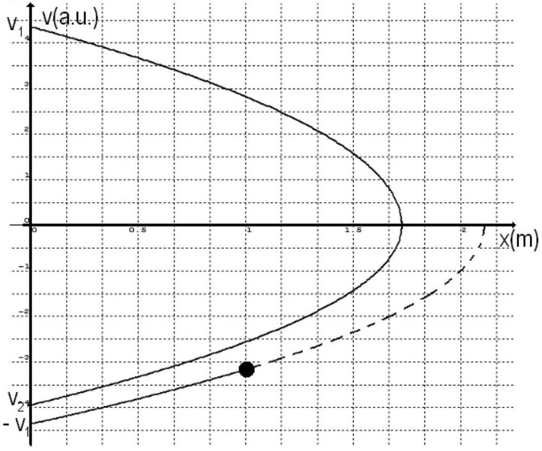
Figure 1.5

As can be observed in the figure, after reaching the furthest away position, $x _ { 1 }$, the particle moves towards the origin, without an initial speed, in an accelerated motion having an acceleration with the magnitude of $a _ { \leftarrow } = \left( \left| F _ { x } \right| - F _ { f } \right) / m$. After the collision with the wall, the particle has a velocity equal in magnitude but opposite in direction with the one it had just before the collision.
When the particle reaches a point in the domain $\left( 0 , x _ { 1 } \right)$ moving from $x _ { 1 }$ towards the origin its' total energy $W ( x )$ has the expression (1.32).
Starting from $x _ { 1 }$, because of the dissipation determined by the friction force, the energy changes to the value corresponding to the position with coordinate $x$.

$$
\left\{ \begin{array} { l }
\left| F _ { x } \right| \cdot x _ { 1 } - W ( x ) = F _ { f } \cdot \left( x _ { 1 } - x \right)  \tag{1.38}\\
\left| F _ { x } \right| \cdot x _ { 1 } - \frac { m \cdot v ^ { 2 } } { 2 } - \left| F _ { x } \right| \cdot x = F _ { f } \cdot \left( x _ { 1 } - x \right)
\end{array} \right.
$$

The square of the speed has the expression

$$
\left\{ \begin{array} { l }
v ^ { 2 } = \frac { 2 } { m } \left[ \left( \left| F _ { x } \right| - F _ { f } \right) \cdot \left( x _ { 1 } - x \right) \right]  \tag{1.39}\\
v ^ { 2 } = \frac { 2 } { m } \left[ \frac { \left[ E _ { c } + x _ { 0 } \left( \left| F _ { x } \right| - F _ { f } \right) \right] } { \left| F _ { x } \right| + F _ { f } } - x \right] \cdot \left( \left| F _ { x } \right| - F _ { f } \right)
\end{array} \right.
$$

and the speed is

$$
\begin{equation*}
v = \sqrt { \frac { 2 } { m } \left[ \frac { \left[ E _ { c } + x _ { 0 } \left( \left| F _ { x } \right| - F _ { f } \right) \right] } { \left| F _ { x } \right| + F _ { f } } - x \right] \cdot \left( \left| F _ { x } \right| - F _ { f } \right) } \tag{1.40}
\end{equation*}
$$

Using the given data, for a position in the domain $\left( 0 , x _ { 1 } \right)$

$$
\begin{equation*}
v ^ { 2 } = \frac { 2 } { m } \left[ \frac { 19 } { 11 } - x \right] \cdot 9 \tag{1.41}
\end{equation*}
$$

respectively

$$
\begin{equation*}
v = - \sqrt { \frac { 2 } { m } \left[ \frac { 19 } { 11 } - x \right] \cdot 9 } \tag{1.42}
\end{equation*}
$$

The speed of the particle when it reaches for the second time the wall has - using (1.39) - the expression

$$
\begin{equation*}
v _ { 2 \leftarrow } = - \sqrt { \frac { 2 } { m } \left\{ \frac { \left[ E _ { c } + x _ { 0 } \left( \left| F _ { x } \right| - F _ { f } \right) \right] } { \left| F _ { x } \right| + F _ { f } } \cdot \left( \left| F _ { x } \right| - F _ { f } \right) \right\} } \tag{1.43}
\end{equation*}
$$

The resulting numerical value is

$$
\begin{equation*}
v _ { 2 \leftarrow } = - \sqrt { \frac { 2 } { m } \frac { 171 } { 11 } } \tag{1.44}
\end{equation*}
$$

Concluding, after the first collision and first recoil, the particle moves away from the wall, reaches again a position where the speed vanishes and then comes back to the wall. The speed of the particle hitting again the wall is smaller than before - as in the figure 1.5.
As it was denoted before $v _ { k }$ is the speed of the particle just before its' $k { } ^ { \text {th } }$ run and $x _ { k }$ is the coordinate of the furthest away point reached during the $k ^ { \text {th } }$ run.
The energy of the particle starting from the wall is

$$
\begin{equation*}
E _ { k } = \frac { v _ { k } ^ { 2 } \cdot m } { 2 } = W _ { k } ( 0 ) \tag{1.45}
\end{equation*}
$$

In the point $x _ { k }$, the furthest away from the origin after $k ^ { \text {th } }$ collision, the energy verifies the relation

$$
\begin{equation*}
U _ { k } = x _ { k } \cdot \left| F _ { x } \right| = W _ { k } \left( x _ { k } \right) \tag{1.46}
\end{equation*}
$$

The variation of the energy between starting point and point $x _ { k }$ is

$$
\begin{equation*}
\frac { v _ { k } ^ { 2 } \cdot m } { 2 } - x _ { k } \cdot \left| F _ { x } \right| = F _ { f } \cdot x _ { k } \tag{1.47}
\end{equation*}
$$

so that

$$
\begin{equation*}
x _ { k } = \frac { v _ { k } ^ { 2 } \cdot m } { 2 \cdot \left( \left| F _ { x } \right| + F _ { f } \right) } \tag{1.48}
\end{equation*}
$$

After the particle reaches point $x _ { k }$ the direction of the speed changes and, when the particle reaches again the wall

The energy conservation law for the $x _ { k }$ point and the state when the particle reaches again the wall gives

$$
\begin{equation*}
x _ { k } \cdot \left| F _ { x } \right| - \frac { v _ { k + 1 } ^ { 2 } \cdot m } { 2 } = F _ { f } \cdot x _ { k } \tag{1.50}
\end{equation*}
$$

so that

$$
\begin{equation*}
v _ { k + 1 } ^ { 2 } = \frac { 2 } { m } x _ { k } \left( \left| F _ { x } \right| - F _ { f } \right) \tag{1.51}
\end{equation*}
$$

Considering (1.48), the relation (1.51) becomes

$$
\begin{equation*}
v _ { k + 1 } ^ { 2 } = v _ { k } ^ { 2 } \cdot \frac { \left| F _ { x } \right| - F } { \left| F _ { x } \right| + F } \tag{1.52}
\end{equation*}
$$

Between two consequent collisions the speed diminishes in a geometrical progression having the ratio $q$.This ratio has the expression

$$
\begin{equation*}
q = \sqrt { \frac { \left| F _ { x } \right| - F } { \left| F _ { x } \right| + F } } \tag{1.53}
\end{equation*}
$$

and the value

$$
\begin{equation*}
q = \sqrt { \frac { 9 } { 11 } } \tag{1.54}
\end{equation*}
$$

For the $k + 1$ collision the relation (1.48) becomes

$$
\begin{equation*}
x _ { k + 1 } = \frac { v _ { k + 1 } ^ { 2 } \cdot m } { 2 \cdot \left( \left| F _ { x } \right| + F _ { f } \right) } \tag{1.55}
\end{equation*}
$$

Taking into account (1.52), the ratio of the successive extreme positions can be written as

$$
\left\{ \begin{array} { l }
\frac { x _ { k + 1 } } { x _ { k } } = \frac { \left| F _ { x } \right| - F _ { f } } { \left| F _ { x } \right| + F _ { f } } = q ^ { 2 }  \tag{1.56}\\
x _ { k + 1 } = q ^ { 2 } \cdot x _ { k }
\end{array} \right.
$$

From the $k$ run towards origin, (analogous to (1.39)), the dependence of the square of the speed on position can be written as $v _ { ( k , \leftarrow ) } ^ { 2 }$

$$
\left\{ \begin{array} { l }
v _ { ( k , \leftarrow ) } ^ { 2 } = \frac { 2 } { m } \left[ \left( \left| F _ { x } \right| - F _ { f } \right) \cdot \left( x _ { k } - x \right) \right]  \tag{1.57}\\
v _ { ( k , \leftarrow ) } ^ { 2 } = \frac { 2 } { m } \left[ \left( \left| F _ { x } \right| - F _ { f } \right) \cdot \left( x _ { 1 } \cdot q ^ { 2 k } - x \right) \right]
\end{array} \right.
$$

or, using the data

$$
\begin{equation*}
v _ { ( k , \leftarrow ) } ^ { 2 } = \frac { 2 } { m } \left[ 9 \cdot \left( \frac { 19 } { 11 } \cdot \left( \frac { 9 } { 11 } \right) ^ { k } - x \right) \right] \tag{1.58}
\end{equation*}
$$

For the $k ^ { \text {th } }$ run from the origin (analogous with (1.34)), the dependence on the position of the square of the magnitude of the speed $v _ { ( k , \rightarrow ) } ^ { 2 }$ can be written as

$$
\left\{ \begin{array} { l }
v _ { ( k , \rightarrow ) } ^ { 2 } = \frac { 2 } { m } \left[ \left( \left| F _ { x } \right| + F _ { f } \right) \cdot \left( x _ { k } - x \right) \right]  \tag{1.59}\\
v _ { ( k , \rightarrow ) } ^ { 2 } = \frac { 2 } { m } \left[ \left( \left| F _ { x } \right| + F _ { f } \right) \cdot \left( x _ { 1 } \cdot q ^ { 2 k } - x \right) \right]
\end{array} \right.
$$

Using given data

$$
\begin{equation*}
v _ { ( k , \rightarrow ) } ^ { 2 } = \frac { 2 } { m } \left[ 11 \cdot \left( \frac { 19 } { 11 } \cdot \left( \frac { 9 } { 11 } \right) ^ { k } - x \right) \right] \tag{1.60}
\end{equation*}
$$

The evolution of the square of the speed as function of position is represented in the figure 1.6.

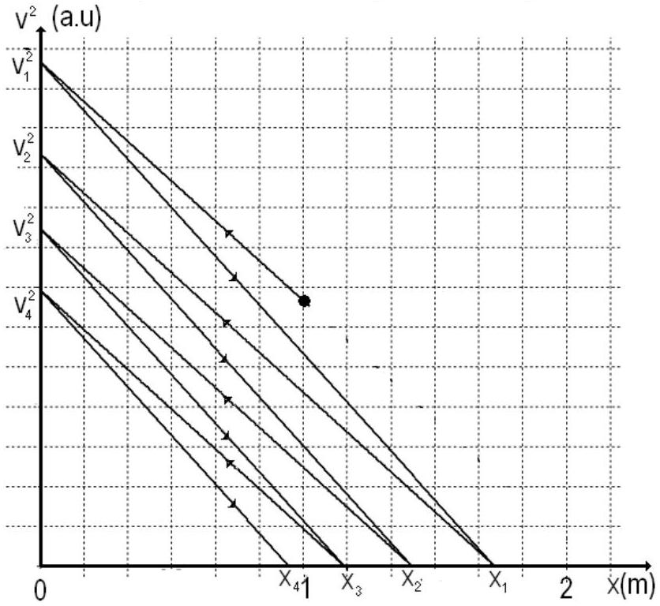
Figure 1.6

And the evolution of the speed as function of position is represented in the figure 1.7.

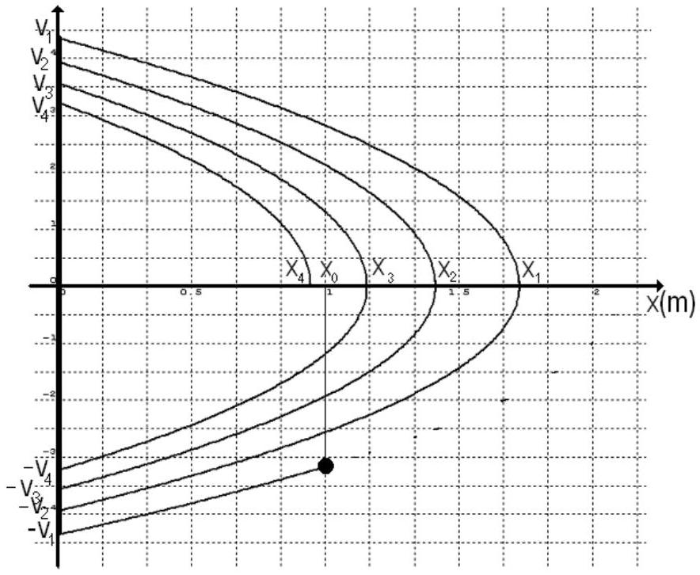
Figure 1.7

The sum of the progression given in (1.56) gives half of the distance covered by the particle after the first collision.

$$
\begin{equation*}
\sum _ { k = 1 } ^ { \infty } x _ { k } = x _ { 1 } \frac { 1 } { 1 - q ^ { 2 } } \tag{1.61}
\end{equation*}
$$

Considering (1.53) and (1.29)

$$
\begin{equation*}
\sum _ { k = 1 } ^ { \infty } x _ { k } = \frac { E _ { c } + x _ { 0 } \cdot \left( \left| F _ { x } \right| - F _ { f } \right) } { 2 \cdot F _ { f } } \tag{1.62}
\end{equation*}
$$

Numerically,

$$
\begin{equation*}
\sum _ { k = 1 } ^ { \infty } x _ { k } = \frac { 19 } { 2 } m \tag{1.63}
\end{equation*}
$$

The total covered distance is

$$
\left\{ \begin{array} { l }
D = 2 \cdot \sum _ { k = 1 } ^ { \infty } x _ { k } + x _ { 0 }  \tag{1.64}\\
D = 20 \mathrm {~m}
\end{array} \right.
$$

which is the same with ( 1.14 ).
Case 2
If the particle starts from the $x _ { 0 }$ position moving in the positive direction of the coordinate axis $O x$ its' speed diminishes and its' kinetic energy also diminishes while its' potential energy increases to a maximum in the $x _ { 1 } { } ^ { \prime }$ position where the speed vanishes. During this motion the energy is dissipated due to the friction.
The total energy $W ( x )$, for the positions $x$ between $x _ { 0 }$ and $x _ { 1 } { } ^ { \prime }$ verify the relation

$$
\begin{equation*}
W \left( x _ { 0 } \right) - W ( x ) = F _ { f } \cdot \left( x - x _ { 0 } \right) \tag{1.65}
\end{equation*}
$$

the position $x$ lying in the domain

$$
\begin{equation*}
x \in \left( x _ { 0 } , x _ { 1 } ^ { \prime } \right) \tag{1.66}
\end{equation*}
$$

when the particle moves from $x _ { 0 }$ in the positive direction of the axis. The relation (1.65) becomes

$$
\begin{equation*}
\left[ E _ { c } + \left| F _ { x } \right| \cdot x _ { 0 } \right] - \left[ \frac { m \cdot v ^ { 2 } } { 2 } + \left| F _ { x } \right| \cdot x \right] = F _ { f } \cdot \left( x - x _ { 0 } \right) \tag{1.67}
\end{equation*}
$$

so that

$$
\left\{ \begin{array} { l }
v ^ { 2 } = \frac { 2 } { m } \left[ E _ { c } + \left| F _ { x } \right| \cdot x _ { 0 } - \left| F _ { x } \right| \cdot x - F _ { f } \cdot \left( x - x _ { 0 } \right) \right]  \tag{1.68}\\
v ^ { 2 } = \frac { 2 } { m } \left[ E _ { c } + x _ { 0 } \left( \left| F _ { x } \right| + F _ { f } \right) - x \left( \left| F _ { x } \right| + F _ { f } \right) \right]
\end{array} \right.
$$

and

$$
\begin{equation*}
v = \sqrt { \frac { 2 } { m } \left[ E _ { c } + x _ { 0 } \left( \left| F _ { x } \right| + F _ { f } \right) - x \left( \left| F _ { x } \right| + F _ { f } \right) \right] } \tag{1.69}
\end{equation*}
$$

Using provided data

$$
\left\{ \begin{array} { l }
v ^ { 2 } = \frac { 2 } { m } ( 21 - 11 \cdot x )  \tag{1.70}\\
v = \sqrt { \frac { 2 } { m } ( 21 - 11 \cdot x ) }
\end{array} \right.
$$

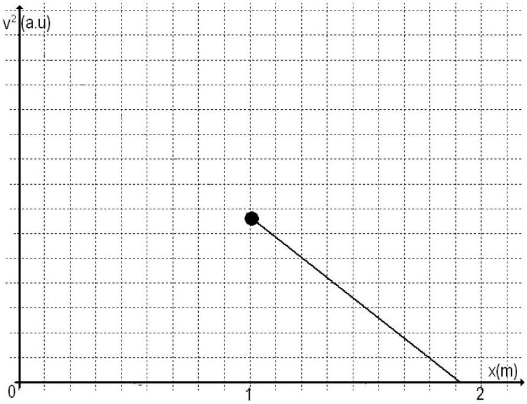
Figure 1.8

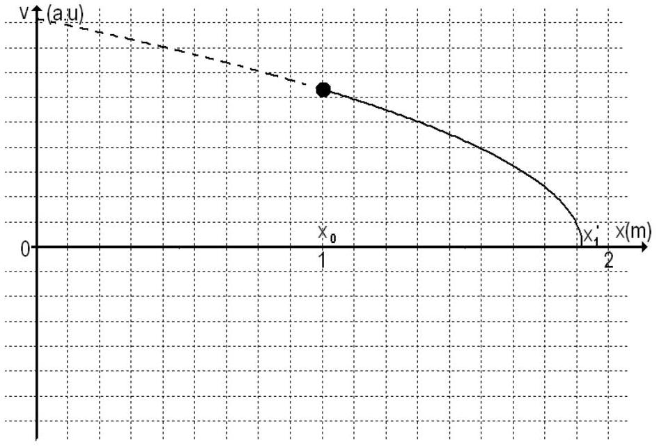
Figure 1.9

The graph in the figure (1.8) presents the dependence of the square speed on the position for the motion in the domain $x \in \left( x _ { 0 } , x _ { 1 } { } ^ { \prime } \right)$. The particle moves in the positive direction of the coordinate axis $O x$. This motion occurs until the position $x _ { 1 } { } ^ { \prime }$ - when the speed vanishes - is reached. From the relation (1.68), in which we take the modulus of the speed zero, results

$$
\begin{equation*}
x _ { 1 } ^ { \prime } = x _ { 0 } + \frac { E _ { c } } { \left| F _ { x } \right| + F _ { f } } \tag{1.71}
\end{equation*}
$$

the numerical value for $x _ { 1 } { } ^ { \prime }$ is

$$
\begin{equation*}
x _ { 1 } ^ { \prime } = \frac { 21 } { 11 } m \tag{1.72}
\end{equation*}
$$

After furthest away position $x _ { 1 }$ 'is reached, the particle moves again towards the origin, without initial speed, in a speeded up motion having an acceleration of magnitude $a _ { \leftarrow } = \left( \left| F _ { x } \right| - F _ { f } \right) / m$. After the collision with the wall, the particle has a velocity $v _ { 1 \rightarrow } { } ^ { \prime }$ equal in magnitude but opposite direction with the one it had before the collision $v _ { 1 \leftarrow } { } ^ { \prime }$.
When the particle is at a point lying in the domain $\left( 0 , x _ { 1 } { } ^ { \prime } \right)$ running from $x _ { 1 } { } ^ { \prime }$ to the origin, its' total energy $W ( x )$ has the expression

$$
\begin{equation*}
W ( x ) = \frac { m \cdot v ^ { 2 } } { 2 } + \left| F _ { x } \right| \cdot x \tag{1.73}
\end{equation*}
$$

Because of friction, the value of the energy decreases from the one it had at $x _ { 1 } { } ^ { \prime }$ to the corresponding to the $x$ position

$$
\left\{ \begin{array} { l }
\left| F _ { x } \right| \cdot x _ { 1 } ^ { \prime } - W ( x ) = F _ { f } \cdot \left( x _ { 1 } ^ { \prime } - x \right)  \tag{1.74}\\
\left| F _ { x } \right| \cdot x _ { 1 } ^ { \prime } - \frac { m \cdot v ^ { 2 } } { 2 } - \left| F _ { x } \right| \cdot x = F _ { f } \cdot \left( x _ { 1 } ^ { \prime } - x \right)
\end{array} \right.
$$

The square of the speed has the expression

$$
\begin{equation*}
v ^ { 2 } = \frac { 2 } { m } \left[ \left( \left| F _ { x } \right| - F _ { f } \right) \cdot \left( x _ { 1 } ^ { \prime } - x \right) \right] \tag{1.75}
\end{equation*}
$$

and the speed is

For the given data, in the domain, $\left( 0 , x _ { 1 } { } ^ { \prime } \right)$

$$
\begin{equation*}
v ^ { 2 } = \frac { 2 } { m } \left[ \frac { 21 } { 11 } - x \right] \cdot 9 \tag{1.77}
\end{equation*}
$$

respectively

$$
\begin{equation*}
v = - \sqrt { \frac { 2 } { m } \left[ \frac { 21 } { 11 } - x \right] \cdot 9 } \tag{1.78}
\end{equation*}
$$

The speed of the particle hitting a second time the wall is - according to (1.78)-

$$
\begin{equation*}
v _ { 1 \leftarrow } { } ^ { \prime } = - \sqrt { \frac { 2 } { m } \left[ \left( \left| F _ { x } \right| - F _ { f } \right) \cdot x _ { 1 } ^ { \prime } \right] } \tag{1.79}
\end{equation*}
$$

and has the value

$$
\begin{equation*}
v _ { 1 \leftarrow } { } ^ { \prime } = - \sqrt { \frac { 2 } { m } \frac { 189 } { 11 } } \tag{1.80}
\end{equation*}
$$

Concluding, after the first collision and first recoil, the particle moves away from the wall, reaches again a position where the speed vanishes and then comes back to the wall. The speed of the particle hitting again the wall is smaller than before - as in the figure 1.11.
Denoting $v _ { k } { } ^ { \prime }$ the speed at the beginning of the $k { } ^ { \text {th } }$ run and $x _ { k } { } ^ { \prime }$ the coordinate of the furthest away point during the $k ^ { \text {th } }$ run, the energy of the particle leaving the wall is

$$
\begin{equation*}
E _ { k } ^ { \prime } = \frac { v _ { k } ^ { \prime 2 } \cdot m } { 2 } = W _ { k } ^ { \prime } ( 0 ) \tag{1.81}
\end{equation*}
$$

In the position $x _ { k } { } ^ { \prime }$ after the $k$ departure from the wall, the energy is

$$
\begin{equation*}
U _ { k } ^ { \prime } = x _ { k } ^ { \prime } \cdot \left| F _ { x } \right| = W _ { k } ^ { \prime } \left( x _ { k } ^ { \prime } \right) \tag{1.82}
\end{equation*}
$$

The variation of the total energy has the expression

$$
\begin{equation*}
\frac { v _ { k } ^ { \prime 2 } \cdot m } { 2 } - x _ { k } ^ { \prime } \cdot \left| F _ { x } \right| = F _ { f } \cdot x _ { k } ^ { \prime } \tag{1.83}
\end{equation*}
$$

so that

$$
\begin{equation*}
x _ { k } ^ { \prime } = \frac { v _ { k } ^ { \prime 2 } \cdot m } { 2 \cdot \left( \left| F _ { x } \right| + F _ { f } \right) } \tag{1.84}
\end{equation*}
$$

After the particle reaches the position $x _ { k } { } ^ { \prime }$ the direction of the speed changes and, when the particle hits the wall,

$$
\begin{equation*}
\frac { v _ { k + 1 } ^ { \prime 2 } \cdot m } { 2 } = E _ { k + 1 } ^ { \prime } = W _ { k + 1 } ^ { \prime } ( 0 ) \tag{1.85}
\end{equation*}
$$

The energy conservation law for the $x _ { k } { } ^ { \prime }$ position and the point in which the particle hits the wall gives

so that

$$
\begin{equation*}
v _ { k + 1 } ^ { \prime 2 } = \frac { 2 } { m } x _ { k } ^ { \prime } \left( \left| F _ { x } \right| - F _ { f } \right) \tag{1.87}
\end{equation*}
$$

Considering (1.84), the relation (1.87) becomes

$$
\begin{equation*}
v _ { k + 1 } ^ { \prime 2 } = v _ { k } ^ { \prime 2 } \cdot \frac { \left| F _ { x } \right| - F } { \left| F _ { x } \right| + F } \tag{1.88}
\end{equation*}
$$

Between two successive collisions the speed diminishes in a geometrical progression with the ratio $q$

$$
\begin{equation*}
q = \sqrt { \frac { \left| F _ { x } \right| - F } { \left| F _ { x } \right| + F } } \tag{1.89}
\end{equation*}
$$

Using the data provided

$$
\begin{equation*}
q = \sqrt { \frac { 9 } { 11 } } \tag{1.90}
\end{equation*}
$$

From $( k + 1 ) ^ { \text {th } }$, collision the relation (1.84) is written as

$$
\begin{equation*}
x _ { k + 1 } ^ { \prime } = \frac { v _ { k + 1 } ^ { \prime 2 } \cdot m } { 2 \cdot \left( \left| F _ { x } \right| + F _ { f } \right) } \tag{1.91}
\end{equation*}
$$

Considering (1.84) and (1.91), the ratio of the extreme positions in two successive runs is

$$
\left\{ \begin{array} { l }
\frac { x _ { k + 1 } ^ { \prime } } { x _ { k } ^ { \prime } } = \frac { \left| F _ { x } \right| - F _ { f } } { \left| F _ { x } \right| + F _ { f } } = q ^ { 2 }  \tag{1.92}\\
x _ { k + 1 } ^ { \prime } = q ^ { 2 } \cdot x _ { k } ^ { \prime }
\end{array} \right.
$$

For the $k ^ { \text {th } }$ run towards the origin, analogous to (1.57), one may write the dependence of the square speed $v _ { ( k , \leftarrow ) } ^ { \prime 2 }$ as function of the position as

$$
\left\{ \begin{array} { l }
v _ { ( k , \leftarrow ) } ^ { \prime 2 } = \frac { 2 } { m } \left[ \left( \left| F _ { x } \right| - F _ { f } \right) \cdot \left( x _ { k } ^ { \prime } - x \right) \right]  \tag{1.93}\\
v _ { ( k , \leftarrow ) } ^ { \prime 2 } = \frac { 2 } { m } \left[ \left( \left| F _ { x } \right| - F _ { f } \right) \cdot \left( x _ { 1 } ^ { \prime } \cdot q ^ { 2 k } - x \right) \right]
\end{array} \right.
$$

Or, using the data

$$
\begin{equation*}
v _ { ( k , \leftarrow ) } ^ { \prime 2 } = \frac { 2 } { m } \left[ 9 \cdot \left( \frac { 21 } { 11 } \cdot \left( \frac { 9 } { 11 } \right) ^ { k } - x \right) \right] \tag{1.94}
\end{equation*}
$$

From the $k ^ { \text {th } }$ run from the origin, analogous to (1.59), the dependence on the position of the square speed $v _ { ( k , \rightarrow ) } ^ { 2 }$ can be written as

Using given data

$$
\begin{equation*}
v _ { ( k , \rightarrow ) } ^ { \prime 2 } = \frac { 2 } { m } \left[ 11 \cdot \left( \frac { 21 } { 11 } \cdot \left( \frac { 9 } { 11 } \right) ^ { k } - x \right) \right] \tag{1.96}
\end{equation*}
$$

The evolution of the square of the speed as function on position is presented in the figure 1.10.

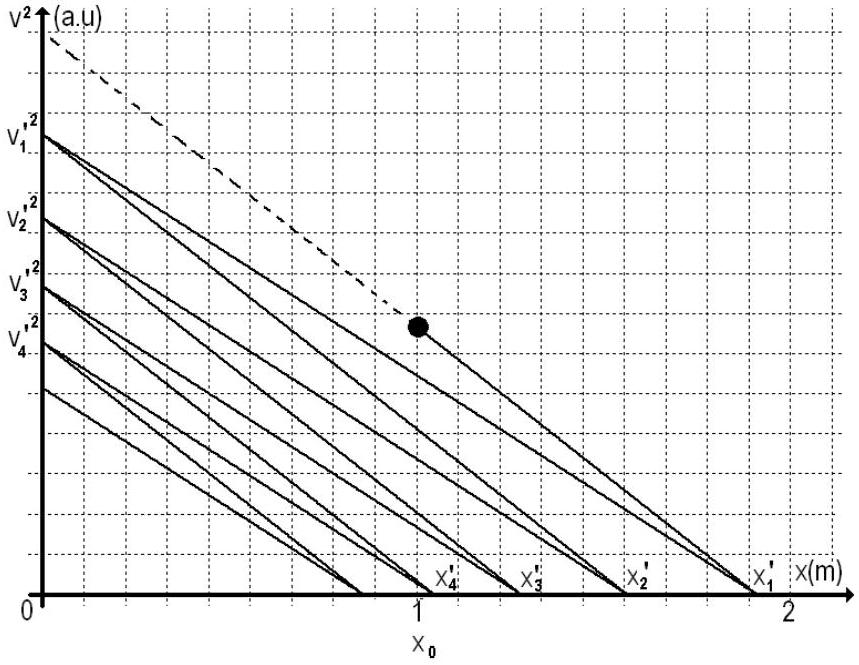
Figure 1.10

And the evolution of the speed as function of the position is presented in the figure 1.11.

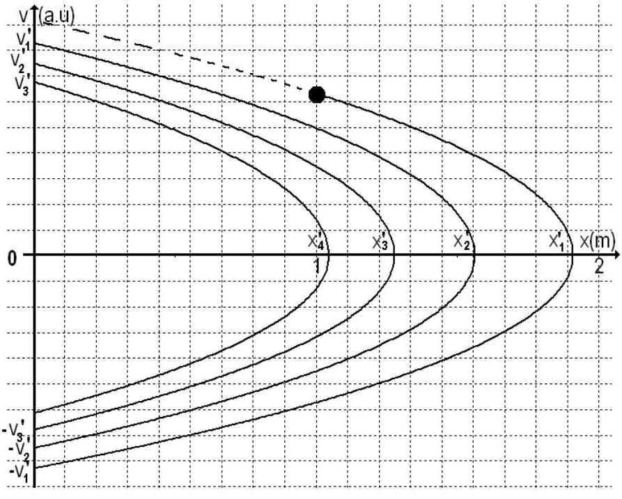
Figure 1.11

The sum of the geometrical progression (1.92) gives (after the doubling and then subtracting of the $x _ { 0 }$ ) the total distance covered by the particle.

$$
\begin{equation*}
\sum _ { k = 1 } ^ { \infty } x _ { k } ^ { \prime } = x _ { 1 } ^ { \prime } \frac { 1 } { 1 - q ^ { 2 } } \tag{1.97}
\end{equation*}
$$

Considering (1.97), (1.71) and (1.72) it results

$$
\begin{equation*}
\sum _ { k = 1 } ^ { \infty } x _ { k } { } ^ { \prime } = \frac { 21 } { 2 } m \tag{1.98}
\end{equation*}
$$

The total distance covered by the particle is

$$
\left\{ \begin{array} { l }
D = 2 \cdot \sum _ { k = 1 } ^ { \infty } x _ { k } { } ^ { \prime } - x _ { 0 }  \tag{1.99}\\
D = 20 \mathrm {~m}
\end{array} \right.
$$

which allows us to find again the result ( 1.14 ).

Professor Delia DAVIDESCU, National Department of Evaluation and Examination-Ministry of Education and Research- Bucharest, Romania Professor Adrian S.DAFINEI,PhD, Faculty of Physics - University of Bucharest, Romania
