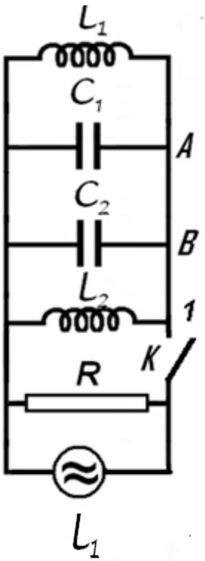
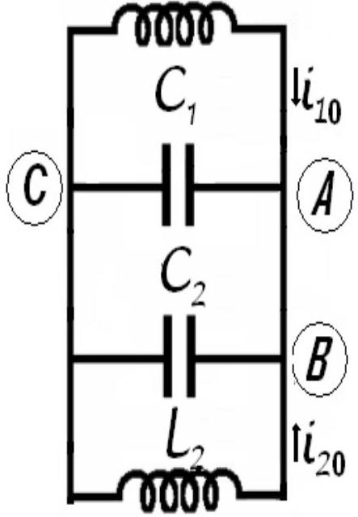
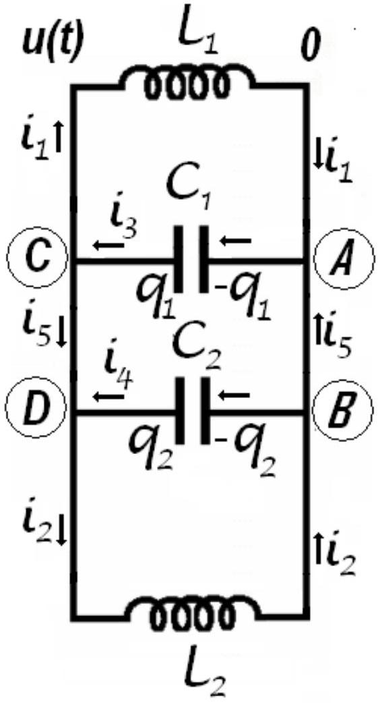
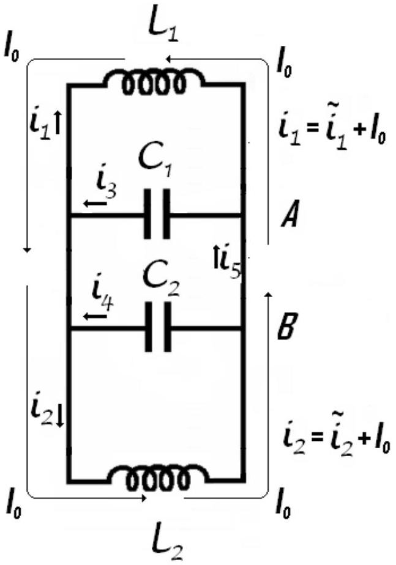

## Electricity - Problem II (8 points)

## Different kind of oscillation

Let's consider the electric circuit in the figure, for which $L _ { 1 } = 10 m H$, $L _ { 2 } = 20 m H , C _ { 1 } = 10 n F , C _ { 2 } = 5 n F$ and $R = 100 k \Omega$. The switch $K$ being closed the circuit is coupled with a source of alternating current. The current furnished by the source has constant intensity while the frequency of the current may be varied.

a. Find the ratio of frequency $f _ { m }$ for which the active power in circuit has the maximum value $P _ { m }$ and the frequency difference $\Delta f = f _ { + } - f _ { - }$of the frequencies $f _ { + }$and $f _ { - }$for which the active power in the circuit is half of the maximum power $P _ { m }$.

The switch $K$ is now open. In the moment $t _ { 0 }$ immediately after the switch is open the intensities of the currents in the coils $L _ { 1 }$ and $i _ { 01 } = 0,1 A$ and $i _ { 02 } = 0,2 A L _ { 1 }$ (the currents flow as in the figure); at

the same moment, the potential difference on the capacitor with capacity $C _ { 1 }$ is $u _ { 0 } = 40 \mathrm {~V}$ :

b. Calculate the frequency of electromagnetic oscillation in $L _ { 1 } C _ { 1 } C _ { 2 } L _ { 2 }$ circuit;
c. Determine the intensity of the electric current in the $A B$ conductor;
d. Calculate the amplitude of the oscillation of the intensity of electric current in the coil $L _ { 1 }$.

Neglect the mutual induction of the coils, and the electric resistance of the conductors. Neglect the fast transition phenomena occurring when the switch is closed or opened.

$$
u _ { A C } \left( t _ { 0 } \right) = u _ { 0 }
$$

## Probsem II - Solution

a. As is very well known in the study of AC circuits using the formalism of complex numbers, a complex inductive reactance $\overline { X _ { L } } = L \cdot \omega \cdot j , ( j = \sqrt { - 1 } )$ is attached to the inductance $L$ - part of a circuit supplied with an alternative current having the pulsation $\omega$.
Similar, a complex capacitive reactance $\overline { X _ { C } } = - \frac { j } { C \cdot \omega }$ is attached to the capacity $C$.
A parallel circuit will be characterized by his complex admittance $\bar { Y }$.
The admittance of the AC circuit represented in the figure is

$$
\left\{ \begin{array} { l }
\bar { Y } = \frac { 1 } { R } + \frac { 1 } { L _ { 1 } \cdot \omega \cdot j } + \frac { 1 } { L _ { 2 } \cdot \omega \cdot j } - \frac { C _ { 1 } \cdot \omega } { j } - \frac { C _ { 2 } \cdot \omega } { j }  \tag{2.1}\\
\bar { Y } = \frac { 1 } { R } + j \cdot \left[ \left( C _ { 1 } + C _ { 2 } \right) - \left( \frac { 1 } { L _ { 1 } } + \frac { 1 } { L _ { 2 } } \right) \right]
\end{array} \right.
$$

The circuit behave as if has a parallel equivalent capacity $C$

$$
\begin{equation*}
C = C _ { 1 } + C _ { 2 } \tag{2.2}
\end{equation*}
$$

and a parallel equivalent inductance $L$

$$
\left\{ \begin{array} { l }
\frac { 1 } { L } = \frac { 1 } { L _ { 1 } } + \frac { 1 } { L _ { 2 } }  \tag{2.3}\\
L = \frac { L _ { 1 } L _ { 2 } } { L _ { 1 } + L _ { 2 } }
\end{array} \right.
$$

The complex admittance of the circuit may be written as

$$
\begin{equation*}
\bar { Y } = \frac { 1 } { R } + j \cdot \left( C \cdot \omega - \frac { 1 } { L \cdot \omega } \right) \tag{2.4}
\end{equation*}
$$

and the complex impedance of the circuit will be

$$
\left\{ \begin{array} { l }
\bar { Z } = \frac { 1 } { \bar { Y } }  \tag{2.5}\\
\bar { Z } = \frac { \frac { 1 } { R } + j \cdot \left( \frac { 1 } { L \cdot \omega } - C \cdot \omega \right) } { \sqrt { \left( \frac { 1 } { R } \right) ^ { 2 } + \left( C \cdot \omega - \frac { 1 } { L \cdot \omega } \right) ^ { 2 } } }
\end{array} \right.
$$

The impedance $Z$ of the circuit, the inverse of the admittance of the circuit $Y$ is the modulus of the complex impedance $\bar { Z }$

$$
\begin{equation*}
Z = | \bar { Z } | = \frac { 1 } { \sqrt { \left( \frac { 1 } { R } \right) ^ { 2 } + \left( C \cdot \omega - \frac { 1 } { L \cdot \omega } \right) ^ { 2 } } } = \frac { 1 } { Y } \tag{2.6}
\end{equation*}
$$

The constant current source supplying the circuit furnish a current having a momentary value $i ( t )$

$$
\begin{equation*}
i ( t ) = 1 \cdot \sqrt { 2 } \cdot \sin ( \omega \cdot t ) , \tag{2.7}
\end{equation*}
$$

where $I$ is the effective intensity (constant), of the current and $\omega$ is the current pulsation (that can vary). The potential difference at the jacks of the circuit has the momentary value $u ( t )$

$$
\begin{equation*}
u ( t ) = U \cdot \sqrt { 2 } \cdot \sin ( \omega \cdot t + \varphi ) \tag{2.8}
\end{equation*}
$$

where $U$ is the effective value of the tension and $\varphi$ is the phase difference between tension and current.
The effective values of the current and tension obey the relation

The active power in the circuit is

$$
\begin{equation*}
P = \frac { U ^ { 2 } } { R } = \frac { Z ^ { 2 } \cdot I ^ { 2 } } { R } \tag{2.10}
\end{equation*}
$$

Because as in the enounce,

$$
\left\{ \begin{array} { l }
I = \text { constant }  \tag{2.11}\\
R = \text { constant }
\end{array} \right.
$$

the maximal active power is realized for the maximum value of the impedance that is the minimal value of the admittance .
The admittance

$$
\begin{equation*}
Y = \sqrt { \left( \frac { 1 } { R } \right) ^ { 2 } + \left( C \cdot \omega - \frac { 1 } { L \cdot \omega } \right) ^ { 2 } } \tag{2.12}
\end{equation*}
$$

has- as function of the pulsation $\omega$ - an „the smallest value”

$$
\begin{equation*}
Y _ { \min } = \frac { 1 } { R } \tag{2.13}
\end{equation*}
$$

for the pulsation

$$
\begin{equation*}
\omega _ { m } = \frac { 1 } { \sqrt { L \cdot C } } \tag{2.14}
\end{equation*}
$$

In this case

$$
\begin{equation*}
\left( C \cdot \omega - \frac { 1 } { L \cdot \omega } \right) = 0 . \tag{2.15}
\end{equation*}
$$

So, the minimal active power in the circuit has the value

$$
\begin{equation*}
P _ { m } = R \cdot I ^ { 2 } \tag{2.16}
\end{equation*}
$$

and occurs in the situation of alternative current furnished by the source at the frequency $f _ { m }$

$$
\begin{equation*}
f _ { m } = \frac { 1 } { 2 \pi } \omega _ { m } = \frac { 1 } { 2 \pi \cdot \sqrt { C \cdot L } } \tag{2.17}
\end{equation*}
$$

To ensure that the active power is half of the maximum power it is necessary that

$$
\left\{ \begin{array} { l }
P = \frac { 1 } { 2 } P _ { m }  \tag{2.18}\\
\frac { Z ^ { 2 } \cdot I ^ { 2 } } { R } = \frac { 1 } { 2 } R \cdot I ^ { 2 } \\
\frac { 2 } { R ^ { 2 } } = \frac { 1 } { Z ^ { 2 } } = Y ^ { 2 }
\end{array} \right.
$$

That is

$$
\left\{ \begin{array} { l }
\frac { 2 } { R ^ { 2 } } = \frac { 1 } { R ^ { 2 } } + \left( C \cdot \omega - \frac { 1 } { L \cdot \omega } \right) ^ { 2 }  \tag{2.19}\\
\pm \frac { 1 } { R } = C \cdot \omega - \frac { 1 } { L \cdot \omega }
\end{array} \right.
$$

The pulsation of the current ensuring an active power at half of the maximum power must satisfy one of the equations

$$
\begin{equation*}
\omega ^ { 2 } \pm \frac { 1 } { R \cdot C } \omega - \frac { 1 } { L \cdot C } = 0 \tag{2.20}
\end{equation*}
$$

The two second degree equation may furnish the four solutions

$$
\begin{equation*}
\omega = \pm \frac { 1 } { 2 R \cdot C } \pm \frac { 1 } { 2 } \sqrt { \left( \frac { 1 } { R \cdot C } \right) ^ { 2 } + \frac { 4 } { L \cdot C } } \tag{2.21}
\end{equation*}
$$

Because the pulsation is every time positive, and because

$$
\begin{equation*}
\sqrt { \left( \frac { 1 } { R \cdot C } \right) ^ { 2 } + \frac { 4 } { L \cdot C } } > \frac { 1 } { R \cdot C } \tag{2.22}
\end{equation*}
$$

the only two valid solutions are

$$
\begin{equation*}
\omega _ { \pm } = \frac { 1 } { 2 } \sqrt { \left( \frac { 1 } { R \cdot C } \right) ^ { 2 } + \frac { 4 } { L \cdot C } } \pm \frac { 1 } { 2 R \cdot C } \tag{2.23}
\end{equation*}
$$

It exist two frequencies $f _ { \pm } = \frac { 1 } { 2 \pi } \omega _ { \pm }$allowing to obtain in the circuit an active power representing half of the maximum power.

$$
\left\{ \begin{array} { l }
f _ { + } = \frac { 1 } { 2 \pi } \left( \frac { 1 } { 2 } \sqrt { \left( \frac { 1 } { R \cdot C } \right) ^ { 2 } + \frac { 4 } { L \cdot C } } + \frac { 1 } { 2 R \cdot C } \right)  \tag{2.24}\\
f _ { - } = \frac { 1 } { 2 \pi } \left( \frac { 1 } { 2 } \sqrt { \left( \frac { 1 } { R \cdot C } \right) ^ { 2 } + \frac { 4 } { L \cdot C } } - \frac { 1 } { 2 R \cdot C } \right)
\end{array} \right.
$$

The difference of these frequencies is

$$
\begin{equation*}
\Delta f = f _ { + } - f _ { - } = \frac { 1 } { 2 \pi } \frac { 1 } { R \cdot C } \tag{2.25}
\end{equation*}
$$

the bandwidth of the circuit - the frequency interval around the resonance frequency having at the ends a signal representing $1 / \sqrt { 2 }$ from the resonance signal. At the ends of the bandwidth the active power reduces at the half of his value at the resonance.
The asked ratio is

$$
\left\{ \begin{array} { l }
\frac { f _ { m } } { \Delta f } = \frac { R \cdot C } { \sqrt { L \cdot C } } = R \sqrt { \frac { C } { L } }  \tag{2.26}\\
\frac { f _ { m } } { \Delta f } = R \sqrt { \frac { \left( C _ { 1 } + C _ { 2 } \right) \cdot \left( L _ { 1 } + L _ { 2 } \right) } { L _ { 1 } \cdot L _ { 2 } } }
\end{array} \right.
$$

Because

$$
\left\{ \begin{array} { l }
C = 15 n F \\
L = \frac { 20 } { 3 } m H
\end{array} \right.
$$

it results that

$$
\omega _ { m } = 10 ^ { 5 } \mathrm { rad } \cdot \mathrm {~s} ^ { - 1 }
$$

and

$$
\begin{equation*}
\frac { f _ { m } } { \Delta f } = R \sqrt { \frac { C } { L } } = 100 \times 10 ^ { 3 } \cdot \sqrt { \frac { 3 \cdot 15 \times 10 ^ { - 9 } } { 20 \times 10 ^ { - 3 } } } = 150 \tag{2.27}
\end{equation*}
$$

The (2.26) relation is the answer at the question a.
b. The fact that immediately after the source is detached it is a current in the coils, allow as to admit that currents dependents on time will continue to flow through the coils.

Figure 2.1

The capacitors will be charged with charges variable in time. The variation of the charges of the capacitors will results in currents flowing through the conductors linking the capacitors in the circuit. The momentary tension on the jacks of the coils and capacitors - identical for all elements in circuit - is also dependent on time. Let's admit that the electrical potential of the points $C$ and $D$ is $u ( t )$ and the

potential of the points $A$ and $B$ is zero. If through the inductance $L _ { 1 }$ passes the variable current having the momentary value $i _ { 1 } ( t )$, the relation between the current and potentials is

$$
\begin{equation*}
u ( t ) - L _ { 1 } \frac { d i _ { 1 } } { d t } = 0 \tag{2.28}
\end{equation*}
$$

The current passing through the second inductance $i _ { 2 } ( t )$ has the expression,

$$
\begin{equation*}
u ( t ) - L _ { 2 } \frac { d i _ { 2 } } { d t } = 0 \tag{2.29}
\end{equation*}
$$

If on the positive plate of the capacitor having the capacity $C _ { 1 }$ is stocked the charge $q _ { 1 } ( t )$, then at the jacks of the capacitor the electrical tension is $u ( t )$ and

$$
\begin{equation*}
q _ { 1 } = C _ { 1 } \cdot u \tag{2.30}
\end{equation*}
$$

Deriving this relation it results

$$
\begin{equation*}
\frac { d q _ { 1 } } { d t } = C _ { 1 } \cdot \frac { d u } { d t } \tag{2.31}
\end{equation*}
$$

But

$$
\begin{equation*}
\frac { d q _ { 1 } } { d t } = - i _ { 3 } \tag{2.32}
\end{equation*}
$$

because the electrical current appears because of the diminishing of the electrical charge on capacitor plate. Consequently

$$
\begin{equation*}
i _ { 3 } = - C _ { 1 } \cdot \frac { d u } { d t } \tag{2.33}
\end{equation*}
$$

Analogous, for the other capacitor,

$$
\begin{equation*}
i _ { 4 } = - C _ { 4 } \cdot \frac { d u } { d t } \tag{2.34}
\end{equation*}
$$

Considering all obtained results

$$
\left\{ \begin{array} { l }
\frac { d i _ { 1 } } { d t } = \frac { u } { L _ { 1 } }  \tag{2.35}\\
\frac { d i _ { 2 } } { d t } = \frac { u } { L _ { 2 } }
\end{array} \right.
$$

respectively

$$
\left\{ \begin{array} { l }
\frac { d i _ { 3 } } { d t } = - C _ { 1 } \frac { d ^ { 2 } u } { d t ^ { 2 } }  \tag{2.36}\\
\frac { d i _ { 4 } } { d t } = C _ { 2 } \frac { d ^ { 2 } u } { d t ^ { 2 } }
\end{array} \right.
$$

Denoting $i _ { 5 } ( t )$ the momentary intensity of the current flowing from point $B$ to the point $A$, then the same momentary intensity has the current through the points $C$ and $D$. For the point $A$ the Kirchhoff rule of the currents gives

For $B$ point the same rule produces

$$
\begin{equation*}
i _ { 4 } + i _ { 5 } = i _ { 2 } \tag{2.38}
\end{equation*}
$$

Considering (2.37) and (2.38) results

$$
\begin{equation*}
i _ { 1 } - i _ { 3 } = i _ { 4 } - i _ { 2 } \tag{2.39}
\end{equation*}
$$

and deriving

$$
\begin{equation*}
\frac { d i _ { 1 } } { d t } - \frac { d i _ { 3 } } { d t } = \frac { d i _ { 4 } } { d t } - \frac { d i _ { 2 } } { d t } \tag{2.40}
\end{equation*}
$$

that is

$$
\left\{ \begin{array} { l }
- \frac { u } { L _ { 1 } } - \frac { u } { L _ { 2 } } = C _ { 1 } \frac { d ^ { 2 } u } { d t ^ { 2 } } + C _ { 2 } \frac { d ^ { 2 } u } { d t ^ { 2 } }  \tag{2.41}\\
- u \cdot \left( \frac { 1 } { L _ { 1 } } + \frac { 1 } { L _ { 2 } } \right) = \frac { d ^ { 2 } u } { d t ^ { 2 } } \cdot \left( C _ { 1 } + C _ { 2 } \right)
\end{array} \right.
$$

Using the symbols defined above

$$
\left\{ \begin{array} { l }
- \frac { u } { L } = \frac { d ^ { 2 } u } { d t ^ { 2 } } \cdot C  \tag{2.42}\\
\ddot { u } + \frac { 1 } { L C } u = 0
\end{array} \right.
$$

Because the tension obeys the relation above, it must have a harmonic dependence on time

$$
\begin{equation*}
u ( t ) = A \cdot \sin ( \omega \cdot t + \delta ) \tag{2.43}
\end{equation*}
$$

The pulsation of the tension is

$$
\begin{equation*}
\omega = \frac { 1 } { \sqrt { L \cdot C } } \tag{2.44}
\end{equation*}
$$

Taking into account the relations (2.43) and (2.36) it results that

$$
\left\{ \begin{array} { l }
i _ { 3 } = - C _ { 1 } \frac { d } { d t } ( A \cdot \sin ( \omega \cdot t + \delta ) ) = - C _ { 1 } \cdot A \cdot \omega \cdot \cos ( \omega \cdot t + \delta )  \tag{2.45}\\
i _ { 4 } = - C _ { 2 } \frac { d } { d t } ( A \cdot \sin ( \omega \cdot t + \delta ) ) = - C _ { 2 } \cdot A \cdot \omega \cdot \cos ( \omega \cdot t + \delta )
\end{array} \right.
$$

and

$$
\left\{ \begin{array} { l }
\frac { d i _ { 1 } } { d t } = \frac { u } { L _ { 1 } } = \frac { 1 } { L _ { 1 } } \cdot A \cdot \sin ( \omega \cdot t + \delta )  \tag{2.46}\\
\frac { d i _ { 2 } } { d t } = \frac { u } { L _ { 2 } } = \frac { 1 } { L _ { 2 } } \cdot A \cdot \sin ( \omega \cdot t + \delta )
\end{array} \right.
$$

It results that

$$
\left\{ \begin{array} { l }
i _ { 1 } = \frac { 1 } { L _ { 1 } \cdot \omega } \cdot A \cdot \cos ( \omega \cdot t + \delta ) + M  \tag{2.47}\\
i _ { 2 } = \frac { 1 } { L _ { 2 } \cdot \omega } \cdot A \cdot \cos ( \omega \cdot t + \delta ) + N
\end{array} \right.
$$

In the expression above, $A , M , N$ and $\delta$ are constants that must be determined using initially conditions. It is remarkable that the currents through capacitors are sinusoidal but the currents through the coils are the sum of sinusoidal and constant currents.
In the first moment

$$
\left\{ \begin{array} { l }
u ( 0 ) = u _ { 0 } = 40 \mathrm {~V}  \tag{2.48}\\
i _ { 1 } ( 0 ) = i _ { 01 } = 0,1 \mathrm {~A} \\
i _ { 2 } ( 0 ) = i _ { 02 } = 0,2 \mathrm {~A}
\end{array} \right.
$$

Because the values of the inductances and capacities are

$$
\left\{ \begin{array} { l }
L _ { 1 } = 0,01 \mathrm { H }  \tag{2.49}\\
L _ { 2 } = 0,02 \mathrm { H } \\
C _ { 1 } = 10 \mathrm { nF } \\
C _ { 2 } = 5 \mathrm { nF }
\end{array} \right.
$$

the equivalent inductance and capacity is

$$
\left\{ \begin{array} { l }
\frac { 1 } { L } = \frac { 1 } { L _ { 1 } } + \frac { 1 } { L _ { 2 } }  \tag{2.50}\\
L = \frac { L _ { 1 } \cdot L _ { 2 } } { L _ { 1 } + L _ { 2 } } \\
L = \frac { 2 \times 10 ^ { - 4 } } { 3 \times 10 ^ { - 2 } } H = \frac { 1 } { 150 } H
\end{array} \right.
$$

respectively

$$
\left\{ \begin{array} { l }
C = C _ { 1 } + C _ { 2 }  \tag{2.51}\\
C = 15 n F
\end{array} . \right.
$$

From (2.44) results

$$
\begin{equation*}
\omega = \frac { 1 } { \sqrt { \frac { 1 } { 150 } \cdot 15 \times 10 ^ { - 9 } } } = 10 ^ { 5 } \mathrm { rad } \cdot \mathrm {~s} ^ { - 1 } \tag{2.52}
\end{equation*}
$$

The value of the pulsation allows calculating the value of the requested frequency $\mathbf { b }$. This frequency has the value $f$

$$
\begin{equation*}
f = \frac { \omega } { 2 \pi } = \frac { 10 ^ { 5 } } { 2 \pi } \mathrm {~Hz} \tag{2.53}
\end{equation*}
$$

c. If the momentary tension on circuit is like in (2.43), one may write

$$
\left\{ \begin{array} { l }
u ( 0 ) = A \cdot \sin ( \delta ) = u _ { 0 }  \tag{2.54}\\
\sin ( \delta ) = \frac { u _ { 0 } } { A }
\end{array} \right.
$$

From the currents (2.47) is possible to write

$$
\left\{ \begin{array} { l }
i _ { 01 } = \frac { 1 } { L _ { 1 } \cdot \omega } \cdot A \cdot \cos ( \delta ) + M  \tag{2.55}\\
i _ { 02 } = \frac { 1 } { L _ { 2 } \cdot \omega } \cdot A \cdot \cos ( \delta ) + N
\end{array} \right.
$$

On the other side is possible to express (2.39) as

$$
\left\{ \begin{array} { l }
i _ { 1 } - i _ { 3 } = i _ { 4 } - i _ { 2 }  \tag{2.56}\\
\frac { 1 } { L _ { 1 } \cdot \omega } \cdot A \cdot \cos ( \omega \cdot t + \delta ) + M + C _ { 1 } \cdot A \cdot \omega \cdot \cos ( \omega \cdot t + \delta ) = \\
- C _ { 2 } \cdot A \cdot \omega \cdot \cos ( \omega \cdot t + \delta ) - \frac { 1 } { L _ { 2 } \cdot \omega } \cdot A \cdot \cos ( \omega \cdot t + \delta ) - N
\end{array} \right.
$$

An identity as

$$
\begin{equation*}
A \cdot \cos \alpha + B \equiv C \cdot \cos \alpha + D \tag{2.57}
\end{equation*}
$$

is valuable for any value of the argument $\alpha$ only if

$$
\left\{ \begin{array} { l }
A = C  \tag{2.58}\\
B = D
\end{array} \right.
$$

Considering (2.58), from (2.56) it results

$$
\left\{ \begin{array} { l }
M + N = 0  \tag{2.59}\\
A \cdot \omega \cdot \left( C _ { 1 } + C _ { 2 } \right) = - \frac { A } { \omega } \cdot \left( \frac { 1 } { L _ { 1 } } + \frac { 1 } { L _ { 2 } } \right)
\end{array} \right.
$$

For the last equation it results that the circuit oscillate with the pulsation in the relation (2.44) Adding relations (2.55) and considering (2.54) and (2.59) results that

$$
\left\{ \begin{array} { l }
i _ { 01 } + i _ { 02 } = A \cdot \cos ( \delta ) \cdot \frac { 1 } { \omega } \cdot \left( \frac { 1 } { L _ { 1 } } + \frac { 1 } { L _ { 1 } } \right)  \tag{2.60}\\
A = \frac { i _ { 01 } + i _ { 02 } } { \cos ( \delta ) \cdot \frac { 1 } { \omega } \cdot \left( \frac { 1 } { L _ { 1 } } + \frac { 1 } { L _ { 1 } } \right) } \\
\cos \delta = \frac { i _ { 01 } + i _ { 02 } } { A \cdot \frac { 1 } { \omega } \cdot \left( \frac { 1 } { L _ { 1 } } + \frac { 1 } { L _ { 1 } } \right) } \\
\cos \delta = \frac { \left( i _ { 01 } + i _ { 02 } \right) \cdot L \cdot \omega } { A }
\end{array} \right.
$$

The numerical value of the amplitude of the electrical tension results by summing the last relations from (2.54) and (2.60)

$$
\left\{ \begin{array} { l }
\sin ( \delta ) = \frac { u _ { 0 } } { A }  \tag{2.61}\\
\cos \delta = \frac { \left( i _ { 01 } + i _ { 02 } \right) \cdot L \cdot \omega } { A } \\
( \cos ( \delta ) ) ^ { 2 } + ( \sin ( \delta ) ) ^ { 2 } = 1 \\
\left( \frac { u _ { 0 } } { A } \right) ^ { 2 } + \left( \frac { \left( i _ { 01 } + i _ { 02 } \right) \cdot L \cdot \omega } { A } \right) ^ { 2 } = 1 \\
A = \sqrt { \left( u _ { 0 } \right) ^ { 2 } + \left( \left( i _ { 01 } + i _ { 02 } \right) \cdot L \cdot \omega \right) ^ { 2 } }
\end{array} \right.
$$

The numerical value of the electrical tension on the jacks of the circuit is

$$
\left\{ \begin{array} { l }
A = \sqrt { ( 40 ) ^ { 2 } + \left( ( 0,3 ) \cdot \frac { 1 } { 150 } \cdot 10 ^ { 5 } \right) ^ { 2 } }  \tag{2.62}\\
A = \sqrt { ( 40 ) ^ { 2 } + ( 200 ) ^ { 2 } } = 40 \sqrt { 26 } \mathrm {~V}
\end{array} \right.
$$

And consequently from (2.54) results

$$
\left\{ \begin{array} { l }
\sin ( \delta ) = \frac { u _ { 0 } } { A }  \tag{2.63}\\
\sin ( \delta ) = \frac { 40 } { 40 \sqrt { 26 } } = \frac { 1 } { \sqrt { 26 } }
\end{array} \right.
$$

and

$$
\begin{equation*}
\cos ( \delta ) = \frac { 5 } { \sqrt { 26 } } \tag{2.64}
\end{equation*}
$$

Also

$$
\left\{ \begin{array} { l }
\operatorname { tg } ( \delta ) = \frac { 1 } { 5 }  \tag{2.65}\\
\delta = \operatorname { arctg } ( 1 / 5 )
\end{array} \right.
$$

From (2.55)

$$
\left\{ \begin{array} { l }
M = i _ { 01 } - \frac { 1 } { L _ { 1 } \cdot \omega } \cdot A \cdot \cos ( \delta )  \tag{2.66}\\
N = i _ { 02 } - \frac { 1 } { L _ { 2 } \cdot \omega } \cdot A \cdot \cos ( \delta )
\end{array} \right.
$$

the corresponding numerical values are

$$
\left\{ \begin{array} { l }
M = \left( 0,1 - \frac { 1 } { 0,01 \cdot 10 ^ { 5 } } \cdot 40 \sqrt { 26 } \cdot \frac { 5 } { \sqrt { 26 } } \right) A = - 0,1 A  \tag{2.67}\\
N = \left( 0,2 - \frac { 1 } { 0,02 \cdot 10 ^ { 5 } } \cdot 40 \sqrt { 26 } \cdot \frac { 5 } { \sqrt { 26 } } \right) A = 0,1 A
\end{array} \right.
$$

The relations (2.47) becomes

$$
\left\{ \begin{array} { l }
i _ { 1 } = \left( \frac { 4 \sqrt { 26 } } { 100 } \cdot \cos \left( 10 ^ { 5 } \cdot t + \operatorname { arctg } ( 1 / 5 ) \right) - 0,1 \right) A = \tilde { i } _ { 1 } - I _ { 0 }  \tag{2.68}\\
i _ { 2 } = \left( \frac { 2 \sqrt { 26 } } { 100 } \cdot \cos \left( 10 ^ { 5 } \cdot t + \operatorname { arctg } ( 1 / 5 ) \right) + 0,1 \right) A = \tilde { i } _ { 2 } + I _ { 0 }
\end{array} \right.
$$

The currents through the coils are the superposition of sinusoidal currents having different amplitudes and a direct current passing only through the coils. This direct current has the constant value

$$
\begin{equation*}
I _ { 0 } = 0,1 \mathrm {~A} \tag{2.69}
\end{equation*}
$$

as in the figure 2.2.

Figure 2.2

The alternative currents through the coils has the expressions

$$
\left\{ \begin{array} { l }
\tilde { i } _ { 1 } = \left( \frac { 4 \sqrt { 26 } } { 100 } \cdot \cos \left( 10 ^ { 5 } \cdot t + \operatorname { arctg } ( 1 / 5 ) \right) \right) A  \tag{2.70}\\
\tilde { i } _ { 2 } = \left( \frac { 2 \sqrt { 26 } } { 100 } \cdot \cos \left( 10 ^ { 5 } \cdot t + \operatorname { arctg } ( 1 / 5 ) \right) \right) A
\end{array} \right.
$$

The currents through the capacitors has the forms

$$
\left\{ \begin{array} { l }
i _ { 3 } = \left( - 10 \times 10 ^ { - 4 } \cdot 40 \sqrt { 26 } \cdot \cos \left( 10 ^ { 5 } \cdot t + \operatorname { arctg } ( 1 / 5 ) \right) \right) A  \tag{2.71}\\
i _ { 3 } = \left( - \frac { 4 \sqrt { 26 } } { 100 } \cos \left( 10 ^ { 5 } \cdot t + \operatorname { arctg } ( 1 / 5 ) \right) \right) A \\
i _ { 4 } = \left( - 5 \times 10 ^ { - 4 } \cdot 40 \sqrt { 26 } \cdot \cos \left( 10 ^ { 5 } \cdot t + \operatorname { arctg } ( 1 / 5 ) \right) \right) A \\
i _ { 4 } = \left( - \frac { 2 \sqrt { 26 } } { 100 } \cos \left( 10 ^ { 5 } \cdot t + \operatorname { arctg } ( 1 / 5 ) \right) \right) A
\end{array} \right.
$$

The current $i _ { 5 }$ has the expression

$$
\left\{ \begin{array} { l }
i _ { 5 } = i _ { 3 } - i _ { 1 }  \tag{2.72}\\
i _ { 5 } = \left( - \frac { 8 \sqrt { 26 } } { 100 } \cos \left( 10 ^ { 5 } \cdot t + \operatorname { arctg } ( 1 / 5 ) \right) + 0,1 \right) A
\end{array} \right.
$$

The value of the intensity of $i _ { 5 }$ current is the answer from the question c.
The initial value of this current is

$$
\begin{equation*}
i _ { 5 } = \left( - \frac { 8 \sqrt { 26 } } { 100 } \frac { 5 } { \sqrt { 26 } } + 0,1 \right) A = - 0,3 A \tag{2.73}
\end{equation*}
$$

d. The amplitude of the current through the inductance $L _ { 1 }$ is

$$
\begin{equation*}
\max \left( \tilde { i _ { 1 } } \right) = \max \left( \frac { 4 \sqrt { 26 } } { 100 } \cdot \cos \left( 10 ^ { 5 } \cdot t + \operatorname { arctg } ( 1 / 5 ) \right) A \right) = \frac { 4 \sqrt { 26 } } { 100 } A \approx 0,2 A \tag{2.74}
\end{equation*}
$$

representing the answer at the question d.
