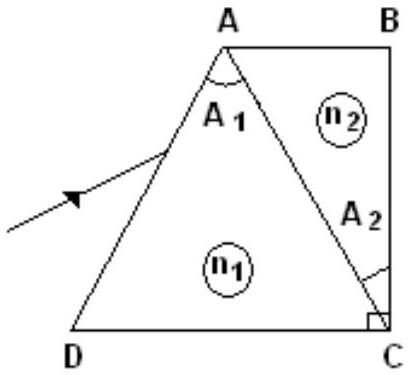
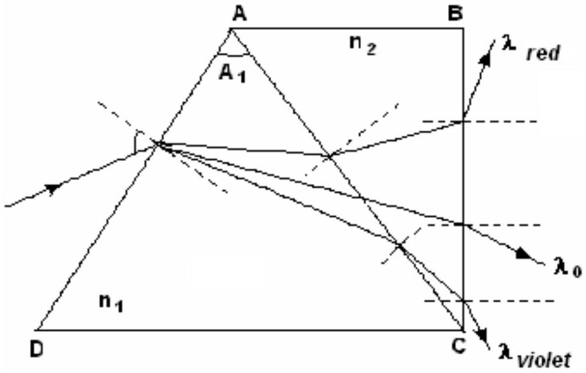
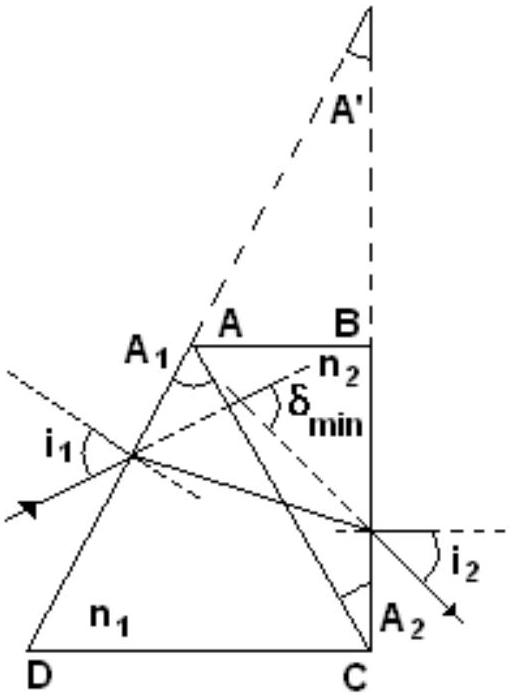
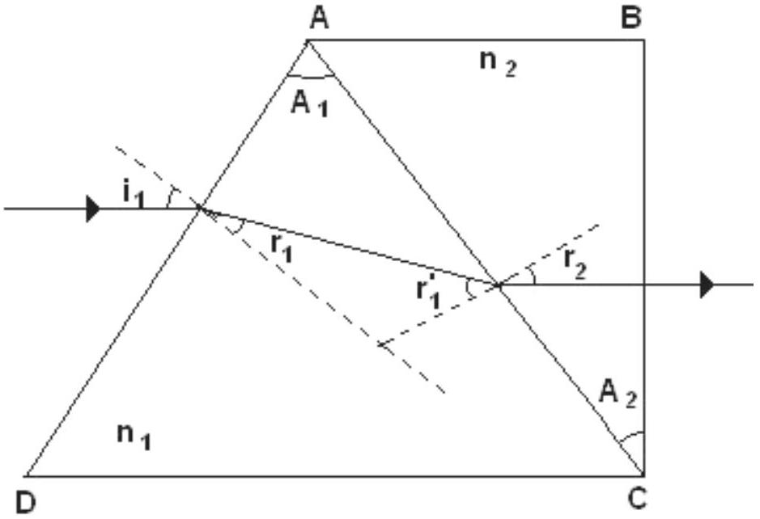

## Optics - Pro6lem III (7points)

## Prisms

Two dispersive prisms having apex angles $\hat { A } _ { 1 } = 60 ^ { \circ }$ and $\hat { A } _ { 2 } = 30 ^ { \circ }$ are glued as in the figure ( $\hat { C } = 90 ^ { \circ }$ ). The dependences of refraction indexes of the prisms on the wavelength are given by the relations

$$
\begin{aligned}
& n _ { 1 } ( \lambda ) = a _ { 1 } + \frac { b _ { 1 } } { \lambda ^ { 2 } } ; \\
& n _ { 2 } ( \lambda ) = a _ { 2 } + \frac { b _ { 2 } } { \lambda ^ { 2 } }
\end{aligned}
$$

were

$$
a _ { 1 } = 1,1 , \quad b _ { 1 } = 1 \cdot 10 ^ { 5 } n m ^ { 2 } , \quad a _ { 2 } = 1,3 , \quad b _ { 2 } = 5 \cdot 10 ^ { 4 } n m ^ { 2 } .
$$

a. Determine the wavelength $\lambda _ { 0 }$ of the incident radiation that pass through the prisms without refraction on $A C$ face at any incident angle; determine the corresponding refraction indexes of the prisms.
b. Draw the ray path in the system of prisms for three different radiations $\lambda _ { \text {red } } , \lambda _ { 0 } , \lambda _ { \text {violet } }$ incident on the system at the same angle.
c. Determine the minimum deviation angle in the system for a ray having the wavelength $\lambda _ { 0 }$.
d. Calculate the wavelength of the ray that penetrates and exits the system along directions parallel to DC.

## Problem III - Solution

a. The ray with the wavelength $\lambda _ { 0 }$ pass trough the prisms system without refraction on $A C$ face at any angle of incidence if :

$$
n _ { 1 } \left( \lambda _ { 0 } \right) = n _ { 2 } \left( \lambda _ { 0 } \right)
$$

Because the dependence of refraction indexes of prisms on wavelength has the form :

$$
\begin{align*}
& n _ { 1 } ( \lambda ) = a _ { 1 } + \frac { b _ { 1 } } { \lambda ^ { 2 } }  \tag{3.1}\\
& n _ { 2 } ( \lambda ) = a _ { 2 } + \frac { b _ { 2 } } { \lambda ^ { 2 } } \tag{3.2}
\end{align*}
$$

The relation (3.1) becomes:

$$
\begin{equation*}
a _ { 1 } + \frac { b _ { 1 } } { \lambda _ { 0 } { } ^ { 2 } } = a _ { 2 } + \frac { b _ { 2 } } { \lambda _ { 0 } { } ^ { 2 } } \tag{3.3}
\end{equation*}
$$

The wavelength $\lambda _ { 0 }$ has correspondingly the form:

$$
\begin{equation*}
\lambda _ { 0 } = \sqrt { \frac { b _ { 1 } - b _ { 2 } } { a _ { 2 } - a _ { 1 } } } \tag{3.4}
\end{equation*}
$$

Substituting the furnished numerical values

$$
\begin{equation*}
\lambda _ { 0 } = 500 \mathrm {~nm} \tag{3.5}
\end{equation*}
$$

The corresponding common value of indexes of refraction of prisms for the radiation with the wavelength $\lambda _ { 0 }$ is:

$$
\begin{equation*}
n _ { 1 } \left( \lambda _ { 0 } \right) = n _ { 2 } \left( \lambda _ { 0 } \right) = 1,5 \tag{3.6}
\end{equation*}
$$

The relations (3.6) and (3.7) represent the answers of question a.
b. For the rays with different wavelength $\left( \lambda _ { \text {red } } , \lambda _ { 0 } , \lambda _ { \text {violet } } \right)$ having the same incidence angle on first prism, the paths are illustrated in the figure 1.1.

Figure 3.1
The draw illustrated in the figure 1.1 represents the answer of question $\mathbf { b }$.

c. In the figure 1.2 is presented the path of ray with wavelength $\lambda _ { 0 }$ at minimum deviation (the angle between the direction of incidence of ray and the direction of emerging ray is minimal).

Figure 3.2

In this situation

$$
\begin{equation*}
n _ { 1 } \left( \lambda _ { 0 } \right) = n _ { 2 } \left( \lambda _ { 0 } \right) = \frac { \sin \frac { \delta _ { \min } + A ^ { \prime } } { 2 } } { \sin \frac { A ^ { \prime } } { 2 } } \tag{3.7}
\end{equation*}
$$

where

$$
m \left( \hat { A } ^ { \prime } \right) = 30 ^ { \circ } ,
$$

as in the figure 1.1
Substituting in (3.8) the values of refraction indexes the result is

$$
\begin{equation*}
\sin \frac { \delta _ { \min } + A ^ { \prime } } { 2 } = \frac { 3 } { 2 } \cdot \sin \frac { A ^ { \prime } } { 2 } \tag{3.8}
\end{equation*}
$$

or

$$
\begin{equation*}
\delta _ { \min } = 2 \arcsin \left( \frac { 3 } { 2 } \cdot \sin \frac { A ^ { \prime } } { 2 } \right) - \frac { A ^ { \prime } } { 2 } \tag{3.9}
\end{equation*}
$$

Numerically

$$
\begin{equation*}
\delta _ { \min } \cong 30,7 ^ { \circ } \tag{3.10}
\end{equation*}
$$

The relation (3.11) represents the answer of question c.

d. Using the figure 1.3 the refraction law on the $A D$ face is $\sin i _ { 1 } = n _ { 1 } \cdot \sin r _ { 1 }$

The refraction law on the $A C$ face is

$$
\begin{equation*}
n _ { 1 } \cdot \sin r _ { 1 } ^ { \prime } = n _ { 2 } \cdot \sin r _ { 2 } \tag{3.12}
\end{equation*}
$$

Figure 3.3

As it can be seen in the figure 1.3

$$
\begin{equation*}
r _ { 2 } = A _ { 2 } \tag{3.13}
\end{equation*}
$$

and

$$
\begin{equation*}
i _ { 1 } = 30 ^ { \circ } \tag{3.14}
\end{equation*}
$$

Also,

$$
\begin{equation*}
r _ { 1 } + r _ { 1 } ^ { \prime } = A _ { 1 } \tag{3.15}
\end{equation*}
$$

Substituting (3.16) and (3.14) in (3.13) it results

$$
\begin{equation*}
n _ { 1 } \cdot \sin \left( A _ { 1 } - r _ { 1 } \right) = n _ { 2 } \cdot \sin A _ { 2 } \tag{3.16}
\end{equation*}
$$

or

$$
\begin{equation*}
n _ { 1 } \cdot \left( \sin A _ { 1 } \cdot \cos r _ { 1 } - \sin r _ { 1 } \cdot \cos A _ { 1 } \right) = n _ { 2 } \cdot \sin A _ { 2 } \tag{3.17}
\end{equation*}
$$

Because of (3.12) and (3.15) it results that

$$
\begin{equation*}
\sin r _ { 1 } = \frac { 1 } { 2 n _ { 1 } } \tag{3.18}
\end{equation*}
$$

and

$$
\begin{equation*}
\cos r _ { 1 } = \frac { 1 } { 2 n _ { 1 } } \sqrt { 4 n _ { 1 } ^ { 2 } - 1 } \tag{3.19}
\end{equation*}
$$

Putting together the last three relations it results

$$
\begin{equation*}
\sqrt { 4 n _ { 1 } ^ { 2 } - 1 } = \frac { 2 n _ { 2 } \cdot \sin A _ { 2 } + \cos A _ { 1 } } { \sin A _ { 1 } } \tag{3.20}
\end{equation*}
$$

Because

$$
\hat { A } _ { 1 } = 60 ^ { \circ }
$$

and

$$
\hat { A } _ { 2 } = 30 ^ { \circ }
$$

relation (3.21) can be written as

$$
\begin{equation*}
\sqrt { 4 n _ { 1 } ^ { 2 } - 1 } = \frac { 2 n _ { 2 } + 1 } { \sqrt { 3 } } \tag{3.21}
\end{equation*}
$$

or

$$
\begin{equation*}
3 \cdot n _ { 1 } ^ { 2 } = 1 + n _ { 2 } + n _ { 2 } ^ { 2 } \tag{3.22}
\end{equation*}
$$

Considering the relations (3.1), (3.2) and (3.23) and operating all calculus it results:

$$
\begin{equation*}
\lambda ^ { 4 } \cdot \left( 3 a _ { 1 } ^ { 2 } - a _ { 2 } ^ { 2 } - a _ { 2 } - 1 \right) + \left( 6 a _ { 1 } b _ { 1 } - b _ { 2 } - 2 a _ { 2 } b _ { 2 } \right) \cdot \lambda ^ { 2 } + 3 b _ { 1 } ^ { 2 } - b _ { 2 } ^ { 2 } = 0 \tag{3.23}
\end{equation*}
$$

Solving the equation (3.24) one determine the wavelength $\lambda$ of the ray that enter the prisms system having the direction parallel with $D C$ and emerges the prism system having the direction again parallel with $D C$. That is

$$
\begin{equation*}
\lambda = 1194 n m \tag{3.24}
\end{equation*}
$$

or

$$
\begin{equation*}
\lambda \cong 1,2 \mu m \tag{3.25}
\end{equation*}
$$

The relation (3.26) represents the answer of question d.
