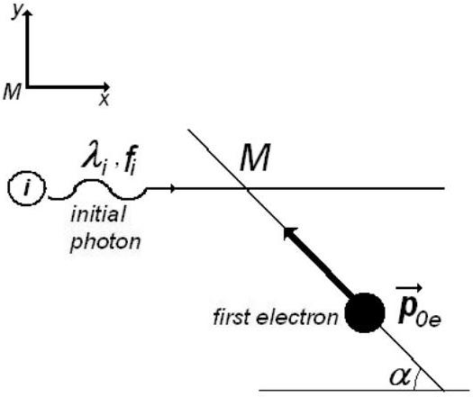
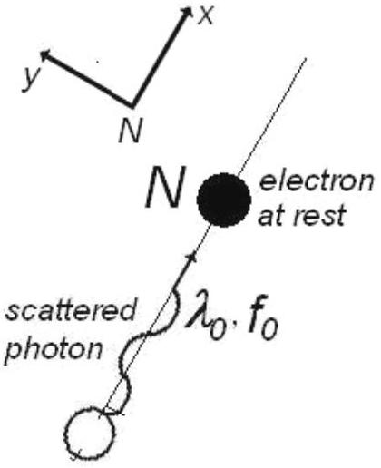
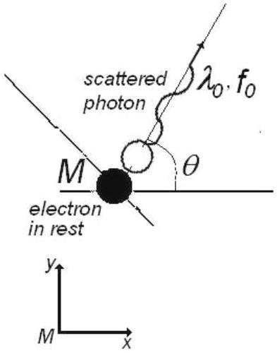
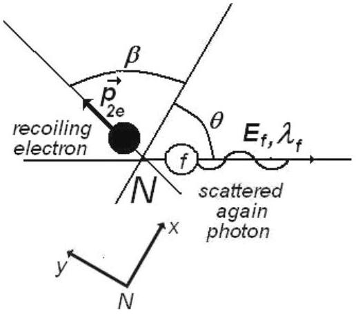

## Atomics - Problem IV (7 points)

## Compton scattering

A photon of wavelength $\lambda _ { i }$ is scattered by a moving, free electron. As a result the electron stops and the resulting photon of wavelength $\lambda _ { 0 }$ scattered at an angle $\theta = 60 ^ { \circ }$ with respect to the direction of the incident photon, is again scattered by a second free electron at rest. In this second scattering process a photon with wavelength of $\lambda _ { f } = 1,25 \times 10 ^ { - 10 } \mathrm {~m}$ emerges at an angle $\theta = 60 ^ { \circ }$ with respect to the direction of the photon of wavelength $\lambda _ { 0 }$. Find the de Broglie wavelength for the first electron before the interaction. The following constants are known:
$h = 6,6 \times 10 ^ { - 34 } J \cdot s$ - Planck's constant
$m = 9,1 \times 10 ^ { - 31 } k g$ - mass oh the electron
$c = 3,0 \times 10 ^ { 8 } m / s$ - speed of light in vacuum

## Problem III - Solution

The purpose of the problem is to calculate the values of the speed, momentum and wavelength of the first electron.

To characterize the photons the following notation are used:

Table 4.1
|  | initial photon | photon after the first scattering | final photon |
| :--- | :--- | :--- | :--- |
| momentum | $\vec { p } _ { i }$ | $\vec { p } _ { 0 }$ | $\vec { p } _ { f }$ |
| energy | $E _ { i }$ | $E _ { 0 }$ | $E _ { f }$ |
| wavelength | $\lambda _ { i }$ | $\lambda _ { i }$ | $\lambda _ { f }$ |

To characterize the electrons one uses

Table 4.2
|  | first electron before collision | first electron after collision | second electron before collision | Second electron after collision |
| :--- | :--- | :--- | :--- | :--- |
| momentum | $\vec { p } _ { 1 e }$ | 0 | 0 | $\vec { p } _ { 2 e }$ |
| energy | $E _ { 1 e }$ | $E _ { 0 e }$ | $E _ { 0 e }$ | $E _ { 2 e }$ |
| speed | $\vec { V } _ { 1 e }$ | 0 | 0 | $\vec { V } _ { 2 e }$ |

The image in figure 4.1 presents the situation before the first scattering of photon.

Figure 4.1

Figure 4.3

Figure 4.2

Figure 4.4

To characterize the initial photon we will use his momentum $\vec { p } _ { i }$ and his energy $E _ { i }$

$$
\begin{align*}
& \left\{ \begin{array} { l }
\vec { P } _ { i } = \frac { h } { \lambda _ { i } } = \frac { h \cdot f _ { i } } { c } \\
E _ { i } = h \cdot f _ { i }
\end{array} \right.  \tag{4.1}\\
& f _ { i } = \frac { c } { \lambda _ { i } } \tag{4.2}
\end{align*}
$$

is the frequency of initial photon.
For initial, free electron in motion the momentum $\vec { p } _ { o e }$ and the energy $E _ { o e }$ are

$$
\left\{ \begin{array} { l }
\vec { P } _ { o e } = m \cdot \vec { v } _ { 1 e } = \frac { m _ { 0 } \cdot \vec { v } _ { 1 e } } { \sqrt { 1 - \beta ^ { 2 } } }  \tag{4.3}\\
E _ { o e } = m \cdot c ^ { 2 } = \frac { m _ { 0 } \cdot c ^ { 2 } } { \sqrt { 1 - \beta ^ { 2 } } }
\end{array} \right.
$$

where $m _ { 0 }$ is the rest mass of electron and $m$ is the mass of moving electron. As usual, $\beta = \frac { v _ { 1 e } } { c }$. De Broglie wavelength of the first electron is

$$
\lambda _ { o e } = \frac { h } { p _ { 0 e } } = \frac { h \cdot } { m _ { 0 } \cdot v _ { 1 e } } \sqrt { 1 - \beta ^ { 2 } }
$$

The situation after the scattering of photon is described in the figure 4.2.
To characterize the scattered photon we will use his momentum $\vec { p } _ { 0 }$ and his energy $E _ { 0 }$

$$
\left\{ \begin{array} { l }
\vec { P } _ { 0 } = \frac { h } { \lambda _ { 0 } } = \frac { h \cdot f _ { 0 } } { c }  \tag{4.4}\\
E _ { 0 } = h \cdot f _ { 0 }
\end{array} \right.
$$

where

$$
\begin{equation*}
f _ { o } = \frac { c } { \lambda _ { 0 } } \tag{4.5}
\end{equation*}
$$

is the frequency of scattered photon.
The magnitude of momentum of the electron ( that remains in rest) after the scattering is zero; his energy is $E _ { 1 e }$. The mass of electron after collision is $m _ { 0 }$ - the rest mass of electron at rest. So,

$$
E _ { 1 \theta } = m _ { 0 } \cdot c ^ { 2 }
$$

To determine the moment of the first moving electron, one can write the principles of conservation of moments and energy. That is

$$
\begin{equation*}
\vec { P } _ { i } + \vec { p } _ { o e } = \vec { p } _ { 0 } \tag{4.6}
\end{equation*}
$$

and

$$
\begin{equation*}
E _ { i } + E _ { 0 e } = E _ { 0 } + E _ { 1 e } \tag{4.7}
\end{equation*}
$$

The conservation of moment on $O x$ direction is written as

$$
\begin{equation*}
\frac { h \cdot f _ { i } } { c } + m \cdot v _ { 1 e } \cdot \cos \alpha = \frac { h \cdot f _ { 0 } } { c } \cos \theta \tag{4.8}
\end{equation*}
$$

and the conservation of moment on $O$ y is

$$
\begin{equation*}
m \cdot v _ { 1 e } \cdot \sin \alpha = \frac { h \cdot f _ { 0 } } { c } \sin \theta \tag{4.9}
\end{equation*}
$$

To eliminate $\alpha$, the last two equation must be written again as

$$
\left\{ \begin{array} { l }
\left( m \cdot v _ { 1 e } \cdot \cos \alpha \right) ^ { 2 } = \frac { h ^ { 2 } \cdot } { c ^ { 2 } } \left( f _ { 0 } \cdot \cos \theta - f _ { i } \right) ^ { 2 }  \tag{4.10}\\
\left( m \cdot v _ { 1 e } \cdot \sin \alpha \right) ^ { 2 } = \left( \frac { h \cdot f _ { 0 } } { c } \sin \theta \right) ^ { 2 }
\end{array} \right.
$$

and then added.
The result is

$$
\begin{equation*}
m ^ { 2 } \cdot v _ { 1 e } ^ { 2 } = \frac { h ^ { 2 } \cdot \left( f _ { 0 } ^ { 2 } + f _ { 1 } ^ { 2 } - 2 f _ { 0 } \cdot f _ { i } \cdot \cos \theta \right) } { c ^ { 2 } } \tag{4.11}
\end{equation*}
$$

or

The conservation of energy（4．7）can be written again as

$$
\begin{equation*}
m \cdot c ^ { 2 } + h \cdot f _ { 1 } = m _ { 0 } \cdot c ^ { 2 } + h \cdot f _ { 0 } \tag{4.13}
\end{equation*}
$$

or

$$
\begin{equation*}
\frac { m _ { 0 } \cdot c ^ { 2 } } { \sqrt { 1 - \left( \frac { v _ { 1 e } } { c } \right) ^ { 2 } } } = m _ { 0 } \cdot c ^ { 2 } + h \cdot \left( f _ { 0 } - f _ { 1 } \right) \tag{4.14}
\end{equation*}
$$

Squaring the last relation results

$$
\begin{equation*}
\frac { m _ { 0 } ^ { 2 } \cdot c ^ { 4 } } { 1 - \left( \frac { v _ { 1 e } } { c } \right) ^ { 2 } } = m _ { 0 } ^ { 2 } \cdot c ^ { 4 } + h ^ { 2 } \cdot \left( f _ { 0 } - f _ { 1 } \right) ^ { 2 } + m _ { 0 } \cdot h \cdot c ^ { 2 } \cdot \left( f _ { 0 } - f _ { 1 } \right) \tag{4.15}
\end{equation*}
$$

Subtracting（4．12）from（4．15）the result is

$$
\begin{equation*}
2 m _ { 0 } \cdot c ^ { 2 } \cdot h \cdot \left( f _ { 0 } - f _ { 1 } \right) + 2 h ^ { 2 } \cdot f _ { 1 } \cdot f _ { 0 } \cdot \cos \theta - 2 h ^ { 2 } \cdot f _ { 1 } \cdot f = 0 \tag{4.16}
\end{equation*}
$$

or

$$
\begin{equation*}
\frac { h } { m _ { 0 } \cdot c } ( 1 - \cos \theta ) = \frac { c } { f _ { 1 } } - \frac { c } { f _ { 0 } } \tag{4.17}
\end{equation*}
$$

Using

$$
\begin{equation*}
\Lambda = \frac { h } { m _ { 0 } \cdot c } \tag{4.18}
\end{equation*}
$$

the relation（4．17）becomes

$$
\begin{equation*}
\Lambda \cdot ( 1 - \cos \theta ) = \lambda _ { i } - \lambda _ { 0 } \tag{4.19}
\end{equation*}
$$

The wavelength of scattered photon is

$$
\begin{equation*}
\lambda _ { 0 } = \lambda _ { i } - \Lambda \cdot ( 1 - \cos \theta ) \tag{4.20}
\end{equation*}
$$

shorter than the wavelength of initial photon and consequently the energy of scattered photon is greater that the energy of initial photon．

$$
\left\{ \begin{array} { l }
\lambda _ { i } < \lambda _ { 0 }  \tag{4.21}\\
E _ { i } > E _ { 0 }
\end{array} \right.
$$

Let＇s analyze now the second collision process that occurs in point $N$ ．To study that，let＇s consider a new referential having $O x$ direction on the direction of the photon scattered after the first collision．

The figure 4.3 presents the situation before the second collision and the figure 4.4 presents the situation after this scattering process. The conservation principle for moment in the scattering process gives

$$
\left\{ \begin{array} { l }
\frac { h } { \lambda _ { 0 } } = \frac { h } { \lambda _ { f } } \cos \theta + m \cdot v _ { 2 e } \cdot \cos \beta  \tag{4.22}\\
\frac { h } { \lambda _ { f } } \sin \theta - m \cdot v _ { 2 e } \cdot \sin \beta = 0
\end{array} \right.
$$

To eliminate the unknown angle $\beta$ must square and then add the equations (4.22)
That is

$$
\left\{ \begin{array} { l }
\left( \frac { h } { \lambda _ { 0 } } - \frac { h } { \lambda _ { f } } \cos \theta \right) ^ { 2 } = \left( m \cdot v _ { 2 e } \cdot \cos \beta \right) ^ { 2 }  \tag{4.23}\\
\left( \frac { h } { \lambda _ { f } } \sin \theta \right) ^ { 2 } = \left( m \cdot v _ { 2 e } \cdot \sin \beta \right) ^ { 2 }
\end{array} \right.
$$

or

$$
\begin{equation*}
\left( \frac { h } { \lambda _ { f } } \right) ^ { 2 } + \left( \frac { h } { \lambda _ { 0 } } \right) ^ { 2 } - \frac { 2 \cdot h ^ { 2 } } { \lambda _ { 0 } \cdot \lambda _ { f } } \cos \theta = \left( m \cdot v _ { 2 e } \right) ^ { 2 } \tag{4.24}
\end{equation*}
$$

The conservation principle of energy in the second scattering process gives

$$
\begin{equation*}
\frac { h \cdot c } { \lambda _ { 0 } } + m _ { 0 } \cdot c ^ { 2 } = \frac { h \cdot c } { \lambda _ { f } } + m \cdot c ^ { 2 } \tag{4.25}
\end{equation*}
$$

(4.24) and (4.25) gives

$$
\begin{equation*}
\frac { h ^ { 2 } \cdot c ^ { 2 } } { \lambda _ { f } ^ { 2 } } + \frac { h ^ { 2 } \cdot c ^ { 2 } } { \lambda _ { 0 } ^ { 2 } } - \frac { 2 \cdot h ^ { 2 } \cdot c ^ { 2 } } { \lambda _ { 0 } \cdot \lambda _ { f } } \cos \theta = m ^ { 2 } \cdot c ^ { 2 } \cdot v _ { 2 e } ^ { 2 } \tag{4.26}
\end{equation*}
$$

and

$$
\begin{equation*}
h ^ { 2 } \cdot c ^ { 2 } \cdot \left( \frac { 1 } { \lambda _ { f } } - \frac { 1 } { \lambda _ { 0 } } \right) ^ { 2 } + m _ { 0 } ^ { 2 } \cdot c ^ { 4 } + 2 h \cdot c ^ { 3 } \cdot m _ { 0 } \cdot \left( \frac { 1 } { \lambda _ { f } } - \frac { 1 } { \lambda _ { 0 } } \right) = m ^ { 2 } \cdot c ^ { 4 } \tag{4.27}
\end{equation*}
$$

Subtracting (4.26) from (1.27), one obtain

$$
\left\{ \begin{array} { l }
\frac { h } { m _ { 0 } \cdot c } \cdot ( 1 - \cos \theta ) = \lambda _ { f } - \lambda _ { 0 }  \tag{4.28}\\
\lambda _ { f } - \lambda _ { 0 } = \Lambda \cdot ( 1 - \cos \theta )
\end{array} \right.
$$

That is

$$
\left\{ \begin{array} { l }
\lambda _ { f } > \lambda _ { 0 }  \tag{4.29}\\
E _ { f } < E _ { 0 }
\end{array} \right.
$$

Because the value of $\lambda _ { f }$ is know and $\Lambda$ can be calculate as

$$
\left\{ \begin{array} { l }
\lambda _ { f } = 1,25 \times 10 ^ { - 10 } \mathrm {~m}  \tag{4.30}\\
\Lambda = \frac { 6,6 \times 10 ^ { - 34 } } { 9,1 \times 10 ^ { - 31 } \cdot 3 \times 10 ^ { 8 } } \mathrm {~m} = 2,41 \times 10 ^ { - 12 } \mathrm {~m} = 0,02 \times 10 ^ { - 10 } \mathrm {~m}
\end{array} \right.
$$

the value of wavelength of photon before the second scattering is

$$
\begin{equation*}
\lambda _ { 0 } = 1,23 \times 10 ^ { - 10 } \mathrm {~m} \tag{4.31}
\end{equation*}
$$

Comparing (4.28) written as:

$$
\begin{equation*}
\lambda _ { f } = \lambda _ { 0 } + \Lambda \cdot ( 1 - \cos \theta ) \tag{4.32}
\end{equation*}
$$

and (4.20) written as

$$
\begin{equation*}
\lambda _ { i } = \lambda _ { 0 } + \Lambda \cdot ( 1 - \cos \theta ) \tag{4.33}
\end{equation*}
$$

clearly results

$$
\begin{equation*}
\lambda _ { i } = \lambda _ { f } \tag{4.34}
\end{equation*}
$$

The energy of the double scattered photon is the same as the energy of initial photon. The direction of "final photon" is the same as the direction of "initial" photon. Concluding, the final photon is identical with the initial photon. The result is expected because of the symmetry of the processes.
Extending the symmetry analyze on electrons, the first moving electron that collides the initial photon and after that remains at rest, must have the same momentum and energy as the second electron after the collision - because this second electron is at rest before the collision.
That is

$$
\left\{ \begin{array} { l }
\vec { p } _ { 1 e } = \vec { p } _ { 2 e }  \tag{4.35}\\
E _ { 1 e } = E _ { 2 e }
\end{array} \right.
$$

Taking into account (4.24), the moment of final electron is

$$
\begin{equation*}
p _ { 2 e } = h \sqrt { \frac { 1 } { \lambda _ { f } ^ { 2 } } + \frac { 1 } { \left( \lambda _ { f } - \Lambda ( 1 - \cos \theta ) \right) ^ { 2 } } - \frac { 2 \cdot \cos \theta } { \lambda _ { f } \cdot \left( \lambda _ { f } - \Lambda ( 1 - \cos \theta ) \right) } } \tag{4.36}
\end{equation*}
$$

The de Broglie wavelength of second electron after scattering (and of first electron before scattering) is

$$
\begin{equation*}
\lambda _ { 1 e } = \lambda _ { 2 e } = 1 / \left( \sqrt { \frac { 1 } { \lambda _ { f } ^ { 2 } } + \frac { 1 } { \left( \lambda _ { f } - \Lambda ( 1 - \cos \theta ) \right) ^ { 2 } } - \frac { 2 \cdot \cos \theta } { \lambda _ { f } \cdot \left( \lambda _ { f } - \Lambda ( 1 - \cos \theta ) \right) } } \right) \tag{4.37}
\end{equation*}
$$

Numerical value of this wavelength is

$$
\begin{equation*}
\lambda _ { 1 e } = \lambda _ { 2 e } = 1,24 \times 10 ^ { - 10 } \mathrm {~m} \tag{4.38}
\end{equation*}
$$

Professor Delia DAVIDESCU, National Department of Evaluation and Examination-Ministry of Education and Research- Bucharest, Romania
Professor Adrian S.DAFINEI,PhD, Faculty of Physics - University of Bucharest, Romania
