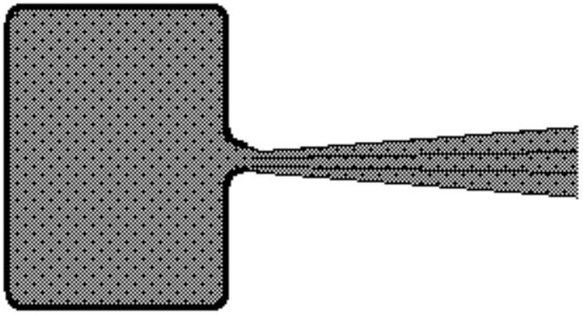
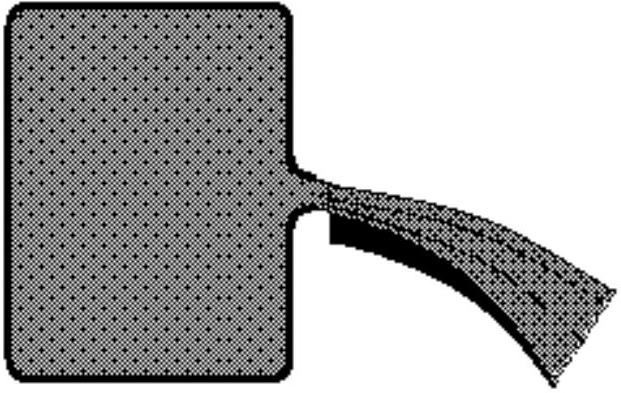

## IPhO's LOGO - Problem V

The Logo of the International Physics Olympiad is represented in the figure below.
The figure presents the phenomenon of the curving of the trajectory of a jet of fluid around the shape of a cylindrical surface. The trajectory of fluid is not like the expected dashed line but as the circular solid line.
Qualitatively explain this phenomenon (first observed by Romanian engineer Henry Coanda in 1936).
This problem will be not considered in the general score of the Olympiad. The best solution will be awarded a special prize.

Figure 5.1

## Probsem V -Solution

Suppose a fluid is in a recipient at a constant pressure. If a thin jet of fluid (gas or liquid) having a small circular or rectangular cross section leaves the recipient through a nozzle entering the medium, the particles belonging to the medium will be carried out by the jet. Other particles belonging to the medium will be attracted to the jet.
If the jet flows over a large surface, the particles belonging to the medium over the jet and the particles leaving between the jet and the surface will be carried out by the jet. The density of particles over the jet remains constant because of newly arriving particles, but the particles between the surface and the jet cannot be replaced. A pressure difference appears between the upper and lower side of the jet, pushing the jet to the surface. If the surface is curved, the jet will follow its shape.
The left image in the figure below presents the normal flow of a fluid jet leaving through a nozzle of a recipient with a high, constant pressure. The final pressure of the fluid is of medium pressure.
The right image in the figure below presents the flow of a fluid over the large surface. The jet is "stuck"

against the surface.

The process of deflection of the jet increases the speed of the jet without any variation of the pressure and temperature of the jet.
During the tests of the first jet plane in Paris, December 1936, the Romanian engineer Henry Coanda was the first to observe this phenomenon, occurring when the flames of the engine passed through a flap.

The logo of the Olympiad illustrates the Coanda flow of a fluid.

Professor Delia DAVIDESCU, National Department of Evaluation and Examination-Ministry of Education and Research- Bucharest, Romania
Professor Adrian S.DAFINEI,PhD, Faculty of Physics - University of Bucharest, Romania
