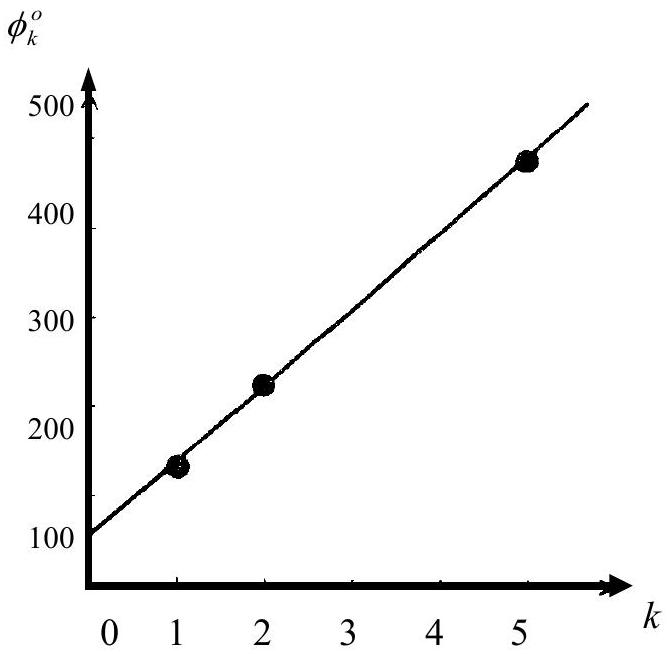
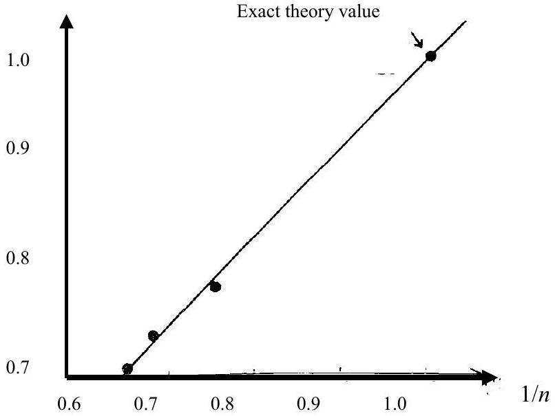
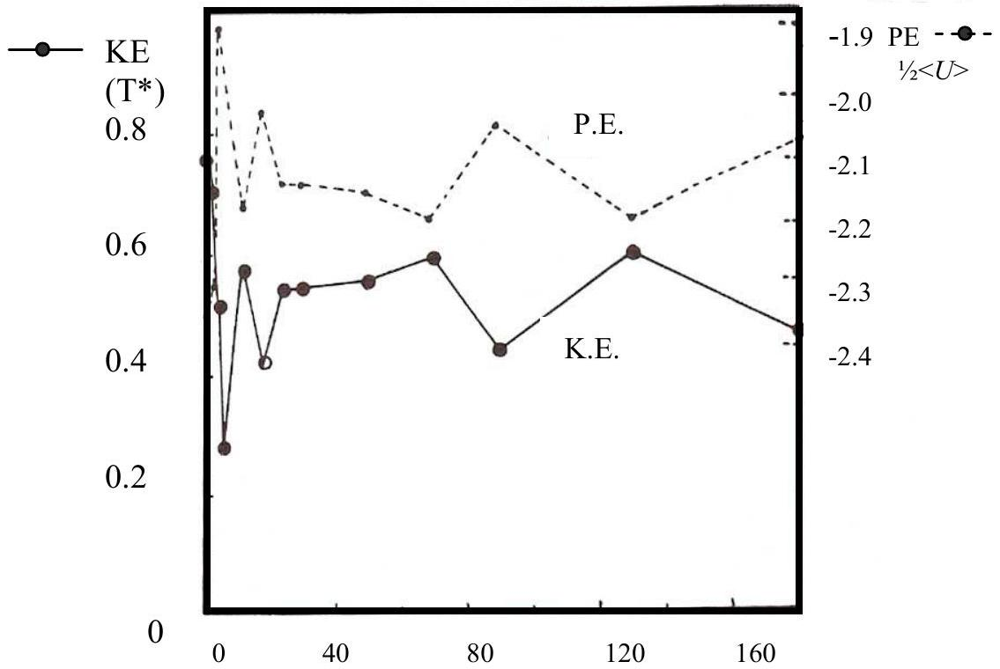
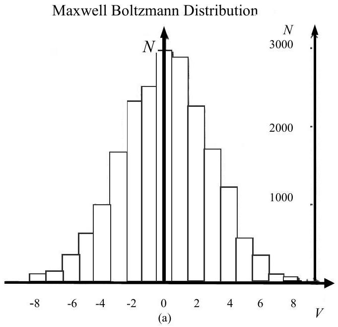
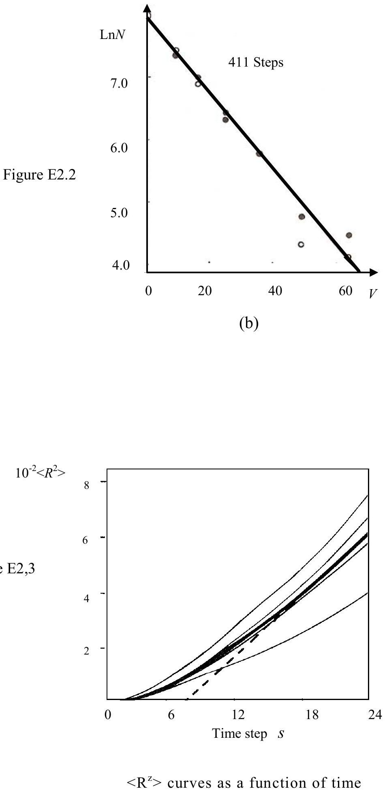

## SUMMARY SHEET

## EXPERIMENT 1

1. FOR WATER AND RED LIGHT AT EXTREME END OF SPECTRUM

| $\mathrm { k } = 1$ | First Order Rainbow | $\theta _ { 1 } = 129.0 ^ { \circ }$ | $\phi _ { 1 } = 137.0 \pm 5.0 ^ { \circ }$ |
| :--- | :--- | :--- | :--- |
| $\mathrm { k } = 2$ | Second Order Rainbow | $\theta _ { 2 } = 129.0 ^ { \circ }$ | $\phi _ { 2 } = 231.0 \pm 3.0 ^ { \circ }$ |
| $\mathrm { k } = 5$ | Fifth Order Rainbow | $\theta _ { 5 } = 126.0 ^ { \circ }$ | $\phi _ { 5 } = 486.0 \pm 4.0 ^ { \circ }$ |

2. LIQUIDS A AND B USING SECOND ORDER RAINBOWS

| For Liquid A | $\theta _ { 2 } = 105.0 ^ { \circ }$ | $\phi _ { 2 } = 255.0 \pm 3.0 ^ { \circ }$ |
| :--- | :--- | :--- |
| For Liquid B | $\theta _ { 2 } = 89.5 ^ { \circ }$ | $\phi _ { 2 } = 270.5 \pm 3.0 ^ { \circ }$ |
| For $n = 1$ | $\theta _ { 2 } = 0.0 . ^ { \circ }$ | $\phi _ { 2 } = 0.0 . ^ { \circ }$ |
| Gradient of graph |  | $= 0.84 \pm 0.07$ |
| Extrapolated, $n = 2$, | $\theta _ { 2 }$, value of $\phi$ | $= 304 \pm 25 ^ { \circ }$ |

Figure E 1.1.

Figure E 1.2

## SUMMARY SHEET

## EXPERIMENT 2

Is the total momentum conserved?
Accuracy of computer calculation
(RMS velocity $= 0.1 )$

YES /DO

$$
100 \frac { 0.0000018 } { 0.1 } \approx 0.002 \% 0 : 1
$$

| Time | Total Energy |
| :--- | :--- |
| 0 | -1.61499 |
| 2 | -1.62886 |
| 4 | -1.62878 |
| 6 | -1.62301 |
| 12 | -1.62882 |
| 18 | -1.62599 |
| 24 | -1.62796 |
| 30 | -1.62703 |
| 50 | -1.62753 |
| 70 | -1.62676 |
| 90 | -1.62580 |
| 130 | -1.62713 |
| 180 | -1.62409 |

Does the system conserve energy? YES/NØ (~ ± 1\%)

| Equilibrium value of $E _ { k } { } ^ { * }$ | (Average 24 to 180) | $= 0.534 \pm 0.05$ |
| :--- | :--- | :--- |
| Equilibrium time SD | (see Fig. E 2.1) | $\cong ( 10 t 020 ) \times 0.1$ |
| Value of $S$ recorded |  | > 20, e.g. 60 |
| Value of $\alpha$ (for $S D = 60$ ) | (see Fig. E2.2) | $= 0.503$ |
| Accuracy of $\alpha$ |  | $= \pm 0.02$ |

For what time number range is graph, obtained using first value of $S R$, linear? $S Z = 18$ to 24

| Gradient of this graph in linear region | $\cong 0.027$ to 0.47 |
| :--- | :--- |
| Accuracy of gradient | = 0.002 |
| Gradient of AVERAGE $< R ^ { 2 } >$ in linear region | $= 0.035$ |
| Accuracy of this gradient | $= \pm 0.01$ |
| * delete as appropriate |  |

Is the system a liquid/solid?
Liquid/Solid*

Mean Momentum of the system at requested steps $( S )$

| $S$ | $< V X , 1 >$ | $\langle V Y , 1 \rangle$ | $< P X >$ | $< P Y >$ |
| :--- | :--- | :--- | :--- | :--- |
| 0 | 0.0000000 | 0.0000000 | 0.000000 | 0.000000 |
| 40 | 0.0000010 | 0.0000016 | 0.000048 | 0.000077 |
| 80 | 0.0000018 | 0.0000001 | 0.000086 | 0.000005 |
| 120 | 0.0000014 | 0.0000007 | 0.000067 | 0.000034 |
| 160 | 0.0000016 | 0.0000010 | 0.000077 | 0.000048 |

Energy of the system at requested steps ( $S$ )

| $S$ | <VX,2> | <VY,2> | $< K E > = T ^ { * }$ | $< U >$ | $\langle E \rangle =$ Total Energy |
| :--- | :--- | :--- | :--- | :--- | :--- |
| 0 | 0.0173874 | 0.0142851 | 0.760140 | -4.7502660 | -1.61499 |
| 2 | 0.0162506 | 0.0131025 | 0.704474 | -4.6666675 | -1.62886 |
| 4 | 0.0124966 | 0.0089562 | 0.514867 | -4.2873015 | -1.62878 |
| 6 | 0.0077405 | 0.0039113 | 0.279643 | -3.8053113 | -1.62301 |
| 12 | 0.0118740 | 0.0120959 | 0.575278 | -4.4081878 | -1.62882 |
| 18 | 0.0099579 | 0.0075854 | 0.421039 | -4.0940627 | -1.62599 |
| 24 | 0.0108577 | 0.0116978 | 0.541332 | -4.3385782 | -1.62796 |
| 30 | 0.0126065 | 01000340 | 0.543372 | -4.3407997 | -1.62703 |
| 50 | 0.0127138 | 0.0103334 | 0.553133 | -4.3613165 | -1.62753 |
| 70 | 0.0088657 | 0.0158292 | 0.592678 | -4.4388669 | -1.62676 |
| 90 | 0.0107740 | 0.0076446 | 0.442087 | -4.1357699 | -1.62580 |
| 130 | 0.0073008 | 0.0177446 | 0.601090 | -4.4564333 | -1.62713 |
| 180 | 0.0097161 | 0.0096426 | 0.464609 | -4.1773882 | -1.62409 |

All values are in reduced units. $\langle K E \rangle$ is the mean kinetic energy per atom. $\left\langle U ^ { * } \right\rangle$ is twice the potential energy. $\langle V X , 2 \rangle$ and $\langle V Y , 2 \rangle$ are the mean values of the squares of the $X$ and $Y$ velocity components, as described in the question. Similarly $< V X , 1 >$ and $< V Y , 1 >$ are the mean values of the velocity components. $\langle P X \rangle$ and $\langle P Y \rangle$ are the mean momentum per particle.

Figure E 2.1

Variation of K.E and P.E.

| Time Number SZ - S-SR | $\mathrm { SR } = 261 < \mathrm { R } ^ { 2 } >$ | $\mathrm { SR } = 301 < \mathrm { R } ^ { 2 } >$ | $\mathrm { SR } = 334 < \mathrm { R } ^ { 2 } >$ | $\mathrm { SR } = 370 < \mathrm { R } ^ { 2 } >$ | AVERAGE $< \mathrm { R } ^ { 2 } >$ |
| :--- | :--- | :--- | :--- | :--- | :--- |
| 0 | 0 | 0 | 0 | 0 | 0 |
| 2 | 0.00088 | 0.00067 | 0.00091 | 0.00079 | 0.00081 |
| 4 | 0.00287 | 0.00276 | 0.00382 | 0.00298 | 0.00311 |
| 6 | 0.00523 | 0.00628 | 0.00858 | 0.00623 | 0.00658 |
| 8 | 0.00797 | 0.01101 | 0.01449 | 0.01039 | 0.01097 |
| 10 | 0.01143 | 0.01656 | 0.02095 | 0.01523 | 0.01604 |
| 12 | 0.01528 | 0.02235 | 0.02768 | 0.02022 | 0.02138 |
| 14 | 0.01874 | 0.02845 | 0.03453 | 0.02564 | 0.02684 |
| 16 | 0.02184 | 0.03539 | 0.04157 | 0.03160 | 0.03260 |
| 18 | 0.02526 | 0.04293 | 0.04902 | 0.03833 | 0.03889 |
| 20 | 0.02979 | 0.05080 | 0.05718 | 0.04532 | 0.04577 |
| 22 | 0.03538 | 0.05918 | 0.06605 | 0.0510 | 0.05303 |
| 24 | 0.04063 | 0.06784 | 0.07533 | 0.05569 | 0.05987 |
