Answers Question 1

(i) Vector Diagram
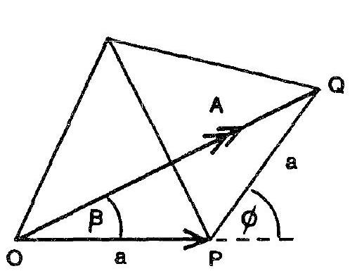
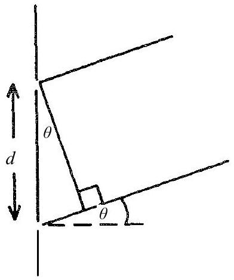
If the phase of the light from the first slit is zero, the phase from second slit is
$$
\phi = \frac { 2 \pi } { \lambda } d \sin \theta
$$
Adding the two waves with phase difference $\phi$ where $\xi = 2 \pi \left( f t - \frac { x } { \lambda } \right)$,
$$
\begin{aligned}
& a \cos ( \xi + \phi ) + a \cos ( \xi ) = 2 a \cos ( \phi / 2 ) ( \xi + \phi / 2 ) \\
& a \cos ( \xi + \phi ) + a \cos ( \xi ) = 2 a \cos \beta \{ \cos ( \xi + \beta ) \}
\end{aligned}
$$
This is a wave of amplitude $A = 2 a \cos \beta$ and phase $\beta$. From vector diagram, in isosceles triangle OPQ,
$$
\beta = \frac { 1 } { 2 } \phi = \frac { \pi } { \lambda } d \sin \theta \quad ( \text { NB } \phi = 2 \beta )
$$
and
$$
A = 2 a \cos \beta .
$$
Thus the sum of the two waves can be obtained by the addition of two vectors of amplitude a and angular directions 0 and $\phi$.
    (ii) Each slit in diffraction grating produces a wave of amplitude a with phase $2 \beta$ relative to previous slit wave. The vector diagram consists of a 'regular' polygon with sides of constant length $a$ and with constant angles between adjacent sides.
Let O be the centre of circumscribing circle passing through the vertices of the polygon. Then radial lines such as OS have length R and bisect the internal angles of the polygon. Figure 1.2.

Figure 1.2
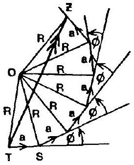

$$
\begin{aligned}
& \hat { O S T } = \hat { O T S } = \frac { 1 } { 2 } ( 180 - \phi ) \\
& \text { and } \hat { T O S } = \phi
\end{aligned}
$$

In the triangle TOS, for example

$$
\begin{gather*}
a = 2 R \sin ( \phi / 2 ) = 2 R \sin \beta \text { as } ( \phi = 2 \beta ) \\
\therefore R = \frac { a } { 2 \sin \beta } \tag{1}
\end{gather*}
$$

As the polygon has $N$ faces then:

$$
T \hat { O Z } = N ( T \hat { O Z } ) = N \phi = 2 N \beta
$$

Therefore in isosceles triangle TOZ, the amplitude of the resultant wave, TZ, is given by

$$
2 R \sin N \beta .
$$

Hence form (1) this amplitude is

$$
\frac { a \sin N \beta } { \sin \beta }
$$

Resultant phase is

$$
\begin{aligned}
& = Z \hat { T } S \\
& = O \hat { T } S - O \hat { T } Z \\
& \left( 90 - \frac { \phi } { 2 } \right) - \frac { 1 } { 2 } ( 180 - N \phi ) \\
& - \frac { 1 } { 2 } ( N - 1 ) \phi \\
& = ( N - 1 ) \beta
\end{aligned}
$$

(iii)
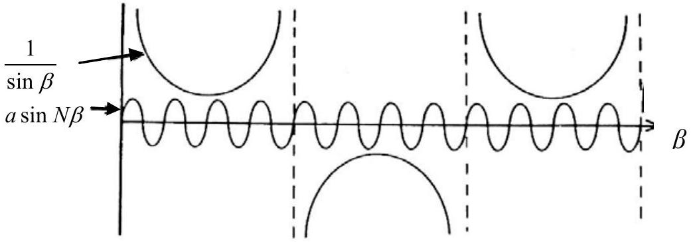
Intensity $I = \frac { a ^ { 2 } \sin ^ { 2 } N \beta } { \sin ^ { 2 } \beta }$

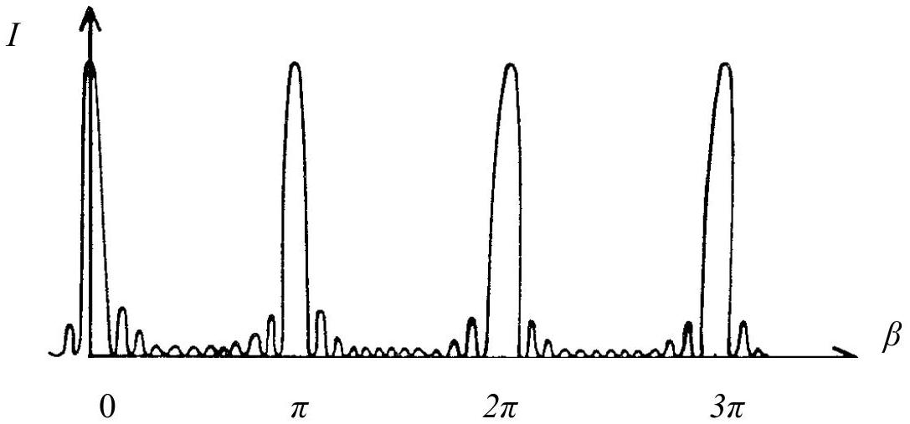

(iv) For the principle maxima $\beta = \pi p \quad$ where $p = 0 \pm 1 \pm 2 \ldots \ldots$.
$$
I _ { \max } = a ^ { 2 } \left( \frac { N \beta ^ { \prime } } { \beta ^ { \prime } } \right) = N ^ { 2 } a ^ { 2 } \quad \beta ^ { \prime } = 0 \text { and } \beta = \pi p + \beta ^ { \prime }
$$
(v) Adjacent max. estimate $I _ { 1 }$ :
$$
\sin ^ { 2 } N \beta = 1 , \quad \beta = 2 \pi p \mp \frac { 3 \pi } { 2 N } \text { i.e } \beta = \pm \frac { 3 \pi } { 2 N }
$$
$\left[ \beta = \pi p \pm \frac { \pi } { 2 N } \right]$ does not give a maximum as can be observed from the graph.
$$
I _ { 1 } = a ^ { 2 } \frac { 1 } { \frac { 3 \pi ^ { 2 } } { 2 n } } = \frac { a ^ { 2 } N ^ { 2 } } { 23 } \text { for } N \gg 1
$$
Adjacent zero intensity occurs for $\beta = \pi \rho \pm \frac { \pi } { N }$ i.e. $\delta = \pm \frac { \pi } { N }$
For phase differences much greater than $\delta , \quad \mathrm { I } = \mathrm { a } ^ { 2 } \left( \frac { \sin N \beta } { \sin \beta } \right) = a ^ { 2 }$.
(vi)
$$
\begin{aligned}
& \beta = n \pi \text { for a principle maximum } \\
& \text { i.e. } \frac { \pi } { \lambda } d \sin \theta = n \pi \quad n = 0 , \pm 1 , \pm 2 \ldots \ldots \ldots . . \\
& \text { Differentiating w.r.t, } \lambda \\
& d \cos \theta \Delta \theta = n \Delta \lambda \\
& \Delta \theta = \frac { n \Delta \lambda } { d \cos \theta }
\end{aligned}
$$
Substituting $\lambda = 589.0 \mathrm {~nm} , \lambda + \Delta \lambda = 589.6 \mathrm {~nm} . \mathrm { n } = 2$ and $d = 1.2 \times 10 ^ { - 6 } \mathrm {~m}$.
$$
\begin{aligned}
& \Delta \theta = \frac { n \Delta \lambda } { d \sqrt { 1 - \left( \frac { n \lambda } { d } \right) ^ { 2 } } } \text { as } \sin \theta = \frac { n \lambda } { d } \text { and } \cos \theta = \sqrt { 1 - \left( \frac { n \lambda } { d } \right) ^ { 2 } } \\
& \Rightarrow \Delta \theta = 5.2 \times 10 ^ { - 3 } \mathrm { rads } \text { or } 0.30 ^ { \circ }
\end{aligned}
$$

2.(i)
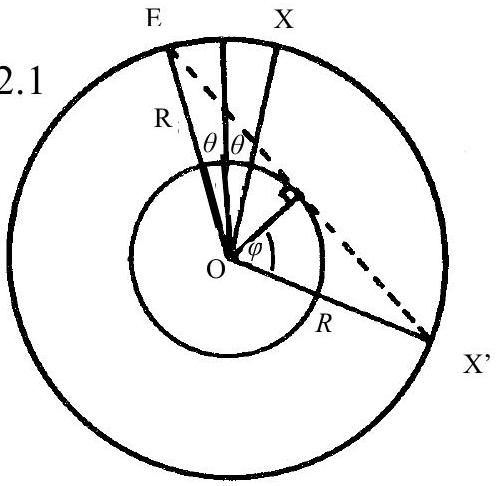

$$
\mathrm { EX } = 2 R \sin \theta \quad \therefore t = \frac { 2 R \sin \theta } { v }
$$

where $v = v _ { P }$ for P waves and $v = v _ { S }$ for S waves.
This is valid providing X is at an angular separation less than or equal to X', the tangential ray to the liquid core. X' has an angular separation given by, from the diagram,

$$
2 \phi = 2 \cos ^ { - 1 } \left( \frac { R _ { C } } { R } \right) ,
$$

Thus

$$
t = \frac { 2 R \sin \theta } { v } , \quad \text { for } \theta \leq \cos ^ { - 1 } \left( \frac { R _ { C } } { R } \right) ,
$$

where $v = v _ { \mathrm { P } }$ for P waves and $v = v _ { \mathrm { S } }$ for shear waves.
(ii) $\frac { R _ { C } } { R } = 0.5447 \quad$ and $\quad \frac { v _ { C P } } { v _ { P } } = 0.831 .3$

Figure 2.2
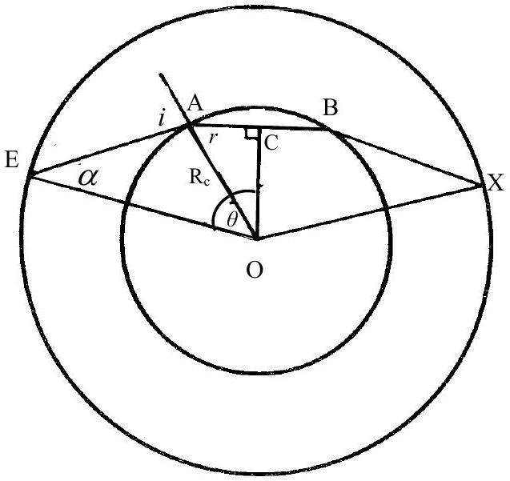

From Figure 2.2

$$
\begin{equation*}
\theta = \hat { A O C } + E \hat { O } A \Rightarrow \theta = ( 90 - r ) + ( 1 - \alpha ) \tag{1}
\end{equation*}
$$

(ii) Continued

Snell's Law gives:

$$
\begin{equation*}
\frac { \sin i } { \sin r } = \frac { v _ { P } } { v _ { C P } } . \tag{2}
\end{equation*}
$$

From the triangle EAO, sine rule gives

$$
\begin{equation*}
\frac { R _ { C } } { \sin x } = \frac { R } { \sin i } . \tag{3}
\end{equation*}
$$

Substituting (2) and (3) into (1)

$$
\begin{equation*}
\theta = \left[ 90 - \sin ^ { - 1 } \left( \frac { v _ { C P } } { v _ { P } } \sin i \right) + i - \sin ^ { - 1 } \left( \frac { R _ { C } } { R } \sin i \right) \right] \tag{4}
\end{equation*}
$$

(iii)

For Information Only
For minimum $\theta , \frac { d \theta } { d i } = 0 . \Rightarrow 1 - \frac { \left( \frac { v _ { C P } } { v _ { P } } \right) \cos i } { \sqrt { 1 - \left( \frac { v _ { C P } } { v _ { P } } \sin i \right) ^ { 2 } } } - \frac { \left( \frac { R _ { C } } { R } \right) \cos i } { { \sqrt { 1 - \left( \frac { R _ { C } } { R } \sin i \right) } } ^ { 2 } } = 0$
Substituting $i = 55.0 ^ { \circ }$ gives $\mathrm { LHS } = 0$, this verifying the minimum occurs at this value of $i$. Substituting $i = 55.0 ^ { \circ }$ into (4) gives $\theta = 75.8 ^ { 0 }$.
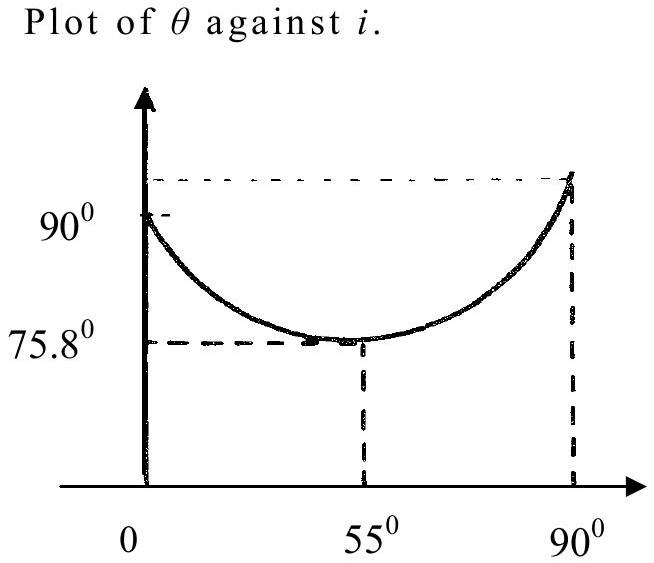

Substituting into 4:

$$
\begin{array} { l l }
i = 0 & \text { gives } \theta = 90 \\
i = 90 ^ { \circ } & \text { gives } \theta = 90.8 ^ { \circ }
\end{array}
$$

Substituting numerical values for $i = 0 \rightarrow 90 ^ { \circ }$ one finds a minimum value at $i = 55 ^ { \circ }$; the minimum values of $0 , \theta _ { \text {MIN } } = 75 \cdot 8 ^ { \circ }$.

Physical Consequence

As $\theta$ has a minimum value of $75 \cdot 8 ^ { \circ }$ observers at position for which $2 \theta < 151 \cdot 6 ^ { \circ }$ will not observe the earthquake as seismic waves are not deviated by angles of less than $151 \cdot 6 ^ { \circ }$. However for $2 \theta \leq 114 ^ { \circ }$ the direct, non-refracted, seismic waves will reach the observer.
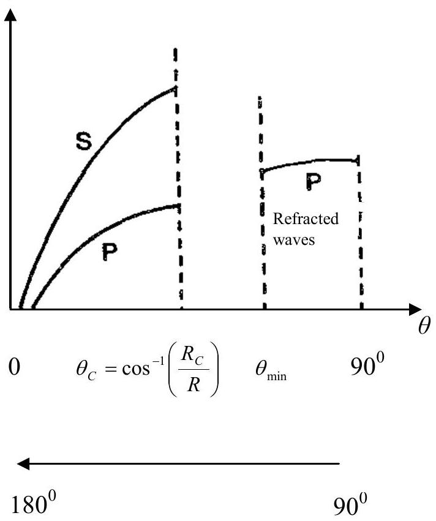

(iv) Using the result
$$
t = \frac { 2 r \sin \theta } { v }
$$
the time delay $\Delta t$ is given by
$$
\Delta t = 2 R \sin \theta \left[ \frac { 1 } { v _ { S } } - \frac { 1 } { v _ { P } } \right]
$$
Substituting the given data
$$
131 = 2 ( 6370 ) \left[ \frac { 1 } { 6.31 } - \frac { 1 } { 10.85 } \right] \sin \theta
$$
Therefore the angular separation of E and X is
$$
2 \theta = 17.84 ^ { \circ }
$$
This result is less than $2 \cos ^ { - 1 } \left( \frac { R _ { C } } { R } \right) = 2 \cos ^ { - 1 } \left( \frac { 3470 } { 6370 } \right) = 114 ^ { \circ }$
And consequently the seismic wave is not refracted through the core.

(v) 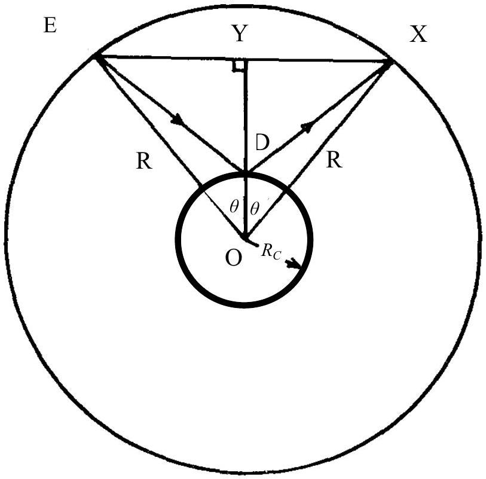
The observations are most likely due to reflections from the mantle-core interface. Using the symbols given in the diagram, the time delay is given by
$$
\begin{aligned}
& \Delta t ^ { \prime } = ( \mathrm { ED } + \mathrm { DX } ) \left[ \frac { 1 } { v _ { S } } - \frac { 1 } { v _ { P } } \right] \\
& \Delta t ^ { \prime } = 2 ( \mathrm { ED } ) \left[ \frac { 1 } { v _ { S } } - \frac { 1 } { v _ { P } } \right] \text { as } \mathrm { ED } = \mathrm { EX } \text { by symmetry }
\end{aligned}
$$

In the triangle EYD,

$$
\begin{aligned}
& ( \mathrm { ED } ) ^ { 2 } = ( R \sin \theta ) ^ { 2 } + \left( R \cos \theta - R _ { C } \right) ^ { 2 } \\
& ( \mathrm { ED } ) ^ { 2 } = R ^ { 2 } + R _ { C } ^ { 2 } - 2 R R _ { C } \cos \theta
\end{aligned} \quad \sin ^ { 2 } \theta + \cos ^ { 2 } \theta = 1
$$

Therefore

$$
\Delta t ^ { \prime } = 2 \sqrt { R ^ { 2 } + R _ { C } ^ { 2 } - 2 R R _ { C } \cos \theta } \left[ \frac { 1 } { v _ { S } } - \frac { 1 } { v _ { P } } \right]
$$

Using (ii)

$$
\begin{aligned}
& \Delta t ^ { \prime } = \frac { \Delta t } { R \sin \theta } \sqrt { R ^ { 2 } + R _ { C } ^ { 2 } - 2 R R _ { C } \cos \theta } \\
& \Rightarrow 396.7 \mathrm {~s} \text { or } 6 \mathrm {~m} 37 \mathrm {~s}
\end{aligned}
$$

Thus the subsequent time interval, produced by the reflection of seismic waves at the mantle core interface, is consistent with angular separation of $17.84 ^ { 0 }$.

Answer Q3
Equations of motion:

$$
\begin{aligned}
& m \frac { d ^ { 2 } u _ { 1 } } { d t ^ { 2 } } = k \left( u _ { 2 } - u _ { 1 } \right) + k \left( u _ { 3 } - u _ { 1 } \right) \\
& m \frac { d ^ { 2 } u _ { 2 } } { d t ^ { 2 } } = k \left( u _ { 3 } - u _ { 2 } \right) + k \left( u _ { 1 } - u _ { 2 } \right) \\
& m \frac { d ^ { 2 } u _ { 3 } } { d t ^ { 2 } } = k \left( u _ { 1 } - u _ { 3 } \right) + k \left( u _ { 2 } - u _ { 3 } \right)
\end{aligned}
$$

Substituting $u _ { n } ( t ) = u _ { n } ( 0 ) \cos \omega t$ and $\omega _ { o } { } ^ { 2 } = \frac { k } { m }$ :

$$
\begin{align*}
\left( 2 \omega _ { o } { } ^ { 2 } - \omega ^ { 2 } \right) u _ { 1 } ( 0 ) - \omega _ { o } { } ^ { 2 } u _ { 2 } ( 0 ) - \omega _ { o } { } ^ { 2 } u _ { 3 } ( 0 ) & = 0  \tag{a}\\
- \omega _ { o } { } ^ { 2 } u _ { 1 } ( 0 ) + \left( 2 \omega _ { o } { } ^ { 2 } - \omega ^ { 2 } \right) u _ { 2 } ( 0 ) - \omega _ { o } { } ^ { 2 } u _ { 3 } ( 0 ) & = 0  \tag{b}\\
- \omega _ { o } { } ^ { 2 } u _ { 1 } ( 0 ) - \omega _ { o } { } ^ { 2 } u _ { 2 } ( 0 ) + \left( 2 \omega _ { o } { } ^ { 2 } - \omega ^ { 2 } \right) u _ { 3 } ( 0 ) & = 0 \tag{c}
\end{align*}
$$

Solving for $u _ { 1 } ( 0 )$ and $u _ { 2 } ( 0 )$ in terms of $u _ { 3 } ( 0 )$ using (a) and (b) and substituting into (c) gives the equation equivalent to

$$
\begin{gathered}
\quad \left( 3 \omega _ { o } { } ^ { 2 } - \omega ^ { 2 } \right) ^ { 2 } \omega ^ { 2 } = 0 \\
\omega ^ { 2 } = 3 \omega _ { o } { } ^ { 2 } , 3 \omega _ { o } { } ^ { 2 } \text { and } 0 \\
\omega = \sqrt { 3 } \omega _ { o } , \sqrt { 3 } \omega _ { o } \text { and } 0
\end{gathered}
$$

(ii) Equation of motion of the n'th particle:

$$
\begin{aligned}
& m \frac { d ^ { 2 } u _ { n } } { d t ^ { 2 } } = k \left( u _ { 1 + n } - u _ { n } \right) + k \left( u _ { n - 1 } - u _ { n } \right) \\
& \frac { d ^ { 2 } u _ { n } } { d t ^ { 2 } } = k \left( u _ { 1 + n } - u _ { n } \right) + \omega _ { o } ^ { 2 } \left( u _ { n - 1 } - u _ { n } \right)
\end{aligned}
$$

Substituting $u _ { n } ( t ) = u _ { n } ( 0 ) \sin \left( 2 n s \frac { \pi } { N } \right) \cos \omega _ { s } t$

$$
\begin{aligned}
& - \omega _ { s } ^ { 2 } \left( \sin \left( 2 n s \frac { \pi } { N } \right) \right) = \omega _ { o } ^ { 2 } \left[ \sin \left( 2 ( n + 1 ) s \frac { \pi } { N } \right) - 2 \sin \left( 2 n s \frac { \pi } { N } \right) + \sin \left( 2 ( n - 1 ) s \frac { \pi } { N } \right) \right] \\
& - \omega _ { s } ^ { 2 } \left( \sin \left( 2 n s \frac { \pi } { N } \right) \right) = 2 \omega _ { o } ^ { 2 } \left[ \frac { 1 } { 2 } \sin \left( 2 ( n + 1 ) s \frac { \pi } { N } \right) + \sin \left( 2 n s \frac { \pi } { N } \right) - \frac { 1 } { 2 } \sin \left( 2 ( n - 1 ) s \frac { \pi } { N } \right) \right] \\
& - \omega _ { s } ^ { 2 } \left( \sin \left( 2 n s \frac { \pi } { N } \right) \right) = 2 \omega _ { o } ^ { 2 } \left[ \sin \left( 2 n s \frac { \pi } { N } \right) \cos \left( 2 s \frac { \pi } { N } \right) - \sin \left( 2 n s \frac { \pi } { N } \right) \right] \\
& \therefore \omega _ { s } ^ { 2 } = 2 \omega _ { o } ^ { 2 } \left[ 1 - \cos \left( 2 s \frac { \pi } { N } \right) \right] : \quad ( s = 1,2 , \ldots . . N )
\end{aligned}
$$

As $2 \sin ^ { 2 } \theta = 1 - \cos 2 \theta$
This gives

$$
\omega _ { s } = 2 \omega _ { o } \sin \left( \frac { s \pi } { N } \right) \quad ( s = 1,2 , \ldots N )
$$

$\omega _ { s }$ can have values from 0 to $2 \omega _ { o } = 2 \sqrt { \frac { k } { m } }$ when $N \rightarrow \infty$; corresponding to range $s = 1$ to $\frac { N } { 2 }$.

(iv) For s'th mode
$$
\frac { \frac { u _ { n } } { u _ { n + 1 } } = \frac { \sin \left( 2 n s \frac { \pi } { N } \right) } { \sin \left( 2 ( n + 1 ) s \frac { \pi } { N } \right) } } { \frac { u _ { n + 1 } } { u _ { n } } = \frac { \sin \left( 2 n s \frac { \pi } { N } \right) } { \sin \left( 2 n s \frac { \pi } { N } \right) \cos \left( 2 s \frac { \pi } { N } \right) + \cos \left( 2 n s \frac { \pi } { N } \right) \sin \left( 2 s \frac { \pi } { N } \right) } }
$$
(a) For small $\omega , \left( \frac { s } { N } \right) \approx 0$, thus $\cos \left( 2 n s \frac { \pi } { N } \right) \cong 1$ and $= \sin \left( 2 n s \frac { \pi } { N } \right) \approx 0$, and so $\frac { u _ { n } } { u _ { n + 1 } } \cong 1$.
(b) The highest mode, $\omega _ { \text {max } } = 2 \omega _ { o }$, corresponds to $s = N / 2$
$$
\therefore \frac { u _ { n } } { u _ { n + 1 } } = - 1 \text { as } \frac { \sin ( 2 n \pi ) } { \sin ( 2 ( n + 1 ) \pi ) } = - 1
$$

Case (a)
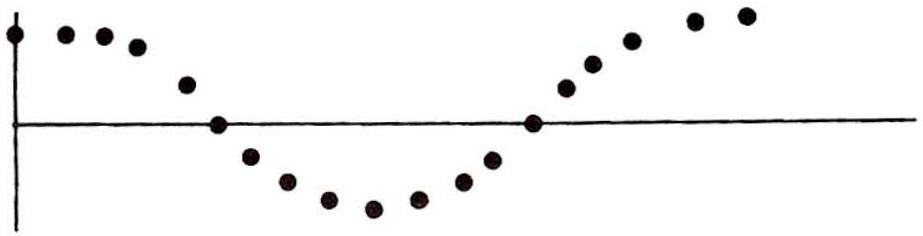

Case (b)
N odd
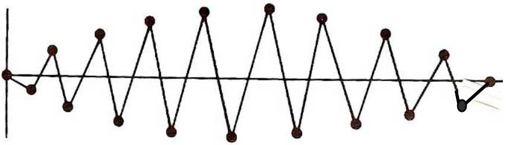

N even
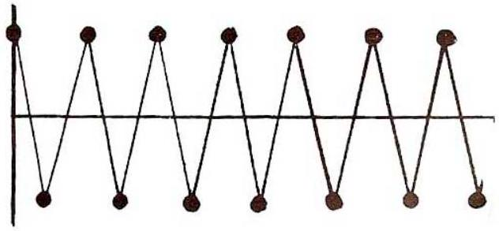

(vi) If $m ^ { \prime } \ll m$, one can consider the frequency associated with $m ^ { \prime }$ as due to vibration of $m ^ { \prime }$ between two adjacent, much heavier, masses which can be considered stationary relative to $m ^ { \prime }$.

The normal mode frequency of $m ^ { \prime }$, in this approximation, is given by
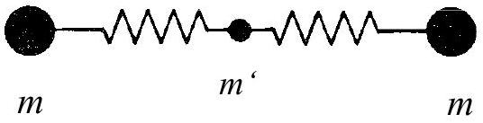

$$
\begin{aligned}
& m ^ { \prime } \ddot { x } = - 2 k x \\
& \omega ^ { \prime 2 } = \frac { 2 k } { m } \\
& \omega ^ { \prime } = \sqrt { \frac { 2 k } { m ^ { \prime } } }
\end{aligned}
$$

For small $m ^ { \prime } , \omega ^ { \prime }$ will be much greater than $\omega _ { \text {max } }$,
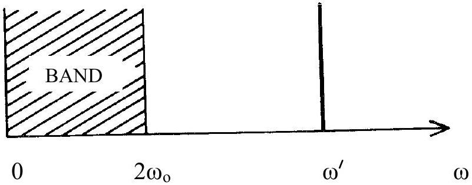

## DIATOMIC SYSTEM

More light masses, $m ^ { \prime }$, will increase the number of frequencies in region of $\omega ^ { \prime }$ giving a bandgap-band spectrum.
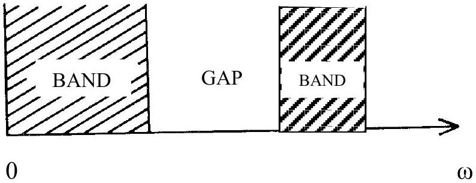
